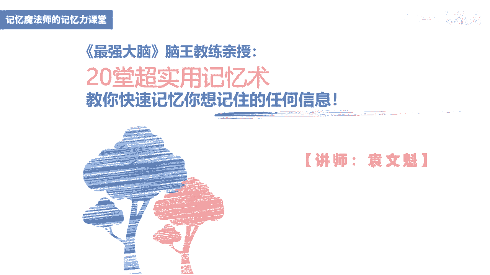
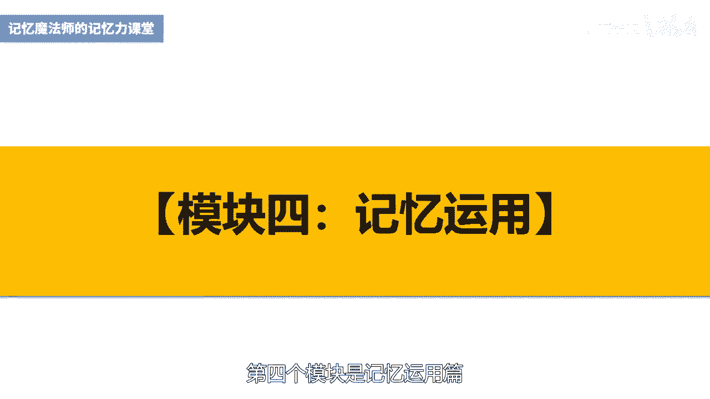

# 海马体记忆法：助你成为最强大脑 - P20：21 【学习攻略结束语】记忆有方法，实用最为王 - 清晖Amy - BV152tfe9Ev3

你好，我是记忆魔法师袁文魁，欢迎来到我的超强记忆力课程，让我们一起拥有超强记忆，创造学习奇迹。

转眼之间我们的课程就到了尾声，感谢大家对我的信任和支持，也感谢你自己坚持听完这20节课，在如今这个浮躁的时代，能够坚持听完一系列微课，确实不容易，更何况是如此骚扰的20节记忆力训练课，请为自己点个赞吧。

我们先来回顾一下这20节课，课程一共有四大模块，第一个模块呢是我们大脑系统篇，我带领大家一起消灭记忆路上的五大拦路虎，分别是自我设限，意愿不够，压力过大，能量匮乏和缺少方法，同时我从专注力。

想象力和创造力三个维度，带大家一起升级大脑系统，这些是记忆方法得以高效运用的保障，同时通过记忆法的训练呢，这三大脑力也会同时提升，让你的大脑潜能不断的被开发出来，第二个模块是非常重要的，记忆方法篇。

我分享了形象记忆法，配对联想法，身体定桩法，数字定桩法，记忆宫殿法，图像锁链法，情境故事法，字头勾结法，绘图记忆法等十种不同的方法，这些方法用来记忆单一的信息，有形象记忆法，用来记成对出现的信息。

有配对联想法，还有些呢是用来记忆有顺序的大量的并列信息，比如各种定桩法，锁链法，故事法和字头勾结法，那这些方法呢并没有优劣之分，它们各有不同的用途，我们都需要掌握它，当你打造好不同的武器。

面对记忆难题就能够运用自如，我在我的书籍记忆魔法师里，提到了信息记忆模型，你们有兴趣可以深入学习这个部分，第三个模块呢是记忆策略篇，可以辅助让记忆方法高效运用，我介绍了脑力策略，包括腹式呼吸。

还有积极的自我暗示等，都是非常有效的技巧，另外呢还包括时间管理策略和克服遗忘的复习，管理策略，帮助我们合理利用时间，在最佳的时间点来记忆和复习，可以达到事半功倍的效果，第四个模块是记忆运用篇。

我一直喜欢说一句话，记忆有方法，实用最为王，用不出来的记忆法只是屠龙之技，过去呢我曾经用它帮助我学习高中文科，考取了武汉大学，也曾用它挑战完道德经，易经等国学经典，挑战完大学四级和六级的英语单词。

并且呢也在教师资格证，心理咨询师资格证等考试中使用记忆法来复习，我的学生也将其运用于司法考试，学校教学演讲，汇报家居生活等各个领域，所以记忆法的运用范围是很广的，因为听这一系列的课程的人群较为分散。

每个人运用的领域也不同，所以呢我主要分享了几大运用，包括英语单词记忆，数字信息的记忆，阅读书籍的记忆，以及在社交场合和职场工作中的运用，希望大家能够将这些方法，迁移运用于你所在的领域。

也许你自己也可以成为所在领域的记忆大师，在这里我也给大家分享一些，成为记忆高手的经验，第一个万事开头难，切不可轻言放弃，有很多初学者看了我的书籍，或者花上万块钱学习我的课程。

但是呢刚学完之后就会觉得有一点麻烦，好像自己的想象力不够，然后就开始否定自己，认为自己不适合学习这种方法，这其实是学习任何新技能都会有的现象，我最近呢在尝试用电动牙刷，刚开始真是不习惯啊。

老是担心会把牙震坏了，而且很怕洗不干净，洗的时候速度也很慢，我还得张开嘴巴盯着我的牙刷，看着他一颗颗的刷牙，这场面呢看着挺狼狈的，我第三天呢还偷偷的换回了传统的牙刷，刷起来就舒服很多，但是我告诉自己。

如果不尝试去坚持，我可能永远不知道电动牙刷的好处，于是呢就坚持下来，那现在呢已经非常熟练了，学习记忆法呢也是如此，我曾经在用记忆法时也很别扭，但是用了两三周就慢慢适应了，在经过记忆比赛的几个月的训练。

就形成了本能，反应速度自然比死记硬背要快太多了，现在你要收回我的记忆技能，打死我，我也不干了，第二个听课只是知道知道不等于做到，做到不等于做好，要想成为高手，必须要刻意练习记忆法的知识。

不等于已掌握的技能，我遇到过很多记忆爱好者，阅读过海量的记忆书籍，也报名了不少最强大佬的微课，他们变成了一个研究者，但是自身的记忆技能依然是原地踏步，不去用，再好的记忆法都没有用，那怎么练习呢。

专业的基于选手的话呢，他们有专业的练习，比如说练习数字扑克，历史年代，人民头像等比赛的项目，一般经过半年到一年的练习，可以将自己的记忆能力提升到新的等级，甚至有些人可以成为世界记忆大师。

但是呢如果只是在学习和工作中运用，我推荐一种练习，就是大量的实战练习，遇到难记的知识就马上用记忆法来尝试，一回生二回熟，多用几次速度就快了，我在高中自学记忆法，我的训练就是用来记忆政史地的知识。

和语文的文章，大学报班学记忆法，最初的训练就是用来背诵专业课知识，国学经典和英语单词，想想看你学习记忆法的初衷是什么，想在哪个领域来运用它，先从你手头要记的东西开始，因为这样你的动力更加强大。

记忆的兴趣就更加浓厚，也更容易积累记忆的成就感，并由这个点延伸到其他领域，我自己呢也是由学科实用领域开始，慢慢过渡到参加记忆比赛，成为世界记忆大师的，因为对记忆的热爱和信心，推动我迈出了这一步。

第三个我分享一个学习的心法，守破离他来自日本的自卫拳术合气道，他把学习分为三种层次，第一层手必须严格学习一种招式，第二层破学员知道除了自己所学的招式外，还有很多招式，第三层离学员脱离招式的束缚。

达到一种无招胜有招的境界，我们目前这个阶段呢先要去守，我曾经走过一个误区，在报班学习记忆法，并且记住了几本国学经典之后，我就在想有没有更强大的方法，于是呢就在网上到处去寻找，也看了图书馆的所有相关书籍。

并期待遇到更厉害的老师，能够得到武林秘籍，一夜之间成为天下第一，但最终我有几个月误入歧途，走了弯路，后来浪子回头，专注训练已经掌握的记忆法，几个月后才成为了世界记忆大师，所以当你学完这一系列的课程。

不要着急，马上去创造一套你的独门记忆法，也不要奢望呢，能够在其他记忆大师那里找到奇招，让你可以不费吹灰之力就成功，记忆训练没有捷径，如果有最好的方式，是先静下心来，相信并跟随老师的脚步去训练。

当你某一天达到一定的境界，也许你也可以跨界整合，形成一套新的记忆训练体系，我也期待到时候你的分享，我们一起去帮助到更多的人，最后一个呢是找到自己的兴趣部落，这个非常重要，我在最初学习记忆法时。

周围的同学和家人并不理解，甚至有人说我不务正业，学习巫术，还有人说我陷入传销，我真的是有口难辩呐，所以呢我选择了适合我的部落，我在大四时去广州闭关训练，在那里有我的老师们和同伴们，他们会给我支持。

给我指导，给我鼓励，那里是一个我可以尽心专注于记忆法的地方，也是一个让我追逐梦想的能量，加油站，当我在2008年成为世界记忆大师之后，我也开始打造以我为主导的大佬部落，吸引来那些有同样热爱的人。

我见证了包括王峰，陈志强，郑爱强，李俊成，胡晓玲圆梦在内的，一大批的世界记忆大师的诞生，如今我创办的无鬼大佬俱乐部，也让不少对自己的大脑自卑的人找到了自信，发现自己原来也拥有无限的潜能。

开始去发现人生的更多可能性，我相信不断为大脑赋能，可以让生命绽放，也期待有一天我们可以面对面，在这个部落里一起共同精进，在结束之际送给大家最后一句话，你的大脑远比你想象中强大，人生不受限。

你也可以是最强大脑，谢谢你祝福你。