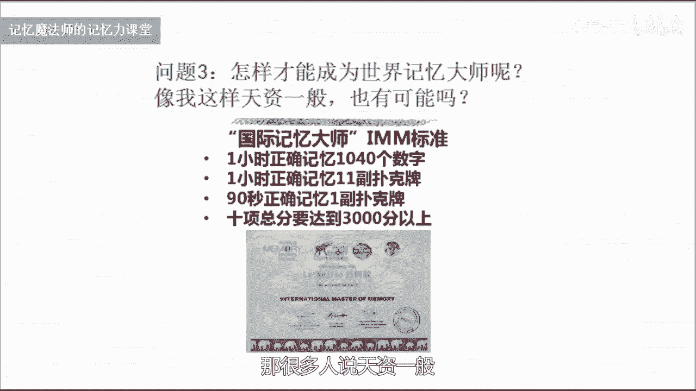

# 海马体记忆法：助你成为最强大脑 - P21：22 【答疑福利1】如何快速吸收记忆方法化为己用？ - 清晖Amy - BV152tfe9Ev3

你好，我是记忆魔法师袁文魁，欢迎来到我的超强记忆力课程，让我们一起拥有超强记忆，创造学习奇迹，各位来听到这里呢，是已经学完了20节记忆的课程，在网上呢也有很多的网友啊，还有我们的学员呢。

提出了很多关于记忆方面的问题，那今天呢这节课呢我挑取了其中的几个问题，来和大家做一些解答，首先呢来看一看第一个问题，感觉使用记忆法好麻烦呀，还不如死记硬背怎么办，那确实很多人呢在初学记忆法的时候。

都有这样的感觉，来进行记忆，那突然呢我们要使用一些记忆的方法，然后要编故事，编歌诀，然后用定妆联想等等这些方法的时候，确实会觉得工程量好像变大了，还不如死记硬背呢简单直接。

那其实我们学习任何技能都会有这样一个阶段，我们学习新的东西呢有三个不同的等级，分为三个不同的区域，第一个呢是舒适区，第二个是学习区，第三个是恐慌区，在舒适区的话呢，我们做的事情是得心应手的，非常的熟悉。

甚至呢你就在这个领域了，是专家，在这个区域里面呢，你能学到的东西是非常少的，进步呢非常缓慢，而在学习区呢是我们很少接触，甚至呢未曾涉足的领域，充满了很多的挑战，也会觉得比较麻烦，刚开始接触的时候呢。

会有一个自己觉得变差的这个阶段，恐慌区呢就是会让我们感到忧虑恐惧，不堪重负的一些事情，比如说一些极限运动，那我们初学记忆法呢，就是从舒适区到达学习区这样一个过程，在这样过程里面呢，只有我们不断的去尝试。

去挑战，我们，才有可能去开拓我们大脑的思维，去挖掘我们的潜能，其实呢我们学习任何技能都是一样的，比如说我们学习骑自行车，骑过自行车的人都知道，刚开始呢我们会摔倒，会呢非常的慢，甚至还不如走路的人快。

有可能还会遭到那些走路的人的嘲笑，但是呢当我们大量练习的时候，突破这样一个舒适区，慢慢的呢，这个学习区里面的内容呢，也变成了我们的舒适区，变成我们非常熟练的部分，我们以后再骑车速度就非常快了。

非常轻松了，所以呢学习记忆法，刚开始这个时间啊，你把它给突破了，那么后面的话呢你就会非常轻松自如，就像呢很多人你要记一副扑克牌，可能几10分钟都很难用死记硬背的方法记下来，但是对于很多记忆大师而言呢。

十几秒20几秒就可以把它记下来，对他们来说真的是太轻松了，如同吃饭呼吸一样很简单，包括我们背一些考试的知识点，那我呢在最近一段时间参加了一个考试啊，经常呢会有很多很多的简答题，一个题目呢有七八个点。

只需要了不到一分钟的时间就可以把它记下来，那过去呢在记忆它的时候，我可能需要十几20分钟，而且还很容易遗忘，所以刚开始的麻烦通过我们大量练习以后呢，他就变成了你的一种本能，变成了你的一种习惯了。

好问题二呢，记忆法需要学多久才能有效果，那这个问题呢，同样也可以类比其他的一些技能啊，比如说我们学钢琴，学小提琴等等这样一些乐器，那我也参加了很多的体验的课程，老师说啊可以在一个小时包里学会钢琴。

那我在一个小时里面到底学到了什么呢，我可以呢学到一些基本的指法，并且呢我会弹奏一个曲子，比如说两只老虎诶，这个时候我就觉得真的我学会弹钢琴了，我能够弹一首曲子了，好那我们学习记忆法也是一样的。

比如说你通过我这20节课，你可以把36计把它记下来，或者里面其他的一些知识点把它记下来，这个呢过去你可能需要很久的时间才能记住，现在呢你可能只听了一两遍就能把它记住，这就是记忆法已经产生效果。

但是呢可能你们想要的效果呢是更加明显的，更加强烈的这种效果哈，那就是我们学会之后的精通，但是精通的话呢，它并没有一个客观的可以衡量的标准，我们只有呢不断的把它运用在我们的学习里面。

才会看到它和你以前的这种变化，你可以呢做出这样一个比较哈，在学习之前，比如说你来记一些英语单词，记一些文章或者记一些数字，来去记录你现在的时间，然后呢通过一个月。

每天至少一个小时以上的练习之后再来去测试，一般人而言呢，一个月的时间啊都会有两到三倍这样一个提升，当然了，这个是因人而异的哈，那记忆的方法呢，每一种方法你在你的生活中，如果至少用到30次以上的话呢。

我相信这种方法一定会比较熟练，你用的越多就会越加熟练，当然呢在生活中实际运用的话，最终它会有一个瓶颈哈，也就是所谓的最后我们到达了舒适区，那这个时候呢想要更好的去精进的话呢，我们又要不断去突破自己。

所以我曾经呢在学习记忆法的时候啊，在使用这个领域，在高中帮助我考上了武汉大学，后来呢，我就觉得对记忆法的兴趣就没有那么浓厚了，直到我准备去参加记忆比赛，这个时候呢就有一个量化的标准来衡量，比如说数字。

刚开始我可能呢80个数字啊，需要了十几20分钟才能把它记住，慢慢通过练习，我5分钟就可以记住，接下来到3分钟，2分钟，一分钟，甚至呢只需要40秒就可以把它记住，这个就是不断训练的这样一个过程。

而这个时候呢它是没有止境的，所以我们需要知道的是，你怎么样去定义这样的效果，当然也有些效果的是不太切实际的哈，比如说很多人会觉得，记忆大师是否把一本书翻完一遍以后，就可以把书里面的所有内容。

一字不漏的把它背下来，这个是不太现实的啊，当我们有合理的期待，当你不断的越多的去练习的时候，你的效果自然会越来越好，越来越明显好，第三个问题，怎样才能成为世界记忆大师呢，像我这样天资一般也有可能吗。

那我们首先了解一下，成为世界记忆大师呢，必须要参加一项比赛，叫世界脑力锦标赛，那这项赛事呢它是1991年，由英国的世界大佬先生托尼博赞，和国际象棋大师雷蒙德基恩先生，一起联合发起的一项赛事，这项赛事呢。

目前呢已经在全球很多不同的国家来举办，每年呢只有举办一届，大家可以呢通过这个二维码啊，去了解到官方的比赛信息，那这个比赛到底比什么呢，我们比赛呢一般会有三天的时间，在三天的时间内呢。

我们要比十个比赛的项目，分别是人名头像，二进制数字马拉松，数字抽象图形，快速随机，数字虚拟事件和日期，马拉松扑克随机词语记忆，听记数字快速扑克牌，那我们可以看到了这里面很多啊，跟数字扑克词语啊。

还有图形，包括了我们有不同的感官，有视觉的，还有听觉的，在里面的时间的长短呢有很短的，比如说5分钟的，有60分钟的时间，所以它可以全方位的考核，我们一个人的记忆的能力。

那在比赛里面怎么样才能获得世界记忆大师呢，从2014年开始啊，我们世界记忆大师呢分为了三个不同的等级，那最低的等级呢叫做国际记忆大师，这个呢至少需要达到四个标准，一一个小时的正确记忆1040个数字。

二一个小时正确记忆11副扑克牌，三九十秒内正确记忆一副扑克牌，第四个标准呢是十项，总分要达到3000分以上，那么呢所有项目如果你打破世界纪录的话呢，总分是超过1万分的哈。

所以3000分并不是一个太难的标准，那在中国呢想要参加这项赛事的话呢，一般来说要通过区域赛，中国赛一直到世界赛，一般来说呢他们的时间是分别在10月份，11月份以及12月份。

2019年呢这项赛事呢在中国的武汉举办，在12月份，也欢迎大家能够到时候去参加这项赛事，那很多人说天资一般。

其实啊我带过了有60多位啊，世界记忆大师，这里面也有很多啊，成为了世界冠军，打破世界纪录的选手，包括王峰在内啊，很多人都觉得自己以前的记忆力都是很一般的，甚至还有很多人呢认为过去的记忆力呢。

比一般人还要差很多啊，这里面呢我带的学员，最小的成为世界记忆大师的是11岁嗯，丁文轩，那最大年龄呢是46岁，叫做张闯，那张草呢是在2018年的时候啊，成为世界记忆大师，他接触记忆法之前的话呢。

在小学初中这样学习的过程中，他就是班上同学都觉得，他的记忆力好像非常的一般，就是天资比较愚笨的那一种类型，包括他的父母也这样认为，那他工作以后呢，经常也会领导哈，会让他去参加一些知识类的竞赛。

因为刚开始工作的时候他比较年轻哈，所以呢就派他去参加比赛，那结果他每天在那里埋头苦读，埋头苦读，最后呢领导考察一些问题，她没答上来，旁边的阿姨啊都把这些问题对答如流。

所以呢她一直对自己的记忆力非常的自卑，而且呢他做了10年的环卫工人，以前呢也是只是中专毕业，所以学历也并不是很高，他在接触到记忆法以后呢，和他的女儿一起练习，后来他的女儿都嫌弃。

他觉得爸爸你这速度太慢了，我每次都超过你，这样的话呢太不孝了，所以后来呢张爽呢就要痛下决心，一定要给孩子做一个好的榜样，他通过了半年时间的练习哈，当时呢就在世界脑力锦标赛上面了，前面的三个标准都达标了。

后面呢3000分啊，差一点点，后面有两年的时间呢，他因为身体的原因没能够参加世界赛，在2018年呢最终圆梦了，在很多的记忆比赛选手看来，他是非常励志的一个典型，我的学员里面呢还有一些。

比如说中国首位残疾人记忆大师孙晓辉，那他呢手残疾的状态，是没有办法拿起一副扑克牌的，但他通过练习的话呢，依然在2011年的时候就获得了这样的荣誉，所以记忆大师呢跟你的年龄没有太大的关系。

跟你的学历没有太大关系，你也不用去找很多的借口说你家庭条件不好，获得，不要拿自己的性别，或者其他的一些东西来阻碍你自己，真正能够帮助我们去做成一件事的，就是非常强大的信念，掌握系统的方法。

找到一个合适的环境，在导师的指导下，一步一步的去达成你自己的目标，2019年呢，也期待更多的中国的选手，在我们湖北武汉去获得这项荣誉，那他获得这个荣誉到底有什么意义呢，其实呢他是和打篮球。

乒乓球等等这些体育竞技运动一样的，是一项竞技，那在竞技的过程中呢，他会去训练我们的耐心，专注度，战胜困难的这样一个心理素质，同时呢我们会和很多的朋友，结下非常深厚的友谊。

另外我们可以在一个国际的赛场上面，和各国的选手一起交流，这也是一次很难得的机会，开拓我们的国际视野，另外呢，很多人也因此开始了一项新的人生的事业，比如说我就是因为在2008年哈，获得了世界记忆大师。

慢慢的走上了到了开发这条路，一直到现在已经有10年的时间，那我的很多的学生也在这条道路上去，推动人类大脑的潜能的开发，我在2008年的时候呢，我是中国的第九位世界记忆大师。

目前呢中国已经有接近600位记忆大师了，所以中国人呢在这项赛事里面啊，其实相对来说，要成为记忆大师并不是很难的一件事情，我带的学生里面呢最短的只花了三个月的时间，一般的人呢通过半年的时间的练习啊。

都可以做到，但也有一些呢因为心理素质不好，或者呢比较焦虑浮躁，那可能呢会经过两年到3年的时间，但是呢只要你通过努力的练习，每个人其实都有可能达到这项荣誉，它并不是一件很难的事情，好问题是。

看到很多世界记忆大师能在最强大脑挑战，不可能里面挑战吉普克，可以教我怎么记扑克吗，练习扑克有什么意义呢，好我首先来说一下练扑克的意义哈，那可能呢是因为世界脑力锦标赛呢，有扑克这个项目。

而且呢是和世界记忆大师的两项标准有关，所以的话呢很多人会练习扑克，那么他也可以了，当做是一个记忆训练的基本功，就像我们练习武术要扎马步一样，通过扑克啊这样一个比较好玩啊，有趣。

大家平时生活中很容易得到的一个工具，来进行训练的话呢，会激发出我们训练记忆的这种乐趣，不断超越自己的过程，当你可以在十几20秒，就会把一副扑牌记下来的时候，这种感觉啊其实非常爽的一种感觉。

那怎么样来记忆扑克呢，其实记扑克的方法，跟我们前面在数字记忆里面讲到数字记忆，是完全一样的，不一样的点呢，就是我们先要把这里面的扑克牌，分别转换成具体的数字，并且呢进而转化成我们的数字编码的图片好。

那怎么转呢，在比赛的时候呢，大小王是不用记的啊，所以只用记住52张牌，我们可以先看看数字牌，在四个里面呢，黑桃啊，我们可以看到黑桃上面呢是有一个尖尖，我们可以把它定义成一，红桃呢定义成二。

梅花呢定义成三方片呢定义成四，那么呢我们就可以了，把它作为十位上的数字，和后面的扑克牌上的数字呢组合在一起，变成了两位数，好黑桃一呢就变成了11，黑桃二就是12，黑桃三就是13，遇到黑桃十就是一零。

那红桃A就是二一，红桃二就是221直到二零，好梅花呢就是31~30，方片呢就是41~40，那接下来勾库K该怎么办呢，我们可以了，把它用567分别来代表，你可以想一想啊，五了诶，正好呢也下面也有个勾啊。

然后Q的话呢六和Q有点像，K的话呢，你可以把它倒过来看哈，有一半就像一个七一样，那么伍六七的话呢，在这里呢我们可以把它放在十位上好，接下来呢就分别和我们的花色啊来组成两位数，勾就分别了。

变成了51525354，Q的话呢就是61626364，K呢就是71727374，好把它变成了这些数字以后呢，接下来就练习哈，把它看到它就可以想到对应的数字编码，比如说黑塔一数字编码的就是E1啊。

梯子E2就是ER，通过大量的练习啊，我们可以看到排，就迅速的去反映出它对应的编码啊，这是我们在练习的时候叫做读牌练习，当我们能够把它变成编码以后呢，接下来记忆的时候啊，我们是这样来进行操作的。

左手拿着牌，然后呢，把它呢一张一张的推到我们的右手这个地方，推过去一张，我们就记住一张在记忆的时候呢，是我们从啊推过去的这一张啊，作为第一张，然后呢最后一张呢是我们左手啊，最下面一张，那记忆的时候呢。

我们是相当于是排的是从右往左啊，来进行记忆的哈，比如说在这个地方方片七哈，就是我们的第一张记忆的时候呢，我们是两张牌放在一个地点上面来进行记忆，所以一副扑克的话呢，我们需要26个地点。

那具体的我来举三个例子啊来说明一下，好比如说呢这个哈是梅花七和方片四，那我们在记忆的时候呢，啊梅花七是在前面，方片四在后面，梅花七呢代码是3737，方片四呢就是四四蛇好，我们的地点呢是一个桶。

可以想象的一只山鸡呢用爪子啊抓住了一条蛇，然后呢把它按到了这个桶里面，好想想呢，这个时候在拼命的挣扎的时候，这样一个场景下面一个方片三，梅花二，方片三呢四三是死神，梅花二呢是三二善耳好。

我们的地点呢是这里有一个梯子啊，我们可以想象一下，死神呢拿着他的镰刀好，割到了这个梯子上面，放着一把扇儿，搁上去了以后呢，上儿呢切开成两半，倒到了这我们我们的梯子上面，接下来方片A和黑桃十。

方片A呢我们是四一蜥蜴，黑桃十呢是一名是棒球棍，好在这个木头箱子上面呢，我们可以想得上面有一只蜥蜴，用他的舌头啊缠住了一个棒球棍好，然后缠住以后呢，用它打在了这个箱子的旁边，把箱子打了一个洞。

我们接下来的就可以依次通过回忆每个地点，桩上面的形象，然后进而的去回忆上里面的扑克牌，那么通过大量练习以后呢，我们可以呢把速度啊练得越来越快，目前的世界纪录了，12秒钟就可以把一副扑克牌把它记下来。

所使用的方法呢也是完全一样的方法，那平时呢我们刚开始练习的时候呢，我们先一定要把数字编码练得非常的熟练，然后呢在实际练习记的时候呢，也可以啊，先从20张牌甚至十张牌开始练习啊，记录他的时间。

慢慢的熟练以后呢，我们可以增加牌的张数到30张，40张，1~1副牌好，我们要记一个小时的马拉松的话呢，我们也是这样循序渐进的往上去增加就可以了，在比赛的时候呢，快速记忆扑克牌，它有一个规则啊。

就是5分钟的时间内进行记忆，你可以看任何多的变数，两遍三遍四遍五遍都可以哈，但是呢不能超过5分钟，一般的选手呢会在第一次机会的时候看两遍，第二次机会呢他会冲刺啊，看一遍，那12秒肯定只能够是看一遍的哈。

所以呢想要去突击，更高的一个水平和记录的话呢，一般的选手是练习看一遍，所以我们平时的话尽量呢也做到，能够一遍把它记下来，记忆完了以后呢，会有一个5分钟的时间，有一副新的扑克牌，然后你需要的按照顺序。

找出刚才记忆的这副扑克牌，然后把它摆出来，5分钟摆完之后呢，会和裁判一一的核对，扑克只有完全正确，这副扑克牌你所用的时间才为有效的时间好，关于呢扑克这一块呢，大家可以来尝试练习一下，这个是非常有趣的啊。

一个记忆的练习，它也是我们记忆大师的一个非常重要的标准，如果你能够在90秒以内呢，尝试把一副扑克牌记下来，你也可以来尝试去挑战一下，在世界脑力锦标赛里面去冲击一下，世界记忆大师这样一个荣誉。

好的今天的答疑呢就到这里，感谢大家今天的聆听，也欢迎大家呢把这一系列的课程，分享给你的朋友，让我们一起呢为大佬赋能，让生命绽放，我是记忆魔法师袁文魁。

