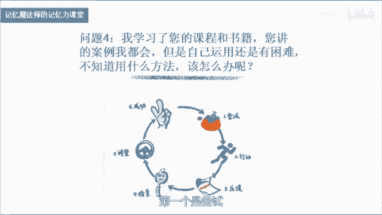

# 海马体记忆法：助你成为最强大脑 - P22：23 【答疑福利2】如何将思维导图和记忆法结合起来，让记忆更加事半功倍？ - 清晖Amy - BV152tfe9Ev3

你好，我是记忆魔法师袁文魁，欢迎来到我的超强记忆力课程，让我们一起拥有超强记忆，创造学习奇迹，大家已经学习完我的20节课程，在不同的网络平台呢，大家提出了很多关于记忆方面的疑惑。

那今天呢我挑选了几个问题，来给大家做一些解答，首先来看第一个问题，学了记忆法是不是就不需要理解记忆呢，会不会妨碍理解呢，首先呢学了记忆法，当然也需要我们的理解记忆，它们两个呢就像两种不同的工具。

在我们学习知识的过程中，两者需要相辅相成，互相的配合，那记忆法呢很多时候啊，用到了我们形象的思维联想，这个是我们右脑来主要负责的，而理解呢它主要是通过我们左脑的逻辑的思考。

所以呢我们在实际学习知识的时候呢，如果能够把左脑和右脑结合在一起，我们就可以了达到一个更好的效果，那理解和记忆它们之间有怎样不同的关系呢，有四大关系，一能够理解的未必能够记住。

比如说我们可以呢理解一本西游记，里面讲的内容，但是你要把它记住真的是非常困难的一件事情，二能够记住的未必能够理解，比如说我们能够记住啊，苹果还是apple，但是为什么是apple呢，你能够理解吗。

还有很多的知识啊，都有这样的特点，三有些知识呢只有理解了才能记牢，比如说化学元素的变化规律，四呢有些知识呢先要记住再去理解，比如说啊我们小孩子啊背下了唐诗，那么长大以后呢就可以深入去理解它。

还包括我们圆周率，小学的时候就学过了，但是要理解了得到高等数学学了以后，我们才能够理解，正是因为理解和记忆啊，有这样一些相互之间非常错综复杂的关系啊，所以呢我比较倡导的是，在我们学习记忆法的时候啊。

有一些材料，比如说文章，政史地的一些知识，我们可以理解的时候呢，我们先通过理解来进行记忆，理解呢它包括我们对材料进行分析，比如说找到里面的中心思想，段落大意，或者绘制一张思维导图等等。

另外呢我们还可以结合我们已有的生活的体验，包括了用我们自己的话来复述这些知识，都属于理解，当我们把这些用到以后，你发现知识还比较抽象或者比较复杂，那这个时候呢我们就可以用记忆法来辅助，帮助我们去记忆。

那另外呢有一些啊知识，确实呢是不太容易理解的哈，比如说像我呢是道德经，我把它背下来了，那我可能呢是先尝试把它背下来，但是呢要深入的去理解它，我可能呢需要花一辈子的时间，去不断的去体悟它。

但是呢在背的时候，如果有一些你能够理解的话，我们还是先理解再去背诵，这两个之间呢并没有严格上的先和后之分，互相配合好，问题二记忆法呢适合多大年龄学习，目前呢这20节课的话呢。

主要是针对至少是初中往上走的这样一个人群，一直到七八十岁啊，都可以去学习它，那么相对来说比较小的啊，比如说三岁到12岁之间是否可以学习呢，那这个阶段呢我们记忆力发展啊，它有以下的一些特点。

三岁到六岁之间的这些小朋友啊，我们是以无意识记得为主，有意识的记忆呢开始呢慢慢的去发展，并开始呢会给自己制定一些记忆的目标，另外呢我们记忆的方法，大部分人是通过复述的方式，形象记忆呢和语词记忆啊。

开始慢慢的有一些结合，到了小学阶段以后呢，我们记忆形象的信息的能力，和记忆语词信息的能力开始差不多了，而有意识记忆的明显会强于无意识的记忆，那这个时候呢，就是我们可以开始更好的运用记忆法的时候。

我在2018年的时候啊，带过了几个3~6岁的小朋友，那这个阶段小朋友啊，他们其实呢也是可以用一些简单的方式，来去掌握一些记忆的方法，训练的素材呢就不是我在这一系列的课程里面。

给大家举了一些各个学科的例子，而是呢通过形象的方式，我们来看一看课件里面啊，好这个呢是用一些卡片和一些模型来进行的，熟悉的话呢，你就知道这是用的配对冥想法，卡片上面呢有八个不同的职业，比如说厨师，画家。

理发师等等，那么他们的前面呢有不同的动物，每个动物呢都是这些职业的人，他们很喜欢的一个动物，我们对它进行联想以后，需要呢把他们打乱，让他们重新进行配对，通过游戏的方式啊。

孩子们可以很好的去掌握这样的配对，联想的方法，慢慢的可以增加这个数量，好再举一个案例啊，那这个呢大家可以看到啊，这里面有很多小的模型，是一些家里的摆设，那么每个百色上都休息的一个小动物。

那我们呢用这种方式呢，就可以训练孩子们的定妆的一种方法，所以通过我的这样一个实践啊，发现几岁的小朋友啊，他们其实也是可以学习记忆法的，只不过呢在训练的时候啊，他的方式会不一样。

那这个需要我们的家长呢学习了解记忆方法，并且能够带着孩子在玩的过程中，去开发他们的记忆力，去挖掘他们大脑的潜能，那未来呢我也可能会在这个方面啊，去做更多的探索，去制作一系列的课程。

还包括了研发相应的玩具教具，来帮助孩子在玩的过程中去开发他的大脑潜能，问题三听说思维导图也是一种记忆法，那思维导图和记忆法有什么区别呢，怎么样画思维导图呢，首先呢我们先来了解一下思维导图。

那它呢是由托尼博赞先生发明的，一种调动全脑来辅助记忆，整理思路和创意思考的工具，那博旦先生最开始的时候啊，他发明思维导图是用它来辅助记忆的，但是后来呢在不同的人使用思维导图的过程中，会慢慢的发现啊。

它有越来越多的功能可以呈现出来，我们来看一看这个呢是我们团队的王玉老师啊，他呢是跟随着托尼博赞先生亲自学习，同时呢他教授了很多学生，绘制了不同的思维导图，在这张课件里面有所呈现。

分别呢用在了整理读书笔记，会议笔记，包括了我们构思一个演讲和汇报的内容，还可以通过多角度来思考，散发我们的创造力，另外呢还可以呢去整理一些文档资料，做一些整理工作，还可以呢做一些活动的企划案。

另外呢对于一些公式而言呢，我们可以通过它来介绍，我们的公司里面的一些关键的人物，或者公司里面的一些产品，都是非常直观和形象的一种方式，那这里呢只是思维导图的众多的功能中的，其中的几种。

那怎么样去绘制一张思维导图呢，我们首先来看一个案例哈，这个呢是刘丽琼老师啊，他为我绘制了一张个人介绍的思维导图，这张思维导图呢怎么来看呢，首先中间的这个叫中心图，然后呢往外延伸的有四个部分。

上面分别写着简介兴趣，事业梦想呢这个呢叫主干，再往后面呢叫分支，分支，后面呢还有一些图片哈，这个叫插图，好，我们来看看绘制的步骤，首先呢我们一般绘制思维导图需要白纸，最好的是用A4，如果呢想更大一点的。

就用A3的白纸把子弹横放，同时呢我们也需要一些彩笔，铅笔啊等等这样一些工具来辅助我们好，首先呢我们把白纸横放以后，在这张纸的中间画上一个代表主题的图像，我的名字呢袁文葵好，这里呢画了一个向日葵，来代表。

我画的时候呢放在纸张中间1/9的地方，大概了银行卡那么大小，接下来呢我们可以啊，由中心图往外去衍生出来一个主干，我们可以看到主干呢是从粗到细啊，就像一个牛的角一样，我们最开始画的时候呢是左上角这个方向。

然后按照顺时针的方向继续往后面去延伸，在主干上，我们要写下文字，这个文字的话呢是写在线的上面，然后由主干往后面呢，我们继续衍生出下一集的分支，我们可以看到这个线条呢它也是曲线。

然后文字呢依然写在线的上面，一般来说呢线的长度啊略长于文字的长度好，我们接下来呢继续完成下面的几个分支，最后呢就变成了一个内容，完全呈现的一张思维导图好，那么思维导图呢还有一个很重要的元素啊，就是色彩。

我们可以呢来对它进行颜色上的突出，不同的主干和后面的分支呢，我们用同一种颜色简介，这里呢用蓝色，兴趣呢用到了绿色四叶，这里呢用到了红色，梦想呢用到了紫色，这样呢可以把不同的主干的内容，进行相互的区分。

同时也可以了吸引我们大佬的眼球的注意力，接下来我们在一些重要的部位，配上一些小的插图来辅助，让我们的注意力集中在这些地方，更好的可以把它记住，这样的一张完整的思维导图啊就完成了，但很多人以前呢。

可能是用电脑软件绘制的思维导图，那么用手绘思维导图它有什么样的好处呢，它又怎么样可以来辅助我们的记忆呢，我们来看一看思维导图为何能辅助记忆，我从七个角度啊来跟大家进行阐释，这个呢也是我提出的。

可以帮助我们提升记忆的七种武器，首先呢我们从左上角开始，这张图上有一个逻辑，那么思维导图呢其实很重要一点呢，就是我们的逻辑要非常的清晰，中心图是最重要的主题，主干呢是它分下来的部分。

然后接下来呢再往后面延伸的部分呢，又是继续往后去分下来的部分，所以他的逻辑要层次非常的清晰，如果你画的很混乱的话，是很难把它记住的，第二个呢，形象思维导图上面的中心图以及后面的插图，它都是形象的。

能够更好的帮助我们去记忆它，连结在这个里面的话，有很多插图呢是放在相应的文字的后面的，它们之间呢会产生一种连接，帮助我们呢，诶知道在哪个图像旁边有什么样的文字，另外呢思维导图里面啊有些比较关键的内容。

它们之间是有关联的，我们会用一些线条把它们之间建立关联独特，那思维导图里面呢，中心图啊是最重要的部分，所以呢我们可以用一些比较独特的形象，夸张的形象来把它突出出来，帮助我们更好的去记忆它，包括插图。

有些地方有插图，有些没有，那么有的地方也相对来说会比较独特简单，所谓的简单呢，一个呢是我们在思维导图上面呢适用的关键词，很多人画的思维导图啊，就是一整段的话写在上面，这个呢可以说是伪思维导图啊。

当所有东西都是重点的时候，就没有重点了，我们尽量让它简单，另外呢，一个主干往后面延伸出的分支也不能太多，一般来说啊在五个到七个之间啊，这个呢相对来说我们大脑还容易接受好，还有感官。

我们在自己用手来绘制思维导图的时候，我们用眼睛来看，用手来绘，同时呢我们还有自己的，有的时候会自言自语啊，会有听觉，这些都会促进我们的记忆，所以画的过程就是记忆的过程，那么还有故事呢。

好在思维导图里面呢，当然可能故事性并不是很强哈，所以我们也可以结合一些记忆的方法，比如说一个分支啊，后面有五个点，那这五个点它们之间是一种并列关系，我们就可以用一个小的故事啊来尝试把它记住。

所以啊记忆法和思维导图呢，他们呢是两个不同的工具，但他们两个也可以结合在一起，能够达到更好的效果，托利博特先生曾经说过一句话，他说如果把学习比作成一次作战的话，那么思维导图呢就是我们的作战指挥图。

而技术就是我们士兵手中的武器，两者呢合二为一就能战无不胜，那么我在2007年的时候，接触到记忆法的时候啊，就开始呢学习思维导图，那把两者结合在一起来运用的话，确实呢对我学习帮助非常大。

那我一般来说建议的话呢，先从记忆术啊开始学习，把这些方法掌握的更牢固以后啊，再来去学习思维导图的时候，你能够把记忆法里面很多元素啊，用到思维导图里面去，达到更好的效果好，接下来看看问题四。

我学习了您的课程和书籍，讲了很多案例我都会，但是自己运用还是有困难，不知道用什么方法该怎么办呢，呃首先的话呢我来和你分享一下，我们想要去学习一个东西啊，我们会有六大步骤。

第一个呢是尝试，第二个是行动，第三个是反馈，第四个是检查，第五个是调整，第六个是成功，在这个过程中呢，你们已经开始啊做了尝试，并且呢有了行动，但可能还会缺一些东西，学习了网上的一些课程和书籍的。

都有一个缺点就是什么呢，可能没有办法得到老师的及时的反馈，你用这些方法你会用不会用，用的好还是不好，老师没有办法给你及时的指导，在这过程中你就不知道自己做的怎么样，然后呢你就会慢慢的没有信心。

不敢去尝试，慢慢可能就放弃了，但是我们线下的一些课程的学员的话呢，可能就不太一样，那么我们在平时训练过程中啊，会有了训练的打卡，老师会给每一个同学去点评和指导，然后呢在平时大家在生活中学习中。

运用到记忆的方法的时候，不会用的部分诶，老师也会及时的给予指导，那这样的反馈就会给他更好的一些意见哈，帮助他更好的去进步，在这个过程中呢，他根据老师的反馈去检查，然后不断去调整自己，他就迈向了一个成功。

当他一个成功迈向一个成功的时候，他最终呢就会达到一个更好的水准，所以呢反馈啊其实是非常重要的一个部分，很多时候啊老师们的经验，可能一句话的点拨就会让我们少走很多的弯路。

另外的话呢在我的新版记忆魔法师这本书里面，也提出了一个七大信息记忆模型，也就是呢我把不同的信息啊，根据他的特点把它变成了一些模型，一些零散的信息呢叫做散点模型，那这个模型的话呢。

一般呢我们会用形象记忆的方法，鞋子拆观众好来进行记忆，那层对信息呢是钥匙和锁的模型，我们一般会用配对联想法来记忆它，那并列的信息呢叫做花瓣模型，那它们呢一般呢我们会用锁链故事，或者字头歌诀法。

定妆法来记忆顺序的信息呢是排队模型，这个呢和并列信息的模型呢有点类似，但是它必须严格按照顺序来进行，那方法呢也跟花瓣模型有些类似，接下来难度稍微大一点的，就是纵横交错的信息矩阵模型。

那这个的话呢在很多表格里面啊，我们会去用到它，还有呢阶层化新一金字塔模型，那这个模型的话呢我们类似于思维导图啊，主题分为一个大的主题，接下来又分为小的主题，层次非常的鲜明，面对这样的信息呢。

我们就要综合用到不同的记忆的方法，还有地图空间关系又怎么去记忆，那我们根据不同的信息的话呢，我们在这个过程中，学会去判断它是什么样的模型，然后呢我们针对性的采取相应的方法，那通过大量的练习以后呢。

你以后看到信息辨识出其中的这样一个模型，你就可以了，知道该用什么样的方法来进行记忆了，就会形成一种条件反射好，当然呢我在我的个人的公众号袁文魁里面啊，也在陆续的推出100个记忆方面的案例。

那你也可以尝试着了，先去尝试着自己来记忆这些案例，然后呢你可以听听我是怎么样发现里面的模型，并且怎么样呢，通过一些思路来去运用记忆法来记忆它的，通过对比啊，这也是一种反馈的方式。

能够帮助你呢更好的去进步，希望呢啊，这位提问的同学，能够去更好地把记忆法用在你的生活之中好，那我们今天的答疑呢就到这里了，欢迎你把课程分享给你的朋友们，和他们一起拥有记忆魔法，成为最强大佬，为大佬赋能。

让生命绽放，我是记忆魔法师袁文魁。