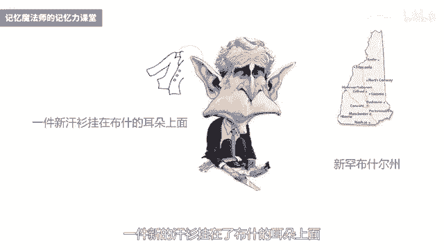

# 海马体记忆法：助你成为最强大脑 - P4：04 、 【形象记忆】 记陌生人名地名的秘诀 - 清晖Amy - BV152tfe9Ev3

你好，我是记忆魔法师袁文魁，欢迎来到我的超强记忆力课程，让我们一起拥有超强记忆，创造学习奇迹，上一讲我分享了升级大脑系统的三大智能训练，专注力，想象力和创造力训练，今天起呢我们将正式进入到记忆法的学习。

我将结合实际生活和学习的应用场景，用讲解和练习相结合的形式，帮助你，以更加通俗易懂的方式来掌握记忆法的精髓。

第一种方式呢是最基础也最重要的形象记忆法，遗忘的力量，这本书里面说过，几乎所有的记忆技巧都依赖某种形式的图像，尤其是涉及到物品或难以触碰的概念时，比如人名或地名，相信你也曾有这样的体验啊。

比如进入到一家新的公司，或者是参加聚会，认识了新的朋友，扭头就把别人名字给忘记了，或者是参加某一个活动，别人告诉你的一个地名，结果呢你记错了地方，最终呢误了正事啊，别提多尴尬了。

那今天呢我们将学会如何用形象记忆法，巧记人名和地名，让你成为社交达人，形象记忆法呢又称为星象记忆法，当我们闭上眼睛，我们依然可以的，在脑海中浮现出某个形象或者场景，这就叫做星象。

我们平时回忆往事或者在做梦的时候啊，都是在构建星象，它以视觉的形象为主，但也会有听觉，触觉和味觉等其他感官的参与，对形象的东西产生星象，最容易，我们先来做一个尝试，请你的找一个安静的环境。

以放松的姿势坐在椅子上面，轻轻地闭上你的眼睛，可以呢做几组深呼吸，此时的大脑进入到阿尔法波的状态，就更容易产生心向，第一个练习呢可以在脑海中想象一根香蕉，刚开始呢，你可能会在脑海中先浮现出香蕉的轮廓。

接下来慢慢的会呈现出香蕉的一些细节，比如说香蕉皮是什么颜色，它上面有没有一些线条和纹理，是否有一些斑点等等，然后呢你可以呢旋转一下香蕉，从不同的角度来去观察它，接下来你还可以想象呢，你用手在抚摸香蕉。

感受一下，摸上去滑滑的凉凉的感觉，然后你拨开香蕉，闻一闻香蕉的味道，再用嘴巴轻轻的咬上一口，去感受香蕉的味道，感受一下他在你舌尖舞蹈的那种感觉，是不是口水都流出来了，如果你能够把这些都在脑海中想象到。

你的星象能力还是不错的，如果暂时做不到的话，可以呢先拿一个真实的香蕉来观察，然后呢再闭上眼睛去重现这个场景，多做几次，你的想象力就会越来越好，那这个练习呢你还可以把它换成苹果，橘子等等，其他的水果。

也可以呢，把它变成了实际生活中的其他一些物品，当然有些物品呢我们直接用视觉来看，用耳朵来听就可以了，就不需要去尝尝它的味道了，好第二个练习的可以了，找小伙伴们一起来进行。

你可以来挑选一张照片或者世界名画，那里面东西可以稍微丰富一点，比如说至少有6~7样，最好呢是彩色的，你和小伙伴们都限时30秒钟时间来观察，观察的时候呢，可以将一些特征用内心的语言描述出来。

包括里面有什么东西，东西是什么颜色，东西的数量等等，那观察结束以后呢，可以闭上眼睛，在脑海中浮现出整体的形象，接下来我们可以互相提问，比如说诶这个图片里面的小女孩，她帽子是什么颜色。

图中的男人正在做什么事情，这样进行了几轮提问以后，如果呢里面有出错的地方，可以结束以后再看看图片来强化记忆，当然呢你也可以提高难度，就是凭借脑海中的记忆，将这个图片的内容用简笔画画出来。

当你把它画出来以后，你就知道哪些你记住了，哪些还没有记住，我们可以了，再观察一次来补充，我们通过几十张的这样一个图片练习之后啊，你的倾向能力就会大大的增强，以上这两个呢是星象的基础练习，看似非常简单。

却很重要，将形象的东西构建新，像是记忆宫殿的地基，那接下来重头戏呢是将抽象的词汇变成星象，这里我将分享一个魔法口诀。

它叫做鞋子拆观众，这个口诀呢是抽象转形象的五大法则，分别是谐音增减，倒字拆和相关和综合，我挑起了这五大法则的里面的关键字，谐音的谐增减到字的字，拆盒的拆相关的官综合的忠。

并且呢适当协议以后变成了鞋子拆观众，你可以来想象一下，你拿着鞋子呢拆掉了电影院里面的观众席，好，现在呢我们就一起来看看茄子猜观众，它分别是什么意思，以及该怎么运用，我们就直接拿即以人民为例。

我先为你的设置一个场景啊，现在呢想想你要去找工作，你穿越到了水浒传里面，想要投奔一家公司，是梁山啊，有限公司，现在有梁山，108好汉啊，都要分别介绍他们的名字，你需要快速的记住。

你才能够通过面试去登上梁山，和他们一起共事，那么你要怎么去记忆呢，仔细听好了，第一大法则呢是谐音，这个大家都非常的熟悉哈，第一好汉呢是宋江，我们可以谐音成宋江，就是想到把客人呢送到长江边。

我们可以谐音成无用，也就是没有用的意思啊，大智若愚啊，所以没有用，可以谐音为郝思文，这想象呢一个戴着眼镜的好诗文，好斯文的一个先生的这样一个形象啊，好第二大法则的是增减倒字。

就是在原来词语的基础上增加或者减少一些字，或者把它的顺序倒过来，看看呢能否变成具体的形象，第93号好汉是思恩，我们可以把它倒过来，变成恩斯，是湖北的一个地名，那最强大佬的胡晓玲老师啊，他就是湖北恩斯人。

第96号好汉呢是安道全，后面两个字倒过来就是安全道，可以想象的是一条重兵把守的非常安全的道路，第三大法则是拆盒，也就是将词语啊分别拆成不同的字词，然后分别了联想成具体的形象，之后，再通过联想和故事啊。

把它组合在一起，变成一个新的形象，比如第五位英雄是关胜啊，关呢可以想到了关羽，胜呢可以想到胜利哈，就想到了一个剪刀手的这样一个形象，想象一下关羽呢过五关斩六将之后，举起了胜利的剪刀手。

第108位英雄呢叫段景柱，那我会想象呢是天龙八部里面的段誉哈，景呢是风景的，景，住呢是居住的住，想象下段誉啊在风景区里面居住，第四大法则呢是相关，想到了和他有关的形象，可以是相关的人物物品事件等等。

比如说第62号好汉是孔明，这个呢可不是三国里面的诸葛孔明，但是呢因为同名，我们就可以很容易把它记住，第63号好汉叫孔亮，由明亮这个词语我们就可以把它一起记住，那水浒里面呢其实有很多相关的人物。

比如说袁小二，袁小五，袁小七，比如朱富朱贵，比如说童威童猛，那这些呢可能是兄弟关系，或者呢他们之间啊有一些相互的关联，记住了这个就可以另外的把其他的也记住，第五大法则是综合。

是将上面的一些方法来进行综合的运用，至少会用到了两种以上的方法，有些人可能会用到谐音和增减倒字，比如说第24号好汉呢是穆弘，可以倒过来想到了红木，且因为呢这个红木家具了这样一个红木啊。

好有些可能会用到谐音和猜和，比如说第2号好汉卢俊义奴谐音想到了炉子，俊义呢谐音为军医，所以想象一个画面是炉子边正在烤火的军医，通过这五大法则，你是否可以将这些好汉记住呢，尝试回忆一下段景柱是怎么记住的。

安道全又是怎么记住的呢，如果你能够挑战，将108好汉都用鞋子拆，观众记住你和梁山好汉就是一家人了，通过这样的方式呢，我们将抽象的名字用更加有趣的形象呈现，会在你心里面留下更深的印象。

下次呢当你遇到新的朋友的时候，可以尝试用一用哦，记住别人的名字，可是拥有良好人际关系非常重要的一步好，那我的名字的话呢，我也分享一下怎么去记忆哈，原文葵哈，你可以想象一下圆形的。

有很多花纹的一株向日葵啊，所以有很多小朋友看到我就会叫我，向日葵哥哥哈，你也可以通过这种方式来记住我的名字好了，刚才呢鞋子拆观众这个口诀我们已经记住了，也已经在水泊梁山，用它来记录中国的人民。

接下来我们就要飞洋过海到美国去旅游，想象一下，你现在要变成一位美国通，你要做的第一件事情呢，就是要记住美国50个州的这样一些州民，包括了阿拉巴马州，南达科他州，西弗吉利亚州等等，别觉得头大哦。

我们一起用记忆法来搞定它，记住比较长的名字呢，我们用猜合法会比较多一点，那拆的时候可以看看，有没有一些比较熟悉的部分，在记忆心理学里面叫做主块，比如说阿拉巴马，阿拉啊，就可以想到阿拉丁神灯。

那它就是一个主块，巴马想到美国的前总统奥巴马，那么在组合在一起的时候呢，我们就可以联想到手拿着阿拉丁神灯，然后搓搓搓，然后抽完以后呢，在许愿的奥巴马这样一个形象啊，这样就记住了阿拉巴马州。

我们在记忆的时候呢，组块越少，我们记忆就会越简单，接下来我再给你举五个例子，因为涉及到具体的一些字哈，所以呢我们在听的时候看看文稿效果会更好，第一个呢马里兰州，好想象在马的肚子里面呢有一碗兰州拉面。

第二个肯塔基州，肯塔基哈，读一读就可以想到了肯德基，我们可以想象中间的这个塔啊，是汉堡堆成的一个塔，想要在肯德基这个餐厅的中间里面，有一座汉堡堆成的塔，所以想到了肯塔基下一个稍微长一点。

俄克拉荷马州鹅是俄罗斯的鹅，我们可以谐音想成一只叫的这个鹅，克拉呢是想到一克拉的钻戒，这个克拉河马这个河啊是何炅的河哈，但是我们可以把它谐音成动物的这个河马，我们把它组合在一起，想到一个画面。

就是想到一只鹅拿着一克拉的钻戒，在向一只河马求婚啊，很搞笑的一个画面哦，新是新旧的，新罕呢是罕见的罕，那新罕可以谐音呢和曾字，想到了新的汉三布什啊，就是美国的总统布什这样一个形象。

耳呢是可以想到了还珠格格里面的尔康啊，那我一般会把它先想到耳朵的耳好，这个时候联想到了一件新的汗衫，挂在了布什的耳朵上面。

新罕布什尔州最后一个南卡罗来纳州，南呢就是柯南的这个蓝啊，卡罗可以先想到卡拉OK的这个卡罗啊，这个地方罗哈是罗纳尔多的这个罗好，下面莱纳呢纳哈就是罗纳尔多的这个腊，那我们可以想一下呢，谐音为莱纳。

整体上闲想了一个场景啊，在卡拉OK里面，有一个人呢在喊着柯南来唱卡拉OK啦，男卡罗来啦，好记住了吗，我一共分享了美国的六大洲，你可以再复习一两次，看看他是否可以回忆起来，要是以后呢再遇到别人问你。

美国有哪些州，你至少可以脱口而出，这几个别人不太熟悉的可以了，凸显出你的学霸本质，那其他的粥如果你有兴趣的话，就拿来练练手吧，让你可以更好地掌握席将转化的法则好了。

我来总结一下今天的课程，你学到了增强星象力的两大基础训练，也学会了抽象词汇转化成形象的五大法则，也就是谐音增减，倒字拆和相关和综合，约翰和我一起呢穿越到了梁山，学会了记忆，人民的技巧也飞越到美国。

能够将地名进行趣味记忆，这些呢都将助力你成为社交的达人，当然了，我学会了方法，知道不等于做到，做到不等于做好，你还需要进行大量的练习，当你练得越多，你的记忆力就会变得越来越强大。

今天的作业请尝试用抽象转形象的方法，记忆以下梁山好汉的名字，并且在评论区里分享你的想法，第一个名字陶宗旺，第二个名字汤龙，第三个名字御宝寺，第四个名字蒋静，第五个名字索超，今天的课程就到这里了。

请在文稿里查看今天的练习，并且把你的想法在评论区里留言。

和同学们一起切磋交流吧，也欢迎你把课程分享给你的朋友们，和他们一起拥有记忆魔法，成为最强大脑，为大佬赋能，让生命绽放，我是记忆魔法师袁文魁。

