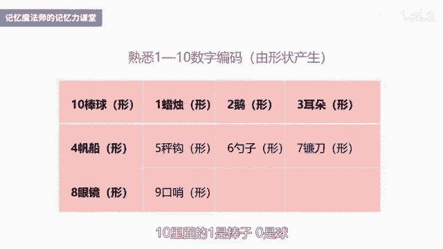
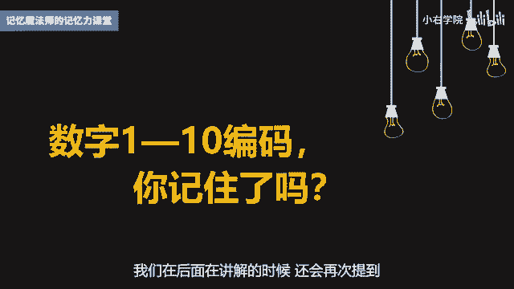

# 海马体记忆法：助你成为最强大脑 - P6：06 、【数字定桩 】海量信息轻松任意点背 - 清晖Amy - BV152tfe9Ev3

你好，我是记忆魔法师袁文魁，欢迎来到我的超强记忆力课程，让我们一起拥有超强记忆，创造学习奇迹，上一讲我分享了配对联想法，对于成对出现的信息，可以通过联想来更加牢固的记住，联想的关键法则，有形象独特。

动态和多感官，我还带领大家一起记录了，国家的首都和名著的作者，今天我们将学习到数字定桩法，他是配对联想法的一个升级的版本，什么叫数字定章法呢，记忆大师们都有一个秘密武器，叫做数字编码，从00~99。

每个数字都有一个具体的形象，有些呢是通过形状产生的，比如一一是梯子，有些是谐音，比如腰四是钥匙，E5是鹦鹉，有些呢是通过常识，因为6月1日是儿童节，所以六一的编码是儿童一包香烟有20根，所以二零是香烟。

在文稿里面，我为大家提供了完整的记忆魔法师数字编码表，大家可以参考，当我们熟练掌握这套数字编码，它们就可以作为记忆桩，面对有很多点的信息，比如西点军校的22条军规，36计，易经64卦。

包括十几条要点的简答题或工作报告，我们都可以依次将每条信息与数字编码联想，就可以按照顺序来记住全部的信息，并且可以做到倒背如流和任意点背，比如问你梁山好汉第52位是谁，你就可以脱口而出。

在参加知识竞赛进行抢答时比较有优势，科学家研究发现，人类面对四点以上的信息时，死记硬背就变得比较吃力，信息越多，记忆负担越重，综艺节目奇葩说的第五季里面，选手野红梅和颜如晶对辩时。

野红梅在3分钟抛出了八个支持自己的论点，惊呆了导师们，现场观众窃窃私语，一个都没记住啊，而叶红梅讲论点时也时不时看稿子，看来他也是记不住呀，按顺序要记住八个句子很难吗，我们来做一个测试哈，就知道了。

我降低一点难度，只给你报出八个常用的成语清零，按照顺序把它背诵出来，好的脑细胞准备开始，第一个花言巧语，第二个闭月羞花，第三个花前月下，第四个柳暗花明，第五个花容月貌，第六个花枝招展，第七个天女散花。

第八个如花似玉，好了回忆一下，看看能够想起来几个，如果直接问你，第五个是什么，柳暗花明是第几个，你是不是就蒙圈了，直接缴械投降了，别急，学完数字均衡法，别说八个80个你都可以倒背如流。

随便挑哪一个你都可以说得出来，接下来我们先来熟悉一下1~10的数字编码，用它来尝试记忆，这十个都是通过形状产生的，比如一像蜡烛，二像鹅，三像耳朵，四像帆船，五像秤钩，六像勺子，七像镰刀，八像眼镜。

九像口哨，十像棒球，十里面的一啊是棒子，零是球。

这十个你记住了吗，我们在后面呢在讲解的时候还会再次提到。

接下来我们同样要记成语，这次呢挑战十个成语，来自一部国学经典，叫做36计，它源于36计，走为上计，这句话，明清时有人搜集兵家智慧，将其编写成书，如今呢很多商界的精英，在市场竞争中都会借用36计的智慧。

最强大脑，中国队长王峰，学习记忆法的第一课，便是呢将36计倒背如流，那我们来挑战记一下前面的十个计谋，第一计是瞒天过海，只在光天化日之下，不让天知道就过了大海，我们要将它和一的编码蜡烛进行联想。

想象呢巨大的蜡烛在大海上面燃烧，满天都是黑色的烟，瞒住了天，你就偷偷过了海啊，这就是瞒天过海，第二季是围魏救赵，战国时齐国呢用围攻魏国的方法，迫使魏国撤军，而使赵国得救，二的代码呢是鹅可以想象的。

一群鹅围着他，有魏国旗帜的城池，在不远处插着赵国旗帜的士兵在欢呼，得救咯，第三季是借刀杀人，三的代码是耳朵，想想有一个武士哈被雇佣去杀人，他借了一把刀，但是呢又不忍心去杀人，于是呢只是割掉了别人的耳朵。

第四计，以逸待劳，只在战争中养精蓄锐，等疲惫的敌人来犯时，给予迎头痛击，可以挑取关键词E也就是休息，想象下你躺在帆船上面在晒日光浴，而敌人疲惫的游着泳过来，你哈哈大笑，对他们说，我这是以逸待劳。

等你们好久了来受死吧，第五季是趁火打劫，五的代码是蹭钩，想象到加勒比海盗用秤钩一样的假肢，乘船着火时，用钩子来打劫珍宝，好了，我们先来复习一下这五季，第一季是什么，瞒天过海，第二季是什么，围魏救赵。

第三季呢借刀杀人，第四季是什么，以逸待劳，第五季呢趁火打劫，好的，我们继续来挑战，第六季是声东击西，那只表面上申寅要攻打东面，其实呢是要攻打西面，我们可以由六的编码勺子想到了，用勺子来敲击一个西瓜。

发出咚咚的声音，第七季是无中生有，指本来没有，却硬说有，想象一个双手空空的魔术师，手在空中挥舞了两下，就变出来一把大镰刀，镰刀呢就是七的编码，第八季是暗度陈仓，比如暗中进行某种活动，那八的编码呢是眼镜。

陈仓是古代的地名，可以想象成一个陈旧的仓库，我戴上眼镜，眼前就暗了，我偷渡跑进一个陈旧的仓库里，第九季是隔岸观火，九的编码是口哨，想象一下对岸着火了，你不去救火，还吹个口哨。

幸灾乐祸的在观看对岸的熊熊烈火，第十季是笑里藏刀，比喻外表和气而内心阴险，那十的编码是棒球，想象一个棒球运动员在大笑的时候，衣服里面掉出来一把刀，好了啊，如果还不熟悉的话呢，请你参考文稿再复习一遍。

然后呢尝试回忆一下，接下来请开始你的挑战，请问第八季是什么，第三季又是什么，隔岸观火是第几季，无中生有，是第几季，趁火打劫是第几季，你是否可以将这实际都可以做到任意点背呢，如果可以做到的话。

这就是数字定桩法的神奇之处，我在文稿里把36计都列出来了，如果你想挑战一下，可以花20分钟试试看哦，当你能够滚瓜烂熟，并且在别人面前展示时，你会找到记忆的自信和兴趣，接下来我再给你们补充一个知识点。

考试不考，但生活中有用，对已婚人士尤其重要，你可能听说过金婚银婚，你知道结婚多少年叫金婚银婚吗，那结婚10年，20年，30年，35年，40年，50年，60年又分别是什么婚。

我曾参加过江苏卫视芝麻开门这个节目，有道题是三虎婚，是结婚多少年，答案是353 15，我的数字编码呢是珊瑚，也有些人呢谐音为珊瑚，所以呢这个是非常好记的，那其他的也可以用数字计算法，我举几个例子。

20年呢是辞婚，二零的编码是香烟，想象一下一个香烟，我们在抽的时候啊，要配一个瓷的烟灰缸，所以呢20年是辞婚，三菱是珍珠婚，三菱的编码是三轮车，想象一下拖着装满珍珠项链的三轮车，然后送给老婆。

老婆该有多惊喜啊，60年是钻石婚，六零的编码是流年，钻石呢非常的坚固，想象用榴莲来砸，那也是丝毫不动呀，好了，其他的如果你有兴趣的话，就自己来挑战吧，对了，如果你真的不知道金婚银婚，我告诉你。

答案是50年和25年哦，除了用来挑战这些常识，数字计算法用在你的专业知识领域，也会有很不错的表现，有个学员他是电影学院的学生，对奥斯卡获奖影片如数家珍，随便问他哪一届最佳影片是什么，他都可以对答如流。

他使用的就是数字精装法，比如第80届是老无所依，巴黎的编码是巴黎，想到了巴黎的埃菲尔铁塔之下，有一个乞讨的老年人，孤苦伶仃，没有依靠的形象，第81届是贫民窟的百万富翁，81的编码是白蚁。

想象在贫民窟到处都是白蚁，有个平民呢把这些白蚁啊卖掉了，拥有了很多钱，成为了百万富翁，那这位学生呢只是稍微用了一点记忆的技巧，就让很多老师和同学刮目相看，被人记住就会有更多的机会。

我再分享一下我经历的故事，我曾经呢去某知名企业做内训，开场的时候就让团队老师韩广军，展示了该公司的企业大事迹，随便你问哪一年，他都可以脱口而出，公司发生了什么，那些在公司待了十多年的高管都答不上来。

其实方法很简单，比如2010年，公司在济南设立了销售中心，前面的二零是不用记的，只需要把事件和一零的编码联想即可，我就想象啊，在济南大明湖畔，很多销售员在打棒球，打到了大明湖里面。

甚至还可以夸张的想到了，达到了大明湖畔的容嬷嬷，那想想看，如果下次你在求职的时候，能够将公司的大事记在面试时脱口而出，被录用的可能性是否会更大呢，在平时看书学习时，我也会经常使用数字定桩法。

比如看高效能人士的七大习惯，要记住七个习惯，看九型人格，要记住眉形对应的名字，看重塑心灵，要记住12条前提，假设看道德经，要记住998 11章分别讲了什么，可见数字定桩法用途还是很广泛的，但你可能会说。

为了用数字计算法还要记住100个编码，这不是更麻烦吗，其实这些编码还另有用途，最强大脑记忆大师们挑战记忆上千个数字，以及日常生活中的电话和密码，都依赖于这神奇的数字编码。

这个呢我们在后面会有专题来进行讲解，可能你还有疑问，如果用这些数字桩记忆了36计，又用来记奥斯卡电影，还用来记考试里的知识，这样不会混淆吗，我的经验是，如果刚记住的还不太熟悉，又用它来记忆新信息。

而且又是比较类似的，比如梁山好汉记完马上记忆三国英雄，就有可能会混淆，但如果已经将某个信息背得滚瓜烂熟，再记忆，新的就干扰比较少了好了，我来总结一下今天的课程，数字运算法，就是用已经熟悉的一套数字编码。

用它来记忆，需要按照顺序来记忆的信息，然后依次将每一个数字编码和药剂的信息，进行联想就可以了，帮助我们达到倒背如流和任意点背，我们今天呢分享了继36计结婚纪念日。

奥斯卡最佳影片以及公司大事记等方面的应用，愿你呢可以继续探索，它在你工作和学习中的运用，下一讲呢我们将介绍另外一种神奇的定妆法，叫做身体定桩法，今天的作业是请参考36计的，后面26计是如何记忆的。

并且呢抽时间挑战完毕吧，那具体的作业呢，可以参考我在PPT课件里分享的哦，今天的课程就到这里了，请在文稿里查看今天的练习，并且把你的想法在评论区里留言，和同学们一起切磋交流吧。

也欢迎你把课程分享给你的朋友们，和他们一起拥有记忆魔法，成为最强大脑，为大佬赋能，让生命绽放，我是记忆魔法师袁文魁。

