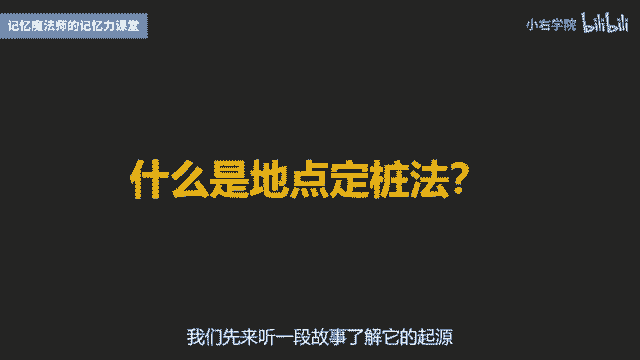
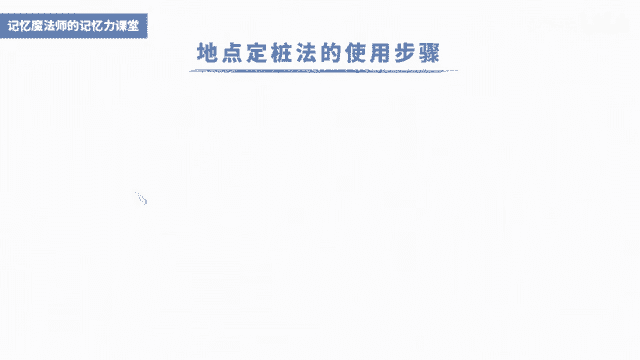
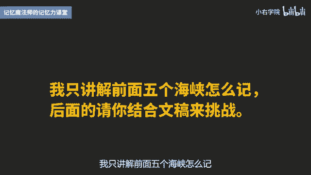
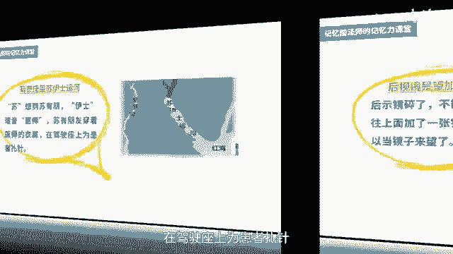
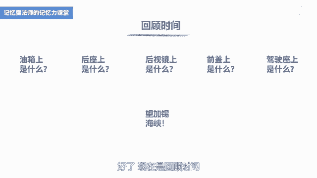
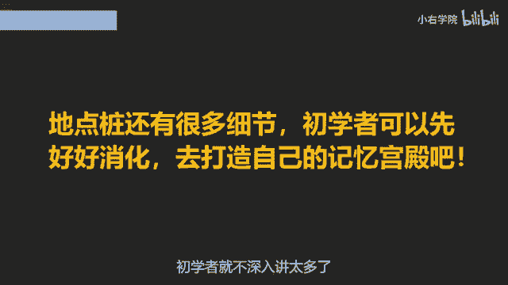

# 海马体记忆法：助你成为最强大脑 - P8：08 、【记忆宫殿】神探夏洛克的秘密武器 - 清晖Amy - BV152tfe9Ev3

你好，我是记忆魔法师袁文魁，欢迎来到我的超强记忆力课程，让我们一起拥有超强记忆，创造学习奇迹，上一讲我们学习了身体定桩法，用身体部位尝试记了24个字的，同时我分享了在学习考试里的运用。

然而身体装毕竟比较有限，就像一个内存很小的手机，那要怎么才能扩大内存呢，地点精装法就是一个很好的选择，地点定转法强大在哪里呢，想要成为记忆大师和最强大佬，几乎所有的记忆选手都需要使用地点定桩法。

如果你曾经看过，有人表演道德经或者牛津高阶词典等，任意点背他们的秘密武器，也是地点精装法，那这么庞杂的东西都可以清晰记忆，学习考试里的知识更不在话下，因此呢它又被称作大脑图书馆。

可以帮助我们把知识有序存放在大脑的空间里，那到底什么是地点计算法，我们先来听一段故事。

了解它的起源，在古希腊的时候，有一个著名的诗人西蒙尼代诗，在一场宴会上，他吟诵了一首抒情诗来赞美主人，同时也赞美双子神卡斯托和波鲁克斯，这位主人生性比较吝啬，他说那我只付一半的酬劳给你。

另一半要他向双子城去讨要，没过多久，门外有两个人要见一下西蒙尼戴斯，当他来到门外的时候，整座宴会大厅的屋顶突然倒塌，主人和全部的宾客都被压死了，原来呢这是双子神变的，他们救他一命，作为他的酬劳。

西伯利戴斯凭借自己的记忆，回忆起每个人的位置，帮助死者辨认了尸体，他也因此有所领悟，排列有序是记忆的关键，那这个呢给古罗马人很多的启发，他们要进行演讲和辩论，需要记住大量的信息。

他们注意到自己的家里面的房间，家具器皿的摆设都是固定的，那如果把需要记忆的内容和每样物品进行联想，那么只要想起物品就可以了，想起所记忆的内容了，这样就解决了按顺序来记的难题。

这种方法呢当时被称作是古罗马式法，也被称作是记忆弓箭法，这种方法在明朝的时候啊，由利玛窦传到了中国，那他当时呢创作了一本书叫做西国记法，也就是港剧读心神探里面出现的记忆宫殿，而在英剧神探夏洛克里。

福尔摩斯也拥有这项神技，那现在的通行的叫法呢是地点定桩法，如果你在一些记忆书籍里看到了信箱法，挂钩法形成法，那都和记忆宫殿法比较类似。

这么神奇的方法使用步骤是怎样的呢，第一步啊要寻找地点桩，原则呢依然是要熟悉，有顺序有特征，我们先可以从熟悉的地方开始找，比如自己或亲戚朋友家，学校办公室等，顺序方面呢一般按顺时针的方向来找。

尽量有一些高低错落，另外就是要彼此能够区分，如果把同样的四把椅子都作为地点，这是一定会混淆的，我以文稿里的这张图片为例，在这个房间里，我按照顺时针方向找了五个地点，第一个呢是梳妆台，第二个是床上的枕头。

第三个是台灯，第四个是椅子，第五个是书桌，好在这里我再补充两条原则，一是要固定的东西，尽量不要找能够跑的东西，比如说猫猫狗狗什么的，二是要适中，包括大小距离等，每个地点就像一个舞台和他定妆的形象。

就像演员太大了，演员不太突出，太小了，演员站不下，两个舞台之间的距离太近，那两台戏的演员就会互相串场，记忆就会出现混淆，那这图中的五个地点呢距离比较适中，彼此的界限清晰，不太会产生干扰。

一般我们找地点桩时至少十个一组，记忆选手会至少30个一组，找完之后，我们会闭上眼睛回忆几遍，就仿佛我们进到这个房间进行参观，身临其境，依次把每个地点看到，这样才叫找好了地点装，第二步是使用地点桩。

依次把需要记忆的信息，与每一个地点桩进行联想，联想时要注意地点桩是固定的舞台，不要把舞台想象到其他的空间去了，好我举一个地理常识为例，中国有个成语叫做五湖四海，那在中国呢五湖是鄱阳湖，太湖，巢湖。

洞庭湖，洪泽湖，那美国的五胡是什么呢，是苏必利尔湖，休伦湖，密歇根湖，伊利湖和安大略湖，那我们就用刚才的这五个地点来尝试记忆吧，我们就依次让这些形象，在舞台上开始他的表演吧，第一个地点呢是梳妆台。

我们要记得是苏必利尔湖，正好啊梳谐音为梳头的梳，可以想象呢在梳头的时候拿着一个匕首，太锋利了，不小心呢割到了耳朵，所以就想到了苏必利尔湖，第二个地点是枕头，修轮呢可以用拆盒的方式，想到正在休息的周杰伦。

那他在枕头上面躺着睡觉，第三个地点是台灯密歇根湖，密歇根呢可以想到了蜜蜂歇在树根下面，把台灯想象成是一棵大树，那蜜蜂呢就歇在了台灯的根部，第四个地点呢是椅子，伊利很容易想到伊利牛奶。

想象了椅子上面有一盒伊利牛奶，一屁股坐下去，牛奶呢打湿了整个椅子，第五个地点呢是书桌，安大略湖，安可以想象一个保安啊，大乐可以想到很大的这个大虐，想到了省略号，想象一个保安呢用警棍在书桌上面敲打。

打出了大大的一个省略号，这就是安大略湖，好了，现在呢请结合文稿再看看图片，然后我们闭上眼睛回到这个房间里面，依次来看一看每个地点，看是否可以想到上面的图像，并且呢回忆出具体的内容，在五秒钟之后。

我将要公布这五个地点上分别是哪五个湖，而它们分别是苏必利尔湖，休伦湖，密歇根湖，伊利湖和安大略湖，那第三步就是管理地点桩，我寻找的地点桩都会用本子记录下来，在哪里找的地点，每一个分别是什么。

如果条件允许，还会拍成视频版和图片版，在电脑里专门设文件夹保存，找完了要立马去使用，多用几次就能把它深深的记在脑海里了，有人会问地点桩可以反复使用吗，还是用舞台来比喻。

在舞台上不同时间是可以有不同的演出的，只要时间不太近，在使用地点桩时，一般不要一天使用多次，这样容易混淆，如果用于数字扑克等记忆训练，我一般每组地点每天只使用一次，如果用来记忆需要长期保存的信息。

比如背诵道德经，论语等国学经典，那这些呢我尽量用专属的地点以后，不要用它来记忆其他的信息，关于地点定桩法，刚才讲到的主要是房间里的摆设来定妆，这也是大部分中国的记忆大师常用的。

国外有些记忆大师喜欢用行程法，比如在一条街上行走，已经过的有特征的店铺或标志性建筑作为装置，英国的G冠军安迪贝尔就以伦敦的大笨钟，伦敦眼等作为庄子，我一般不太习惯这种方式，因为舞台太大。

就需要记忆的形象，也像浩克变身绿巨人一样，才可以适应这么大的舞台，另外一些人喜欢比较小的地点，甚至的把大件物品拆分成局部，分别作为不同的庄子，比如一辆汽车，摩托车或者电冰箱等。

这也是地点定桩法的一种变体，叫做万物定桩法，它和身体定能法也很像，只不过是用非生物的身体罢了，我就举一个用摩托车上的地点来定妆的例子吧，你可以参考一下文稿里的图片，我在图片里的摩托车上标注了十个部位。

分别是后座，驾驶座，油箱，后视镜，前盖，后挡板，尾气孔，发动机红色罩，前轮按照的是上排从左往右，下排从左往右这样一个顺序，那我们要挑战记录的是什么呢，依然是地理的常识，对于一个拥有周游世界梦想的人来说。

积累一些地理常识非常有必要，连世界上有啥都不知道，去哪里都是抓瞎呀，今天我们要挑战记录的是世界十大海峡，那海峡呢是指两块陆地之间连接洋与洋，洋与海，海与海之间比较狭小的水道。

世界十大海峡呢都是海上交通的咽喉要道，具有十分重要的政治经济和军事意义，它们分别是一马六甲海峡，二苏伊士运河，三巴拿马运河，四望加锡海峡，五霍尔木兹海峡，六朝鲜海峡，七波斯湾，八曼德海峡。

九直布罗陀海峡，十阿拉斯加湾，我只讲解前面五个海峡怎么记。

后面的请你结合文稿来挑战，后座是马六甲海峡，想象一下后座上有一匹身怀六甲的马，正在使出全身力气再生小马驹，驾驶座是苏伊士运河，苏伊士苏，可以想到演员苏有朋一四谐音为医师啊，也就是医生，想象一下。

苏有朋穿着医师的衣服在驾驶座上为患者扎针。

邮箱，要注意的是，巴拿马运河，巴拿马呢想到了奥巴马拿着一个玩具马，他呢按着马的头在油箱里面喝油水，后视镜是望加锡海峡，望是望远镜的，望加呢是加减乘除的，加锡呢是希子的锡，后视镜碎了，不能够往后望。

所以呢往上面加了一张锡纸，就可以当镜子来用了，前盖是霍尔木兹海峡，霍尔木兹呢有一点难度后，我会想到了功夫大师霍元甲，那耳呢谐音为耳朵的耳木，是想到木棍Z向它发出吱吱的声音，好，就想到了功夫大师霍元甲。

在耳朵上面夹着一根木棍，那点着以后呢，烧到了前盖的上面，发出了滋滋的声音，好了，现在是回顾时间。

当我说到摩托车的某个部位时，你要想到对应的形象，并且翻译成海峡的名字，油箱上面是什么海峡，巴拿马运河后座上是什么，马六甲海峡前盖上是什么，霍尔木兹海峡后视镜上是什么，望加锡海峡驾驶座舱是什么。

苏伊士运河，恭喜你都记住了，以后看到摩托车就可以了，复习一下，希望有一天当你走过这些海峡时，你会想起曾经呢，我跟着袁老师用一辆摩托车背过它好了，我来总结一下今天的内容，我分享了地点定桩法的历史起源。

以及三个操作步骤，寻找地点桩，使用地点桩和管理地点桩，在寻找时要注意熟悉，有顺序，有特征，固定和适中，这五个原则，在使用时要注意不要一天重复使用多次，当然呢地点桩还有很多细节，初学者就不深入。

讲太多了，大家先好好去消化吧，去打造自己的记忆宫殿，并且用它来尝试记忆你想要记忆的信息吧。

今天的作业请尝试将十大海峡的后面五个，用摩托车上的地点来记住吧，并且呢将你的想法分享出来，六朝鲜海峡，七波斯湾，八曼德海峡，九直布罗陀海峡，十阿拉斯加湾，今天的课程就到这里了，请在文稿里查看今天的练习。

并且把你的想法在评论区里留言，和同学们一起切磋交流吧，也欢迎你把课程分享给你的朋友们，和他们一起拥有记忆魔法，成为最强大脑，为大佬赋能，让生命绽放，我是记忆魔法师袁文魁。

