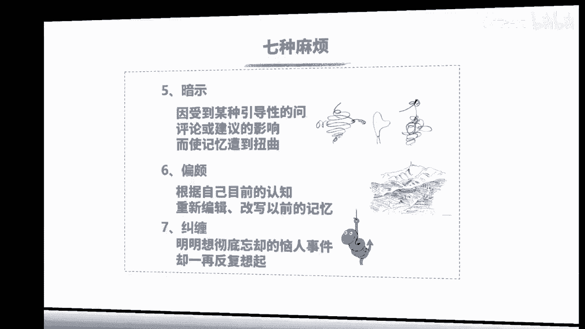
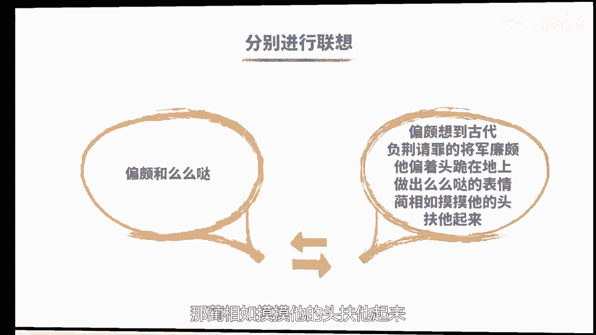

# 海马体记忆法：助你成为最强大脑 - P9：09 、【熟语定桩】熟记学科简答题的窍门 - 清晖Amy - BV152tfe9Ev3

你好，我是记忆魔法师袁文魁，欢迎来到我的超强记忆力课程，让我们一起拥有超强记忆，创造学习奇迹，上一讲我们介绍了神奇的地点定桩法，可以用来记忆海量的需要按顺序记忆的信息，前提是你要找到足够多的地点。

如果你没有时间去外面找地点，那我们该怎么办呢，还有哪些熟悉的，有顺序的，有特征的东西可以帮助我们来定妆记忆呢，今天我们将学习俗语定妆法，俗语就是我们已经熟悉的词语和句子，比如成语，东张西望，朝三暮四。

狐假虎威，比如谚语，小葱拌豆腐，一清二白肉包子打狗有去无回，比如那些年我们背过的唐诗宋词，白日依山尽，黄河入海流，大江东去浪，淘尽千古风流人物，还包括我们熟悉的名人名言，书籍是人类进步的阶梯。

人类一思考，上帝就发笑，那我们这些年存的货终于有用武之地了，当我们将俗语变成庄子之后，便可以用它来依次与要记忆的信息联想，从而达到按顺序记忆的目标，这种方法叫做俗语定桩法，它的优势在于你掌握的俗语越多。

你的桩子就越多，用来记忆学习考试里的问答题都非常好用，我们曾经帮助某单位参加计划生育知识竞赛，试题有800多道，我们大量使用俗语定妆法，帮他们轻松过关，那俗语要怎么变成桩子呢。

第一步需要将俗语转化成具体形象，一般是每个字分别进行转化，鞋子拆观众依然要派上用场，如果能够直接用它本来的字，就想到相关形象的，就用本来的字，其次是看看能否增加一些字组成词语，想到具体的形象。

那实在没有，也可以用谐音转换，或者呢用猜字的方式，比如逢你可以想到冯巩，也可以联想到缝衣服的缝，还可以呢用猜字的方式想到二马，想到两匹马，当一个字能够想到很多时，我们就会选择最快最先想到的那一个。

像冯我最容易想到的就是冯巩，所以呢我就用它来作为庄子好，具体我就拿一句诗来举例，拿李白的望庐山瀑布的第一句日，照香炉生紫烟为例，看看这句俗语该如何变成庄子日呢，可以直接想到太阳这样一个形象照哦。

可以主持想到照相机，那香呢联想到了我们洗手的香皂炉，可以直接想到了生火的炉子，生啊，组词的可以联想到花生紫，想到了紫色的紫薯烟啊，可以想到了火点着了以后冒出来的烟，好，现在呢这七个汉字啊已经变成了庄子。

接下来我们就一起来看看俗语桩该怎么用吧，那正好的可以记住七组信息，我们呢来挑战记忆一下政治的一道题目，那这是高考和考研都绕不过去的重点，也是关乎每个中国人幸福的，我们一起来看看是哪七大战略。

他们分别是科教兴国战略，创新驱动发展战略，乡村振兴战略，区域协调发展战略，可持续发展战略，军民融合发展战略，有些人呐一看到政治题就崩溃，因为内容比较多，而且比较抽象，那我们就一起来试试记忆法。

看会不会更加轻松有趣一些，科教兴国，那要和太阳来定妆，想象一下，一个科学家手里拿着一个太阳的模型，正在教一群中国的学生，关于太阳的知识，学生们听了都很兴奋，所以第一个是科教兴国，要和照相机定妆。

想象呢清华大学的精英人才正在照毕业照，他们竖起的大拇指表示强，那么照相机定格了这样一个画面，第三个创新驱动发展要和香皂来定妆，想象一下你对香皂进行了创新，在里面加了一个驱动，用香皂一碰到头发。

头发呢就会展开，注意了，这是创新驱动发展，接下来乡村振兴要和炉子来定妆，想象一下乡村里面呢很多农民在生炉子，发地震了，炉子呢在震动，农民们看到了很兴奋，这个是乡村振兴，下一个区域协调发展。

要和花生来定妆，想象一下，在一块地里，花生种的特别好，另外一块地呢则非常的荒芜，那我把花生呢移到荒地里面，来促进区域的协调发展，第六个是可持续发展，要和紫薯定装，想象一下超市里卖的紫薯是有包装袋的。

你可以呢手持着它来吃，而且吃完以后还能免费再续一包，这就是可持续发展，军民融合发展要和烟来定妆，想象一下，军人和农民把收集到的柴火都融合在一起，然后点着以后呢，就升起了炊烟啊。

这就是一幅军民融合发展的画面，好了，现在请依次回忆日照香炉生紫烟，分别想到每一个字对应的形象，再看看每一个形象对应的知识是什么，你是否可以很好的回忆起来呢，请参考文稿，牢记吧，如果哪天考试考到了。

你可就赚到了，也祝愿中国早日建成小康社会嗯，我们这个案例里选择的俗语，和题目并没有太大的关联，那如果看到题目以后再决定使用俗语定桩法，也可以尽量找与之相关的俗语，比如我在给富爸爸。

穷爸爸这本书的读者讲课时，里面讲到开发财商的十大步骤，我就想到了朱门狗肉臭，在记忆法律知识，我国民法的基本原则时，在武汉大学做演讲时，我就会把演讲的要点与武大校训自强弘毅，求是拓新来进行定妆。

选择的俗语除了相关以外，尽量的选择里面的字比较形象的，另外如果在俗语里有出现相同的字，比如可上九天揽月，可下五洋捉鳖，出现了两个，可那一般呢我会把后面一个可服用，有时候呢我也会用一个词来作为一个装。

比如黄河入海流，那黄河呢是一个具体的形象，就可以呢，整体上作为一个庄子俗语定桩法的进阶版，叫做标题定妆法，也就是把问答题的标题拆开成桩子，直接与要记忆的内容进行联想，那这样考试时看到题目提醒。

我们的线索就在眼前，不需要再去想我们是和哪一句俗语来定的装，比如记王安石变法的主要内容正好有五条，就可以用王安石变法这五个字来定妆，那我举一个与记忆法有关的例子，美国哈佛大学心理系主任丹尼尔夏科特。

他在你的记忆怎么了，这本书里提出记忆七宗罪，讲解了记忆出问题给我们带来的七种麻烦，分别是指，一健忘，就是既随着时间过去而减退或者丧失，二分心，因为注意力不集中，没有记住该记住的事情，三空白。

脑子里努力想去找某一个信息，却怎么也想不起来，四错认，误把幻想当作真实，五暗示，在唤起过去记忆时，因受到某种引导性的问题，评论或建议的影响而使记忆遭到扭曲，六偏颇，根据自己目前的认知重新编辑。

甚至全盘改写以前的记忆，七羞惨，明明想彻底忘却的老人事件，却一再反复想起。

那相信大家都有经历过这记忆七宗罪，比如别人刚告诉你名字，你扭头就忘掉了，这是健忘，如果是因为想其他的事情没有听到，这就是分心，如果你记住了。

但是拼命回忆都想不起来，就是空白，如果你初次见到某一个人，却感觉似曾相识，就是错认，如果你对这个人很讨厌，想忘掉他，但是脑海中一直想着他，这就是纠缠好了，我们就一起来尝试一下，用你的记忆怎么了。

这七个字来定妆记忆吧，先来转化成庄子，那你呢可以了，谐音想到李白D啊，可以想到了第一次G想到记事本义呢，可以协影响到亿万富翁啊，具体想到了王健林的形象，枕谐音响到了枕头，摸，想到了么么哒。

摸摸头的这样一个画面，鸟想到了断想到了用刀来砍的画面，接下来要分别来进行联想，健忘和李白可以怎么联想呢，想象的李白经常喝酒，喝完酒以后就会写诗，但是呢酒醒以后就忘记是自己写的了，所以呢非常的健忘。

分心和D士，想象一下的士司机呢开车的时候啊，看美女分心了，就撞到了电线杆上，空白和记事本，想象呢你想偷看好朋友的记事本，结果发现里面是无字，天书都是空白的，错认和亿万富翁王健林，想象一下小目标。

定了一个亿的王健林，错把你当成了儿子，王思聪把一个亿送给你，这可把你高兴坏了，暗示和枕头，想象你呢躺在枕头上面失眠了，你给自己催眠，暗示我很困，我很困，我马上就睡着，好偏颇和么么哒。

偏颇呢想到了古代负荆请罪的将军廉颇，他偏着头跪在地上，做出了么么哒的表情，那蔺相如呢摸摸他的头，扶他起来。

最后一个纠缠和了断，想到了一对男女啊，用绳子捆绑纠缠在一起，李用刀呢砍断了绳子，让他们一刀两断好了，现在呢我们根据你的记忆怎么了，来尝试回忆一下记忆七宗罪吧，回忆完了可以在文稿里核对答案哦。

相信你也get到标题定妆法的精髓了，也期待呢你举一反三运用于学习，好又到总结时间了，所以电脑版的操作步骤，第一步呢是要根据题目要求选择合适的俗语，比如熟悉的成语，歇后语，诗句名言等，也可以直接用标题。

第二步是要分别将俗语的每一个字，转换成具体的形象，转换的时候要尽量用本字或组词，实在不行，再谐音或猜字，第三步是将需要记忆的信息，分别和装置进行配对联想，并通过复习达到长期记忆的目标，光说不练，假把式。

你们赶紧用起来吧，今天的作业。

水浒传里，梁山有马军五虎将，分别是大刀，关胜，豹子头，林冲霹雳火，秦明双鞭，呼延灼，双枪将董平，请使用水浒五虎将这五个字，作为庄子来进行记忆，并且将你的想法分享出来，今天的课程就到这里了。

请在文稿里查看今天的练习，并且把你的想法在评论区里留言，和同学们一起切磋交流吧，也欢迎你把课程分享给你的朋友们，和他们一起拥有记忆魔法，成为最强大脑，为大佬赋能，让生命绽放，我是记忆魔法师袁文魁。

