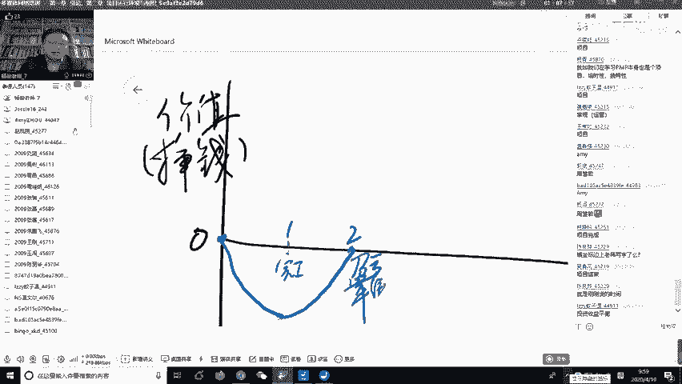
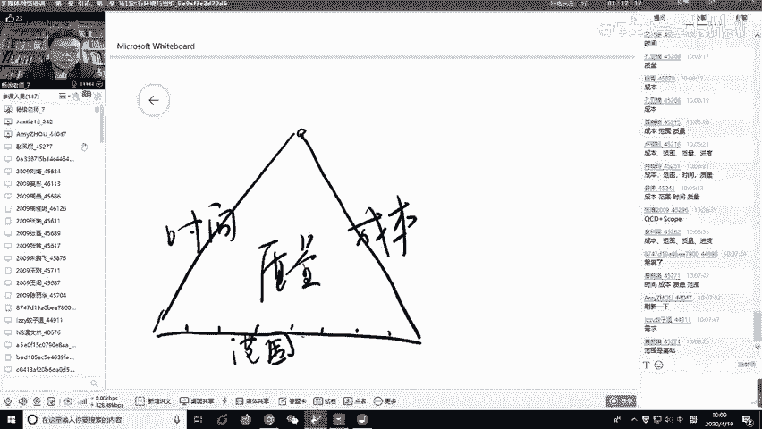
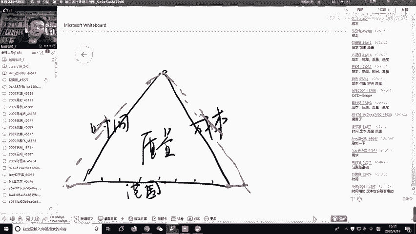
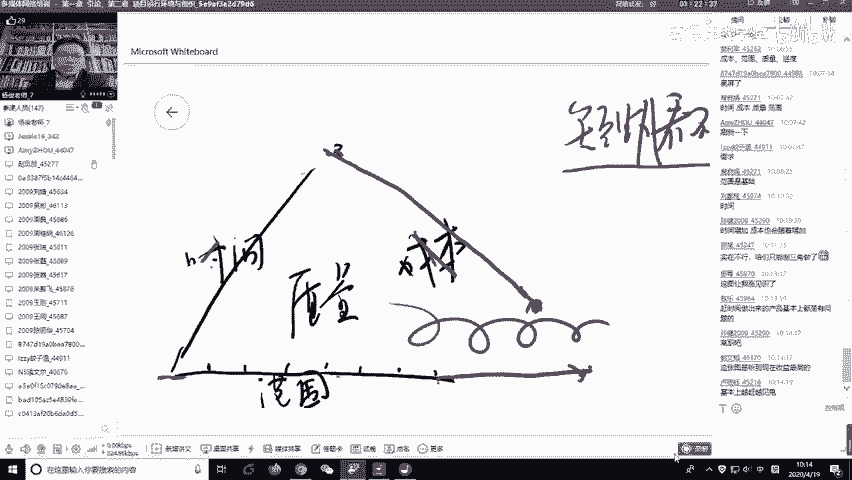
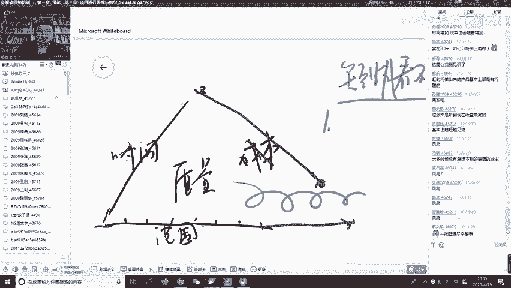

# 清晖PMP直播班课程内容-免费版-备考PMP必看课程！500强总监授课 - P1：项目管理是什么？ - 清晖在线学堂 - BV15c41167Sa

🎼。那为什么？第二个呢叫做项目管理，它是什么啊是什么呃。这个话题太大了。那我一时半会，这5天我都要讲是什么啊，我先请大家看一段视频。呃，这个视频呢只有呃5分钟的时间啊。

但是他把项目管理的精髓啊全部浓缩到了这个视频里面。我每次上完课以了，都有学生跟我要老师那个视频能不能给我啊，我那个再说哈呃我先看。先看呃这个视频呢是嗯英文版的。啊，因为这个项目管理我觉得做的。比较好。

他是美国啊，这个实事求是的讲。因为呃最早的就是项项目管理，现代项目管理起源是起源在呃二战时期的那个有一个项目叫做曼哈顿计划啊，曼哈顿计划我不知道有同学知道这是个这是一个什么计划啊，这一个什么项目啊。

原子弹的项目。嗯，那个原子弹的这个美国人就是和德国人当时是竞争啊，呃大概就是开谁先造出原子弹。这个对二战亚的胜利是有是有决定性作用的啊。呃，再后来是美结果大家都知道，就美国人造做出来了嘛，10万个人。

有科学家、工程师啊、军方啊政府啊参与，那他们就是就是如期甚至提前去把这个项目就呃deve就交付了啊，所以我觉得还还是确实是后来美国又发展了一些那个甘特图啊，关键路径啊等等啊，包括政治管理啊。

全都是就是起源于美国。所以这个视频是英文版的啊呃。大家听英语有没有问题？啊，能不能听英文？啊，我估计大家的答案是不行那没关系啊，老师给大家呃加了中文字幕啊，老师加了中文字幕啊，哎呀不少同学说可以，好好。

没问题啊。那可以，你听听中文字幕也没问题啊啊，老师给大家放一下。😊，哎，这个视频。啊，看啊仔细看，看完以后我得我要提问的啊。吓。Introduction to Project Management。

🎼By no escape。🎼What is a project？A project is a temporary endeavor。

🎼Which has a definite beginning and end。🎼That is carefully planned by dividing into several phases to give out a unique output。

🎼How are projects different from operations？🎼Projects are temporary， they create unique products。

And are closed after attaining the objectives。🎼Whereas？🎼Operations are ongoing processes。

🎼They are repetitive。🎼And the objective is to sustain business。Meet Jen。

Jen is an automobile designer who comes up with the brand new design of a car。

Her team collaboratively comes up with a plan。And creates a prototype of the car。

Creation of the prototype of car was a short term temporary process。

The prototype developed was unique。And the project ended after the prototype was developed。

Let us consider that Jen now has an idea of mass producing these cars。

Then she sets up a factory with an assembly line。And she succeeds in manufacturing cars every day。

Mass production of cars is an ongoing process， the assembly line repetitively produces cars。

 the objectives of this process is to sustain business of selling cars。

🎼What are the phases of the project management？🎼Projects are divided into phases such as initiating。

🎼Planning。🎼Executing。🎼Monitoring and control process closing。

Collection of these has are called as a project lifecycl。The phases sound simple enough。

So why manage a project？Here are the statistics。🎼Only one out of four projects that enter development make it to the market。

31% of the IT projects are canceled before completion。

 large organizations net only 42% of the original features and functions in the end product。

🎼Why do projects fail？🎼Failure in projects can be due to various reasons， Let's see some of them。

Failure and time management。John has the dream of constructing a beautiful home for himself。

He starts it at a young age， but does not plan it correctly。Even after him reaching his old age。

 due to improper time management， his dreamhouse could not be completed。Failure and Cot management。

Jamie wants to buy a beautiful dress for an upcoming party。

 she plans to go to a nearby mall to make the purchase。

 since she does not properly plan the costs involved during shopping。

She ends up buying a lot of stuff with all the money left with her。Failure and S management。

Jack wants to buy a shiny new convertible car so that his wife and him can go on long drives。

 but in less than a year they have a child， and now the convertible car does not seem to be the correct choice for the family。

🎼Failure in quality management。John spends a lot of money in buying a big home。

 since he did not check the quality of the home before he bought it。

🎼It collapses completely in a few months after his purchase。

Who will rescue us from all these problems？Who is the one who manages everything in a project？

The one person to save us from all of these problems is the project manager。

What are the skills of the project manager？Let's see what are the powers our superhero。

 the project manager had。Leadership。🎼Communication， Information technology。🎼Accounting， purchasing。

🎼Problem solving。🎼Let's review some important points in project management。

Let's take the earlier example of the creation of new design of a car。It is a temporary process。

🎼He had started with the idea of the car and ended after the mockup was made。

🎼This project gave a unique prototype of the car。🎼During the development。

 the project was divided into many phases like ideation， planning， etc。Ha。啊，好的，我们看完了啊，这个视频看完了啊。

我们先考考大家。😊，那中间一个超人出现了，对吧？那个项目经理啊，那考考大家大家听到了什么？啊，里面讲的什么，现在还有印象。啊，大家可以在这个公聊区里面写一写啊。啊。啊，项目经理需要的能力啊。

对各种能力啊，问题解决能力啊，什么还有财务能力，还采购能，你会计能力啊。嗯，项目失败的原因很好。嗯，项目生命周期对，分成了启动规划执行监控收尾啊，这些周期对，五个阶段嗯。啊，对。

还讲到了项目和运营的区别啊啊，很好很好。呀，这个我觉得这个班这真的是学霸班啊我刚才说听放英文，你们能不能听听懂了啊，纷纷说听英文没问题啊，这个班太厉害了。😊，好嗯啊老师带大家过一下啊。😊，那首先想一下。

嗯，那个他一开始讲他讲他有个主意，有一个概念是要想造一辆车子。后来他造了一个原形，原型出来以后造的第一辆车就是有有主意到第一辆车，这是一种工作。第一辆车出来以后，有第二辆，第三辆。

第四辆一辆一辆往后往后造啊，那那就另外一种工作。从无到有，从0到1是一种工作，从1到N是另外一种工作。这两种工作叫做什么？美国项目管理协会把我们的社团的工作恰恰就是分成这两类，一类叫重复性劳动。

一类叫非重复性劳动。重复性劳动就是。昨天做什么，今天做什么，明天还做什么，区别不大。啊，它叫做持续性的持续性的意思就是。反正天天做也不知道什么时候是个头啊，重复性的就是今天做的事和昨天做的事基本上类似。

那这叫做运营的方式，对吧？那就是从第一辆车子造到第N辆车子呗。但是从第零辆到第N辆第一辆车子。那这个他叫做项目吧，叫做非重复性劳动，就非重复性劳动意思是说领导交办了一件事儿。这件事情跟你以前相比啊。

你可能没有没做过，或者是没完全做过，反正有点不一样。这叫独特性，对吧？那领导交办理这件事情呢，BD必然它有一个截止日期，你什么时候要搞定，你不是无休止的，三个月搞定还是6个月搞定，还是下周搞定啊。

那这叫做临时性吧。所以呢这个非重复性劳动，如果他满足独特性，以前这个事没做过，临时性有截止日期，那我们就应该把它当项目来做。而不是当当运营来做啊，所以这就是他俩的。

基本区别吧。那在企业里面呢。

那项目和运营的大致关系长得就像这样，运营就代表了一个公司当前的运转水平啊，造车子啊，今天100辆，明天100辆，后天100辆运营。那项目呢每做一个项目就提升了企业的运营的水平，对吧？

那我做了一个新项目扩大的产能了嘛，那不就不是每天100辆，每天200辆了啊。

那大家想想看。是项目挣钱还是运营挣钱？

那是我天天运营赚钱，还是说我投一个项目赚钱，那显然是运营赚钱。哎，大家答的对了，那肯定是运营赚钱。

那那项目是干嘛的？项目肯定是花钱的嘛啊，那为什么要花钱做项目呢？😊。

因为叫做提高挣钱的能力，对吧？我本来是一天挣100块的，我做一个项目，我投入了一点钱，后面我每天可能挣到200块钱。那项目就项目本身是花钱的，但是他通过花钱提升了赚钱的能力，就这个意思呗。

啊，那项目项目本身啊，我们就可以来区分一下你就哪些是项目，哪些是运营啊。比如第一个开发一套新系统，这是项目还是运营？你开发一套新系统，那显然是项目吧。系统上线以后每天运营，每天的运行，那显然是运营。😊。

校园招聘本身呢肯定是项目。招顾来以后，对人员实施常规的培训。常规的培训去年做三门课，今年还做三门课。那偏向运营吧啊。组织一次大型会议，领导说你来你来组织一个，你开一个年会，那现在你是年会的导演。

那这个显然是一个项目。对吧会议为期一年的健身。啊，V7年的健身跟下一个叫健身打卡相比，那应该有区别。为7年健身叫叫做项目对？健身打卡我天天打卡的那偏向运营，重复性还是比较大的。安排一次员工培训。啊。

安排培训啊，比如说我们这一次我们班主任，我们班主任叫什么名字啊，大家还记得吧啊。高开面对话。😊，那么惠敏艾米啊，他他做他其实就是我们这个项目的这个全国的这个PMP这个课程的项目经理呗。

那每次讯后做问权调查，那叫做运营，对吧？所以这就是项目和运营的一个基本的区别和联系啊，但是其实他们有深层次的联系啊，老师给大家讲。啊，我共享一下桌面啊。啊。他们其实是有一些更加深层次的联习。

我画两条线。

重者叫做价值。

什么叫价值呢？说的太书面化了啊，简单一点叫赚钱。

觉挣不挣钱。横折叫做时间。嗯，那挣钱呢这个这一块我们把它叫做零啊，一开始他没挣钱，也没花钱，让0。那么假设我现在开始要做项目，我做项目的时候，我一开始从这个零开始出发。他觉得应该往下走还是往上走。啊。

一开始一开始应该是会往下走吧。往下走就是你要花钱的嘛，你做项我不是花钱。

你花钱，你做到这以后，然后再慢慢的起来，对吧？那这里面就有两个点，这是一号点，这是2号点。😊。

一号点代表了什么？那一号点我是不是可以认为我代表了叫做项目完工，对吧？

因为花钱花了已经花到谷底了，花了这么多钱，慢慢的我挣了一点回来，补偿起来。这其就是项目完工，交给运营，运营不是开始挣钱了吗？

那么2号点是什么呢？2号点意思就是把花的钱全挣回来了，现在不赔也不赚。所以2号点我们把它叫做盈亏。

对。平衡点。

对吧那到了2号盈亏平衡点以后其实不够的，你必须要继续往上赚钱。

要把你做项目干什么呢？所以他会继续往前走。往前走。走到这以后呢，也许呢这个曲线会变成这个样子。

甚至有的曲线会变成这样子平了，这叫3号点，这叫4号点。

3号点是什么概念？就是你这个产品其实在3号点之前，在2号到3号这一段，这产品卖的挺好的，挺火的，赚钱挺快。

也是到了3号到4号的这一段时间呢，好像这个赚钱慢下来。

对就是前面挺火的，后面可能竞争对手产品也出来了，产品需要更新换代的。所以在3号点的时候，我们把它叫做项目管理这个盈利的拐点。

挣钱从快到卖。

大概有一个阶段，买卖出现了。那么4号点呢，4号点后面变成一条直线平了，那4号点之前好歹挣点钱嘛，4号点以后根本不挣钱。所以4号点这个这个点呢，我们把它定义成叫做产品生命周期的终点。

产品生命周期老师讲了一个新的概念啊。

啊，这产品是命哲期的重点。

也就是说我们在做一个项目的时候，你首先你在项目启动的时候，心目当中要有这几个点啊。😊，这你项目什么时候完工对吧？完工以后交给运营了，对吧？运营什么时候能够把投的钱给收回来，收回来以后开始挣钱。

挣到什么时候，我觉得这个这个钱可能呃差不多了。这个可能竞争对手啊，这个产品。😊，可能需要更新换代了啊，可能没那么火了。那3号点4号点的时候，这个产品就比较就应该把它咔掉了，对吧？那么你到3号点的时候。

大家想一想啊，思考一下3号点，如果出现在3号点的情况，你应该做什么事？😊，啊，如果在3号点的时候，是不是说我应该把刚才这个故事再讲一遍？就是我我再起一个新项目，然后花钱，然后再挣钱。

再领亏平衡再再往上再往上，是不是这道理对？啊，我这个屏幕大家可能不一定看得清楚，我这样画啊，他就不再往上，对吧？那这个这叫做项目和运营的一个基本联系啊，所以。很多我们在启动项目的时候。你一定要搞清楚。

就是我项目现在目前在启动，我解决什么问题。我能赚多少钱，你你做项目你不赚钱，你开始烧钱，你做然去烧钱，那你你烧钱不能无休止的烧钱，你也要有一个预测的模型。所以你本质上还是为了挣钱。

你一定要想清楚我这个项目有几个点构成这几个点分别大概在什么时候，我的日记在这几个点，我要如果说我能挣钱，我能挣多少钱？是另外呢问题还要能够明确好谁负责这些点。啊，老师讲的四件事啊吧，第一件事。

我这个项目的这几个点有哪几个点啊，这个点在什么时候会出现这些点能挣钱能挣多少钱？谁负责这些盈利啊，很多人我们在实际做项目的时候，一开始就是拍脑袋，然后就开始开始做一个项目的。

然后做项目的当时拍个脑袋是我们这个项目还是很有前途的，是能挣钱的，你也没讲清楚，分为哪几个点，每个点具体的能能做多少钱，你没讲清楚你不但没讲清楚，你只是说你拍个板，然后说能挣钱。

后面项目真开始做起来以后，第一个项目做完了，这个项目的点做完，实际上这个点在这当是你发布的时已经跑掉来了，已经延误了啊，延误了呢，后面的有没有跟踪呢，没时间跟踪，然后你就启动启动了一个新的项目。

就一个项目接一个项目，一个项目接一个项目做了好多项目，但是整体的这个产品生命之后期是不是做到了很好的跟踪啊，有没有人跟踪，有没有人回过头来再做经验总结教训，再去做回顾呢？😊，没要打个问号。啊。

有的公司做的还不错，但是很多公司只知道启动项目，一个一个的做项目，这个项目收益到底怎么样？啊。很难讲。这就是讲的项目和运营的基本联系。那我们这门课讲什么？那PMP一共讲一共有5天的课程，讲什么？

这门课我讲的我们只讲这一段。啊，这一段就是项目启动到项目结束。对吧那这一段大家看到还是很短的，但它虽然短，但是它重不重要，它极其重要。如果你这一段搞不定。你在项目启动的时候就没想清楚到底解决什么问题。

为什么启动这个项目，你也没想清楚后面的盈利状况，盈利模式啊，能不能赚钱，也没想清楚后面人员怎么把它组织在一起。那么结果结果就只能导致说你这个一号点你根本守不住。啊。

你即使守得住加班加点做出来最后的那个有没有收益很难讲。所以我们就聚焦在项目启动到项目结束，提交提呃转给转移给运营这一段时间啊，这就是项目啊，我们这门这门课的关键点。啊。

那这一块呢我们也有时候我们也把它叫做叫做项目呃生命周期。而从一号到4号叫做产品生命周期啊，这就这两个生命周期的区别就出来了。所以项目大还是产品大，既然产品大？产品生命周期包括了项目生命周期。

加上运营生命周期。对吧。好，那，这个呢就是这一块了。啊，我们就先先简单先对项目管理，项目本身有一个呃基本的概念啊，那对于如果说我们就聚焦在刚刚的那前面的那一小段啊，那这一小段我们到底怎么管。

到底需要做哪些事情啊，那我我还是给大家画一个模型。呃，我来。我好还是共享共享一下桌面啊，来给大家画一个模型。嗯。嗯么对于这一小段，我们到底要做什么事啊，现在我们就专心研究这小段的事情。这一小段做什么呢？

😊，首先请大家思考一下，回忆一下刚才那个是。短视频里面。他讲啊项目失败有几个原因，我不知道大家还记不记得啊。

什么没管好有么范围没管好嗯。时间没管好，成本没管好。哎，时间没管好，成本没管好，质量没管好，对吧？讲了四个没管好吧。这四个没管好，是项目管理里面的。

一个很重要的话，这个内容，你项目管理到底管什么范围时践成本质量啊，那么这这四件事情呢是围绕着这个PMP的第五章呃，第五章第六章、第七章、第八章啊，大家手藏如果预习过的，知道第五章讲范围第三章讲精度。

第七章讲成本。第八章讲质量啊，这四个没管好。那么这四个没关好，老师给他画一个也是画一个图形出来啊，画一个三角形。

啊，这个三角形的底下我写上范围。啊，我范围可能大家是不是看不全啊，我写到上面一点。

啊范围。

左边写时间，右边成本。中间是质量。啊。好，那么我这个三角形写在这呢啊，我我大家看到我是把范围写在了最底下啊，范围最底下代表的什么含义呢？代表的是。

是基础。就是你当你要做一个项目的时候，你是先考虑他做什么，还是先考虑什么时候搞定，还是先考虑要花多少钱。

啊，应该先考虑什么啊，花多少人，甚至投入的话，人力物力啊。首先应该是先考虑的是。这些项目应该做什么吧。项目做什么都不知道，你说三个月交货，那不是废话吗？那项目做什么都不知道，然后你说我需要几个人。

那肯定没法估人了，没没法估计。

所以通常来说，我们说范围是基础，你大概也知道做什么，你肯定要知道做什么嗯。你就知道做什么呢？你把这个范围分成小小的块啊，大范围分成小范围啊，每一个小的小块需要多少时间，那你不就知道总时间了吗？

你知道了要做什么，你也知道呢要花多少时间做，那你就知道我挑几个人进去吧，那这是思维思考的基本顺序。

那质量是什么？质量你可以理解为，它其实就是里面的面积啊，那我时间给你的时间多，那你这个也许质量会好，那给你成本高，也许质量会会更好上一个台阶。所以对于一个首先呢你做任何项目。

首先要了解我这项目到底是干嘛的。那么基于范围看时间，基于时间，看成本。最后我们看质量。那么三角形这件事呢。

为什么为什么啊大家看到书上啊各种各样的书上面都画三角形。为什么他画的是三角形？

嗯。啊，因为三角形呢，其实我们小时候学过，它有一种特性，啊叫做稳定性啊，稳定性。所以也就是说三角形假设你三角形当中的有一条边变化了，比如说范围变化。

范围变化了，意思就是不是中间不是变更嘛，客户今天说哎，明天说B领导就给你加一个C，你作为项目经理，觉得人人都可以跟对你说话，人人都可以跟你提要求。你这你你如果范围控制不住，那你这个范围卖的一塌糊涂。

那你范围假设我范围变了，我范围变了呢，我范围变了，我看像画三角形怎么画，我我会这样画。

我我把它延伸到这来，当我延伸到这的时候呢，哦我就这样子，我可以我这样可以成本重新画一条线吧。

意思是说我范围多做了，再给我加两个人呗，那这事还是可以可以搞定的。

啊，但是呢有时候你不一定啊你不一定能做到。因为。

成本控制的很死，很没有人给。

那你想一想，那我范围不多了怎么办？我换一个方法，我范围都画在这儿画右画到左边去，时间可以再加吗？

也就是说我再给我两周时间，这项目还是可以做成的啊，但是你给你的给了你两周时间哈，你有时候也想多了啊，领导也不会给你两周时间，觉得你没时间，你还是要到点搞定。😊。

啊，我对我去的一些公司，他们是时间根本都不是他们自己估的。他一上来做一个项目，合同里面已经签好，说好了，6月1号交付，然后给到这个项目团队成员，项目团队成员傻眼了，怎么我们什么都没介入。

然后你这时间都承诺下来了。然后他们就他们后来就跟我说啊，其实问题说哎呀，老师怎么样，说我们这个项目啊，我们拿到了一个合同上来，我们就心里面就就明白了，这个项目肯定延误3个月。😊。

所以这个时间已不是太好谈啊。不不是很好听。

那这时候怎么办？那这时候你说范围增加了嘛，你时间也不给，成本也不给，那你想什么办法呢？

那很多同学说我打质量的主意啊，我这量快正常我就做了一半，反正我到点有交货了啊，你先别着急，你还其实还有还有一种可能性啊，你还再谈一谈嘛，就是我两边各出一点头。

两边各出一点头，意思就是啊我不要三个人，你给我半个人行不行啊，我们谈一谈啊，能不能有半个人让，他让他支持一下啊，也不要两周时间了，我三天再给我三天啊，这事我还是可以保质保障做好的啊。

嗯，你要你要停的第三个方案，但但是对不起，第三个方案又想多了啊，第三个方案领导说一个人都没有啊，一点时间都不给你问你怎么办？

啊，这时候你你觉得把他自己逼到绝头上去了啊，那怎么办呢？那就拿出来放一个超级大招啊，就当你范围无限蔓延的时候，交交工呃，交货期也不变，人也不给你加，人说你怎么办呢？放一个超级大招叫做加班。

说讲没有什么事情，加班，不是加班了，搞不定的对吧？如果有，那就加两次吧。

啊，996啊007啊，这些都开始加班。那加班了加班加点，你最后就就加成这个样子了。

啊，成本也没给你降啊，范围给你蔓延。结果你把引这个三角形成这个样子。

这三角形出了个什么问题？三角形的问题就是这个开口了。嗯，这个一个开口的三角形。当你一旦有一个开口的三角形的时候呢，就会有东西跑掉。也就是质量大家看出来，就可能从这个开口这个这地方给跑掉，可以留流出去。

所以这解释了什么现象？就是当你范围没有控制住啊，或者别人让你多做时，或者自己在镀金啊，那时间的成本呢也不给你增加，你加班加点加通宵，最后事情啊确实按期交货。在那个时候。

你赶工按确实按期交货的那个交货那个货。

质量有没有可能有问题？

那很多时候质量可真可能出问题，因为你是赶出来的呀。

嗯，那为什么质量会出问题呢？😡，因为质量有个根本的特点，叫做短期看不见。

质量这件事情，它真的是短期看不见的事情。他你你交付的时候，客户觉得okK还没问题，一个月以后给你觉得有问题啊，3个月以后，6个月一年以后呢，各种各样的工程呢慢慢都冒露出来问题来对吧？为什么前面的不抓紧。

前面的没有科学管理，后面全是全部靠赶工。😊。

那所以这质量它就有这个现象。

那如果说啊。呃，大家今天听了这个课啊，今天星期天下周去上班了啊，你发现你的项目真的是开课的。😊。

这个时间和成本根本hold不住这个范围。啊，那你怎么办？这个事还做不做？

啊，你可去跟领导说，哎呀我我星期天我听了一节课，我听了一个郑老师的课。

你这个事情是开口，所以这个事我们不能做这个三角形开口，所以不能做。

那领导怎么说？领导说人话，什么三角形开口了？

你不要跟我废话，对我估计你做还得做啊，你你不做，你除非不想干了。😊。

但是呢。

学项目管理的意义是什么？啊，意义就是就在这，真正有项目管理思维的人，他始终会聚焦一个点，就是你这件事情短期看不见未来出问题，这是个什么事儿？

啊，现在没出问题以后可能出问题，这在项目管理面叫什么？

那以前我在线下的大家说，叫做隐患，讲的没错，叫做风险，对吧？风险或者隐患。

就是你作为一个优秀的项目管理者，你永远有一个心态。就是我现在做的这个事情，未来可能会造成什么样的风险，未来可能会造成什么样的问题啊，那么你作为一个一个专业的项目管理人员，首先你第一步呢。

你要会去识别风险。

。识别风险不能说简简单单的说啊，老大，我觉得质量可能有问题。啊，我经常听到你。大家这样识别分析，项目进度可能出问题。项目成本可能超值。项目质量可能不合格，这种事这种分享的说法全是废话，你无法管理。嗯。

那你要这样去识别风险，那我就干脆我说一个风险，我说项目可能失败，不这是不是风险？那当然是风险，但是你太笼统了，没法去管。你在识别风险的人候，你肯定要讲清楚我质量我质量是在什么情况下使用户怎么用。

使用什么模块，当时可能会出什么事情，这个事情发生的概率如何？那是有套路，但是有有格式的对吧？你只有这样子，你把那个风险具体的那个事件讲清楚，人家才真正的理解。我该怎么办？所以关键点是什么？

专业的去识别分析。这项目管理的思维的第一步。啊，专业的识别分析。对吧？第二步。你真正专业的识别风险，如果你识别你的项目风险，你也许能识别出10个8个风险。啊，你十个分险，我觉得你一定能识别出来。

因为这个项目本身就是一个创创新性的事情。那确实很多时候那就是要要。一定是有风险的，如果一个项目一一点风险没有，那就说明这个项目管理成本太高。那你们那个我就在不上项目管理。所以你识别出来10个8个分险。

那你接下来怎么办呢？接在你要想的就是我对风险管理的态度是什么？嗯我对风险管理的态度是是不是说我要处理好所有的项目风险？这是极端错误。因为有风险它有收益，所以我对项目风险管理的态度是以可控的方式去冒险。

啊，老师再讲一遍，以可控的方式去冒险，这才叫项目管理项目识别风险的正确的态度。那什么叫以可控的方式去冒险？就是你要去研究哪些是关键风险，一定要处理好，哪些风险觉得OK现在你就就这样就行，我们后面等着看。

啊，所以也就是说第二步的时候，你一定要会去判断风险的严重性。哪些风险非常关键？可能会造成验收不过的。哪些风险可能是客户到时候不付钱。这个风险太靠了。可能有些风险呢啊你觉得也许问题不大。

所以重点你要后去判断要用一种可控的方式去冒险。那么到了第第二步以后，其实还不够，你要做第三步了。第三步，你跟老大说啊，老大，我觉得我们项目当初目前当中有一个很重大的风险，我觉得这个风险等级很高。

那你跟老大讲有个有个重大的问险，老大问跟你怎么说。啊，老化肯定问你怎么办嘛？😊，那你跟老太实对话，你不能说老大我也不知道怎么办了，你来说说你说怎么办就怎么办，你你给点建议嘛，啊，那这不是不不够专业。

又不是专业的相目管理啊，那专业的其实有经验的工作时间比较长的人啊都知道啊，我觉得应该也有很多工作时间比较长的，有经验的同学在线上啊，大家知道领导喜欢做什么题，不喜欢做什么题。😊，嗯。

不是客户喜欢做什么题，不喜欢做什么题。对。首先我们说客户不喜欢做的，客户不喜欢做的肯定是什么？领导不喜欢做的。问答题吧啊出一个问题啊，领导作答啊，或者不喜欢做的，叫填空题。那喜欢做什么题呢？

喜欢做的我应该一般来讲人们都喜欢做什么选择题呀，或者是甚至是判断题，对吧？那么也就是你真正优秀的项目管理思维是我聚焦在了一些风险上。然后我现在去研究现在可能有几种应对方式，叫ABC3种应对方式。

A的优点缺点，B的优点缺点，C的优点缺点。那我现在我觉得B方案是最佳方案。于是你你这样去去思考的话，你给领导出了一个什么问题啊？啊，叫做。选择题甚至是判断题吧。那么反过来讲。

我这样的思维方式对自己是不是一个历练，然后是不是可以我长期的我这样去训练自己啊，就专业的项目管理思维永远聚焦在。未来可能会出于哪些隐患，有哪些风险。然后我做一点事情。嗯，我看研究研究。

看看这些风险优先级怎么样，他们是不是严重。当你分析优风险优先级，我们在后面的十1章会去专门去讲啊。我记得今天讲不了我，今天只能一开始先只能给大家打基础。那么严重度你怎么去分析？

对你怎么可能挑出那种高等级的分析？然后挑出来以后，你还要去研究我这个风险应对措施可以做哪从哪几个维度去输发那风险应对措施不是拍脑袋的，不是想到什么是什，风险应对措施都是有方法的。

那有时候我们觉得项目管理难为什么难？因为是因为你对他不了解，你就不认知。有些工具啊方法你不知道啊，所以你会觉得难。所以对到第三步，就是你要你要一定要培养这个思维，就是自己要去也想。

要思考动脑筋到底可以怎么办？然后呢去给出这样的建议。我为什么我一定要给建议？为什么要给建议？因为有一句话叫做。客户一定是要引导的。啊，或者换句话说，领导也是需要引导的。啊，你千万不要想着。

客户你说什么我做什么，你有什么要求我都满足，这样子我就我我就可以提升客户的满意度，这是极端错误的。你一定要学会引导客户，引导的。甚至是引导领导啊，有些领导说你还想引导我。

但是有时候确实这个跟个人的沟通技能有关系啊，因为你引导他，你才能够你可以防止人们盲目的给你提各种各样的要求，知道吧？人为你最怕的就是有时候别人给他提你这个要求啊，别方他自己他自己都不。其实没想明白。

有时候客户跟你客户跟你在打交道的时候，客户自己也没想明白他到底想要什么。领导跟你提要求的时候，有时候你相不相信领导自己也没想明白。他不明白，然后你就开始埋头做，最后做出来结果不见得是他想要的。

所以你一定要去引导感些人，这是非常关键的技能。啊，那么对于这个。这个三角形老师就就讲到这啊，这个后面还有5天时0间，我慢慢来跟大家讲啊，所以这个三角形告诉我们什么呢？这叫我项目目标。

就是当你一说项目目样，这个项目要做什么呀？好，你上来就来结构，对吧？范围做什么，时间点在哪里？里程碑是什么？需要投入多少资源，投入多少人力物力质量质量测量标准是什么？你这三角形一画，哎。

你基本上你给自己也梳理了一下啊，我这个项目的起点是从这个三角形开始起步了啊，后面我再鉴定明细的慢慢的去完善。😊，有。好，那我再讲一个点，范围时间、成本质量这四个要素啊。我们要有一个很快键的点。

哪个排第一？啊，哪个排名第一啊，我来看看大家的选择啊，那范围时间、成本质量哪个排名第一，你觉得是最关键的。啊，我看大家选什么。啊。啊，哪个排第一好，我看到了啊，大部分写的是范围。呃，少部分是质量。

个别是成本。还有人说是平衡。啊，还有人说是范围时间成本质量啊啊都排第一啊，不存在都第一的情况啊啊，到你哪个排第一啊。😊，老师给大家看一个。Can I cake。看一个墙贴画啊。啊，看一下啊，这个讲贴话。

大家看下这个这上面写了一句话，这一句话哪个是项目无鸦？啊，鼓足干劲，力争上游多快好省的建设社会主义哪个项目目标啊，大家写我我喝口水啊。啊，像目标建设社会主义是吧？啊，回答不完全准确啊，怎么样。

关键是怎么建设社会主义叫做多快好选。😊，什么叫多？多叫做范围啊，什么叫快？快叫做时间啊，什么叫省省叫做成本，对吧？好质量。这个项目。啊，大连钢铁啊大跃进，我们国家钢铁大连钢铁这个项目多不多？啊。

这个产料多不多，产料很多啊。嗯，快不快？三连赶超英国，五连赶超美国，这么不快啊。审不审？自己家打铁锅就练钢铁了，砍柴来就练钢铁是吧，好不好不好。😊，多快审，但是就是不好。所以这个项目是成功还是失败？

应该众所周知失败。所以我们回到这个三角形来看的啊。啊，大家今天选择项目管理，我们统一一下认知。永远都是质量排第一的。啊，如果说一个东西质量不行。做的再多都是垃圾。做的再快。

客户一用你到你到商场里面买东西，一买这个东西质量很差，你下次还买它。做的再省钱。我不花钱，项目不是为了省钱，项目是要挣钱的。最排名第一的永远是质。啊，这一点要非常非常的明确。但有时候我们觉得很难呀。

那有时客户说你时间一定要给我那到点一定要给我成本一定要控制住，确实有非常非常多的难点。所以正因为难，我们才要取舍。质量。从我去的一些企业里面啊，我说墙上天天贴的都是质量第一啊，质量优先。

质量为什么那么重要啊，从宏观上来讲的话，我们国家就叫做制造业大国嘛，对吧？但是制造业大国一直强不起来，为什么强不起来？就是因为各种各样的短期目标牺牲了质量，做了一些质量比较很一般的东西。你你想一想。

有时候短期呢也好像是说哎我我我也不短期就是把这个东西给交了，但是你一定要有长远的思考。就是我想要把我的项目我持续做下去，我持续从客户那边来来接项目，我持续的让公司能壮大，质量这件事情真的不能妥协。

是真的不能特性。Right。但是质量这件事情呢又有另外一个层次。而且我们刚刚说质量好，质量好，其实这个话讲的不严谨。什么叫做质量好？你没法说因为好去定义一个质量，因为永远都有更好的质量。嗯。

所以对于产品质量的定义。关键在于四个字符合要求。叫做合适。对吧你你你要了解客户对你的要求是什么，你要达到客户的那个标准，这叫做质量。好。所以在第八章的时候，我们会完整的去讲如何去了解客户对质量的要求。

如何去通过质量管理计划是。保证在过程当中能够确保质量是合格的，而不是说质量靠测很多公司质量质量靠测。你到最后测试阶段的时候，你测你测的东西问题越多，你的产品质量就越有问题。啊。所以质量这件事情啊。

首先要了解要求是什么，然后研究如何达到这样的要求。所以这个是关键的关键啊，很多时候我们做项目我们不了解的，我们做项目就连需求一开始都很不清楚，然后就开始埋头开始做了。质量要求是什么？有时候真的没想清楚。

做着再看吧啊，到最后的时候还还在质量问题上进行扯皮呢，验收的时候还在扯皮。就这也是问题。有时候把这个质量要求我比作就像。工人在盖房子一样，工人在砌墙啊，你看到那些工人在砌墙，在砌墙之前干什么事？

工人在砌墙之前是不是先拉一根线？那根线照着那根线去砌墙嘛，对吧？但是工人从来没有这样做，工人说，我开始砌墙，我先砌起来，等这个验收的时候来拉一根线，拿一根线呢，我发现有的有的砖头超出的那根线。

我就P一P砖头，有的砖有的砖头中间有空隙，我就往里面填。😊，工人从来没这样做的，对吧？所以工人们。像我们班里的高手哈啊，我们要向他们去学习。那这根线就是什么质量？所以你质你砌墙之前一定要拉新。好。

这是质量问题啊，我们在第八章的时候，我们再画我大概花三3个小时左右的时间来讲。啊，老师讲的排第一呢，对吧？哪个排第二？范围时间成本哪个排第二？啊，我我举个例子啊。装修这个项目哪个排第二，是范围第二。

还是时间第二，还是成本第二，装修啊，装修是一个项目吧。啊啊，我看一下大家怎么答装修。排第二哈，现在排第二，装修质量肯定排第一的，你自己给自己装一个假平房，那个不可能的事情啊，所以装修啊打个排第二。😊。

要有范围，有时间，有成本。好好好好行。嗯，那都有了啊我们看一下啊装修嗯。装修说范围的，就是说。这个该装中央空调，装中央空调对吧，该装地暖装地暖，还，该装什么装什么啊，这叫范围排第一啊，一定不能少。

一个都不能少啊，时间排第一的意思就是我们还要要结婚啊，对吧？我5月1号要结婚，要搬进去住啊，过年要结婚对吧？所以啊也许我猜啊说范围的同学可能是土豪，家里有矿啊，我我该装的就要装。

说时间的也许呢就是要结婚的啊，或者是要干嘛，我也不知道啊，说成本的那是真没钱的，真的是搬砖的啊，上来就第一反应就是成本啊，这是多么的啊就个搬砖啊，都搬砖，老师也搬砖啊，没问题哈。😊，那这是饭。

这是我讲了，我再举一个例子，比如春节联欢晚会。啊，瞬间联欢晚会哪个排第二？啊，估计这下大家统一了时间是吧？大年算0晚上8点钟没搞定，你搞什么春节联欢晚会？所以大家有没有发现？当我在说哪个排第二的时候。

这个事情是不一定的。这个真的是要看项目的特点。什么叫项目特点？就是看干系人的要求，什么干系人的要求，关键干系人的要求。你就要理解那些关键干系人，他目前当前最大的痛点是什？你才能够排出来哪个排第啊。啊。

是比是的大理啊。比如说。你作为项目经理，你去问人。哎呀，我昨天上的课，我还问人问又问你的老老大还会问客户，哎，范围实践成本哪个排第二？😊，别人怎么说？有这什么好说的都重要，什么排哎有排第二这个说法。

哪个重要都重要，一个都不能缺。啊，于是你作为项目经理，后来跟团队成员讲，老大说呢都重要，范围时间成本我们一都得保住啊。那你这个就不是项目管理了，你这是传申统机器人都可以做你的相信。当别人说都重要的时候。

这时候考验你的时候来了。你会不会觉得当别人说多重要的时候，有没有可能对方其实也没有想清楚这件事情啊？他其实没有想清楚。或者说对他来说，他不怎么在意都不重要。那么对于你作为项目经理，你有没有责任去？

理一你。帮干系人，帮客户去理一理这件事情到底什么很关键。如果说这件事情啊，也许时间真的是很关键。因为你这产品交给他以后，他要和其他的产品做集成，他要上提前抢占市场。那真的是时间很重要。

也许呢你去理一理呢，你发现啊这个这个项目成本真的很重要。因为我们真的这个报价太低了，不不怎么挣钱，所以成本要控制住。也许呢你想没想出这个项目的范围很重要，因为客户真的是需要这些功能。

这个功能如果没有客户就不要了。所以你作为项目经理，这是你的责任。去想一想，在你这个项目里面，你应该保什么，你应该舍什么。老师再说一遍，这是项目经理你的责任。不是去问人，因为你问人。

别人也许根本就不了解他自己到底在想要什么。啊，有的人很清楚，我见过有非常清楚的客户，他直接就跟你说这个项目什么很重要，那你就真是装大晕了啊，但是有的客户他真的不知道。所以这是你项目经理的责任。

你要发挥你的什么叫做专业能力。什么专业能力？老师这个专业能力，我前面要加一个定理，叫做业务专业能力。不是技术专业的人。那，技术专业能力。就是你那个技术实现的方式，很多新的项目经理跟客户谈谈技术。

说这个东西很难实现，那东西很难实现。客户说时间不实现，是你的事，关我什么事啊？所以你在你从技术骨干变成项目管理以后，你的思维模式要从技术转向业务这个层。什么叫业务呢？

就是你要去了解你这个产品未来怎么用啊，你这个产品未来怎么盈利啊，你这个产品客户在客户方客户是怎么看待这个产品的，甚至是你要去了解这个客户方给你提这个给你对接的这个客户，他在他的公司里面是一个什么位置。

他是一个处于一个什么样的结构，他的老板对他是什么要求啊，他的跨部门沟通会出什么障碍。你的思维完全要转成这种业务思维。所以你你这有。优秀的项目经理啊。啊，他一定是要比客户还要了解客户的痛点。

你这个项目经理你才能做下去。啊，老师再讲一遍，优秀的项目经理要比客户还要了解客户的痛点。你这个项目才能做下去，什么叫才能做下去呢？客户才会信任。你千万不要说我天天去问客户想要啥啊。

而是说呢你上面前几句话，你就要了解客户的背景，客户的状况，客户当前的痛点在哪里。然后你通过业务语言和客户去对话，而不是技术语言跟客户对话。那么这才叫优秀的项目经理啊，所以考验的是你的业务专业能力。

用业务语言而不是技术语言跟客户进行对话。啊，所以这个这个哪个排第二这件事情啊，其实就是让我们思考了叫做项目管理呢，我们一定要秉承这两个字，叫做舍得。什么叫舍得呢？就中国的这个词对吧？这个就特别好。

就什么叫舍得？叫做有舍才有得。如果你什么都想得，最后什么也得不到。你什么都想得范围啊，要保住啊，又要做A过回，又要做B，过几天又要做C。时间本来6个月的6个月变7个月，7个月变8个月。

成本不断的投进去一个项目，6个月的项目，最后做到了一年的项目，一年终于做好了，做好以后给客户客户说，我不要了，这个项目没用。如果你不知道取水的话，你这个项目整个就会做成什么水多了，加面面多了。

加水开始活命啊，最后活成了一堆东西。所以一定要了解项目管理的叫刚性和弹性的问题。啊，这个刚性的弹性从项目目标里面是有的。后来后面我们再讲第第六章，再讲关键路径，再讲进度的时候。

你也要了解在项目的进度的各个活动当中，哪些是刚性的，哪些是弹性的弹性的，我可以舍什么，我必须要得手啊，也就是在关键路径上的一些活动，我一天都不能耽搁。在有一些活动上面，我耽搁几天，我耽我都没省啊。

所以这个这一块啊老师再说一遍啊，从项目管理的一开始，我们就要建立起来得失刚性和弹性这样的概念。或者说呢我们在比如说我们在装修，我刚刚讲装修的事情，你在装修的时候，你就知道在家里面有些墙能打。

有些墙不能打，什么样的墙能打，什么样的墙不能打。啊，承重墙不能打对。所以你做一个项目，你要了解我这个项目的承重强是什么。我这个项目的非诚用想是试。而不是被了别人牵着鼻子走。啊，那为什么我要这样思考了？

我的目的就是要确保项目成功啊，确保项目成功，这是项目经理。这个头等大事。不成功，一切都不谈好。啊。好啦，嗯，那我就。我刚刚讲的是什么？就是画的这个三角形，对吧？但是三角形这件事情只是项目管理的冰山一角。

问他我讲了三角形，那我们为什么要讲5天的课？那三角形就是。😊，对于这个项目管理十大知识领续来讲啊，这也就是项目管理。这对对于项目经理到底要关注哪些事情啊？我刚讲的呢，其实左边这些事。

这是范围时间、成本质量，这不是三角形吗？行。那么这个三角形呢是不够的。这三角形叫做做事，因为你会做事了。😊，啊，你交代了一个任务，你知道先想什么再想什么，再讲什么，他们之间的刚性弹性。

你会搞明白这个道理，但是不够。你需要有另外一个轮子。和人打交道，项目内部成员，请问你怎么样去管理这个项目团队，因为这项目团队成员不见得一开始在理你啊。那你刚刚刚开始任命一个项目经理，别人不但不理你。

别人有时候什么？他故意不配合你呢？凭什么你上去呢？那凭什么我不能上去，对吧？你你一何德何能，你就当了项目经理了，我还在做一线刚开师。人家一开始不见得那么配合你啊，这个话这问题你要想清楚，这正常的。

那你怎么带人啊？😊，啊，第二个。怎么和客户和干系人和这个什么智能经理啊，公司的各个各个层级的老大，怎么跟他们打交道，怎么让他参与到你的项目里去，这叫做干系源管理。啊，在第十这个在第十三章。

那么如果说你的公司是是有采购的，比如说你你和其他公司联合，你有供应商，你怎么去管供应商？那这里面也有学问，怎么管供应商，很多人觉得管供应商不简单嘛，我是甲方棒嘛，对吧我出钱了，他还不把事做好嘛。

哪有那么简单，你出钱嘛，你是他的客户，他还有其他客户呢？那他凭什么对你那么重视呢？😊，对吧，那。那这这个其实并不是说你出钱一就能怎么样的啊。啊，我经常听到啊在有些有些供应商啊啊，我跟你说。

你供应商里面的这个门道还是很多的啊，有的供应商对于一些客户来说，他就是客户说什么，他做什么啊，他他真的很配合你。但有的供应商你跟他一打交道，其实他就是想先接活啊，他先跟你说啊。

说哎杨成来来现来现在来来叫做投标的时候，他说我们公司实力极极其强大啊，我们有项目经理有若干人，有项目团队有多牛多牛，他觉得有你让你觉得这公司实力特强但是一旦做起来以后发现呢就一个光杆司令啊。

就是乙方的一个项目经理跟你对接一下，这项目经理什么都怕自己干，他就是一个光杆司令，所以你怎么样去管好你的供应商。😊，啊，没那么简单，不是给钱他就能干活啊。那对于项目内部成员怎么配合。

对于干系人怎么去管理，尤其是那些位告权重的关干系人怎么管理啊，对于外部的采购的其他公司，你怎么管，怎么管人呢？老师说你没法管人你没有办法控制别人，那你怎么去让他们跟你一起去打交道，靠的是什么？

两个字叫做沟通。😊，啊，所以我们在第十章的时候会讲啊，怎么做好项目沟通。那通过沟通啊，简单来讲呢。嗯，就是啊我觉得项目管理呢这大部分项目管理失败的原因啊啊不是别的啊，不是技术问题啊。

大部分项目管理失败的原因都是沟通问题，沟通不畅。啊，别人不信任你。对吧啊。大家目标不一致啊。呃，沟通起来呢，你跟别人讲呢啊，你觉得你已经讲讲明白了，但实际上呢别人没没听明白啊，你觉得我不是讲过了吗？

实际上做出来以后完全不是那回事。所以左边叫做事，右边叫什么叫待人。这是项目经理的两个核心技能。啊，做事有4件事情，待人有4件事情，这就八件事情。那8个小准哥，对吧？嗯，那做事呢待人。

这8个小格子底下有一个底盘。啊，我我其实有就会觉得像这个车子的两个轮子向前走嘛，对吧？那底盘是什么？底盘叫做风险管理。啊，为什么风险管理放在了底下？因为每一个格子都有风险，想一想范围这个事情做什么啊。

这个事情做什么，那这个范围会不会变啊？😊，那这不是风险嘛？变更本身那有可能就是风险吧，对吧？时间会不会有风险，那有风险呀，对吧？那成本会不会有风险，那成本会不会超值啊？有风险，人们会不会不配合你啊？

那供应商会不会质量出问题啊，这都是风险。所以这些风险怎么管理，就是这个项目管理的低盘。😊，啊，我们每我其实通过风险管理，风险管理是渗透到每一个小格子里面的一个全程把它贯穿起来的一个活动。

那上面呢叫做整合管理。什么叫整合呢？整合奉险两部分，一个叫外部整合，一个叫内部整合。外部整合就是我做项目经理之前啊，项目经理介入到这个项目之前，是不是有其他人已经干活了，比如说销售干过嘛，对吧？

比如说公司高层级决定启动这个项目，对吧？前面一定是有人已经干那些活了，给你做了一个商业论证，那给你做了一个其实有一些呃高层级的一些需求，其实是有的那你作为项目经理，你要和外部的人进行整合了。啊。

整核的前方进行整合，对吧？那么你作为项目经理，你做完以后，你你项目不是最后最后交给运营吗？那你要和运营做整合吧。对这叫外部整合啊，内部整合是什么呢？内部整合就是你这里面的这个8个小格子。

这8个小格子之间其实是有联系的。😊，那，比如说我时间我范围多做了，范围多做，我是不是要加人？那那不是有联系嘛，是吧范围多做了，那时间是不是会受影响，那有联系处理之间彼此的联系，这也是整合的一个工作吧。

啊，有时候我们还会讲整合呢就是叫就是解决矛盾啊，什么叫解决矛盾？😊，你的项目里面财务部门让你省钱啊吧，销售部门让你快，质量部门让你好啊，又省钱，你怎么快对？要快还要好好，还要省钱，这不全是矛盾嘛？

干系人之间对你的要求都是矛盾的，你怎么办？那你只能说抓住关键，找到一个最大公约数，然后统一大家的目标一起向前前进。叫叫做求同存异，对吧？那求同存异怎么就去做到求同求同存异存异呢？

那这里面首先你还是你对这个业务本身的核心痛点要去理解，然后呢，你还要超高的一些沟通技累啊啊，我以前在课上面讲过。啊，项目管理刚才我们看了个视频，项目经理需要有很好多好多技能啊。啊，要技术啊。

要懂但有以前有同学问我说，哎呀，说金老师我什么都不懂怎么办？现在老就在老板让我带一个项目。我说如果你什么都不懂的话，你至少要懂一点叫做沟通。😊，这就是沟通啊，那其实这沟通工作做的就是么整合的这个事情。

啊。这些实施领域。那实大支识领域呢，大家在视频里面也看到了，我项目管理分成几个主要的过程啊，哪几个主要的过程叫启动规划执行监控收尾。那在每一个过程里面，我又把这个十件事情纵轴是这几个过程。

横轴是这十件事嗯，那对于这十件事情，我把它分到这个过程组里面了。你就会发现这个就形成了49个子过程。这个49个过程就代表了。啊，这时候你在做项目，你就把它当做这是一个工具箱，就像下棋一样。第一招啊。

刚开始启动项目的时候，我应该做什么制定项目章程。什么叫制定项目章全？通俗的讲。任务书立向书啊，通俗的说，很多企很多企业有类似的文件，但它不叫章程啊，没关系。就是先想明白这个项目到底做什么，三角形画一画。

项目经理任命啊，关键给家先找一找啊，先有个任务书，然后下棋下第二招棋嘛，然后接下来干什么？既然你说制定项目计划错误回答错误，不是的。第二步第二部分是要找人啊，识别干系人，因为人太重要了，人们配合你。

你这个项目已经就成功一半了。啊，所以你首先要找到了一些关键的干系人，让他们信任。然后他们支持你，至少不反对你就行。啊。然后接下来呢你就开始下棋下啊范围啊、进度啊、成本质量啊，一招一招的下。

其实就是做好详细的计划，还是做起来。然后再做执行执行当中和监控其实它是息息相关的。边执行边监控监控什么监控你执行的效果和当初的计划是否一致，是要调整你的动作，还是要调整你的计划啊，最后也做到收尾。

所以一招一招的下棋。啊，这就是项目管理啊啊，那项目管理。😊，啊，并不是想象当中的。搞关系啊，那关系，请人吃饭啊，那就项目做好了，搞关系，请人吃饭，你会做，别人也会做啊，你有关系，别人也有关系啊。

那如果说你又会有一些沟通的技能，然后你要真的了解做项目这一个专业，项目管理专业的工作，应该做哪些专业的工作，那才能够建立起什么你的权威，就是专业权威。😊，好吧。好，那这一块呢我就讲到这儿啊。

那大家先有一个简单的全貌，我已经讲了。啊，有有个一个多小时，10点40了，要不我们休息一下吧。呃，我们这个课程是早上休息一次啊，中间休息15分钟好像下午的话，我们根据情况休息1到2次啊，先休息一下吧。

好，大家也听得辛苦了。那个也休站起来活动活动啊，休息一下，我们一会15分钟以后再见。好吧。好，那个谢谢大家，我们一会儿一会儿再见啊啊。😊，啊。好，那个好，大家好，老师又回来了啊，嗯，我也喝了喝了水。

休息了一下。嗯，好，那个哎我来点个名，看一下有多少同学回来了。这个功能这个在线平台的功能特别强大啊，我来我现在点名啊，大家能够看到的要。😊，点一下啊，签到。嗯。啊，不是在群里发一啊。

我这有一个有个专门的点名软件。好，应该大部分同学都回来了。😊，Yeah。好，来看看啊。啊，80%啊80%的回来了。好。好好，行行行，那我们开始了啊。嗯，今天上午第二节课讲到现在11点，讲到12点。

再讲一个小时啊，一个小时结束和大家吃饭啊。😊，好，那我们首先来。看一下回顾一下吧。上节课他讲的什么啊，上节课我讲的什么呢？啊，结果其实在讲这个PIP政策之前呢。你先打一些基础啊。

给大家介绍一点相关于的基础。那为什么学项目管理，项目管理是什么？项目管理怎么学啊，三个问题。啊，为什么啊，为什么学？简单来说的话啊，我觉得我们的项目管理管的真的不好啊，真的是有很大的改进空间。

所以呢我觉得答题还要自身硬吧啊，那个组织组织上面呢这个有各种各样的那个事业叫做事业环境因素，叫做组织结构啊，但是我们自己必须要懂啊，首先是自己必须要懂。😊，啊，然后当然从个人发展来讲的话。

项目管理真的是一个台紧，是第一个台监，那需要牢牢的把它把握好。嗯，然后我们讲的项目管理到底是什么？是什么？老师主要是给大家看了一个视频，啊，了解项目管理和运营管理的区别和联系啊。

从项目管理的这个角度来讲呢啊我们我们回答的就是前面那一小段那个工作啊，那一小段工作又包括什么，包括老师重点讲样的一个三角形就是其实就是项目目标啊，项目到底做什么啊，什么时间做花多少钱做啊。

这个人力啊质量质量要求怎么样？然后我们讲完三角形以后呢，我给大家看了一个叫做10个知识领域啊，就是三角形只是左边的那一块，那它叫做做事，那右边那一块叫做代言啊，做事和代人这两件事情呢。

你要呃其实是非常就是同等重要非常重要的啊。有时候我甚至觉得待人更重要，沟通更重要啊。那么在下面就是叫做风险，嗯，每一块都有风险，上面叫做整合。那么整合起来呢，把项目经理要做的事情再放到这个实物矩阵里面。

就是这个过程，从启动规划执行监控所有的这些过程呢啊你就可以得到了49个项目管理的棋子，我们可以下棋啊，按照这个步骤来。啊，但是老师讲这个下棋这件事呢啊，其实也没那么简单啊。你作为项目管理。

他其实本身确实有些管理的艺术元素在里面啊，但是。😊，那我觉得呢呃学习这个事情呢，首先还是先进去再出来。就是你会发你发现呢有些高手啊，项目管理啊，项目经理的高手，你看他无招生有招，他还要几句话啊搞搞啊。

他这个事情就搞定了啊。但是一开始的学的时候，你不要那样学啊，你这样子，因为就像那个。就像什么？张张张三分教张无忌武功一样，那你上来必须要练先练练完以后，最后才会形成什么无招生有招，对吧？一上来就无招。

先别人拿书棍子去打，那你不定你开始可能会不可能不一定打过人家啊。所以学项目管理，学任何东西，我觉得都是先进去再出来，先了解他对里面的方方面面的细节啊，每一块给他学扎手。

然后在实际工作当中去裁剪去研究在我这个项目里面，哪些东西，哪个这个49个过程，49个棋子，我用他15个棋子。或者说我用它，我哪怕我用他5个棋子，我这个项目管理我其实就有大大的改善啊，这样也行。

这叫做裁剪。但是前提条件呢是大家必须要静下心的去。真的像以前学习一样，认真的一道一道的关顾一1个一个知识点，一个知识点的顺底，然后进去以后才再出来。好，这是这个就是这个假我讲这个实物矩阵啊。

这个项目管理的一些核心的呃系统性的框架。那这个实物矩证是从哪来了？那就是从这个叫做PMbook啊，PMbook是美国项目管理协会的项目管理知识体系指南这本书。那这本书呃相当于呢是全球的项目管理标准啊。

它是从1983年开始，有第一版，然后基本上后续呢每4年都会出一个新版。现在大家考的这个呃这个学习的这个材料呢，是2017年的第六版。第六版和第五版其实是有改进的。

它大概每到4到5年就会产生一个新的版本啊，嗯我觉得我觉得我确实还我觉得挺好的。因为项目管理呢也是随着时代的演变不断的变化以前的项目管理可能最早的是用在建筑行业啊这个建筑啊军工啊这些大形象。

那后来呢软件IT的项目就多起来。那么到现在呢，其实一谈到项目管理呢，就反涉计面其实是非常广的，包括医疗啊嗯甚至包括日常的一些工作，比如说小园招聘啊，什么HR的工作哈，这个财务的工作。

其实很多工作就拓展到了方方面面，尤其是拓展到了什么呢？现在大家应该听说过叫做敏捷对吧？敏捷项目管理就变化特别快的互联网开发啊这样子这种可能倾向于IT但是敏捷也其实我觉得也不是光是IT的事情所以他这个平只能每每隔一段时间都会不断的更新。

嗯，是一个我觉得是一个与时俱今的一个标准啊，是比较系统。那么那大家如果学了这个PMP课程以后，最后拿到的证书，叫做PMP的这个证书，就学PM不可能拿到PMP证书。这个证书是怎么回事呢？

它是在美国项目管理协会推出的一系列证书当中的一个证书。这个证书PMP的代表的是叫做单项目管理，所以你能管好一个项目，但是你要看全貌的话，它可能在整个公司里面或者你个人往上走啊，你要知道。

其实对于项目管理不只是单项目管理啊，包括项目集管理和项目组合管理，这个我一会再也专门列个知识点会讲项目集管理简单理解的，就是你管理一系列的项目啊，这些项目之间彼此是有联系的。那么你对于管一个项目集。

那你关注点和管一个单个项目的关注点是不一样的啊，所以它也有项目级管理的认证。那么也有项目组合管理的项目组合管理呢，就主要是承接项目战，公司战略，那在一个项目组合里面包含了若干的项目集。

那为了实现某一个公司战略呢开展的一系列的项目啊。是个是更高一个层次的东西。那后面呢那就更深了，叫做项目治理。那项目治理也是我的一门课程。那这里面主要讲的就是如何做项目组织结构的搭建。

那主要是和企业咨询是嗯比较相关和高级管理层是比较相关的。那这样子是其实相当于是完整的单项目管理啊，呃项目及管理呃，管理几个关联的项目啊，包括项目组合管理啊，再包括呢项目组织体系建设啊。

这一块是一个所于是一个完整的版本。那大家现在学的是什么呢？学的其实就是就是我觉得是最基础的啊，叫做PMP项目管理认证啊，应该是一个呃一个基础的一个认证。那你你只有你会基础认证，你才能够继续往上走。

这是第一个台阶。好，嗯，那大家舍舍得让拿到的拿到的教材，拿到了一本除了这个PM book那个600多页的书以外，大家拿到了一本讲义是一个教材。呃这个教材是呃清辉的创始人和付老师写的这一本教材付老师。

我觉得这是一个呃学术型的这个企业的创始人，非常受人尊敬。嗯，他他自己孜孜不倦啊，不断的在学术道路上不断的向前进啊，从嗯那个MBEMBA，包括现在的香港城市大学的博士，嗯，后面也也出版了很多的书。

我觉得其实嗯是一个真的是一个学术型的，也是清辉的整个清辉的一个文化，就是一个学术型的公司啊，真正的把项目管理这件事情给研究透，然后用通俗易懂的语言，通俗易懂的方法，能够嗯和大家交流，然后真正的帮到。

真真实的项目管理的工作上。这个呢也我觉得也是我自己的一个使命。呃，我有我有一次特别有印印象特别深刻，就是。嗯，我有一次我在上上上课，上完课以后呢，请大家去交流，线下课去交流，有这个课程呃的收获嘛。

一些心得。有一位同学也讲了一句话，我我特别有感觉。就是他说呃他说老师啊，以前我们上课呃，他说嗯我们想学的东西呢。老师也不讲，就我们实际工作当中遇到的困难，老师老师不讲课堂不讲，但是课堂讲的我们也用不到。

就是课堂讲的好多好多的理论，好多好多的工那种框架啊，那个系统啊，我们也用不到。所以我就觉得对其对我自己来说，我当时也特别有触动。是啊，这真的是一个现状，就是我们经常去上课的时候。

就是老师讲的东西讲的确实很高大上，很抽象。但是我我很难运用。或者我想要听的呢又没人讲。所以对于我呃我个人来说，我开始这些课程，我自己也是也是真的是就是鞭策自己。就是既然大家。🎼花钱花时间来上。

我一定要讲就是实际有用的东西，一定要能够尽量就是马上就能用上，能够帮到他实际的工作啊，所以我觉得就是呃这样的为嗯就真的是对得起我们的学员。所以我也这也是。

