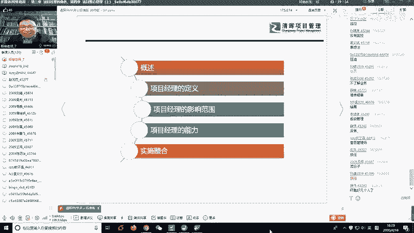
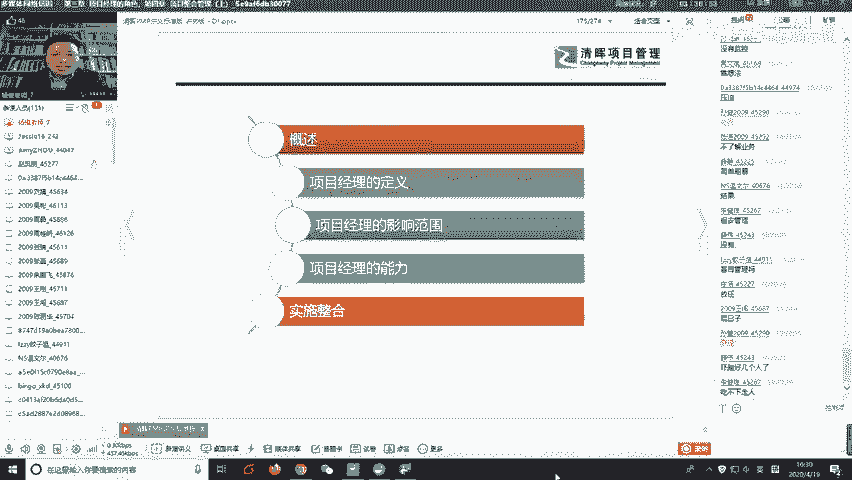
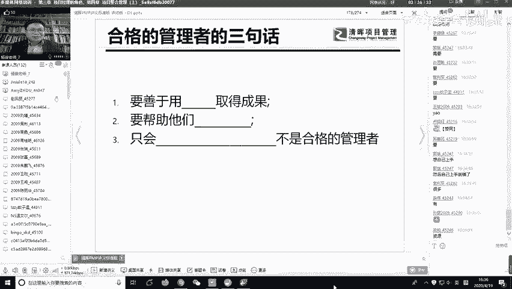
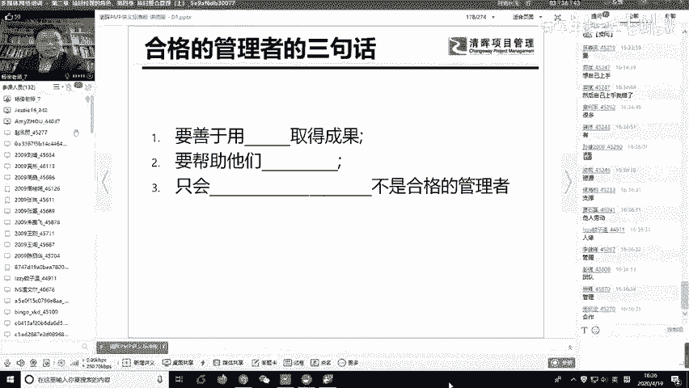
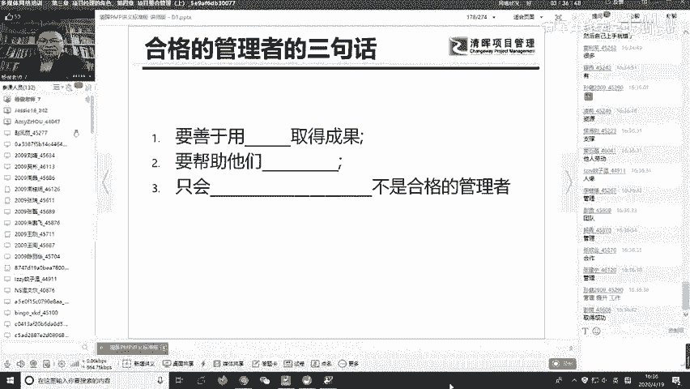
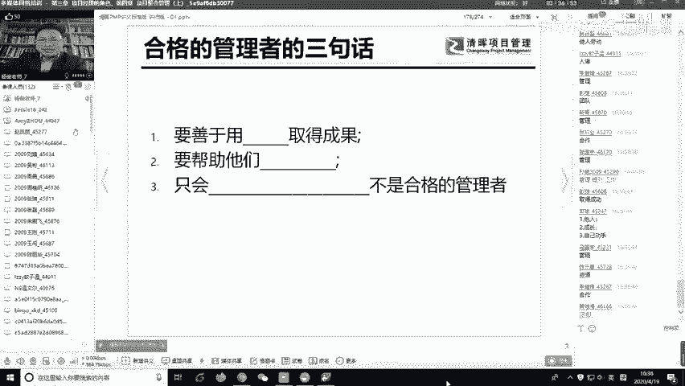
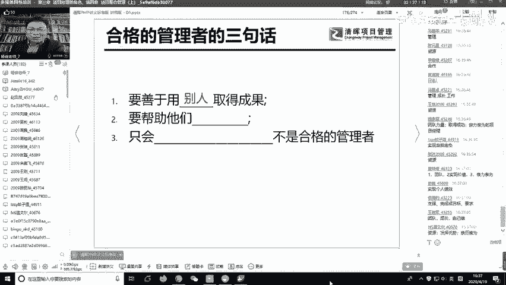
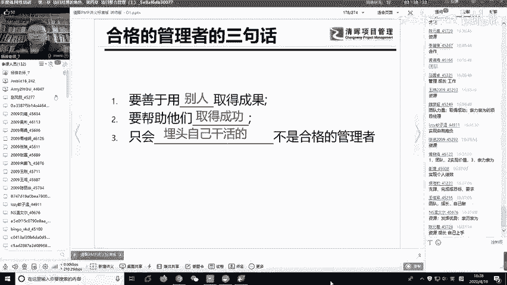
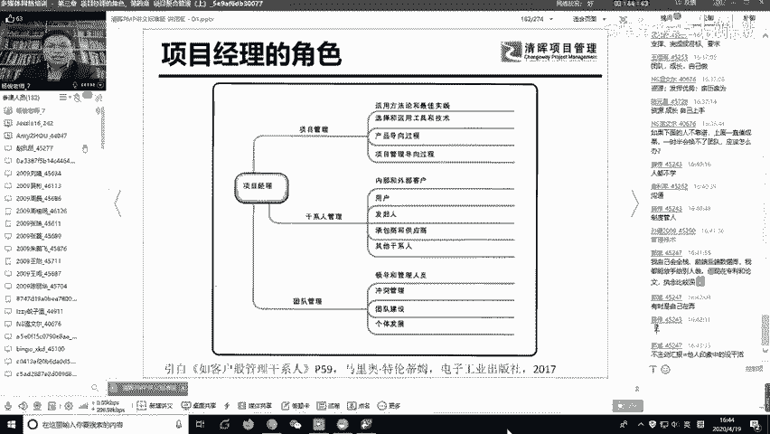

# 清晖PMP直播班课程内容-免费版-备考PMP必看课程！500强总监授课 - P2：项目经理要不要懂技术？ - 清晖在线学堂 - BV15c41167Sa

🎼。那你按照这种管理方式去做的话，你后面的90后、00后人家都做下了，对吧？

啊，所以这个是一个啊一种我们引以为戒吧，比较夸张，有点夸张，但是要引以为戒啊。那，看完这个呢，老师再请大家看一个，看一该做的还不错的项目经理。我们看这个做的还不错的，给项目经理可以怎么做啊？

啊再看一个是。うん。我们。🎼いはってみのしが。🎼Yeah。🎼えやわさにやれ。ませい。오어。これだけのさ。え。

哈。好了，另外一个项目经理我们看过了啊，他。是一个指挥家，对吧？大家看出来呢指挥家可以作为这个团队的领导。啊，大家再写一写这指挥家怎么管，你观察到了什么？他通过什么去带这个团队？Yeah。啊。

互动相互配合，讲的好啊，再来。他身上有什么？那他靠眼睛他有眼神的是吧，他有眼神的他不是靠火，而不是沟通基本靠火，他靠眼神，他根本没没说一句话。😊，还有一个铁汇棒哎。嗯，那个小小倩是吧。

黄黄小倩啊讲了两个字讲的特别好，叫信任，他们彼此之间是有默契的，是有信任。而且呢他也是专业的，他是真懂他知道怎么去我带好这个我我的音乐到底是怎么是是一个怎么回事啊？这交响乐交响乐到底是怎么做。

他是真懂的。所以啊。大家在讲义上面，这个第一页就是如交响乐队指挥般的项目经理。啊，想一下项目经理和乐队指挥，他们有什么呃相关性呢？那第一个就是成员和角色啊，乐队指挥指挥了这么多种乐器。啊。

项目经理也指挥了一些团队成员啊，他都有一个这个成员啊指挥的角色。那么职职责呢，那乐队乐队指挥是说我对交响乐的这个成功负责。那项目经理呢其实是对项目的成果负责。那知识和技能呢。

乐队指挥是需要了解一些各种乐理的啊，应该了解一些乐理，并且要做好沟通。那项目经理呢，你可能也是要了解一些相关的技术，相关的业务，然后做好沟通，对，这都是类似的。但是我们从表面上分析了分析三个共同点。

其实本质上这个月的指会为什么做的这么好？其实他自己大大家讲这种有个人魅力，对吧？那其实就是说他是投入的，你会看到他很投入这件事情，他真的是想把它做好，就是他有一个什么两个字叫做激情。

他真的有激情去做这个事。当你有激情去做这个事情的时候，你自己展现出了激情，有时候你根本不用沟通。就是别人啊并不是做你告诉他的事，别人是看你怎么做的。啊，老师再说一遍，别人并不是说做你告诉他的事。

而是说别人看你怎么做，他就主动的，这叫做什么need by exam。把它翻译过来叫做以身作则，这才是最有效的领导力。就是你把自己给做好。那我看到这个呢啊以前我们放到这以后呢。

这个这个同学呢就我就回忆起来，经常有同学问我一个问题。啊，问我什么问题，我说哎老师，你说项目经理要不要懂技术啊？😊，啊，那问我这个项目经理要不要懂技术？那大家觉得项目经理要不要懂技术？

你说作为项目经理要不要懂技术啊，我不是刚刚不是说沟通很重要嘛，那么你要不要懂技术，肯定要懂技术。项目经理呢乐队指挥懂不懂音乐？乐队指挥他能不懂音乐吗？乐队指挥肯定懂音乐。但是问题在于。

乐队指挥是不是懂拉小提情。乐队指挥是不是懂了吹笛子，那倒不一定。所以项目经理懂的技术和你传统意义上的你原来的那个个人贡献者的那个技术。不太一样。😊，那不一样在哪呢？有的项目经理原来是拉小提琴的啊。

拉小提琴拉挺好的。领导说你当项目经理，于是他站他站到乐队指挥上去拉去拉枪，当当乐队指挥了。可是他当一轮当师以后呢，他发现那个拉小提琴的拉的根本不行。那每次让他拉他到顶他拉不到位。于是这个项目经理他干嘛？

他这个指挥干嘛？他有可能会放下自己的指挥棒，然后跑到下面去帮那个拉小提琴的人拉几把小提琴回来。😊，啊有没有这样的？😊，一些新新的项目经理真的是有时候是会这样做的。他本来是位子，是做的是项目经理的位子。

他从项目经理的位子那个屁股就掉了下来了，变成了退化成了一线员工。😊，所以这件事让我们引起警觉的是什么？就是项目管理者通过许多其他人调配物质资源和信息资源达成工作目标。他在讲什么？

他讲的是并不是说项目经理直接伸手去干活，达成工作目标。他是说你作为项目经理，你应该是通过许多其他人通过调配各种资源，让他们成功达成工作目标。所以这一点就告诉我们，如果你未来，你如果现在是项目经理。

或者未来成为项目经理，你一定一定要记住，要管住自己的手。因为你从技术骨干出身的技术骨干出身的这些人，你让他干技术是吧？他的觉得特别带劲，他觉得特别有成就感。别人搞不定的，来，我来上来搞两下，他就搞定了。

他愿意干这个事，他觉得这个事情我能找到我的激情啊，一一旦让他管项目了，他就脸就大了。哎呀，这个怎么推动人啊，怎么做目标啊，那就不行了啊，这个时候你就是永远就是待在自己的舒适区。但是你要从舒适区里面。

你要跳出来，知道吧？所以这个这里面啊那老师给他三句话啊，就优秀的项目经理应该怎么办？😊。

要善于用什么取得成果？要帮助他们干嘛，只会什么什么什么的，不是合格的管理者。

来，大家填一填三个空。上一局用什么取得成功？

下一个口。啊填好一个是一个啊，填一个就马上往上写。嗯。郭斌写的写的挺全的啊。嗯，啊魏延抄写的也不错啊，亲力亲为。

啊。啊。好，老师来老师来来讲一下啊。😊，老师讲的我讲课都是大白话哈，所以第一个叫做用善于用什么，用别人取得成果。😊，不是自己觉得还是很能干，整个项目团队就你最能干。如果你一个项目团队就你项目经理最忙。

你为项目经理最能干，我看你里面这个劳碌命也不远了。😊，一定是用利用别人取得成功，要善于帮助他们干嘛？帮助他们取得成功。就是帮他成功，不是越俎太庖是你帮他干活了变成让他们取得成功，就是赋能这两个字啊。

你要给团队赋能啊，你提升他们的能力，让他们成，他们成功你才叫成。只会什么呢？只会埋头自己干活的。😊，不是合格的管理者。很多很多管理者原来是技术出身啊，他们从技术出身做了经理，做完经理以后，做总监。

做了很高的位置，这个问题还是没有想清楚。做的很高的位置的时候，有时候还在搞一些具体的技术，然后老老看别人工作不顺眼，老看他的下属团队不顺眼。你总觉得别人做的不行，就踏实。

他拿是搞悲观管理，有相当多的这样的项经理，项目经理，甚至是一些部门经理啊。所以说这个。管理者从普通员工啊技术骨干变成项目项目经理。首先你要思维模式上要做转变，你的模式要变成过去。

那个我我引用那个杰克韦尔奇的一句话啊，我觉得他是通用电器的CEO前段时间也离开了。那么他讲了什么呢？他讲了一句话叫做在你成为领导者之前，成功的概念只局限于你自己。

那就是你在职权范围内所表现出来的业绩贡献度和解决问题的程度。这叫你作为领导者之前，成功就是你自己要努力。成为领导者之后，成功的概念在于如何帮助他人成功。领导者的成功不在于你能够做什么。

而在于你的团队能够做什么。那这句话我觉得真的是很多管理者要要把它背下来。有时候我们在做当管理，我们从普通员工成为管理者以后，觉得自己的下属太差啊，能力不行，一定要认清现状。下属能力如果很行。

他怎么会成你的下属？那你凭什么称你下属，对吧？那至少跟你评级比你高吧。所以你要你首先要认清这个现状，下属你不行，那是很正常的事情，是再正常不过的事情。对，你不要去抱怨，说成这下属这个都都不行，那就我行。

你要做的事情是什么呢？你要去想办法怎么样能够帮助他取得成功，给他提供培训，提供资源，提供支持，提供教练，想尽一切办法把你下属给培养起来，这才是你要干的事情。而不是说动不动，就是你自己亲自上手。

开始搞起来。嗯。那老师要讲，那我你能不能亲自上手，老师也并不是说你不能亲自上手，而是说你在紧急的情况下，你可以亲自上手，你亲自操刀。但是你亲自操刀以后，接下来你就要反思。你要反思。

为什么我到了现在这个程度还要我现考。为什么团队我带了这么长时间没有带起来？为什么我在这个团队里面还是我技术最强呀？那你就要去法思。那就是说明你的管理上是严重缺位的啊。

我只要从一点我就可以看出来你的管理水平做的怎么样。就是这个在这个团队里面，是不是你最忙。如果你最忙，别的同学都看着你，你忙吧，你什么事都你忙。那你这个管理你真的是把自己卖死了。所以我们首先从思维模式上。

这个乐队指挥其实告诉我们就这个道理，你是要团结众任，让大家一起去取得成功，而不是说你自己天天在那边弄。好嗯，回过头来呢，我讲到这个有同学不是问我吗？说你项目项目经理要不要懂技术，当然懂都要懂技术。

但是啊你要想清楚，就是你作为乐队指挥，他懂音乐，他懂的是什么音乐，他懂的是乐历。他懂的是一些核心的东西，可能是一些通用的一些原理。那你项目经理懂什么技术呢。

项目经理呢你就要想清楚说很多项目经理呢觉得我以前是做技术的，完了我现在做管理，我觉得管理好虚啊，我失去了一个吃饭的家伙了，吃饭的技能了，那就说明了你对这个技术的理解太狭隘了，那你就认为原来你在要编程。

你现在不编程的，你就不懂技术了啊，你原来做手工的，你做某一个公艺，你现在不做公艺的，那就不懂技术了吗？你就把技术和管理给割裂开了吗？😊，这理解是偏颇的。啊，你还是要懂技术，但是那个时候你懂得技术。

可能你的档次就上一个档次了，你的那就维度不一样，你不是具体去实现某一个东西，而是说你需要干嘛，你需要可能了解一些核心的一些全局的一些未来的趋势。你了解同行业的一些状况。你的格局是不一样的。知道吧？

这叫做你还是要懂技术，但是你懂得。那个性质是不一样的。啊，好了，所叶的指挥呢我就讲就讲到这儿啊。😊，嗯，那么我们对于项目经理本身呢呃你了解了思维模式以后。

你接下来你要知道项目经理我们要干嘛是一个资源整合者。那很显然，我利用他人取得成功，对吧？你要沟通和外部的干洗人做沟通，和老大们做沟通，尤其有些项目经理，他不愿意跟老大沟通。

尤其一一旦我们在一一旦讲到像在向上向上沟通的时候，人们就会觉得哎呀，老板没事没空，我跟向上沟通什么呀，有有事才找老板，没事不要找那你别老板找我来解决问题的，我不要天天去跟老板去那个去汇报问题，对吧？

你说你天天跟找老板去沟通，你要没事就会来事。😊，那有各种各样的想法，但是你作为项目经理，你要明白，你要明白，你一定要主动的和上级沟通。如果你不主动的和上级沟通，上级会觉得你什么事都没干。啊。

老师再讲一遍，如果人们了解如果人们不了解你最近在做什么事情的时候，人们会觉得你这件事你什么都没干。但是说哎小张这段时间他在干嘛，他什么事啊？😊，他不知道，所以你是作为项目经理。

一定要主动的和那种相关关键干系人沟通，你不断的跟他沟通，让他了解状况。后续你获得知，你想要获得资源，需要支持你的时候，你看有可能别人他有可能支持你，你天天不跟人说话，突然有一天说老跟老大说要两个人。

老大说你怎么回事？所以沟通不是为了自己沟通，而是为了团队沟通啊，而是再说一遍。作为项目经理，不是为了自己沟通，而是为了团队沟通。沟通的目的就是我把项目做好，这就是我最大的使命。我把项目做好。

我带着把项目做好的这个目的，我该干什么干啥。🎼啊，协调协调各个资源的冲突团队领导嘛，你领导你的这个整个的项目团队，决策者要拍板做决定了啊，但是有些决定呢，我们要实事求这实事的说，有的决定项目经理可以做。

有的决定也需要跟老大去沟通，和领导去沟通啊，氛围营造者就是上老师。

