# 第七版PMBOK ｜ 最新PMP课程精讲，主题：有效干系人参与 ｜ 2024年PMP考试必看 - P1 - 慧翔天地软考 - BV1U7421K7eT

啊好，好来我们翻到这个，好的看到那个书啊，这个第三个1I3E啊，这个词呢就是我们说过，这个要跟我们第六版一起来看第六版干系人，他用了一个词就是叫做engage with somebody。

什么engage with somebody，Engage somebody，这单一账号学专业，就现在现在大伙先说英语越来越少少，到现在我的英语对话就是教学相长，因为那时候在上下班上课。

大月让陈老师多说英语，所以搞得逼得我也很爱吃，现在大家都不说了，搞到五天语，你在你在下降啊，in engage with somebody这个词我们说过了哈，虽然它翻译什么呀，参与参与。

但他其实比参与的重而轻啊，种了很多很多，要应该with somebody来随便来，应该为三分啊。

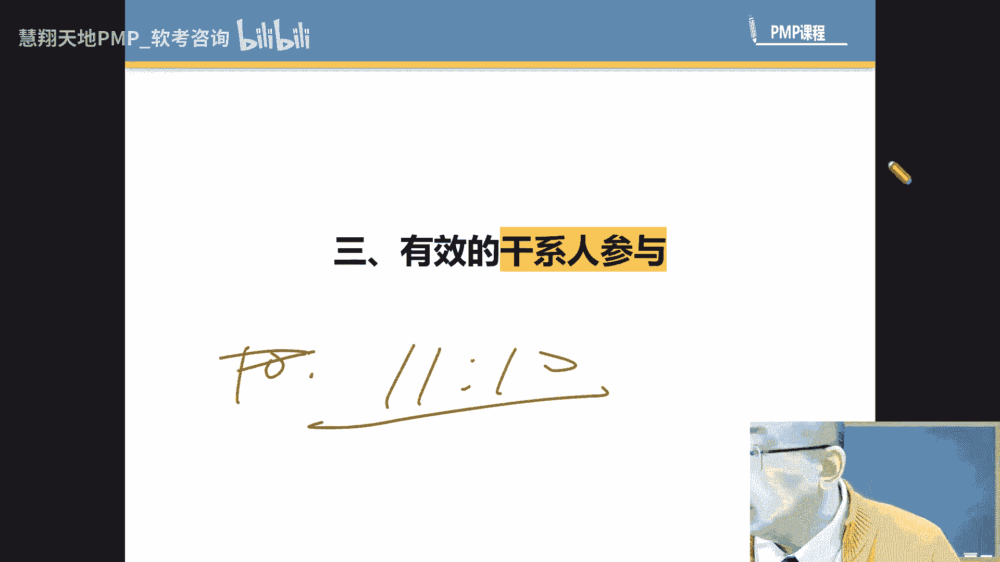

好的就是从第六关起来学啊，所以你可以看到这填表中特别的你调查之后，你要去变成主动的叫proactively的首选，Proactively，对你要主动的去叫做参与，是不是，OK然后最终是要达到他们满意。

这个好一点，虽然有主动求出来参与进来好的，那该信任会影响什么呀，会影响项目的进项目很关键啊，我跟你讲项目绩效的成果，然后项目团队要干嘛呀，要找核心词啊，哥哥姐姐们哪个核心词啊。

这就是项目团队要serve服务他们，服务他们的目的是干嘛呀，是不是能理解吧，就像专家一样，专家不，你不，你我跟专家说话，你这都是怎么说话吗，你告诉我贵是福，说老少你不用，那么你别那么那么客气。

我也不想那么客气啊，不没办法嘛，因为你越尊重他，他有可能么越愿意，应该就这个项目这个能理解吧，所以你要servers诶，你提到这个servers，你想到哪个词，servers连接服务。

我刚讲过的那个词啊，管家管家是不是你见你见没见过，现在的家长跟孩子说话的时候，你知道怎么说话，公主请做作业，没办法，现在孩子哪敢逼他呀，哇塞真的是这样，那就直接就你一来，你坐，我不做，你做我妈。

我吓了半死，等我从我从小跟我闺蜜说话都是就是半跪求啊，现在长大也都是万利奥的说法，都不能太说一说，他不干活，你知道没办法，sir啊，server参的目的是什么，他们做好的第二个是什么。

就是你一定要主动的去让他们参与，目的是要推动这个家教明白吗，所以呢为他们服务也好，还有什么名，你跟他们也好，都是要关注的东西啊，所以这一章呢其实很关键啊，好下面的肝性利益不说了，一般讲或者什么叫肝气。

找到没有啊，在31肝性是什么人，这是不是有都有都有干性的概念，是一个是一个广还是窄的概念，它是包含了项目团队明白了吗，他因为是呃，参与项目或者影响项目是比较广的概念啊，OK好的干系人包括以下的内容啊。

啊或者干系人可以影响项目呃，所以你可以看到那个前表这个词来把这补下来。

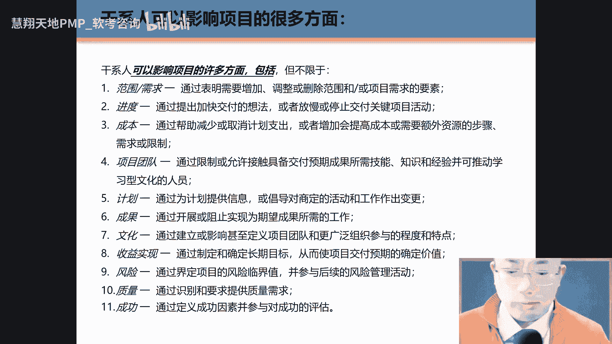

肝气人会什么呀，用到水，I influence，Influence，明白吗，influence啊，他这用的是FECT。

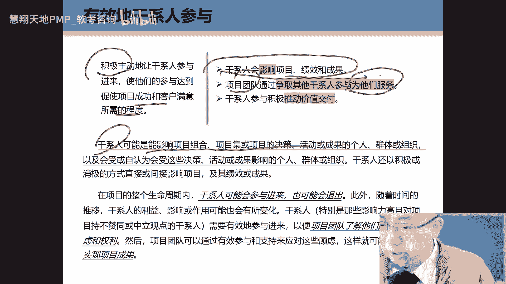

所以这个挺关键的啊，打三个屁吧，就干系人怎么去影响你，它会影响这些东西，一下子十点内容到最后影响项目什么成功，明白吗，所以各位小伙伴，从这张表中你要记住，你要学会与人打交道，因为这些人他会影响项目成功。

好的俄罗斯啊，俄罗斯，然后在32中他特别提到过，他是干系人，可能会给还会怎么样，该写的什么呀，可能会参与，可能会怎么样啊，退出啊，所以这个时候你要去看那个倒数第二行，要了解他们的顾虑啊，利益啊，权利啊。

是不是啊，所以说句难听的话，就是你要认识大小吧，大小知道大小王，但你还不能表现出来吗，不能表现出来。

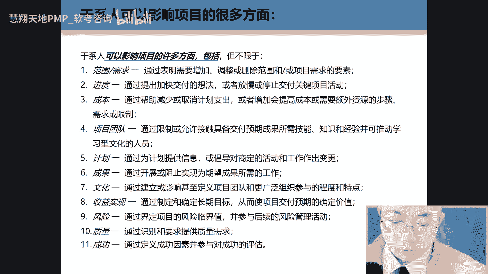

你是知可以的啊，然后可以看到33页，33我都提到过，第一的第一段，我还说从下面开始到结束，就要去识别分析干系人，这能理解吧，能理解不能理解，就整个项目中你要去识别这个干细胞啊，分析干系人。

所以要与人打交道，我真的放到这儿啊，不能放，因为我我我是这样的，从我的角度，我能我能说服一个人，就能说服一个人，但是我不会强迫你，因为这个东西是需要自己悟的，你明白吗，有些人天生不适合打交道。

那就没办法，就做不了大项目，Ok，看到第三段，他说有效果有效地参与沟通，知道没有啊，跟谁沟通吗，该谁的沟通是不是，所以这个时候可以看到，或者沟通是参与的关键部分，找到没有啊，好找到地方了没有，在33页。

这沟通是参与的什么呀，我也要参与你们沟通，沟通是什么呀，没想法和想法，打3P吧，3p，不，第三第呃，第四段，第一行图像和干系人参与，在很大程度上是现在有什么关系，哎对了。

就是你你能让他能让那个SQL engage是什么，依赖什么，你的一些人际技能啊，人技能，所以还需要你什么主动政治诚实，怎么尊重同理心和信心哇，这词儿就唯不唯美啊，这词儿啊多唯美啊，同理心我告诉你啊。

你知道男生和女生相对而言谁同理心更强，女生就这点真的是不得不说这是性别优势，所以有时候有些项目经理，尤其是那些工科出身的项目，你们见过那种工科出身的里程没有，其实公共女生其实公共女生她也有。

在公共场上还没有优势，但他却做项目特别优势，为什么，因为学公理他太懂工科，或者他在一帮男人堆里干活，然后这帮男人有什么特点吗，没有同理心，但他有同理心，所以这是我见过中做那些公共项目的女生。

真的是太完美了，又懂工科，然后又具有很强的任务人资源技能，人际技能啊，人体能就他有有很大的优势啊，优势啊，所以我说一句话，我还得话题，有的时候就是这东西真的是我们真的看到了，但是没法去教，你知道吗。

因为有些人就真的是很厉害很厉害，你像我们做那个在那个上汽的拖车，通用汽车的时候，有几个女生都是象棋里的女生学汽车的，所以他就说要学，在同济还是西交大的学院毕业的，然后你说专业度肯定干不过男生专业。

你懂专业的还是比较牛逼的，那地方男性有什么特点吗，就是你也谁也不服谁，或者关系也很僵，那这帮女生说第一学期这里多一学期的属于，然后我跟大家对专家什么都能很好的去交流，就很强，什么人尽其能真正的优势啊。

OK然后后面那个要清楚啊，就说我们在做的时候，他说在整个项目期间来估价的操作，在整项目期间相处着干嘛呀，项目团队会积极让其他单系参与，以最小化的存在，消极影响最大化，其影响最大。

就是说一大的参与就是其实跟做风险一样，就比如有些人他不支持偶像，那就让最小化肥不是很支持偶像，出道到理解好好翻过来哈，团队讲了该讲了，你们会发现在这个地方讲的多还是少啊少。

同时原则和原则等老道讲师消息的时候可多了。

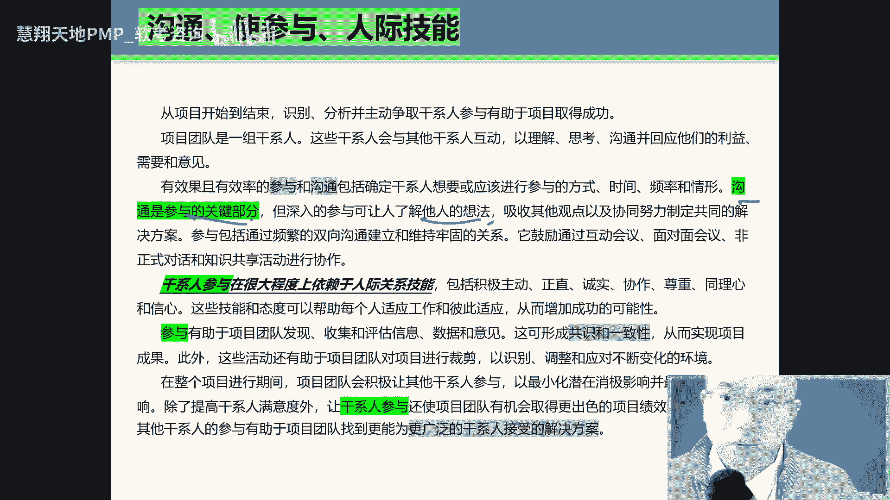

好的价值，我们把这个价值价值跟谁一起来学裁剪，因为他们有单独的一章，我们刚刚讲的那一章叫加胶加热交系统，是不是好了，价值好的，来看下价值前表中我们讲过什么叫价值。

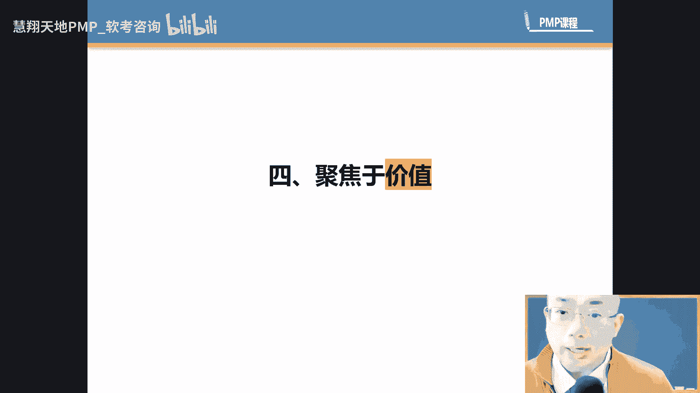

什么叫价值，这个价格你要干嘛呀，你们你们要找一个核心词，要持续的评估和调整项目，最终和项目目标收益价值达成一致，所以这块内容好好翻译，翻译翻译完之后，他没有看原版那么的清晰，这时候你要不断的下来呀。

要评估和调整，你把两个词要评估和调整，你会发现原版是把评估调整往前放，往后放，往前放，就是你要不断去评估和调整调整，最终就是评估向调整项目目的是干嘛的，是为了和这个项目的目标啊，价值收益达成什么样一致。

所以不想去评估好了，接下来右转有右右边有五点内容啊，有五点内容啊，五点第一点来好好读下价值是什么呀，就像成都的最终指标蔑视一样，你时时刻刻想你要带来什么价值，你有什么价值啊，好的第二个方格价值是干嘛呀。

科学在整个项目建设期间，项目接触时或项目完成后实现，这个地方强调的更多是这些，更多的是什么，更多的是这个时间点，你可以在项目结束完成，你也可以怎么样再进行现金的，是不是。

就像我在敏捷预测是项目一般什么时候交付，价值预测，预测一般什么时候交付，价值预测预测一般在项目时间啊，在那个项目结束的时候，考的是麦克风，是咱俩的一个小对，OK那你要注意什么，慢慢的角度也不是你不用管。

你把角度放好就行，然后你会发现啊，就是说呃像预测是一般什么时什么交付价值，什么时候结束的时候，而敏捷是什么呀，就持续的把持续正常的，然后第三句话什么意思，就是你的收益啊，可以什么可以定性，定性的。

也可以什么呀，定量的，就像我们在座各位一样，比如你们你们KPI考核有定性的，也有怎么样定量的，都，比如像那个最后一个项目团队，要看评估这个进展和适应最大化的价值，这个前面刚讲过了。

你看这周我要不断的评估，要去不断的评估这个项目要做调整，目的是干嘛了，是价值是什么样的，比较好，这样你看，你要不断去调整去调整，就像AI一样，哎呀其实讲如果说非要说按照，其实我一直强调说不要分什么文科。

一个工科就学呗，但我发现如果AI线出来之后，你知道对哪个科影响最大的，我们几乎是几乎毁灭死，几乎是毁灭性的录像，你知道吗，但是现在很多人他说我对不起，我就喜欢我，你你记住你是为了喜欢你。

还是为了工作而生活的，你是为了生活，你知道吗，所以就是你这就是反正你要想一个事儿，你就你以后你毕业了，你就给我，不要说哎呀，我找不到我A都把你替代，找到工作，你要想清楚，你要是这个原因没办法，就这样。

应该就不断去调整自己，像我们年代我们八几年看下去的时候，我们要什么时候读文科，学习好的就学习好了，让他读文科，学习不好的，这样公理理科工科，因为学霸学理化嘛，可以加入我们科锤的好多人都现在是反过来的。

现在反过来啊，这不就平步平这种领域上也加了法好了，价值就不用读了哦，这个价值什么什么费用翻了三次，也加了什么一些什么呀，一些指标训练模式，把这个看完就可以，包括旅游啊，我还研究这种旅游。

财务的价值和一些财务的价值，还有公共利益的价值，就是类似于财务和非财务最好的。

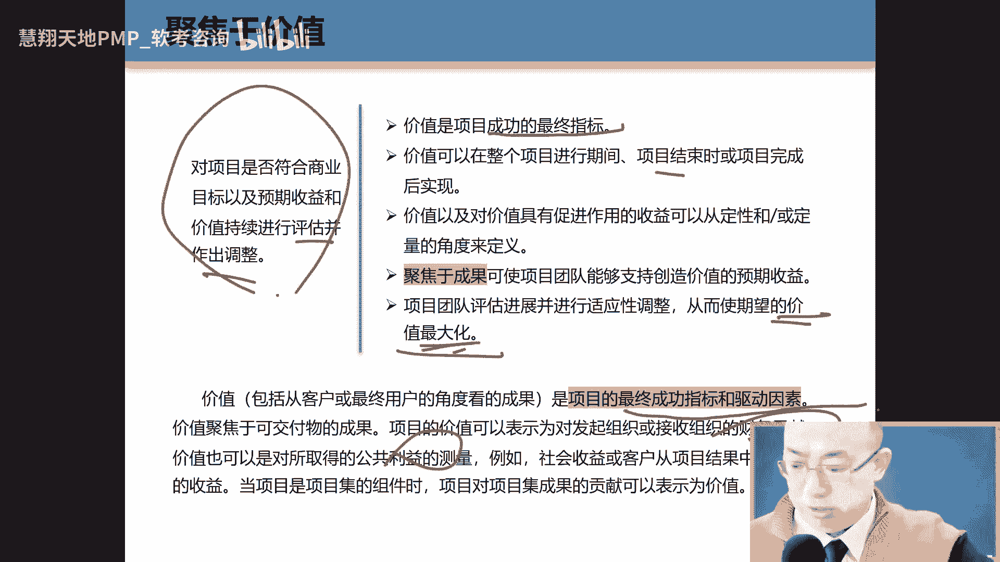

结好了，商业论证咱们讲过了，在第六版讲过了，在34以下名叫商业论证，找到没有啊，这个英文词叫this is case，来顺便来face case啊，问题好了，商业上讲你不理解结合对吧。

这就是大家讲的商业的需要，行业的理由和商业和商业的战略，最好看一下，这都不复杂，尤其是那个他翻译成商业的理由，这个在外资企业这个词用的特别多，我讲justification，Justification。

还有动词justify转过来的，那他还要理由驾驶重点看他们用这个加速，去看看为什么投资这个地方有点起，他说为什么投资投资多少钱，这地方写个词叫投研，什么叫投研呢，投资的投研究的研就投研报告，就这。

下头你就现在你们现在不是用，现现在现在用好还是不好，加一个副词很不好，但是头几年的时候技术好不好很好，哇塞恨不得只有学习好才能考什么北大爱啊，什么清华呀，包括什么像复旦啊这种学金融学，那真的是分配也好。

工资又高，一般稍微注意一年100W这种的，然后他们有一个能力需要写什么呀，写直播报道这个报告，考研就投自己的报告，我们说过，他们喜欢什么什么什么什么什么背景的，本科学什么呀，学工科硕士博士读10年新的。

因为你投研他投研班上考试，科研投制造业，高端制造业，讲故事，讲故事很厉害，那个回报相比，好的我们再看到那个五页下面那个还有一句话，他说呃在整个项目期间。

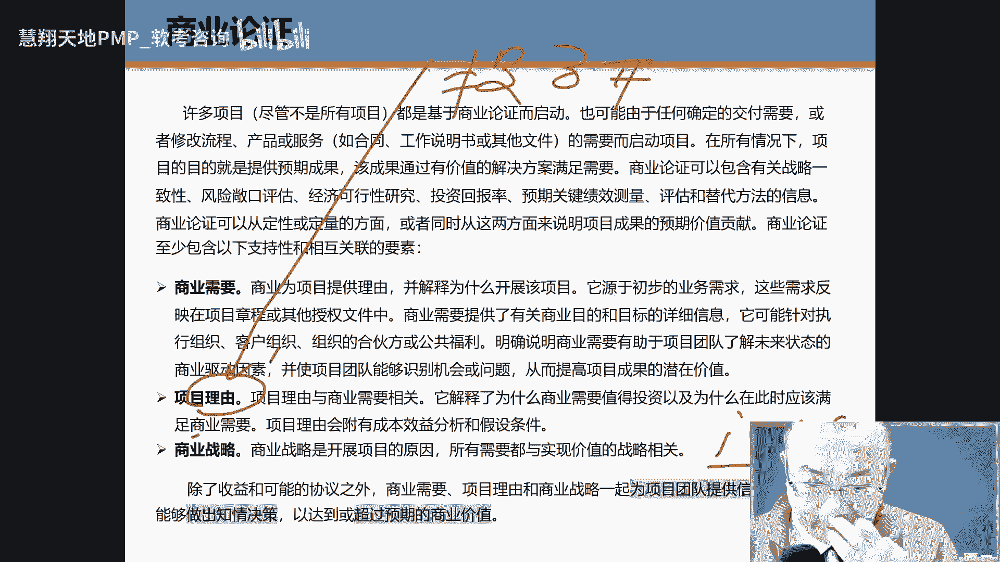

那个奥特曼头下在整个项目期间，在整个项目期间应清晰描述迭代方式，评估并更新期望，可以的啊，包括后面要什么要去调整变更整理啊，就是说比如说你在这个项目期间，你这样能够描述出你这个期望结果，一个期望结果。

但是期望结果有可能会怎么样变通，也认为什么迭代，这好理解吧，好意思，然后第三行也是对你的商业保持一致，要保持一致，这也行，好，再次提到过价值，价值价值其实我们在前面讲过，价值35年。

最后一个价值好多帮助一下什么叫价值，价值是某种素质怎么样，但是某种某种事物的作用重要性或实用性，这个地方我们在刚刚讲过那个橡胶就已经讲过，尤其最后一段最后我一定要考虑客户的价值，找到没有啊。

对方帮我打四个题吧，最后一句话找到没有，一定要找你，要你要提提供这个项目的价值，要重点考虑的价值，考虑谁的价值，哎对了，你不是不能总觉得这个，所以这个点这个角度转换好不好，转换很难找关系。

所以你知道在企业里哈，甲方和乙方哪种方式比较厉害的，又做了甲方，又作为乙方，这是什么比较厉害的，他能够了解你的价值啊，用户的价值，OK好了，翻过来36页啊，36页300都提到有个叫价值工程啊。

这个词如果你不知道用AI工具啊，你们用过你用哪些AI工具啊，一眼KTVT，包括讯飞，包括刚才那个豆包那个水平都不错，什么价位工程价值工程价格工程啥意思吗，就是价值最大化啊，他的解释其实你找个在36页。

但其实我们在实际过程中加入过程，他讲的什么一样，有的有些公司占用这么理解，就是说我能够达到这个功能，但是我实际的成本却怎么样，所以这是他们家的工厂，所以美国的叫法不一样，我们这叫价格最高，这个差不多。

你看啊，他这个就是因第一价值最大化，同时来股价同时要干嘛呀，少用资源，避免浪费，不是降低成本吗。

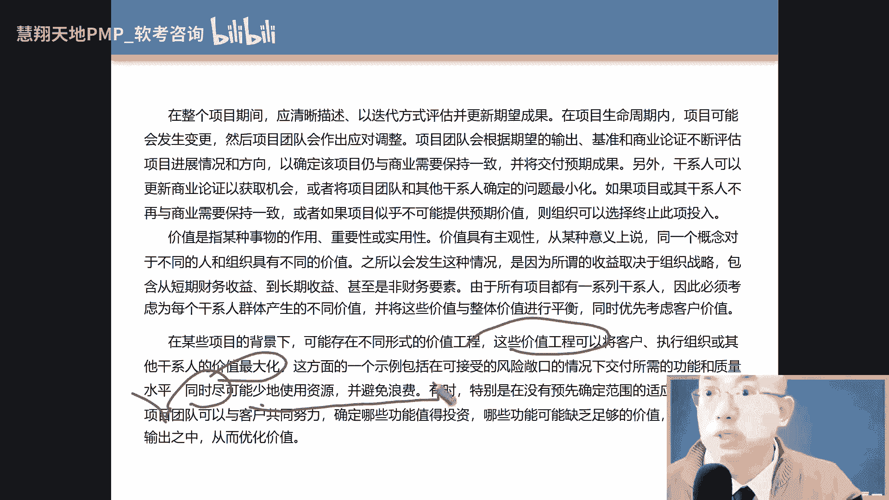

明白了吗，好的重点来了，这个是最关键的啊，看看在6月中看到第二段，我来回去好好看一下，就是说现在我们在加加原来的交互，变成了运气成果，因为第二版更加强调交付什么呀，第六版交换怎么样价值，或者有那个交互。

第七版叫什么价值，他举了个例子啊，他是举个例子，以前我做软件开发的时候，我就给你提供一个软件就得了，那个软件就是我的项目里面输出，就是我的交互，但现在购物买账购成品啊，我没看到价值啊，那怎么办呢。

我来加一个软件的培训和教练，这样让客户怎么样知道诶，我有哪些公司，就像一个就像你买那个微软的office一样，其实买完之后他把office买给你，你可以装word excel PPT转给你的话。

那这个交付还是有价值的，但是价格有吗，没有，我举个例子，你知道你现在P中的例子，如果按他这个价值都能实现出来的话，你觉得你用了多少价格，我在文件苦就去工信电10%都不到，就说你你你的功能太多。

功能你用了没根没用过，对于动画那些遮罩就是让你填充，你真的不会是不是你像我，我见过，我有一个有些人家那个房东是做的那个PPT，没有用任何的什么特效，都是用的那个PPTZ的功能，做的电影级的效果。

我的各种动画做的像电影一样，各种什么转场做的特别好，我说我说什么，我是用什么P吗，他没有啊，这是PPT的功能啊，我明白吗，所以就是我多么希望PPT能给我提供什么，教我培训的东西，但没有，那继续买。

继续买他的服务才行啊，这明白了吗，就是你比如我帮别人开发那个软件，是一个什么呀，软件是个啥交互，但这个软件实现的功能是什么呀，价值明白吗，那怎么办，我给你做培训，不需要，OK然后他又说了。

他对那段好好看一次，然后他说这个价值是需要短期和长期来测量的，测量评估的好。

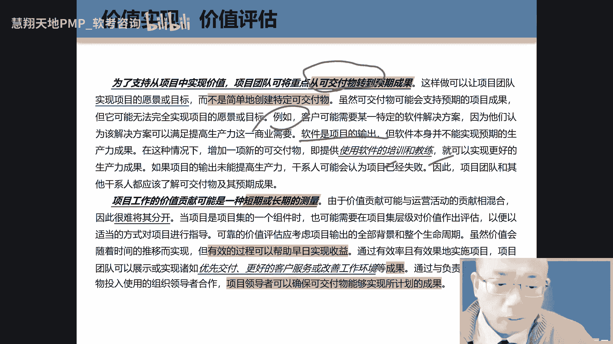

这个我们说这个价值信息来看，跟那个裁剪好，翻过来系统这个系统的这些来看，系统分配起来看的这起来看看，跟着一起来看复杂性啊，这说明这个系统性跟着一起来看复杂。

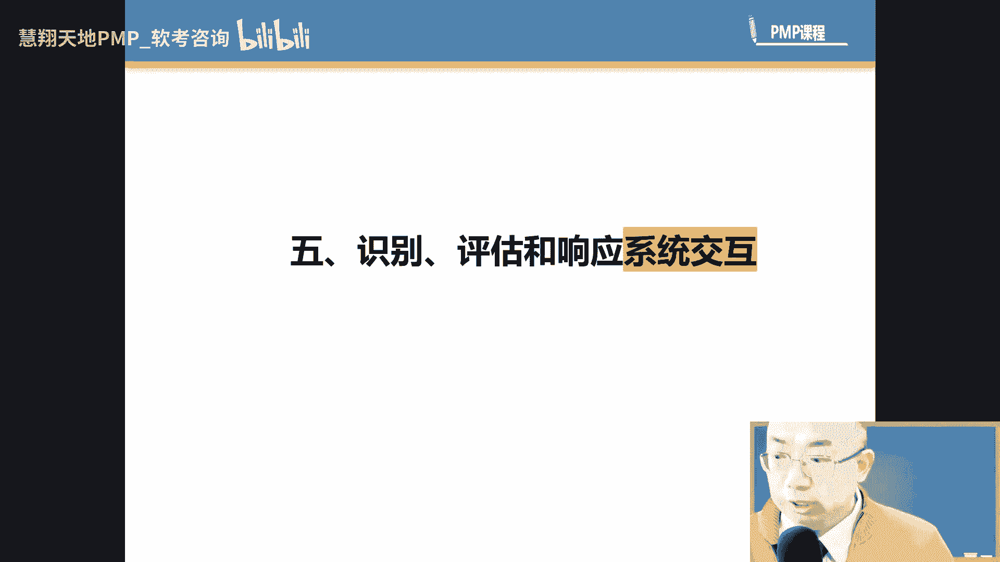

好好看看这个表哈，这个表啊，这个表啊，我们先看这个，我们再次计算过，这次计算过，从整体角度来看诶，刚才我们在哪讲过，用整体整体角度看过来，还记得吗，大家讲过，我刚才讲过那个整体啊，那个24页。

24页就是那个管家管家，那你去讲啊，CRC题写第37页，Coc，因为在管家中可以提到，你要你要通过全局来看，比如你要看财务啊，社会啊，技术啊，可持续，然后在这个地方他自己到过。

你要看的时候看一个整体叫how this view，表示不，How this view，把这个整体来看，这个词是个高逼格的词汇啊，呃你可能没学过，但是很多人都学过，他好的，他说什么叫项目啊。

他说项目开大屏幕，他说项目其实就是一个宅啊，就是一个系统系统，然后呢，你要从整体角度去了解各个部分的相互作用，咱不说了，我们人体是一个很精密的仪器啊，有哪些系统，有哪系统，有消化系统。

还理解神经系统是不是还有呼吸系统，是不是还有生殖系统对吧，还有很多好的系统，就是各种系统，但是七大系统啊，所以问题就是你，所以你要从整体上去看，你的身体状况不错，当然现在我们知道现在疾病是越来越化呀。

年轻化啊年轻化，所以呢一定要注意防守啊，我们知道我们是要感谢这个星际飞的，因为星际飞他真的是很勇敢，他说的什么科技，什么科技与狠活，你先想想你吃的食物中，哪个食物中里面包括原材料，包括加工过程中。

你没有用过核心化，结果一看都在用科技反驳，那你想想那以后你得什么病之后，你就不要说哎我怎么这么年轻还得了癌症，我的各种化学品，各种化学品，是不是啊，我举个例子，你去吃外卖的时候，包去忘记餐厅的时候。

好像你们家永远也做不出那么那么鲜美的味道，那么好闻的味道都是拿什么调出来的，都是拿各种香精调出来的，那个肉都是拿什么什么对一些什么什么什么，分什么什么什么和什么干哇，他都是这个调馅的那种汤，这种高。

你知道吗，这多恐怖啊，这车肚子里都是造成化学物质造成癌变的，明白吗，所以各位小伙伴一定要小心啊，因为这是一个系统，你明白吗，你要记住个性相互什么呀，相互作用，你吃肚子了，但是首先经过什么系统啊。

消化系统，然后呢这个消化中影响大脑，化学物品会影响你的免疫系统，免疫系统明白吗，所以癌症是怎么造成的，是因为DNA变，DNA变异了吗，因为合成的蛋白质出来了吗，所以这两个最好是目标最好的吃。

经常吃一些健康的食物啊，少吃那些莫名其妙的东西啊，OK整理，所以它一直是一个整体的角度来看，你不要总是，所以我现在我们做项目的时候，总是遇到一些项目，你每次跟我聊，老师我觉得怎么做，并且工作怎么做。

时间管理怎么做到成本管理沟通，我说你能不能给我，用一个系统角度来帮我分析一下，分析不到，像这种项目，以前我没活的时候呢，什么都做，现在有活了，我说我不胖，为什么不胖啊。

因为一个人他一旦没有系统思维的时候，是好影响他还是很难影响他，很难想他，那这种人这种人只能做一些很low的动作，他也很难提升了，但有些项目比较厉害哦，我知道是我明白你的意思了。

我要用什么系统性系统性思维，整体去了解这个原因，明白了，好好系统思维，好的呃，然后的话呢我觉得就差不多了啊，包括我们做出什么响应啊，什么成果啊，好的我们来看一下啊，说系统是由系统是一个什么。

有各种组件组成工作都要做成的啊，然后项目是在更大的系统来运作，就像我们地球一样，地球是太阳系，银河系是宇宙星系啊，这样他这种做法，然后呢呃然后一定要保持保持一致啊，此系统保持一致，你的项目团队也很好听。

这个好理解，好来翻过来翻过来，系统这个呢就是这一章中你看到了多少，因为他这个还是有点难度的，因为小伙子好多小伙伴也没学过系统，没学过system，System，然后把第一段行看一下。

特别提到过叫系统思维，系统思维，系统思维需要什么，需要这么考虑什么呀，考虑什么东西啊，考虑时间啊，考虑时间的顺序，明白吗，考虑时间顺序，好的看第二遍啊，他说随着时间，随着项目的开展。

内部和外部的条件会发生什么呀变化，因为我们说过第七版，不管讲12个原则，还是讲八大气象，首先讲哪个词，change变革明白吗，change好了，其实这个词呢，确定我们说我们中文把它翻译成变革变化。

变革其实应用是哪个词啊，所以导致有时候这个词翻译的很有可能，翻译的意思不是那么准确的，称好了，再举个例子，我重点看这个例子啊，他说大型生物项目中怎么会发生变化呀，需求发生变化，哇塞这个变化大是大变化。

小变化呀大变化，因为他这个时候任意变化，这一变化我就不用说变更，这个变化一定会影响项目成本进行发挥，想明白了吗，对方理解不出，所以这个地方这个地方就打四个题板，打四个P，就是说以后就是说以后做大象时候。

你一定要从系统里考虑考虑，现在考虑这边系统考虑嘛，就是说就是说你的，你一定就是说你不要每次总说那一件事，我记我记不上老师，我就我们做项目就是要什么成本啊，成本少一点，时间快一点。

我说你能不能从系统角度来帮我分析一下，说什么叫系统啊哈哈，他说系统知道我真的是我，那我就帮不了他，那系统不知道，所以他说你看啊，他说比如虚拟发生变更，那什么时候发生变更啊，来方向走，看什么呀。

成本进度绩效是吧，都可能发生变化，是不是包括风险是不是发生变化呀，这什么呀，系统考虑打五个P4P的结合，打五个P，你得有这种项目思维，特别好理解，好理解思维很好理解啊，包括最后一段话。

他说什么叫系统思考，其实就是用系统思，叫CCC，简单说明他说系统思维他什么呀，说系统思维是什么东西啊，就是说也是因为项目如何看待，自身和项目的互动互动，这话说的有点有点很哲学的概念和哲学的概念。

包括包括那个第二，第二是说这种多样性会给他带来价值，多样性和多样性多样性，然后重点看那个利润啊，利润啊，他说这个时候例如什么读起来。

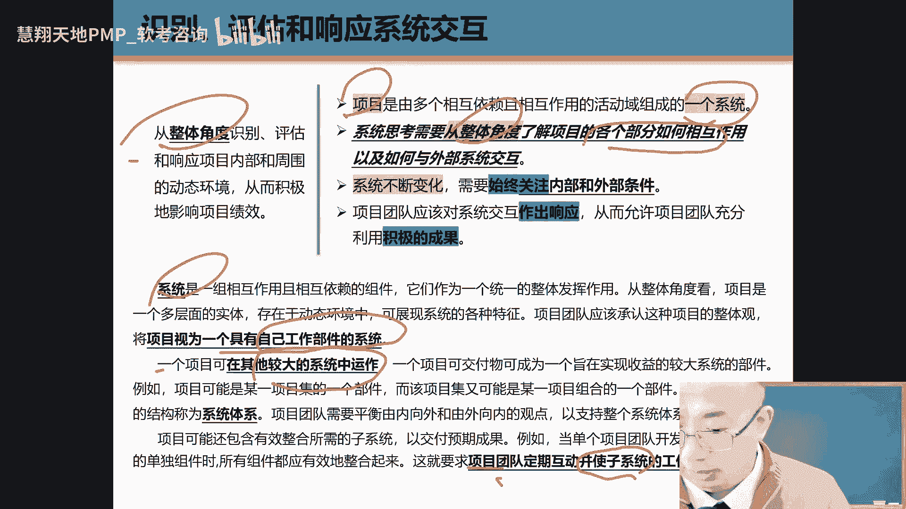

如果一个什么呀，如果一个政府机构和什么哎对了和什么呀，和一个公司签订的开发合同，因为他们要多样性多样性，是不是，所以就因为因为不光是我们政府机构，还和这些公司签订的这个团队。

是这才能够变得简单的复杂的复杂，这就是一定要统一什么，建立一种综合性的一种文化共同愿景啊，这是这个意思，所以我们在做项目的时候一定要学会，所以我有有有有有一些外企就特别好。

他会他做相关的培训，他说白天老师这样，我把你介绍给我的供应商，让他们以来学校思维，你知道啥意思吗，他希望他的项目项目，他的供应商跟他在项目上保持一致，好了再次提到下面的一句话。

他说系统性中有强调中交互性和交互性。

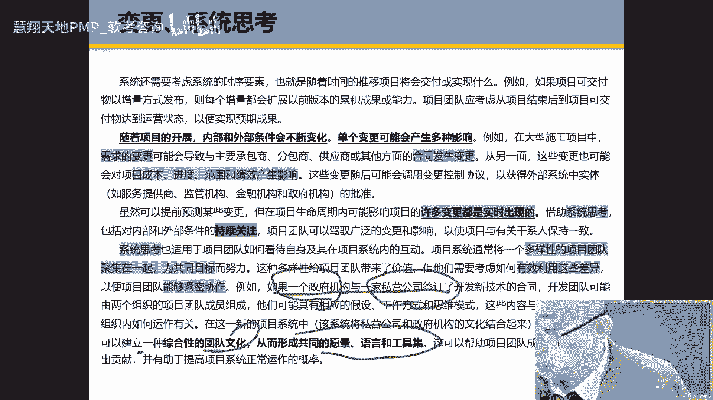

更好理解吧，交互性这块能看多少就看多少吧，交互性就是说39页，39页，就是就是你如果一旦有了这样一种，这种系统性思考的话，你会具备这种具备这种叫system review，把这个词说明来。

system view就叫七种视角，以下的七点啊，以下的七点，就比如说他说对于商业领域具有同一性这个词，其实你这一周汉语说同理心嘛，就跟着我同性质一样，那倒不是那个意思，什么叫同理形状，什么意思。

我去这类很敏感，我对这个商业领域的敏感度，敏感度，明白感，说一说我就明白，就举个例子，比如说我们AI来的这个AI对我们影响很大，比如我我要跟我的家人说，你知道我的家人会做什么哇，你又在贩卖焦虑，哇。

塞我我我才发现，其实我因我连自己的家人都是入不了这句，我觉得我觉得我也很想努力，但是我身边有些同事小伙伴就说他都能理解到，明白吗，这叫同理，我很快察觉到这个事有点像洞察的感觉啊，还有第二个是什么。

关注大局叫big picture还是small picture，所以我们做项目特别需要第一个词啊，big picture好吧，我就不用说太多了啊，这个自己看就可以了，好的，他说如果你有这个。

就是你有这种这种系统思维之后，会带来哪些积极的成果，以下的11点自己看就可以了啊，有什么好处吗，有什么好处，比如第五个能，如果大家都有这种系统思维的话，我们是和我们的目标是达成什么样。

第五点保持什么样抑制了。

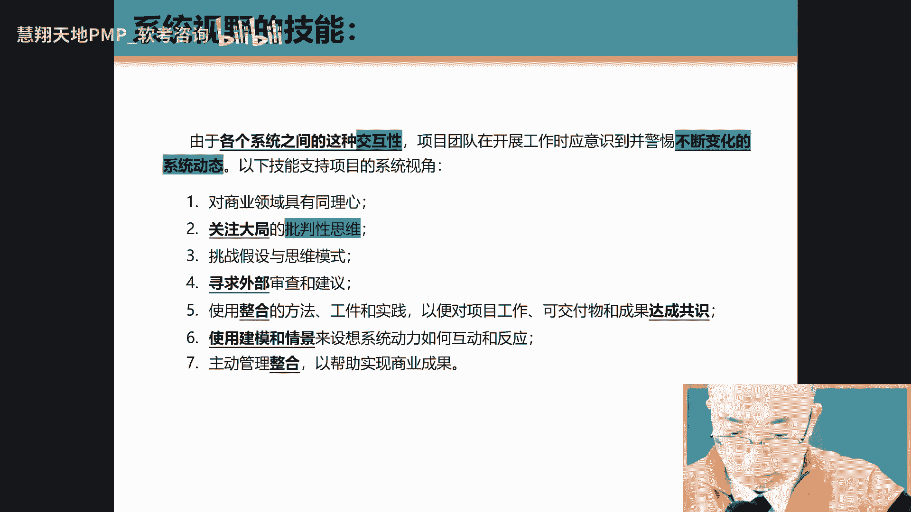

包括最后一点，最后一点读有什么好处吗，全面识别风险，是不是啊，卧槽我有这种思维，把它举个例子，把它收回来，我我我跟有些人，你看我最近我有个朋友，他的他的岳父就突然不舒服，突然不输意大利院一查。

待会儿别出院了，胃癌晚期，直接把胃癌切除，你知道我们俩聊完之后说什么呀，其实我很早就说过，我说我这么大岁数了，要干嘛要做一个胃镜和肠镜，我现在说他不听的哦，这次我说完之后，他下面就是他岳父作案手续求助。

他第二个做了第二次，第二个月他就做了一个什么，所以这是我以五行的提醒，我说我说我们都要注意这种风险，不是你我们都是这样，因为这个风险就在这摆着就摆着，你为什么不去识别它，明白了都没有系统思维吗。

没有系统思维，现在可能是我那个朋友，他是属于美食家，特别喜欢美食，但是美食是可以，但是我们现在身边这个美食都是什么呀，好多都是有毒的，美食要识别的风险啊，这个我只能说到这了，OK还有个什么。

就是从整体的角度看，倒数第二个as a hole，找到没有啊，As a hole，好吧嗯，包括还有威胁威胁，如果你是你是有能够全局思考的系统思考的，一般对方看到的一些第八点，伪装的威胁，没有威胁。

系统思考思考，嗯嗯好OK好的。

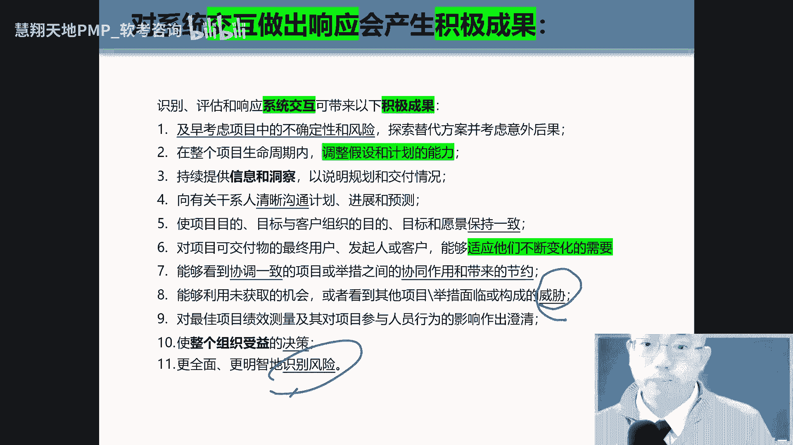

翻过来哈，领导行为我们说过了哈，这个leadership跟谁一起来学呀，前面讲克力去来学，对跟那个管管家丽管家丽管家steward来说，Stewar，所以我每天立起来写啊，这个六版讲的特别多。

在六版中讲过另一档会。

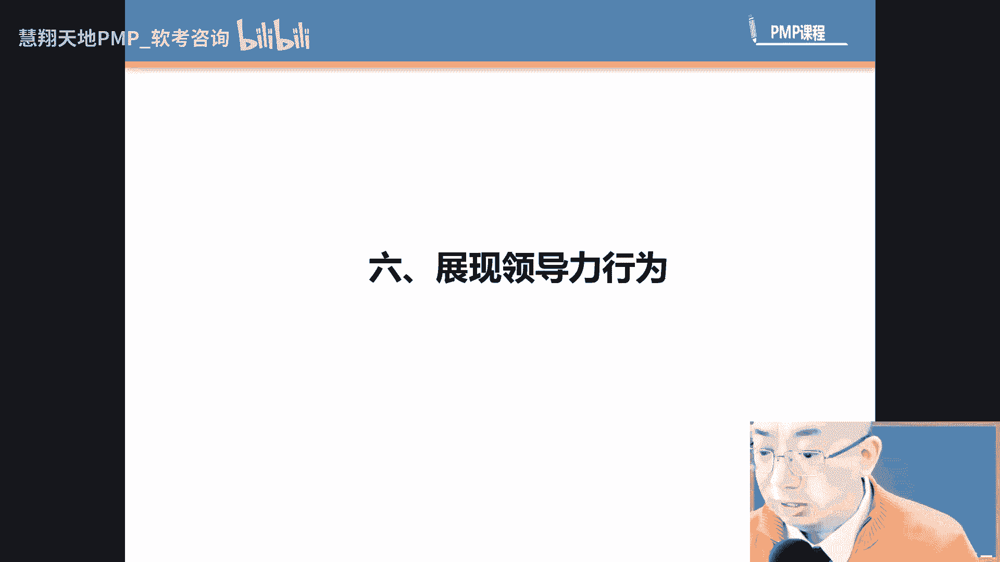

所以这个地方我不希望再占用大家时间，因为特别我是把重点的方案可以看就可以了啊，好的，所以呢有两个动词很关键，就是demonstrate adapt，就是你要表现出来的一个，把你的领导力表现出来。

还要不断去调整你的领导力，尤其现在零零后九零后出来了，你要去改变你的引导行为啊，要根据这些调整站的公司，你要展现出来和调整出来，还是那句话，就举个例子，你跟对方说句话，说，我带你做项目。

你愿意你愿意follow我，这是这是什么什么特点，这点动词，这个是demonstrate展现出来，我要带你做项目，你愿意跟着我走，我就不会表现出来了，知道吗，好的，以下六点我们来看一下这个6。6点钟啊。

一个六就是第一个就如果你有这个领导力的话，是有助于项目取得成绩啊，再说啊，这个领导力不要用汉语去理解啊，是哪个力啊，代理代理你们带点带点，然后呢，第二句话读一下，第二句话，就像任何什么啊。

任何团队成员都会表现出领导行为的形状行为，比如在私立院校，有些图你要读国际语，主要通过这个id课程，他就要表现出你有leadership，包括以后在你报你去申请大学的时候，你要这么说。

你带给别人做过什么项目，如果你要是只过考试成绩没有丝毫表情，我leadership文再好也不着急，那时候真的不知道为啥死不让我们死的啊，这点也很有leadership，第三个图像什么和什么是不一样的呀。

诶就是领导力和权利是不一样的，权利叫authority，Authority，所不一样，然后一定要把传人间的风格啊，第六版，讲好这句话的环节，你一定要了解团队是什么呀。

动机这个动机这个词叫motivation来说，变motivation，因为等会我们把它翻译成翻译成什么激励激励。

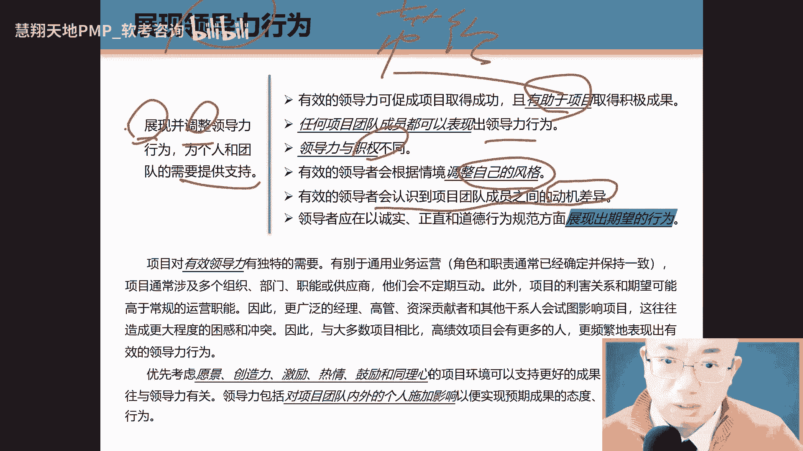

所以这个词了，有的时候发现动机发现吉利，但他就那个就那个词啊，Motivation，动词怎么说，动词motivate，名词motivation，但现在很急嘛，现在每次一说一位女性人说，哎你你什么事。

你可以激励你吗，就一个字哪个字钱很强，这个其实你也想要钱，我也想要钱，但是问题是你要给你老板每次都谈钱的话，其实老板其实你知道吗，对于做项目来说，其实什么比比什么更重要，比钱更重要的是知道。

尤其你自己知道什么更重要啊，机会再说一遍啊，年轻的时候是什么更重要啊，机会更重要，但是因为现在这个社会的风气就是这样，只认钱，他有钱，你不要钱，我就要不能给你，要么就给不了，你就大概这么多钱。

你你能干就干，不干，拉倒就直接给他们钱，这是第一个不用多给你，第二问你不要看钱吗，那好我老板就给你钱，那就机会不就不给到你，但其实你知道吗，年轻的时候挣了点钱，其实真没多少钱，但是有一句话就这样的。

干一票什么，我们要干一票什么的，干一票什么啊，要干就干嘛，只要这个项目做完了，这就叫俗称人生的第一桶金，我这一年我印象特别深刻，当时我在那个联想的时候，我们当然九几年上班的时候印象特别深刻。

我是没想过的，老板这样吧，我家农村的没钱就这样吧，你给我钱就行，不要体会老板说你老板能画饼了，你要有机会以后去北京做项目，结果不要不要不要老板给你就给你钱吧，然后我们那几个人说行啊。

咱老其实老板是希望我们要看重机会啊，股票啊什么那个老那时候叫期权，因为在我们香港上市的吗，那我多买点期权也行，但是确实是一块饼那块饼，然后呢工资就1200，哇塞我们但真的是。

当时因为也不知道他是真诚假诚，反正那个年代反正老板天和奖金就信了，后来我就从那个惠阳到深圳，然后到北京了，然后继续做项目啊，真的是我们公司真上联想当时先把真相似的，然后给了我们这期权。

然后给了期权之后应该很深刻，当然期权哦，当然我们一旦企业中一年级4年兑现一年，就兑现一年，哇塞正好我们两个对我这两次兑完，兑完之后就也没兑多少钱，对了，大概有不到3万块钱，例如在北京买房子。

那时候在北五环以外买房子，30万，30万1套，那时候买房子都需要交10%的首付，就是九几年的时候，然后我就把这个期权给卖了啊，换了3万块钱就可以，正好可以交10%的首付，然后就那样就带了。

带了27万3万，那样子去的时候找不到那个房子，都不知道涨多少万，就反正得有个600万的房子，3000万变600万，但是但是但是你我们在当时，那个认识前的小伙伴强烈，我想怎么可能他只要钱有没有这个机。

但是机会概率多大，谁也不知道，我就举个例子，什么意思，就是说有的时候这种机会啊，这种就是在激励这方面的后期动机方面，每个人的想法是不一样的，但从我的角度，我是特别希望你多看看会怎么样。

你会就像你学英语一样，学专业学校外英语一样，你把它背好了，然后呢平时也跟老外聊聊天啊，去去什么，去德国呀，去日本啊，去美国啊，去英国，制造业比较发达国家比较发达国家，金融业比较发达国家就多待一待。

就在那呆个几个月好了，这时候呢你的机会来了，你老板说老板我更看重项目的机会，老板就蛮派到国外做大项目去了，你要在年轻时有有个大项目经验之后，真的是有机会后我说明白了吗，很重要啊很重要。

但这个东西只能说说而已哈，好的这个我们看了，我们来抓住来看一下哈，呃比如说项目啊，第一段好理解啊，第一段好理解，第一段中会提到过，你要表现出什么样来读一下别人怎么样，前面我们讲过了，你要表现出来。

我们有些人愿意表现，有些人不愿意表现，显眼包是变异表现，变异表现显眼，发病表现像你有时候线性方方，然后这个可以考虑一下，考虑月底就是这个讲民党的时候，这种能带领别人的时候更容易愿景创造力。

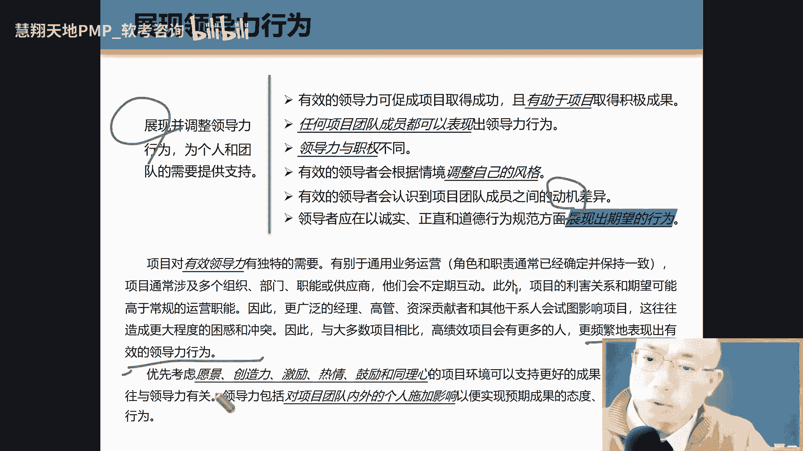

激励着你，看好的这句话呢。

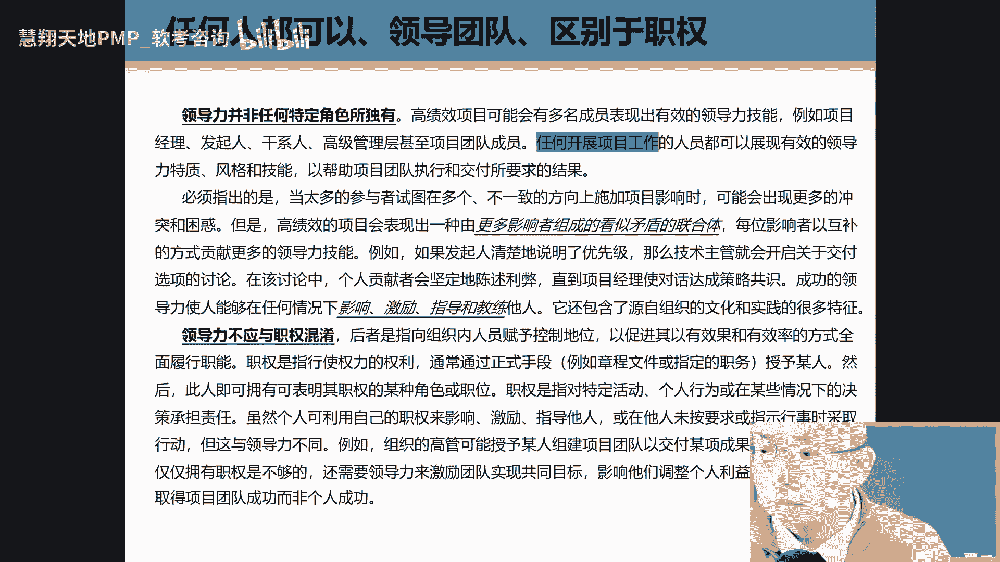

我们填表都能讲出来，前全要填表吗，这这叫什么呀，这叫什么呀，前边这样，左边要右边啊，OK好了。

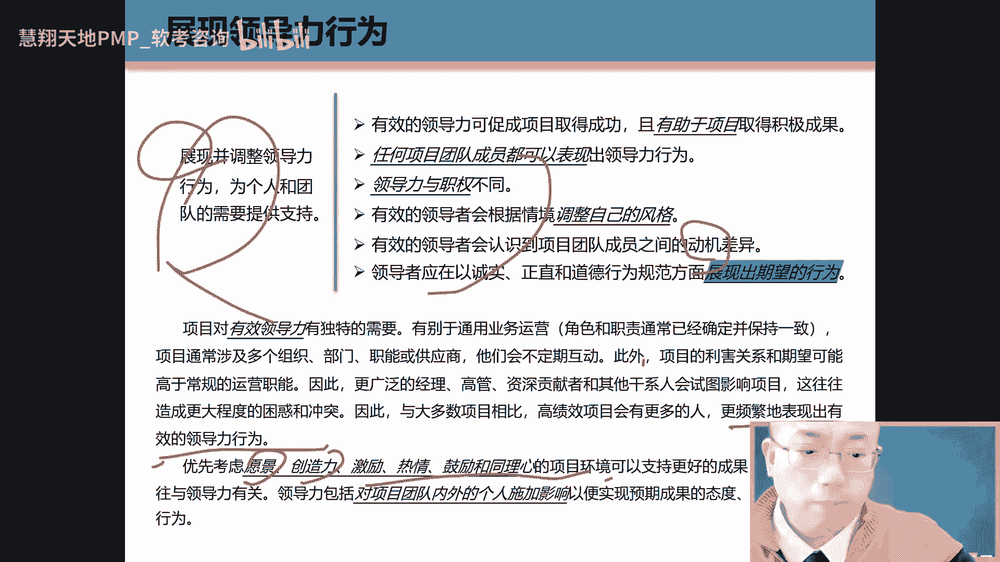

前面讲过把句话总结来，领导力并非什么样，这个找到没有，在41找到没有，41找到没有啊，找到了就好好看一下哈，有一定就是说不是说只有领导才有，每个人都有，每个人都有，然后呢在第二段中特别提到过。

就是说你要学会干嘛，你要学会呃，他说承诺的领导者能够出现在任何情况下，影响激励和指导教育他人的这句话，在那个第二个的那个dd，你会影响记忆力，这OK好了，在前面我讲过领导人物质这一块来讲。

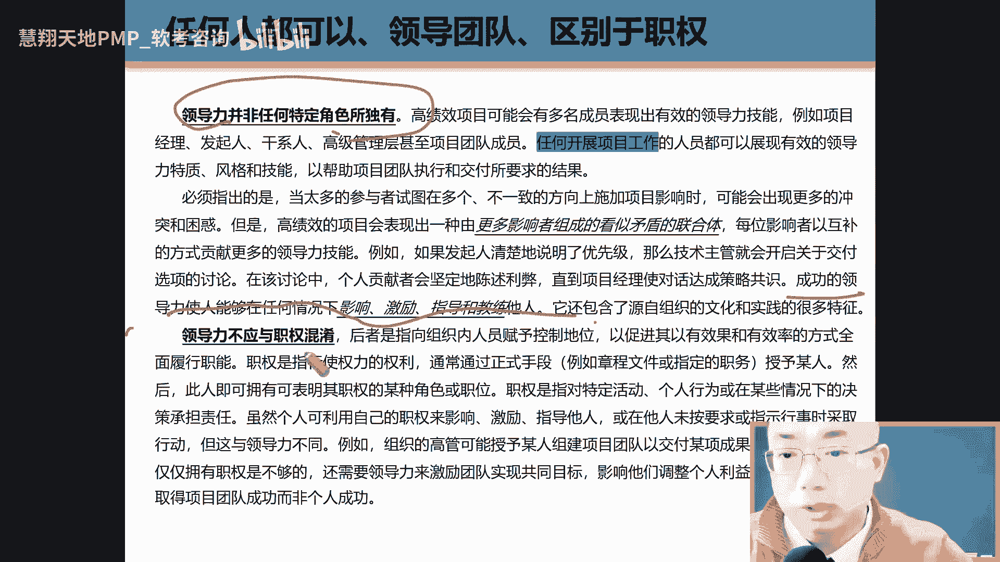

职权明白了他不一回事，所以领导也更想成为影响力开始前提啊，影响力而影响力OK然后在前掌会提到过，你是要根据不同情况要调整你的领导力的风格，这个地方在礼貌性，600在6万年前的非常详细，什么交易性领导。

什么放任型领导，什么命令性领导啊等等啊，不同的不同的环境不一样，比如像敏捷项目一般都是什么样，这对发展性和发展性，你自组织吗，都放上去，所以这里面好好看一下啊，比如这个比如这个混很混乱的时候。

你把那个指令并听我的命令啊，假如大伙都是很多人都是很强的，这种责任心能力比较厉害，这个授权状况就是授权，所以在那个随这边再翻过来啊，翻过来特别带42页，在42有特别重要。

这句话他说这个领导力是可以培养的，也可以学习的，最终成为你个人的专业资产，这个地方打五个T，你的在你年轻的时候，有没有领导跟我说，让你带团队，你说的不愿意带，你说又又又没多少钱，内存不一样，压力很大。

我不愿意再跟老板说了，他说这以后记住了这个领导，你这个技能是你个人的财产，如果你在年轻时就代表团队，也是问你两笔贷款以后再有机会，而这是你的个人专业的资产，你有就不领导跟你说过没有，如果让他们说过了。

那就有一个贵人啊。

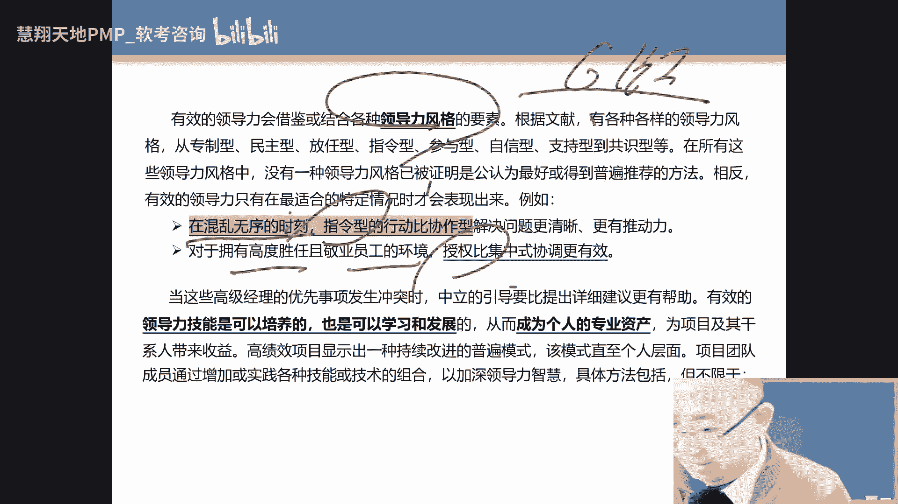

OK好，以下呢就是呃就具体的方法就是怎么去提升你，引导你的方法，总共19。19点基本上都是十几个动词啊，19个动词动词最好看一下，我看一下国家挑选比较重要的，比如自我意识，没关系。

自我意识要对自己行为的一些偏对，偏见行为的自我意识，怎么知道你知道有什么事，然后适应变革，适应变革等等，包括我们做角色适当的进行之类，不是就举个例子，比如说呃你比如你教教小孩。

我们知道教小孩你要注意安全啊，别踩井盖，所以这个时候你你每次你带小孩的时候，你要去跟他讲一下，就遇到警察，你要干嘛呀，你说这是一个警官，很危险的，我我给你示范一下，我绕一下，每次我每次像我们学校小区。

一般小区门口办法都几分啊，不都是排污的嘛，这样一般亲的死亡出门找不到，就这样吧，所以这是一般你告诉我，你说我你看我这个井盖，我指一下，我绕过来呃，大部分小孩啊，基本上你这个转model之后的孩子。

因为父亲是孩子的影子嘛，对不起，那你就少小小科比，那就是你的魔鬼魔鬼投胎，那就怎么教，不教不好使，就他不但不会躲，还会踩一下，那就没办法，而且这种牌子你就准备生二胎，你明白吗，这种孩子真的很郁闷的。

所以就是要做做什么做你要做什么，做model做desire的behavior mod，比这点很关键，明白了他的嗯。

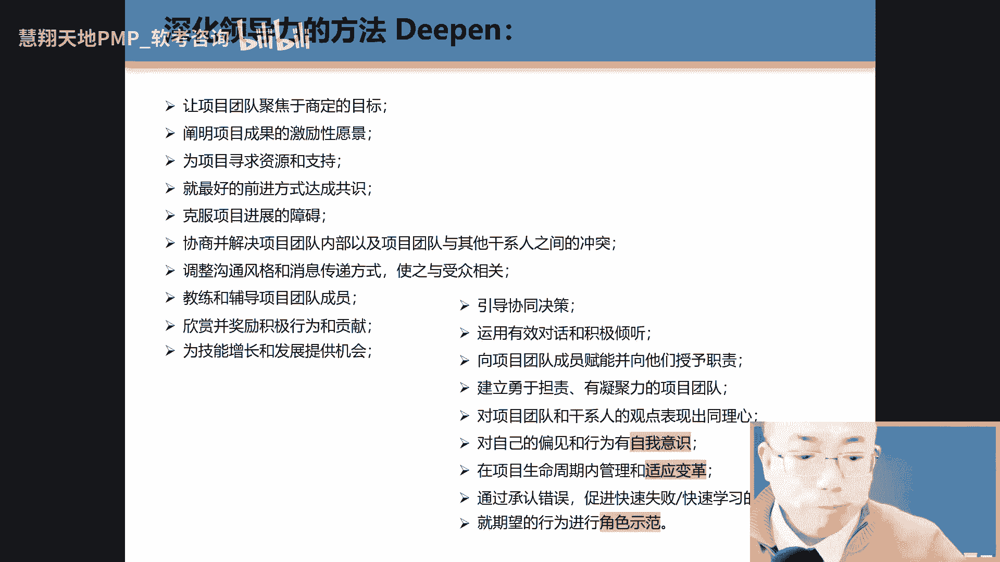

这个呢翻过来第43页，领导的个性非常重要啊，个性所以你这个第六版讲过，你要展示你的这些个性，对这个词一些角色啊。

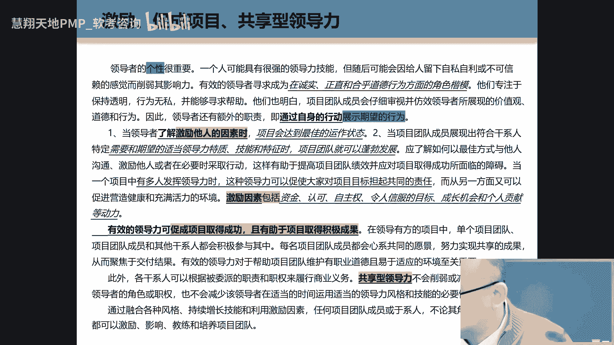

就你后面那句话展现希望的行为，你比如举个例子，我们做项目经理人每天是要写to do list的，这个能理解吧，解构的清单吗，所以我每次解构清单，我就跟我排过，你看这是我的，我写的清单。

看一下布局干嘛给他展示一下，这是我希望你的行为，我也希望你做，所以我们家孩子真不错，所以以前上学的时候，每天回来都要写作业吗，所以他有个习惯，就是他会把这周作业写个清单。

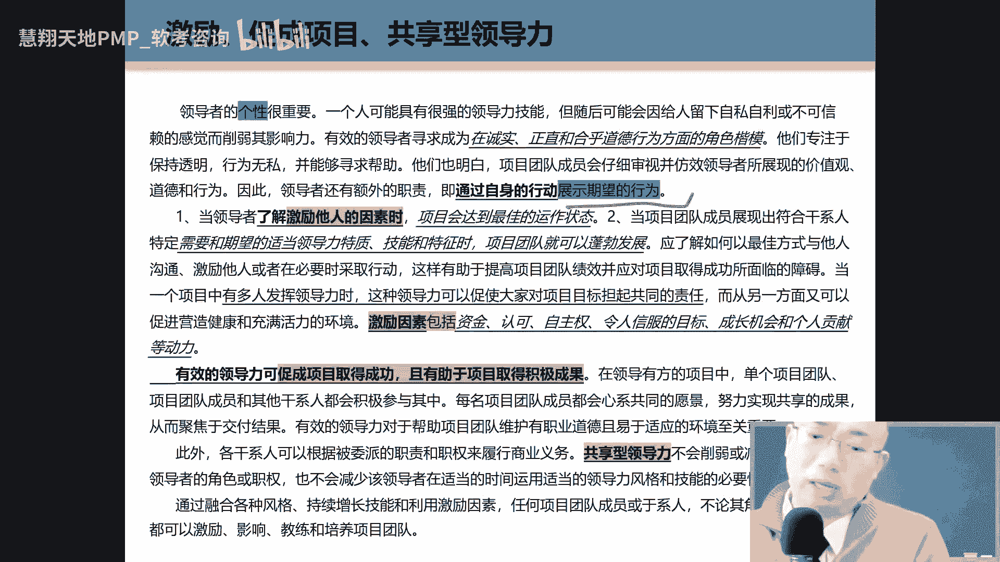

我说你一定要告诉我说哪个是最关键，他都挺关键的，我说那就没有那么关键，我说一定要哪个最关键掉头，你要去想明白吗，这是最关键的啊，然后好吧，在浅表中会提到过，你作为一个领导人，你要了解他的什么动机。

这个动机我们这里把它翻译成什么呀，翻译翻译成哪个字了，就是某些位明白了吗，好的，社会上很多东西来帮我读下来，好多帮我们不帮我读下来嗯，经主包括资金认可自主权，令人幸福的目标，成长机会或者贡献。

我说完了哈，就钱呐，认可呀什么之类的啊，就是你看有些人要这个要那个，反正反正有效力量能够分析项目成功好了，后面有多少个在到倒数第二段，什么叫共享型领导力，这在敏捷项目中用的特别作用啊，共享的目标。

重点呢就可以看到图图，像家长似的命令式命令式的，好这个我们讲完了。

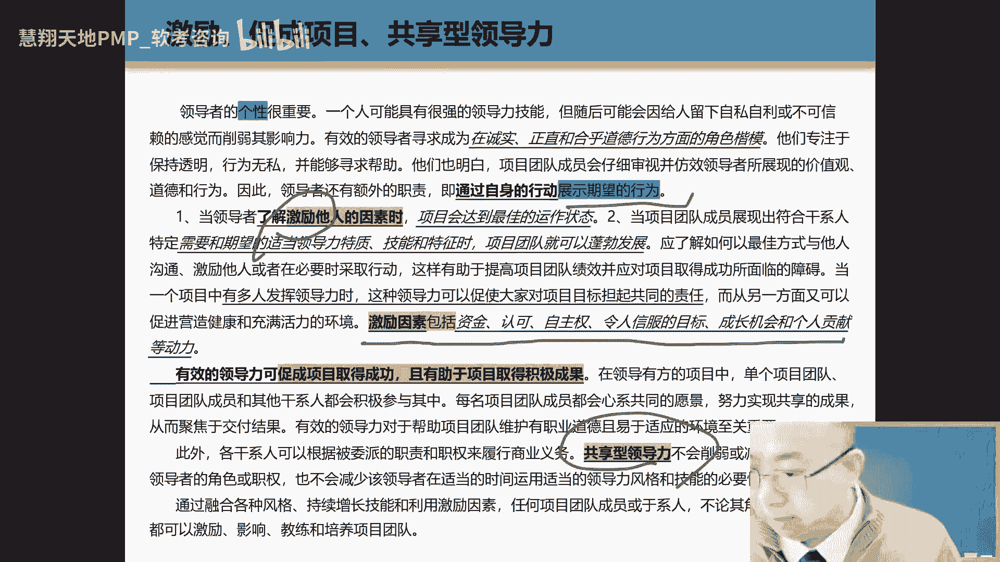

我们翻过来翻过来看一下44页，这个裁剪裁剪我们收获了啊，裁剪要跟谁一起来看看裁剪，看那个价值，然后这一章这一章啊，这种哈呃我们就是你会发现啊，就是在我们学第六版的时候，基本上每一个章节都会。

就是每个知识领域都有菜键啊，记下来在我们学第六版的时候，每一个知识领域他在前面都会讲，都有一个裁剪trailer，我说啊这个tor大家不要去把它用那个中文嘛，就是个裁剪，它的意思就是说我在做这个项目的。

方法论是一成不变的，还是要去定制的，定制的就举个例子，就假如这个项目这个需求变化，它的需求变化很大的时候，这时候我们用什么开发方法呀，可能是敏捷吗，是不是啊，假如需求比较稳定的话，用哪个方式来沟通啊。

预测式的，这就叫东西明白吗，还有一个，假如我是要做一个核电站，做一个核电站，那我的哪个知识领会重点关注啊，质量和风险，质量和风险，假如我现在这个团队中这个人特别多，干事又多，这是内部的团员。

这个成员有成员比较多，那里也是比较关键的，沟通有就是communication，比较沟通比较重要，包括汇报啊，沟通啊，反馈啊，关键这点就叫裁剪，叫TAYLOR，来这边TAYLORTAYLOR啊，好吧嗯。

我们上午呢呃反正就是这个这个ta吧，当时我们还有一个章节专门去讲去讲。

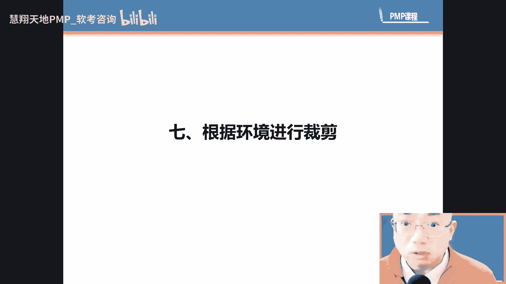

来我们快速看一个表吧，来那个你们来找一下那个英文原版词啊，英文原版词来找下这段原版词，来到了没有，他说设计这个项目的方法基于什么呀，机上的环境，冰箱的环境，还有目的，还有环境等等，明白吗。

所以其实你违反了核心词是哪个核心词，动词是哪个动词，设计什么动名词来设计什么东西，设计项目的开发方法，该方法你提到谁的开发方法，你想起谁啊，敏捷呀，预测呀，混合呀，懂我意思了吧。

就其实也就是说其实裁剪是干嘛，就是设计什么呀，设计项目的开发方法，Design development，Approach，如果一个词的话就没词了，approach方法来说不approach。

approach这个方法可不是method approach，approach方法方法好的，所以我们来看一下啊，来看一下哈，那个词，他说每个方每个项目都是什么呀，独特的，然后你一定要找到最适当的方法。

最适当的方法，然后呢在对项目进行裁剪的时候，是一劳永逸还是迭代的呀，是的，这就像极了我们的方法，就是说我在设计这个项目的方法，开发网的时候，可能我本来想用预测，是他画的作者发什么呀，这个需求变化很大。

就是怎么样，我不想把它改改，改成什么呀，混合或者结合明白吗，所以这就叫呃裁剪啊，就是我要去不断去调整我们项目的开发方法，所以为什么说现在考新版考试的时候呃，敏捷的就是敏捷题，最多一次到变态级别七成。

就70%考的敏捷的题，我大陆疯了，然后现在能稍微好点，能三十四十，有50%，所以我发现学我上我上我上次讲过了，学敏捷对谁对谁是最友好的吗，第一做就是做这个软件开发的，就是做app啊，互联网网站开发的。

还有做敏捷制造的一帮人，明白了吗，所以还是那句话，学项目管理有时候就是就像我们当年九几年，我在考托福，考GRE一样，要考GRE阅读，但凡你要是学计算机和学生物学的，考GRE的分数倍儿高，都能看到。

我们当然可能考到2100或者2000分，这分数一很高，但他们你来申请一是够的，为什么呢，因为美国人出的GI肯定就喜欢出biology和cs，就是那个computer science，计算机科学的东西。

那没办法，他不出别的，那就那你没办法，那假如你是学生物的，又懂计算机，又懂生物，那你就占有，而那个年代很有意思，而且那个年代出国的这帮人去，因为那个年代酒店出国的一般都是去拿奖学金。

不像现在自己去花钱嘛，都拿奖的，而最好申请的专业就是生物学和计算机，而考GRE又考这两个专业，所以就很神奇，所以我奉劝到一半，你说什么学敏捷比较优势，就刚讲过做敏捷开发的和做运营提高。

尤其是敏捷开发预算，所以就说老师，我不是没办法找一个人去聊一聊呗，能理解吧，好吧好，我们上午呢就到这啊，到这下面我们会稍微快一点啊，快点把方法教会的化妆品就可以啊，OK来给自荐掌声了吗，嗯好谢谢大家啊。

你好歹把麦克风关一下，谢谢来给你分享一个经验啊，下次的时候呢，因为假如你会担心你为了防止你，你你不怕我啰嗦吗，你应该怎么办，不是不是你，你问假如哪天你养成那个习惯，你这时候一下完课。

你老师这个外公我关了的，我听完什么感动为得瑟，哇塞这哥们儿太适合做项目了，会主动跟别人沟通汇报report，你知道吗，因为这代表担心它换电池了吗，所以有的时候主主动跟别人沟通重不重要啊，超级重要。

会让别人觉得你是很担责的，很担责，很主动，很规划，很有风险啊，我们上到这。

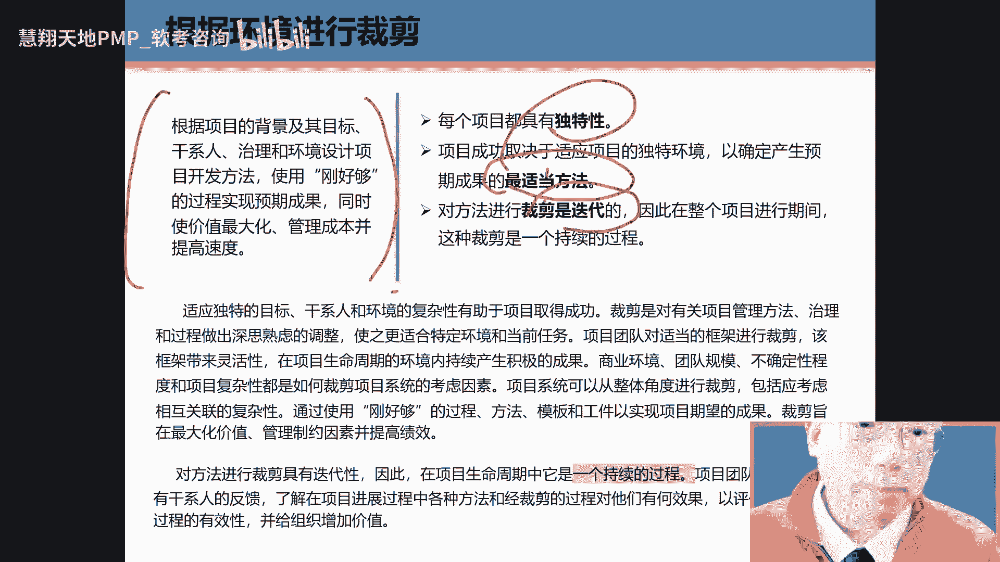

谢谢大家。

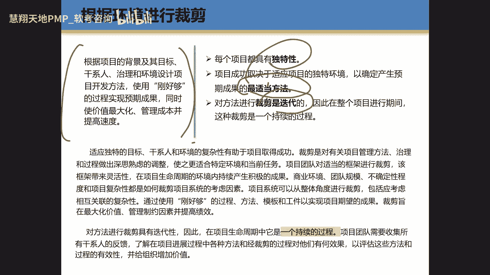

好会啊，行吧，那我们可以开始吧，好我们上午讲到过那个12个原则，我们再把那12个原则啊，12个原则我们再说一下啊，12原则，那12怎么去记啊，先是哪个起点压变革变革，包括我们在讲，等会再讲这个呃。

巴拉西相遇也是以变革为主，有了变革之后，我们要提高我们的什么韧性和适应性，还是一对词啊，还是那个系统性，就是现在项目项目是很难的，还有系统性和复杂性，然后还是与人相关的四个什么团队呀，干系人啊。

领导力呀，管家里啊，然后还有那四个诶对就他有单独两张，一个是价值和裁剪啊，这样就马上讲的啊，还有就是什么，就是保留在这种质量和风险，其质量和风险等会在哪，在德克拉西亚也是有体现的，OK好的。

我们来看一下裁剪，其实裁剪这个词用它翻译成翻译成中文之后的，很多人就没有，包括都有点印象，就有财产怪怪的，其实很简单，就是他的一些项目管理的一些方法，包括一些文档啊，一些工件啊，都要去做什么去定制啊。

定制去调整，不能一劳永逸的，尤其是特别提到过这个呃那个方法啊，就这个叫approach，叫create，就create project diva pros，开发方法就这样好，我们来抓重点啊。

然后44页好，稍微加快点进度，然后我们可以翻到44页，所以那个上面这段文字都没提到过，他说这个来跟着我一起来坐下来，商业环境，团队规模不确定性是吧，都是必须要财政项目考虑的一些因素，是不是啊。

就是不确定性我们说过了，因为你记住啊，当不确定性不愿意去那个词啊，WA中的那个WUHSI，当无卡就是UUU增加的时候，不确定增加的时候，我明白你会用什么方法呀，敏捷开发方法是不是，然后呢，在敏捷团队中。

团队的规模会变什么样，用小，采集的目的是干嘛，采取的目的来干嘛呀，来读一下最后一句，这段话怎么样，诶，这段话价值能够把管理治理所提高，技巧就可以了啊，嗯然后翻过来45页，45页。

45页中特别挤的那个45页上面知道吧，这个团队和PO一起来考虑这个因素，就看很可以了啊，在第二个特别提到过他的项目是什么呀，是独特的独特的，所以交互什么也是什么，他说什么交互并不独特，但是环境不同。

环境不同，说这么多规矩干嘛，就你的方法怎么样，要最适当的方法，在浅表中特别讲到过这个词，就这个地方刚刚刚刚刚好啊，什么之类的啊，这个啊说白了就是你的方法是一成不变的。

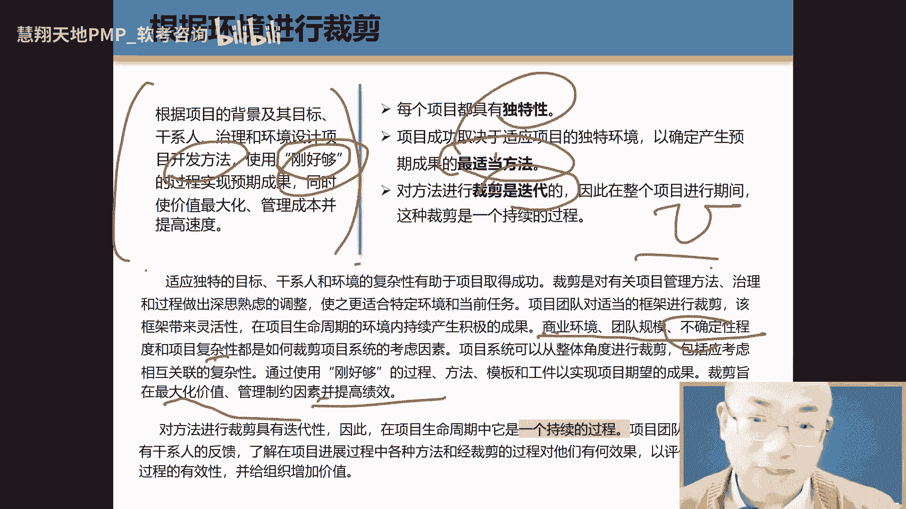

还是要调整的，哎对了，既然是这个方法怎么样，这样适当就可以适当，这是上的那个词叫appropriate，Appropriate method，Appromise，主要是环境不同啊。

有动态动态动态动态的方法，啊第三句话都没提到过啊，就是现在的方法，对工作方法是我们了解如何进行进行裁剪，我说过了，其实裁剪就是裁剪，不是做什么呀，方法是不是不同的开发方法就可以了。

他说我要跟我要去裁剪我的方法，那后面也开始反着问，他说如果我不解，他说我不裁剪的话会怎么样子，不解的话才能找到这句话了没有，你们你们书上多少页哎，对在45页的倒数第二行，如果我不裁剪的话。

就会对项目造成什么影响啊，会造成比如说项目的成本增加呀，怎么进入延长，就举个例子，假如说我的项目都是变成敏捷项目的，那这个项目的size是变大变小的变小了，所以这个方法变得简单了。

敏捷了就没有必要搞那么复杂，然后这个方法之外还要裁剪什么样，才能以就是一些方法和工件进行裁剪，我们说过工件一般都是什么呀，项目文档后面有专门进行，所以这块我的号看一下，就是这个有些过程方法这块啥意思啊。

啥意思，什么叫这就要打三个P吧，就对什么方法什么进行更改，就举个例子，假如说我们说过，比如说做呃，呃比如说我们项目团队就是第六版，举这个例子啊，说项目团队原来有十个人，现在变成100个人了。

那什么什么方法，什么过程要增加呀沟通，比如以前我是做软件的，应该做成钢铁或者做什么核电，那这个时候我的什么呀，我的质量和风险要增加一些，过程要增加，最好理解吧，就这，你看他沟通了很多，比如他说。

我甚至就是说我除了这个方法踩点之外，还备注了一些呃该性的沟通进行裁剪，比如说举个例子，像我们以后各位小伙伴，你要做那个歪起啊，勾起呀，什么歌企业这种企业内部的，其实干系是很复杂，沟通也比较复杂清楚了吧。

我昨天跟一个跟一个项目在聊天，那个小姐，那个姐姐一看就真的是不适合做大项目，或者说做项目做久了，往往就是一个就是那种没有系统性思维，没有全局思维，就是那种像那种就像那种就是很正常很正常。

因为他因为不是每个人都可以跳出来，他就是做这个啊，他们有思维，然后他也没有想到做项目，那个干系人的复杂沟通吗，他只是看了一些具体表象问题，好了这篇第46页，这两段特别好，特别好好理解啊。

总共有上面有四个，下面有六个，就是意思就是说如果我用了裁剪的方法之后，我跟企业带来哪些收益，收益这个看着好，包括哪些成果其实很相似，这个就不啰嗦了，好最后一句话，他说了对方法在裁剪的时候具有什么性啊。

迭代器这个其实在前表中加了没有啊，在前面讲了没有讲过了，所以说我说过12的原则中不是一个人写的，是很多人写的，大部分写的时候比较好，顺序比较得，当然后面都对应的极个别原则是前面写了，后面没有或者没写。

后面有不是顺序不对。

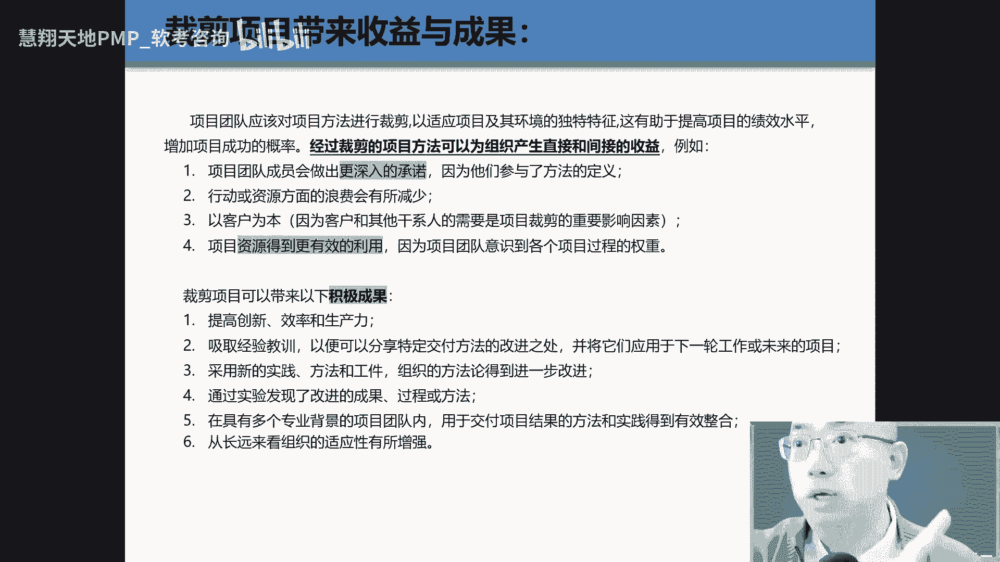

明白了吗，OK好，来看下将质量，我们说过提到质量还想到谁来风险来，在这边提到其他是谁风险的风险，而且这个在绩效运动也会讲到，这个将质量融入到过程和交互中，其实这个时候如果你要是做过丰田制造呃。

就是我们知道就说质量是是是设计出来的，还是制造出来，还是检查出来的，首先可能质量是设计出来的，其实是制造出来的，肯定不是检查出来，所以我们有时候融资的时候，企业特别喜欢查查查，就如果你是要制造出来的。

或是设计出这块，所以说我把质量融入到过程和交互中去，比如过程中，其实我不是说我要去查你，如果你的整个过程都是很很中规中矩的话。

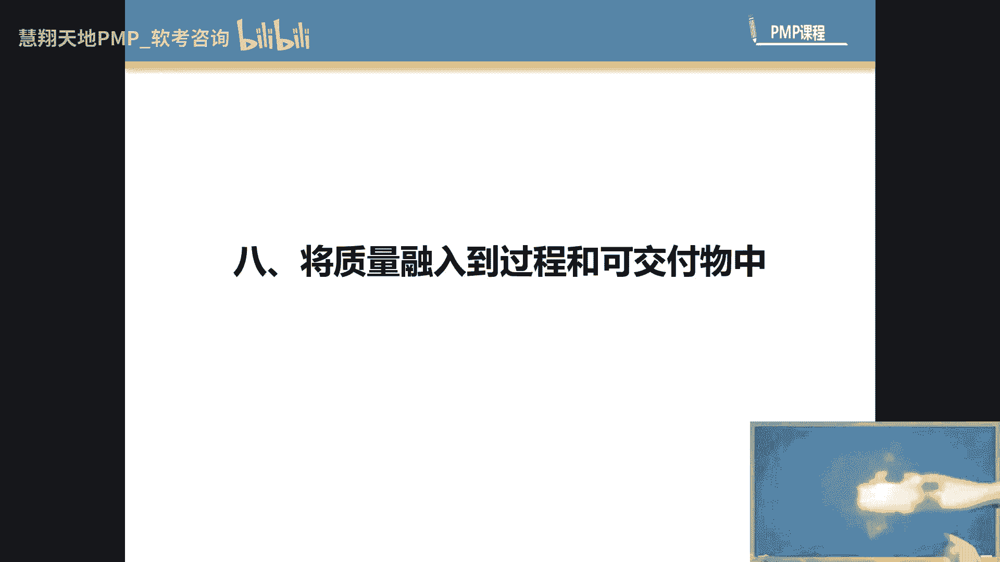

其实只要是OK的对啊，好看的浅表中浅表都没提到过啊，你把第一段读一下吧，找下核心词，就这个就这个这左左边啊，来读一下来，找到核心词怎么个意思啊，对你就干嘛，你要是关注什么呀，关注质量。

关注量就是fox啊，fox on关注质量，关注这个质量啊，关注什么质量呢，可以生产怎么样交付物的啊，就是产生交互物的质量，这个质量可以满足肝肾的需求，所以呢就是你需要对质量进行关注，Fox sound。

什么fox spology来说一遍，FISCODING就是这就是核心词，也关注质量，这个质量是产生produce drobots，好的，左边右边有三点，右边三点，第一个这个项目的质量是什么呀。

首先干嘛呀，满足干系人的什么希望，包括产品的什么需求啊，需求INTEL，第二个是什么呀，就是我们做质量的时候是关注什么呀，这是第六版讲过的，第六版，记住啊，他用的动词是哪个动词啊。

像我们早些年学学三百四百的时候，用的不是这个E就是exceed，就叫exceed吗，超过就是要超出别人的预期，到后来到第五版的时候，到第五版第六版的时候开始换点动词，把超过换成什么词啊。

满足了就更加的实实在在的满足教育成果，OK其实我们在学过第六版中的范围说明书，范围说明书不也提到过吗，就是你啊满足这个验收标准，就是那个就是一个叫项目交付和验收标准好，第三个来读一下需要怎么样。

这跟我上面讲的裁剪一样，它叫rise，Rise，Rise from the process，Your right alright，好下面就不用说了吧，说他质量对，得把讲过的质量是什么来着。

讲质量是什么东西，哎对了，太棒了，质量是一个长啊，它是一个程度，就是quality is a degree to which a settle，你要满足这个程度，然后测量满足标准质量有哪些维度啊。

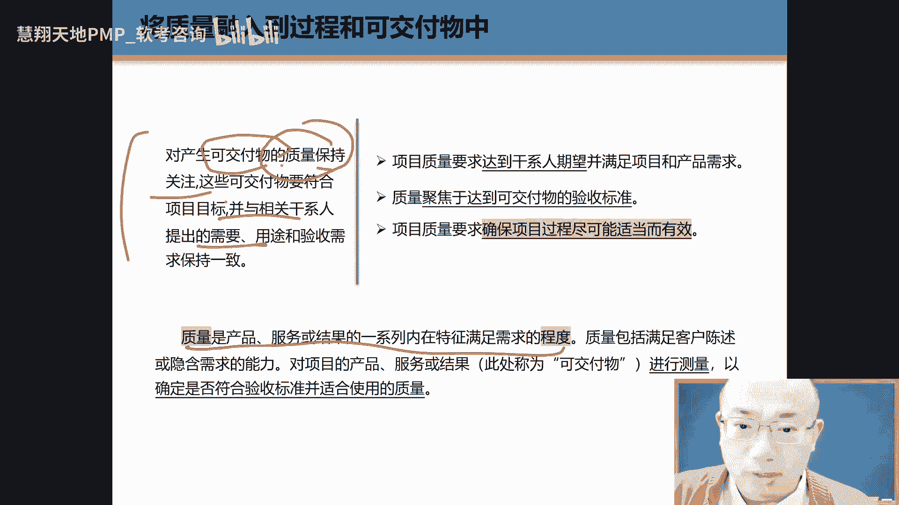

质量有哪些维度，我们在考虑质量的时候，质量有哪些维度，有以下不同的八个维度，差不多就是绩效，一个性，可靠性，任意性啊，OK我们先笑一个平行，就举个例子，有人说为什么说咱们国家那个导弹也可以做啊。

什么卫星，什么发射火箭的发动机都可以做，为什么我们民航发动机比较弱啊，其实你要弄清楚呢，比如说哪个更可靠啊，相对而言，比如说我要做火箭弹和导弹的发射合作，民航那个更可靠，民航民航弹药可能要飞好多次。

是不可能，火箭怎么样，第二上去了，火箭就那个发动机就还在用吗，带有密码，但space x在用，space x是同等于二把密码好的运动就扔掉，一次性得了，所以选了更多是速度，重量推动推动推力。

但名号和名号的配信号就要飞多少次，多少切多少万字，所以它的可靠性更强，可靠性更强，把任性满意的统计效率可以可持续性下，OK好的。

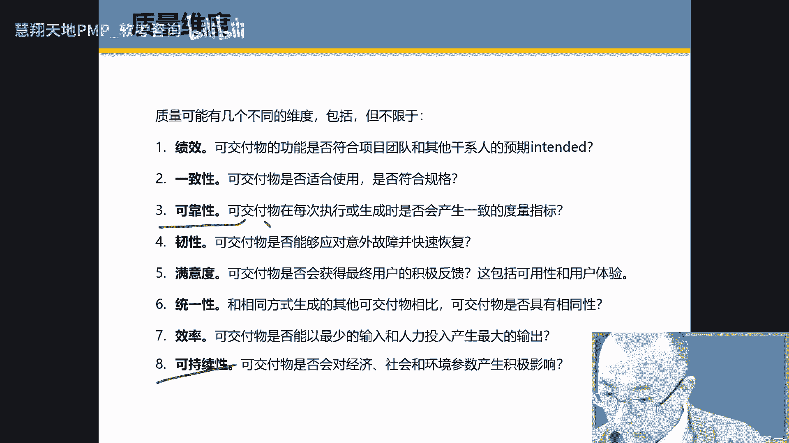

然后在下面那个48用户需求什么需求需求，把计划投下来，项目团队根据什么来这个计划走起来，如果说慢点，别着急，去读一下，找一下那个核心词，就是说相同呢在测量质量的时候，用什么来测量值，右键是什么呀。

标准和验收标准非常棒，还记得我们在一个班群那个质量的时候，还有三个过程，质量规划，质量管理就也要质量保证，还有质量检测，质量规划的目的就是干嘛呀，制定呃质量管理计划和志明，还有质量标准。

那个质量标准就是什么呀，Quitting methods，然后在质量控制的时候呢，就是通过这个就是检查我的质量交互，是否满足我这些质量标准，再说一遍啊，这个质量标准是哪个过程的输出，刚讲过的吗。

哎对指点对方是这样，对方所以我们就冲这个质量标准，这个质量标这个质量标准是指什么指标，这个matrix就是带回来metals，这可不是center里边CRIMETRIC，它是指南规划的一个输出。

包括这边会提到过，就质量活动，质量活动是干嘛的，有48页，质量活动是用于什么呀，发现分用错误，所以这个时候就发现这个车辆我们中国在哪，就像COC中用的，比我发现质量和缺陷，检查出有质量缺陷能确定好呃。

翻到49页啊，翻到49页上面那句话，说一下关于质量的质量活动的目的是干嘛，摆脱一下成功的目的是干嘛，OK好的，然后呢，这边有几个事，你第一个给你什么快速交付，第二预防预防啊，质量活动质量活动看一下。

那如果讲了这么多之后啊，他特别提到过，就是说我们这么关注我们的质量，你们刚刚讲过，在那个浅表中。

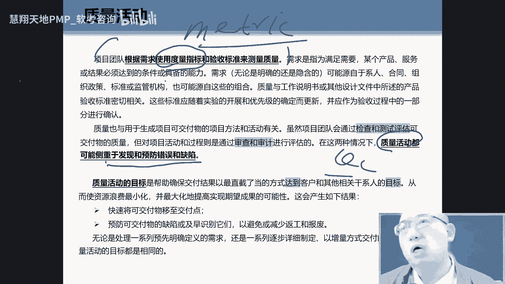

不就是说我们要关注质量嘛，就这这我们要保持对质量保持高度关注，这就是focus on quality是吧，我对质量保持关注有什么好处吗。

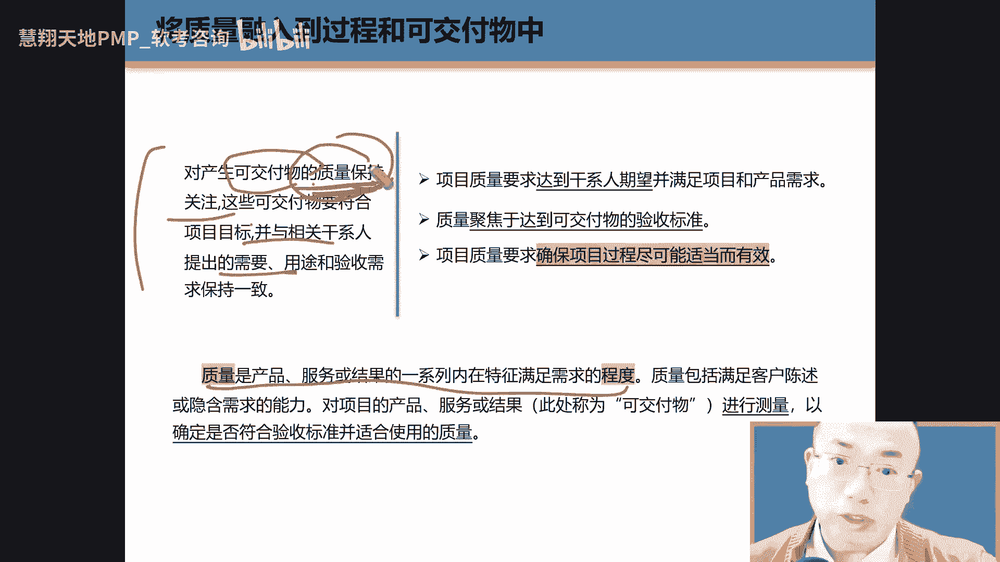

就这就是以下的14点，这是我关注focus song，所以你把这个FOCON，你帮我写个前表，在这写个前面填左表，应该就出来叫填左表，因为在全表左表中就干嘛，我们要关注你呀。

关注就密切关注FOCSQUALITY是分散关，我们关注有以下14点，13就特别好理解，不浪费这视频，尤其是四个持续改进啊什么之类的等等。

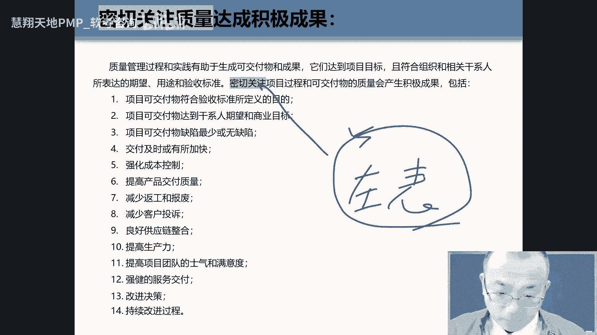

好翻过来，复杂性，我们说过复杂性，复杂性跟谁是一对儿子的爱，系统性复杂性，这个呢我们前面讲过那个呃，等会我们后面再讲到巴拉提交易的时候，他再次提到过，就是当今世界是一个乌克的时代，那四个词乌克还记得吗。

必变性，我们听题不确定性，Uncertainty，复杂性，说complexity，模糊性，AMIGUILTY和MIGUILTY，那我们讲究感情，感情，这个呢第一章的考题会比较少一点。

因为的确也比较复杂很复杂，因为我们说有些人就是就举个例子，比如说我们知道一个燃油车大概多少个零部件，一个燃油车就是我开的小轿车，如果是烧油的，大概多少个零部件呃，2万个2万个。

那一架一架C919可以带多少零件，大概是100多万，100多万，就一个梅林某人那个是燃油车，那我们知道这个比如说像这个新能源车，就是就不叫普，准确说不叫新能源车，叫电动汽车，大概多少个点铺垫。

他就这么说吧，他这跟燃油汽车比的话是复杂而简单简单了吗，彩电沙发大冰箱是不是，所以他这个好像是永远要低于这个量，所以这个为什么我们国家要求做的原因，目的就是燃油车都是老外发明的，然后专利都是他们的。

所以我们却想着作业都是都打点零工，但是新能源车，这个电动汽车是我们可以自由申请专利，然后也不复杂，因为我们的目的不是为了搞得复杂，我们目的是要干嘛呀，开嘛开嘛，所以不要搞那么复杂，所以我们就做大理课。

所以我在全球化就中国在做，就做的最好的是中国在做，OK但是话又说回来，做这个新能源，做燃油车或者做这种电池车，无污染环境，它的污染在哪里，污染的电池电池电池是污染，别的不太火电，城市化是OK的啊。

城市化是比较利索，因为它不烧，他不烧油吗，有电电视是污染的，好的，我们来看一下复杂性和复杂性，就是现在就把弗兰降低。

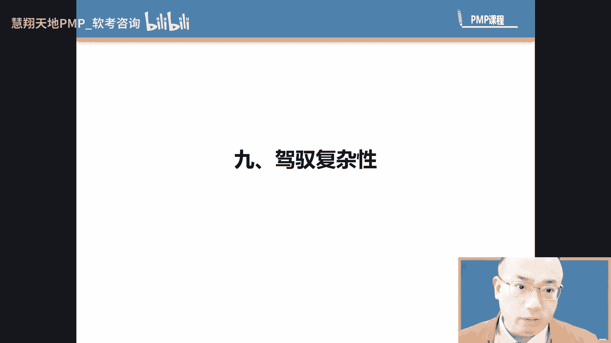

但是我们做项目是行啊，来依然来帮我读一下浅表，读下浅表，好的咱们看一下核心词，核心词是什么呀，就是评估和驾驭复杂性，接下来就为了评估的评估和驾驭的评估和驾驭，那目的干嘛呀。

这样你对什么方法和计划能够使项目成功的啊，能够成功的，这什么驾驭这个项目是每周五期，所以你要评估，关键是还是要评估这个项目的复杂性，你只有这样才能够驾驭驾驭这个就像人一样。

如果你现在你要对你的这个身体结构，你要能懂的话，其实你就会很好的加入这个声音，就，我们知道我们知道中国的香港人，他的寿命是比较长的，除了保健比较好之外，就是日本人的饮食非常清淡，过一段时间为9997年。

我在香港待了半年就明显了，那边人吃的就很紧张，喝点汤啊，盐油油特别少，咱们大陆的时候有个地方哇塞那个做火锅，那个油盐哇塞，这太重口味了，那迪士尼伤害非常大，也就是说所以在四川那边人的肛肠都不好。

胃肛肠都不好，因为他都吃那个辣的咸的，尤其是油的油是最让常是女的，所以就是说你要对你的整个身体的复杂程度，做评估和navigate，navigate啊，评，因为人的生命生生。

这个人的身体是一个非常复杂的器官，好的，那我们看一下右表中就提到过这个呢，就这一章写这一章的人呢，还是讲是比较中规中矩啊，挺好的，他说为什么复杂呀，有这么复杂，怎么样，人类交互不确定性模糊性啊。

咱们在这边啊，刚刚讲过的卡来复杂性是哪个字，复杂性是哪个字母，C complexity，不确定性不确定是哪个字，uncertainty啊，某些人则ABAT我又没有写这个V1面性，没关系就行。

就是就这个不确定毛固性复杂性都有啊，你又觉得特别强调过，第一个是哪个什么造成物这么复杂呀，人类的，所以各位小伙伴，所以有的时候我跟别人聊天的时候，但凡那个项目经理，他说我们做项目要把人给整明白了。

那我不知道这个人是可以做大项目经理，但是如果要做了好多年的项目，他每次跟我聊项目的进度，项目的范围变更就聊这个，那我想这个人估计也就这样了，因为这项目有什么难的是吧，人的行为造成的好。

把第二句话就讲像复杂性是一样在背了，在项目期间，任何时候都不知道，好的，那为什么复杂呀，为什么复杂，看第三句话，为什么复杂，是什么造成的，对的核心词说明有一些什么事件或情况。

就是event composition造成，就是有些事或者有些情况造成，而这个事的情况是怎么来的，影响是什么样，会影响就这些事，就这些事和行为影响的一个项目的价值上的，明白好的，因为项目是很复杂。

所以我们团队人要保持什么样，导师就是，就像有机会你到那个有机会，你到那个法国的那个巴黎，在郊区有一个凡尔赛宫皇帝的床呢又小，还有点坡度，很奇怪吧，我们咱们知道那个安卓床应该大一点是吧，大点的软一点。

舒服一点，没摇，他床又窄又小，而且还有点坡度，就像就像就像个半躺一样，为什么你知道吗，实则保持警惕，就万一你只要刺杀你，是不是啊，他虽然还有部门，他床边还有个小门，就万一你的走小门通过秘密地道上。

那个就是VGLETVIGLET啊，就是你要时刻保持警惕，长的就像日本一样，日本它是地震多发多发，所以家里面都备点什么药品，饮水食用水，饮用水开了怎样一些饼干，是那种压缩饼干什么之类的，万一发生地震。

我都怀疑，因为救援肯定不是买不了，我挖出来吧，你得到一块，所以就要保证时刻保持警惕啊，OK好的，我们来看一下这个进度啊，我们看到50页下面才说啊，这个前面讲的是前面都讲过了，为什么复杂刚讲过吗。

这是因为什么呀，复杂性这类行为造成的啊，不用说了，所以这个时候你要干嘛，你要去你的，你要做一些调整来应对这个复杂系统，好好的，有些人真的是平时他就有一个，我们知道学相关人，以前说我们有有风险意识的话。

那这个时候第七版我们还有什么意识吗，系统性和复杂性，系统系统记下来啊，就这两个意识哈，以前是风险意识和什么规划意识，如果现在你要两大意识的话，就是这个系统性和什么样复杂性，OK好了，这很关键啊，好的。

第二句第二段中他曾提到过啊，第二段第一句他说呃，这个项目里通常无法增加预测，这是不是有点像风险一样，是不是啊，因为这些原因为什么复杂，因为这些原因是消费在一起很难分辨出来啊。

分析出来就像就像很多人很奇怪，莫名其妙得肺癌，自己不抽烟，老公也不抽10年，同时也没抽，真的是很难，也就是说其实很多癌症有一个原因是什么呀，很复杂的，他不是说某一个原因因素造成的，造成很难啊。

所以他才那么难治吗，所以一提到癌症，这个文莱色变好了，我们来继续走啊，继续往下走，我们可以翻到这个五十一五十，我之前特别提到过，就说复杂性的来源有哪些来源。

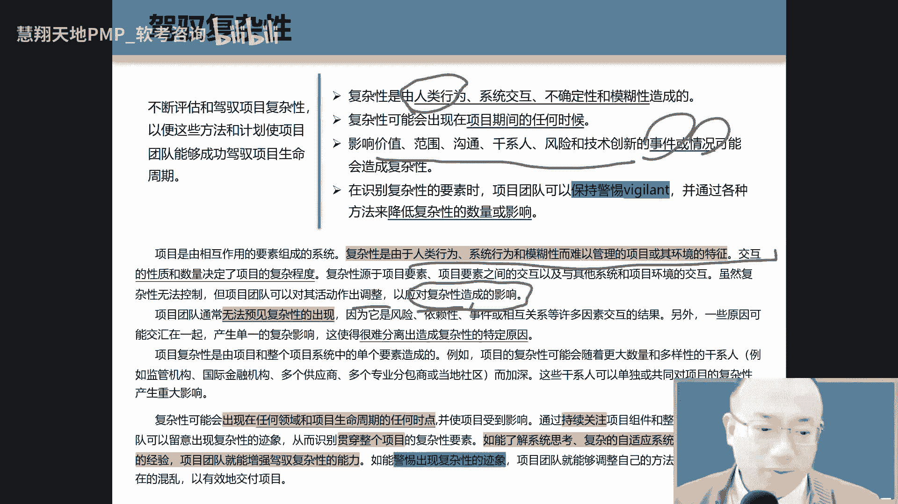

可以看专业课不会做怎么样，人类的行为吸引他的行为不确定，包括什么技术创新啊，重点看后面的名字，人类行为看一下人类的行为啊，举止啊，态度啊，尤其是这态度经验一般的态度画一个圈圈，很多人说他不是能力不够。

他没那个态度了，他变得消极而变得积极了，消失只是一点招都得了懒癌一样，感觉到了就像人得抑郁症一样，真的是医生的看法，抑郁症挺吓人好的，第二个里面系统的行为，动词动词就看看就可以了啊，不确定性。

模糊性和模型类型啊，就这两个字DOT再次提到过，乌卡中的模糊性是哪个词，乌卡中哪个词模糊性A非常棒，VUCD加m gut行或者MJ好，正好理解，看不清楚是不是你就举个例子。

你开车的时候突然发给foggy，什么叫foggy啊，对其他物了，这时候的速度是快还是慢呢，一个立马就慢，我有一次就说我有次在那个北京开车来看一下，突然就不知道天气，突然就天天有雾了，因为我们就绝望。

教训起码坐下了，然后呢，我也不听音乐了，速度降下来了，把大门打开，把雾灯给打开，搞得很紧张，为什么你大脑功力真的是可见度很低的，所以我们也是一样的，不确定也好，尤其看到那个什么黑天鹅事件，找到没有。

那个叫布莱克black swan，没错，只有两个事件，一个叫黑天鹅，一个叫灰犀牛，分别是两本书，如果这两本书你要看完了，真的太牛了，你的人生世界观都会发生概念，比如没先看没关系，你让AI，你说AI啊。

呃你是你，你说你看过这两本书，你告诉我这两本书都写了啥也行，这是小时间吗，啊那两本书一个叫什么呀，黑天鹅一个叫什么呀，灰犀牛不会写，你用那个打拼音写啊，比如说老师不会写那个戏，我也不会写。

而我觉得好像是个尸体的石，下面是什么，反正你就写了啊，反正好多好多字都不写了哈，就写求这两个专门是讲，一个是讲这个就是不确定性的，还有也是反正都这样，尤其我觉得2024特别适合看这两好了，技术创新啊。

技术创新啊，去看看就可以，为什么很复杂，技术创新，尤其现在我们要接受这个AI以前，其实以前包括有机器人的时候再害怕，反正他也没法完全替代这个AI太大，所以我觉得现在反正也没人管，到目前为止都没人管这个。

这个说AI对人类社会造成影响哈，而这个各位你自己的问题要听你叨叨讲，你别天天自己不学啊，但是法律不会的，不是做学习啊。

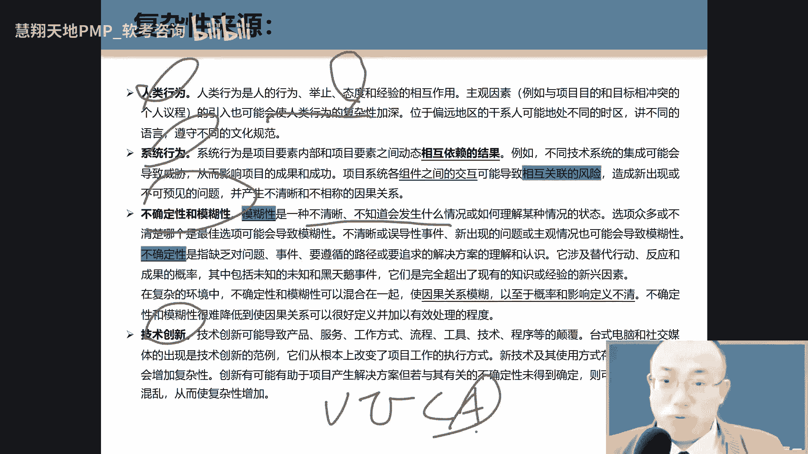

好了，最后一个52页，12页，我们来看一下52分和复杂性，这个前面讲前面讲这句话讲过没有来，他说这个复杂性会出现任何事情，前面讲过没有讲过，来帮我写个前表，OK把这段话看一下，好看一下这个风险53页。

53页，风险这个呢其实我们都跟谁一起看呢，跟质量一起看，而且这边帮我写个参考，六百六百，其实写的比较复杂，多600多赚的是一个什么，这是你的奖励，写了六百三百，六百六百。

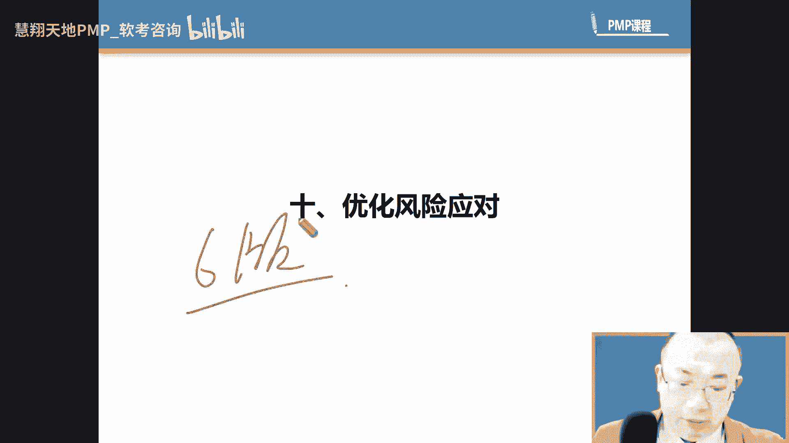

好的来，我们先找一下左边前前边找到核心词，是哪个核心词，哎对了，要持续的评估什么东西啊，评估风险敞口叫evaluate exposure，Evaluate exposure，是在座各位。

如果你要是有小朋友的话，这个冬天你一定会非常痛苦，你知道为什么这个东西小孩哎呦，就是就是真的是我身边有我亲戚孩子，那小孩吧有那个痛，就是好不容易好了，病好了，然后送送学校里外面有感染再去，然后去医院。

东院都不敢去医院，为什么不敢去医院，人满为患啊，人满为患全是孩子，然后大人去最后把把大量调整，因为他现在医院也不知道你这个大病，我说你话真的什么甲流啊，什么乙流啊，什么什么，那个新冠啊，什么支原体啊。

反正也不知道什么，反正就各种病都来，所以就是这真的是寒症，发病不会去医院吗，尤其医院的话怎么样，风险敞口是大变小了大了，包括现在你比如你坐车也是一样的，身边但凡要有人咳嗽打喷嚏的，赶紧躲得远一点。

我们身边有些小伙伴，真的也不知道是什么级别的，就别人身边有人咳嗽了，就是你一点反应都没有，那你那你的风险长度是大还是小啊，多大呀，不行啊，你要说你你赶紧说你戴口罩，你跟他正常来说必须的啊。

我们遭多少罪啊，你这真的一生命，哇，塞这我我我觉得这段视频就有一次，就有一次35，然后被客户发现了，花了我六块钱，为什么，因为你把我项目给停了，项目停了，那你他认为你当我项目进度了啊。

这个我当时我有个身子都想维护生气，因为后说也有道理，因为你吃了很多客户嘛，所以各位你就是我们做风险应对，就是转合因子，就是评估什么呀，风险敞口明白了吗，好了，那风险分级分积极的和什么呀，消极的。

积极的要最小化，要不要最大化，消极的，这下可好，以下右边的五点，咱们以前都学过，都第六版都学过单位的风险，还有一种风险，整体风险风险是积极的，也是蛮消极的，我们要在整个项目期间应转盘，就举个例子。

比如这个各位你们小宝贝，你们现在最大的风险就是说，别别别把工作给丢了，明白了吗，而我这两分别得病了，是不是啊，就这样子，就这么简单就可以了，每个人每个人的不同阶段的风险是一样一样啊。

还有就是风险各种情况太多了，他有招聘那个risk attitude，包括那些什么偏好啊，第一个方面讲过，有些人比较有些人有些干系人，所以我们在讲风险管理，能不能用一个文档叫干系人登记册。

而里面记录的就是不同干系人的风险，态度和风险什么挺好的挺好，哎你会发现在一个家庭里，男生和女生谁又有风险，是谁偏好我喜欢的风险男生嘛，所以男生喜欢炒股，所以这几年只要炒股的男生，再加上低位一般比较差。

炒炒股的买理财，这男生最喜欢玩的，女生一般需要买房子，所以相对来说稍微好一点，在一线城市，房子目前看还凑合，但是你要买的股市买了什么基金理财的，哇塞真的是生不如死啊，好的那风险应对就不好说了。

咱们学会这个马超国债识别风险，定性分析风险应对风险监控，这样OK所以这个风险应对包括以下几点，要干嘛，这位自己的国家只有LISTIC，切合实际来说怎么写，切合realistic，就我们在音乐的时候。

我们做任何事都realistic，切合实际不是应对一样，比如说我这个项目风险，你没有必要投入巨资，因为你不符合实际，还有该性达成共识，Agree to green to，达成共识的归一般会用单词。

好的这个就不用说了，提前讲过了53页那个标价，什么叫有什么风险啊，风险定义，风险是什么，没有啊，风险是什么，不说了吧，还是什么不确定事件，然后呢，你要干嘛呀，就是风险分机会和什么机会和危险，机会更大。

机会危险的更小，因为重点被列入被列入被利用，怎么说不漏到哪里。

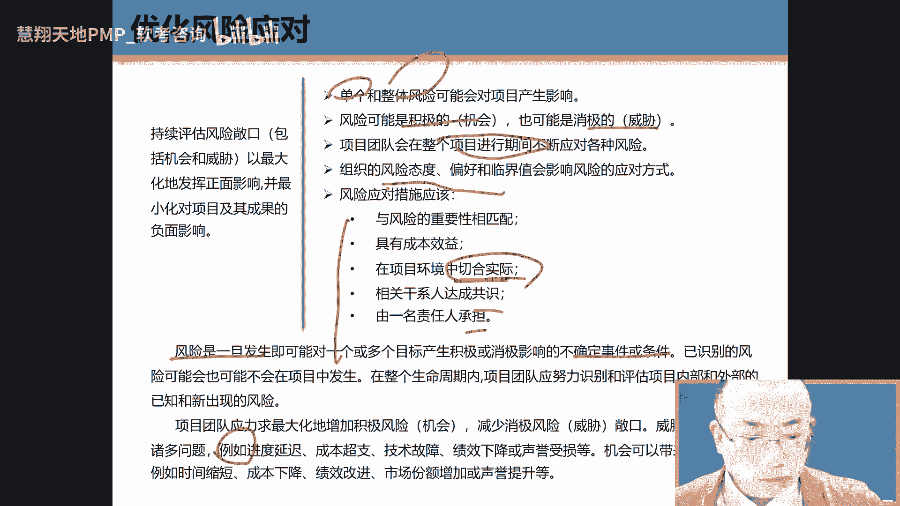

好翻过来翻过来，呃翻过来把那个54页的呃，呃第一句，第一句话录下项目可能应该怎么样，A对了，这个监督这个风险，而我们前面在前面，我刚才讲了叫figuration digate，这里面要保持警惕性啊。

就是那个monitor lilies监督，啊所以这边没提到过风险敞口，来左边那个左边的时候讲过呀，我们要评，因为你要时刻评估这个风险场，目前没在意，我就今年的下半年，10月11月的时候。

我身边带有我认识特别好，四五个就是有我的粉丝，也有我的同事，然后都比我大概小五六岁，你看我我50块50，我53吧，五十三五十九，40 674十七八的样子，然后怎么样的，我好，我还有一个很好的一个粉丝。

是我的学生，是微软的，今年刚刚被裁掉了，在微软大概17年工资是蛮高的，你知道的吧，老子不上班，孩子不好好学校那种，突然被裁掉了，我都不知道怎么去安慰她，因为我想你，你你耍了17年，因为你讲工资很高呢。

为什么呢，福利很好，但突然就其实也不叫突然，他当时说我其实我有预感，他说我那几个好几个老板被干掉了，我想着老板被因为职位越高越危险，所以你就是你就是非，你是要你要评估你的风险长度，所以那个时候你知道吗。

其实我我夫人比较厉害，我夫人有一段时间也不上班，后来他也上班，他为什么说万一你要怎么着，你不行了，我就完蛋了，是不是他就自己找了份工，这样就不在当今时代好很多嘛，所以就叫你要去评估你的风险，产品非常好。

我身边还有那种，你在北京吗，好多人家里比较重视教育，就把孩子送到私立学校，这就是没有做好风险，怎么样，长途形势不对的，赶紧转，结果我说他不转呢，他说我闺女说了，他说你要转，你要把我转到公立学校。

我不读了，然后为什么我那么喜欢私立吗，私立就这样，老师就特别尊重他，作业，作业也比较少，然后培养综合技能，而公益主要干嘛呀刷题，所以这孩子受不了，所以这点要很重要，你也是一样，就是你你吃喝。

你要去评评估你自己和项目的风险之间，长虹房子本来explosion expore，OK好的，然后这个看完了看完了嗯，就是嗯就看到下面第二个，他说的项目人员应该干嘛呀，争取什么相关的参与。

让他们了解了解他们的风险偏好，这为什么说这个地方帮我写一个词，就是那个叫做了解他们的风险偏好，就我们说过叫做干系人登记册，明白了吗，来为什么要练干性的预测呀，第一我的项目有哪些干系人。

第二单系中他他每个人的风险偏好是什么，清楚了吧，然后还得让他们能够参与进来，因为风险可不是一个人管，他是每个人都有风险，都要有风险意识，懂我意思了吧，举个例子，假如说你学项目管理的。

你们家里那位或者男朋友，女朋友或者老男老公老婆，她没有项目，没有学过项目管理，他的风险意识是是弱还是强啊，很弱真的是很弱，那不是一般的弱，不是凡之路，所以有的时候你会发现。

有时候两国长期这个一些这些风险意识不变化，能不能过到一起去啊，有问题，因为你很你是有风险，他没有关系，是你知道吗，当一个有风险意识，没有风险，在这生活是很痛苦的，非常痛苦啊。

因为做项目他是像管家一样做的，非常仔细，也很担责，等死，那你给修香，我我我唉，反正我其实没有太多的例子，就很痛苦很痛苦，然后再次提到过这些风险偏好啊，这些风险偏好，风险临界值，风险偏好的面值，好了。

这边是一些应对措施啊。

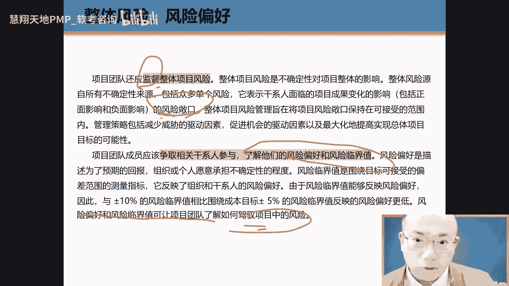

应对措施应对措施有哪些特点，我们刚才讲过了，其实在这个在前表中都讲了的，记下来啊，就在前表在那个浅表中是那个浅表。

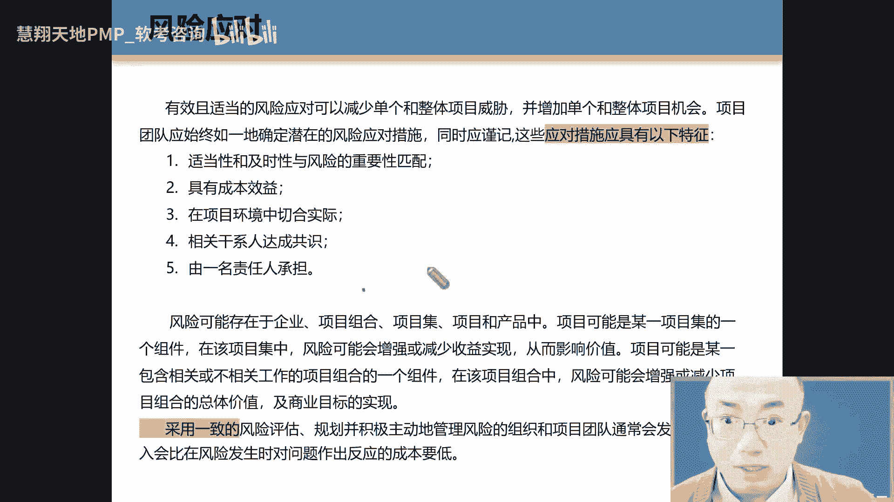

原表中讲过了，是不是讲过了，是这就这都讲过了。

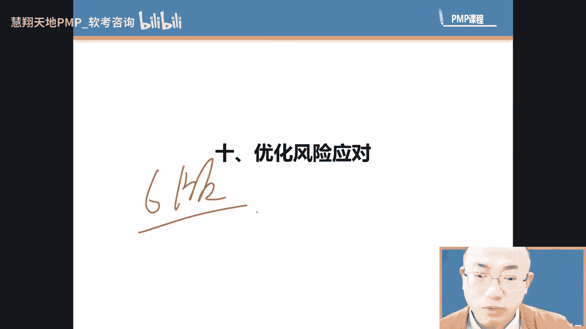

就是我们在做风险应对的时候，我们再把第二版那个风险的过程再读一遍，来背一遍，这都哪些啊，规划风险应对是吧，不是所有人那个什么叫风险管理，就是先识别风险，然后定性分析，定量分析，应对计划，应对和监控风险。

清楚了吗，那我们在应对的时候，那个英文词叫response的时候，要有以下几点内容，古典内容明白了，前面都讲过了，你看这是我的语言表。

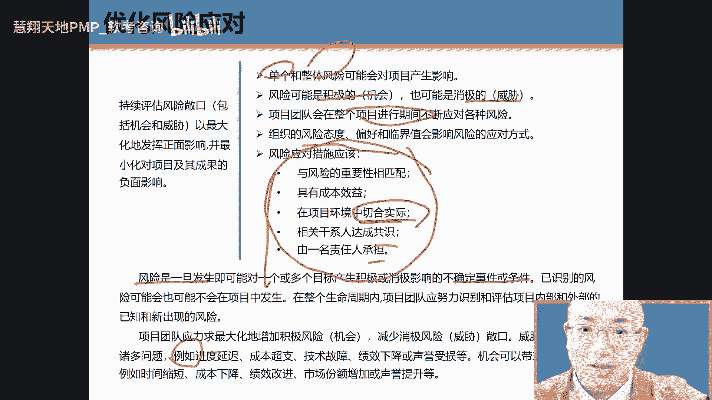

跟你这不一模一样，所以这个作者还是蛮好的，他就写的跟你看这题目一模一样，一模一样，成本效益呀，切割实际呀，哇塞这个在当今这个社会太有意义了，成本效益好，成本我们说过的，现在经济确实不好是吧，风险这么大。

然后我我爸妈跑到我们家里给我上一堂课，说你你大叔把脚关，你先给买盒，马先生你都不介意，说家门口两站地有一个河马超市，盒马的奥特莱斯店都是从你们家店呃，一般是放一店之后，他拿出去卖的价格是价格的五折。

那你只需要坐公共汽车两站地拿到这买，可以减一买一次钱，可是要买一次可省50块钱，刚开始我从来不听，今年我一定会老老实实的做两家公司去买东西，要有什么效益啊，承认下我们上海也会有精致系统，听过这事没有。

如果基本上你不能说大陆要换吗，是不是，这就是你在应对应对这个经济形势报道，你要有成本成本效益，明白了，这点很重要，我家也是我自己放冰箱也放三四天，人家也放三次，放几天，其实你还不如去那买，还便宜五折。

是不是多合适OK吗，也和大家达成共识，达成共识，达成共识，好的好的嗯，这个问题后面看法就可以了，好那往下走哎就跟谁一起看呢。

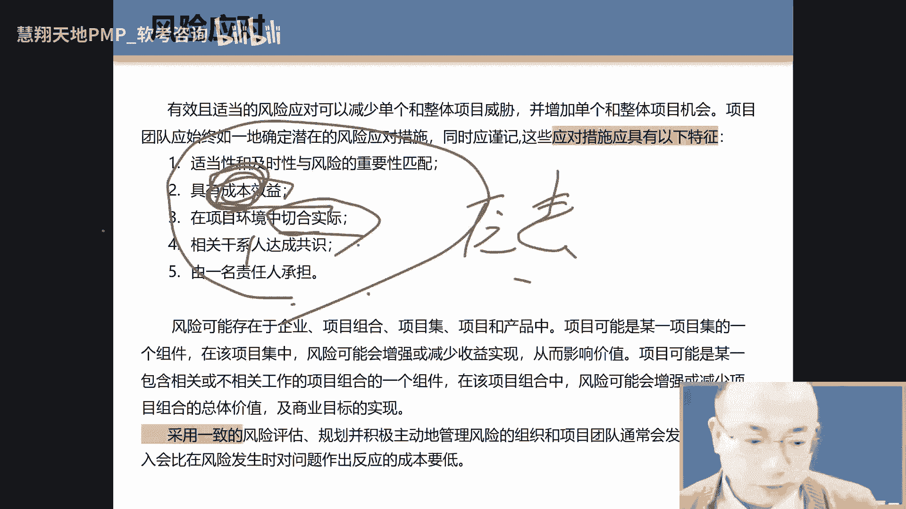

55也跟着一起看哦，哦这个不是驱动思维，再好好想想跟谁啊，哎变革和变革一起来看一下，这两个词非常重要，叫呃adaptability啊，就是适应性和人性，人性其实我们知道做像我们我们知道一种。

只要是好象棋都是一身伤啊，都是一身伤，已经被项目折磨的死去活来，出差啊，熬夜啊啊，跟那些公庙工或旧难题呀，要要跟客户沟通啊等等，比较任性的适用性哈。

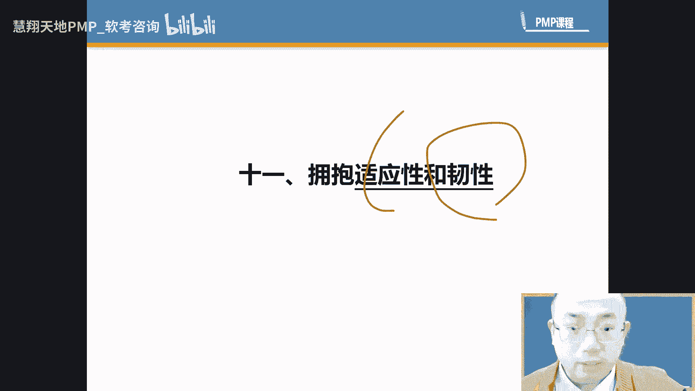

这章特别简单，只要把定义背下来，细分下来，来找核心组成分析出来，他说你黑色干嘛呀，不要找一个词，你看那个原表写的很清楚，看你用原表就是build a diability。

And resilience in to the polizational ba ba ba proach，就说你的项目这些项目的方法，你这个项目管理方法中一定要融入什么呀，适应性和韧性，提高适应性。

你想起了哪个方法呀，敏捷明白了吗，敏捷啊，民间青春们啊，好了后面我特别感谢这个作者写的特别好啊，你看一下举了两个姓，什么叫适应性，适应性干嘛呀，是一种能力，It's ability，Ability。

干嘛呀，two response to前进，就是response to chang condition，就是我要去对变革的条件做什么应对应对，明白了吗，举个例子，3月3月22号，3月3月22号。

那个微软就欧克I公司推出去的GBT，哇塞我好几个学生，立马就去想办法去注册那个账号，然后呢4。01退出，立马去花钱买账号，结果4。0，结果就因为会有压力，4。0开不开放了嘛，就买不了了。

就这些人一看就属于那种，就是就是对这个变革环境，他也知道这个事，他就有那种意识，你知道吗，然后我还好，虽然没掉泪，我就让他们把我公公也装了，我给他钱就帮我装账号，申请的账号。

这样就他对这个变革他是有有他愿意去调整啊，这种能就是说应对能力呃，应对应对变革的条件好的，第二个什么叫韧性，来韧性怎样也是一种能力，什么什么能力啊，哎吸收第一是吸收，第二个recover叫吸收。

Impact recover，什么叫吸收吗，就举例子，比如说你车呃，你买那个车的时候，车跟前面车一撞，有两种状，游泳是钢，一撞啥事没有，就是那个刚那个前面那个钱撞，两撞之后啥事没有，还是个直的，硬硬的。

还有一种就是一撞他那杆一弯啊，哪种是吸能啊，我一下子，但你别挖太狠了，挖煤了也不行，那没了，那不就把你干死的话，就他那种叫我就弯一下，它就是吸能性能比较像日本车一般，特别想要吸能，它叫OSP和SP。

就这样啊，就包括你有时候你比如说有时候别人呃，防撞击的时候，比如一个气囊，你撞到那个方向盘上和撞到气囊上，那个是安全的，气囊上那个气囊是干嘛，ABSOL吸能啊，这个状态的能量吸收的能量。

还有呢和很快能恢复过来，有些人就是这样，比如有些人就是比如说他能恢复很快的，我们知道做项目是需要什么，就是我被整对，今天被客户折磨了，可能我睡一觉，然后呢吃点好的，吃点甜食，或者说运动一下，出一身汗。

跑一步来睡一觉，我明天查是没有的，就是recover，而有些人就受不了，哇塞就是天天讲一下科目折磨我啊，受不了，那就完蛋了，所以这两个是非常重要的，嗯好用适应性和什么任性好了，然后把东西读一下。

关注什么呀，关注结果，而不是输出，这样有利于什么呀，输出这句话呢，其实这句话呢就是还有点不太好理解，慢慢去体会，慢慢去体会，其实我们我们是要更关注什么，关注成果，关注成果，这样好吗，是不是啊。

不要信自信，说那年真的，我觉得真的是在前年，他就真的是改革开放，是不是啊，那时候我们这小说有什么，就是每天吃资本主义，割资本尾巴，卖个鸡蛋抓起来滋润是什么，那个资本走狗是这样。

他就那种他说我们不要在乎这个什么这个东西，你在乎你成果，我们做项目的时候，你不要在问你，你你给我交那么多钱，你把成果我们带来成果，这是很关键的啊，那我就这点就像那些我们比成果还要更高的，是哪个词。

关注什么呀，价值value啊，这是非常重要的啊，这种好处吗，能够增加适应性，看好的下面两段文字不是说了，在55页啊，就说大家把第一句话读一下，说大多数项目你都会遇到什么呀，哎遇到挑战遇到障碍是不是。

所以我们说过，你一定要看西游记，西游记是什么呀，九九什么呀，81难那里面就是什么呀，你不懂得，Challenge，Our circle，每一季就一个challenge或者a circle，好了。

两个定义季度就可以了，什么叫适应性，什么叫韧性，都讲过了啊，听都讲过了。

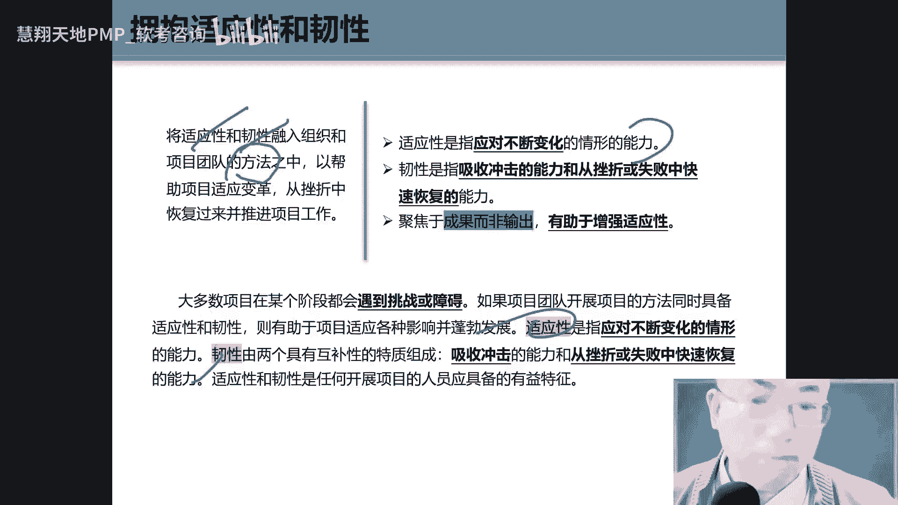

好翻过来翻过来把那句话读一下啊，第一话读一下，在56页，第一句话读一下，那个网上的小伙伴帮我扣一下页码哈，来56页，一句话读一下，说项目什么呀，这是不是像极了我们的人生吗，真的是。

小时候你还说想做科学家吗，我这有口饭吃就不错了，是不是，所以你会发现这人生我们就想起来，尤其是我们从那些小镇做点家里，你都知道你的人生很奇怪，跟不跟你的计划完全是不一样的，所以很少按替换来完成这个理解。

把这个举个例子，什么基础设施看着就可以了，好了，所以这个时候呢再次就提到一个词，他说你要从什么呀，从整体的角度来看到，水晶应该是我第几次，这是我们应该在第几次看到的，第三排右。

应该第三次看到了试运行这个整体性的第一次，第三次函数，这是什么声音啊，他说他说你就说有哪些能力是支持的，是他说哪些能力，就是说我们就是我们，因为我们要提高我们的什么呀，适应性和韧性，他说怎么来提高。

你能够提高你的适应性和韧性呢，呃从12加四五十六页，这边12个里面四个从16个，怎么提高你的适应性和韧性韧性，你们来快速找一下法，第一个就很好了，如下，怎么提高你的身心和肾性和韧性。

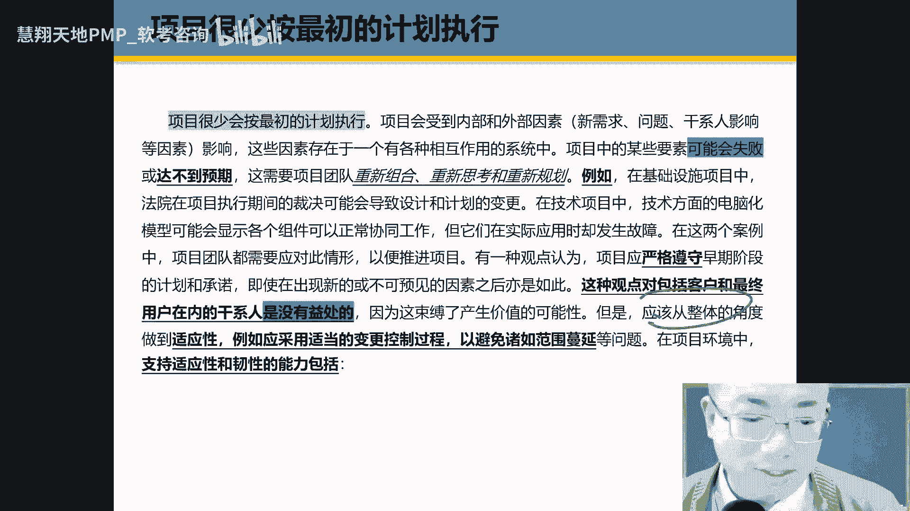

第一个是怎样较短的反馈循环快速诶，这个是哪个呀，这是这是哪个项目啊，说过这是这是什么方法呀，敏捷方法，敏捷方法就是通过不同的迭代是吧，迭代就是这样方法，还有第三个超重要来拥有什么样宽泛的技能啊。

宽泛的技能叫broad scales，这是专才还是通才啊，通才通常要成为通才，具有广博的知识，你现在有了AI之后更方便，知识都那个都用贬值了，贬值了，所以其实我们知道如果有机会的话，你们到那个漂亮国。

包括到一些欧美发达国家，你看的时候他们很多人不读研究生的，我不知道咱们国家，为什么好多人都需要读研究生，是因为找不到工作哦，我也在同业了，也是我当时学生时还不是为了学习怎样，所以就爱学习。

但是其实后来你会发现，我有包括需要很多欧美范围，我发现很多人不读，根本你不要去报下那个伊隆马斯克多，这些包括什么叫比尔盖茨，都是什么呀，大学都没有毕业，直接读到大二，大三就怎么样子就辍学了。

人家在创业了，都是这样的，所以你会发现他除非你是你说我爱搞研究啊，搞研究，你知道为什么他们不读了吗，其实它有个特点，就像西罗马斯克有啥特点，他是他是你说他学什么专业的，都不知道学什么专业的。

但有一点广博的知识，他其实做了做个新能源汽车，明儿做个SPX，其实后来做了什么那个什么什么hyper路，高速铁路，这样子不是不要接触，这不铁路啊，高速像铁路一样东西就只有网络的知识，这也是超级特工的哈。

还有小模型原型法实验得到没有啊，这个能帮我写个MVP啊，叫最小可行可行产品叫mo bio product，上网一搜全有啊，你最好从AI来搜，别再老拿毛肚了，你拿第一眼豆包都可以来查MVP。

就是我们在做敏捷项目的时候，先做一个MVP，最小化，可以最小化可行性，这点的敏敏捷项目的原型法式。

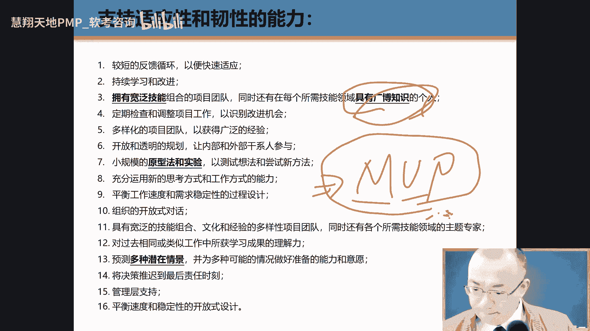

看完这个就不用多说了啊，来我们继续啊继续啊，然后这边关教师的57页，57页，好的，大家把那个第一段中的计划，看预期的成果和交互能够存得住下来，这句话我说这么多，你记住一件事，有一件事你可以看到第三行。

他说这个什么技术啊，能力的演变是非常非常快的，找到没有啊，非常非常快的，你要抓住这一机会，利用这些机会，明白吗，然后呢呃他说预期的成果而被交付，你看是哪个词。

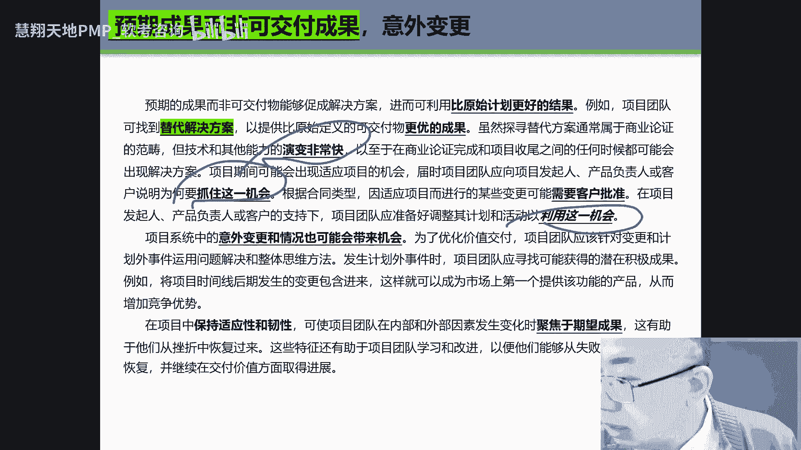

成果和交互在浅表中我们讲的是哪个呀，看大屏幕上传播而退。

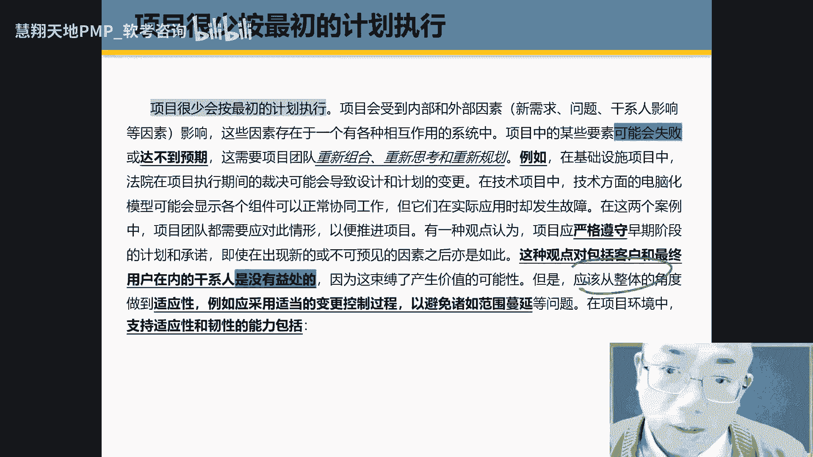

就这句话明白吗，所以这句话帮我写一个呃那个浅表，因为在前面讲的就是你要聚焦成果，而非输出成果，成果是那个叫out outcome，但坦率讲啊，就是我们的叫交付成果，其实是聚焦成果，聚焦交付成果。

成果就是outcomes，所以这个词因为翻译成中文之后造成歧义了，很多老师不对呀，老师成本不是叫什么，NO是什么叫FON什么呀，outcome rather than什么呀，DEVABLES啊。

这是有时候我这就为什么，有些小伙伴学原版英语，比学中文的时候会有有一点优势的语音。

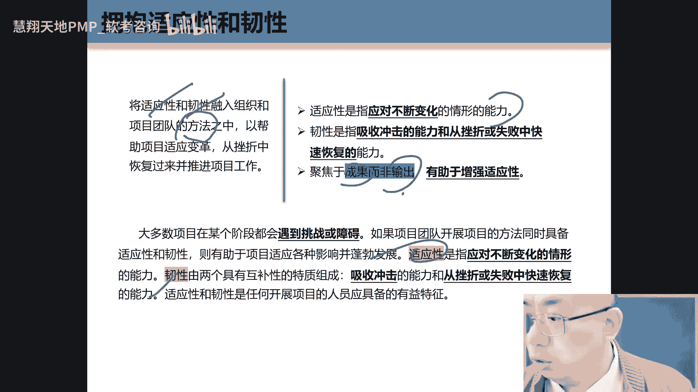

就这嗯就是你要聚焦什么东西啊。

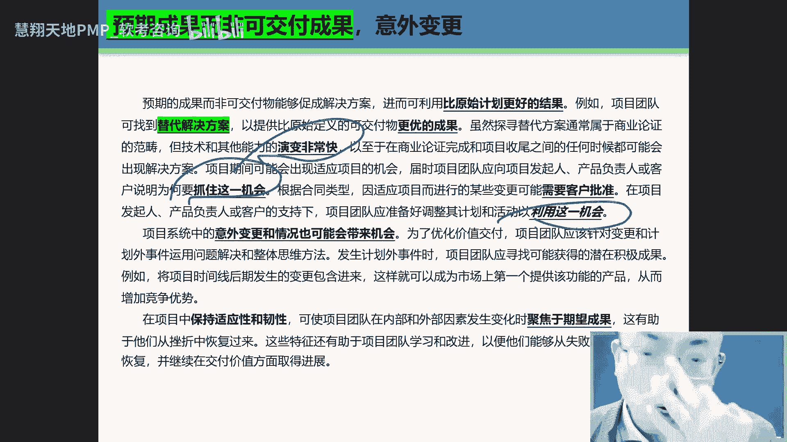

这说明你要聚焦什么东西哎，聚焦成果而非什么呀，交通DIAB，好的，看下面一段文字上，他说在倒数第二段，而这个意外变更也会带来什么呀，一些什么呀，新闻的一些机会啊，一些机会，所以我们在做项目中。

因为这一章是讲什么叫你的适应性和韧性，因为什么要适应性啊，外部环境什么样变化，你要response，你要应对，但是很多人都以为怪物变化不好，他倒不是，他说其实变化有时候有编号，有两种，一种是消极的。

这么积极的是这个意思，好了在后面那一段又再次提到过，做你要关注什么东西啊，关注预期的什么，就是你的期望的什么呀，成果这有什么好处吗，能够恢复，能够从挫折中恢复出来，就是期望的成果，就举个例子啊。

该找那个词叫desert of codesert，期望成果找那个词没有聚焦于期望成果，就这你要聚焦小红书上没有叫成这样，怎么能够恢复，就举个例子，运动员他的期望成果是干嘛，运动员得到什么冠军。

所以他就很容易去完成它，就很容易恢复出来的，我我举个最残酷的例子啊，就比如运动员在比赛过程中，一般意外受伤了，韧带拉伤了，他们会肯定不会下场，会干嘛，知道吗，打一针什么药，打一针蜂蜜，我去打蜂蜜。

对身体对身体好不好啊，肯定啊，伤神经啊，这伤你的大脑啊，那没办法，他的目标就是要得到全国得到金牌，所以他就很快的恢复他，所以你看那个，你看有时候那个滑冰我都穿成那样，我在另外爬起来打一阵风。

就在心里商量下，就这样了，他就这样空飞过来，有些人受不了，说哎呀我疼啊，那个撕心裂肺啊，有就下来了，他会因为你没有你没有什么预期的什么呀，希望你成功正好运行下就好理解好吧。

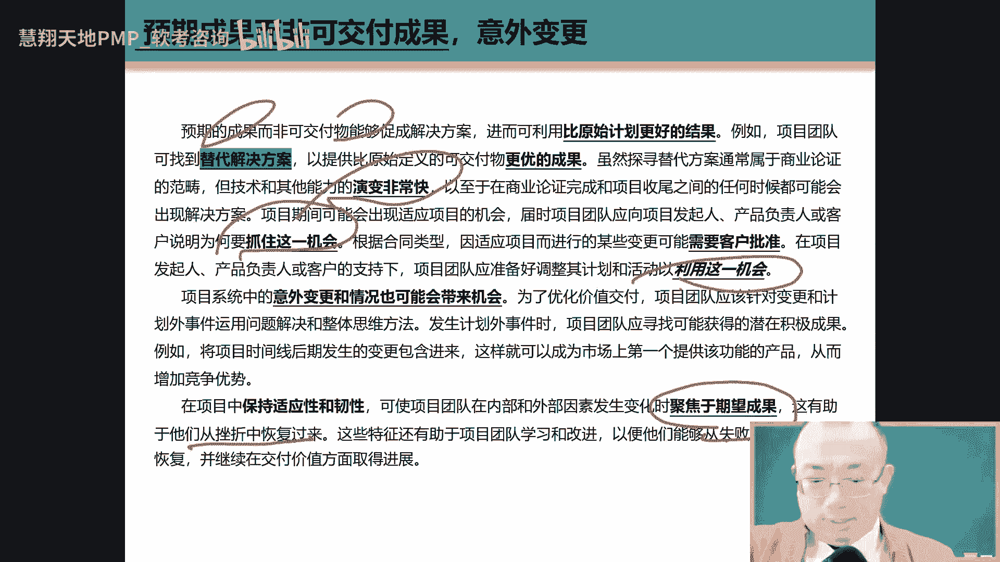

我们翻到最后一个变革，变革你们找一个核心词啊，你看核心词什么词，就这个驱动驱动，这个驱动变革是你驱动变革的目的是干嘛，知道吗，诶那个包括海南那个小叶，那个小叶那个包含了没电池了啊，想做一件事情。

哦好对好的，那我们可以看到啊，我们可以看到这个呃这个词特别重要哈，它有一个词叫做叫你more change，就是能够使变化实践做法。

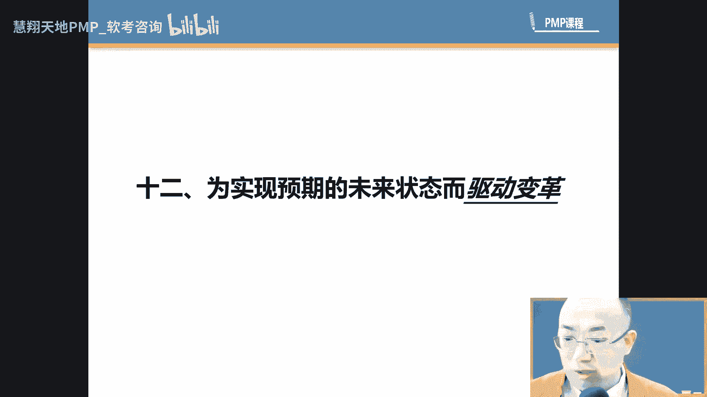

使啊是变格，这个跟谁这跟谁一起来学呀，变革跟谁呀，对适应性和什么任性来看一下，好的来我们找一下那个核心子啊，左边走左边第一个是子，嗯我，每个核心子槽用，反正这张的这个词呢，你们好好看一下这个。

反正这张稍微有点，这个好像也没有，是不是没电了还是怎么的，正好也没电了，啊这个好像也没电了，没关系，我先用这个吧，这个好像小A这也没电了，没关系啊，每一步步来，好啊，这张表中可以看到啊。

就是看到这个就这个这段文字的话，就找不太好找不太好找啊，来看一下啊，他说prepare prepare是不是prepare，就是你一定要做好什么呀，做好这也没变啊，给个好好的，我们看一下哈。

就是这个怎么样做好，怎么样做好准备好，做准备干嘛，从当前状态过渡到什么未来的，其实这个原来我们在六版中其实有讲过的，我们做项目就干嘛，从现在的状态到什么呀，未来的状态就是from current。

current到什么呀，到desire比赛做好准备好，以下的左右边有五点内容啊，啊怎么来做变革啊，这个变革我们说过第七版变革特别多，这个原则讲过变革，然后那个呃呃这个知遇讲过变革。

包括后面的这些模型方法也讲过变革啊，变革法法变革呀，哦因为人都不喜欢变革，不喜欢当好，我们看一下哈，看到第一个词，第一个词叫什么呀，结构化的方法来做变革，是有助于大家来过渡的，结构化的方法。

结构化的方法，我们学项目管理，其实很多地方都在学这种结构化的方法，还记得WBS吧，就叫work breakdown，什么呀，strategy分解结构，还有组织分解结构啊，风险分离结构。

资源分解结构都是这种结构化，包括你在做的时候破的汇报的角度，结构化先说什么呀，先说结论再说什么呀，论据OK结构化好，第二个这个变革的来源来源于哪里呀，有可能是什么呀，内部的和什么呀，外部的外部的是什么。

好了，第三个他说了enable change，也就是你想你想变革好不好变啊，不可挑战的，因为怎么样，他说了，因为不是所有的干系人都什么样都拥抱别的，他也只能翻译成拥抱，叫EBRACE，拥抱是不是，好了。

下面读一下啊，他说如果你在短时间之内怎么样，电流会导致什么呀，飘这个你就你别天瞎折腾，这也不行啊，也不行对，然后呢最后一个改动一下算什么呀，就该系参与合体的方法，是用主家参与变革，像是机密机密。

就像你在改革开放的时候，80年代改革开放的时候，真的是真就是有一个人吃到红利了，当然很多人不敢变了，很多人变了，也就是下叫下海下海下海，其实我也觉得我也挺开心，我自己原来就是我们997年的人生。

毕业之后，很多人都愿意去体制内工作，我们都愿意去下，但其实后来也感谢自己出来了，因为这个时候其实你会得到很多一些奖励，因为这时候你出来说呃，比在体制工资要高一点嘛，但是你的风险也比较大。

很多人因为体制在风险小就是这样，但其实你如果你要找出来的话，其实你的适应性和适应性是强还是弱呀，刚强啊，很多人就这样在体制里待了一辈子，然后突然就就比如体制现在不是避开裁员吗，其实事业单位也裁员。

公务员也裁员，那时候我真的是完蛋，因为你已经没有这种a debility啊，包括RESISTENCE啊，所以这样就是一分二看好我们来看一下哈，这个这一章都好好讲啊，来呃。

我们看把这个地区划的在当地的商业环境中来，其实他说的什么意思啊，他说的是应该是第二句话，就说你要对该系人做出什么做出响应，对变第二第二行对变革做出什么呀，快速响应，这看大屏幕对变革做出快速响应。

包括让组让组织做好变革的准备准备，叫放弃幻想，平平安准备什么呀，战斗啊，战斗一样，你要做好变就做好变革的准备啊，你要做快速响应等等，然后更好，可能每个人都做好变革的什么呀。

变革的推动者叫agent a级并行者，OK啊。

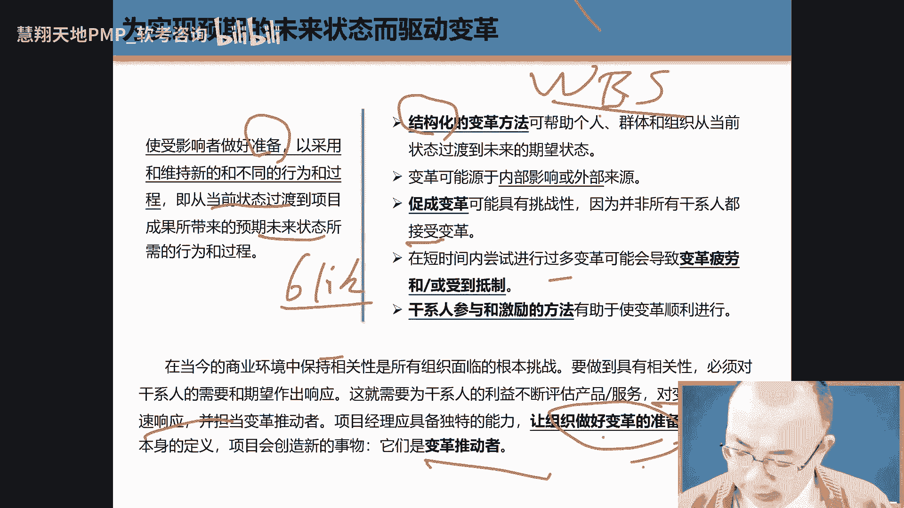

这个套有意思，然后这边有一个词啊，这个词有点难度啊，他说你为了要做好变革的话，它是一种结构或者方法，前面讲过没有，你就说你要推动这个变革，其实它是一个结构化的方法，它不是说可能是一个非结构结构结构。

然后呢是我们怎么变革呀，有当前的状态过渡到什么呀，未来的状态，就像现在你看现在我们现在笔记本电脑的，可能明年202024年，或者2025年就推出了，那叫AI电脑电脑，开开看，因为他那个新新建也更强大了。

就是在他就是本，在本机上可以部署一些大预言模型了，那时候那个真的是那时候可能再过几年，可能就可能就我们这脑子里，可能就比如植入一个芯片吧，可能就是你身上要随时要佩戴这样的一个，AI的东西。

因为因为那个时候就是个AI的世界了，AI的世界，好的我们又说了，这起码说过变得跟来自于内部，也是来自于什么啊，不，然后包括后面也特别提到过，就是说我们在59页，59页，第三个也合过的。

在组织内部推动变革是由什么充满，怎么样挑战啊，挑战那个叫challenge哈啊，你为什么有也充满挑战，因为很多是比较什么呀，保守的保守，那我为了推动变革会怎么样，第一增加沟通，然后里面增加一些激励措施。

激励措施，我觉得印象最深的原因就是，开始最开始打疫苗的时候，到时候不敢打疫苗，小学怎么打疫苗，打疫苗送鸡蛋，给激励给激励。

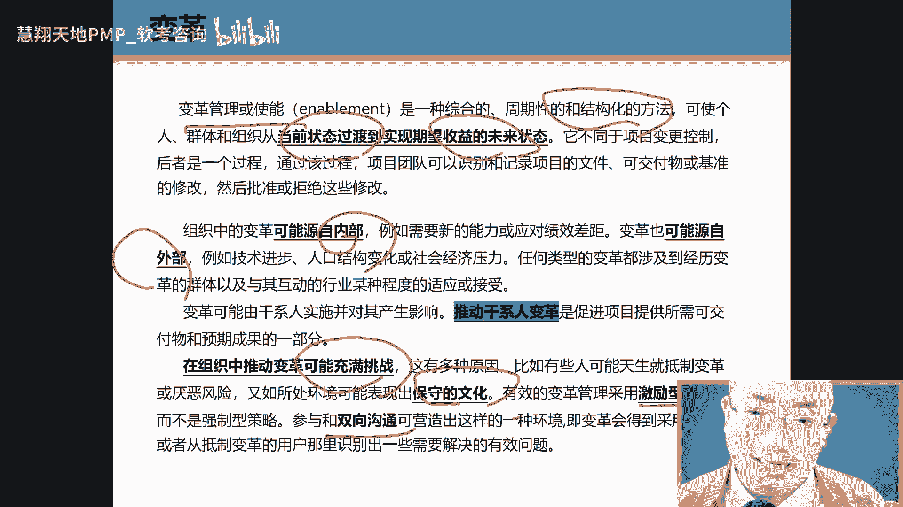

挺搞笑的好的，那这个时候呢我们会发现啊，就这一个这一张超重要啊，呃在第四段中特别提到过啊，因为一定会有人去抵制抵制甚至吸收变革，这个吸收变革这个意思就是说你让我变，我就不变啊，变成这样的啊。

其实也是一种也是一种抵制的方法，所以这个时候呢我们有一个很重要的工作来，大家把我补下来，一起读下来，在整个项目期间，第一项目之内所有城市的部分明白了吗，就是变革他不是靠一个人，是靠所有人啊。

OKOK然后后面说了，就是在短时间之内过多过多的变更，好不好啊不好，前面有人讲过了啊，最终呢也是让大家能够接受变革，接受变革，OK好吧，我们前面的标准讲完了，标准讲完该讲什么呀，他讲什么呀。

讲一个技效率最难的技巧育啊，现在时间是31分，我们就这样吧，我们就36吧，呃2。36重回价，2。30的，我们回来啊，大家透透气啊，去透透气啊，去喝点水啊。

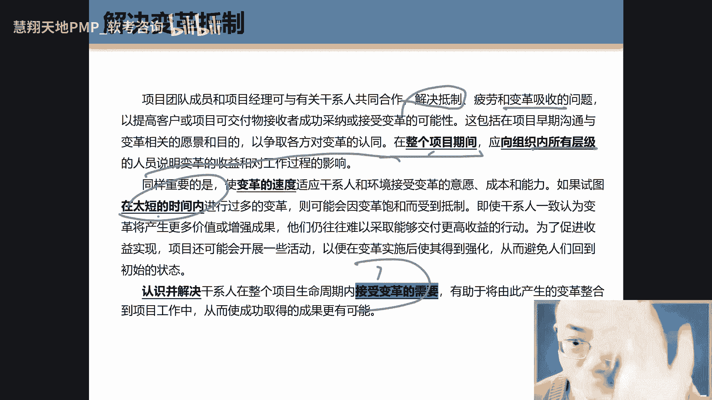

稍微休息一会都去站岗，都希望要珍惜这个珍惜这个周年休息的时间，目的是要换脑子，等会要不然八大特别多，你看看脑子脑瓜子嗡嗡的36啊，回来，大家起来休息一下，谢谢大家啊。

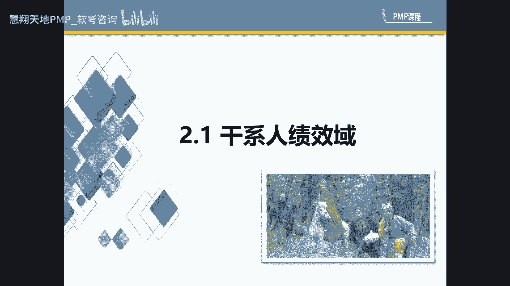