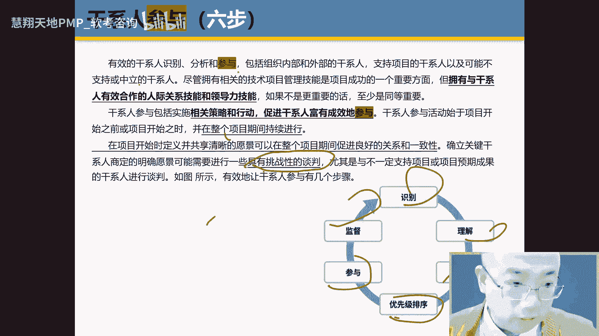
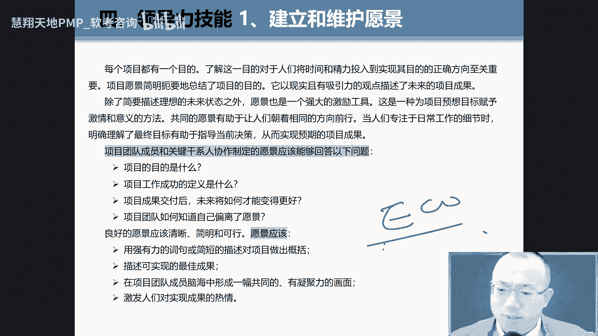

# 第七版PMBOK ｜ 最新PMP课程精讲，主题：干系人绩效域 ｜ 2024年PMP码住必学 - P1 - 慧翔天地软考 - BV1SK4y1q7kv

这本书包括两部分，前面是标准，后面是什么呀，是呢，前面是SER的，后面是什么呀，是那个呃这个这就是前面的标准standard，后面就只能该line，然后我们可以翻到看到第三页，第三页，第三页。

他说这个指南包括以下这几部分，哪几部分组以下哪几部分呢，绩效玉裁剪模型方法和功效，我们说过功效就是一些文档啊，就是一些文档不说了啊，重点部分就是看哪个绩效益发达机效率。

好我们可以看到是不是第四页来第四页，大家看第四页中有几有几个核心词看一下，比如什么叫原则，什么叫原则，什么叫绩效率，找到没有啊，哎原则是什么呀，比如基本的规范事实规范和事实，什么叫技效率啊，什么技巧。

语言行为的一些什么焦点领域行为的焦点语，找到没有嗯，就是你有哪些那些一些域，那些areas啊，那些区域这个区域主要是什么呀，这个一些行为，一些行为的一些领域行为。

这这主要是这个行为以黑or来说behavior，所以这教育它更多是一种behavior1些行为，那谁知道谁呀，原则知道绩效域，既不知道原则啊，原则即知道什么绩效率好的，我们可以看到第五页。

来网上的小伙伴帮我跟着你来走啊，跟着走来12个原则，我们刚才讲过了吧，是不是啊，来12个月的来讲，我们一起来看看那个找到找到那个第五页对吧，来说点哈，变革跟谁A申请韧性，那是一句词，然后呢系统性和谁呀。

哎系统性和什么呀，复杂性啊，他们正好一对词，还有谁呀，哎四个就是与人相关的团队干系，人是一个词，然后领导力和什么呀，管家里是一个，然后裁剪和价值是一个词，然后质量和风险对几个结束了啊。

好那就看八大绩效域怎么来找，找逻辑找逻辑哈，依然是找你看下面那个那个像圆圈一样，先找哪个词啊，我说我教过你的不确定性，找到没有啊，哎咱们不确定性啊，不确定性就on thirty。

不确定性不确定谁是对子呢，跟那个开发方法是一段词，还有非洲词，然后下面还是一对词，就是这个团队和干系人是吧，弹性是一句词啊，接下来的四个是四个字，放在一组，这样规划交付工作和测量。

我说过哪个词不要翻译成中文的，一个晚上讲过哪个词，你看啊，有规划交付工作和测量，哪个词不要翻成中文章，对了，太棒了，可以听见掌声吗，可见掌声没错，工作不要烦work，然后一翻就产生歧义了啊，规划没规划。

就是就是规划交互也很好理解啊，测量也好理解，就是那个工作，等会你等会我们学的怎么着，那那个是我在研究的过程中，包括我们很多同学的时候，就一直都是云山雾绕的，剩下的几个都没问题。

像规划是规划和测量都好一些，交互稍微有点难度，最难的是那个work都不知道说啥，不知道说啥，尤其是比较发现中文更是很神奇了，好了，来我们说一遍啊，来这个呢就是把那个八大机教育怎么来记啊。

什么来不确定性跟哪个啊，开发方法就是因为项目有不确定性，所以我们的开发方法不光有预测时，还有什么事啊，是不是最好理解不好了，然后呢团队干涉人基本讲过，有原则的讲过啊。

然后呢四个这四个呀规划规划交付work和测量，规划和测量是测量，就让我看我项目进展状况如何，正好测量它吧是吧，word交互也好说，尤其是这个work不好理解，OK好的，我们来开始我们的课程啊。

然后再输入第六页，在第六页，第六页这个上面讲过这个篇幅的指南的修改啊，就找到这一页了没有啊，修改他就说了，说了这么多，其实意思就很简单，你看到第二段，第二段说过啊，第六版是基于什么做的呀。

process再说一遍啊，第六版基于什么样process，而我们现在新版第七版基于什么样玉，再说基于什么呀，欲欲还在就是一些行为的一些行为的领域，叫一些area of behavior。

Behavior，艺术行为，艺术行为就可以了，然后呢，这边前面有讲过一个叫pmi standers之间的关系，都没有啊，你把这个我可以看一下哈，原来像我们第六版的时候，书大概有700多页。

现在变成300多页了，你是不是很开心呢，那太好了，书变少了，其实没有少，他把那些书变成剩下的部分变成电子版，放到了网上，叫PMI标准plus，比如说如果你注册会员的话。

你怎么样在你就在这个地方去看到内容，所以内容是变多，而是变少了，再加一个副词，很多了啊，是这个意思好，我们来看一下吧，我们来看看翻到书的第七页，低效率低效率，下一，呃大家可以把第七页中把第一行读下。

绩效率是什么，绩效率是什么，对了他其实就是一组相关的什么呀，活动就是一组相关的活动，这个活动用来交付销售项目，就是它是一组活动，就比如说团队就是团队团队一组活动，该行人与干涉一对一组活动啊。

与这个什么与这个规划规划一组活动，记住了吧，一组活动就来做，然后呢在第七页中倒数第二段入的倒数第二行，他说这些焦点领域不能做多，就是孤立的工作重他们他是相互重叠，相互关联对话，找到没有啊。

比如说我们这个技教育，虽然我们学的时候是单独学的，还是放在一起来学的，单独学，但是做项目怎么样，这样A是相互重叠，相互关联的，好不好理解啊，好理解啊，好理解，还有一个。

好我们说好看的是第八页呃，在讲到这个原则的时候，就浅表，但是效率不一样，有浅表还有什么样后边，而且前边后边谁更复杂呀，后边后边是这样的，看大屏幕，它最终是要把这个这个地方的内容，跟还要做对应。

所以内容要比这复杂多了多啊，所以你要记住，比如前边还有后边那背的时候，最好背后边背后边好，我们来看一下啊，这个写绩效益的时候，它定义写的比较简单，来我们找下一个左边前面的左边，读下干系人的干系人。

机效率主要是设计什么东西，记住哈，它都是涉及到活动和智能功能，但其实都是设计活动，主要看这个与干性，记住了他所有的相遇都是什么，设计活动和功能，就TP方式主要背景与什么相关的，与谁呀。

与和SOCIATED，我们知道与相关一般选用的词叫related，他这用的是associate，Associate with the stage，与干性相关的记录好了，下面3。

3点内容来走一下第一个什么呀，核心词选哪个核心词，各位小伙伴对，那就是它其实就是那样没有动词，没有动词，这没有动词，就是一个一个一个工作关系，就和干性有这样一个工作关系，他就用那个什么呀，富有成效。

就future production，production那一个工作关系，工作说不能写好，第二个什么应该选个，就说说白了干性对目标也是比较统一的，是不是啊，这个时候你要用它拉起来。

帮我做个动词来拉起live，所以我拿什么垃圾，我觉得你的目标是统一的啊，好第三个啊，该信任啊，该系是什么意思啊，就是说其实很简单，就是该死人，我希望他能够支持满意，而不希望他们怎么样不支持，不满意。

有负面影响，最好理解吧，就干脆分两类，一类是什么样支持我的啊，这是我依然认不支持我的啊，我希望那些人能够满意支持我，而不希望反对反对我说明一下好了，这边有几个定义哈，我们前面都第六版的学过了。

干系人和干系人的分析啊，干性可以自己把定义读一下，该系人是这个范围是广还是窄呀，是非常非常非常非常广啊，非常非常广，就是好了，干系人分析啊，分析我们这个时候我建议你去看第六版，第六版，第六写的更详细。

然后它里面写了一个，比如对干性定量和定性分析，尤其分析他们利益，没有吧，怎么找到词了，没有力，但这个版本写的更多，我们要根据该信任该信任的权利，利益影响是不是啊，是一个取证，最后关注什么呀，影响又大。

权又大，就是关于肝血还是肝血病，死好了，在第九节中有干系，这张这张图看到没有啊。

从从里到什么呀，昭关老外从里面的项目经理呀，项目团队到这里就PO到指导委员会啊，到供应商等啊，就是由由里到外环境解，像这里面有个角色很关键啊，像PO还有叫指导委员会。

叫student contain来投降，百度一下stering mix，这个很快你知道天气非常高，好的，因为我们在第六版的时候，第六版呃重点讲过这一章啊，所以我们内容不用太自责，而这张一好理解。

但好理解，但是做起来很难，因为他是与谁打交道啊，与人打交道，我们说过该信任管理在第六版中，第一个是干嘛呀，哪个过程来同学这个过程识别什么呀，识别相关方，所以我们说过叫阅人无数，贵人相助。

高人指路来说一遍叫什么啊，阅人无数，贵人相助，高人指路，各位小伙伴在自己20多岁的人生过程中啊，如果你要没有你没有这个能力的话，真的这辈子过得就非常的艰辛，孙悟空那么调皮捣蛋。

但是呢他又他又有谁来照顾照顾他呀，小泽小的谁啊，少得是个谁啊，观音大流出来的照，你明白你也是一样的，你要是但是画有现在很多人就是现在，因为我们知道现在年轻人都是从上学的时候，老师也不敢说。

你到了单位之后，领导也不说你的都不说你的，因为没法说呀，因为这唇里有张没有自我的状态，因为去年就不喜欢那种跌味儿，D2领导喜欢什么，就希望像朋友一样，但这个时候就随就是很多修理很多。

我们经常讲说千里马不常有，常有什么不常有啊，伯乐不常有伯乐，有你的贵人啊，贵人好的嗯，这边我们来看一下哈，嗯就是把这话记下来啊。

就这句话记下来，就把这句话叫有效的干线的识别分析和什么呀，参与这个参与这个词英文怎么说，engagement来说，engagement这个词呢我们重点去理解啊，你去导致我建议你们去用a hr查这个词。

MENT啊，它不是咱们汉语中这个词用危机，他的药意思要比那个engage意思更什么呀，更重还是更轻呢，非常重，就是我能够让你engage就很投入的很多，他比那个参与什么有引爆，那更说我是要争取你的。

我要争取你来，你来做我的项目，所以项目他有很强的谈判能力，税务问题沟通能力，有同理心的对啊，所以影片有啥意思啊，都能够分析这帮人识别参与好了，然后呢，其实我做的目的是干嘛呀。

就是能够让他们更好地参与进来，就能够促进该县富有成效的参与，这个词没有啊，这个富有成效的参与的因素叫productive来说变productive，就像你学习一样，你也得学，他也学习。

但有些人就在摸鱼啊，磨洋工，那就是UNPRODUCTION，而你呢效率非常高非常高，所有成效的，那我们就比如像原文，读研究生时候写论文的还脑瓜子嗡嗡的，尤其我们搞去写那些那个，就是那种学术论文的时候。

我觉得有时候一天看一遍论都看不完，太复杂了，因为你们的公式有多，这分析又比较复杂，现在有了AI之后，这看重是快还是慢呢，太快了，现在好多AI你看AI就有个叫scatter AI。

就是你把AI的那把那个文论文的那个PDF文档，说回这个AI，也就是也就是23分钟，AI就能分析出这个文，这个文档中有哪些核心的内容，总结分析你们俩不明白，就问答全告诉你特别快，所以按照现在速度。

我觉得现在速度至少是以前我以前学过的，至少50倍以上一天就完成付款，你先快速看五遍的一天一天我看不完啊，这是这是什么呀，富有什么呀，富有成效，productive product好了，这个好理解啊。

包括在说看到第十页啊，十页都没提到过，就说你怎么让大家能够，就是你要有，因为你要想让他参与进来，所以你要学会挑战性的成分，因为他愿不愿意跟你一起来，再会参与这个项目，不愿意的，所以你要跟他会谈判。

会谈判，那这个谈判过程是什么呀，很挑战性的，好的，这边是该系人参与的六步法哎，跟着我选的头像，第一个是什么呀，识别理解分析优先级排序，参与监督，有些词呢一目了然，有些词呢还要给你讲讲，看明白啊，几部法。

六部法，识别好不好理解，好好理解什么叫理解吗，Understand，分析也好，分析还需要分析，参与这种其实最好就是你的意见是啥意思，来我们看一下啊，那个识别就不用说了啊，识别啊。

时间来把这个理解和分析读一下，翻到书理解可以的，11页。

什么叫理解和分析来读一下哈，一旦识别干系人，代购一下，所以这个时候你读完这句话的时候，你觉得这个理解最好翻译成什么词，了解，而不是理解，你需要了解了解他们的意思感受感受，让他情绪还有信念，还有价值观。

哇塞这个词真的是，这为什么在深圳那个某位特别喜欢招农村的人，就我们的年代啊，现在因为现在现在农村户口少了，我们的年代农村户口都不多，承受很少特效教农村就那个九几年的时候，农村的。

然后是毕业那几个月考什么哈工大的呀，华科的呀，什么无理的，包括南京那个什么理工啊，哈南京理工还有什么西西电，西安电子喜欢招这些，还有一点就是呃特别喜欢家里排行老大啊，他为什么不喜欢找那个北京女子做呀。

心气太高了，你懂我意思吧，你培养说你你就跑了，或者你也要不外派，你也不去，你知道，所以最喜欢招妹几个啊，不喜欢招北京的学校啊，还有就是什么农村的孩子，这种孩子们能吃苦，明白吗，所以这种人有什么特点吗。

他的feeling，他的情绪，他的信念，他的价值观是不一样的，所以为什么当兵的人，就是军队特别不喜欢招城市兵呢，为什么呀，成为平台情绪信念，价值观跟农村孩子是不一样的。

因为很多农村孩子包括小地方还希望什么样，我通过当兵干嘛呀，改变或者什么呀，命运的明白了不明白，所以把这个号看一下，再读一遍，来了解干性人什么感受，它的非量，它的emotion系列草，这段打四个题板。

打四个P好，打四个字，Ok，包括呃呃就对这个了解完之后啊，了解完之后呢，然后立马进行分析，通过以下九点分析，这一版都讲过了，就讲过了，比如说我们希望它的群，你这个时候我们是要分析这群家影响的。

全是大的那个影响，那个Impact是大还是小的，大的态度是支持我们的，明白了吗等等，好分析完之后可以看到第12页，第12中特别提到过啊，就看那就说看到第一段，第二行就是说什么互动，因为他们通常结成联盟。

这个什么职业联盟，有助于或者说阻碍项目的实现，明白吗，因为我们在做项目，你要分析这干系人之后，你要担心他的万一形成一种联盟，他来怎么阻止我们做项目，做做项目，这是非常重要的，那么后面的一句话抄录一样。

你在这分析该系列的时候，他说分析这个工作应该有相反的什么保密，否则会被误解，因为在分析诊的时候敏不敏感呢，地上女的你就说谁跟谁是一伙的，谁跟谁是一伙的，因为有人的地方就有什么样相互。

不光是咱们中国有老外也是一样的啊，所以这种要保密啊，或者下手呃，最好呢放在你脑子里，放在肚子里，最好别写，放在电脑里，万一你我们有些小伙伴可神奇了，这个文档还居然放在他为了画面放在封面，放在第一页。

放在那个屏幕那个什么桌面上，就这么他们客户看到这是什么文档呢，我们看一下这一点，而且有些这个word文档很神奇，有些word文档文档它一点开，其中一个变别的word文档。

它会把你最近打开了三个档同时打开的，你见过这种情况没有，就是你比如我打开冰箱，打开一个word文档，他把你自己打开几档同时打开，为了方便你嘛，卧槽一下就把一些敏感性直接带出来了，当场就脸都绿了。

直接被当场被拉回去，拉回去，明白了，保密啊，保密好的，然后优先级排序咱们也讲过了，你看这第三行特别讲过要找什么呀。

权利和利益大的干系人进行优先级排序，找到没有啊，哎就这，好参与很关键，我说这个参与这个词，这个词呢翻轻啊，还是翻重的，来这个词翻了翻这个词翻清了啊，你们重点把那段文字好好看一下，就是那个什么叫参与参与。

再打五个P吧，最好看一下啊，就是什么启发他们的需求啊，管理他们的七八个来读下来，请官方新闻小马力，让国民非常多价，首先你要记住了，你不让他参与进来，他愿意参与啊，不愿意参与，很多时候什么样他有期望。

你没有什么满足，没有嘛，我原来我原来有个小伙伴，他是搞开发的，他的来的时间不久，然后这个人的个性一定要有个性，所以没敢把他是一个很好的位置，所以公司呢一般很多福利社会职位相关的，或者某个级别。

它的级别不到，他轴也不到，但是他真的水平很高，后来我让他干活，因为我在北方嘛，你经常下雪，然后呢就是呃有有两种，一种地下车库，用地面车库，地面车位还有没有车也停，然后他就属于没有车位，要去也行。

那边开车，然后很不方便，然后我为了让他跟着我干活，然后我就我就找新的坡，我就多要点地下车库，地下车库真好，暖暖和和的呃，呃夏天夏天也不烫屁股，冬天也不冻屁股，然后关键你也不用什么就着车。

因为他有一栋就是照着车半年，还有扫雪啥的，特费劲啊，特别开心，因为我知道，因为他家族里面不要开车来，所以我把德国希望解决了，所以他就很愿意参与进来明白，所以我们做项目的很多时候你要知道干这个事。

他跟他谈判，包括还有一些问题要处理等等，好了，这个搞定之后还需要什么，需要什么软件能倾听人际冲突，各位小伙伴，就是你要一定要把自己变成一个，让别人喜欢还是不喜欢的，就是从上到下。

你要你要你就看你说老师什么样才会喜欢你，看看身边你喜欢的人叫物以类聚，人以群分，他就把你看，你现在就是受欢迎的诶，你就是那么做，不错我们知道只有两种人是不需要打扮自己的，一种是极其有钱的。

像比尔盖茨那种，一种就是什么呀，就是没钱的，那我们大部分属于中间那个溜，就是中间那个中中就中不溜秋那种，一个一个打扮，就这样，你的形象更方便，不是只有这一个软件高了，你才能让别人参与进来啊。

这个是非常重要的啊，好的沟通，因为我们说过软系统中倾听沟通，所以一定会讲沟通啊，沟通这边可以看到沟通，但是商业沟通，这个咱们讲咱们第六版讲过没有啊，全都讲过，对于是拉屎不用说，包括交互式。

找到13页了没有，而是在于这个推式拉式这种交互式从几种沟通，总几种，三种推式拉式叫一对一，法官叫什么呀，小护士开会交货时什么样的推迟。

发个邮件给你啊，什么啊，自己上网去查去，OK好的，这个第14页啊，14页这边有个叫监督看一下啊。

在第14页监督中把这句话读一下，在整个项目期间，这个是什么意思，就是说第一人数就仍未发生变化，上上下下电商的权力会发生变化，越大的项目，这种权力的斗争多少啊，多像我们有时做项目嘛，有少则半个半年。

多则两年，3年多遇到过的，有些人却发生变化，我们都要关注啊，都要监督这个事，其他最低地方帮我写个词叫干系人变更呃，增加了减少了，包括权力的变化，这都是啊包括满意度啊，包括该系的满意度。

这对于调酒监控监控啊，这帮我写句话哈，这里是监督，就不是字面意义上的监督，我们有一说中文监督函数，我就监督你就oversee，不是这个意思啊，他意思是，我要去时刻关注这个该系统的一些变化啊。

比如权力的变化，人员的变化，满意度的变化是这个意思啊。

好吧，这个与其他干系人的，或者与其他技效益的相互关系。

自己看好，我们说过一道重点看什么呀，看这个后面后面A后表，我们来看一下啊，后表我们这总它有三点嘛，第一要要有什么呀，要有什么，要建立什么A什么关系啊。

富有成效的productive working relationship啊，就像我们在做狗一样，谁都希望能在一个，富有成效的工作环境中去做啊，那怎么我怎么去检查你呃，你是不是这种怎么去怎么去检查啊。

怎么去检查呀，他说可以干嘛呀，可以观察，可以观察，你们之间是不是那种富有成效的关系，明白了吗，然后第二个就是干系对目标要什么呀，保持同意啊，就是干性的目标同这种观点啊啊怎么去检查。

包括肝性什么满意还是反对，这个就看起来啊，这个都比较简单。

我们啰嗦好看，第二个团队诶，这个有发现这个金镶玉的，它的逻辑是不是很好，就把它放在一起，是不是啊，那你看我们就跟原则不放在一起啊，来团队就这个团队其实我们知道啊，再说遍哈，重点这个重点来。

你们再帮我写个ECO，什么叫ECO，还是那么各位下好吧，C诶新考纲叫examination content outline，就是考试内容大纲哇，在新考纲中35个任务中，哇塞其中有好多好多都是假的。

什么tm team这个team那个team那个明白吗，所以团队的考试内容是比较多的，好来我们结合考纲啊介绍来看。

来我们看一下这个表中来找核心词，这个技教育主要是是哪些活动和功能啊，与什么相关的，你不用看那么多，你就看那个什么，看那个with a sociate with，为什么呀，与人相关的人啊。

对于这些人有责任有有责任呀，生产产生项目交付啊，交付的人说白了就是干活的，这帮人就是能够做做项目交付，这帮人明白了吗。

就这个就这些人是people的responsible for pro produce，produce project来着好，我们看它有以下的哪些三三个点，三个点啊，这个团队有哪三个点啊，第一是什么呀。

共享走了啊，这个词这个词叫ownership份，有人把它翻译成主人翁都挺好的啊，就是主人翁意识啊，担责就是ownership，就是我自己的，还有共享的这个状态是好还是不好啊。

很好就是shared ownership，就大伙都是那种都是都是都都很担责，这个就是这个地方帮我打五个七，百打五个七，如果你知道什么打五个七吗，这个地方太重要了，因为呢在我们做项目过程中啊。

就是就是大伙一般很难达到共享的这个责任，就是共享单就担责就歇了，欧文系统，因为我们做项目的特点啊，这个责任好不好分配啊，好不好，既不好界定，也不好分配，所以更需要什么呀，owner我们有句话说。

就比如说举个例子，假如说比如说这个比如那个笔掉到中间去了，谁捡的谁都不想剪，因为这个我不在我的范围之内，中间那个范围是交叉那个位置，所以用它没有里面没有这个希尔这个责任啊，就在那好，第二个是什么呀。

就是说高绩效最好理解啊，这个在考纲中多次考高绩效团队啊，叫ho产品好，第三个图像，百度张嘴啊，读下的第三点是什么呀，所有人什么样都有leadership，还有人进行的，我们前面讲过的原则。

领导力是不是只有专属的呀，不是的，每个人都要具备理论十分的啊，理论性，尤其在这个欧美，欧美在招学，在是收这个学学术的时候，那个申请材料的时候，特别希望你是带过别人做过项目的人，所以很多人一般就是。

为什么说你知道天生就是私立学校读书嗯，比如一个学费，比如读高中的话，大概学费15万或者20万，然后读读那种美国的AP课程，然后呢，然后你还找一个就是出国的，那个叫出国留学顾问，大概少则10万。

多则40万，就就是就就不会告诉你说，你要他就是教你申请一下美国的下线，然后然后你做些什么试验，然后给你填这个文档，这样你在申请的时候有人看哦，你有这个做过这种事，这样一件活这样的项目诶。

你有这方面的leadership，明白了吗，所以这个很重要的啊，就您展示相关领导力，还有人际技能非常重要啊，好在人性当中讲的话，你把这些人际技能记下来，画个圈圈，等会重点的关，它包括了情商决策和冲突。

我们前面讲过了啊，好的啊，这几个术语哈哈，所以在这个团队中特别提到过啊，在这个团队中特别提到过，要有一定的什么文化和什么样环境里，就是说你就是在这个团队里，就是需要这样一个团队的文化和环境。

好几个地看见了项目经理，项目团队项目是这种方法，是把它画个圈圈。

自己看就可以了，好，项目管理，咱们在第六版讲过，还是读一下吧，项目管理是干嘛呀，好的呃，把这两个关注啊，关注啊，关注他，发现聚焦其实其实没有必要吧，搞得不一样，英文中就是两个，一个叫管理活动区。

还有还有什么领导力活动，关注什么，一个是观众具体的一些手段，也是关注人，关注人两个分子啊啊这folks啊，这folks先我们要关注人啊，所以你要影响激励倾听等等好了，这边讲过两种领导力，一种是集中式的。

一种是什么呀，就是这种去中就是分布式的去中心化的啊，那我们知道敏捷项目白是哪种呢，A分布式分布式的集中式做的很好理解，因为在咱们国家是不是集中式的中央提前室，中央电视，这大家好理解好的。

然后这个分布式什么分布式什么呃，你可以看到第呃，在分布式中特别提到过这个第二行啊，项目团队通常会通过什么来完成项目啊，四组织来说变self organize，其实还有两个字叫自组织和自管理。

叫SORGANIZER和sa manage manager，Some comments of a self ver managed to nation，超重的放下来，自己是汉语叫自我管理。

而且不会只不会只看项目经营利润啊。

所以这边不提到过叫服务性，叫一个叫服务型领导，这个词翻译的确实挺失败的，为什么这么说呢，因为我知道这是在，因为这个词是来自于敏捷项目，因为米项目都记得我叫普瑞士领导，那个surface的意思不认识。

但这个仆人可不是咱们中国的仆人啊，因为在西方中西方中谁是仆人呢，上帝的仆人明白吗，所以很多人说或者是用这网，不是你才是，因为这个词是195几年有一个人提出来的，他就说我就说人家是普世的领导力。

像对待这个上帝一样对待大家，就是他是非常发达，什么呀，发自肺腑肺腑，这一说越老越老深了，他提到一种宗教了是吧，宗教咱们是不是宗教，但现在宗教有什么特点吗，本来心理机构还有什么有什么特点吗。

这酒瓶就像我原来在欧洲的时候，我身边的小伙伴他们都懂，都是信托周礼或者要去礼拜，都是要去，比如对于周末要去礼拜，然后吃饭的时候要感谢上帝，所以他们会比较什么呀虔诚，然后比较真诚。

因为他们觉得我们都是上帝的，都上映出的，我们我们不信，所以我们有的时候你懂的啊，咱们不能再说了，说就说远了，所以你要记住了啊，就这一点这个词非常重要啊，叫古人生的导力啊，好了这个呢你要重点关注这个。

一旦你用了这种，就是就是就是你假如你是对，大家是否认是领导力的时候，你就会非常在乎这几件事，第一大伙是不是有成长，你假如说你在公司里你没法做或者是领导力。

但是中国的父母绝对是servant parents，这能理解吧，宝贝想吃啥，宝贝你想买点啥，哇塞就什么都是那个江湖，真的是托人，是领导的明白，所以这个时候呢，你把那个标配的部分来关注一下哈，读一下呗。

读读那个黑的部分观众是否成长，服务器那边啊，这就因为一代是就是因为这是个好词啊，现在越来越强调，有一些对你零后更适合，这不是领导力，就是就是官道，是不是成长是不健康，然后什么服务最大是很服务的。

所以这个时候如果你想做到这个普丁的话，你就需要18页这几件事，一件事第一消除什么呀，上来就在一次讲过，避免分清国内和发展机会啊，什么叫消除障碍还是图像，什么要消除障碍，就这个。

因为我们知道项目中有没有障碍啊，有的是障碍，所以明目这干嘛呀，就把这个障碍清除掉，这样的项目带来价值，所以你会发现你像孙悟空一样，完成各种障碍就去掉了，好避免分心啊，避免分析什么，避免分心。

来读一下这个分析，新代表会怎么样，团队怎么样，免受内部是不是外部这些分析师是项目团队，什么偏离当前目标，比如说给大家更好的观专注，就举个例子好了，就说你比如说假如孩子要要中考或高考的时候。

父母就说你两耳不问什么呀，创业事一直都是声援书，你就把这个你把书读好就行，那我们做下面这样就是别的事，你不用担心，我来帮你搞定，就比如说你孩子学习不好，我得找个老师，你老公没工作，我你老婆找个工作。

你父母身体健康，生病了，我去找个大夫帮你搞定，你就把自己带，你把什么样项目工作好就行，是不是啊，诶你们见过这种项目都没有没见过，我是见过的哈，就是那种就是比较敏敏的项目，懂了吧。

比较敏敏的项目是秘密的项目，然后呢，高科技项目那里面都是些都是受保护的专家，但为了让他们干嘛呀，避免分歧，就就像那个就像我们看过那个电影，就是奥本海默是不是一些搞核弹的专家，就在那个西部是吧。

那个美国的中西部是不是要搞核弹，其实很多时候他就把把那个家属搞过去了，就是你们好弄好好生活，然后呢专家好好搞原子弹就可以了，明白吗，避免分析后勤，我帮大家搞，你就这个意思啊，就这样的话能够团队保持关注。

这样没有就能够c focus，这点是非常重要的，但是换个说会的，你每天玩个某音某手的话，你能专心吗，等过会儿你刚开会等5分钟，是不是啊，所以你这时候你完全就不能专心了啊，不能专心了好了。

第三个我们还要干嘛呀，就是第一帮你消除这个项目障碍，第二避免你分心，我后勤问题解决了，那第三个没呀，给鼓励你，还给你发展机会啊，这也是非常重要的，奖励他们，鼓励他们，认可他们，这也是非常重要啊，好了。

第三个叫什么团队，团队发展的共同方面啊，这个看上去就是。

我们在带领带领这个团队的时候，是为了带领这个团队的时候，那我要做哪几件事来做这件事，就来帮我赌下D怎么样愿景和什么目标，角色制作运作指导和成长，这个都是没问题的，就是那个团队运作上比较辛苦啊。

比如现在看成长，把这个灰色部分录一下来，个人可能是什么什么，我们说过，在项目组都希望有专才变通才是这样，所以就是他需要成长，所以项目给了一些帮助指导，就在这里好一点，什么样的团队，项目团队的运作。

来读一下什么样的运作，其实他讲的这个词叫那个叫operation to operate，这个词呢因为比较泛，所以你不知道什么意思，其实里面的内容特别好理解，看好的意思，没沟通，解决问题达成共识。

哇塞同志们，这是像极了那个像极了哪个项目管理工具呀，引导引导不就是干嘛呀，让你参与进来沟通聆听讨论，最终大小怎么样，共识，这是一个很好的团队，就是团队的一个很好的团队运作，就是沟通，解决问题，达成共识。

打五个批吧，打5T，还是那句话哈，你听这个项目管理偏僻，你是要一定要听的，就是那个人原版学过的人，才能有可能把你们的一些核心讲完，否则真的是就是就是一个走过场，好多没听到的。

像那个operation这个词，很多人说我不看我，我也不知道啥意思，我是问老外，老外不知道什么叫operation，因为那时候翻译翻译的词叫运营，是不是这段其实他讲的意思。

所以为什么有时候有些词你听你看过，人家看它的定义啊，定义好，的。

好团队的文化，这好理解啊，好理解，我们希望团队是什么文化的，翻到书的第20页，来把声音录下，没有透明，诚信尊重，积极讨论知识，勇气庆祝什么，尤其那个经常考那个庆祝啊，庆祝生活要有什么呀，哎要有仪式感啊。

仪式感一定要有仪式庆祝，这是非常重要的，记住啊，呃像这个这段话也比较透明的场景，在你印象中特别多啊，报名的支持哈确实好，我们看下高级项在浅表中讲过高绩效没有讲过。

没有讲过了，第二个第一个叫什么叫共享吗，共享职责，第二种高绩效团队啊，你再帮我写个浅表吧，前面讲过的啊，前面讲过了，前面讲过了，好的那高绩效团队有以下的特点，以下的九个特点来读一下哪几个特点，对高级啊。

三倍啊，这在这方形ECO啊，呃在新考纲中关于高绩效团队考点很多慎入，ECO在那个考点，这个叫大纲考纲要ECO中，我们去看就是高效反对以下的九点，你们看完之后，你跟哪个词对你触动比较大，如果我的第一个词。

你对我触动比较大，要怎么样，这叫开箱部分的沟通，就是open open的沟通，但我们知道都在说，你要是你是一个很传统的中国人，会发现，其实咱们中国人说话一般都是比较神秘的，是open还是不open的。

很open，就是那很含蓄的，就是爸就是一看先看这人跟我关系咋样，能不说就不说闽南亚搞关系搞僵了，是不是关系好的时候，我还得凑一下词，我还就叫指标措辞嘛，就choice of words，就是词选。

别伤害他，就这样子，是这样的，所以这种一般不会去说的，这就导致其实在做项目其实很多麻烦，因为项目是需要什么样，我预测的项目特别需要透明公开的沟通啊，然后什么呀，共识叫斜and standing。

毫不达成共识啊，很难达成共识，还有责任，还有系列的trust，写作战是一人已经讲过了赋能啊，赋能什么叫赋能，来读一下这个词真的是很容易产生歧义的，来什么叫负能叫in power来读。

为什么叫empower，干嘛读一下你是干嘛，是你该读一下，他的感觉怎么样，有权在做，所以这个时候他翻译成不能，其实准确翻译成什么呀，授权其实不怪他，因为在咱们生活中。

大家把那个音power delegate已经完全混了，混了已经混了，所以他唱这个词，有时候我们在看的英文原子时候，我们也不知道怎么翻，所以为了防止翻错的慢，一定要去看他的原因，那我们知道在我们生活中。

我们一般授权用的词delegate，授权嘛，来顺便DIGDDIES翻译赋能，什么叫赋能吗，你不是这个能力不是不够吗，我找人教你提高你的个人技能，要什么赋能赋能什么意思啊，所以现在也不会像现在我们生活中。

这种词挺多的，就是就是已经就是鱼鳞缩成了，但这个一听完这个解释之后，这一要记住他，这不是宋老师10年受挫，就你有权利干活吗，那可不是赋能，完全符合这个意思啊，认可认可，现在孩子是不缺人才。

不缺工科好的领导力的技能啊，有这个是来了啊，总共有以下这几点，1234啊，1234啊，来我们来快速看一下啊，12345找到没有，23页，这地方依然帮我写ECORECO什么意思吗，考试有没有啊。

有的有的ECO很多，看那个银行表都有那个卡瓦拉b co，好的第一考虑，因为这个地方在写一个晚讲过，就是一旦做完了项目经理之后，你第一个能具备什么能力建立和什么呀，建立在怎么样唉，建立什么样建立维护面子。

这个好理解，这里面就看就可以了啊，第二个这是第一期版新增的叫做批判性思维。

批判思维这个东西呢，我强烈建议你去拿那个拿那个确认DVD和AI，去查这个词，啥意思啊，很多人包括我本人在内，我们在学这个课的时候，一说批判性思维好像要批判谁，就是你的，只要你的观点，我要反驳你。

这叫批判思维，其实不是的，批判思维在干嘛，知道吗，呃你看啊这里面也很好，他说你看啊，就是你们可以看到第二行，他说批判性思维，包括什么来读一下，包括什么呀，训练有素，来读下来，来那个豪哥拿麦克风也读。

大家都跟你一起读，来来，训练有素和物理性遵从逻辑，基于证据思维还是蛮开放，然后他去他需要具备开放的思维好的，所以他现在开始讲的时候，他叫什么叫认知的认知，所以你听完之后，其实P8S讲的什么东西啊。

就是你在讲你在分析一个问题的时候，你的思维逻辑是要基于什么呀，理性分析，基于理性，理性逻辑啊，基于理性逻辑，逻辑想象，基于证据的分析等等，明白了吗，这清楚了吗，就是你要基于一种推导逻辑数据。

而不是什么呀，所以这个是编客观偏主观哎对了，所以这个时候你要你这么明白了，你看第一行能够识别偏见，找到根本原因，但是非常遗憾的是，是是我们身边，包括以前我们的学习方式都是什么呀，就是很多时候偏主观。

而没有基于什么呀，逻辑，这能理解的吗，理解比如我们知道，其实咱们国家的话就不用说了，就几千五千多年其实还是很牛掰的，但这个牛掰基于什么，什么时候最牛掰啊，就比如说唐朝的时候是吧，科技很发达。

经济很发达等等，但后来慢慢就不怎么太发达，尤其是一七几几年，一八几几年的时候，我们还搞清朝的时候，人家一开始干嘛呀，就是开始就是尤其是那个欧洲还是干嘛呀，工业革命哇塞，所以那个年代就是咱们现在国家。

基本上也就像清华，现在这几所学校在上大学的时候，老师给你讲什么呀，原版的微积分，原版的数列，是不是，如果你要是拿原版的学习这些数学和物理的，数学物理的时候，你才能基本上打通跟那些什么。

那些也就一星几年那帮人的那些思维的东西，我们很多时候是没有没有这种知识，所以我们在学的时候很很难做到说什么，什么推理呀，分析啊，数据啊，明白意思吧，所以逻辑是非常重要的。

这一块这个东西真的是也不是一天两天，所以这个是超级重要的啊，这是各位小伙伴啊，以后你在教你自己的时候，教孩子的时候尽可能的要用到批判思维，但是这个词我是强烈推荐用中文去理解，用一说批判性思维是干嘛呀。

批判尤其尤其是批判他不是的，他是干嘛的呀，就是我要找根本原因防止偏见，那怎么防止偏见呀，就是理性逻辑证据数据懂我意思吧，你去你去看那个，你拿那个AI去查那个数据。

比如说what is definition of the christian，他讲的BT就这个意思，就这个意思明白了吗，这个我说清楚了吗，说清楚举手，OK啊，因为总有人跟我说，老师批判素不是批判他吗。

哇塞你是不是搞运动搞多了呀，不是这个意思，他意思就是你要基于理性逻辑数据的分析啊，这个是非常重要的重要的，所以在任何一个国家就是科技要发达地，需要很好的哲学哲学，还有科技物理数学物理数学这些。

大家用他的推导都是严格的推导来说，推导来做啊，这个是非常重要的啊，好的，他说消防人员可以用逻辑思维，进行以下的八点啊，八点这个考不考不好说，但是呢真的是对，以后你在做任何项目和管理，对你有帮助。

包括这边我用蓝色标识都提到过，叫思考之上的思考，认知之上的认知能找到这个词了没有啊，为什么要批判思维啊，他用思维的思维，认知的认知就比思维和认知怎么样还要高一级，高一级就在思考，我教你思考。

思考就更高了，所以为什么说在西方中有人将哲学特别厉害，哲学哲学我们知道，其实哲学真的是我们在咱们国内，哲学大家懂的都已经都变成变成那个意思了啊，在西方中，真正你知道这些牛人都一般都好，都是学哲学的啊。

学哲学他就是靠它是什么帮你去思考的思考，它甚至比数学物理还要牛逼，为什么呀，他是教你思考的思考思考的思考，更有一些空中体操好的，这点是非常重要的，所以很多一些重要院校一定要出思想思想家。

但是现在没有了版权没有啊，所以大家一定要注意啊，非常重要，所以回家把这个阅读好看一下，我建议你这段强烈的满满读，它是基于一种基于一种数据的推导逻辑，基于证据的数据的推导逻辑啊，这点是非常重要的。

有什么就归纳呀，什么归纳归纳和类比啊，什么之类的分析啊什么的，就好好看一下啊，呃这帮我写一句话啊，非字面式批判啊，在这边写个什么呀，对非字面式批判，因为很多人问我，我刚才挺天还没这个意思。

就是大家表现约定素质呢有批判思维啊，批判其实不是的，跟那个环境不利，所以为什么说现在就说，所以你要教你的孩子，希望他能够就是他是一个思想独立的孩子，就是善于提问的孩子，一般都有。

他就可以把第二成什么批判性思维，The christina，还要基于数据来分析，基于数据数据逻辑啊，来去分析好的激励好题哇，重点重点哈，打五个T吧，呃我们知道其实做项目的时候，你要培养你的领导。

就特别需要，你是很会激励别人的。

是不是啊，K以下的激励内在机理啊，我们知道外在机力满足什么经典病在前啊，全在，但内在其实更重要啊，内在以下的九点内容都没你们找你，你能找到一个自己的你们喜欢的内容吗，就是那个这种立在地里。

这个叫twit twit，你觉得哪个比较不错，就像有一个词蛮好的，Belief，belief信念，好像这个词信念你可以问一下什么叫信念，比如举个例子啊，就比如说你看那个就是过去那个那个革命党人。

那被被折磨就折磨成，那就真的是毫无人性折磨，他为什么还不会不会出卖啊，他为什么他会觉他是有信念的啊，比例我们做项目也是一样，有信念的人，尤其是做一些比较难的事，有的人他都有，你要没有信念。

你根本坚持不下去做项目信念嗯，还有改编的现状，make difference这个很关键的，make difference就烦死，还有自主权，自我指导，个人成长向挑战一个中央和挑战挑战。

我们知道人有很多人都不愿意接受挑战，但是我们知道做项目可以善于什么，挑战自我，挑战自我等等，好人际关系，它包括以下这几点啊。

人际关系我们可以先看一下这边的人际关系，这嗯找一下哈，人际关系啊，问题85页，把这个三个找你没找到没有，他说看第一行和第一行25页，而在项目中经常使用的人际关系包哪三个，情商决策和重度啊，坦率的讲。

我们诶我们第六版学过哪个呃，第六晚上取得更多的是那个称呼，情商和曲子稍微少一点啊，咱们看一下，他就讲的是三个哈，跟这个跟我们以前第六版人，记得还有点不一样啊，他是属于比较。

尤其两个情商和那个角色是比较新的啊，情商啊，情商呃。

你把它定义一下，什么叫请上，呃他首先是其实呃是呃，呃识别和控制自己和他人诶，你们觉得哪个更难吗，他人啊，那他人就不能控制别人情绪情绪，所以这边有几个词哈，你看有自我意识，自我管理，社交意识。

社交技能这块，我建议你们上网就得看，因为这块写的内容比较少，比较少，你可以把它关注一下，去好好看，去找找那个课外侧，因为现在有了有了AI之后，我告诉你比书看书还过瘾，但有点辛苦，你要看大量的内容啊。

去看大量内容，然后，呃这几个词你可以看一下啊，呃有两个是self，有两个是什么呀，Social self，比如自我意识啊，自我管理啊，社交意识啊，社交技能啊，我是强烈建议让你通过AI去查那个数据啊。

去查，如果你要有呃有趣的疾病，有效的疾病如美切可以用什么，用这个文心眼或者豆包茶都可以啊，去查里面词好词什么意思，但我建议大家用这笔去查，然后你在写那个提示词的时候，你说你是一个pm bok的专家。

或者你是个pm的编委作者，你能帮我解释一下，这个自我意识和自我管理的区别，或者自我意识定义自我意，哇塞讲的很好啊，超好看超好，可爽了可爽，做一首，包括你看那个社交技能啊，社交技能。

你们都在建立融洽的关系和管理团队啊，什么管理态度什么之类的，社交技能，包括社交意识到区别在哪，只要找区别啊，你去打AI查区别明白吗。

区别比如说social onance和social scale的区别在哪里，一个更具体，你们觉得会怎么，social awareness和social skill是更具体一点。

scale scale更具体嘛，就具体意识意识是要难一点，像那个词啊，我的意思，这个词其实在英文的解释，其实也挺也挺不好解释的，也挺不好解释的，因为有的时候你们去看，不要光看字面意思。

你要看他具体的内容啊，具体内容比如说自我意识，你看那个初中26页，什么叫自我意识，就是自我评估包含什么呀，我的什么呀，情绪目标，什么优势，劣势和劣势，但他这个时候你会发现。

它跟这个坐标轴中的那个D又不一样了，你们看到没有，你看你看热门，就是你把你影响什么团队，什么团队怎么影响，你，这跟这个定义是不是有点不一样了，有点不一样了，这是到目前为止考试还没还很少碰到。

但是呢在工作中其实用的挺多的，好情商。

情商后面还有地方还有又讲了一下情商的啊，关注一下啊，好了，这边我们来看一下情商，讲完情商之后就开始讲决策，决策，看到27，我们在第六版中其实讲的过决策，这种学生容易有六步法，怎么来做决策的包型。

六六百六百六百有讲到过呃，他这边的角色其实很好理解啊，比如说28页，28页呃，比如说去找第二段呃，比如说第一行是谁来做决策，现在做决策，项目经理单方面做决策，第二是做什么决策呀，群体决策好理解吧。

就是投票啊什么之类的啊，包括第三个发散和汇聚模式，这什么叫发散汇聚模式，diverse和conversion，这就有点类似，咱们我们以前学过的，就咱们平时说的那种，一般是什么，先集中还是先比毒啊。

这还不知道这等咱们经常说的嘛，在集中，说白了你们先讨论，反正讨论我也不听你啊，这我说了算是不是啊，所以大家现在民众在集中啊，这是其中好了呃，这个都还没问题啊，包括说这样做有什么好处，什么叫多元化的知识。

重点看了一下宽带得而非啊换了多少，判多少费用，其实宽带多少分，你们会自己去查一下啊，其实他你看他说的宽带，这个非估算和举手模式导致的方面，都采用了什么模式啊，发散和汇聚模式，德尔菲是什么意思啊。

就是原来我们在讲第六版讲过的，他的他是来自一个神话故事，就说我想知道宇宙的中心在哪里，但是呢由于神话故事吧，我也不知道，但在神话故事中，谁对地理方位是哪种动物，哪种动物，哪种哪种鸟对。

是那个低有的那个方位比较熟啊，鸽子，然后呢我就我我怕这两个鸽子串供怎么样，我把他们蒙上眼睛，然后我也我也不允许这样一个鸽子说话啊，我这样子你们哪儿呢，去飞，你飞，帮我找那个宇宙的中心在哪里啊。

这两个鸽子突然就飞，很神奇的是两个C在同一个地点，那个地点就是德尔菲，他就在那就是宇宙的东西，你明白吗，但其实呢这个讲的是一个神话的故事，它的实际是什么意思，就是说就是我们把谁比的鸽子呀，就是那些专家。

就那些SM专家说我们要解决一个问题，这样吧，你说你说你说但你们俩之间有没有串供啊，没有讨论的，然后最后你们就我们达成一致了，懂我意思了吧，这就是就是德尔菲法啊，德尔菲法，这就是类似于一种模式。

叫发散什么呀，发散汇聚的模式，这个上网一搜一搜都有啊，都有的，淘宝不知道，但是呢挺常用常用，包括后面什么备案，备什么备选方案分析，当然有啦，你在做题的时候考不考虑备选方案呢。

当然考研考一个备胎是不是好的呃，我们说过哈，这个领导力包括什么呃，这什么什么情商啊，决策还有冲突，冲突我们讲过没有啊，讲过程在，所以就来帮我写个第六版，在29年那帮我写个600，因为这个是考试。

每次必考的，就是一般他会说有这样的一个场景，你该用什么方式来解决，或者说有这样，他们正在用一种方式来处理这个冲突，请问他们用的是哪一种冲突的方法，我们说有哪种输出方法呀，比如说我们最喜欢什么双赢。

叫什么双赢啊，就是共同面对解决，这是双赢，但是我们东方人比较喜欢什么样，为什么呀，就是嗯也不叫和稀泥。

叫做拖鞋，有各让一步。

但西方认为是什么意思啊，妥协好不好不好，他认为妥协是干嘛呀，稍许还有什么强势，还有什么退出，还有方法就看不到问题解决了没有，没有好的，就把它好好看一下啊，这个不复杂。

怎么开诚布公啊，去教育问题啊，好这个领导力的风格。

这帮我写的第六版六版都讲过，在六版的前三章中重点一下，写个600，比如说我们说有哪些意大利风格呀，命令式的，放任式的，还有交易式的等等，好了，这个时候一定要结合，比如说项目我们特别提到过。

就是这种分布式项目管理，重点重点打三个批的分布式项目研制，对包括项目团队成员的成熟度，假如这个同学并不成熟，一般用什么项目项目领导风格呀，命令式的，如果在塔克塔克曼模型中就谈恋爱。

大一进入那种进入那种绩效时，大伙都可以产生绩效，一般授权是授权，是授权时好了。

这个后边呢自己看看就可以了，这样就可以了，三个这三个组件怎么定共享怎么共享了，责任要高绩效的团队，然后都要标记领导力的技能，当。

好这个呢开发方法的记住，这跟谁一起来看，这跟谁一起来看，变革变革就因为现在的项目变更多还是少啊，多就是模糊又又变革又模糊，因为当今这是一个什么时代啊，乌卡时代，所以这个时候的开发方法。

都不能完全脱离原来的，你用原来我们这边是什么方法呀，叫预测是学校怎么样，瀑布式这道题是什么啊，敏捷式啊，什么适应式啊什么之类的，好吧，是这样的，因为这一章内容等会会讲的比较多，而且都是偏软件开发类的。

所以有些小伙伴学的比较痛苦啊，我们休息一会儿，现在时间是3。40，我们3。51吧，3。50准时回来来抽一下，OK多起来透透气啊，透透气啊，啊森林，我是你粉的，快去活动活动就活动活动啊，要不等会你们脑子。

谢谢大家啊。