# 精品课程丨清晖-华为 PM研学营 HCSA-PM - P1：课程试听-团队领导 项目经理角色模型 - 清晖在线学堂 - BV1QN4y1m7F7

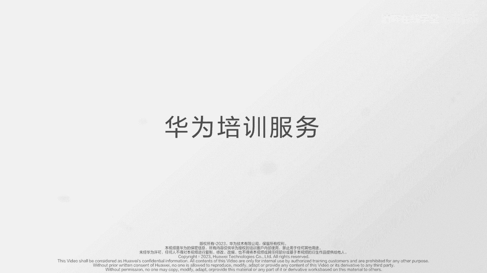

各位同学大家好，我是华为全球培训中心的高级讲师，我叫刘世成，欢迎大家来参加华为项目管理能力，认证课程的学习，在本章课程开始前，我们先回顾一下华为项目管理H5M能力模型，它包括使命必达的信念力。

团队领导的领导力，步步为营的执行力，保驾护航的治理力和价值为先的驱动力，其中领导力这一模块，旨在培养项目经理的个人领导力，创新力等，通过对项目团队成员和项目环境施加影响，以实现项目目标。

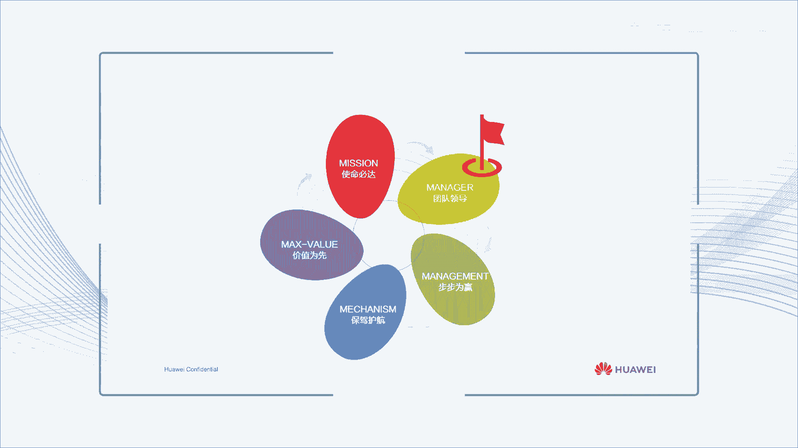

下面我们将通过团队领导这门课程，对项目经理领导力进行讲解，明确项目经理，我是谁，我的角色定位和关键职责是什么。

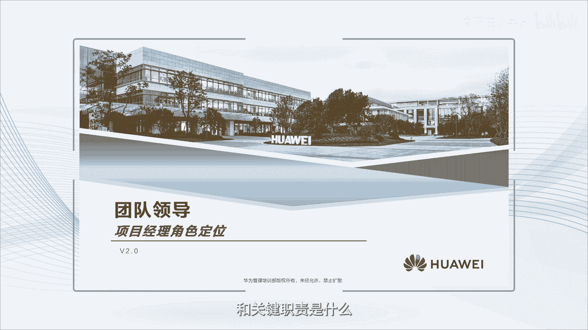

本章课程有两个内容，项目经理角色定位和项目经理角色职责，我们将分为两节课进行讲解，今天是第一节，项目经理角色定位，通过本节课程的学习，我们希望大家能够理解项目经理的决策模型，项目经理的角色应该是什么。

他应该是一条航船的船长，在责任上与船员是不一样的，船员做好本职工作，只对自己的工作负责，关注的是局部，而船长则责任重大，他要带领团队达到航行的最终目标，关注的是整体，对船上所有问题负责并承担责任。

例如1912年，英国最庞大最豪华的邮轮泰坦尼克号，因装进冰山沉没，造成1500多人上升，不管事故的原因是什么，船长都是第一责任人，从船员到船长，从员工到管理者这个角色的转变，需要大家在工作理念。

领导技能和时间管理上发生改变，在工作理念上，船长主要是通过他人完成工作，要敢于担责，关注事，更要关注人，不仅要关注船员的工作质量，更要关注船员的心理状态，重视团队和团队成员的成功和成长，在领导技能上。

船长不仅要设计和分派任务，还要给成员赋能指导，做好绩效监督，沟通和反馈，营造良好团队氛围，在时间管理上，船长不仅要花时间在计划，设定任务跟进和问题解决上，还要花时间在团队管理，团队建设和船员技能提升上。

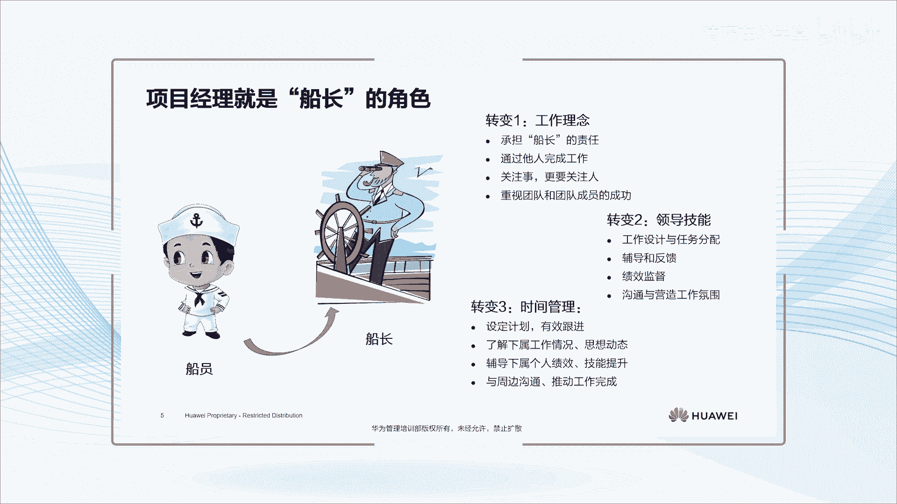

项目经理这个角色需要有角色模型，他是对项目经理角色的定位和关键职责的描述，体现局势的工作，职责与职责相对应的权利义务和行为，以及组织对角色的期望的，角色模型设计需要匹配组织战略和业务环境。

才能确保组织各角色之间相互协同合作，共同达成组织目标，项目经理要清晰自己的角色模型，明确自己的定位和职责，避免局势错位和趣味，所谓错位就是离开应有的角色和位置，做了不该做的，如项目经理因时间紧迫。

自己去制定项目解决方案，项目经理月前审批费用的都是错位，而缺位就是该承担的职责和义务缺失，该做的做的不够，比如项目经理只关注自己的工作，而忽略了对整体团队的管理，或者只关注业务目标。

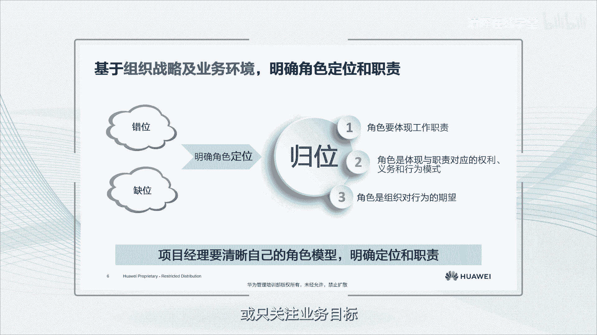

而忽略团队氛围建设的，以华为研发项目经理为例，我们对他的角色定位包括，第一研发项目经理，是产品集成开发流程有效运作的支撑者，是华为公司产品与解决方案竞争力的构建者，第二研发项目经理。

要提升端到端的事业和协同能力，是行业技术和未来产业的洞察者，是站在全局视角的问题发现和解决者，第三研发项目经理是华为公司基层组织，也就是研发项目作战效率的提升者，是公司组织架构和末端组织的优化者。

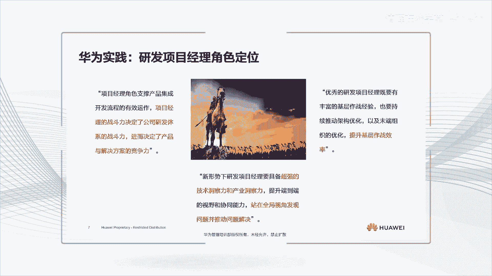

项目经理的角色模型，可以从其具体的工作职责中提炼出来，下列工作，一支持客户经理拿合同，二制定项目目标和策略，三主持项目开工会，四获取资源，组建项目团队，五制定计划，监控进度，及时纠偏，六管控项目文件。

七管理客户满意度，八控制风险，保障项目盈利，九管理分包商和施工质量，十建立项目流程和运作机制，以上都是项目经理的工作职责，只是有些是自己做，有些事委托或授权给团队成员做，比如管控项目文件。

可以委托给项目文档经理承担，但是授权不授责。

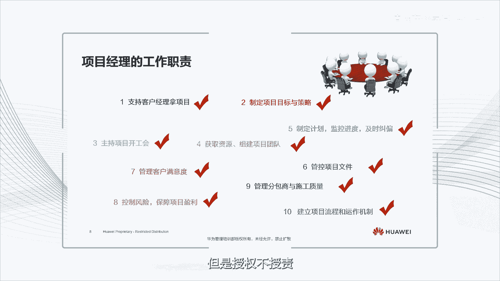

由此我们定义的项目经理决策模型是HEROS模型，项目经理是英雄，对项目最终结果负责，是项目成功的第一责任人，具体包括，项目经理是团队领导者，带领团队实现项目价值，是团队的领导，是团队的灵魂。

项目经理是项目环境和氛围的，营，造着良好的环境和团队氛围，有助于高绩效团队的生成，有助于团队更好更快地达成项目目标，项目经理是项目经营质量和客户满意的责任者，经营是企业生存的基础。

项目作为企业最小经营单元，没有经营，一切为零，质量和客户满意，也是衡量项目成果是否符合要求的重要指标，项目经理是项目执行的管理者，项目重在执行和落地执行，需要统筹安排，统一调度，统一监控。

以确保项目执行满足项目策略的要求，并达成项目目标，项目经理是项目策略的制定者，项目策略是为了达成项目标而选择的，主要路径，是指导未来项目计划和具体行动的，原则和行动方针。

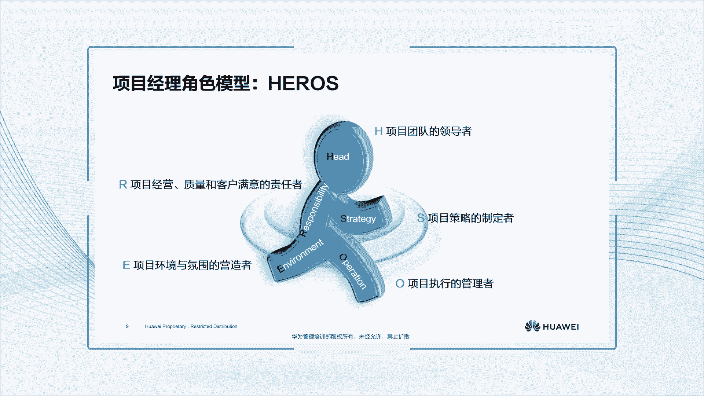

基于项目经理hero模型，华为研发项目经理的角色模型是华为研发，项目经理，是团队建设的责任者，是组织能力建设的支撑者，是市场制造服务导入的支撑者，是及时高职教父的责任者，是开发策略制定和执行的责任者。

当然华为研发项目经理的角色模型，也是在不断发展和引进的，特别是在组织战略调整和业务环境发生变化时，如客服从企业市场到消费者市场，商业环境，从管理客户到管理生态技术，从通信技术到信息技术。

再到信息通信技术，华为研发项目经理，的角色模型也发生了调整和变化，从原来的聚焦研发项目高质高效，及时交付，已经成为现在的聚焦研发项目，商业成功高效执行和更广泛的生态系统与衔接。

具体包括项目团队凝聚项目生态，协同项目商业和战略成功项目高效执行，项目攻坚克难，这五个角色定位，形成了华为新一代研发项目经理角色模型。

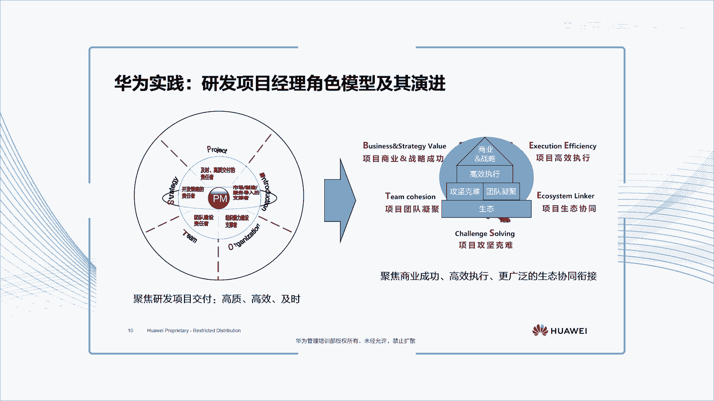

本章课程内容就是这些，让我来简短做个总结，我们常说，眼界决定境界，定位决定地位，对项目经理也是一样，定位要高，定位要准，我们对项目经理的定位是打赢不确定性，项目交付的指挥官。

是项目价值和竞争力实现的责任者，是项目团队气质的打造者，是组织改进的发动机，是将军士官的摇篮，各级领导干部都要有成功项目管理的实践，并优先从项目经理中选拔，最后留给大家一个开放性的问题。

您是如何理解项目经理的角色定位的，欢迎大家在评论区留言，感谢您的收看。

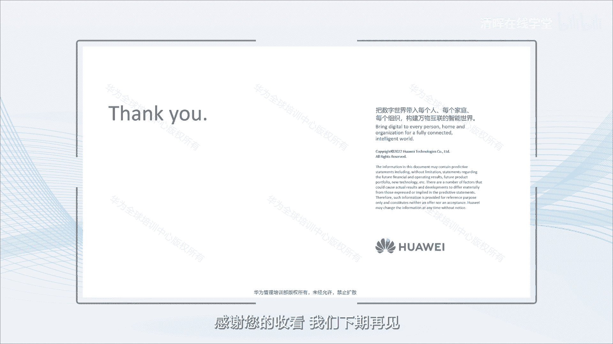

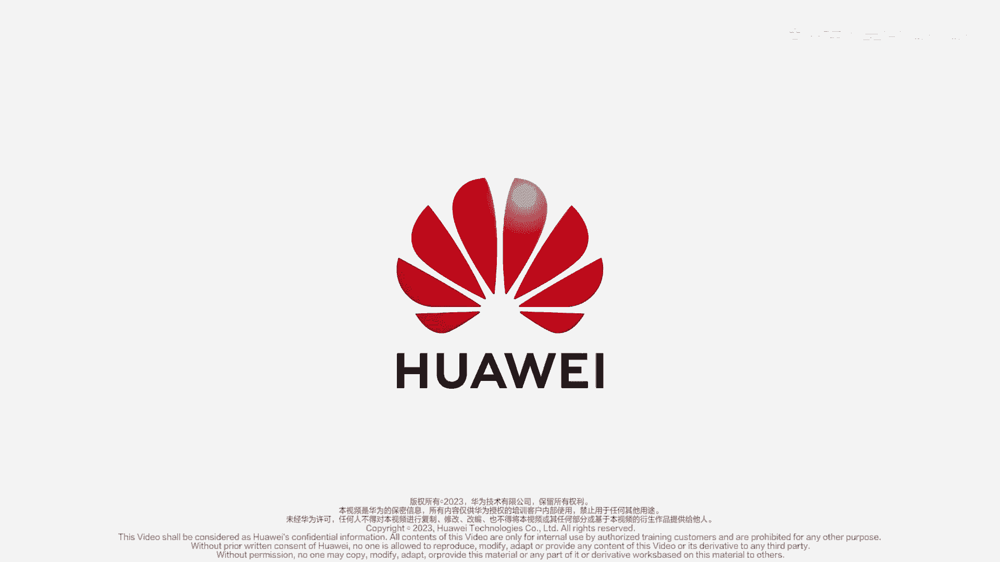