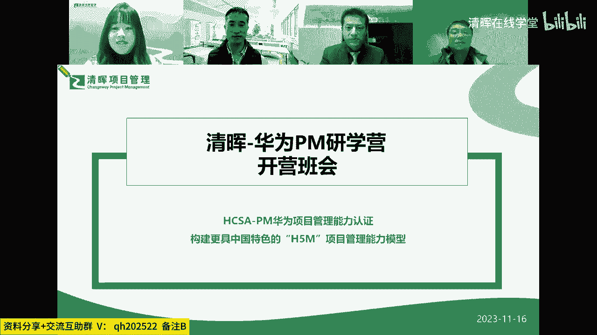
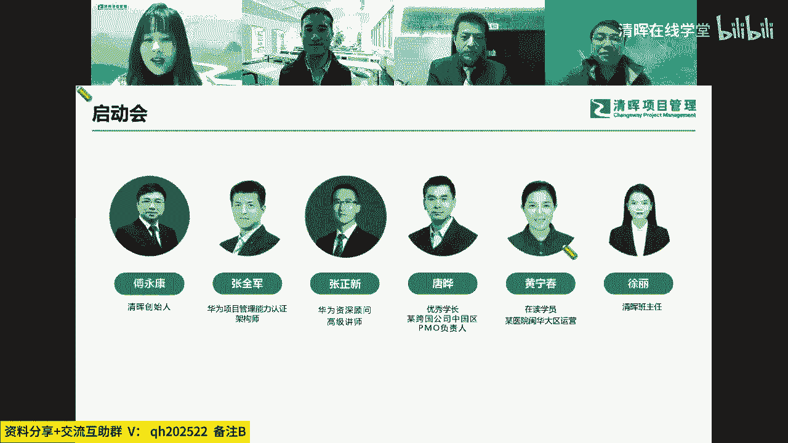
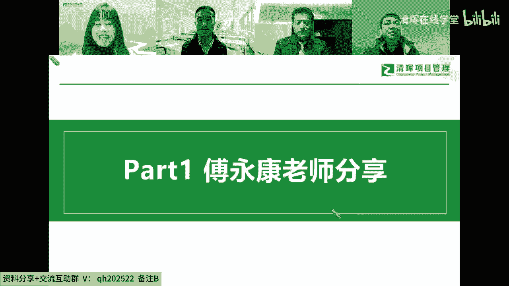
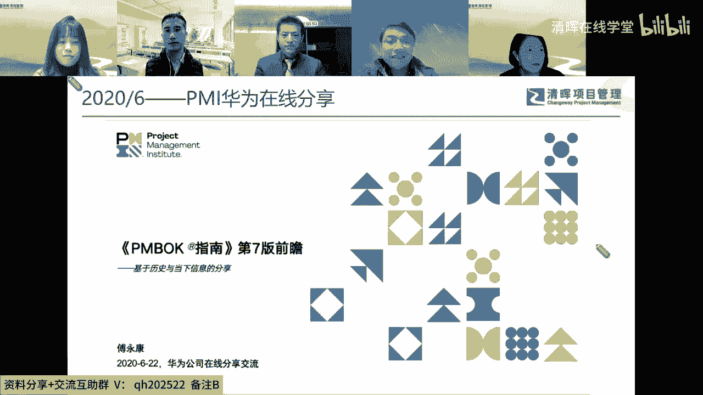
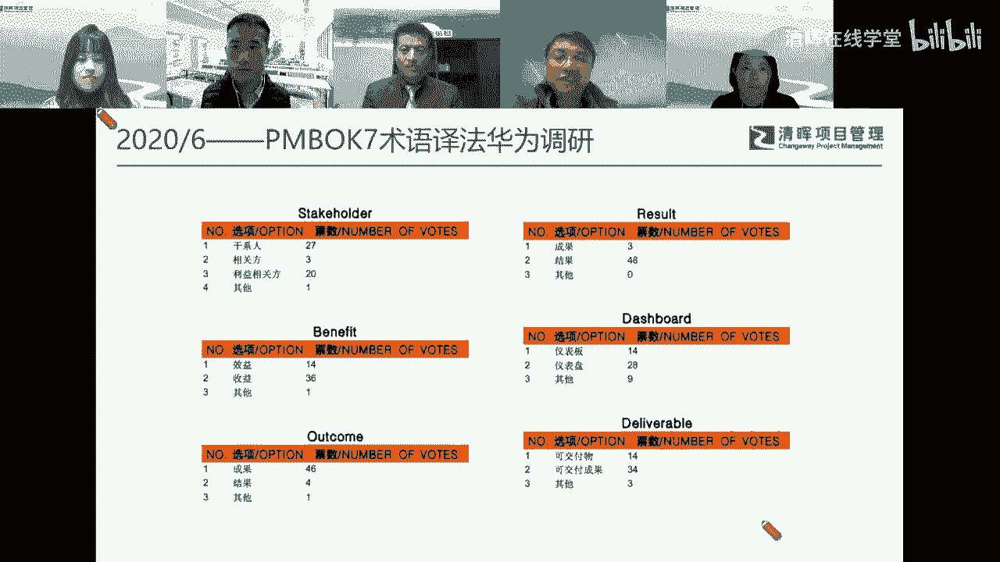
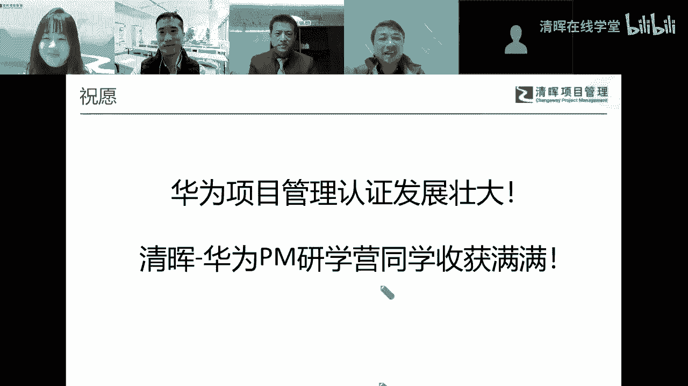
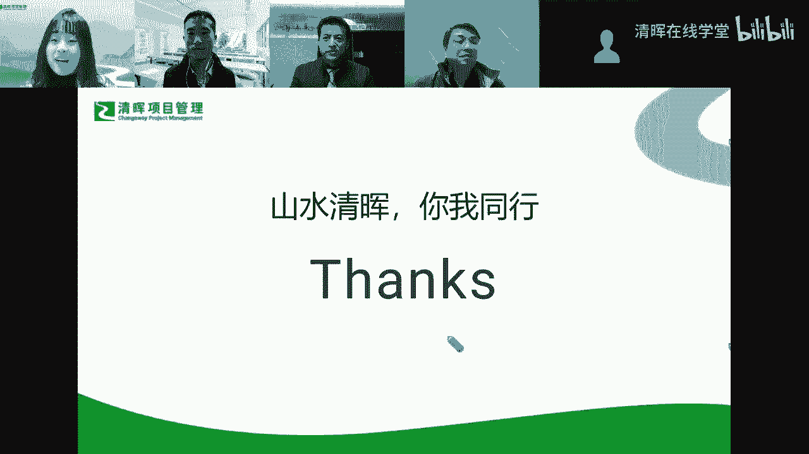
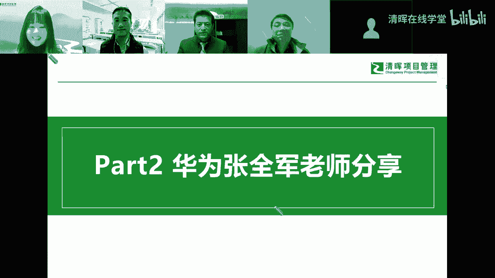

# 精品课程丨清晖-华为 PM研学营 HCSA-PM - P2：1.傅永康老师分享一一清晖与华为的交集时刻(1) - 清晖在线学堂 - BV1QN4y1m7F7

嗯各位小伙伴晚上好，欢迎大家来到清辉华为pm研学营开班班会，现在能够正常听到声音的话，在评论区帮我扣一个666好吧，好的收到大家的反馈感谢，那我们今天晚上正式开始我们的开营班会嗯。

很荣幸今天晚上邀请到我们有六位的颁奖嘉宾，哪有我们的青春创始人傅老师，华为张全军老师，张振新老师以及我们优秀学长也是啊，华为项目管理认证持证者唐烨老师，现在在读的学员黄迎春，以及我们的班班。

为大家开进行今天晚上的开营班会的分享嗯，那今天晚上大概是分为六部分。

每位老师都会有讲解的详细的内容，所以大家可以仔细聆听，有问题的话，也可以在互动区里面抠出来，我们会及时回复到大家呃。

首先邀请傅老师这一块为大家带来呃。

我们清辉与华为的交集时刻的分享内容，啊好的，那这个是我来操作吗，我我看一下，对，您可以在下右，在下方的话是可以点击操作切换界面的，我看一下，好的好的行，那啊非常感谢啊这个老师邀请啊。

来参加咱们啊华为啊pm研学营的一个仪式啊，一个仪式也可以说是开营的一个仪式吧，哈哈哈呃，呃今天呢我想那个主要是跟大家也分享一下，就是我们呃清辉还包括我个人在过去几年中啊，因为工作关系吧。

各种的呃一言啊忌讳啊，能够跟华为的伙伴们，能够有一些焦急的一些时刻啊，那我想这里也相当于是也是呃，对咱们啊这个合作，以及我们往来的一个简单的一个小的回顾啊，也希望在通过这个回顾，然后我们来展望未来。

好啊，首先呢，呃这个我我觉得第一次跟华为能够在我这，叫同台亮相啊，这个也是一个也是一个很有意思的一个，一个时刻，是在2015年2015年的PMI中国大会啊，那那次是在上海举办，那那次也比较巧的是呃。

华为和清辉呢，都是作为大会的一个比较重要的一个呃，叫参与方吧，也是一个重要的一个赞助者，赞助赞助啊，啊，至少我们的这个logo，都能够并列在这个整个大会的一个背景板上，这个也是我们呃轻微。

第一次和华为能够在同一个呃，重要的一个舞台上，然后重要的这个呃怎么说呢，这个重要的能够把大家放在一起啊，这个也是我们那一年的一个比较，对我们来说也是比较难忘的一个时刻吧，啊这是15年的。

那实际上我自己呢也是15年的啊，有机会来参与到这个叫PMI的，中国项目管理大奖评委会啊，但实际上在评委会的这个工作里面的，实际上我们还是经常能接触到华为的这个，这个项目的呀，因为华为也是啊。

整个中国的一个非常重要的一个，一个一个企业嘛，然后所以经常也会有机会来参与到这方面的，一个大奖项的申报啊，那第二次和呃诶诶等一下，我翻一下页，这个操作上可能还是有点小问题了，这个不好意思，往下翻也是。

好，接下来这一招呢是在2017年啊，2017年呢呃有一个非常重要的一个会议啊，是在美国休斯敦啊参加那那啊召开吧，那次呢是叫p mi的，叫他在那p o s pose全球的PO高峰论坛。

那那一次呢正好我也是参加了之前的TMI的，当年的全球大会啊，是在芝加哥举办的，正好这两个会议呢相隔正好一个星期啊，这也是一个字特别近啊，然后又又在一起召开的这么一个两个会啊。

所以我当时正好有机会去去美国去参加这个会，参加p mi大会之后，然后再借这个机会了，去休斯敦啊，因为休斯敦正好也有一些呃，怎么说呢，有些我比较向往的一些地方，比如说像那个NASA的这个航天中心啊。

他其实就在休斯顿啊，那个是一直我特别想去参观那个地方啊，所以借这个机会就去了一下休斯顿，参参加这个会，但是这次也特别巧了，我我原来一直就以为是我一个人去参加啊，因为在芝加哥就我一整个大陆。

就我一个人在在会场啊，但是这次去休斯顿，我觉得特别开心，是因为在休斯顿，然后我们有一个小team了啊，然后在休斯顿，然后遇到了我们另外三位，华为的PMO的这个小伙伴啊，谢亮啊啊樊晓东，还有那个林泽峰啊。

这三位老师正好大三个月去啊，另外一位是那个京东方的啊PO的一位同事啊，然后所以我们最好在那次会上，我们五位来自中国大陆的这个参会者啊，劳斯哈斯的一个小team也是特别开心的啊，所以这所以那次会议之后。

到日和就和我们啊，华为的PO这个这条线的同小伙伴们，开始有有了一些比较深入的一些接触和交流啊，所以这次也是一个特别好的一个契机，呃然后再往下呢就时间就很快了，一下子又到2020年，正好是疫情嘛。

那疫情其实之后的话倒是呃怎么说呢，那几呃，这前面3年到说实在的很多的一些线下的机会，到相对来说会会少很多啊，那包括这种去海外这种机会基本也没有了，再加上从18年一九年开始呃，像华为也是受到美国一些这个。

这个不不公正的一些待遇啊，所以所以使得有些有些这种海外的这种活动，实际上基本也是不太好再去参加，但是但是那次之后，倒是反而给我们国内的一些很多的交往啊，到提供了一些机会。

那在20年的6月份的当时有一次呃，我觉得也是特别好的一个机会，就是呃因为我当时也正好参与了啊，PO的啊啊PMIPMBOK第七版的中文审教，那实际上在20年的6月份呢，这个审交还是在过程中啊。

然后所以他很多的内容，其实我们也还没有全部看到，所以呢但是基本上一个框架呢，通过前期的一个省交，也基本上稍微有些了解了啊，所以啊我觉得华为对这个全球的一个小项目，管理的他的一个新的动态趋势特别敏感。

也特别特别在意啊，特别放在心上，他要要去学习和了解他啊，所以他和PMI这边呃共同邀请了一下，然后我所以我那年的6月份的，因为线下不能做分享啊，所以在那时候，这个因为线下当时也是不太方便啊。

所以后来就就做了一个线上的一个，在线的一个分享啊，所以是基于我们作为省教主啊，他能够看到的一些文本啊，看到的一些部分的，然后对他做了一个前前期的一个前瞻的，一个一个一个分享的啊，所以这是一次在线分享啊。

啊然后再在这次分享的时候呢。

实际上我当时正好有一个事情，我是需要去做一下的，就是换一篇不可第七版的一些术语啊，因为我们在第七版的时候，他有一些术语是需要重新来审定，那在当时来说呢，呃就是我们拿到的这个部分里边。

其实有几个比较关键的一个术语啊，我们还是想想这个去了解一下，那一方面是我们审计组内部的讨论啊，然后这些也做了一些小的公开的一些呃，呃小范围的一些公开的一些一些讨论，那另外一块呢我们也想借这个机会来看看。

是不是可以找一家咱们国内有影响的企业，从企业的这个项目管理角度来看，他们对这些术语的一些选择啊，所以我们当时也做了下，发现这个结果还是特别有有那种启发意义的啊，对我们后来的一些定稿啊。

其实还是起到一个很大的一个一个。

帮助和促进作用啊，呃然后再呃20年的10月份的时候呢，呃这次倒是一个特别好的一个契机啊，就是因为华为它在10月份会有一个呃，公司内部的一个年度的叫项目经理论坛呢，啊所以啊因为上次在线分享嘛。

那个大家反馈还是挺好的，然后大家觉得还不过瘾啊，说看看是不是有机会能够在线下啊，到那时候这样线下要做组织个活动，其实还是不太容易的，所以所以那次的啊参参加这次论坛呢，我觉得还是特别开心的。

意思也特别特别感谢华为，当时能够在那个时候来邀请他，然后去做了一次呃，在这个线下的这么一，当然线下也有一个线上的一个一个同步直播吧，他也是这么一个线上啊线下结合的一种方式啊。

主题呢实际上还是延续了上次在线上的那个，IPMBOK第七版的一个一个分享吧，那在这这个分享这次的活动里面，我是哎呦，对那个华为的这个叫他的这个logo啊，这个像华为项目经理的这个精英标志哦。

特别啊特印象深刻啊，这是我后来收到了一枚的这个这个纪念品啊，然后我对它上面三个字感觉特别有同感，叫专业责任荣耀啊，这个一看哇，这个特别跟这个西点军校的这个叫专业啊，叫叫责任荣誉国家哇。

这个真的是特别特别相像啊，就是他还是特别有荣誉感，特别有一种这种怎么说呢，这个我觉得是一种鼓励大家去追求卓越的，一种一种气质在里面，呃然后再就进到21年二一年六月份啊，这个这里为什么写这个叫二访呢。

因为说在第一次访问大概220年左右，但是那个那个记录我找不着了，照片我也我怎么也翻不到了，所以我这个就是把二房这个还是写上了，因为孙胡生虎种的浮肿啊，是我们呃华为的这个fellow啊。

项目管理领域里面最高专家啊，首席专家最高专家啊，这个呃呃怎么说呢，就是我觉得他对这个项目管理同行的一种交往，我觉得他还是很重视的啊，所以他也这个不耻下问嘛，那那个也曾经几次来到我们清辉啊。

然后121年6月份的时候，那个他他来过我们啊庆辉啊，那这次来呢其实是做了一下交流的，这个交流呢，其实也是跟我们现在的这个华为的整个整个，认证体系啊，其实也是有关系啊，因为他第一次来的时候。

其实我们相当于私下这个这个聊到这一块，其实并没有给他这个这个怎么说呢，反到台面来，正式的来交流这个具体的一些内容啊，所以这次来呢我觉得还是收获挺大的，正好呃因为在21年的时候。

这咱们的这个华为的这个整个项目管理，知识体系啊，就是他也是在完善中啊，所以有些东西它就孙总呢他也是不止下问吧，反正也跟我们也做了一些交流啊，然后把啊，当然我们也希望其实这在这个这个机会里面。

我觉得我对咱们华为的认证这一块呢，我也开始特别关注了啊，因为第一次还没有太大感觉，第二次来哇，一看到这个模型框架，我我是立马心动的啊，那个啊就特别有感触啊，所以也特别开心的。

我们现在终于把这个项目能够做起来了，然后在21年9月份呢，是我倒是第一次有机会呃，正式的到华为去做这个项目评审啊，因为原来原来过去几年的，实际上我是有机会，但是中间有些是有机会也错过了啊。

所以所以我之前其实并没有以一个评委身份，来去过华为啊，所以21年9月份，我们是正式的有有这么一个机会啊，去华为的坂田基地啊，然后把那个也是一个特别啊，特别特别不错的一个地方啊，特别不错啊。

特别能感受到华为氛围的一个地方啊，去做现场的一个额项目的评审啊，然后对他那个叫莫奈花园的餐厅哇，那个印象特别深刻，那里面有哦，真的是有有那个任老爷子特别喜欢的，就是他他所欣赏的那些书啊什么的。

都在那个整个那个餐厅里面都排满的，真特别特别一看到我特别舒服，真是不光是技术，对于人文啊，对于艺术啊，那华为真的是特别特别不错啊，呃然后在21年9月份呢，其实我同时还还委托这个华为。

帮我们做了另外一个调研啊，就是其实在PMBOK呃，在过去的翻译的呃，在审计的时候，其实有有两个词是特别呃特别纠结啊，一个是stakeholder啊，当时也花了一年时间把它定型。

其实在第2年就是21年的时候，其实我们整个这一年比较纠结的一个词，就worship，就这个词的最终的定稿，当然有机会，我说我要找华为的小伙伴也帮我们来做一个，来做一个参考意见的啊。

所以当时当时跟那个呃魏振轩这边，魏魏老师这边能否请他帮帮个忙啊，然后在华为内部做了一下，然后实际上这里面我看那个书副总监，也对这个词的译法，也表示了一下他的个人的一些看法啊，当然虽然虽然最终呃。

还是我们用了另外一个词啊，但是但是这个呢我觉得这种参与度啊，这个给我们的启发，我觉得还是特别有帮助的啊，呃然后再就是21年10月份，21年10月份啊，孙孙红总呢他这边也做了一个，应该是三访金会嘛。

那这次呢其实基本上也是呃，咱们华为的这个认证体系啊，就整个知识体系快要快要定型，定型前的一次交流吧，然后我觉得就就当时看到这个呃，整个整个架构呢我觉得还是收收获特别大的，收获特别大，对，所以这一块呢。

呃，能够今年能够看到我们的整个认证体系出来啊，然后考试开考啊，这个政策完全是不一样的啊，然后21年的10月份啊，我觉得也特别荣幸的一件事，受到华为大学这边的一个邀请啊。

就是因为华为有一个叫华为项目管理三人行，一个一个叫访谈类的对话节目啊，当时他正好呃邀也邀请到我这边吧，然后就就这个也特别感谢啊，因为他那这个这一期的主题呢，其实也涉及到遍布的第七版啊。

然后还有包括整个项目管理知识体系的呃，一些横向对比这一块的内容啊，所以这次去呢也正好也很开心，跟生活中还包括华为的，咱们其他的一些项目管理条件的领导，也也都聚在一起啊，我觉得这次也是特别特别开心的事了。

呃然后是今年的今年2月份啊，今年2月份的呃，其实过去3年呢，呃我们其实一直还是当时也本来一直想嘛，尤其去年啊，去年是特别想要找个时间去去一趟，这个咱们华为的全球培训中心啊，因为啊咱们杭州华全球培训中心。

是接口在做这个华为认证这这一块的，这个地方嘛，然后但去年整个一年是因为疫情是去没去成啊，然后今年的话2月份2月份正好是呃外传啊，就基金会啊，这个在杭州召开了一次，我们呃今年应该是第一次的。

这个叫机构会啊，机构会议的时候，那正好借借这个机会，我说那无论如何，我这个要去一下，所以这次也特别感谢张张张钧宁，张老师这个在在那那次的接待啊，那次的接待，所以呃这次去华为啊那个园区的参观学习啊。

我觉得还是特别有助企划的啊，因为基本上在2月份的这个节点上，实际上我们整个体系课程啊，各方面都已经是相对来说比较完善的，都已经是真的是已经是非常看到他真的，特别成熟的一个一面啊。

这点还是让我们特别特别感动的一件事情啊，当然后呢，所以后来呢我们才有机会来啊，来考虑来申请，来加入到我们华为的这个呃，认证培训体系里面啊，当然这个过程呢其实也也还是蛮艰难的。

因为这里面我们呃也相当于是从从无到有，从0~1的这么一个过程啊，虽然前期呢我们有过一些交流啊，但具体从从这个，因为华为还是特别严谨的一家公司嘛，那如果我们要来做，那其实我们也需要经历层层的各种的这个。

这个这个方式啊，这种这种申请啊流程啊，这个所以也是不容易的一件事情，所以我觉得呃大家能够能够聚在这里，能够一起来学习华为的项目管理之道，我觉得真的是特别有缘的一件事情，呃，然后9月份呢呃。

我们在深圳的是清辉做的一个，星辉项目管理峰会，那在这这次的峰会上，深沪中呢也是亲自这个这个到现场啊，给我们深圳的小伙伴们，同学们来做了一次现场的华为项目管，知道了一个分享啊，那个也是圈粉无数，哈哈啊。

这个啊生活总在在这次的分享里面，真的是把华为的那些管项目管理的一些精髓啊，真的是做了一个非常好的一个阐述啊，让大家有一个非常好的一个学习的机会吧，我呢就简简单罗里吧，嗦，这个回顾一下。

这个跟跟华为这个同人的一些一些，往来的一个历史啊，在这里呢，我想我还是衷心祝愿咱们，华为项目管理的认证啊，这个未来发展壮大，也同时呢也特别祝愿我们啊秦桧华为研学营啊，同学收获满满，因为我想不玩。

在这个研学营里不完全只是一张认证的事情，我相信更多的是让我们去学习，了解和思考华为的先进的管理体系啊，如何能够帮助我们个人，帮助我们企业走向，走向一个又一个胜利的这么一个契机吧，啊谢谢大家好的。

谢谢付老师，那我就结束，连麦还是嗯好的，谢谢付老师啊，那大家都知道哦，华为是我们民族品牌的骄傲，也是民族精神的生动展现，那更是被誉为国内项目管理的天花板，所以今天我们也非常荣幸邀请到。

华为项目管理能力认证架构师张全军老师，为大家带来我们华为项目管理发展与认证盖帽。

