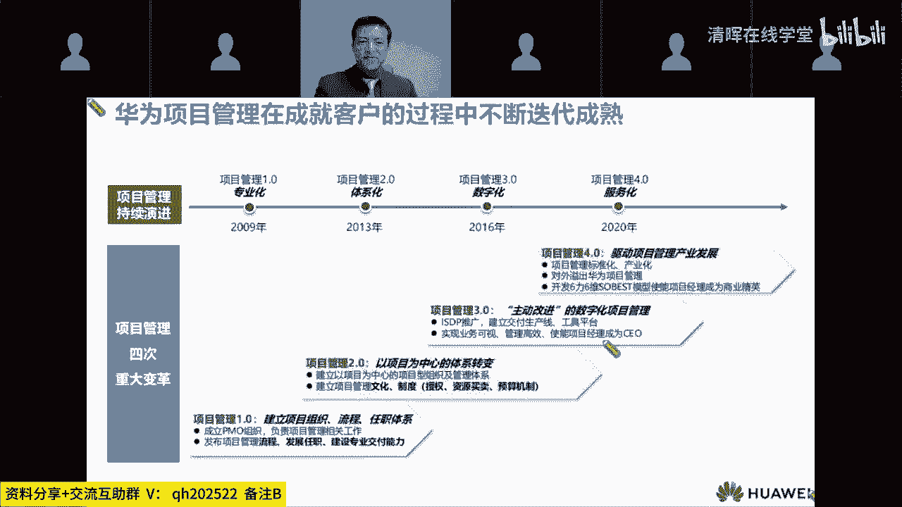
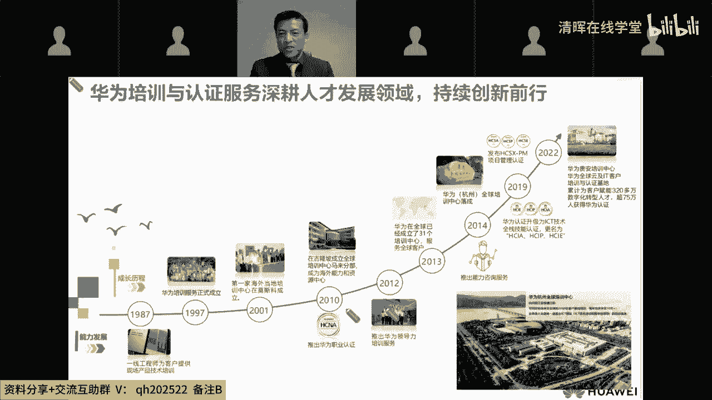
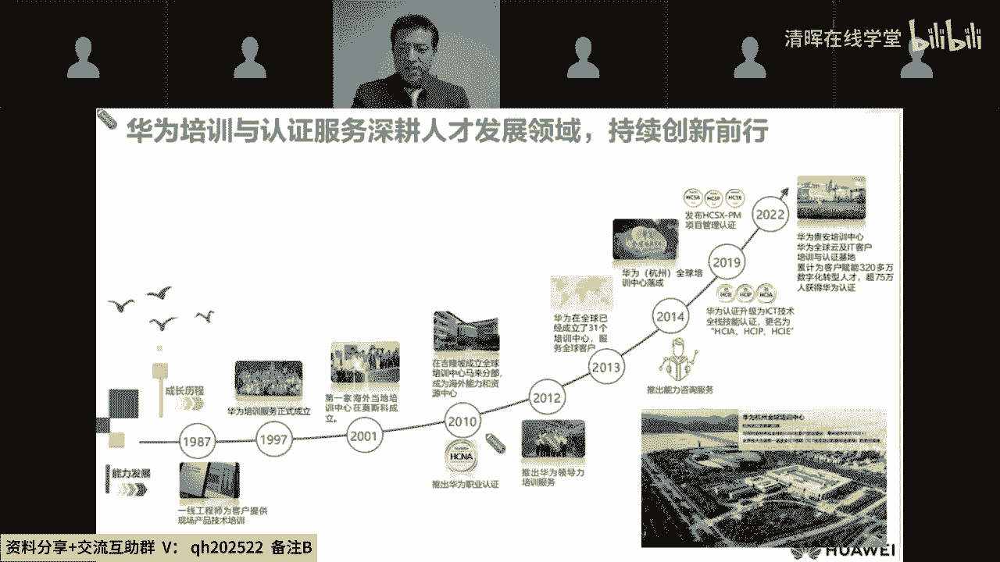
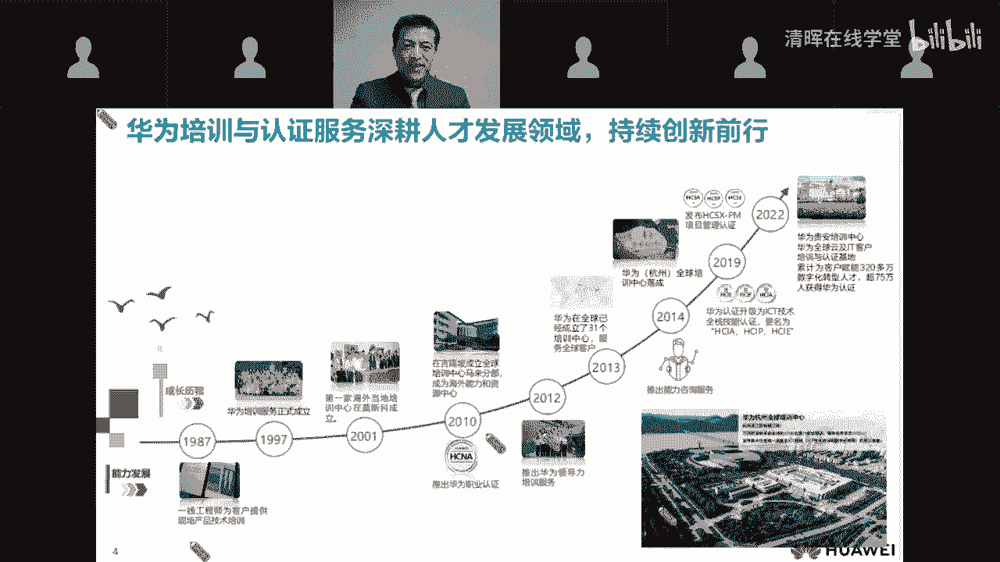
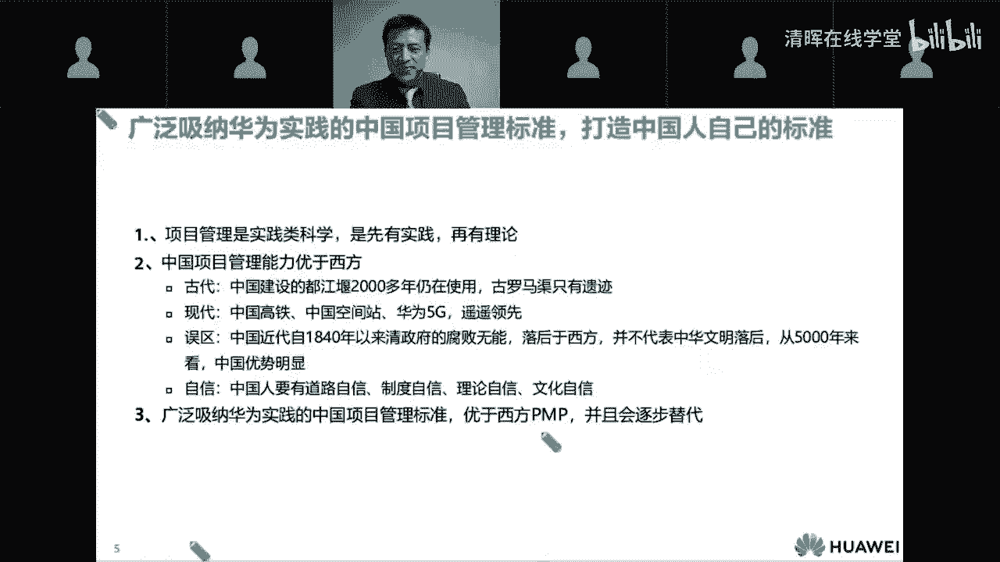
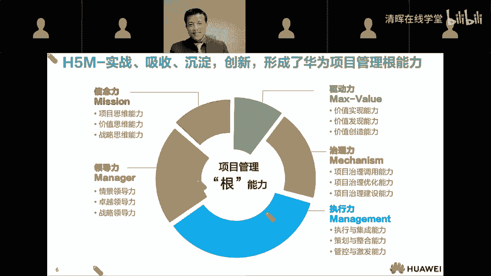
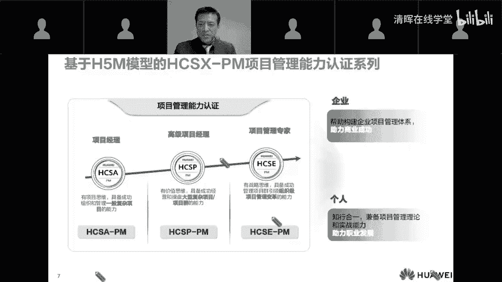
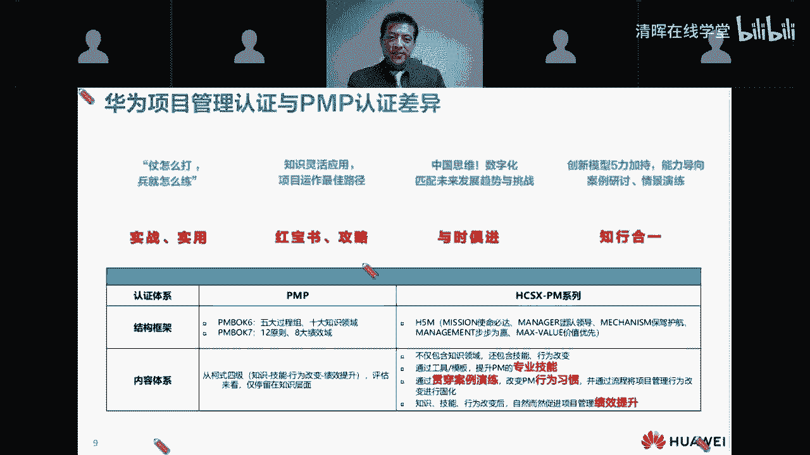

# 精品课程丨清晖-华为 PM研学营 HCSA-PM - P3：2.华为张全军老师分享一一华为项目管理能力发展与认证概貌(1) - 清晖在线学堂 - BV1QN4y1m7F7

张老师，您要看一下呗，哎可以了，现在正常了，您开始吧，好的我就接着付老师啊，往后走，链接全球智慧啊哈哈那个付老师李老师啊，那个还有线上的小伙伴们，大家好啊，那个很高兴，很荣幸。

今天能受邀来参加我们这个清辉，华为项目管理认证的首班开班活动，也非常感谢啊，我们咱们手办学员对华为项目，哦是我这边的问题吗，我好像听不到了，呃walker老师好，我们这边没有声音了，啊大家稍等一下。

大家稍等一下，啊我们线上的小伙伴稍等一下哦，然后我们老师这边来调试一下，诶现在正常了，正常能够听到了，好的，我估计是我这边那个房间网络的效果对，我就换个房间吧，不好意思啊，耽误点时间呃。

我们在线的小伙伴，我们线上的老师要不也关一下摄像头，我们关一下摄像头，哎对诶好呀好呀好呀，嗯您开始嗯好的，那我继续啊，那个呃我呢我呢是负责，刚才说到，我是负责这个项目管理认证系列的产品的。

这个开发和迭代优化，其实呢我的个人标签啊是一名项目经理啊，从事项目管理工作已经20多年啊，其中呢呃10年啊，其中两年是在英国公司，后来10年在西门子和诺基亚，再后来的话，那就十几年一直是在华为。

那么个人感觉啊，华为在项目管理上就更加体系化和专业化，它是知行合一，与时俱进的，这个翻页是在这啊底下有个翻页，那么接下来的话呢，就是我今天呢想花大概大概20分钟时间吧，简单的分享一下啊。

咱们华为项目管理认证的这个由来，和一些主要的特点，首先给大家看一组数字啊，本来呢是想跟大家互动一下啊，让大家猜猜这个数字的意思是什么，那现在就大家就直接去看吧，已经看到了啊。

一个呢就是嗯现在就是咱们公司的华为公司，目前啊员工已经有20万7000人了，那大家看看啊，旁边是11万4000多人，大家认为是什么呢，这个代表是什么数字呢，可能有的人会认为这是可能是海外的员工。

或者在海外啊，其实不是啊，这个数字是代表研发的人员已经有11，研发人员就有11万啊，11万多占比55%，那么全球的话一共有14个啊，研究所，包括咱们上海也有两个研究所啊，然后呢嗯最近的10年啊。

整个研发的投入已经，嗯几乎是接近于1万亿了啊，就算是在2022年已经被连续打压，以及这个收入和利润腰斩的情况下啊，研发的投入都有，都有1万一千一千六百多个亿啊，1600多个亿。

整个占咱们收入的这个25%以上，所以说是做了很多的投入，坚持在那投入，那么专利也有10万12万多建设专利专利，那么在1010年前已经有170多个国家，当前华为在通信网络IT智能终端云服务啊。

智能汽车解决方案，还有数字能源等领域啊，啊，提供非常有竞争力的，和安全可信的产品解决方案和服务，那么更加开放的生态合作啊，为客户创造价值，为个人激发激发个人的潜能，然后丰富家庭的生活。

然后也激发组织的这个创新，那么经过这个30多年的发展啊，华为公司持续的就是为客户和社会创造价值，也获得了比较广泛的一个认可，那么在这个过程当中，项目管理的文化和体系啊。

也得到了不断得到了不断的发展和成熟啊，那么在90年代末，华为就已经把项目管理当做公司的基本的管理，形式之一了啊，并且呢跟企业的文化和核心价值观一脉相承，形成了这个一使命必达为核心的项目管理文化。

并且是在逐步在这个呃我们的营销服务啊，研发啊，基建变革等领域持续的推进，那么其中啊在我们交付项目管理领域啊，啊我们的这个发展和这个能力建设，经历了这四个阶段，那第一个首先是2008年的1。0的阶段。

也就是项目管理的专业化，专业化标准化，那么到了2013年啊，那时候呢我们就进入2。0的时代，就进入一个体系化，就是项目中心的一个体系，那么到了2016年的时候呢，我们就开始正式进入了一个数字化的时代。

也就是3。0的时代啊，到了2020年呢就进入了个4。0的时代，那我们把项目管理当做一个产业来做啊，使能千行百业，那么华为每年有1万多个项目在运作，在海外也是啊，属于项目数量啊。

包括整整体的项目金额都是比较多的啊，非常多的，正是因为啊，我们做的这些个持续的这些个迭代啊，持续的这个项目管理能力的建设是吧啊，就是能够形成这样一个组织级的体系啊，和个人的项目管理能力的双重保障。

来让我们的项目获得了成功，那么也是因为这些不断的实践和积累啊，促使我们产生了打造更加符合中国人啊，思维思维和行为习惯的，更加实战实用的项目管理的啊能力模型啊，也就是H5M的模型。

那么说到项目管理的认证啊，我就稍微简单的就说延展一下咱们的这个背景，那么华为公司其实是在1987年就已经，开始了这个客户培训了，那么当时的话只是给就是一线工程师，为客户在现场做一些技术培训。

后来呢到了2010年的时候开始，我们就开开始探索这个职业认证啊。

做认证的一个培训，那么一直到现在已经经历了13个春秋啊，到去到2021年的时候，我们已经跟呃相关的一些政府部门吧，包括就是深圳啊，广州啊啊广东啊，一些就是人社部啊，做一些就说仪式双证的活动。

比如说考取了这个高斯啊，欧拉的一些啊认证是吧，就能获得政府的补贴等等啊，这些活动，那么嗯我呢右下角的话，就是我来自的这个地方啊，就是华为全球培训中心，它是在钱塘江边，就是钱江一号桥的边上啊。

也是我们中国最最早的现代化的一所一座，铁路和公路的这个双层的这个啊桥梁啊。

那么其实啊大家仔细想想啊，项目管理在中国其实有着非常悠久的历史，和这个深厚的一个沉淀的，虽然近代啊由于工业革命和二战之后是吧，嗯很多的这个在很多领域啊，西方啊占占据了这个主导主导权。

包括一些这个这个言论方面的一些东西吧，就是一个发言的这个优势啊，那么实际上啊很多人就是国人呢都知道啊，偏僻大家都耳熟能详，但其实中国已经也有了自己的中国人，自己的项目管理的标准啊，我们认为啊。

尤其是这些年啊，我们的这个基建啊是吧啊，智能制造，航空航天啊，新能源啊，互联网应用等等啊，很多领域其实我们都得到了很迅猛的发展，所以我们是完全有能力，也应该拥有中国人自己的项目管理的标准。

并且逐步要这个优于西方的标准啊。

那么关于华为的项目管理能力认证，到底认证的是哪些方面的能力呢，它的内核它的内涵又是什么呢，那我们认为项目管理的能力啊，他是一个啊做事的跟能力，无论你在销售交付变革还是数字化转型等方面。

它都是啊不可缺少的不可或缺的一个能力，那我们把这个能力啊分五个维度，第一个呢就是啊Mission就是使命必达的这个信念，信念力，包括项目思维，第二呢就是呃我们的领导力manager。

第三呢就是我们的这个执行力，也就是专业的项目管理能力啊，执行力，第四呢就是我们的mechanical就治理能力，调用组织能力的这个啊，来为自己保障项目成功的一个能力。

那最后的话呢用价值的驱动力来做这个项目，这个闭环，这就是我们的H5M的模型的就是内核，并且在每个维度上啊，都是从啊总分三个层次啊，这升级也就是我们的APE3个等级，那分别从简单到复杂，从再到集成啊。

从从规模和复杂度不断的啊做一个驱动升级，那我举个例子啊，像驱动力是吧，作为一个A级的项目啊，A级的项目啊，A级的认证，那我们的定位就是这个能力，是要至少能够实现项目啊已经识别的价值，那么到了P级别。

你就不光是要实现项目既定的价值，还要你去发现新的价值，那么到了E级别呢，我们就要有什么呢，要有这个创造，就从无到有0~1的实现价值，创造价值的能力，但像治理力这块就是调用组织啊。

流程啊机制来给你保驾护航，让你的项目能做成功，那这个地方呢在A级的时候呢，你只要会调用就可以了，到了P级别，那你就要不光是调用，还要能够有这个能力去优化，帮助组织来优化和提升，那么到了E级别呢。

那还得有这个构建组织啊，组织及能力的这个啊水平好，大概就是这个意思，这三个层级。

然后呢，呃我们呃在跟我们跟那个业界的这个认证，一样啊，也是分为职业认证和专业认证两大类啊，APE分为APE3个等级，呃其中呢就是HCSXPM系列的话，我们这套系列的认证呢它属于一个专业认证。

面向个人呢是知行合一，能够兼备项目管理的理论和实战能力，来助力职业发展，那么面向企业呢是帮助构建企业的管理体系，来助力企业的商业成功，那么在这个地方呢，我也再解释一下这个HCSA杠PM啊。

以及一直到HCSE杠PM的含义是什么，那么GPM是表示我们这个专业的领域就project management，HCSN呢是表示华为certified specialist sociate。

它表示是华为专业认证的啊，专业工程师，那他这个能力呢表示他认可有啊，具备了这个管理一般的复杂项目的能力，那么到了HCSP，华为certified的specialist professional。

就表示具备管理大型复杂项目或者项目群的，这个专业的项目管理能力，那么到了HCSE，那就是表示它具备了能够引领组织级的项目，管理变革，或者能够管理项目组合portfolio的这个能力啊。

就是这三层一层层往上走。

那么在我们前进的道路上，一直得到了全国项目管理，标准化技术委员会的啊支持啊，和紧密的一个配合，然后呢在呃在我们我同时呢，我们呢跟向标委，也给国家向标委也提供了很多的支撑啊。

说所以呢国家的项目管理标准体系，跟华为的H5M在整个体系层面啊，是啊有一个高度的一个能力，对应关系是非常匹配的，那么在今年5月17号国际电信日的时候，华为跟向标委战略合作官宣了。

就是我们华为项目管理认证的三个级别，跟国家项目管理标准第35集分别对应，那其中嗯A级别就是HCSA杠PM啊，对应国家项目管理标准的这个能力的第三级，HCSP对应的是国家项目管理标准能力的，第四节。

HCSE对应的是国家项目管理能力的第五集，那么作为啊我们线上的小朋友们，很多都是应该是已经通过了P，我相信IP嘛比较关注华为的这个项目管理认证，跟pp啊有什么主要的差异啊。

是不是这个能够能够带来什么样的一些，就是说帮助，那么首先呢我想说啊，华为的项目管理认证啊，它是一个嗯经过了华为公司的知名的，就是项目管理专家高校，我们是联合了这个知名的项目管理专家高校。

还有业界的一些专家啊，包括相对我的支持啊，联合打造的啊，萃取了华为20多年的项目管理的实战经验，打造的，并且还做了一个通用化的一个啊，项目管理的能力模型，那么在这个过程中中的话。

我们还并且是应用了就是啊专业的学发设计，所以的话他是定位是能够帮助学员啊，啊有提升实战的能力，那么在它的特点方面呢，其实在特点方面呢我们有四个方面啊，第一个首先是实战使用，前面也说到过。

因为华为每年有1万多个项目啊，有几千名项目经理，1万多个项目在运作，那么这些经过被实践检验的，成功和失败的经验教训啊，啊就是我们宝贵的知识财产，也是我们这个培训的和认证培训的，这个内容的来源。

所以呢整个我们的定位就是实战实用型的，第二呢就是这个红宝书和攻略，大家也知道啊，非常熟悉啊，我们业界的话是十大过程组啊，啊嗯五大知识啊，Sorry，五大过程组，十大知识领域，那么相当于是一个白皮书。

是一个字典，但是华为的特点，那是一个相当于是红宝石和攻略啊，它是沿着项目生命周期端到端的啊，往前走，当你到了这个每一个路口的时候，就能清晰的知道下一步应该用什么方法，适当的方法来做什么。

那么第三点的话就是与时俱进嗯，与时俱进的话主要是体现在这个数字化这一块，因为数字化呢在华为来说，已经刚才也介绍了一下啊，在我们的3。0时代就已经开始做数字化了，那么我们每年有1万多个项目。

在数字化项目管理平台上运作啊，在这方面在线可视远近协同，我们有很多的经验和方法可以做一个分享，那最后一条的话就是知行合一啊，创新的H5M的五个力的这个模型，不仅覆盖了这个业界的这个人才，三角的这个模型。

同时的话我们还更提供了，就是使命必达的驱动力啊，啊使命必达信念力，以及这个项目思维，包括我们学员怎么能调用，怎么怎么样来调用组织的能力啊，利用组织的流程啊，机制啊，平台啊来保障自己啊项目成功的治理啊。

并且呢通过案例的演练，案例的研讨，勤勤的演练，真正的锤炼实战的能力。

最后呢我借用公司的幅画这个画报啊，啊给大家表达一个祝愿，希望大家能够在学了项目，华为项目管理能力认证之后啊，能够成为这个在项目，从项目管理的认知到技能方面啊，都能够更好的得到提升啊。

更好的得到转变和提升，并且在大家各行各业的项目当中啊，成为啊项目中的这个英雄，因为华为的有一个模型是项目经理的角色，就是heroes啊，谢谢大家好，谢谢沃克老师为大家带来的精彩的分享。

