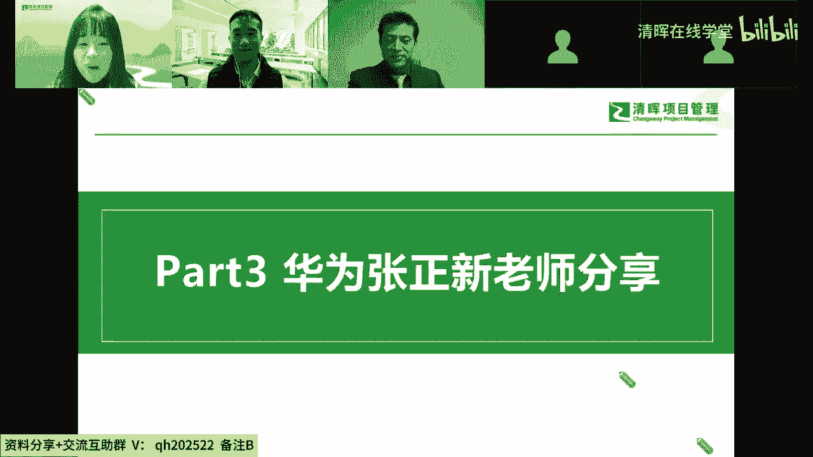
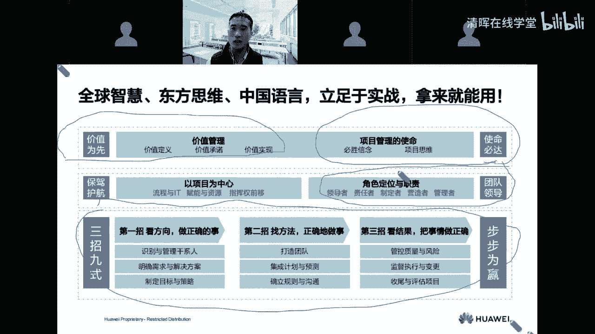
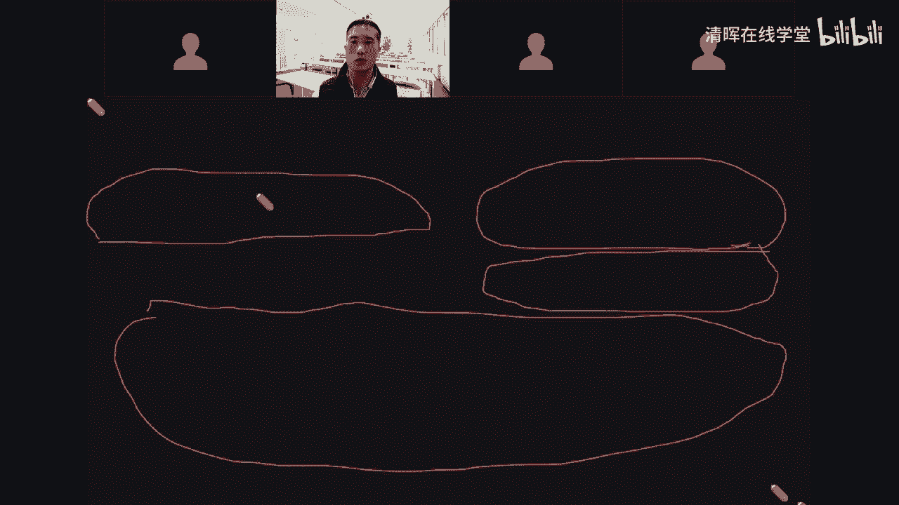
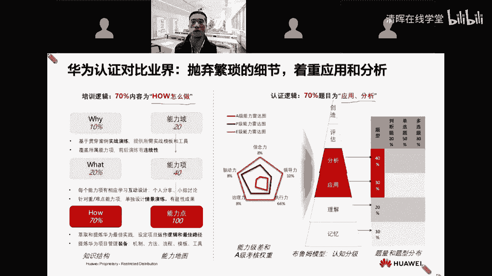
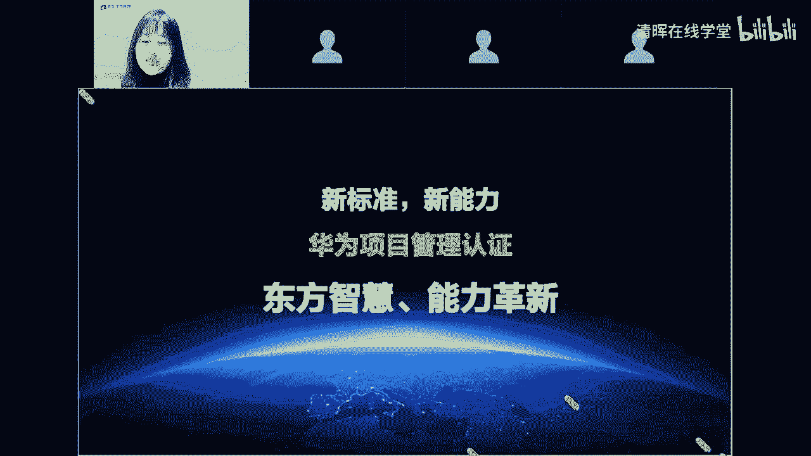

# 精品课程丨清晖-华为 PM研学营 HCSA-PM - P4：3.华为张正新老师分享一一华为项目管理二、三事分享(1) - 清晖在线学堂 - BV1QN4y1m7F7

嗯华为张振兴老师，那郑兴老师是我们华为的资深顾问，高级讲师，也是华为金牌个人项目管理五级专家，服务成本管理5G专家，那么下面有请郑鑫老师，为我们带来华为项目管理234分享。

好的好的好感谢李老师啊，也感谢我啊，前面这个沃克老师和这个付老师都讲了很多呃，也讲的比较高大上啊，我这边呢就算给大家讲讲段子吧，再讲点段子，讲点个人，这就是234234嗯。

问一下我们互动区的小伙伴有想要听段子的吗，听我们华为项目管理二三是段子的吗，想不想听段子啊啊啊，我把那个在大家讲段子之前呢，也算是卖个卖个小小关子吧，啊卖个小关子，大家觉得这个项目管理这个东西啊。

首先我提一个小问题哈，他觉得这个项目管理是现代才有的东西，还是还是以前就有啊，那古代有没有项目管理啊，大家对这个对这个事情怎么理解，项目管理是先有理论再有实践呢，还是先有了实践再有理论啊。

大家觉得在古代有吗啊，我也算是抛个小问题啊啊啊，我们应该说其实还是对吧，还是有的对吧，为什么呢，你看我们古代有很多工程呢，有很多工程的遗迹我们现在都可以看到对吧，我们有长城对吧，这里列了几个例子是吧。

包括我们的金字塔姆的都江堰，到现在还在浇灌我们这个四川盆地的千亩良田，对啊，包括这个古罗马的这个供水曲啊，没错是先实践对吧，后出理论对吧，所以说我们相互管理，首先它的这个特点是一个什么。

是一个实践的实践科学啊，时间可以古代就有啊，古代就有古代的，我们认为那个时候是什么叫做实践先行，但是的话呢那个时候形成了通用的理论吗，啊可能还没有啊，还没有啊，那么通用的理论我再考考大家啊。

大概是从什么时候或者说普遍的比较公认的，大家觉得这个理论是从什么时候开始的，啊啊啊先先先做再说再写啊，是啊是的没错啊，大家知道吗，前段时间有一部片子上映了，都不知道大家有没有看过啊，啊有一部片子啊。

讲这个讲什么呢，就讲那个奥本海默，大家有没有看过这个片子啊，有看过这个片子的，可以这个同学也可以扣一个这个666啊，我们我们我们我们可以交流一下啊，在这部片子我就很推荐大家看，为什么呢。

就是其实这部片子呢也就是啊也就是一个啊，应该说我们通常意义上啊，大家认为说这个像现代项目管理的，一个算是一个起源啊，一个起源就是讲什么呢，就是讲曼哈顿计划的，曼哈顿计划是说什么呢。

其实就是哎啊造原子弹啊，造原子弹啊，那么当然与之相对应的呢，我其实还有一部片子，我们中国也有一部片子，大家知道有没有听说过啊，我们有一部叫横空出世的片子啊，我也很推荐大家看，哎，我觉得这个做项目管理啊。

我觉得我的个人感受哈，我觉得这两部片子其实都是可以看一看啊，为什么呢，因为你看啊它有一个什么特点啊，首先这都是这个对吧，他两部片子还有很多的相互联系，他首先都是在什么在极其有限的这个资源下。

在极其有限的这个这个时间限制下对吧，要去解决一个重大问题啊，解决一个重大问题，而且呢同时与之相对应的它还要对吧，至少有三波完全这个背景完全不同，习惯完全不同对吧，工作方式完全不同的三类人对吧。

哪三类人呢，你看我们一个是有什么科学家团队对吧，一个我们是有什么有这个那么工程师团队，那么还有一个什么我们的军队对吧，那科学家这个团队可能是这个思想最活跃啊，但是组织可能是最松散的这么一个团队对吧。

那军队呢可能刚好相反对吧，军队是不需要有太多的这个独立思想，那可能更多的就是什么重在这个对吧，那个这是人类组织的这个最高形式对吧，那同时还有一个工程师团队啊，那他他他怎么把这些人结合到一起来。

在那么有限的这个时间环境下对吧，那这么有限的资源下啊，去解决问题啊，那这个呢哎就逐渐形成了我们现代项目管理，的这么一个一个起源啊，那么在逐渐再到这个近现代啊，逐渐的这个发展诶。

他的这个理论啊不断的完善啊，大家这里也列了一些项目啊，就形成了我们项目管理的一些方法啊，比如说关键路径法啊，我们的计划评审的这些技术啊，在更多的一些项目里面得到了这个实践，比如阿波罗的这个登月。

这里做了一个体会对吧啊，那么我们回顾简单的回顾一下历史，我们也可以稍微展望一下未来，对吧啊，大家也可以看到说哎，我们的这个理论的这个发展，它也不是一蹴而就的对吧，它也是逐渐的啊在形成啊。

那么我们也看一看，那说那么在过去的二三十年对吧，那么我们再展望一下未来的二三十年啊，大家觉得在这个在在这个实践的这条路上对吧，哪个地方的大项目最多对吧，哪个国家的对吧，复杂项目最多。

哪个国家的复杂项目是最大啊，大家觉得是哪个国家啊，大家也可以，我们也可以展望一下，对不对啊，我们可以说我们说中国呢至少是其中之一对吧，我们还是敢说这个话嘛，啊我们还是敢说这个话啊啊啊对吧。

那么既然我们有了这个实践啊，你看我们这个歌德说啊，这个理论是灰色的啊，我们的这个生活之树常青，好生活是什么，生活就是实践嘛，对不对啊，恩格斯也说啊，我们说劳动创造人类啊，什么创造人类。

劳动创造的劳动是什么，劳动就是实践嘛，对吧啊，我们的伟大的实践，那必然也诞生这个伟大的理论对吧，那么我们现在也有了我们很多的这个实践，那是不是我们也可以在理论这条路上对吧，也多走一点出来。

而而且本身这个项目管理我们认为什么，它也是一个实践科学嘛，啊是一个实践科学啊，那么讲到这个了，哎我再跟大家稍微汇报一下啊，华为公司啊这个项目管理的一个发展历程啊，那么我个人呢其实也是这个啊。

这个历程的一个啊既是一个算是一个见证者吧，啊同时也是一个一个参与者啊，一个参与者，我加入公司的这个时间是06年啊，06年加入公司，06年呢大家可以看到哈，我们基本上在应该说在08年以前啊。

基本上公司的这个一个定位啊，就已经把这个项目管理，明确成为公司的一个什么一个基本形式，好吧，我06年进公司的时候呢，那个时候正是遇到什么海外业务，在在高速增长的这么一个一个阶段啊。

我基本上是属于一进公司，就被公司丢到海外去了啊，丢到海外去了，但是那个时候丢到海外去了，我们就面临很多的一个问题啊，为什么呢，就是在国内的时候呢，你看我们当时做的就是一些啊。

典型的就是那个叫什么叫装装基站啊，调一调啊，我们就就解决解决问题了啊，也比较简单，而到了海外之后呢，哎我们当时面临的很多的一个一个情况是什么，客户要什么呢，客户要叫腾P啊。

那个时候我们说什么叫turkey，我都不知道这个这个名词是什么意思啊，后来慢慢搞懂了所谓的这个turkey是指什么呢，就是要我们叫交钥匙工程啊，turkey啊，就是把钥匙交给客户对吧。

那客户要的是什么呢，把什么为什么要把钥匙交给客户呢，其实就是就是这个要以家庭装修为为为例子吧，那就客户要的是什么，是拎包入住对吧，那turkey所谓的turkey是什么。

就是我把一张网络好完整的交给客户，客户能够拿到这种网络哎就能够用就能够赚钱，这是客户的一个期望，那么为了要达成这个，那么我们要做的事情，可能原先就只是做一下这个基站的安装对吧，可能调测就结束了啊。

但是的话呢哎真那个环境下面，客户要的是什么啊，客户要的就是要有一段完整的网络呀，那这个网络首先从规划开始对吧，我要怎么去做啊，然后呢规划做了之后，哎我们要解决的问题是诶，那这个站点能不能谈下来啊。

我们还要去把站点好吧，要把它租下来，租下来之后还要搞建设啊，建设建建完了之后啊，然后才到什么才到，我们可能原先比较熟悉的电信设备的安装，调测啊，那么在这个过程里面，那么就面临非常非常多的问题。

我们就进入了一个完全全新的领域，一个领域啊，全新的一个领域啊，当时的这个这个情况糟糕到什么情况来，糟糕到什么地步来啊，大家可能都难以想象对吧，我们在海外一个一个重大项目吧。

算是当时海外最大的一个一个项目，我们一个项目啊，基本上我们的项目人员啊，就华就只算华为公司的这个人员啊，还不算我们的这个给我们提供服务的伙伴啊，就这么一个项目，我们的自由人员啊超过1000人啊。

超过1000人，其中呢我们有大概可能当时我印象当中，峰值的时候啊，我们可能有三四十个中方员工啊，三四十个你想从外派到当地去的中方员工，我们在一个项目上三四十个人，我们就干一件事情。

大家可以猜一猜是干什么事情啊，我们三四十个人就干一件事情，就是打电话沟通协调啊，沟通协调的目的是什么啊，沟通协调就是希望把一个完整的基站啊，不落部件能够发到战场，我们就解决这一个问题啊，在一个项目上。

我们就可以消耗三四十个中方员工啊，大家可以想象这个当时我们啊，我们当时经常也说，我们这是就是什么就打乱战啊，就打乱战啊，为什么那个时候就是流程不通嘛对吧，如何把一个基站完整的对吧，从中国生产出来。

发到当地去，坐到站上一个部件不缺，我们那个时候就解决不了这个问题啊，对了大量的人力物力，哎我们就想办法要把这个流程打通好吧，把这个流程建起来哎，逐渐的哎我们往前发展，诶，这个问题呢大概走到了这个。

可能这个这个大概可能走到了这个，114年前后诶，基本上呢流程通了对吧，走得通了啊，原先这个啊这个特别多的，这个叫什么表哥表姐啊，大家痛不欲生，哎现在逐渐的表哥表姐的问题解决了啊，不用那么多。

天天这个都在都在这个做表格，他把跟踪进展大家打电话沟通协调，诶这个问题解决了，但是14年呢我们又发现新的问题啊，什么新的问题呢，就说诶那个时候我觉得这个有没有流程，都有流程诶，但是呢我落到项目上。

你看我各个体系都有流程，比如说我采购有我采购的流程，我供应有我供应的流程对吧，我的这个各条战线上，我财经我财经的流程，我各个流程都有了，但是落在项目上通不通，是我们那个时候就发现很多时候就不同啊。

断点很多对吧，一个项目经理呢，他可能这个原先就表哥表姐，现在不做表哥表姐了，现在我们做什么呢，我们就天天汇报啊，天天汇报是吧，今天这个我们那个时候就说，天天求爷爷告奶奶对吧，呃给给这个部门汇报。

给那个部门汇报，汇报的目的都只有一个，就是怎么把这个流程里是有了，但最后我在项目上我打不通对吧，打不通，我们当时还也做过一个一个统计啊，做过一个统计，我们一个项目经理，就为了去拿一个项目的这个预算啊。

这个项目的这个预算的，我们这个反反复复这个汇报了这个啊，汇报十几轮对吧，汇报十几轮啊，将近20轮的这个汇报啊，这个项目预算就批不下来啊，就面临这样的一些问题的流程不通啊，所以说那个时候呢从14年。

当时公司就开展说诶，以项目为中心的一个变革对吧，我们还是不是说这个天天我们都在讲这个流程，有了对吧，那最后落到项目上能不能好，能不能弄得通，项目跑跑的顺对吧，从那个时候我们就开展这个变革。

这个变革呢大概就持续到可能啊，16年一六年左右，那个时候呢，哎16年我们又发现了这个新的问题，哎基本上我项目上哎这些流程打通了啊，基本上也跑得比较顺了啊，但是的话呢那个时候又面临新的问题。

哎就当是开始推工具啊，各条战线上都开始推工具啊，这个地方我们有个工具诶，那个地方有个工具啊，那个时候又发现哎呀这工具对吧，这都是单独的，都是个体，我就举个例子，打个比方说啊。

我经常我经常用这个这个例子来举例，比如说我们有这个勘测的工具对吧，我们到了站点诶，我们去做了勘测，勘测完了之后呢，哎我这个工具能形成一个勘测的，一个一个结果啊，我们就要出勘测报告对吧。

原先你看我做勘测报告都要人工去做啊，现在呢哎我拿着这个工具啊，到了省站站上诶，把它一拍对吧，那工具又回来了，哎报告吐出来了，这是不是一个好的进步啊，啊当然是一个好的进步啊。

但是呢问题在于这个工具的这个结果出来之后，那到底这个站点这个勘测完成了没有，对我们还要到另外一个系统上诶，再去更新一下这个信息对吧，你看这是不是两件事情，就做了两个两个事情对吧，那这个我们就想哎。

那个时候我们能不能把这些工具能够连起来啊，能够把它集成起来对吧，我们就不要说诶我在这里这个地方啊，又做了这个我的这个叫什么，用这个工具去生成我的这个结果，那个地方我又去更新这个结果对吧。

我能不能这个还是以项目为中心对吧，全面的这个推广以项目为中心，能不能不能把这些东西集成起来，那么与之相对应的，其实也就是我们整个这个啊，数字化变革的这么一个历程啊，一个过程啊。

所以我讲这些的一个目的是什么呢，就是说哎希望告诉大家是吧，我们选择就是我们在整个华为公司的这个，项目管理这个发展历程里面啊，或者说大家可能在阶段性面临的一些，痛苦和问题啊，我们其实也遇到过啊。

我们也不是一蹴而就的啊，这很多这些问题我们其实也已经碰到过，已经遇到过，已经解决过啊，也希望通过这个课程呢对吧，能够带给大家一些一些启发啊，带给大家一些启发啊，那么与之相对应的我们也讲说哎。

那么培养项目经理哈，我们认为哈我们还是还是有一些经验的啊，有一些经验啊，这个地方呢也有一个小故事啊，这个小故事前面你看我们讲，我们说，其实我们这个华为公司，还是很重视这个项目管理啊，好多少这种话来说。

这个华为的项目经理就是CEO啊，这CEO这话不是我说的啊，这话不是我说的，这个是老板说的啊，这个大概是在14年左右，当时呢就是呃大概就是我们当时也是开全球的，这个项目管理大会啊。

当时的话呢就邀请了老板啊，邀请了老板来给大家也鼓鼓劲啊，也鼓鼓劲啊，鼓鼓劲呢，当时就有一个项目经理就跑起来问啊，就问老板啊，说这个诶说这个老板，我们这个项目经理的这个任职啊。

啊这个这个这个是不是能够认知到多少级啊，啊能不能认高一点啊，啊当时老板呢就就讲了这个话啊，就说诶那为什么不能增高一点呢，我们所有的这个项目，就最后这个都不要落到项目，这个落到项目经理身上对吧。

我们所有的这个事情的这个这个落地，全都要落到项目经理身上了，项目经理很重要啊，啊项目经理啊，就是CEO啊，这老板讲的啊，老板说我就是华为公司最大的这个项目经理，哎老板当时讲了这个话。

哎旁边我们这个人力资源部的小伙伴哎，就把这个记下来，哎后面我们项目经理的这个呃这个职级，那很多项目经理，高级项目经理这个职级，那可能会比这个啊很多主管的还高啊，很多主管的还高啊。

这是也算是一个一个小故事啊啊啊，当然了，这个过程啊，我们培养项目经理这个过程啊，应该说其实也不是也不完全是一蹴而就是吧，应该说历史上也走过弯路，也走过弯路啊，再给大家讲讲讲这个弯路的段子。

也跟大家啊小讲一下啊，那我记得当时进公司为什么要讲这个事情，因为我记得这个事情也是发生在我自己身上的，一个亲身经历啊，这个基金经理是什么呢，就是当时我刚刚进公司的时候啊，那个时候你看海外的这个业务。

扩张那么迅速对吧，那我很多项目也不知道怎么做啊，面临很多的这个问题和困难啊，当时老板就就就就就也算是好，在有一次讲话的时候就提过说说啊，我们未来那需要很多项目经理啊，需要很多这个项目经理。

我们公司以后要培养这个对吧，那每年都要培养几百个项目经理啊，那个才能支撑公司业务的一个发展啊，当时他的，这是当时在某一次会议上刚讲过这个话，讲过这个话呢，在下面大家就开始研究啊，说哎老板都讲了。

我们一年要培养这个这个一两百个项目经理，我们咋培养啊啊当时就啊，然后呢这个也做了一些方案啊，就折腾了一下啊，当时我也是也算是这个方案的，一个一个一个一个一个一个一个一个产品吧。

一个产品当时就说哎我们要准备，我们为期三到5年吧，我们要培养一批人啊，把这批人选进来啊，从各条战线上，我们当时就拉了不少人进来，拉进来之后说我们要搞一个培训营啊，要持续三到5年的时间，要培养这批人。

把这批人培养成专家啊，培养成专家，哎，然然后呢就当时就把我们啊，我们就也算是首批啊，那首批啊也就进到了这个项目里头，进到了这个项目里头，然后呢我们就去到了海外啊，然后前脚去到了海外了。

后脚当时这个啊这个叫什么，这个也算是这个团队吧，啊跑去给这个老板汇报啊，这个老板汇报说，老板说啊，老板一汇报呢，老板就问他们啊，老板说这个将军是培养出来的还是打出来的啊，老板说将军是培养出来的吗。

啊哦那换句话讲，这个他在培养将军的这条路上啊，其实啊就遇到了波折啊，遇到了波这个事情没有得到老板的一个认可啊，所以说我们那个项目呢，也就变成了一个空前绝后的一个项目啊，啊但是呢唉回过头去看。

虽然说这个啊，这个我们于于是那个那个当时的那个那个组织，就地解散啊，我们就马上就当时本来说，这个相当于是中央部队嘛，那马上就编入这个当地的野战军啊，又又又经过了若干年的啊，这个这个这个呃我个人的奋斗吧。

啊慢慢又成长起来啊，但回过头去看呢，我觉得其实公司的这个理念啊，虽然说这个可能这个也算是，那在我们培养项目经理过程当中的，一些小插曲啊，但是对这个理念本身对吧，我还是表示认可的，还是表示认可。

这个理念是什么呢，我们认为我们一直认为说这都是实战是吧，这个实战啊一定要和这个这个培训啊相结合啊，不能单纯的培训啊，当然也不能单纯的实战啊，再到再实战啊，这个这个过程我们认为是诶能够产生对吧。

能够把这个项目经理培养好的啊，所以说这个地方呢，我觉得也是对大家的一个小小的一个提醒啊，也很感谢大家选择我们华为的这个项目管理，那我也希望呢就是说诶大家一边学，学了之后一定把这些东西要在生活当中。

要在工作当中实际把它用起来啊，一边用用了之后，你回过头来再来看看这个理论对吧，学习了这个理论，就一定要达到这个实践当中去检验，唉有这么一个过程，我们学的东西啊才会比较牢靠啊。

大家说哎我们目前是经济学在哪里实战，其实在哪里实战，我们认为项目无处不在，不是说一定只是在工作上我们才有项目，我们在生活上其实也是项目啊，打个比方说喂我们嗯我们就举很生活的例子嘛，我我自己家里搞个装修。

这是不是一个项目，当然是一个项目，我们搞个展会对吧，哦或者说我们这个搞个婚礼对吧，搞个婚礼庆典，那也是一个项目对吧，我们只要用项目带着项目的思维去做啊，带着项目的方法去做啊。

其实项目我们说啊哪里不在呢啊，无处不在啊，到处都有啊，这是我的一点啊一点体会啊，那么在我们的这个课程里面呢，你看所以说我们也形成了我们整个这个能力，能力培养的这个体系和图谱啊。

前面这个啊全军老师也讲的也比较多了啊，我这里就可能就快速的略过我们五个，五个认证模块，20个能力域啊，40个能力项和100个这个能力点啊，好那么我们的这个课程设置啊，这个课程设置我稍微再花一点点。

这个时间讲一讲，我们整个这个讲这个课程的一个啊，一个一个逻辑吧啊一个逻辑，首先我们其实我们大家可能，前面有些小伙伴大概可能看过哈，我们从从哪里开始讲啊，我们其实首先是从使命必达开始讲啊。

我们认为作为项目经理来说啊，那首先我们要用也要需要有的东西是什么，我们认为啊要有使命感啊，有什么什么意思，使命感为什么呢，很多时候我们觉得哎呀这个项目还是很难的啊，还是很难的，而且项目经理很多时候啊。

或者说你带的项目团队啊，很多时候你会感觉到有一些孤立无援对吧，那在这个孤立无援的情况下，或者说你感觉都看不到方向的时候对吧，你在项目团队大家看的谁啊啊，大家看的人肯定是看的项目经理对吧。

那那首先你要有必胜的信念，你的信念到底有什么作用啊，有什么有什么叫三姓啊，有三例啊，是哪三姓是哪三例对吧，我们在这个课程里面教给大家，同时的话呢也把项目思维，什么叫项目思维，为什么要有项目思维对吧。

那教给大家，那首先这个这个其实这个是解决什么，解决道德问题啊，大家在任何一个对吧，有助于去做项目搞的时候，把你丢在项目上好吧，你第一天进到项目组，你第一刚刚接手这个项目，你怎么去思考问题。

把这个思维模型教给大家，然后接下来我们就讲了什么，讲团队的领导，团队的领导其实是一个定位的一个问题对吧，你你作为这个项目经理对吧，你首先是领导者什么的领导者，我们说团队的领导者啊。

第二我们讲责任者是什么的，责任者啊，我们讲了对吧，客户满意度啊，我们讲了质量，我们讲了经营啊，他的责任者我们也讲了制定者是什么的，制定者我们说是项目策略的一个制定，那什么是策略啊，策略其实是什么。

策略其实就是选择选择什么东西呢对吧，我们从A点到B点，我们有三条路，我们选择哪一条啊，这个就是策略对吧，然后营造者是讲什么，项目的范氛围和环境氛围是什么，我项目团队内部的环境，是我这个项目团队周边的啊。

我们环境和氛围的营造者，以及什么的一个管理者啊，项目执行的一个管理者，这个是所以我们觉得是把定位明确了，我们才会啊明确清楚我们哪些事情要干好吧，然后接下来我们教大家方法，我们说三招九式，步步为营对吧。

怎么样去看方向，怎么样去找方法，最后怎么样去看结果啊，这是应该也是我们最重的啊，这个这个章节，然后呢我们再讲了什么保驾护航，保驾护航，其实说什么我们项目都不是孤立的对吧，都不是孤立的。

我们项目组也不是孤立的，我们都是在组织里面，那么在组织里面我们怎么样从流程的角度好吧，从这个资源的角度以及从授权的角度对吧，我们作为项目经理，我们怎么去呼唤炮火对吧，作为组织来讲，我们怎么去好吧。

跟这个项目发生关系，能够为项目成功，能够去保驾护航啊，那么最后啊我们最后以终为始，以始为终，我们讲什么讲价值为先啊，我们说项目啊，不要说做了半天对吧，这个可能这个诶我们说好像项目目标都达成了。

项目标都达成了，那项目就一定成功吗对吧，这是其实很大的一个问题啊，我们不要忽略啊，不要忽略我们项目的价值啊，那有什么价值，对谁有价值，这个价值如何去定义，如何承诺。

如何实现啊，我们以终为始，也以始为终，我们最后学习什么学习价值为先啊。

那这个呢其实就是我们整个这个课程啊，这么一个逻辑啊，一个逻辑啊，那么讲到这个地方呢，我最后在啊在嗯，后面还有还有还有几位老师也要分享啊，我就讲两点嘛，就是说诶大家怎么样去学习这门课啊，我其实就两个建议。

两个建议，第一我相信大家啊，选择这个是我们的这个华为的这个，项目管理认证，你一定是有你需要解决的问题啊，你你的问题是什么，你最想要解决的问题是什么，大家可以把这个问题写下来，哎。

我非常建议就是我们在进入，真正进入到这个课程学习之前，我们做这么一个事情，我学习这门课，或者说我学这个认证，我最想解决的问题是什么啊，把这个问题写下来，带着这个问题大家学完了之后。

哎我们再回过头去看一看，我们这个问题解决了没有啊，我觉得带着问题去学习啊，这是我的第一个小小的建议啊，那么第二个小小的建议是什么呢，我觉得我还是很希望我们重在理解，我们这个认证的这个特点。

培训的这个特点首先是什么，我们这是培训的特点是讲how，我们认证的逻辑其实也是重在应用和分析啊，所以我们不希望说大家说诶，把这个当做一个纯知识性的东西，去去死记硬背啊，什么意思呢。

打个比方说我们这个在课程里面我们讲了诶，这个地方有个三步法，那么这个地方讲了一，比如说讲了一个五步法，那么为什么是这三部，为什么是这五步，我们是希望大家不要机械的去记住哦，这里有个三步法。

我们考试的时候也不会这样考对吧，就不会这样考，就重在什么呢，哎大家理解为什么是这三部，我干掉其中一步行不行啊，大家带着这样的这个思考啊，去学习它啊，理解他理解他的为什么的逻辑啊，我认为呢。

这个是在我们整个这个学习的过程当中啊，以及这个学有所用的这个过程当中，唉我们觉得是是会有帮助的啊。

那基本上这就是我今天的一个分享，也很感谢大家选择华为啊，我们的新标准新能力啊，也希望我们的这个东方智慧，能够给大家带来能力的革新，谢谢大家好的，谢谢郑希老师的精彩分享，那么刚刚郑希老师有提到哦。

我们一定要记得我们学习华为，然后是需要解决什么问题，那稍后大家在咱们的班级群里面，其实也可以发一下，好吧，互动一下嗯。

