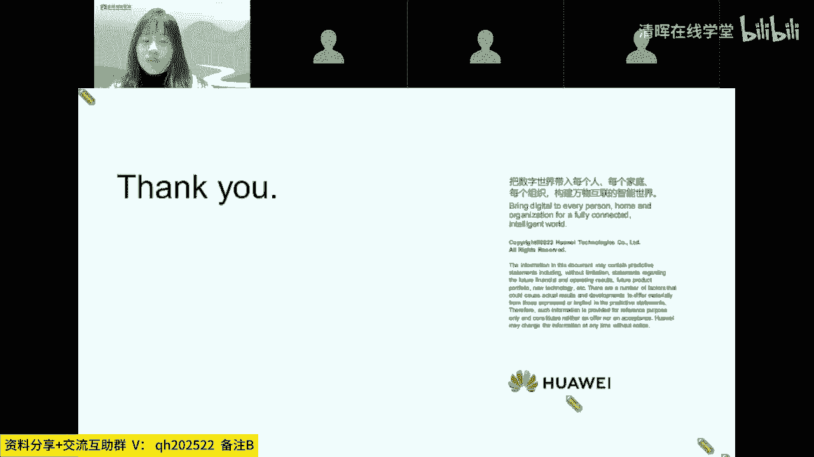
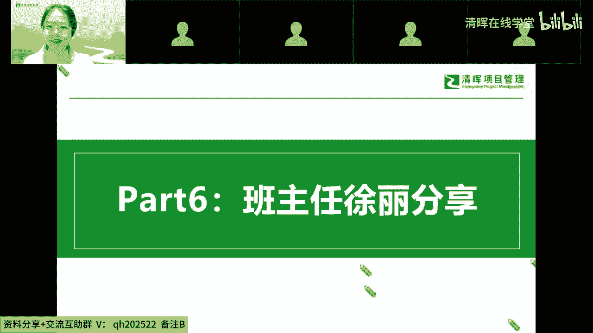
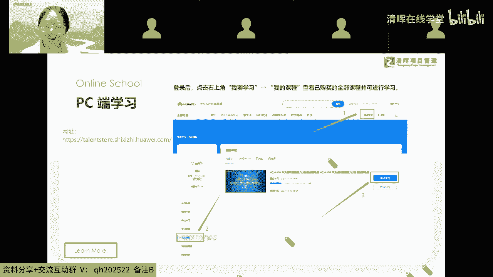
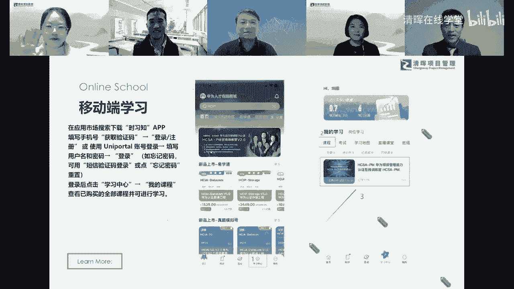

# 精品课程丨清晖-华为 PM研学营 HCSA-PM - P6：5.班主任徐丽分享 - 清晖在线学堂 - BV1QN4y1m7F7

接下来的一部分大家可以看到我吗，哈喽我的小伙伴们，非常荣幸有这样的一个机会，跟大家在这里相遇啊。

那我们今天晚上的话，那我先自我介绍一下，那首先我的名字叫做徐丽，我的英文名叫珍娜，我在那个班级群的备注就是我的英文名字，那呃我的手机号码和我的邮箱都在这里，因为呃，应该大家都是知道我的这个联系方式的啊。

呃如果有不知道的，可以记一下，因为之后如果你们有什么急事的话，是可以给我打电话的，呃我的工作时间因为是周一到周五的工作日嘛，那其他的时间，因为啊班班有自己的私人生活，可能有的时候在忙。

不是那么及时的看手机，有急事的话，记得给我打电话好吗，我在我们班级群，我记得也发了那个我的电话号码，如果有什么真的有什么急事，是真的QQ我嗯，然后小伙伴们呃，让我看一下，我们现在评论区很多小伙伴都在哦。

不好意思，我看了一下我这个PPT，其实我在入班的时候啊，也都给大家就是有发过，那第一个的话就是我们的录播课的一个啊平台，我当时让大家就是注册了，我们华为人才在线商场的这个账号，然后同时让大家同步给我。

我去给大家申请了这个课程券，课程券后面发给大家之后，就是可以自己兑换课程之后，你们就可以自行开始听课了，咱们班大部分的小伙伴其实是已经开始，就是啊进行了学习之旅的，还有小部分呃，比如说今天进班的小伙伴。

还有就是我们啊之前有部分比较忙碌的小伙伴，还没有找班班领券的，那这个时候呢抓紧时间好吗，我们的学习呃尽量就是早一点开始，不要拖，因为有的时候越拖延，你就越想往后拖延，就包括后面大家的这个考试也是的。

就如果你准备好了，然后呃你可以提前来跟我说，然后我们到时候就是班班也可以协助你，就是呃指导你如何去进行这个报考，那我们的呃另一个平台的话，就是我们这个串讲的一个课程，串讲的话，目前是定在每周三。

那应大家的要求，我这边去给大家申请到了，我们之前是七点钟开始的，那因为很多小伙伴可能来不及赶回去去听课，那现在我们就是跟华为的老师那边也商量过了，我们的串讲，后面改到晚上八点钟开始，然后是八点到09：

30这样子呃，目前暂定的话就是每周三的晚上，那之后我也会在礼拜二给大家发邮件，就是提醒大家有这个课程，我们的课程是滚动式的一个串讲直播，那比如说像这周三的话是第四节，那下周三就是第五节。

总共呃一轮的话是12节课，那中间如果就是呃，因为有小伙伴是今天新加入的嘛，可能前面的也没有听，也没有关系，那大家现在可以先去听我们的录播课程，那中间有什么不清楚的问题，那晚一点的话。

班班会邀请我们的答疑老师进到班级群，有什么问题的话，大家都可以在群里艾特他，然后呢呃之前有很多小伙伴跟我反馈啊，想要录播课程，这个的话我也去申请了，那目前的话是还没有确定，等后面确定之后。

那我这边会通知到大家录播，我去申请了，唐同学不用担心啊，那这个呃串讲的话，因为到时候就是在我们的邮件里面，是有一个链接的，大家直接点链接进去就可以了，那所以到时候我都是会邮件通知大家的，那如果有小伙伴。

就是没有办法收到我的邮件的话，请一定要及时的告诉我，一面就是你错过课程好吗，我到时候把这个课程发给大家，也会提醒到大家去收邮件呃，有任何问题的话，请及时的跟我联系，那这一部分的话，大家有没有什么问题啊。

那如果没有问题的话，够了去给我扣个一好吗，有问题的话就及时反馈，因为这个都是跟大家学习相关的，是非常重要的一部分，因为你们要把这个学习这一块先搞定，搞定之后呢，我们去完成我们的模拟考试，我们的结业考试。

那之后呢再去预约我们的一个正式考试，那大家如果要考试，建议就是提前两周可以跟班班这边报备一下啊，让我知道你的考试计划好吗，好的，我看到我们评论区很多小伙伴已经在扣一了，好的，那没有问题。

我们就看一下我们的这个学习的一个路径，那我们学习的话是呃分为就是电脑端和手机端，电脑端的话这个路径我也截图写在这边，大家可以看一下，那按照这样的方式可以找到你的课包。

然后去开始你啊这个录播的课程的一个呃讲课，那如果有小伙伴不清楚这个路径，然后及时的私信我，那我们班所有的小伙伴都是有我的微信的，所以这个呃我我也不担心大家找不着我啊，我也是在大家的班级群里面的。

就是每天最活跃的那个人哦，我可能不能说这种话，今天我看到大家可能比我还要更活跃，就是默默的在背后守护你们的那个人。

那这个是我们电脑端的学习方法，然后大家可以看一下，那还有一个就是我们移动端，也就是你们手机端的一个呃学习的一个路径，大家可以看一下，那如果就是觉得手机端学习更方便，那你就去应用市场里面下载一下。

我们这个实习之的app，然后按照图中的方式可以找到你们的课程，对我主要的话，今天就是跟大家讲一下，那如果有任何的不清楚，大家都及时的私信我，然后同时请记住一下你的班主任是谁好吗。

那目前的话大家还没有什么问题啊，就有任何的啊学习啊，包括其他的一些问题都可以提问，今天很难得是跟大家这样面对面的交流啊，后期的话我们主要就是微信打字，然后还有就是呃实在有情况的话。

可以电话我都是OK的啊，那如果没有问题的话，你们看看要不要给我发点什么，有问题，大家集体拍个照吧，拍个照哈哈哈哈，我们线上的老师可以看一下呃摄像头，然后我们呃云在线拍个合影好吗，诶对我们线上的老师嗯。

包括我们同学对我们在线拍个合影哇，此处Q1下付老师，付老师在吗，付老师在等，你，稍等一下哦，我看到小伙伴有个问题，我先回答一下，申请考试的话，是你们自己申请的，然后考试的一个申请方式。

我在大发给大家的入班邮件，里面有那个操作指南，那如果有小伙伴到时候看了，可能因为他有些可能不清楚怎么操作，到时候可以私信找我，然后我这边可以就是指导一下，嗯对我们云在线拍个照，大家，然后呃卡卡住了。

这电脑卡住了，我刚刚截过了，哈哈好的，我们还得按你这样就可以点一下就可以，K最小的，好的，我们各位哎，对我们各位同学老师调整一下姿势，对123拍个合照，再来一下云合照，这个这招行吗，嗯可以。

这真的不用这样，你要不要加入一下，没关系没关系，我在我在截最后一张，大家摆好pose，来123，嗯我是表情有点奇怪，哈哈哈好，那今天的这个蛮难得会启动的，会有这么多老师，然后来支持呃，那后期的话也呃。

大家小伙伴们在我们的呃，也会邀请几位老师进群，然后一会儿的欢迎仪式，大家可以呃在群里面准备起来了啊，那之后有任何问题的话，也可以去里面随时去交流，我们真心的希望大家在嗯，通过华为项目管理的学习。

能够对之后的工作有更大的帮助，嗯那如果没有其他问题，我们今天啊没喊茄子，不好意思，我们下次喊一下，我问一下，这是温柔同学吗，我看着有有那个昵称，好像是诶，你成功的被小助手记在了心里面。

也我们我们真心老师和沃克老师，可以记住一下我们的温柔同学，因为今天应该比班班更活跃的，就是我们的文龙同学还是对，还有其他几位同学，对对对，后面不要嫌我们的消息太多，那么真的是蛮难得的机会。

几位老师也是在我们班班的强烈要求之下，一定要进群，然后来支持到咱们第一期啊，体会华为研学营的同学，在大家顺利取得证书的同时，那希望能够学到很多的知识，像周星老师说的。

那么来学习华为肯定是想要解决什么问题，那么可以把这个问题写下来之后，通过学习也看一下是否得到了真正的解决，嗯那时间也不早了，正好是09：30，那我们在一会在班级群里面见好吗，嗯感谢各位老师。

感谢我们的黄同学的分享，哎一会儿我们在班级群里面，咱们继续继续讨论好吗，那今天的直播就到这里啊，各位老师再见好。

再见再见再见，拜拜拜拜拜嗯。