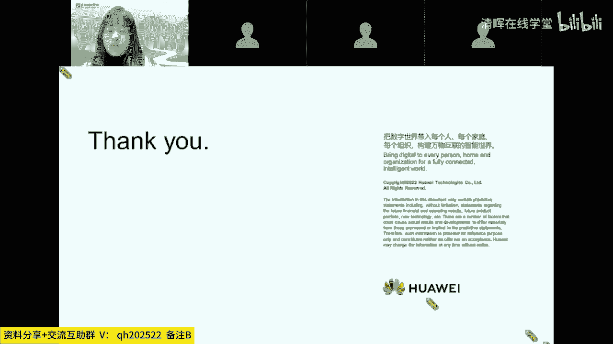
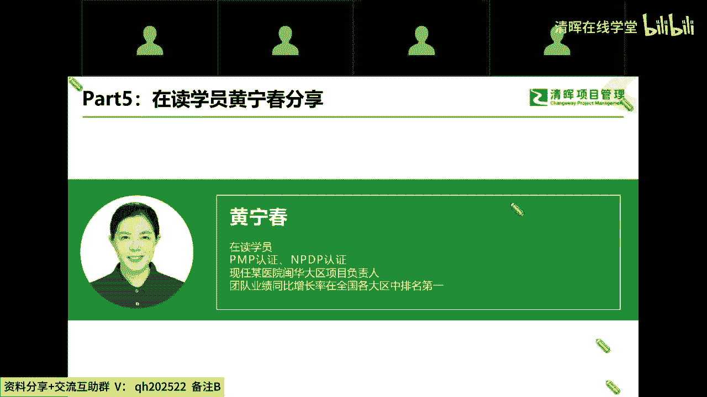
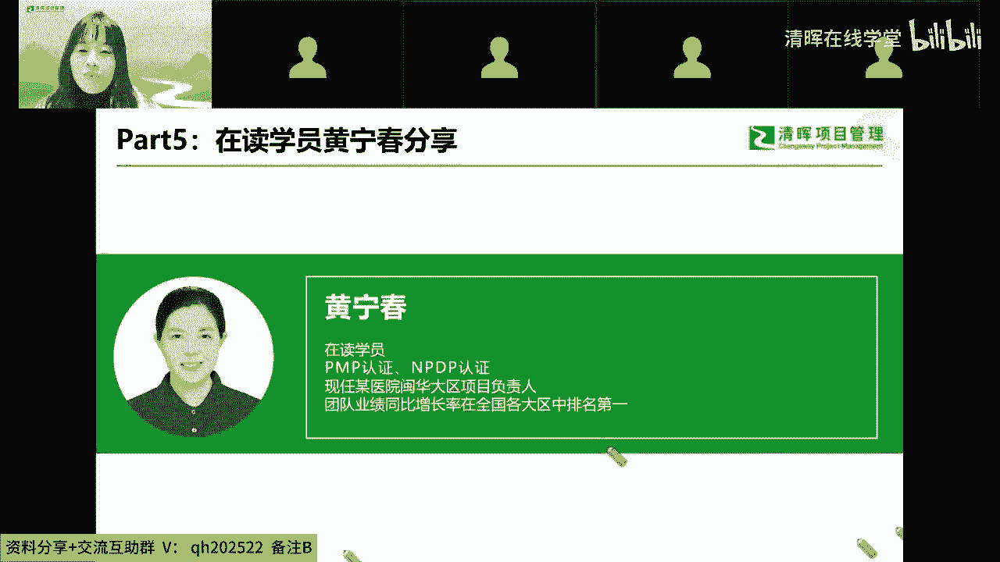
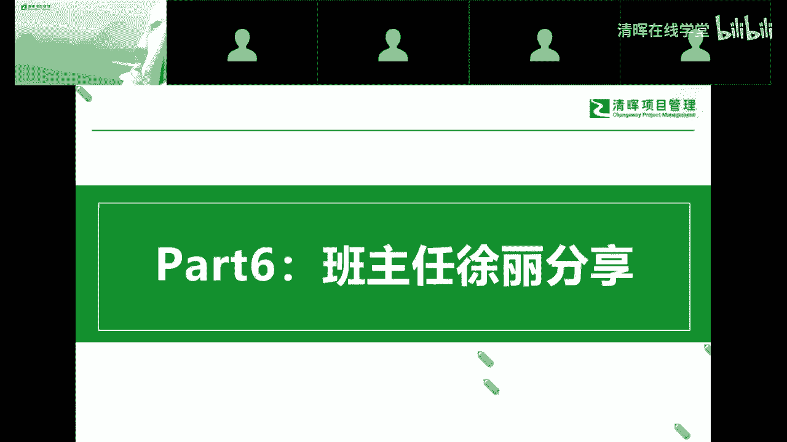

# 精品课程丨清晖-华为 PM研学营 HCSA-PM - P5：4.在读学员黄宁春分享一一课程学习的感受，清晖学习的感受(1) - 清晖在线学堂 - BV1QN4y1m7F7

接下来的一部分话是我们的黄同学啊，我们在读学员哦，也特别感谢黄同学的支持，那在我们刚刚有发布嗯，那么清辉来进行华为项目管理认证，这一块的时候，他就应该是前几名学员就报名了，就对这一块特别认可。

那后面也是在学习过程中有蛮多的收获，跟大家分享，所以说今天我们作为在读学员的诶一个代表吧，也希望是啊黄同学再跟我们分享一下，在学习了应该有一段时间之后，那这个收获呀各方面的跟大家来分享一下哦。

嗯呃黄同学这边可以听到我讲话吗，哦可以听到我的声音清楚吗，啊清楚的，正常的，那这边您现在开始吧，看一下我需要开槽点，现在声音和画面都正常的，嗯我这边可能网络稍微有点问题，或者我先不开摄像头。

可以可以可以的可以的，嗯好好好，尊敬的傅永康老师，张全军老师，张振兴老师，唐辉老师，还有我们亲爱的班班，以及我们的各位同学，大家晚上好，今天真的非常荣幸，也非常开心，有机会作为华为项目管理课程的学员。

跟大家分享我的学习感受。

先自我介绍一下，我叫黄林春，目前在瑞派宠物医院闽南大区从事运营岗位，我是在2019年开始接触项目管理，当年通过了论证，在20年参加清辉的产品经理培训啊，并通过NPDP认证，2022年。

我担任我们公司总部两个重要项目标杆，复制项目和服务体系，项目的敏华大区项目负责人，我们的项目团队经过一年的努力，获得了优秀项目团队战队pk第一名的荣誉，而我本人也因此荣获瑞派赋能精英，优秀经理人奖项。

我在工作当中践行项目管理方法，并因此受益，所以当我在11月2日，看到清辉老师发的华为管理，华为项目管理课程介绍，我没有任何犹豫就找老师报名了，所以当我的班班邀请我，在今晚分享我的学习感受。

我一样是没有任何犹豫，就答应了，其实在2019年考完PMP之后，我一直想找一个项目管理实战课程，但是一直没有找到，当我有终于有机会去报名，华为的项目管理课程的时候，其实我是非常的兴奋。

我记得当时报名完以后，我是忍不住去发朋友圈，把这个课程安利给我身边的同事和朋友，我自己还忍不住在底下评论说，这就是我心心念念想上的项目管理实战课，在过去我想考某一个认证之前。

我都会去网上搜这个证书的含金量大不大，但是像华为的项目管理课，我不需要去问别人，我自己内心就无比笃定，这就是我想要的项目管理实战课，因为这是华的实战课啊，是我们中国人自己被验证成功的，项目管理体系呀。

即使没有任何的认证，我都会报名参加学习的，更何况还有金光闪闪的华为认证，华为的HCSAPM课程，我听到接近40%的进度，这个课我听得很慢，虽然一节视频课的时间只有十几分钟。

但它绝对不是一个我们可以在碎片时间里，不做笔记，轻轻松松就可以听的课，我认为这是一个需要我们专门安排出一段时间，来认真听，认真思考的课程，因为这个课程不仅有理论知识，更有华为真实项目管理案例解析。

情景爱丽思考，以及华为的项目，管理工具介绍，比如决策权力矩阵，干系人管理表，项目范围，说明书模板等等，这些方法和工具，在我看来，我们是学完以后，马上可以照搬到自己工作当中的，非常非常的实用。

最后我想再跟大家分享，我这几年学习项目管理课程，并将它在工作当中去实践的一些感受，呃，我印象很深，当时在华为参加产品经理嗯培训的时候，我们的边登峰老师有给我们介绍一个课程。

是梁宁老师在得到的产品思维30讲，那杨宁老师在一个这个课程里面给我们介绍到，说，他认为产品能力是人生的一个底层能力，因为那是训练一个人判断看信息，抓住要点，整合有限的资源，把自己的价值打包成一个产品。

向世界交付并且获得回报的人力，其实我想，项目管理能力又何尝不是一个人的底层能力呢，试想想看，我们的哪一项工作不是可以通过启动规划，执行，监控收尾这五大过程组来进行更加有效的管理，从而获得更大的价值输出。

而项目管理中的目标制定团队领导，干系人管理需求管理，沟通管理，风险管理，变更管理监督执行收尾与总结这些知识领域，它又不适用于我们的哪一个行业，哪一个岗位，哪一项工作呢，如果把我们的职场比喻，腾江湖。

我的职业比喻成不同的武术派别，那么我想项目管理能力就是我们的体能，练好体能是练好一切武术的基础，项目管理能力是我们在职场江湖中，安身立命的根本，希望在接下来的课程学习当中，在华为和清辉各位老师的指导下。

我能与同学们一起强身健体，谢谢大家，好的谢谢黄同学的精彩分享啊，那我们今天是接下来的第六个环节。

也是重磅环节哦，大家应该在报名清灰之后，其实接触最多的就是我们的班班对吧，我们讨论区里面知道我们班班怎么称呼的吗，我可都打出来了啊，那么接下来的话呢是由我们的班班徐老师，给大家分享一下啊。

我们目前学习中的一些学习资源吧，或者是备考相关的，因为在接下来的学习过程中，那除了我们的老师啊，在我们在项目管理，专业知识上会跟大家有交流之外，其实班班也是很重要的一个干系人哦，那么在学习嗯。

我们各种的通知啊，然后以及辅助备考督学，然后其他的学习指导方面，都是由班班来跟大家对接的，那么我们互动区里面有一点掌声好吗，你们的班班要上线了，不要只在群里面互动哦，大家在讨论区里面。

这个让我看看大家都还在，要不然班班不出来了咋办呀，评论区里面小伙伴在的话，可以扣一下666，对你们的班班马上上线啦，班班上线啦，哈哈哈哈好的对，芭芭露脸了啊，我走了，下面换成芭芭啦。

