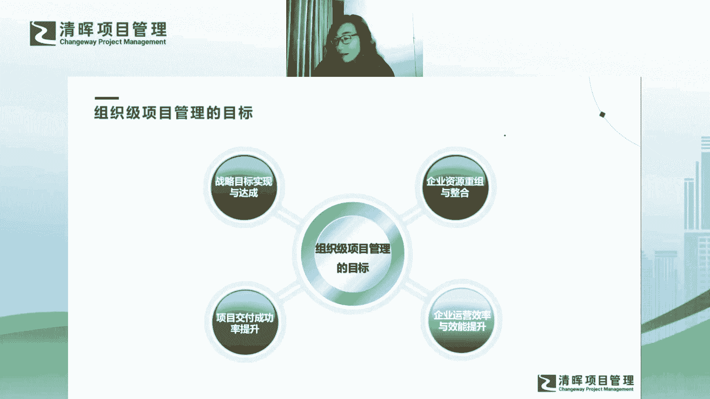
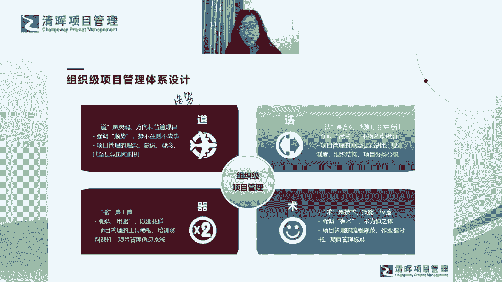

# 组织级项目管理体系建设框架 - P10：组织级项目管理设计 - 清晖Amy - BV1EZ421g7nZ

然后大家能够了解到这个逻辑之后，然后我们下面就说怎么设计了，对不对，我们今天把怎么设计，我们整个的全景视图给大家讲完，下次我就告诉大家怎么去建对吧，我们下次讨论怎么建的问题啊，然后后面再给大家再拆解。

每一个具体的模块怎么做啊，然后我觉得这个体系，大家是不是就就完全是是逻辑闭环了，对吧嗯好，那我们讲讲设计哈，设计这事呢其实嗯我想分四个层次给大家讲，因为你会发现道法术器呢，其实很多的很多的这种啊。

课程中都会用到这四个概念哈，嗯但我我其实是通过道法术系呢，这是庞然大物哈，我其实给它分个层次对吧啊，其实他也是会有一个由表及里的过程哈，那我会这么来倾向给大家分层次，第一是道啊，道是什么呢。

道更多的是我们的所谓的灵魂方向，和普遍规律哈，到你会发现是什么呢，就是当你当你想在一个企业里，从0~1去建立项目管理体系的时候呢，你就会发现这个企业，因为我们现在很多企业要引入项目制哈。

当你是从0~1的时候，你会解决，你会最急迫于解决一个问题，就是你会发现大家根本就不懂什么是相关，然后大家跟你说话的这个你们的语言的，这个说话的语言都不一样啊，大家给你跟跟你说的这个语言。

你们的很多的概念，或者很多的这个就是语言不通的感觉对吧，然后这个时候呢，你要做的一件事情就是步道对吧，就大家没有这个项目管理的理念，大家没有这个意识，然后大家没有这个观念。

大家也不知道项目管理是什么对吧，你就会感觉到，这个时候，其实就是没有这个项目管理的氛围和时机，你没法去引入项目管理对吧，因为大家没有这个语言，你就需要大家去重新去学习一门语言，才能互相交流。

你就会有这个感觉好，所以布道的整个的过程更多的是什么呢，更多的是我们要造势啊，更多是我们要造势啊，就是我们要有一种势能，这个势能能够帮助我们再去，比如说你在谈流程机制啊，你在谈整个的方法论啊。

然后你再谈怎么去怎么去落地的工具，技术的时候，对不对，你首先要什么呢，你首先要大家要要有这个整体的一个一个，一个一个趋势啊，你有这个趋势之后，你才能够顺势而为，对不对，势不在则不成器啊，则不成事啊。

是不是这样的一个概念对吧，所以呢关于道德这个事情呢，我觉得啊，我特别认同于我们小米的创始人，雷军的一句话哈，雷军前两年有一句话特别火，他是怎么说的呢，他说台风来了，猪都会飞啊，这句话为什么火呢。

我觉得这句话其实本质上它蕴含了一个道理，就是他其实想雷军想强调的是，你逆天改命不如顺势而为，对不对，你一定是创业，一定要去顺势而为，所以你顺势而为了之后，其实你没有翅膀的动物，你都可以飞起来对吧。

所以你就是就是要有这样的一种势能啊，所以我们强调布道和造势，这个是我们去推行整个OP m体系建设的时候，一个最基本的一个一个一个逻辑好，这是第一个道啊，道德层面啊，然后就是法的层面对吧。

嗯当然道呢道德层面不是说，你的你的整体的势能，全都要全都要布局完整之后，你才可以立法，因为这个道法术器，其实你这个各个环节其实都是齐头并进的，你彼此之间是互相牵制。

然后才能够有一个螺旋上升这样的一个规律哈，所以你在布道的同时，你就可以开始去立法，然后布道的这个工作还可以继续去做，对不对，那法呢这个时候你就要可以去引入方法，规则和指导方针了，对不对。

法呢强调德法对吧，不得法则难得道，如果你光有道的话，你不去立法，大家也不知道要做什么，对不对啊，所以法的层面更多的是，你要去做项目管理的顶层的设计，你要去做规章制度，组织结构。

分类分级这些相对来说比较high level的事情对吧，先去给大家有一个整体的一个框架啊，就好像今天我们讲的内容一样啊，就是法对吧，法的层面啊，然后再往下才是术对吧，大家就发现它其实是层层层层下沉。

层层分解了，到了术的层面，更多的是在法的基础上，我要有技术，要有技能，要有经验，对不对，我再有框架设计之后对吧，我要有规程啊，规规章流程和这种规范对吧，我会有作业指导书，我会有一些相应的标准。

然后这些东西能够辅助我最终呢能够落地啊，所以树呢会在法的层面上更加往下沉啊，所以术和道大家会发现数和道的关系哈，我特别同意一句话叫做啊有道无术，术尚可求，有术无道止于数啊，什么意思呢。

就是说当你掌握了事物的发展规律之后呢，其实你要去寻求术，寻求技术方法，技巧是相对比较容易的对吧，那相反如果你只有解决问题的办法，你却不懂得发展规律啊，你却不懂得道，那最终呢其实你也只是一个方法哦。

那你有了这个方法之后，问题稍一变化，你其实就很难去举一反三哦，所以大家会发现，为什么现在我们嗯说到说到这个，说说到这个观点，为什么我们现在很多企业的员工，其实呃他他很难去晋升到更高级别的经理啊。

甚至更高级别的总监去当一个真正的管理者，其实他缺的是什么呢，大家会发现他缺的并不是法和术，他其实没有，他没有，他缺的并不是实操的一些落地的，一些具体的经验技能哦，他欠缺的反而是道德层面对吧。

他没有这种道德层面，他其实没法没法去拔高，他没法拔高的话，他其实是不能够晋升到更高级别的，这样的职业经理人好，所以这就是我们现在为什么企业里面，其实你会有你会有瓶颈对吧，所以大家一定要注重提升对吧。

就你不仅要法和法和术，你还有道啊，这样才能够啊真正变成一个晚辈的人啊，然后最后就是气了哈，气特别好理解，就是气是工具对吧，有了法术之后，你就要有气，因为信息系统工具模板啊，包括一些课件。

包括啊我们去去去做一些事情的一些啊，良好的一些普世的大家通用的一些工具，它其实都可以帮助你更好的去用气，然后去以弃采呃载道啊。

所以更好的把我们的法和水和落地啊。