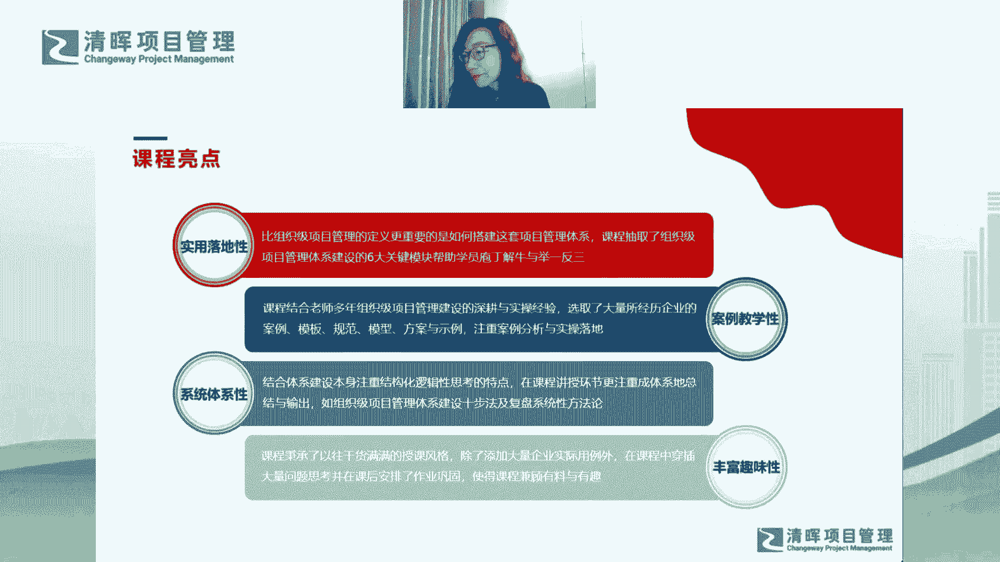
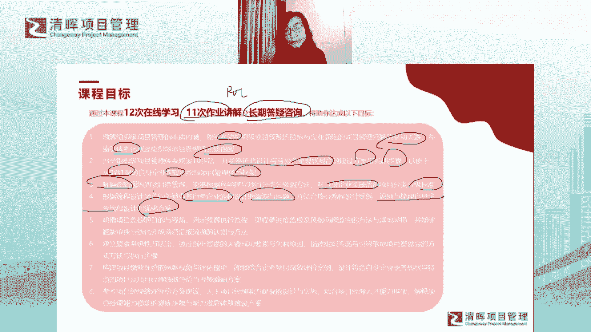
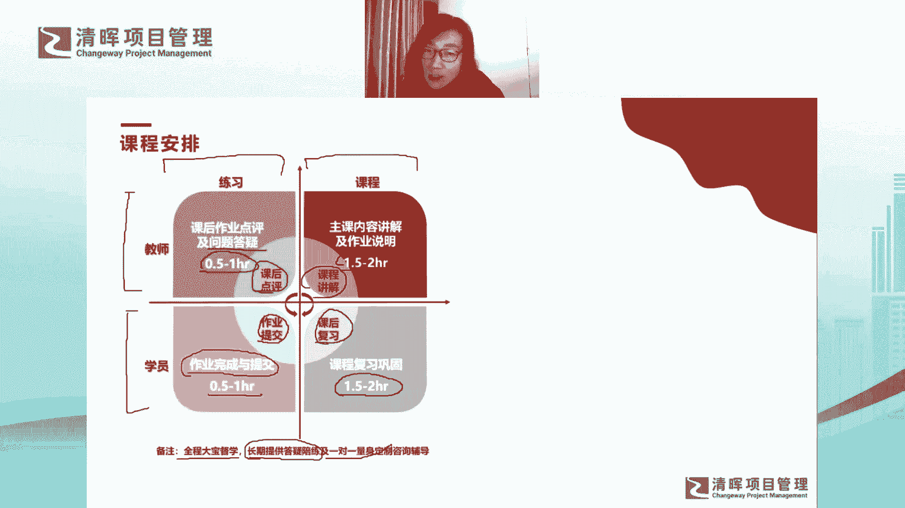
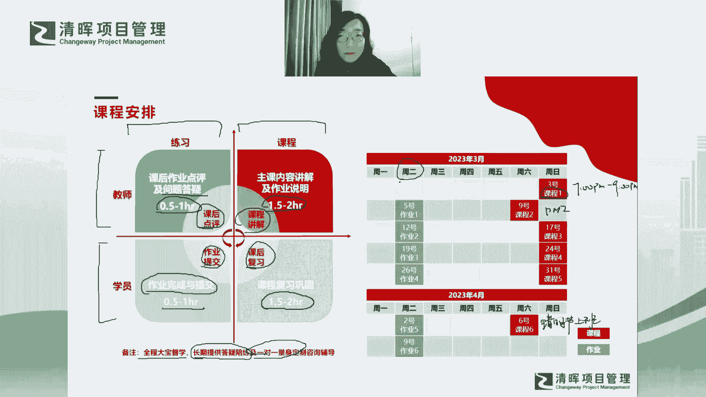
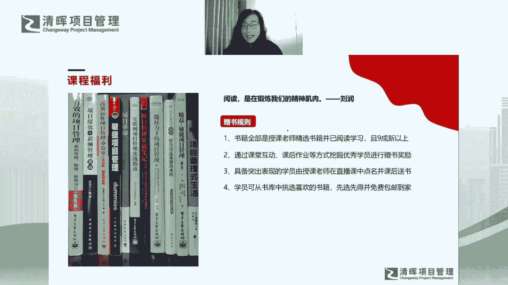
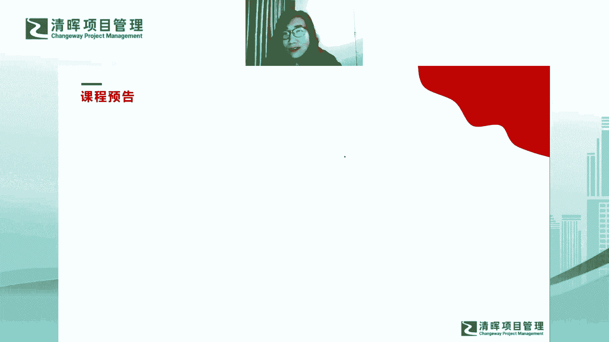
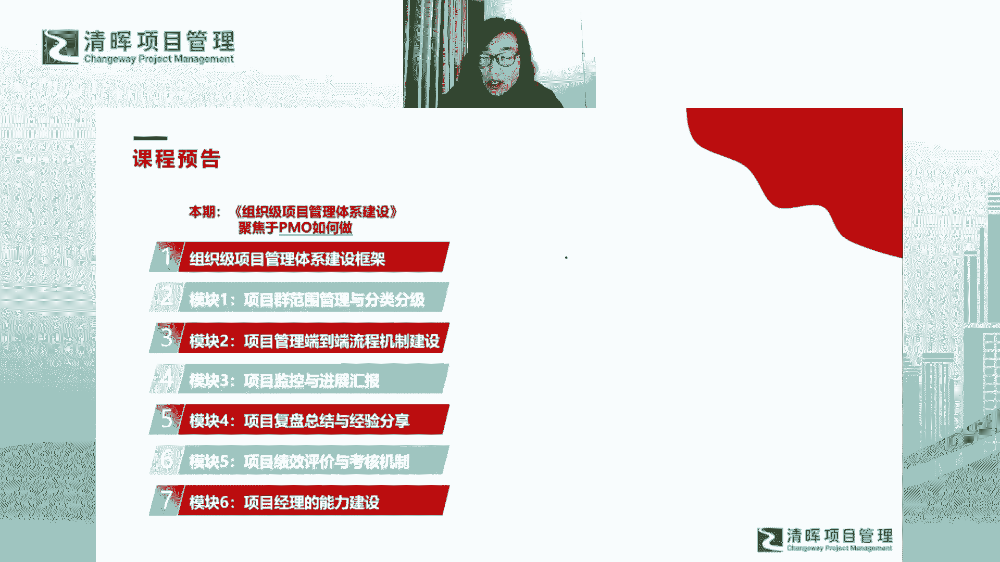
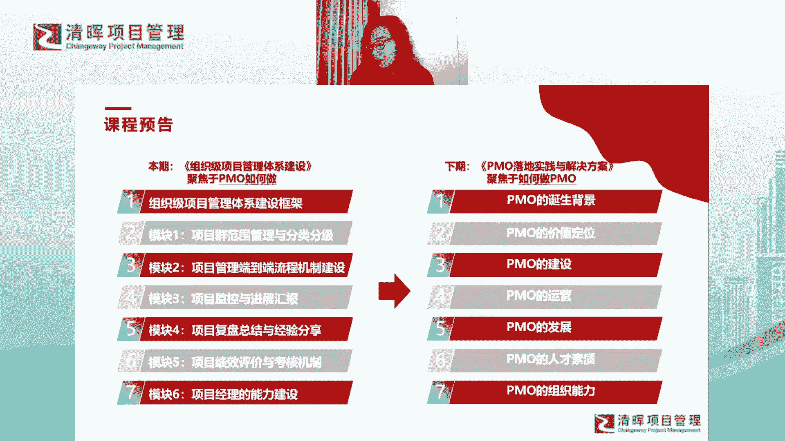

# 组织级项目管理体系建设框架 - P4：目标+安排+福利+预告 - 清晖Amy - BV1EZ421g7nZ

好啊，那是这样的一个亮点哈，呃然后我们的目标哈，呃目标呢嗯大家了解一下，其实我们是12次课程，然后这12次课程呢我们会分成两个阶段，然后3月到4月我会给大家先去讲六次课程，然后我们剩下的六次课程。

我会放在也是上半年吧，我们在安排一个时间，因为相对来说大家会发现体量非常大的课程，其实是需要给大家一个消化和吸收的时间啊，所以我也希望我们的课程其实是有节奏的，就不要一股脑全都给到大家。

然后让大家消化不良哈，然后我们12次的课程呢，我们前11的11次的课程会有作业啊，包括今天的课程，今天是第一课，对不对，今天的课程就会有作业啊，所以我们只有12次的课，第二第12次的课程是没有作业的啊。

所以前11次课程是有作业的啊，这个作业大家一定要做哈，就再次强调这个作业你为什么要做呢，因为你做完了之后我就会讲解对吧，你想想这个作业如果你做了，你一定会深入思考和学习，今天的所有的课程内容对吧。

你才能做得出来这个作业，然后你做作业的过程中，你你就在反复的去思考对吧，你在反复的咀嚼啊，然后你在做作业的过程中，可能你会产生新的问题，新的疑问对吧，你有了这个问题，你肯定会问我或者是问同学对吧。

你肯定会交流对吧，然后关键的观点就是你做完作业，我会从每次做作业的同学中，相对比较优秀的作业中，然后挑选出来，我在下次课的前半个小时，我会给大家做一个作业点评哦，所以大家又想到，如果你做了作业。

而你的作业又被挑选上去做了点评，这对于你自己的学习和提升来说，是一个多么大的机会哦，所以大家真的要呃我，我是觉得大家一定要珍惜这样的这样的机会哦，就是给自己提升的机会，既然你花了时间来听这个课程对吧。

你为什么不让它的收益变得最大化呢，对不对，我们每个人都是项目管理专业人士，我们做项目的时候是不是要考虑项目的RI，对不对，或者叫你要去做项目的成本效益分析，对不对，你希望你投入最少的成本，但对吧。

那所有人我们都来听这个专栏，我们都花了时间去听，那为什么你不让他的收益变得最大呢，对不对，这是一个最基本的一个逻辑，对吧，嗯嗯然后最后呢我们也会有长期答疑咨询啊，这个当然大家哦。

大家直接线下跟我互动就可以了啊，然后最后呢目标，我觉得这里我不想给大家念了哈，但大家注意我的整体的课程设计逻辑，其实在目标里有有有一些体现，比如说我希望大家能够看清看清联动关系，对不对。

然后大家能够体系化的去理解全景视图，对不对啊，然后大家能够什么呢，能够去去设计，和自身企业现状契合的一些方案和步骤，对不对，然后你可以从0~1，去帮助自身企业去构建体系框架。

就大家注注意我所有的这些目标，其实是是希望我们这个课程中，能够给大家带来的东西，包括你看你要解码战略对吧，你当你做组织及项目管理的时候，你可不仅仅是在做项目管理，你真的是要跟战略联动的。

你要跟战略有衔接，所以你要解码战略，对不对，然后呢，同时你对自身企业实操落地，你要有标准对吧，然后你要结合起，你看永远是结合企业去设计核心案例，包括你要自查企业的漏洞和问题对吧。

这些都是帮助大家去落地的对吧，识别和梳理自身企业的一些优化方案啊，我希望大家能够把课程所学的内容，应用到自己所在的企业中对吧，这样才是能够真正给大家带来的帮助。

嗯好OK那最后呢我们说一下整体课程的安排哈。

那整体课程的安排，大家看到其实我们可以分成呃这么来看呢，首先是从课程上来讲哈，课程来讲呢，我们每次课程是一个半到两个小时的时间，那同时呢，我希望大家也能够，花同样的时间去做复习和巩固啊。

就大家也要花同样的时间去回放啊，或者是做课程笔记呀，然后大家去不断的去反复的去拒绝对吧，然后同时呢那竖着看啊，我们从练习的角度来说呢，你的课程复习巩固之后一定要去做作业，刚才提到为什么要做作业了。

对不对，那作业呢我不会给大家留太多，也不会给大家太多的工作的这个工作量哈，大家基本上花半小时到一个小时的时间，其实你是可以做作业的哦，然后同事在做完作业之后呢，那我会给给了给大家做下次课啊。

下次课给大家做呃，点评答疑啊，这个答疑呢我也会花同样的时间给大家来做啊，所以这是我们从课程和练习的角度，大家来看啊，那如果要横向来看的，就是呃老师要做的事情，和大家要做的事情是什么哈，那从我的角度来讲。

我第一是要讲课，对不对，我要做课程讲解，最后呢我要做课程课后的点评，对不对，那大家关注一下自己要做什么呢对吧，自己要听课，要做课后复习对吧，以及作业的提交对吧，这是大家要做的事情。

嗯那是不是就说明白了啊，然后我们是全程大宝都学啊，清辉大宝的服务特别好哈，呃这个就不用我再做广告了哈，然后长期的啊提供答疑陪练哈，这个是大家可以长期找我的啊，我们这课程不管是什么时候结束。

大家都可以长期啊长期来去来去跟我沟通啊，我来给大家提供一些相关的讲解哈，然后一对一的量身定制辅导。

这也是可以的了啊，嗯好了，最后呢大家关注一下我们的整体的课程哈，呃然后我们的课程今天是第一次对吧，我们今天是3月3号第一次课程啊，然后我们基本上所有的课程，都会安排在周日的晚上七点到九点哦。

七点到九点啊，这个大家关注这个时间哈，哦然后我们有两次课程为安排在周六哈，这两次课程为什么安排在周六哈，特意要跟大家说一下啊，因为下次课程呢安排在周六，是因为周有一个PMI的考试哈。

下周日PMI的考试全部集中在周日，所以我就把课程提到周六啊，然后我们4月份的第一次课程也是周六，是因为周日正好清明节我们有个倒休哈，这个清明节倒休，这这一天是要上班的啊，周日是上班日啊。

所以我给改到周六，这样的话大家听课会方便一些嗯，然后最后呢特别要注意就是什么，这个作业提交时间一定要注意啊，每周二啊，周二提交作业，周二大家一定要提交作业啊，这个周二提交作业，那意味着什么啊。

准时提交作业，意味着你被点评到的几率是非常大的啊，如果你周三再去提交的话，可能老师就没有那么多时间，看到大家的作业了啊，这个不被点齐名的话，可能会有呃，可能会有很严重的问题啊，呵嗯那大家注意一下吧。

啊就是周二是提交作业啊，就咱们听完这个课程，基本上嗯你明天再复习一下啊，其其其实周二你再花个半个小时，基本上就可以提交了啊，大致是一个趁热打铁这样的一个节奏啊。

好啦说到最激动人心的事情了啊，大家一直在想啊，之前老师拿了那一摞书哈，这个书怎么送给大家哈，这个书可能不仅仅是我目前屏幕显示的，这么多哈啊我会有一个详细的书袋哈，那首先呢聊一聊阅读这件事啊。

因为我自己本人是特别喜欢阅读的哈，然后我不知道，我不知道大家怎么看看阅读这件事哈，然后我也用了润总这句话哈，我我特别认同啊，就阅读是在锻炼我们的精神气质啊，因为曾经有一个有一个小伙伴哈。

他问过我一个问题，说你那么喜欢读书哈，你读了那么多书都获得了什么呢，就觉得好像你读书吧，每次自己看完书吧，反正看完就忘啊，然后也没有真正深入，所以也没真正吸收到自己的内心。

也没有给自己带来任何增值和收益啊，然后他就问我这个问题啊，你为什么那么喜欢读书，你读书觉得获得什么啊，然后我记得我当时是这么跟他说的，我说平时多读书呢，其实可能你一时半会儿也看不出有什么变化。

但是呢但是但凡你通过阅读日积月累的过程，你的气质，你的谈吐，你的胸襟，你的格局就真的会有所不同哦，然后大家会同意一句话，真的是我，我是觉得腹有诗书的人，它会不拘泥于鸡毛蒜皮，也会不困惑于意识低谷对吧。

所有你读过的书，你走过的路，你见过的人都会反过来这样哦，大家认不认同哈，所以嗯这个观点呢其实你会发现有些验证，比如说啊，比如说大家会看到前前段时间东方甄选啊，董宇辉哈。

这个董宇辉有有有相关的一些网上的一些啊，爆料的一些事件哈，其实有一些负面消息，其实我们不谈这个啊，但你会发现董宇辉为什么他火了哦，你就会发现他在直播间真的是什么，你会感觉到这个人真的太真的太有内涵了。

对不对，他真的是腹有诗书，对不对，他真的可以出口成章，他每一次出口你就感觉到它真的是一篇小作文，对不对，所以大家会不相信他的，他的他的所有的出口成章是背后有团队，对不对，这也是对他莫大的一个一个认可。

对不对，所以这就是我觉得这就是啊，这个案例就说明了，阅读能够给我们带来的东西哈，所以我也希望大家是啊，跟我一样喜欢阅读的人吧，啊那个就大家喜欢看书吗，我说了这么半天，我说了半天有没有有没有质疑。

质疑我就像我那个小伙伴问我，你读了这么多书有什么用啊，嗯大家有没有喜欢看书的小伙伴，如果有的话，可以在评论区啊，扣个一不好，扣个一啊啊，不喜欢看书就扣个零就好了好吗，不喜欢看书就不送你这些书了好吗。

扣个一啊好，那我继续啊，然后我们就揭晓送书规则啊，首先呢这些书大家知道，其实我一开始就说这些书是嗯，是我我全部我自己读过的，而且是压箱底的书，所以全都是我的精选书籍，然后对书呃，读书越多的人。

其实他对于书会越胆越来越挑剔啊，所以一定都是相对来说比较经典的书，而且相对也比较新哈，所以大家不用嫌弃啊，虽然这些书都是二手书哈，不用嫌弃啊，他的这个知识的精华是无价的啊，然后怎么读书很简单。

我们有课堂的互动啊，大家会来跟直播课，课堂会有互动吗，你看我们现在不就在互动嘛，大家都在扣一，对不对，然后课后还会有作业，作业我会选，我会挑选去做点评，所以在这个过程中，我相信跟大家之间会有很多的联动。

这过程中我一定能够看出谁是真正优秀的学员，对不对，我们优秀的学员其实就可以有赠书的奖励了，对不对，那每次呢啊我在直播课中点名的同学啊，可以作为这个监给大家一本书，然后我到时候呢我把大家这个我把我。

我把我的书单发给大家啊，然后大家从里面去挑对吧，然后挑完了我给大家免费包邮啊，所以大家一定要注意，是有一个有一个观点是什么呢，有一个重要的点，就是你一定要早点跳这个书对吧，人家书是有限的啊，就这么多书。

你说你挑晚了，最后就没得挑了，对不对，所以你要早一点让我发现，让我发现你的优秀，对不对啊，然后让我让我认识你啊，然后你就可以早点选书了，对不对哦，所以这些书要送给大家的啊。

嗯好了，那哎呀说了这么多哈，最后的最后哈，在正式开始课程之前。

我再给大家做一段小小的预告哈，那我们这次的课程呢啊，这次的课我们是一个中心六个基本点，对不对，它就组成了我们第一章以及后续的六章对吧，那组织级的项目管理体系建设这一课啊。

更多的是在聚焦于作为PMO这样的一个组织，我们如何去如何去把组织机，项目管理体系建设起来啊，如何去把它运营起来，如何去让它落地，对不对啊，所以我会教具体大家很多的工作啊，很多的技能。

很多的事情我们怎么去做哦，我们具体怎么去做这些事情。

会给大家很多的很多的内容啊，那当你想做这个事情的时候呢，你就会发现其实他会需要一个一个组织，对不对，他会需要这样的一个部门去做这个事情啊，所以呢他会引起我们引引发出，我们其实还有一期课题要单独去考虑。

PMO这件事对吧，因为你会发现不管你是建一个PMO，还是说你建一个建一个叫什么的类型的部门啊，总之它其实是需要一个组织去把你所有的这些，OP m体系建设的事去推行落地的对吧，那PMO也非常重要。

如果没有PMO这样的一个部门，你就会发现今天你让A部门做这件事，明天让B部门做这件事，那这个事情就变得没有体系了，就变得很凌乱，对不对，所以呢我觉得需要给大家再有一个课程。

就是他一定要解释PMO是怎么去落地的对吧，PMO是为什么去诞生，它在什么样的契机下诞生对吧，那诞生之后他怎么去给自己找到定位对吧，然后PMO在建设运营和发展过程中，你会发现。

PMO其实是一个很容易有困惑的部门，对不对，那为什么我们现在很多本土的企业，对于PMO来说，建了拆拆了建对吧，那p mo也容易被边缘化，pm也容易感到迷茫，我不知道今天有没有做PM的小伙伴。

我说的这些你大家有没有感同身受啊，其实PMO有时候经常会，做着做着就就不知道自己要做什么了，对不对，所以PMO怎么去找到自己的归属感对吧，然后你你你把p mo这件事做好对吧。

然后你才能够有有有你才能够成长出嗯，整个这个角色的整个他的能力对吧，对于人才素质和能力的要求，以及pm的组织能力怎么去建设，所以这个话题呢，我觉得更好的是这一期下一期的课题。

更好的去支撑于我们这期的课题，我们如何去做这个组织级项目，管理体系建设的工作啊，所以下一期的课题呢，我会安排在我今年会给大家安排的吧，具体时间我现在也不知道啊，然后课程也没都全都没有写出来。

具体安排我觉得会在下半年，比如说Q4的时候给大家再去安排，如果大家感兴趣的话呢，也可以来参加我们下期的课程，这样的话呢呃别管PM还是OPM哈，而这三个字母你就把它全都搞定了，对不对啊。

