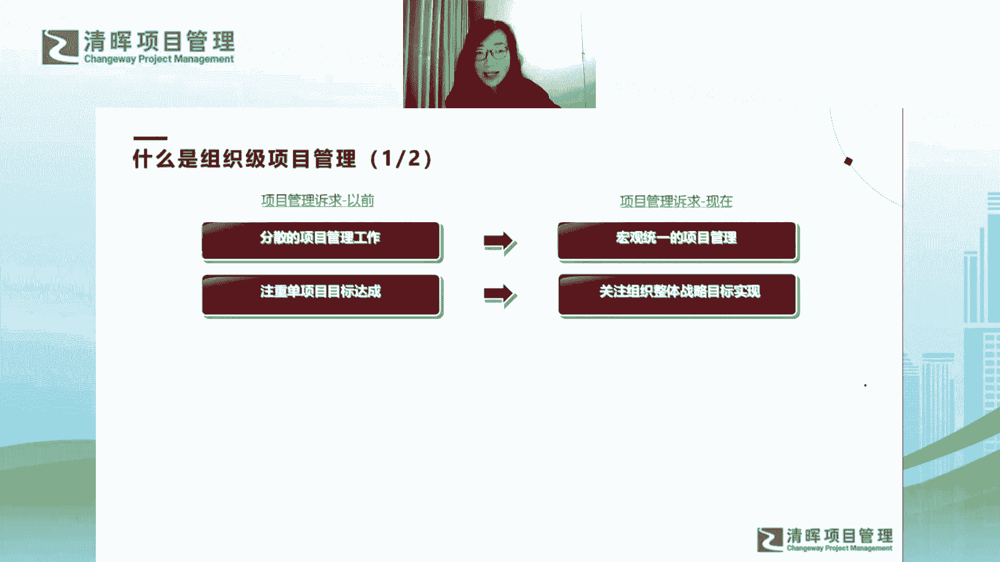
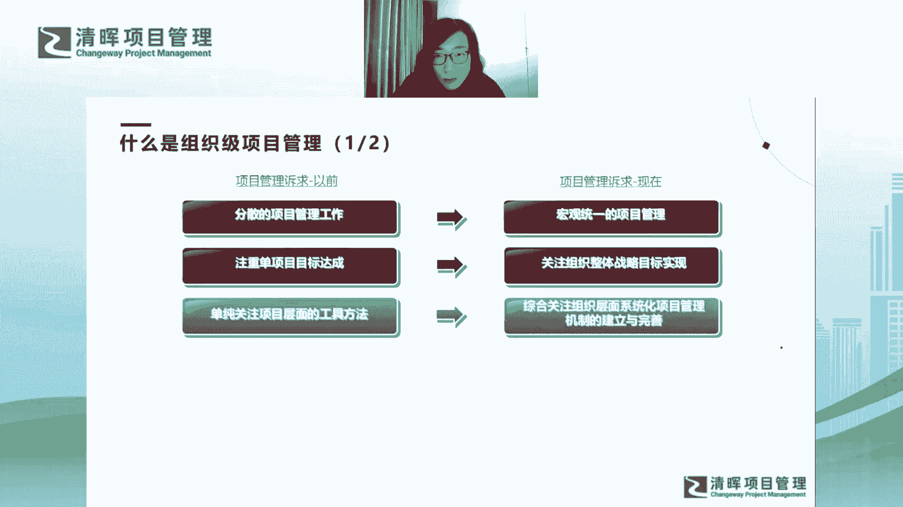
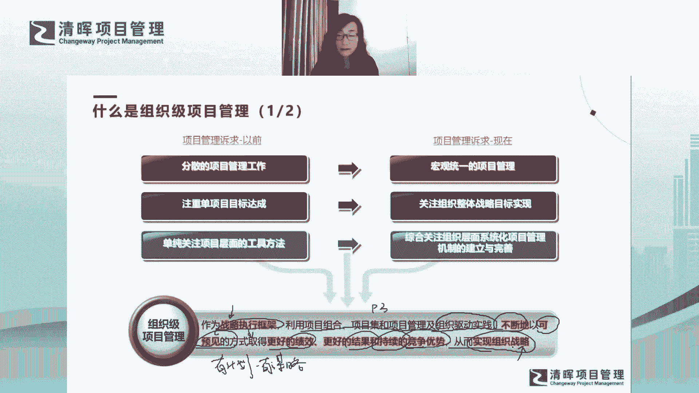
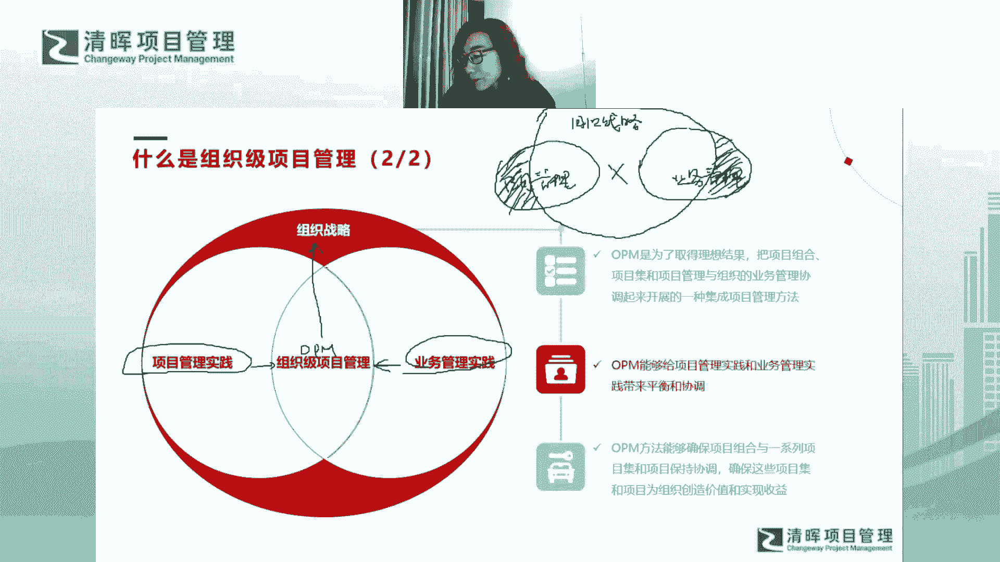

# 组织级项目管理体系建设框架 - P7：什么事组织及项目管理 - 清晖Amy - BV1EZ421g7nZ

那提到了嗯问题啊，那我们来看看什么是组织级的项目管理，这个国峰同学啊，宁静致远啊，跨部门协调资源有什么好的建议，嗯这个是个好问题哈，我简单答一下吧，好我们一般我们一般有问题答到最后哈，我简单答一下。

其实跨部门协调资源有什么好的建议，最主要的就是，你要把不同部门对于这个项目的优先级，你要把它对齐对吧，这是最大的一个痛点啊，怎么去对其优先级，比如说你觉得这个项目是一个S级的，这样一个项目。

你的优先级很高，但对方不认为，对方觉得这事只是他的选择之一啊，这个事情你是没法协调优先级的对吧，怎么去让他也把这个项目的优先级去提对吧，你可以用很多的方法，包括软技能啊，包括去说服啊。

当然你也可以去升级对吧，你也可以去找更大的领导，你让领导和领导之间对话，然后让彼此之间达成一致，就是这个项目是不是要达到这样的量级对吧，领导之间决定决决策，这个事情的确达到这个量级。

那自然资源会有所倾斜对吧，我觉得是这样啊，这个跨部门的资源协调，我其实还有很多很多的经验哈，好继续来啊，那我们就不耽误时间哈，呃所以刚才多讲了那么多问题，我们就提到了，其实我们的项目管理诉求是什么啊。

我们我们以前的诉求和现在的诉求，会变得不一样，对不对，以前我们更加注重分散的项目管理工作，我们更加注重单项目的管理，我们更加注重每个部门各自为政，百花齐放。

但现在我们需要有宏观统一的项目管理机制，对吧，以前我们注重单项目标达成，但现在我们更关注组织层面，我们如何去保证战略目标实现，刚才提到战略衔接的问题，更多的我希望我自己日常的项目管理的工作。

我日常的项目执行，能够为组织战略目标的实现做出贡献，对不对，这是现在我的诉求。

以前我更加关注项目层面的工具方法，现在我要关注的是组织层面，我如何去系统化地去做项目管理机制的建立，这些才能给组织提升它的效能，让组织能够呈现更好的业绩，对不对啊。

所以我们的诉求发生变化之后呢，大家都会发现我们如何去解决这个问题啊，我们引出组织及项目管理，那组织级项目管理呢，我会从定义上给大家讲啊，这个定义我认为非常非常经典好，但大家不要一带而过，读过去了。

其实就没有读到东西，我给大家讲一讲我的理解哈，首先OPM它是一个战略执行框架啊，作为一个战略执行框架，这词特别重要啊，为什么呢，战略执行框架就说明它是上乘战略，下起执行的。

就他一定会去把战略和执行去产生关联，去产生衔接，那他怎么去产生衔接啊，它是利用项目组合，项目集和单项目管理，这是P3啊，这是我所谓的P3以及组织驱动实践，你看它包容的内容可不仅仅是P3P3。

这这这事就已经很复杂了对吧，但是它还包括组织驱动实践，什么叫组织驱动实现啊，组织驱动实践是指的是我们的组织结构啊，包括我们的组织文化，包括我们组织内部的业务专有的技术啊。

以及我们的人力资源管理的实践等等，这些都是组织驱动实现，你看这个领域是不是就变得大了啊，就变得很大对吧，然后呢他又利用这些东西干嘛呢，他要不断的以可预见的方式，让组织取得更好的绩效。

更好的结果和持续的竞争优势，说白了就是他要给组织，让它呈现出更大的效能，它要让组织呈现出更好的业绩对吧，他要让组织能够获取更多的市场份额，这就是他能够给组织带来的东西好，但是他是以什么方式给组织带来的。

大家会关注到哈，第一个非常重要的词哈，你看它叫不断的啊，或者大家看这叫持续的，它为什么是不断的和持续的，就说明它是一种能力，这个能力当你长出这个能力之后，他不是说偶发性的。

比如说今天我就我就我就考了个100分，那明天我就我就考了个不及格，不是这样的，如果是这样的话，它不叫持续的，它不叫不断的，对不对啊，他其实是你的一种能力，当你有了这种能力，你其实每次都可以考100分。

对不对啊，这第一第二是什么，大家看关键词叫可预见哦，可预见说明是什么，说明是有计划而为，本身项目管理是一种呃，相对来说比较计划管理的这样一种导向的方式，所以你会发现组织性的项目管理也是一样。

我实可预见就说明我是有计划对吧，我是有计划，然后同时我也是有谋略的对吧，我是有谋略的，说白了我是我是我是提前是有嗯，提前是有规划的对吧，提前是有预谋的，我是我是未雨绸缪，再去谋划一件事情。

然后最终我才可以得到这个东西，我才可以得到这个能力对吧，然后最后的一句话，从而实现组织战略，你会发现这句话它的定义是从战略开始，然后又以战略结束啊，所以你会发现组织项目管理我们一定是什么。

一定是战略导向的对吧。

一定是最终为战略作出贡献啊，那么嗯给大家一个图哈，进一步去说明我们组织级项目管理，如何为战略达成去产生贡献啊，这张图呢大家会发现哦几个圆圈哈说明什么呢，就是你会发现企业内部的工作呢。

其实有很多是项目管理实践哈，比如说我们有一个PO，他在做很多项目管理的最佳实践对吧，他在做组织内部项目管理实践的传播啊，同时呢我们也会有很多的业务部门，那业务部门一定会有很多的业务管理事件，对不对。

但你会发现OP m是什么，OP m是为了取得刚才提到的这个能力啊，或者说更好的绩效对吧，更好的结果，更好的竞争优势之后呢，我们需要把我们的项目管理实践，以及我们的业务管理实践，得到一个很好的结合对吧。

他俩之间的结合就是一种集成的项目管理方法，也就是我们的OPL好，所以大家会发现，OP m是一种集大成的项目管理方法，它一定是把我们的项目管理实践和业务实践，产生好的集合，对不对。

那么同时这种集合也是一种平衡和协调对吧，他要让我们OP m方法是更多的，要确保我们的P3能够产生协调，然后最终为组织创造价值和实现收益，那最后呢OPM一定是在组织战略之下。

然后他最终能贡献组织战略的一个最终实现好，这张图我觉得说明了是这么一个观点哈，嗯那我给大家再画一张图啊，你会发现嗯，我们真正在执行执行这个opp m的时候，那组织内部就会有很多的变形哈。

我们的实际执行工作其实没有那么理想，对不对，我刚才讲的是一个非常理想的状态，是我们未来的目标，但执行过程中就会就会就会偏离，就会就会走形，甚至是会扭曲啊，那如果这张图扭曲了之后会什么样子呢。

我给大家画一张图啊，比如说我们的我们的项目管理实践哈，这是项目管理时间啊，我简单来写啊，因为这个笔特别滑，然后其实不太好用啊，这是业务管理时间哈对吧，然后你就会发现这张图可能是这样的。

就是项目管理时间在这里，然后业务管理时间在这里对吧啊，然后呢，然后我们的组织战略哈，这是战略对吧，然后这个组织战略是这样，对吧，你会发现这个这个这个图说明什么呢，啊第一个说明的方法。

这第一个说明的点就是，我们很多的企业内部的项目管理实践，和业务管理实践之间没有任何结合对吧，PMO搞的事情，PMO再搞一套项目管理，这是最佳实践，他的搞的这个最佳实践，跟业务管理一点关系都没有啊。

我们现在是不是很多PMM会做这样的事情啊，大家有没有感同身受啊，就是就你会感觉到我我的业务管理在正常运行，然后PMO在对我指手画脚，而PMO让我做的事情，其实跟我的业务管理没有任何的促进。

没有任何的驱动，没有任何的没有任何的提效啊，就完全是各自在做，各自没有任何结合，所以你会发现发现这个对方没有交集的话，你其实你没有OPM对吧，这就不是所谓的OPM，对不对，这是第一个问题啊。

然后第二个问题是什么，第二个问题大家看到这边了吗，这个阴影，这个阴影部分和这个阴影部分在干什么啊，这个阴影部分在做的事情，就是项目管理在做一大堆事情，跟组织战略没有关系的事情，对不对。

然后业务管理也在做一些事情，跟组织战略没有关系，这些事情是什么事情啊，就是真正我们在需要去消除的冗余的动作，就是你做这个事情跟组织战略没关系，说白了你就应该把它砍掉对吧，你把这条业务线砍掉。

你把这个部门砍掉，总之你要把这个事情砍掉，他是真正冗余的事情，他不给组织战略做出贡献，我为什么要投入人，投入时间，投入精力对吧，去做这个事情呢，对不对，他是完全的什么，就是我们完全的内卷啊。

为什么现在说内卷哈，我对内内卷这个词我的看法是这样的，就是有些事情卷得有价值，有的有道理，对不对，我们在这个组织战略范围之内的事情，我们都卷的有道理，但是有些事情我们卷的没道理。

这些事情就应该怎么就应该把它去剔除，对不对，把它去归零，对不对啊，所以大家会体会到，我们现在企业内部，是不是有很多管理工作是会出现问题的，是会出这样的问题的，对不对。

