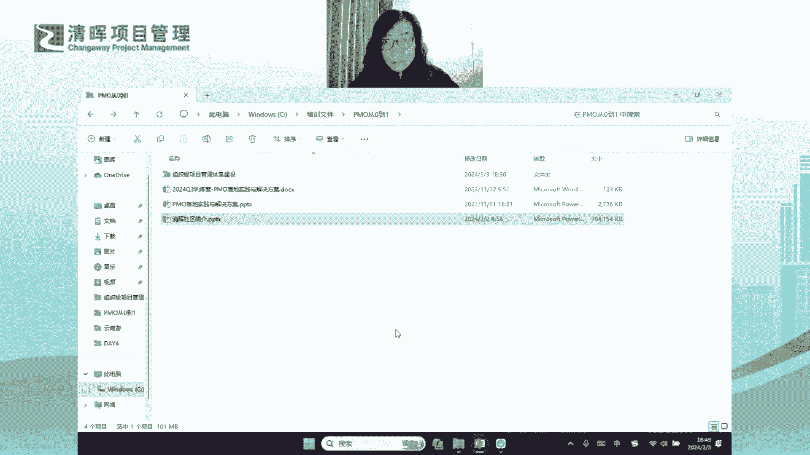

# 组织级项目管理体系建设框架 - P1 - 清晖Amy - BV1EZ421g7nZ

At break of day in hope we rise。

We speak your name，We lift our eyes，Tune，Our hearts into your，But beat where we walk there。

You'll be with fire in our eyes，Our lives a light，Your love，Un，It's blazing out。

The streets will glow forever bright，Your glory is breaking through the night。

You will never fade away，Your love is here to stay by my side in my life，Shining through me，Everyday。

You will never fade away，You love is here to stay by my side in my life，Shudder through me，Everyday。

You within me，Wake within me，You're in my heart foremake，You wake within me，Wake within。

You're in my heart forever，我的身边我的心，你却在这里想，With fire in our eyes that，Life's a light。

Your love and tag is placing，No，The streets swoke g forever bright。

Your glory is breaking through the night，You will never fade away。

Your love is here to stay by my side in my life，Shining through me，Everyday，You will never left away。

Your love is here to stay by my side in my life，Shining through me，Everyday。

At break of day in hope we rise，We speak your name，We lift our eyes，Tune，Our hearts into you。

You beat where we walk there，You'll be with fire in our eyes，Our lives a light，Your love untamed。

It's blazing out the streets will glow forever bright，Your glory is breaking through the night。

You will never fade away，Your love is here to stay by my side in my life，Shining through me，Everyday。

You will never fade away，You love is here to stay by my side in my life，Shining through me，Everyday。

You wake within me，Wake within me，You're in my heart forest，You're back，You wake within me。

Wake within me，You're in my heart，Forever，你说我在你心with fire in our eyes that。

Life's and light should never even tais，Placing up the streets will glow forever bright。

Your glory is breaking through the night，You will never fade away。

Your love is here to stay by my side in my life，Shining through me，Everyday，You will never fade away。

Your love is here to stay by my side of my like  through me，Everyday。

At break of day in hope we rise，We speak your name，We lift out tour hearts into your beat。

Where we walk there。

You'll be with fire in our eyes，Our lives a light，Your love untamed。

It's blazing out the streets will glow forever bright，Your glory is breaking through the night。

You will never fade away，Your love is s，Shining through me everyday，I would never fade away。

Your love is here to stay by my side in my life，Shudder through me everyday h，You wake within me。

Wake within me，You're in my heart foremake，You wake within me，Wake within，You're in my heart forever。

With fire in our eyes that，Life's in light should never take is placing love。

The streets will glow forever bright，Your glory is breaking through the night。

You will never fade away，Your love is here to stay by my side in my life，Shining through me，Everyday。

You will never fade away，Your love is here to stay by my side in my life，Shining through me everyday。

At break of day in hope we rise。

We speak your name，We lift our eyes，Tune，Our hearts into your beat，Where we walk there。

You'll be with fire in our eyes，Our lives a light，Your love untamed，It's blazing out the streets。

Will g，哎先测试一下声音啊，大家能听到我的声音吗，可以听到我的声音的小伙伴，可不可以在讨论区扣个一，有没有已经来了的小伙伴了，哎我看到大家了啊，声音正常对吧好，我们还有2分钟的时间哈。

我们准时开始啊，我们再等一下其他的小伙伴啊，大家可能这会儿正是晚饭时间哈，还有没有大的同学们啊，我们先可以随便随便唠两句，你好你好，晚上好，嗯大家春节都去哪玩了，有没有出那些出去玩的小朋友。

我说说我吧啊其实我春节呃，我是在呃初六初七的时候哈，基本上大家已经已经结束了，整个春节的假期的时候，然后我去了一趟云南啊，然后也是想催错峰出行啊，然后去了云南就去了丽江和大理两个城市。

我觉得还是还是蛮不错的，就是也是阳光明媚啊，然后气候呢也也比也比一杯要暖和一些哦，然后整体来说呃玩了两个城市，然后基本上有五六天的时间啊，然后后来呢我就又去了一趟南京，去南京去探亲啊。

然后结果没想到南方嘛特别冷，然后南京那个地方正好是啊，没有没有暖气啊，南方一般都没有暖气，所以冬天呢呃大部分的室内是开空调的啊，然后这样呢室内和室外的温差就会特别大，所以我就把自己给弄感冒了啊。

所以今天我还有点感冒哈，所以整个在整个课程讲解的过程中，如果有有任何状况出出现的话啊，嗯还还得还得让大家多包涵啊，哦唉只有一个去贵州的小伙伴吗，还有没有别的小伙伴出去玩的，都没有出去吗，诶好了。

我那么时间差不多了啊，正好时间到了啊，那我们就准时开始啊，啊然后其他小伙伴我相信也都在路上啊，然后今天呢想跟大家呃这个分享的这个主题哈，大家看到了啊，是我们这个组织级项目管理体系的建设啊。

然后也提前先跟大家拜一个晚年啊，然后我也觉得这是我们呃，可以说是开年的第一个清辉来组织的，社区的专栏哈，也是我们的开年的第一课啊，所以大家今天能够准时来参加我们的，这个直播的第一课的同学啊。

我觉得大家还真的真的是非常非常棒啊，给所有的小伙伴准时到来的小伙伴点赞啊，啊然后我们的开年第一课呢，其实也希望大家能够尽快把大家给拽回来啊，就这样从刚才提到的这个春节出游哈。

春节的一个比较high的一个状态啊，我们要回到正常的学习和工作的轨道中，对吧啊，然后所以呢我们希望这一课啊，然后大家也能够真正振奋起来啊，然后开始我们新一年的工作的目标啊，工作的计划啊。

嗯好你也晚上好啊，那呃大家都看到我们这个专题哈，其实这个专题呢我其实想说呃，你看它的副标题叫从单项目的目标达成，走向项目集群的成功交付哈，所以其实大家会发现，其实昨天我也跟我们清辉社区的老师在聊哈。

就是其实我们我们目前大家的一个状态啊，我们在本土的所有的项目管理的，这个在做项目管理的企业，其实大家都会转向一个一个目标的驱动，就是我们我们更多的从单项目的执行，过程的管理，其实是要去通盘去看。

要去看项目，项目大盘对吧，我们要去考虑项目集群，甚至项目组合，甚至是我们的P3，如何去为组织最终战略目标的达成，去产生这种贡献对吧，所以我们要站在更高的层面，站在更宏观的层面对吧，站在更广的视角上。

我们去考虑自组织级的项目管理能力啊，所以就会引发我们目前这个课题啊，然后呢呃今天我其实也给大家哈，我这个在直播间里可能大家大家看不到哈，其实我今天给大家那个给大家展示一下啊，我其实给大家带来这么多书哈。

我不知道大家看得到举一下啊，看得到这些书吗，啊那为什么我给大家拿这么多书呢，哦看到了我就放一边了啊，我给大家拿这本书呢，呃这么多书呢，我觉得也想说明两点，第一点就是这个课题真的。

他的它的包罗的内涵是包罗万象的啊，刚才提到它其实不仅仅是单项目，项目集群以及项目组合，包括我们的组织驱动实践，以及为战略目标达成产生的贡献，都需要哪些具体的组织环境因素啊。

同时呢它也会考虑到我们整个的文化环境，包括我们的组织结构对吧，包括我们的人力资源管理的一些相关的，一些技术策略等等等等哈，他会包罗的这个内容会非常全面啊，所以我为什么拿了这么多书呢，我想说的话。

其实它真的凝聚了我，其实这些书都是我我自己压箱底的书哈，他其实真的凝聚了我，很很多很多的这个项目管理的内涵和知识啊，然后才能凝聚出这样的一门课程啊，我觉得这是我想说的第一点啊。

那第二呢就是拿出了这么多书哈，这个书好像不太不太方便展示哈，这个书呢其实想想跟大家说的一点，就是说其实可以给大家一个承诺啊，就是我们整个的这个课程结束哈，或者在整个的过程中。

其实就可以去把这些书全部送到给大家啊，全部送给大家，这些数是全部送给大家的哈，那怎么才能够得到这些书对吧，那肯定过程中肯定会有很多的小挑战啊，还有很多的小问答啊，还有一些互动的环节啊。

如果大家能够真正的呃去参与和积极的去互动，包括参加我们的直播课的话，那我相信你得到这些书应该就不会太难了啊，怎么才能得到这些书呢，啊我记得今天在我们整个的课程中啊，我给大家揭晓这个答案好不好，嗯好吧。

那我们就正式进入到今天的课程哈，那例行呢，首先先做一下我自己个人的自我介绍啊，啊那我本给谁加的经验啊，那我自己本人是入行之后就在做pm的工作，那当然在这个过程中，我其实也在不间断地带项目啊。

就是培养对于业务的理解，和项目经理的这种项目执行过程，管理的一个实操手感啊，那我本人其实既经历过相对比较成熟型的大公，司去做组织型的项目管理，那我同时也在初创型的小企业哈。

那我也经历过这种嗯小企业其实从无到有啊，去建立整个PMO的过程啊，所以PMO呢其实既有成熟发展阶段的PM，同时呢我自己也带领过团队去从0~1，去搭建起PMO的各个的核心的功能模块啊。

所以我自己本人的历程是这样的啊，那嗯近几年呢，我主要聚焦的行业其实是在i it互联网，那目前也在京东科技，再去负责整体S级战略项目的一个执行落地，那同时我本人也具备美国培训认证协。

会的一个ACTB的一个国际认证，培训师的资质啊，所以我其实也在啊培训啊，包括整体啊讲师的行业哈，其实我也在一直在摸爬滚打，然后一直也在探索，那主要的讲授的课程其实也会聚焦在PM。

好那这是我自己个人的一个简介啊，然后我不知道今天来来收听的小伙伴哈，来听我们这个专栏的小伙伴，有没有是之前听过我课程的小伙伴啊，嗯有没有啊，因为我在呃之前在清辉，其实讲过好多相关的一些项目管理的课程哈。

有没有听过我课程的小伙伴啊，如果有的话，呵呵我看到了啊，如果有的话，可不可以在讨论区告诉我，你上次听我讲课的课程主题是什么啊，直接回复你的，你所听过我的课程的主题是什么啊，不管是专栏还是训练营。

还是我们的某一次的这个这个分享沙龙，分享你所听的主题是什么啊，如果没有的话，可以在讨论区扣个零好不好，如果没有的话，你就是扣个零啊，如果有的话，告诉你听的是什么，嗯好了，我已经看到了很多熟悉的小伙伴啊。

还是听我去年的课程的同学会比较多哈，嗯听过课程呢还是集中在去年的课程啊，啊然后咱们回复零的小伙伴也很多哈，那我也特别开心能够认识新朋友哈，好那我希望啊所有回复零的小伙伴啊。

你们能够从我今的新呃新的一年的课程中，然后能够有所收获哈，然后我们也真正能够结识，然后能够认识，能够相知和相识哈，好，OK那呃在我们正式讲我们今天的第一课之前呢，我还是想跟大家来做一个。

整体课程的一个介绍啊，那首先就是我们整体的这个课程逻辑哈，那课程逻辑呢我总结是一个中心六个基本点啊，所以特别好记啊，什么叫一个中心六个基本点呢，第一个这个中心是什么呢，是指的是我们其实整体的组织级。

项目管理体系建设啊，我们叫哦我们这个专业名词啊，我们组织级项目管理体系的专业名词，其实呃它叫OP m，OPM呢整体的体系的建设，我一定会先从整个体系建设的顶层设计开始，先给大家讲啊。

也就是说我首先它会围绕着整个的建设的一个，体系的框架给大家讲，那什么叫框架呢，就好像我刚才提到，这个整个的OPM的管理体系的建设，它是一个庞然大物对吧，他有这么厚的一一本书啊，这么厚的后座的一一摞书。

对不对，然后他领取了很多很多的知识，很多很多的领域，对不对，所以他是一个庞然大物，它就好像一头大象一样啊，那我们当我们看到一个庞然大物的时候，我们去我们我们怎么才能够去了解它，那我倾向于说。

先要给大家一个整体的一个框架性的认识，包括我要从最顶层最宏观，我要看到一个全貌的视角对吧，我看到庞然大物，我先先去看它全貌的视角对吧，然后我有了全貌之后，有了宏观的一个相对比较。

对它一个比较粗的认识之后呢，我其实就要把它拆解，我会把它拆解成好几个部分，或者说你可以说把它拆解成好几个模块啊，就像大象一样，它会有有有象牙，有有有耳朵，然后有他的头，有他的身子，然后也有它的尾巴。

有的大腿，对不对，然后我们就会去分每个模块去分别去看对吧，然后分模块去看的时候，我们一定会什么呢，我们一定会像剥洋葱一样，对不对，我们一层一层的把每个模块剥开对吧，剥开看的过程中。

我们就会把它的细节对吧，把它看的更清楚啊，这样的话呢在过程中你其实会有什么呢，会有很多的会有很多的问题对吧，然后你也会有很多的反思，你也会有很多的总结，然后当时当当然你在提问的过程中。

你在发现问题和解决问题的过程中，其实你就能够对这个东西能够看得，更加的清晰啊，所以这是不是我们任何一个学习，学习任何一门领域，学习任任何一门知识体系的一个过程，就是你一定是先去看全貌对吧。

先去看整个森林，然后我再把森林肢解开，然后去看其中的每一棵树是什么样子的，然后对最后呢我就从总到分，然后再从分到总，对一个事物就会有一个全面的了解对吧，所以我的课程基本上是这个逻辑。

所以我在讲讲到这个庞然大物的时候，我也会用这个逻辑去讲，所以第一章呢我会给大家讲这个一个中心，也就是说它会围绕整体的这个全貌的中心，然后我们来去做拆解啊，然后下面拆解呢最后我会拆解出六个基本点。

这六个基本点是十，并不是说组织级项目管理体系，它只包括六个方面，因为它包含的方面是包罗万象的，是非常多的，但是呢我会从整个这个庞然大物中，给大家抽取出六个啊，抽取出六个比较核心的模块。

我相信你能够掌握这六个模块之后，你基本上去做一个OPM体系建设的工作，应该是可以去落地的啊，所以我选取了六个非常重要的模块啊，那第一个模块呢，就是什么叫项目群范围管理和分类分级啊。

那更多的这个模块想说的是什么呢，想说的是当你想去做OPM的体系建设的时候，首先你要有什么呢，首先你要有一个项目大盘啊，这就是项目大盘对吧啊，这个项目大盘呢是干嘛的呢，是便于你去了解到，便于你去掌握到。

今年我要管理什么样的项目对吧，这个项目都有哪些的范围对吧，项目范围内部都有哪些的项目，然后它是一个整体的一个项目，通盘的一个管理对吧，他就建立了你对于今年你要管理项目，你的一个工作目标是什么啊。

或者说是你的工作对象是什么对吧，他是不是我们的一个工作的一个，非常必备的一个基础啊对吧，就是你要管什么对吧，所以需要先把这个项目大盘要建立起来对吧，然后有了项目大盘，我们知道要管什么之后。

我们要建立什么呢，这个项目的分类分级标准啊，是一个非常非常重要的一个顶层设计，为什么呢，因为你会发现，当你有了项目的分类分级这个顶层标准之后，你才会考虑，比如说我怎么去建流程啊对吧，怎么去建规则呀对吧。

然后怎么去监控项目呀，怎么去做阶段评审啊，对不对，怎么去给管理层做汇报啊对吧，然后包括我怎么去做项目的复盘总结，然后我的项目的绩效评价对不对，我怎么去评价项目经理啊，然后我怎么去给项目经理建立他的能力。

发展的序列和通道啊，你会发现这些都建立在分类分级标准的基础上，对不对，因为针对不同的分类和分级的项目，我一定会行使不同的项目管理的手段，项目管理的规则，项目管理的要求以及最终要落地的一些标准，对不对啊。

所以第一章是非常非常重要的，第一个基本点，它也是其他所有基本点的一个地基啊，这是地基啊，所以第一章呢要先给大家讲这个嗯，好这是地基啊，六个基本点的第一个基本点啊，然后到第二个基本点啊。

那就回到了我们其实有了标准之后，我们就可以做一些相关的一些，最基础性的一些工作了啊，那你会发现端到端的流程机制的建设，这基本上是我们现在很多的PM啊，很多的PMO在做的一件事情。

我们基本上所有的本土内的企业，如果你成立了PMO，你想去做这个这个项目管理的，整个的宏观的统一的管理，大家都会发现大家都要做这个流程机制的建设，那么流程机制的建设我们为什么要去做对吧。

我们做流程机制建设，我们希望解决的是什么样的问题啊，我们希望解决的是其统一宏观的一个，项目管理的标准动作和项目管理的标准打法，那么他希望解决的问题是，我能够使我的多项目合规运营。

以及最后多项目的成功交付啊，所以流程机制需要做什么，以及它解决的问题，我会在第二个基本点里，给大家做一个通盘的讲解，那么流程呢这一章也是我认为非常重要的，我们在做OPM建设的过程中。

的一个非常核心的一个模块啊，也是一个基础模块嗯，好然后就会见呃，然后就会到我们的第三个基本点哈，我们讲了分类分级对吧，然后我们也有了流程机制，那我们下面就是怎么样呢，我们就是建了流程。

我们就要辅导整个流程机制的落地，对不对，比如说我们要去做阶段的评审对吧，我们要去做整个流程阶段的这个阶段关卡，或者叫你的阶段节点的准入准出的机制的建立，对不对，这个准入准出的机制的建立。

不仅仅是你要建立这样的一个规则，这样的一个通道，更多的是你其实是要带领团队，你要带动项目经理团队对吧，去把他辅导落地啊，所以这个过程中，其实我们要做很多关于项目的监督控制对吧，项目的指导时间啊。

整个项目管理规则的落地，然后我要去做适配，而且我要我要我要辅导团队去查阅我们的项目，有哪些是需要裁剪的部分对吧，还有就是我要反向，同时反向去驱动流程机制的更新和迭代，让它变得更完善，让它变得更适用。

让它变得更加接地气对吧，所以监控的这一章，其实我们能够去从PMO的角度来讲，其实你从团队输入很多的东西给你，那同时你也可以去反哺团队，很多的机制建设的一个落地对吧，那这是监控这一章嗯。

那监控为什么坏和汇报放在一起啊，其实监控和汇报是两个单独的模块，而且他们各自呢都会有，相对来说比较重的一个比重，那把它放在一起的原因是因为什么呢，是因猫是从监控中获得，我们需要去做汇报的信息。

而监控呢又是我们整体项目进展，汇报的一个基础哦，那汇报这一章呢，我更多的希望强调的是，PMO其实有一个非常重要的功能，就是它一定是什么呢，它一定要连通我们从高层到执行层，到一线员工之间。

他要打通整个纵向信息，纵向的项目信息的一个一个一个通路啊，所以说它也是一个枢纽这个环节对吧，他对上他要给一号位有一个很好的一个交代，他要给一号位一个项目全景图，那么他对下呢他也会指导一线团队。

指导我们的项目团队去更好的去实践，去更好的落地，去更好的去把一号位的一些管理的举措，最终变为现实啊，所以这是我们第三章啊，啊其实不是第三章，是第四章了啊，我们的第三个基本点，是我们第四章要讲的内容嗯。

好，然后再往下呢是我们的复盘总结和经验分享啊，这一章呢我自己也是特别的啊，我特别的觉得这一章也是非常重要的啊，因为大家会发现呃，其实我们所谓的目前大家说一说乌卡时代哈。

后来我们我们现在其实这两年更新迭代，一个新的词叫BENI时代，我觉得anyway，不管怎么说哈，其实你会发现这个时代越来越需要什么呢，越来越需要大家大家去有这种复盘的能力，为什么呢。

因为很多的东西是需要是是是从无到有的，是完全创新的，在这种情况下，其实你可能没有更多的以往的继承的经验可学，这个时候你怎么办啊，你想去不断的更新，你想去不断的去完善，你就需要什么呢，你需要向内求啊。

而复盘总结其实是一种向内求的方式，就是你其实我自自己的亲身经历啊，不管是对于个人还是对于项目，还是对于企业来说，你是通过自己的亲身经历，然后不断的去总结对吧，然后你就不断的去找到可以改进的方向。

然后同时你有了行动计划之后，你不断的去迭代，不断的去升级，然后你自己是在做自我完善的一个过程啊，所以大家会发现这个时代越来越重视复盘，为什么，因为这个时代它变得更加的创新，它变得更加的模糊。

它变得更加的复杂，它变得更加的有不确定性的情况下，我们更加需要向内求啊，所以第四个基本点，我希望给到大家的不仅仅是我们如何去做项目，复盘总结，他应该站在更加广义的角度上，我们如何去做任何事情。

所有的事情包括个人，包括项目，包括组织，我们如何去做复盘总结，这是一种什么，这是一种我们现代的人，现代的职场人，生长在这个时代里，你必须具备的一个基本的技能，基本的生存技能啊，所以这是第四个基本点。

我希望能够给大家带来的东西嗯好了，那就说到了第五个基本点啊，大家会发现这几个基本点呢，真的是每一个比每一个经典啊，每一个比每一个必须，那项目的绩效评价和考核机制，它决定了什么。

它决定了我们如何去评价项目对吧，它还决定了我们如何去评价项目经理，同时它决定了我们如何去提炼出，组织的最佳经验实践，对不对，所以它是一个非常核心的一个环节，那也是我认为现在目前大部分的本土企业。

其实你在你在看到他们去做项目，绩效评价和考核的时候，其实都会有都会有一些缺失啊，然后也是一些呃，也是大部分企业我认为做的不够，不够完善的地方，那为什么这个这个环节，这个领域大家做的没有那么容易。

没有容易做得这么出彩，或者说大家为什么在这个领域做的会会碰壁，会有卡点啊，我觉得本身也是因为这个领域，其实它是企业内部啊，不仅仅是项目项目管理，而且是整个企业管理中的一个核心的矛盾点。

也是一个核心的利益冲突点，好大家同不同意啊，这个观点啊，你会发现，其实触碰了绩效评价和考核的这样的部门啊，它往往是什么呢，就是往往我觉得他是一把双刃剑啊，怎么说呢，就是它既是一种权利啊。

同时呢如果你没有把它去很好的去推行落地，或者你在过程中没有没有处理好，彼此各个相关方之间的关系，意你往往会看啊，触碰到啊，你你你你不应该去触碰的一些一些矛盾点，这个矛盾点可能会使你陷入泥潭啊。

所以他其实是一个非常敏感的地带，非常非常嗯非常不好去拿捏的一个领域啊，那当然在第五章呢，我希望给大家讲到的是什么呢，我希望大家能够掌握具体的这个实操的，这个落地推行的方法论。

那至少让大家在走到走到这条路上时，当你需要走到这条路上时，至少你知道怎么去避坑，你知道怎么去顺利的推行，你知道怎么去去防止去触碰到不该触碰的地带，然后最终呢能够让这个工作给我们的PM。

或者给推行的部门能够增加你的收益，甚至是增加你的权利，它是一个莫大的权利啊，当然这个权利取决于你要有一把，真正你可以去去挥舞的剑啊，这把剑你能够真正把他挥舞好，然后你才能够把这个权力用到用到极致啊。

然后用到一个相对比较比较，比较好的一个状况啊，这是第五章哈，所以第五章也是相对来说比较比较比较敏感，和比较好矛盾聚焦的这么一个领域啊，好了，那这是第五个基本点了啊，然后最后一个基本点呢啊。

你看这个第六个基本点也是特别重要的啊，就项目经理能力建设，因为为什么啊，因为我们提到组织机的项目管理啊，我们提到呃，我们提到这个呃OP m的整体的建设工作，你会发现呃。

其实其实嗯其实这里面呢你就会发现嗯，就是就是我们我们怎么去提升，组织机的项目管理能力啊，这就成为了当前的一个必须的一个啊，必须的一个要做的事情，而提升组织级的项目管理能力啊。

大家不觉得提升组织的项目管理，其实就等同于，你要去提升项目经理的项目管理能力哦，因为只有项目经理的项目管理能力提升了之后，你才会发现，真正组织的项目管理能力才有实质性的提升好，所以项目经理能力建设呢。

我始终认为它是一个，它是我们OP m整体体系建设的一个核心，但目前这个领域呢，我也认为我们整个本土企业在做的过程中啊，在实践和实践实行执行的过程中，其实也是差强人意的，所以我也特别想把这个话题拿出来。

我们一起来去做探讨，我们一起去探讨它的可行的路径，他的工作步骤啊，然后以及在过程中，我们有哪些可能的避坑策略啊，这样的话呢，我们才能够给项目经理去建设他的能力，然后让他他不断的晋级，不断的提升。

让他找到他的职业归属，对不对，那最终呢我们提升了项目经理的能力，其实就在提升组织级的项目管理能力，对吧，所以整体的整理的课程逻辑，会是会是这么来去安排啊，嗯然后这里呢嗯我觉得嗯讲完课程逻辑。

我也有一个事情想跟大家交代一下啊，大家会发现其实我刚才提到的两个词哈，呃我会多，我会非常非常频繁的用到这个两个词，一个是OPM啊，一个是OPM在这里啊，O p m。

大家知道是组织级项目管理的一个英文缩写，对不对，然后我刚才还频繁的提到了一个词叫PMO哈，好这个一个是OPM，一个是PMO哈，其实都是这三个字母哈，只是它们的摆放顺序不一样哈。

那么在我们整体的这个专栏的课程里，大家可以把他们俩啊等同啊，虽然他们俩的含义不太一样，但是在整个专栏的课程里，大家可以把它们等同，因为当我提到PMO的时候，其实我是希望PMO啊。

我我我这就意味着PMO是一个组织啊，是企业中的一个部门，他的职责就是在推行OP m的整体的体系建设，所以你把PMO建好了啊，你把PMO做好了啊，那PMO的工作开展了，这个OPM其实它也就什么呢。

它也就正常的去建设和运营和发展啊，所以这两个词我可能会混用哦，大家就整个过程中注意到就可以了啊，听到这两个词大家知道等同，然后也知道什么意思就可以了嗯，好啊，那我们就继续了啊，然后顺着我们的课程逻辑呢。

就会有我们整体的课程安排啊，然后大家看到课程安排呢，我先呃给大家过一下哈，我们今天呢会重点去讲第一章啊，第一章呢是我们整体的建设框架，刚才提到了啊，建设框架会在啊，今天这个课程里会给大家交代哈。

那整体交代的逻辑呢，我会先从我们企业目前所面临的项目，管理问题入手对吧，我们有了问题之后呢，我们就来看看啊，那当然我们也会有一些逻辑概念，比如说什么是OPM对吧，什么是OPM对吧。

然后OPM的目标是什么对吧，那有了这个目标呢，以及我们现在现存的问题，那这两个之间会不会有个对应关系啊，就是OPM的目标一定是要解决我们的问题，我们的问题遇到opp m之后，一定可以得到解决之后。

我们才要去推行OP m，对不对，是不是这样的一个逻辑关系，所以我们先看看关系是不是匹配，OP m能不能解决我们现在面临的问题，然后在这个基础上呢，我们就考虑，那么我们这个组织项目管理体系。

我们如何去设计对吧，就是提到我们在顶层设计上，我们出如何去从从高到低去俯瞰这个庞然大物，对不对，以及他的体系建设的全景图啊，这两个呢其实都是我所谓的俯瞰啊，俯瞰啊是这么写的对吧。

俯瞰啊俯瞰一个庞然大物的全景图啊，所以今天更多的是我们是粗看对吧，然后到了嗯下次课程呢我会给大家提出来一个，那我们就看完了这个东西，我们知道这个东西是干什么的了，知道它解决什么问题了。

那我们如何去建设它呢对吧，那所以下一次课程，我会给大家提出一个建设的十步法啊，这个呢我这里面会带大家进一步去看拆解，去看啊，去看还是去看庞然大物啊，去看如何去建设啊，然后以及呢我们从第二次课开始呢。

我们就开始进入到六个基本点啊，六个基本点，第一个基本点刚才提到，就是我们的项目群范围管理，这是整个项目大盘对吧，有了项目大盘之后呢，还会有项目的分类分级，所以我这个呢会在第二次课和第三次课。

给大家讲整个的第一个基本点哦，然后有了第一个基本点之后呢，我们第四次课开始做流程机制的建设啊，流程这一章呢也是特别重点的一章，因为你会发现这个章呢，这个章节就是我们现在我发现嗯。

我发现所有的PMO在做的一件事情哈，就他们有个共同点，就很多PMO在做的事情其实不一样，大家会发现吗，就是有的PO还在推敏捷，甚至有的PMO去做去做效能度量，这两这两年敏捷。

还有包括我们的研发效能度量非常火，我们很多PM都转型去做这种，新兴的创新领域啊，但是你会发现，其实所有的PM都在做一件共同的事情，就是这个流程机制建设啊，所以它是一个我觉得他是一个交集哦。

它是一个合并同类项，所以这一章呢我会重点给大家放呃，至少是两次课程，甚至两次课程多的时间为大家讲流程机制建设，当然这里面也会有很多的传达的案例啊，呃然后呢就是我们的监控和进展汇报啊。

这个这个部分呢我也会放两次课啊，甚至是两次课多的时间给大家讲监控汇报，那分别会给大家拆解监控怎么去做对吧，然后还有汇报怎么去汇报啊，然后第九章呃，呃然后第九节课啊，就基本上到了第九节课了啊。

就会有复盘总结和经验分享啊，这个复盘总结呢我说到他其实是个通用能力，所以大家会发现复盘这一章呢，我其实叫内容非常多，我希望给大家建立的是一种通用能力，是一种通用的技能。

你不仅是你不仅仅要会去做项目的复盘总结，对吧，你也不会不仅仅要做组织起的，包括PMO怎么去组织整个大项目的复盘总结，同时呢复盘也是一种通用的能力，我们要把它内化成自己的一种内功，对吧啊。

所以这章也是内容比较多啊，然后最后呢，我基本上会在第十十一和十二两次课里哈，基本上会把项目的绩效评价和考核，和项目经理能力建设，分别放在两节课里给大家讲啊，但是我觉得呢啊。

其实我觉得这两个专题其实它要包容的内容，其实真的不仅仅是两节课，大家会发现我们的所有六个基本点，其实六个基本点，每一个基本点都可以作为一个专题啊，都可以成为一个专栏啊。

它都可以有很多很多的内容去做拆解啊，所以这次呢我觉得呃我先给大家抛个砖啊，然后未来呢我们还会去做进阶，会有专项，然后再去深入细节的课程，然后再给大家有更多的内容，给大家产生更多的价值。

给大家带来更多的东西吧，啊这是我整理课程的一个设计思路啊，嗯好好俯瞰的看我写错了哈哈哈，有同学提出来了哈，谢谢谢谢，我这个提笔忘字啊，现在基本上带电脑打字，所以自己写字太少了哈，好那我继续啊。

我们继续可以吗，嗯大家觉得我们我们目前这个进度，这个节奏可以吗，啊因为我其实我其实我其实讲课的这个啊，讲课的这个习惯就是语速会非常非常快哈，所以大家一定要跟得上啊，如果大家觉得语速非常快，跟不上的话。

可以提示我一下，我稍微放慢放放慢一点啊，这个语速非常快啊啊语速非常快，其实也有也有个好处哈，我给大家讲什么好处哈，一会给大家讲，好节奏OK啊节奏OK我们就继续啊，嗯好啦，那说到我们的课程的亮点哈。

也特别想跟大家说哈，我自己总结我们的课程有四个亮点哈，这四个亮点首先第一个亮点叫实用落地行，为什么呢，因为嗯就是像我这句话写的哈，我这句话叫呃，比我们的OPM的定义更重要的是怎么去做，对不对。

我们如何去做，这也是我经常跟大家去交流，项目管理的过程中，大家经常会问到我的一个问题，就是啊老师你讲了那么多PMO啊，讲了那么多课程，你能告诉我，你能告诉我，我如何去说服企业的管理层去成立一个PM。

对不对啊，大家会经常会问我这个问题，就我连PO都没有，我听你讲了半天PMO怎么做对吧，那那那首先我我，我是如何在我的企业里成立一个PMO，这就成为我的一个难题对吧，因为我成立PMO。

不是说我说成立就成立的对吧，我需要说服管理层对吧，那一般遇到这个问题，我一般会给大家的回复是什么呢，啊你不要你不要想着去成立PMO，你也不要想着去说服管理层，去帮你搭建一个这样的组织。

然后你就可以去发挥你的效能，发挥你的价值，而是什么呢，而是你要考虑一下企业目前面临的哪些项目，管理的问题，对吧，你要去跟管理层说，我觉得目前企业内部面临了12345，一共五个问题，这五大项目管理问题呢。

是我们企业内部，其实是相对比较根深蒂固的问题，那么这五大问题呢，我希望未来通过什么样的一个通路，通过什么样的一个渠道，通过什么样的路径，然后去把它解决，而解决这五大问题。

我认为我们现在成了一个PM这个组织，可以帮助我们把这些问题都解决啊，如果你要用这样一个口吻去跟管理层去沟通啊，那我觉得啊，你的八成这件事就可以做起来了对吧，所以我们并不是说为了成立PMO。

而去成立PMO，而是我们要呃要去为了解决组织的问题，我们才去做我们的OPM，做我们的呃项目管理体系的建设，做我们的整个组织，企业宏观的项目管理对吧，所以呢我会更加注重我们的课程，一定是使用落地的。

也就是说要教给大家呃，或者带着大家一起去实践我们的所有的课程，学到的方法，我们如何在企业中去应用和落地对吧，关键是如何去适配，如何去真正执行和推动落地啊，而不是说我们我们我们参加这个课程。

我们仅仅是学的一套方法论，如果去学到一套方法论的话，大家可以自己去看书啊，对不对，现在各种各样的项目管理书籍那么多对吧，所以我会抽取啊，也刚才也提到，为什么是六个核心模块，我们有六个基本点对吧。

我会带家大家一起去把这个庞然大物，把这条大象啊慢慢的把它拆解开，然后让大家去举一反三，让大家真正能够推行到企业中去使用，落地好，所以这是第一个使用落地性啊，嗯那第二呢呃第二就是说呃大家会发现。

其实我们讲到实操，我们讲到落地这个过程中，其实我们就不仅仅是概念啊，不仅仅是定义，而是说我们怎么去把这种经验的东西，这种这种所谓的呃所谓的多年的所积累的东西，能够给大家呈现出来。

所以这里我一定会给到大家很多的案例啊，包括一些模板啊，包括甚至我有一些总结的模型，一些方案和一些事例，然后帮助大家去怎么去把它们真正用用起来啊，所以这些东西其实大家可以拿来即用对吧。

这个案例教学性的一个非常好的一个优势，就是大家是拿来即用的，即插即用的，而不是说大家还需要再去做创新，然后再去做，再去做自己的二次开发，对不对啊，所以案例教学性这个我觉得是第二点啊。

然后第三呢就是系统体系信号，这个嗯我觉得大家应该能听出来，因为刚才我在讲整个课程逻辑，所以我也希望我们的课程，其实是注重它的结构性和逻辑性思考特点哈，所以我希望能够给大家一些成体系的一些输出，一些总结。

比如说我在我们下次课程，第二次课程我会给大家讲一个体系建设，如何去建设，那我就给大家总结了十个步骤对吧，以及未来我们去讲复盘也一样，复盘的整个的系统性的方法论，其实它也有相应的一个步骤。

我希望能够给大家一个步骤，一个流程对吧，这个流程和步骤大家就可以套用啊，甚至是你你你可以裁剪，但是我给到大家一个全套的东西对吧，然后最后大家裁剪之后，哪些是适用于自己企业的对吧。

你就可以把它留保留下来啊，不适用自己的企业呢，你就可以先把它裁剪掉，那也许哪一天你换了一个企业，那么之前你被裁剪掉的东西，你其实还可以保留出来，你可以把它再翻新出来，对不对，那给到大家全套的东西。

大家是不是就可以去适配对吧，所以这个系统体系性，我觉得是是第三个非常重要的啊，嗯然后最后呢丰富趣味型啊，就刚才提到嗯，这个这个刚才提到我自己说话语速特别快哈，啊然后大家也会发现。

就是就是我给大家东西一定也是干货满满啊，这个这个这个干货呢，这个事呢其实跟语速有有点关系啊，我想说我想说明什么呢，就是因为本身也是内容会比较含量，会比较比较干啊，没有太多的水分。

然后同时再加上我自己本身语速比较快啊，然后你就会发现这个课程的内容含量哈，真的是有点有点多哈，然后大家也会觉得就是就是会收获满满啊，然后会收获颇丰，然后也会相对比较丰富哈。

所以大家这个过程我希望大家一定要跟下来，就是你在跟的过程中，你你付出了时间对吧，包括课后的回放啊，课后的复习，课后的作业，你真正投入进来的话，我相信嗯就是一分耕耘，一分收获，一定会有收获哦。

所以呢那过程中我也会穿插大量的问题思考，以及课后安排的一些相关的一些作业，包括点评，包括其实大家也可以私聊我，然后跟我去互动，然后跟我去提一些具体的问题，对吧啊，然后我的课程也是呃也是同行啊。

同行会评价会是呃，同行会评价有料加有趣哈，我也希望我的课程真的能达到这样的标准哈，那我希望是有料有趣加有效啊，有效呢就是什么呢，就有疗效，对不对啊，嗯有疗效啊，要治治大家的这个就大家有病啊。

然后我来我有药，然后这个我的药能够治我们的企业里面，真的呃根深蒂固的一些项目管理的问题啊，对吧嗯好呃，那是这样的一个亮点哈，呃然后我们的目标哈，呃目标呢嗯大家了解一下哦，其实我们是12次课程。

然后这12次课程呢我们会分成两个阶段，然后3月到4月我会给大家先去讲六次课程，然后我们剩下的六次课程，我会放在也是上半年吧，我们再安排一个时间，因为相对来说大家会发现体量非常大的课程。

其实是需要给大家一个消化和吸收的时间啊，所以我也希望我们的课程其实是有节奏的，就不要一股脑全都给到大家，然后让大家消化不良哈，然后我们12次的课程呢，我们前11的11次的课程会有作业啊，包括今天的课程。

今天是第一课，对不对，今天的课程就会有作业啊，所以我们只有12次的课，第二第12次的课程是没有作业的啊，所以前11次课程是有作业的啊，这个作业大家一定要做哈，就再次强调这个作业你为什么要做呢。

因为你做完了之后我就会讲解对吧，你想想这个作业如果你做了，你一定会深入思考和学习，今天的所有的课程内容对吧，你才能做得出来这个作业，然后你做作业的过程中，你你就在反复的去思考对吧，你在反复的咀嚼啊。

然后你在做作业的过程中，可能你会产生新的问题，新的疑问对吧，你有了这个问题，你肯定会问我或者是问同学对吧，你肯定会交流对吧，然后关键的观点就是你做完作业，我会从每次做作业的同学中，相对比较优秀的作业中。

然后挑选出来，我在下次课的前半个小时，我会给大家做一个作业点评哦，所以大家又想到，如果你做了作业，而你的作业又被挑选上去做了点评，这对于你自己的学习和提升来说，是一个多么大的机会哦，所以大家真的要呃我。

我是觉得大家一定要珍惜这样的这样的机会哦，就是给自己提升的机会，既然你花了时间来听这个课程对吧，你为什么不让它的收益变得最大化呢，对不对，我们每个人都是项目管理专业人士。

我们做项目的时候是不是要考虑项目的RI，对不对，或者叫你要去做项目的成本效益分，对不对，你希望你投入最少的成本，但对吧，那所有人我们都来听这个专栏，我们都花了时间去听，那为什么你不让他的收益变得最大呢。

对不对，这是一个最基本的一个逻辑，对吧嗯，嗯然后最后呢我们也会有长期答疑咨询啊，这个当然大家哦，大家直接线下跟我互动就可以了啊，然后最后呢目标，我觉得这里我不想给大家念了哈。

但大家注意我的整体的课程设计逻辑，其实在目标里有有有一些体现，比如说我希望大家能够看清看清联动关系，对不对，然后大家能够体系化的去理解全景视图，对不对啊，然后大家能够什么呢。

能够去去设计和自身企业现状契合，的一些方案和步骤，对不对，然后你可以从0~1，去帮助自身企业去构建体系框架，就大家注注意，我所有的这些目标，其实是是希望我们这个课程中，能够给大家带来的东西。

包括你看你要解码战略对吧，你当你做组织及项目管理的时候，你可不仅仅是在做项目管理，你真的是要跟战略联动的，你要跟战略有衔接，所以你要解码战略，对不对，然后呢，同时你对自身企业实操落地，你要有标准对吧。

然后你要结合起，你看永远是结合企业去设计核心案例，包括你要自查企业的漏洞和问题对吧，这些都是帮助大家去落地的对吧，识别和梳理自身企业的一些优化方案啊，我希望大家能够把课程所学的内容。

应用到自己所在的企业中对吧，这样才是能够真正给大家带来的帮助，嗯好OK那最后呢我们说一下整体课程的安排哈，那整体课程的安排，大家看到其实我们可以分成呃，这么来看呢，首先是从课程上来讲哈，课程来讲呢。

我们每次课程是一个半到两个小时的时间，那同时呢，我希望大家也能够花同样的时间，去做复习和巩固啊，就大家也要花同样的时间去回放啊，或者是做课程笔记呀，然后大家去不断的去反复的去咀嚼对吧。

然后同时呢那竖着看啊，我们从练习的角度来说呢，你的课程复习巩固之后一定要去做作业，刚才提到为什么要做作业了，对不对，那作业呢我不会给大家留太多，也不会给大家太多的工作的这个工作量哈。

大家基本上花半小时到一个小时的时间，其实你是可以做作业的哦，然后同事在做完作业之后呢，那我会给给了给大家做下次课啊，下次课给大家做呃点评答疑啊，这个答疑呢我也会花同样的时间给大家来做啊。

所以这是我们从课程和练习的角度大家来看啊，那如果让横向来看的，就是呃，老师要做的事情和大家要做的事情是什么哈，那从我的角度来讲，我第一是要讲课，对不对，我要做课程讲解，最后呢我要做课程课后的点评。

对不对，那大家关注一下自己要做什么呢对吧，自己要听课，要做课后复习对吧，以及作业的提交，对不对，这是大家要做的事情，嗯那是不是就说明白了啊，然后我们是全程大宝都学啊，清辉大宝的服务特别好哈。

啊这个就不用我再做广告了哈，然后长期的啊提供答疑陪练哈，这个是大家可以长期找我的啊，我们这课程不管是什么时候结束，大家都可以长期啊长期来去来去跟我沟通啊，我来给大家提供一些相关的讲解哈。

然后一对一的量身定制辅导，这也是可以的了啊，嗯好了，最后呢大家关注一下我们的整体的课程哈，呃然后我们的课程今天是第一次对吧，我们今天是3月3号第一次课程啊，然后我们基本上所有的课程都会安排在。

周日的晚上七点到九点哦，七点到九点哦，这个大家关注这个时间哈，哦然后我们有两次课程被安排在周六哈，这两次课程为什么安排在周六哈，特意要跟大家说一下啊，因为下次课程呢安排在周六。

是因为周有一个PMI的考试哈，下周日PMI的考试全部集中在周日，所以我就把课程提到周六啊，然后我们4月份的第一次课程也是周六，是因为周日正好清明节，我们有个倒休娃，这个清明节倒休，这这一天是要上班的啊。

周日是上班日啊，所以我给改到周六，这样的话大家听课会方便一些，嗯然后最后呢特别要注意就是什么，这个作业提交时间一定要注意啊，每周二啊，周二提交作业，周二大家一定要提交作业啊，这个周二提交作业。

那意味着什么啊，准时提交作业，意味着你被点评到的几率是非常大的啊，如果你周三再去提交的话，可能老师就没有那么多时间，看到大家的作业了啊，这个不被点齐名的话，可能会有呃，可能会有很严重的问题啊。

呵嗯那大家注意一下吧，啊就是周二是提交作业啊，就咱们听完这个课程，基本上嗯你明天再复习一下啊，其其其实周二你再花个半个小时，基本上就可以提交了啊，大致是一个趁热打铁这样的一个节奏啊，嗯好啦。

说到最激动人心的事情了啊，大家一直在想啊，之前老师拿了那一摞书哈，这个书怎么送给大家哈，这个书可能不仅仅是我目前屏幕显示的，这么多哈，哦我会有一个详细的书袋哈，那首先呢聊一聊阅读这件事啊。

因为我自己本人是特别喜欢阅读的哈，然后我不知道，我不知道大家怎么看看阅读这件事哈，然后我也用了润总这句话哈，我我特别认同啊，就阅读是在锻炼我们的精神肌肉啊，因为曾经有一个有一个小伙伴哈。

他问过我一个问题，说你那么喜欢读书哈，你读了那么多书都获得了什么呢，就觉得好像你读书吧，每次自己看完书吧，反正看完就忘啊，然后也没有真正深入骨髓，也没真正吸收到自己的内心。

也没有给自己带来任何增值和收益啊，然后他就问我这个问题啊，你为什么那么喜欢读书，你读书觉得获得什么啊，然后我记得我当时是这么跟他说的，我说平时多读书呢，其实可能你一时半会儿也看不出有什么变化。

但是呢但是但凡你通过阅读日积月累的过程，你的气质，你的谈吐，你的胸襟，你的格局就真的会有所不同啊，然后大家会同意一句话，真的是我，我是觉得腹有诗书的人，他会不拘泥于鸡毛蒜皮，也会不困惑于意识低谷对吧。

所有你读过的书，你走过的路，你见过的人都会反过来这样哦，大家这么认同哈，所以嗯这个观点呢其实你会发现有些验证，比如说啊，比如说大家会看到前前段时间东方甄选啊，董宇辉哈。

这个董宇辉有有有相关的一些网上的一些啊，爆料的一些事件哈，其实有一些负面消息，其实我们不谈这个啊，但你会发现董宇辉为什么他火了哦，你就会发现他在直播间真的是什么，你会感觉到这个人真的太真的太有内涵了。

对不对，他真的是腹有诗书，对不对，他真的可以出口成章，他每一次出口你就感觉到他真的是一篇小作文，对不对，所以大家会不相信他的，他的他的所有的出口成章是背后有团队，对不对，这也是对他莫大的一个一个认可。

对不对，所以这就是我觉得这就是啊，这个案例就说明了，阅读能够给我们带来的东西哈，所以我也希望大家是啊，跟我一样喜欢阅读的人吧，啊那个就大家喜欢看书吗，我说了这么半天，我说了半天有没有有没有质疑质疑。

我就像我那个小伙伴问我，你读了这么多书有没有用啊，哈嗯大家有没有喜欢看书的小伙伴，如果有的话，可以在评论区啊，扣个一不好，扣个一啊啊，不喜欢看书就扣个零就好了好吗，不喜欢看书就不送你这些书了好吗。

扣个一啊好，那我继续啊，然后我们就揭晓宋书规则啊，首先呢这些书大家知道，其实我一开始就说这些书是呃，是我我全部我自己读过的，而且是压箱底的书，所以全都是我的精选书籍，然后对书呃读书越多的人。

其实他对于书会越带越来越挑剔啊，所以一定都是相对来说比较经典的书，而且相对也比较新哈，所以大家不用嫌弃啊，虽然这些书都是二手书哈，不用嫌弃啊，他的这个知识的精华是不假的啊，然后怎么读书很简单。

我们有课堂的互动啊，大家会来跟直播课，课堂会有互动吗，你看我们现在不就在互动吗，大家都在扣一，对不对，然后课后还会有作业，作业我会选，我会挑选去做点评，所以在这个过程中，我相信跟大家之间会有很多的联动。

这过程中我一定能够看出谁是真正优秀的学员，对不对，我们优秀的学员其实就可以有赠书的奖励了，对不对，那每次呢啊我在直播课中点名的同学啊，可以作为这个监给大家一本书，然后我到时候呢我把大家这个我把我。

我把我的书单发给大家啊，然后大家从里面去挑对吧，然后挑完了我给大家免费包邮啊，所以大家一定要注意，是有一个有一个观点是什么呢，有个重要的点就是你一定要早点跳这个数对吧，人家书里有限的啊，就这么多书。

你说你挑晚了，最后就没得挑了，对不对，所以你要早一点让我发现，让我发现你的优秀，对不对啊，然后让我让我认识你啊，然后你就可以早点选书了，对不对哦，所以这些书要送给大家的啊，嗯好了，那哎呀，说了这么多哈。

最后的最后哈，在正式开始课程之前，我再给大家做一段小小的预告哈，那我们这次的课程呢啊，这次的课我们是一个中心，六个基本点，对不对，它就组成了我们第一章以及后续的六章对吧。

那组织级的项目管理体系建设这一课啊，更多的是在聚焦于作为PMO这样的一个组织，我们如何去如何去把组织，项目管理体系建设起来啊，如何去把它运营起来，如何去让它落地，对不对啊。

所以我会教具体大家很多的工作啊，很多的技能，很多的事情我们怎么去做哦，我们具体怎么去做这些事情，会给大家很多的很多的内容啊，那当你想做这个事情的时候呢，你就会发现其实他会需要一个一个组织，对不对。

他会需要这样的一个部门去做这个事情啊，所以呢他会以期我们引引发出，我们其实还有一期课题要单独去考虑，PMO这件事对吧，因为你会发现不管你是建一个PMO，还是说你建一个建一个叫什么的类型的部门啊。

总之它其实是需要一个组织，去把你所有的这些OP m体系建设的事去推行，落地的对吧，那PMO也非常重要，如果没有PMO这样的一个部门，你就会发现今天你让A部门做这件事，明天让B部门做这件事。

那这个事情就变得没有体系了，就变得很凌乱，对不对，所以呢我觉得需要给大家再有一个课程，就是他一定要解释PMO是怎么去落地的对吧，PMO是为什么是诞生，它在什么样的契机下诞生对吧。

那诞生之后他怎么去给自己找到定位对吧，然后PMO在建设运营和发展过程中，你会发现，PMO其实是一个很容易有困惑的部门，对不对，那为什么我们现在很多本土的企业，对于PMO来说建了拆拆了建对吧。

那p mo也容易被边缘化，pm也容易感到迷茫，我不知道今天有没有做PM的小伙伴，我说的这些你大家有没有感同身受啊，其实PMO有时候经常会做着做着，就就不知道自己要做什么，对不对。

所以PMO怎么去找到自己的归属感对吧，然后你你你把p mo这件事做好对吧，然后你才能够有有有你才能够成长出嗯，整个这个角色的整个他的能力对吧，对于人才素质和能力的要求，以及pm的组织能力怎么去建设。

所以这个话题呢，我觉得更好的是这一期下一期的课题，更好的去支撑于我们这期的课题，我们如何去做这个组织级项目，管理体系建设的工作啊，所以下一期的课题呢，我会安排在我今年会给大家安排的吧。

哈具体时间我现在也不知道啊，哦课程也没都全都没有写出来，我具体安排我觉得会在下半年，比如说Q4的时候给大家再去安排，如果大家感兴趣的话呢，也可以来参加我们下期的课程，这样的话呢呃别管PM还是OPM哈。

而这三个字母你就把它全都搞定了，对不对啊，是不是会相对比较体系化全面一些啊，好了，那我们今天真的说了，说了整个课程的内容特别多啊，然后我们就正式进入到我们今天的课程哈，今天课程呢讲了这么多哈。

其实大家知道我要讲第一章对吧，讲怎么去怎么去建建设，这个OPM的整体框架哈，那说到整体框架呢，首先呢就会有一个真实的问题哈，我们是由问题，我们是带着问题去导入我们整体的课程的，我们带着问题去思考。

我们怎么去5PM哈，那这个问题呢呃大家看看这个问题啊，这个问题也特别特别特别跟我有缘哈，是我们清辉社区的老师啊，给我发了这么一个问题，他说有个同学给他提了个问题，说张老师你要不要。

你要不要给大家讲一讲这个问题，你是怎么理解的哈，大家看到这个问题是什么呢，他说现有的企业里面呢没有项目管理体系，那项目的推进呢，很多时候就靠着项目经理一个人好，那如果有这样一个体系呢。

我们对人员去做培训对吧，然后你看组织成员就会有项目管理的意识对吧，那同时呢按着体系流程走，我们的效率也会提升对吧，效率会更高对吧，那如何在企业内一步步去搭建这个体系呢，对不对，那需要做哪些步骤呢。

注意是哪些内容呢，你看它就引出了我们今天要讲的所有的课题哦，所以我大家会发现我其实标黄的，这呃标红的这个这句话特别好，就是他会发现我们的组织内的成员没有到，没意义对吧，那大家就会什么呢。

大家就会就好像是你在你在盲打的一个状态啊，大家就是在随机的试错，对不对，而如果我们有这样的体系和流程哦，大家是不是可以提效提升整体组织的效能，甚至是大家工作的效率啊。

所以这个话题我觉得他说的特别特别好啊，然后呢，嗯我们的社区老师给我发了这个问题之后呢，我就在做详细的一个思考，然后就引出了我们整个的整个的这个课程哈，这个课程我整整写了12次，12节课我觉得都没有写完。

我觉得还有好多东西都没有写进去啊，只能给大家先抛个砖哈，所以呢嗯我觉得也特别感谢这个这个同学啊，感谢这位同学，这个这个同学今天有没有来我们的直播间啊，有没有来我们的直播间，特别感谢这个同学。

我觉得这个同学才是真正的啊，就是就是就是真正的引领大家的引领，引引领我们我们一起哈，引领引领老师，然后也引领所有今天来参加我们课程的同学，我们在探讨一个非常有意义的课题啊，所以我也特别感谢这位同学哈。

嗯看来今天不在我们直播间啊，没有没有没有回复我哈好吧，我希望我希望未来能够能够结识到这位同学哈，啊那由这个同学嗯引发的这个问题哈，其实我就在想就是我们引发的思考是什么啊，啊那我的思考逻辑是这样的。

就是呃他提到了一个问题啊，他提到了一个真实的问题，但是这个真实的问题会引发我去思考，那我们企业内部，目前都会面临哪些项目管理问题呢，肯定不止这一个问题，对不对，我们要总结一下现在都目前面临哪些问题啊。

然后呢我们什么是什么，是组织级项目管理对吧，你看他要一步步的去建立搭建体系，对不对，然后他要有什么呢，要有这种体系流程，那么组织级项目管理，和他重点解决的问题是什么，那这两个问题。

你会发现他们有没有一个逻辑的匹配关系呢，对吧，他们如果能够匹配上的，是不是，就说明了OPM能够解决，我们以上这个小伙伴提出的问题，对不对，所以要找到一个匹配关系对吧，那找到匹配关系之后呢。

我们就看OPM是什么对吧，我们还要把它拆解去看OP是什么，它包括什么啊，以及如何去搭建啊，所以呢整个第一章的整体的设计呢，也会按照这个这个逻辑思考啊，给大家去设计整个的一个逻辑的一个架构。

然后我也会顺着这个思路给大家来讲啊，嗯好那我们就我们就呃这个继续哈，我们就继续啊，呃继续开始啊，说我们面临什么项目管理问题啊，肯定不止这个小伙伴提到的这一个问题哈，那其实我总结了五个问题啊。

当然这五个问题呢，我认为他也是不能不能穷举的啊，嗯这五个问题其实不能穷举啊，只是我觉得嗯在我自己的职业经历里，然后在我自己的个人的个人的工作经验里面，我会总结这五大问题呢。

是我觉得很多企业里面相对比较高频啊，然后也是相对比较痛点，然后相对也是比较关键的问题啊，那第一个问题就是所谓的战略衔接哈，战略衔接大家会发现，其实我们现在企业普遍会缺少什么呢。

就是就我我去话总结叫缺少战略规划，到向目标的一个关联途径，什么意思呢，就是你会发现我们现在嗯，可能5年甚至10年之前，我们很多企业普遍的问题，就是没有战略规划对吧。

大家都是嗯大家就是闷着闷着头做事儿对吧，或者说低头低头拉车，没有人抬头看路，我们普遍没有战略啊，然后来呢你会发现这，这这现在不是现在的问题了，现在的企业里不是没有战略问题，是战略和执行往往是脱节的对吧。

我们所有的企业都有自己的战略啊，我们有战略，无，有所谓的必赢之战，有所谓的关键举措，口口相传，对不对，那这些东西和我们一线执行员工，去做具体的执行，去做我们的项目执行对吧。

去做具体的工作之间有什么关系呢对吧，你会发现我们每个人在做的事情，你要说他这个在做的事情和战略，之间有什么关联，大家完全完完全是没有没有任何思路的对吧，大家在做的事情和战略之间貌似没有关联对吧。

这是一个最大的问题，就是说明什么呢，我们的战略和执行脱节了，对不对，所以战略规划和我们的具体的项目执行的工作，有没有关联途径啊，他们在讨论每天在讨论的问题，每天在关注的事情和一线员工之间的执行。

之间的这个关系是什么，对吧，他们每天在做的事情是什，他们每天我觉得总结一下，他们在做的最多的一件事情，花费时间最多的一件事情就是开会啊，他们在自己非常宽敞，非常明亮的办公室中，然后和不同的人啊。

不同的部门的人，不同的层级的人，不同的专业领域的人在开会，开各种各样不同的会，对不对，那他们通过开会，他们可以了解项目吗，他们可以了解项目，但他们了解项目的信息相对来说是碎片化，对不对。

它不能够有一个全景视图，它也不能够有一个体系化的项目信息的了解，那这个时候你如何去把这种完整性的项目信息，那这个过程中你会发现，PMO就需要履行这样的一个一个功能，就他一定要去把项目信息。

较客观的决策哦，必须要把它建立起来啊，这样的话呢我们才能够实现什么呢，对不对，我们的战略和我们的具体的项目执行，才能够真正衔接起来，这样才能解决脱节的问题，对不对啊。

所以这是第一个我觉得非常重要的问题啊，嗯然后第二个问题就是流程机制了哈，那刚才其实跟流程啊说的话题，其实是时间也比较多对吧，我提到，其实我们为什么，现在所有的PMO都在做流程啊。

我觉得很重要的一个原因就是，嗯就是就是其实呃我们其实在公司这个层面，在公司的这个啊集团级，或者说公司的组织级这个层面，其实大家是特别有一个诉求，就是希望有一个统一宏观的一个，项目管理机制啊。

统一宏观的项目管理机制解决了什么，它解决的是各个业务部门，项目管理水平参差不齐的问题啊，我给大家举一个例子啊，假如说我们没有公司及宏观，统一的项目管理流程机制，我们每一个事业部各自去做项目管理的过程中。

大家就会是一个百花齐放的状态啊，说白了就是你你在放养啊，你放啊出现什么样的情况啊，就跟这跟放养孩子是一样的哈，你会发现这孩子一放养哈，就有的孩子就会好，有的还会有有的孩子就会不好，对不对，你无法去。

你无法去控制每一个孩子的标准对吧，那就会出现一个现象，就有的部门项目管理水平做的不错啊，因为他项目管理，他的这个部门负责人，项目管理意识非常强对吧，他就把项目管理管得很好啊，自己就自驱动了对吧。

然后他就能够把项目管理做到，比如说90分的水平对吧，但是有些人因为你放养嘛对吧，那有些孩子做的不好，他这个负负责人他的项目管理意识比较薄弱，他也不懂啥叫项目管理对吧，都管得乱七八糟的。

最后呢你这项目项目管理，可能那那个那个部门就60分的水平对吧，然后最后呢你从公司级的角度你去看项目，你就会发现那些出问题的项目，往往出现于那些60分的部门对吧，那些项目管理的负责人啊。

或者说部门的负责人，没有项目管理意识的部门，他往往会把项目做砸，对不对啊，所以为什么要去在公司层面去建立，宏观统一的项目管理机制，就是我希望解决的不是单项目的偶发成功好，大家关注啊，嗯我想说明的一点是。

流程机制解决的是什么，你不希望是单项目的偶发成功，对吧，你像你希望的，你要的是什么呢，你要的是多项目的常态成功，对不对，你希望把你的多项目的成功交付，做成一个常态化的机制，这个常态化的机制明了什么呢。

它其实是一个稳态，它是一个稳态的一个状态，对不对，我希望我的所有的水平其实是什么呢，是相对比较标准化的对吧，是相对比较能够达标的，而不是说我这个做得好，那个做的不好好，那我从整个公司层面。

我其实就没法控制，对不对，所以我在公司层面去做流程机制，更多的是需要给大家一套标准动作，比如说我告诉大家，我要求所有的项目要达到80分的水平，对不对，那80分的水平的标准动作是什么。

你按照我的标准动作去做，你这个项目就能做到80分，对不对，我不一定能让你的项目做的很出彩，我不一定能让你项目做到90分100分，但是我至少让你做到80分，我能保证你及格，我能保证你不出错。

我能保证你把项目不做砸对吧，这是流程机制，需要去UPMO这个组织去做，需要解决的问题哦，所以这是我们的流程机制啊，嗯然后再往下呢，就是那第三个啊，第三个也特别重要，绩效能力哈。

绩效能力其实我们也会也会给大家讲，就是我们现在普遍缺少，项目和项目经理的绩效评价，对你会发现你其实没法评价项目的时候，其实你也没法评价项目经理，因为这两者之间关联性非常强。

那那当你无法去评价项目和项目经理的时候，就会出现一个非常大的一个企业的一个难题，就是其实你没法去，你没没法去讲优乏力，对不对，你没法去讲勤罚了，你要去衡量谁好谁坏是吧，那就不能去落实项目的整体的绩效。

考核和奖金的机制，那就不能多劳多得，那大家就会变成什么呢，就大家就会时间长了，就会觉得反正我做多做少都一样对吧，那大家的积极性在哪里，大家的归属感在哪里，那大家的工作的这种主动性，也会慢慢的被削弱哦。

我我不知道大家我在讲这个问题的时候，大家有没有感同身受，就是你没有感自己的工作付出了很多，但没有没有在实际的业绩考评的过程中，得到得到凸显对吧，你这个没有得到凸显，其实是什么呢。

其实是会削弱大家的一个未来的一个工作，主动性和积极性，对不对，这是一个特别重要的问题哈，然后同时你没有绩效评价的机制，那你没法去评价项目经理对吧，那你就不知道这个项目经理谁好谁坏，谁胜任，对不对啊。

那你没有项目经理的胜任能力的评价时候，那你如何去考虑项目经理，你怎么去给他定级，对不对，这项目经理他又有他自己的级别，比如说初级中级高级啊，你可以简单粗略的定成这三级甚至更多的级别。

那你要告诉初级的项目经理，你现在目前为什么停留在这个位置上，因为你不具备终极的能力，对不对，那中级需要你具备什么样的资格认证，需要你具备什么样的经验，需要你带过什么样的项目，你才能够晋升到中级，对不对。

你晋升到中级了之后，你你告诉他你的欠缺点在哪里，他是不是就要在想哎，我怎么，那我怎么才能够晋升到中级呢对吧，因为大家会发现，其实我们职场人，每一个人，其实每一个人都是希望自己有提升，有进步的。

我相信没有一个人希望在职场里，每天都是混日子，然后每浑浑噩噩的，我就在初级待着就行，我觉得挺好，其实没有这样的对吧，所以你要告诉每一个人，你要晋升到下一个级别，你所欠缺的能力是什么。

那么他自然就会有努力对吧，他自然就会找到自己的职业的规划，和职业的归属，他自然就会考虑，他如何去更好地去有一个职业发展，对不对，所以这个这个是我们需要去解决的问题啊，我觉得第三个问题也是特别严重的啊。

嗯然后第四个问题就是冲突协调啊，呃当你考虑到整个组织系，项目管理的角度和层面的时候，你就不会再仅仅去注重单项好，而单项目的更多，我们在项目经理这方面，我们当我们去带动一个项目的时候。

我们一定会去增强企业内部最优质的资源，我希望我的项目啊，我一定会有企业，所以诶这些优质的资源可以保证，我自己的本身的这个单项目没有达成对吧，那大家会发现所有的项目都在争抢，企业内最稀缺和优质资源的时候。

那么谁来去考虑，我在组织内如何去实现多项目的成功交付对吧，那你多项的成功交付一定资源是有限的，对不对，我们是在有限的资源下，怎么去实现企业多项目的成功交付呢，那这个时候其实就需要一个角色去做一些调配。

对不对，我们一定项目会有优先级，对不对，那我们的项目优先级也会匹配人员的优先级，对吧，说白了我们的项目分级和我的人员分级，是不是应该有一个匹配关系，说白了啊，你的一个相对比较初级的项目。

你去争抢一个企业最优质的资源，那你岂不是大材小用，这是对资源也是一种浪费，对不对，那所以你的项目和你的资源之间，如何去建立匹配关系对吧，这是一个课题啊，否则你的你的资源就是乱的对吧。

嗯这是从从单项目和多项目的角度来讲，那么如果有一类项目是我们的跨部门，甚至战略级的项目，那你会发现它其实涉及到的团队和人员非常多，可能我们的一个部门和战略级的项目，它可能涉及到人员是超过百人的啊。

这种时候呢需要从不同的部门去调资源，到这个战略级的大项目上，那这个时候往往会发现什么呢，发现资源会有调度的难度，因为每个部门会有各自的工作要做，每个部门对于本项目的优先级也会不一样。

这个时候协调难度大的时候，就会导致这样的战略级项目推进延期，而我们的战略级项目，它往往会对整个企业的战略目标的达成，去产生巨大的贡献，我们其实是不能去让它延期的，我们是要必保战略项目的。

那这个时候谁来去协调这样的资源冲突啊，我觉得这也是一个课题嗯，然后最后是经验沉淀哈，经验沉淀我也会单独给大家发一张来去讲啊，刚才也讲到，为什么我们说复盘总结，我们说经验沉淀变得越来越重要。

因为项目之间的经验，如果你要靠项目团队，项目经理的团队，那他可能只是在单项目内部去做了沉淀，去做了保留和传承，这就已经很不错了，对不对，但是你项目和项目之间如何去做信息的共享。

因为你希望同类型同业务领域的项目，我做完了一个，其实我积累了我下一个项目，我不希望从0~1，因为我完全可以站在上一个项目，我可以站在前人的肩膀上，继续往更高处走对吧，我可以走得更快，走得更高，走得更远。

对不对，那多项目之间的经验教训成包括经验分享，如何在组织内得到这种分享和传播啊，这就关系到我们如何去提升，组织级的项目管理能力啊，所以大家看到这五个问题哈，我还是觉得没有穷举哈。

嗯但是这五个问题相对来说都会比较关键哈，那提到了嗯，问题好，那我们来看看什么是组织级的项目管理，好我讲到这儿，大家有没有什么问题啊，嗯我希望大家在讨论区一定要频繁的跟我互动，因为大家知道我们的线上课。

我真的是对着电脑讲啊，有时候讲着讲着我就感觉到啊，感觉到有点迷茫了，因为我也不知道大家有没有跟着我的节奏走啊，大家觉得现在讲的有没有什么问题，我们可以短暂的给大家答个疑啊。

看看大家整体的觉得这个讲课的节奏还O不OK，现在是不是来参加我们直播课的同学，也多了一些，可以吗，我们继续讲，可以继续讲吗，同学们嗯，东东回我了，我看到东东的这个啊，我看到东东留言了，这个国风同学啊。

宁静致远啊，跨部门协调资源有什么好的建议，嗯这个是个好问题哈，我简单答一下吧，我们一般我们一般有问题答到最后哈，我简单答一下，其实跨部门协调资源有什么好的建议，最主要的就是。

你要把不同部门对于这个项目的优先级，你要把它对齐对吧，这是最大的一个痛点啊，怎么去对其优先级，比如说你觉得这个项目是一个S级的，这样一个项目，你的优先级很高，但对方不认为。

对方觉得这事只是他的选择之一啊，这个事情你是没法协调优先级的对吧，怎么去让他也把这个项目的优先级去提对吧，你可以用很多的方法，包括软技能啊，包括去说服啊，当然你也可以去升级对吧，你可以去找更大的领导。

你让领导和领导之间对话，然后让彼此之间达成一致，就是这个项目是不是要达到这样的量级对吧，领导之间决定决决策，这个事情的确达到这个量级，那自然资源会有所倾斜对吧，我觉得是这样啊，这个跨部门的资源协调。

我其实还有很多很多的经验哈，好继续来啊，那我们就不耽误时间哈，呃所以刚才多讲了那么多问题，我们就提到了，其实我们的项目管理诉求是什么啊，我们我们以前的诉求和现在的诉求，会变得不一样，对不对。

以前我们更加注重分散的项目管理工作，我们更加注重单项目的管理，我们更加注重每个部门各自为政，百花齐放，但现在我们需要有宏观统一的项目管理机制，对吧，以前我们注重单项目标达成，但现在我们更关注组织层面。

我们如何去保证战略目标的实现，刚才提到战略衔接的问题，更多的我希望我自己日常的项目管理的工作，我日常的项目执行，能够为组织战略目标的实现做出贡献，对不对，这是现在我的诉求。

以前我更加关注项目层面的工具方法，现在我要关注的是组织层面，我如何去系统化地去做项目管理机制的建立，这些才能给组织提升它的效能，让组织能够呈现更好的业绩，对不对好，所以我们的诉求发生变化之后呢。

大家都会发现我们如何去解决这个问题啊，我们引出组织级项目管理，那组织级项目管理呢，我会从定义上给大家讲哈，这个定义我认为非常非常经典好，但大家不要一带而过，读过去了，其实就没有读到东西。

我给大家讲一讲我的理解哈，首先OPM它是一个战略执行框架啊，作为一个战略执行框架，这词特别重要啊，为什么呢，战略执行框架就说明它是上乘战略，下起执行的，就他一定会去把战略和执行去产生关联，去产生衔接。

那他怎么去产生衔接啊，它是利用项目组合，项目集和单项目管理，这是P3啊，这是我所谓的P3以及组织驱动实践，你看它包含的内容可不仅仅是P3P3，这这这事就已经很复杂了对吧，但是它还包括组织驱动实践。

什么叫组织驱动实现啊，组织驱动实践是指的是我们的组织结构啊，包括我们的组织文化，包括我们组织内部的业务专有的技术啊，以及我们的人力资源管理的实践等等，这些都是组织驱动实现。

你看这个领域是不是就变得大了啊，就变得很大对吧，然后呢他又利用这些东西干嘛呢，他要不断的以可预见的方式，让组织取得更好的绩效，更好的结果和持续的竞争优势，说白了就是他要给组织，让它呈现出更大的效能。

它要让组织呈现出更好的业绩对吧，他要让组织能够获取更多的市场份额，这就是他能够给组织带来东西哦，但是它是以什么方式给组织带来的，大家会关注到哈，第一个非常重要的词哈，你看它叫不断的啊。

或者大家看这叫持续的，它为什么是不断的和持续的，就说明它是一种能力，这个能力当你长出这个能力之后，他不是说偶发性的，比如说今天我就我就我就考了个100分，那明天我就我就考了个不及格，不是这样的。

如果是这样的话，它不叫持续的，它不叫不断的，对不对啊，他其实是你的一种能力，当你有了这种能力，你其实每次都可以考100分，对不对啊，这第一第二是什么，大家看关键词叫可预见哦，可预见说明是什么。

说明是有计划而为，本身项目管理是一种呃，相对来说比较计划管理的这样一种导向的方式，所以你会发现组系的项目管理也是一样，我实可预见就说明我是有计划对吧，我是有计划，然后同时我也是有谋略的对吧。

我是有谋略的，说白了我是我是我是提前是有嗯，提前是有规划的对吧，提前是有预谋的，我是我是未雨绸缪，再去谋划一件事情，然后最终我才可以得到这个东西，我才可以得到这个能力对吧，然后最后的一句话。

从而实现组织战略，你会发现这句话它的定义是从战略开始，然后又以战略结束啊，所以你会发现组织项目管理我们一定是什么，一定是战略导向的对吧，一定是最终为战略作出贡献的哦，那么嗯给大家一个图哈。

进一步去说明我们组织级项目管理，如何为战略达成去产生贡献啊，这张图呢大家会发现啊几个圆圈哈说明什么呢，就是你会发现企业内部的工作呢，其实有很多是项目管理实践哈，比如说我们有一个PMO。

他在做很多项目管理的最佳实践对吧，他在做组织内部项目管理实践的传播啊，同时呢我们也会有很多的业务部门，那业务部门一定会有很多的业务管理事件，对不对，那你会发现OP m是什么。

OP m是为了取得刚才提到的这个能力啊，或者说更好的绩效对吧，更好的结果，更好的竞争优势之后呢，我们需要把我们的项目管理实践，以及我们的业务管理实践，得到一个很好的结合对吧。

他俩之间的结合就是一种集成的项目管理方法，也就是我们的OPI好，所以大家会发现，OP m是一种集大成的项目管理方法，它一定是把我们的项目管理实践和业务实践，产生很好的集合，对不对。

那么同时这种集合也是一种平衡和协调对吧，他要让我们OP m方法是更多的，要确保我们的P3能够产生协调，然后最终为组织创造价值和实现收益，那最后呢OPM一定是在组织战略之下。

然后他最终能贡献组织战略的一个最终实现好，这张图我觉得说明了是这么一个观点哈，嗯那我给大家再画一张图啊，你会发现嗯，我们真正在执行执行这个opp m的时候，那组织内部就会有很多的变形哈。

我们的实际执行工作其实没有那么理想，对不对，我刚才讲的是一个非常理想的状态，是我们未来的目标，但执行过程中就会就会就会偏离，就会就会走形，甚至是会扭曲啊，那如果这张图扭曲了之后会什么样子呢。

我给大家画一张图啊，比如说我们的我们的项目管理实践哈，这是项目管理时间啊，我简单来写啊，因为这个笔特别滑，然后其实不太好用啊，这是业务管理时间哈对吧，然后你就会发现这张图可能是这样的。

就是项目管理时间在这里，然后业务管理时间在这里，对吧啊，然后呢，然后我们的组织战略哈，这是战略，对吧，然后这个组织战略是这样，对吧，你会发现这个这个这个图说明什么呢，啊第一个说明的方法。

这第一个说明的点就是，我们很多的企业内部的项目管理实践，和业务管理实践之间没有任何结合对吧，PMO搞的事情，PMO再搞一套项目管理，这是最佳实现，他的搞的这个最佳实践，跟业务管理一点关系都没有啊。

我们现在是不是很多PM会做这样的事情啊，大家有没有感同身受啊，就是就你会感觉到我我的业务管理在正常运行，然后PMO在对我指手画脚，而PMO让我做的事情，其实跟我的业务管理没有任何的促进，没有任何的驱动。

没有任何的没有任何的提效啊，就完全是各自在做，各自没有任何结合，所以你会发现发现这个对方没有交集的话，你其实你就没有OPM对吧，这就不是所谓的OPM，对不对，这是第一个问题啊，然后第二个问题是什么。

第二个问题大家看到这边了吗，这个阴影，这个阴影部分和这个阴影部分在干什么啊，这个阴影部分在做的事情，就是项目管理在做一大堆事情，跟组织战略没有关系的事情，对不对，然后业务管理也在做一些事情。

跟组织战略没有关系，这些事情是什么事情啊，这是真正我们在需要去消除的冗余的动作，就是你做这个事情跟组织战略没关系，说白了你就应该把它砍掉对吧，你把这条业务线砍掉，你把这个部门砍掉。

总之你要把这个事情砍掉，他是真正荣誉的事情，他不给组织战略做出贡献，我为什么要投入人，投入时间，投入精力对吧，去做这个事情呢，对不对，他是完全的什么，就是我们完全的内卷啊，为什么现在说内卷哈。

我对内内卷这个词我的看法是这样的，就是有些事情卷得有价值，有的有道理，对不对，我们在这个组织战略范围之内的事情，我们都卷的有道理，但是有些事情我们卷的没道理，这些事情就应该怎么就应该把它去剔除，对不对。

把它去归零，对不对啊，所以大家会体会到，我们现在企业内部，是不是有很多管理工作是会出现问题的，是会出这样的问题的，对不对，嗯所以这个图是是是咱们是这么来理解啊，嗯然后呢，然后我们就会推导出。

我们组织级项目管理的目标是什么，对吧，刚才讲到了要解决的问题，然后讲到了什么是组织项目管理，那我们的目标是什么，其实我们可以总结一下了啊，因为刚才已经给大家提到了很多很多嗯，组织项目管理。

他希望解决的问题，以及他能够满足的诉求，那我们总结一下他的目标哈，那第一个目标哈，其实第一个目标都不啊，毋庸置疑哈，他其实是保证组织目标啊，战略目标的一个实现和达成对吧。

那大家会发现它是一个战略执行框架，而最终它也会驱动战略目标的最终实现，所以第一个第一个目标呢，我觉得是毋庸置疑的哈，那第二个目标呢就是我们的OPM，他一定会去驱动企业资源的一个重组和整合好。

那这个点怎么来理解呢，就大家会发现OPM啊，首先它包括的是利用P3对吧，刚才提到P3，那什么是P3呢，就包括了我们的项目组合，项目集群以及单项目的管理，对不对，那说到项目组合的时候，大家会发现。

其实项目组合管理本身，他会去选择我们企业内部正确的项目集，项目啊，甚至是运营工作，然后他会对所有的工作去排布优先级，对不对，项目组合一定会排布优先级对吧，然后根据排布优先级之后，我们去分配所需的资源。

然后来保证所有的事项和组织的战略，保持协同啊，所以这个过程其实你的排忧对吧，你的分配资源，然后同时你还要去协调依赖关系，对不对，它其实就是一种企业资源的一种重组合，那它带来的东西一定是什么呢。

一定是带来更好的绩效，更好的经营成果和更好的竞争优势，对不对，刚才提到我们最终实现的目标，对不对，所以为什么我们现在要我们经常会嗯，就是这个整个这个行业哈，不仅仅是限于互联网行业哈。

其实我们整个大环境为什么经常会reorg啊，为什么会经常会组织架构调整啊，甚至嗯其实我们成立PMO也是一样，就是你其实这都是一种子企业，资源的一种重组和成整合，希望带来的就是更好的业绩对吧。

更好的经营成果，然后也能够去把资源和我们最终的目标，去达到一个匹配哦，所以这是我们我们要讲的第二个目标哈，嗯好然后第三个就是什么呢，第三个目标就是对，大家会发现其实你的资源的重组和整合。

继而所能带来的就是你的经营效率，你的企业运营效率和你的效能的提升，对不对，因为为什么呢，因为你会更考虑如何去聚焦于，真正符合我的战略目标达成的事情上对吧，我就要聚焦于资源去做这些有价值的事情。

去做这些能够促进战略目标实现的事情上对吧，那刚才我提到那个两个圈圈，就是额外的圈圈就数，你其实大家就会想到，如何去减少这种冗余的对吧，这种额外的这种不产生增值的活动，其实大家就要去做这种价值流的分析。

对不对，最后呢，你是不是就可以提升我们的效率和效能好，是这样的一个过程嗯好那说了这么多，其实你的如果能够保证目标的实现，能够去对资源重整，然后你还能够去提升效率，减少冗余对吧。

然后最终呢其实这个交付成功率的提升，就是我其实是希望多项目最终的一个常态，稳态的成功交付，最终才能够保证我所有最终的一个，战略目标达成啊，所以他一定可以，也可以提升我的项目的交付成功率，好好这是我的嗯。

我的一个目标哈，所以大家看看啊，我们我们组织级项目管理的一个目标，和我刚才提到的五大问题哈，我的五大问题大家还记得是什么吗，我刚才说我那个问题不能穷举，对不对，我那个问题不能穷举。

但我提的那五大问题大家还记得是什么吗，刚讲完哈，有没有记得住的小伙伴，有有没有记住刚才五个问题的小伙伴，可以群里回复一个吗，嗯五个问题都答对的，可以可以，今天可以成为这个这个获奖哈，获奖的同学啊。

今天就可以送书了，啊啊嗯有没有五个问题都能答对的啊，哎呀我觉得看了同学们的回复啊，这个有点反应有点慢啊，我要好好看一看，哎呀这个这个这个获奖的，获奖的这个同学已经已经水落石出了啊。

我们的NINA品质同学啊，一大品质同学五个点全部达到了吧，哦我觉得是是当之无愧啊，好棒极了啊，棒极了啊，我们的品质同学可以加我微信了啊，下来加我微信，然后送出第一本书哈，可以从所有的书库里面。

我的小书库里面挑书，好棒啊，这个真的真的太厉害了啊，真的太厉害了啊，第一个同学啊，其他同学我就其他同学就不送了啊，其他同学下一次机会再送，没关系啊，我们有很多机会啊。

其他同学下次再送啊哈这次先送给品质啊，嗯品质同学真棒，嗯所以我想说的是什么呢，我们比较一下这五个问题，是不是这这四个目标解决了这五个问题哈，我给简单给大家说一下哈，首先战略衔接的问题是不是解决了对吧。

然后流程机制啊，流程机制的问题对应什么呢，其实你你流程机制的问题，对应的是你运营效率和效能的提升，对不对，流程机制一定是提升你的运营效率和效能的，说白了你用流程做事情，和你和你自己一个人盲打。

然后你去横冲直撞，你其实是在减少你的什么，减少你的势能对吧，你在随机试错，这个过程一定效率和效能不够高，对不对，然后你的绩效能力，绩效能力其实是一符合的，绩效能力一定解决的是你的交付成功率的问题。

因为你在提升项目经理的能力对吧，你在评价项目和项目经理，你在提升交付成功率，对不对，然后对吧，绩效和能力，然后你的冲突协调就是你的资源重组和整合，需要解决的问题，你就可以解决你的冲突冲突协调，对不对。

然后经验沉淀更多的是什么，经验沉淀更多的是给组织赋能，它其实也是在提升能力对吧，提升能力你自然效率就提升了对吧，因为你是在复制啊，你不是在从0~1呀，你不能做了一个项目，就就像狗熊狗熊掰棒子一样对吧。

然后做了一个没有任何继承，没有任何沉淀，对不对，你下次还重新做，你的效率和效能肯定不高啊对吧，然后你的经验沉淀，其实你也在提升交付成功率啊，说白了之前做错的事，做失败的事，这次我总结了。

下次我就可以做成功，对不对，那你交付成功率是不是就提升了，对不对，所以大家看到主机项目管理，他的目标是不是和我们要解决的问题，就建立了很好的一个对应和匹配关系，好正好能解决我们的问题，对吧好了。

这个验证的逻辑是不是我讲的，我讲的比较比较这个比较逻辑自洽了哈，然后大家能够了解到这个逻辑之后，然后我们下面就说怎么设计了，对不对，我们今天把怎么设计，我们整个的全景视图给大家讲完。

下次我就告诉大家怎么去建对吧，我们下次讨论怎么建的问题啊，然后后面再给大家再拆解，每一个具体的模块怎么做啊，然后我觉得这个体系大家是不是有，就完全是是逻辑闭环了对吧嗯好，那我们讲讲设计哈。

设计这事呢其实嗯我想分四个层次给大家讲，因为你会发现道法术器呢，其实很多的很多的这种啊，课程中都会用到这四个概念哈，呃但我我其实是通过道法术系呢，这是庞然大物哈，我其实给它分个层次对吧啊。

其实他也是会有一个由表及里的过程哈，那我会这么来倾向给大家分层次，第一是道啊，道是什么呢，道更多的是我们的所谓的灵魂，方向和普遍规律哈，到你会发现是什么呢，就是当你当你想在一个企业里。

从0~1去建立项目管理体系的时候呢，你就会发现这个企业，因为我们现在很多企业要引入项目制哈，当你是从0~1的时候，你会解决你会最急迫于解决一个问题，就是你会发现大家根本就不懂什么是相关。

然后大家跟你说话的这个你们的语言的，这个说话的语言都不一样啊，大家给你跟跟你说的这个语言，你们的很多的概念，或者很多的这个就是语言不通的感觉对吧，然后这个时候呢，你要做的一件事情就是步道对吧。

就大家没有这个项目管理的理念，大家没有这个意识，然后大家没有这个观念，大家也不知道项目管理是什么对吧，你就会感觉到，这个时候，其实就是没有这个项目管理的氛围和时机，你没法去引入项目管理对吧。

因为大家没有这个语言，你就需要大家去重新去学习一门语言，才能互相交流，你就会有这个感觉好，所以布道的整个的过程更多的是什么呢，更多的是我们要造势啊，更多是我们要造势啊，就是我们要有一种势能。

这个势能能够帮助我们再去，比如说你在谈流程机制啊，你在谈整个的方法论啊，然后你在谈怎么去怎么去落地的工具，技术的时候，对不对，你首先要什么呢，你首先要大家要要有这个整体的一个一个，一个一个趋势啊。

你有这个趋势之后，你才能够顺势而为，对不对，势不在则不成器啊，则不成事啊，是不是这样的一个概念对吧，所以呢关于道德这个事情呢，我觉得啊，我特别认同于我们小米的创始人，雷军的一句话哈。

雷军前两年有一句话特别火，他是怎么说的呢，他说台风来了，猪都会飞啊，这句话为什么火呢，我觉得这句话其实本质上它蕴含了一个道理，就是他其实想雷军想强调的是，你逆天改命不如顺势而为，对不对，你一定是创业。

一定要去顺势而为，所以你顺势而为了之后，其实你没有翅膀的动物，你都可以飞起来对吧，所以你就是就是要有这样的一种势能啊，所以我们强调布道和造势，这个是我们去推行整个OP m体系建设的时候。

一个最基本的一个一个一个逻辑好，这是第一个道啊，道德层面啊，然后就是法的层面对吧，嗯当然道呢，道德层面不是说你的你的整体的势能，全都要全都要布局完整之后，你才可以立法，因为这个道法术器。

其实你这个各个环节其实都是齐头并进的，你彼此之间是互相牵制，然后才能够有一个螺旋上升这样的一个规律哈，所以你在布道的同时，你就可以开始去立法，然后布道的这个工作还可以继续去做，对不对。

那法呢这个时候你就要可以去引入方法，规则和指导方针了，对不对，法呢强调德法对吧，不得法则难得道，如果你光有道的话，你不去立法，大家也不知道要做什么，对不对啊，所以法的层面更多的是。

你要去做项目管理的顶层的设计，你要去做规章制度，组织结构分类分级，这些相对来说比较high level的事情对吧，先去给大家有一个整体的一个框架啊，就好像今天我们讲的内容一样啊，就是法对吧，法的层面啊。

然后再往下才是术对吧，大家就发现它其实是层层层层下沉，层层分解了，到了术的层面，更多的是在法的基础上，我要有技术，要有技能，要有经验，对不对，我在有框架设计之后对吧，我要有规程啊。

规规章流程和这种规范对吧，我会有作业指导书，我会有一些相应的标准，然后这些东西能够辅助我最终呢能够落地啊，所以树呢会在法的层面上更加往下沉啊，所以术和道大家会发现数和道的关系哈。

我特别同意一句话叫做啊有道无术，术尚可求，有术无道止于数啊，什么意思呢，就是说当你掌握了事物的发展规律之后呢，其实你要去寻求术，寻求技术方法，技巧是相对比较容易的对吧，那相反如果你只有解决问题的办法。

你却不懂得发展规律啊，你却不懂得道，那最终呢其实你也只是一个方法哦，那你有了这个方法之后，问题稍一变化，你其实就很难去举一反三哦，所以大家会发现，为什么现在我们嗯说到说到这个，说说到这个观点。

为什么我们现在很多企业的员工，其实哦他他很难去晋升到更高级别的经理啊，甚至更高级别的总监去当一个真正的管理者，其实他缺的是什么呢，大家会发现他缺的并不是法和术，他其实没有，他没有。

他缺的并不是实操的一些落地的，一些具体的经验技能哦，他欠缺的反而是道德层面，对吧，他没有这种道德层面，他其实没法没法去拔高，他没法拔高的话，他其实是不能够晋升到更高级别的，这样的职业经理人好。

所以这就是我们现在为什么企业里面，其实你会有你会有瓶颈对吧，所以大家一定要注重提升对吧，就你不仅要法和法和术，你还有道啊，这样才能够啊真正变成一个晚辈的人啊，然后最后就是气了哈，气特别好理解。

就是气是工具对吧，有了法术之后，你就要有气，因为信息系统工具模板啊，包括一些课件，包括啊我们去去去做一些事情的一些啊，良好的一些普世的大家通用的一些工具，它其实都可以帮助你更好的去用气，然后去以弃采啊。

载道啊，所以更好地把我们的法和水和落地啊。

所以是这样的一个关系哈，嗯所以讲了这么多呢，我们就来看一下全景图哈，全景图是基于我们整个体系设计的思路哈，那我们就会有这样的一个全景图，这个全景图怎么看呢，大家会发现，我们首先OP m的最终目标。

是支持组织战略目标的实现，对不对，所以呢在最顶层，这这是个房子对吧，大家看得出来是房子对吧，那在这个房子的最顶层就是它的屋顶对吧，这个屋顶就是我们的什么呢，这屋顶包括战略目标对吧。

然后目标你其实可以把目标拆解成愿景使命，价值观方针，目标原则，对不对啊，所以他是这样的一个拆解的过程，所以这个屋顶才是什么，更多是更多是道德层面对吧哦，然后道德层面再往下就是法的层面了。

就是你会发现这些这些内容，其实其实更多的是法的层面，就是它会有方法体系，组织角色职责授权定义对吧，他是一个大法好，然后这个就是法对吧啊，然后再往下拆解，其实就就竖了嘛对吧。

竖的话就有流程框架设计标准对吧，分级模型啊，包括我的一些机制，还有我的一些规范对吧，这就是数字层面，数的层面就到了对吧，然后最后呢就是气的层面了对吧，器的层面包括工具技术模板，课件信息系统。

所以你看这个房子是这么来搭的哈，那它说明什么呢，说明首先就是我们从下往上看哈，这个气更多的是什么呢，你发现气它就像是一个地基一样对吧，他是来去支撑整个房子，他要支撑这个房子能不能盖得更高。

对不能能不能盖的更坚固，这个地基打得越牢，是不是这个房子就可以盖的更高对吧，所以气也是非常非常重要的，它的工具对不对，然后再往上呢就是这个这个这个树对吧，这树更多的是什么呢。

就像就像是我们房子的这个支柱一样是吧，房子要有支柱对吧，这个房子才能你真正把它撑起来对吧，然后再往上呢就是什么呢，这个这个法法更多的是什么呢，就是它是房梁对吧，它是我们那个支撑屋顶的那个大梁啊。

它是横向的大梁，然后他能够把屋顶真够能够支撑起来对吧，然后他也需要依赖于这个柱子对吧，柱子才能够彼此之间有一个很好的衔接对吧，然后他们彼此之间才能够有一个很好的协同，对吧，然后最后呢才会到屋顶对吧。

最后我们才能把这个屋顶要盖起来，这个屋顶如果不盖的话，那这房子不就漏雨了吗对吧，然后我们我们就没法住人了嘛对吧，所以你看你看这个房是是是我讲了这个房子，就大家理解一下。

它其实是一个这样的一个逻辑结构对吧，你其实要打地基，然后你还要建支柱，然后你要有房梁，最后再盖屋顶，那你那你其实这个房子才会有一个，相对比较完整的一个整体，然后我们能够把所有的这些这些这些内容。

这些模块去协调联动对吧，然后你这个这个这个事情，才是一个成体系的事情对吧，所以我们就防止什么呢，防止有些企业它就什么呢，比如它只它只盖柱子对吧，然后或者他只打地基啊，上来就打地基是吧。

然后呢打地基没问题啊，但是你不能只有地基对吧，你得考虑一下柱子，包括房顶，还有你的你的这个屋顶啊，我们很多企业盖的房子是没有屋顶的房子对吧，他没有战略目标，他就光考虑这些执行对吧，他没有屋顶的话。

刚才提到没有屋顶，房子就漏雨了，对不对，那你只有屋顶，然后只有房梁，然后你你没有后面的支柱，也没有，也没有，也没有这个地基，那你这个房子怎么了，就落不了地呀，对不对，也就是高高高高在上，悬浮在上面。

对不对，对不对，我们是不是从这个全景图上，你就会发现现在很多企业存在的问题，从这个全景图上你就可以解读出来，解读出来这个问题，对吧嗯，好，呃然后这里面呢有一个问题思考啊，就怎么去建哈。

我觉得这个问题我下次课刚才提到，我们做了好多剧透哈，下次课可会会给大家讲这个问题哈，但这里面呢如果是我们的现场课，我就会引发这个问题，会给大家大家做一个小组讨论，那说了这么多。

我们都给大家整个的体系的设计，也给大家全景图了，那我们怎么去建这个体系哈，我会问到大家，然后大家也是，我们今天线上课就就不做讨论了啊，大大家带这个问题去思考吧，然后你会有自己的想法，有自己的见解。

然后下次课我再去揭晓答案的时候，我相信大家就会有有不同的收获哈，所以大家这个问题呃，我觉得大家线下思考一下哈，哦所以呢嗯我们今天的整体的课程内容，我觉得就就差差不多了哈，啊。

然后我就给大家做一个最后的一个回顾总结哈，这个回顾总结大家也要关呃，关注一下，注意来听哈，那包括了我们整题今天课程的所有的内容哈，第一就是我们今天课程讲了一个哦，讲了一个逻辑不闭环，对不对。

我们首先去讲了，企业目前面临的项目管理问题都有哪些，对不对，那刚才有一个同学也把问题总结特别好对吧，这个五个问题当然我提到了这个五个问题，其实并不是穷举了对吧，大家也可以想一想，除了这五个问题。

现在还有没有，相对来说会比较困扰你的企业，项目管理的问题哈，那在这个问题的引发之下呢，我们就引发出了什么是组织项目管理，对不对，组织项目管理呢，我不希望大家来背这个定义啊。

更多的是大家要去找到它的一个精髓在哪里，对吧，你要去找到它的拆解，然后理解它具体要讲的事情是什么，对不对，这里有很多很多的关键字，我为大家去做了很多的渗透和很多的说明哦，然后大家要关注对吧嗯。

那组织级项目管理啊，它能够给企业带来平衡和协调，那我给大家画了一个圈圈，对不对啊，那个圈圈我还给大家画画了一个反例，对不对，所以更多的是我希望告诉大家，就是我们的OPM。

你要找到项目管理实践和业务管理实践的，一个最终的一个交集对吧，这个交集其实你要去协调很多的内容，而且这个交际才是最终能够为组织战略，目标的达成产生贡献的，我们的OPM的一个最终的一个核心，对不对。

嗯好了呃，我们组织及项目管理建设的一个目标是什么哦，我讲到了四大目标哦，这四大目标大家还记得是什么吗，可不可以考一下大家，手机项目管理建设的目标是什么，当时我提到这四大目标的时候，我还特别说到。

这四大目标其实是解决了我们这五大问题的，大家还记得这四大目标是什么吗，来有没有踊跃回答问题的小伙伴，就考大家了哈，好极了好极了嗯，最重要的一个目标，就是他要保证战略目标的达成和实现，对不对，我天哪。

唯心唯物同学，你好厉害，你比我记得都清楚，维新维古同学嗯，我觉得维新维古同学可以嗯，可以可以可以得到一本书，再送给唯心唯物同学一本书啊，我们今天第一次课程，我多送点书，没关系啊，嗯快来跟我要书吧。

你砸的非常棒啊，答得非常棒啊，嗯就是这四个四个非常重要的能够实现的目标，这个目标也解决了我们刚才提到的问题对吧，第一是战略战略达成，第二是资源重组呃，资源的重组，第三是运营效率和效能提升。

最后是交付成功率，我们最主要的是要保证项目的交付成功率对吧，嗯然后最后讲到道法术器哈，道法术器大家也不用不用死记硬背了哈，大家就理解是什么就可以了，然后特别是我盖的那个房子，那个房子其实说明了很多问题。

对不对，我提到了我们会有地基对吧，会有柱子，会有房梁，然后以及或的屋顶对吧，那这四个四个东西缺一不可，你会发现缺了一个东西，这个整个它就不是体系了对吧，这个房子也不成为房子了。

那个房子一定会出现各种各样的问题，对不对，我们也可以去对标，目前我们所在的企业出现了哪些问题，嗯好了嗯，关键的关键最后的作业了啊，我已经说到作业了啊，这个作业大家关注哈，我们作业也会在。

我会在我们的课链接里给大家发布哈，大家关注一下，我先讲一下这个作业哈，这个作业呢刚才我提到了我们的道法数据，四个层面哈，其实我更多的是希望在体系设计的环节，给大家做一个拆解，让大家理解道法书第四个层面。

然后同时我也给大家了一个全景图，对不对，那大家可不可以今天结合我们的课程所学，从道法术器四个层面分享一下，你所在的企业是怎么去实施opp m的对吧，以及你未来去实施OPM的工作计划和目标啊。

那我们可以给大家一个提示啊，比如说你可以讲一讲，你所在的企业是做什么的对吧，然后从道法初期四个层面是怎么做OPM的啊，以及我们从这四个层面，后续的工作规划是什么啊，你既可以作为作为啊。

作为一个嗯参与者啊，或者作为一个主导者，或者作为一个普通员工，Anyway，你其实作为什么样的角色啊，我希望你能够提出啊针对课程所学，你的未来的一个计划和你的一个设计啊。

我相信他一定可以让我们的企业能够能够受益，嗯这是我们的第一个主要主要的一个问题哈，然后第二个问题呢，就是哦看看大家针对今天的课程所学，有什么问题或建议啊，这道题是一个可选的题。

然后大家也会发现未来的课程中，我们每一次课程的最后一个题，就是每次课程两个题，第二个题都是这道题啊，就是大家的问题和建议，我希望随时可以在我们的作业中提出，然后我也会针对一些问题和建议给大家做解答。

因为我相信我们每次课程刚刚学完，今天我刚刚讲完，让大家提问其实是很难的一件事情啊，因为大家其实刚刚听完，其实还仅仅是一个没有完全吸收的状态，其实大家还不可能有深入的思考，而当你完成了作业。

甚至是反复去咀嚼今天所讲的内容，反复去看回放之后，我相信大家就能够有一些新的体悟和，新的一些一些一些收获吧，然后这个过程中，我相信大家如果能够提出问题或者建议的话，一定是经过深入思考。

一定是有价值的问题或建议哦，所以这个可选的题，我也希望大家能够积极用的回答哦，好了呃，那我就期待大家的作业了啊，我们作业间周二啊，一定记住是周二啊，期待大家的作业啊，嗯然后我们今天课程内容就差不多了。

然后下次的课程给大家播报一下，也是我们下次会讲如何建设体系，也是非常非常经典和核心的一章啊，我给大家建设呃，我会给大家讲一个整体的一个建设步骤，在这里面也也融合了我自己多年，做PMO的一个工作的思考啊。

嗯然后下次课程也会开始去讲，我们的第一个基本点好，所以课程下次课程内容也特别精彩，下次的课程是在我们下周六的啊，大家关注是下周六的晚上七点钟，然后也请大家啊准时来到直播间，听我们的直播课哈。

今天我们送了两本书，对不对哦，后面的课程陆续给大家送书送出去，好吧嗯好啦，然后今天呃获得奖品的同学可以线下联系我啊，然后跟我给我给到我你的这个寄送地址哈好啦，同学们嗯，我们今天可以到这儿吗。

啊可以简单给大家一分钟的时间，12分钟的时间，大家有没有什么问题啊，我也可以现场给大家嗯简单答一下疑，嗯当然我们课后作业也可以给大家持续答疑啊，没问题的啊，嗯好啊，如果没有其他的问题，有没有问题啦。

没有问题，我们今天就到这里了啊，好大家，那我们就结束了啊，好大家结束了啊。

