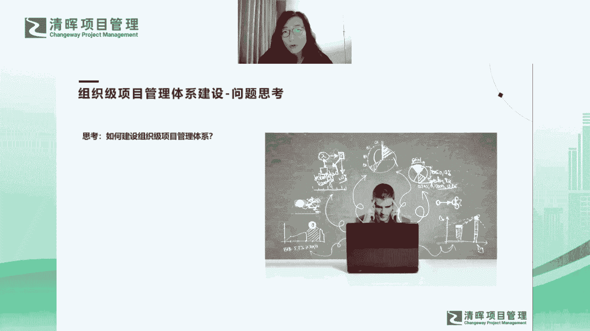
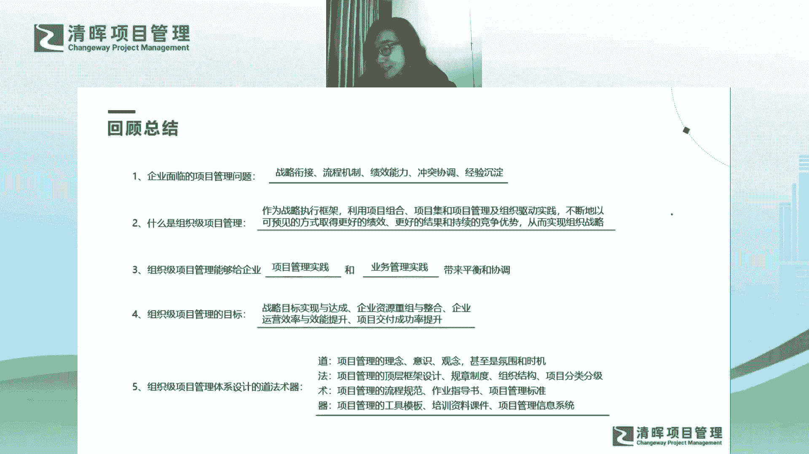
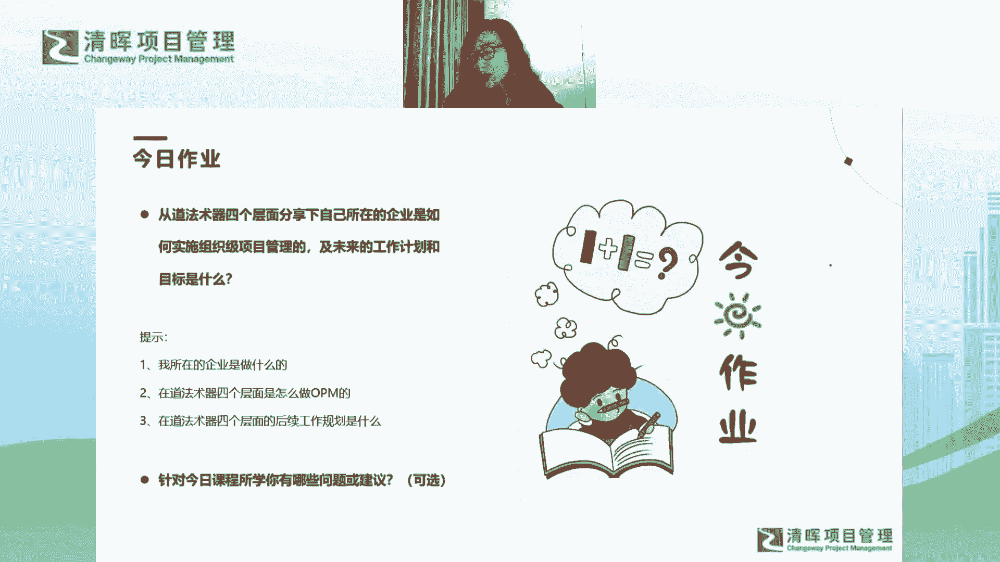

# 组织级项目管理体系建设框架 - P11：组织级项目管理体系建设-问题思考+作业 - 清晖Amy - BV1EZ421g7nZ

好呃然后这里面呢有一个问题思考啊，就怎么去建哈，我觉得这个问题我下次课刚才提到，我们做了好多剧透哈，下次课可会会给大家讲这个问题哈，但这里面呢如果是我们的现场客户，就会引发这个问题。

会给让大家做一个小组讨论，那说了这么多，我都给大家整个的体系的设计，也给大家全景图了，那我们怎么去建这个体系哈，我会问到大家，然后大家也是，我们今天线上课就就不做讨论了啊，大大家带这个问题去思考吧。

然后你会有自己的想法，有自己的见解，然后下次课我再去揭晓答案的时候，我相信大家就会有有不同的收获哈。

所以大家这个问题呃，我觉得大家线下思考一下哈，哦所以呢嗯我们今天的整体的课程内容，我觉得就就差差不多了哈，啊，然后我就给大家做一个最后的一个回顾总结哈，这个回顾总结大家也要关呃，关注一下，注意来听哈。

那包括了我们整题今天课程的所有的内容哈，第一就是我们今天课程讲了一个哦，讲了一个逻辑不闭环，对不对，我们首先去讲了，企业目前面临的项目管理问题都有哪些，对不对，那刚才有一个同学也把问题总结的特别好对吧。

这个五个问题当然我提到了这个五个问题，其实并不是穷举了对吧，大家也可以想一想，除了这五个问题，现在还有没有相对来说会比较困扰你的企业，项目管理的问题哈，那在这个问题的引发之下呢。

我们就引发出了什么是组织及项目管理，对不对，组织项目管理呢，我不希望大家来背这个定义啊，更多的是大家要去找到它的一个精髓在哪里，对吧，你要去找到它的拆解，然后理解它具体要讲的事情是什么，对不对。

这里有很多很多的关键词，我给大家去做了很多的渗透和很多的说明哦，然后大家要关注对吧，嗯那组织及项目管理啊，它能够给企业带来平衡和协调，那我给大家画了一个圈圈，对不对啊，那个圈圈我还给大家画画了一个反例。

对不对，所以更多的是我希望告诉大家，就是我们的OPM，你要找到项目管理实践和业务管理实践的，一个最终的一个交集对吧，这个交集其实你要去协调很多的内容，而且这个交际才是最终能够为组织战略。

目标的达成产生贡献的，我们的OPM的一个最终的一个核心，对不对，好了呃，我们组织及项目管理建设的一个目标是什么哦，我讲到了四大目标哦，这四大目标大家还记得是什么吗，可不可以考一下大家。

手机项目管理建设的目标是什么，当时我提到这四大目标的时候，我还特别说到，这四大目标其实是解决了我们这五大问题的，大家还记得这四大目标是什么吗，来有没有踊跃回答问题的小伙伴，就考大家了哈，好极了好极了嗯。

最重要的一个目标，就是他要保证战略目标的达成和实现，对不对，我天哪，唯心唯物同学，你好厉害，你比我记得都清楚，维新维护同学嗯，我觉得维新维护同学可以嗯，可以可以可以得到一本书。

再送给唯心唯物同学一本书啊，我们今天第一次课程，我多送点书，没关系啊，嗯快来跟我要书吧，你砸的非常棒啊，答得非常棒啊，嗯就是这四个四个非常重要的能够实现的目标，这个目标也解决了我们刚才提到的问题对吧。

第一是战略战略达成，第二是资源重组呃，资源的重组，第三是运营效率和效能提升，最后是交付成功率，我们最主要的是要保证项目的交付成功率对吧，嗯然后最后讲到道法术器哈，道法术器大家也不用不用死记硬背了哈。

大家就理解是什么就可以了，然后特别是我盖的那个房子，那个房子其实说明了很多问题，对不对，我提到了我们会有地基对吧，会有柱子，会有房梁，然后以及或的屋顶对吧，那这四个四个东西缺一不可。

你会发现缺了一个东西，这个整个它就不是体系了对吧，这个房子也不成为房子了，那个房子一定会出现各种各样的问题，对不对，我们也可以去对标，目前我们所在的企业出现了哪些问题。

嗯好了嗯，关键的关键最后的作业了啊，我已经说到作业了啊，这个作业大家关注哈，我们作业也会在，我会在我们的课链接里给大家发布哈，大家关注一下，我先讲一下这个作业哈，这个作业呢刚才我提到了我们的道法数据。

四个层面哈，其实我更多的是希望在体系设计的环节，给大家做一个拆解，让大家理解道法书第四个层面，然后同时我也给大家了一个全景图，对不对，那大家可不可以今天结合我们的课程所学，从道法术器四个层面分享一下。

你所在的企业是怎么去实施opp m的对吧，以及你未来去实施OPM的工作计划和目标啊，那我们可以给大家一个提示啊，比如说你可以讲一讲，你所在的企业是做什么的对吧，然后从道法初期四个层面是怎么做OPM的啊。

以及我们从这四个层面，后续的工作规划是什么啊，你既可以作为作为啊，作为一个嗯参与者啊，或者作为一个主导者，或者作为一个普通员工，Anyway，你其实作为什么样的角色啊，我希望你能够提出啊针对课程所学。

你的未来的一个计划和你的一个设计啊，我相信他一定可以让我们的企业能够能够受益，嗯这是我们的第一个主要主要的一个问题哈，然后第二个问题呢，就是哦看看大家针对今天的课程所学，有什么问题或建议啊。

这道题是一个可选的题，然后大家也会发现未来的课程中，我们每一次课程的最后一个题，就是每一次课程两个题，第二个题都是这道题啊，就是大家的问题和建议，我希望随时可以在我们的作业中提出。

然后我也会针对一些问题和建议给大家做解答，因为我相信我们每次课程刚刚学完，今天我刚刚讲完，让大家提问其实是很难的一件事情啊，因为大家其实刚刚听完，其实还仅仅是一个没有完全吸收的状态。

其实大家还不可能有深入的思考，而当你完成了作业，甚至是反复去咀嚼今天所讲的内容，反复去看回放之后，我相信大家就能够有一些新的体悟和，新的一些一些一些收获吧，然后这个过程中。

我相信大家如果能够提出问题或者建议的话，一定是经过深入思考，一定是有价值的问题或建议哦，所以这个可选的题，我也希望大家能够积极用心的回答哦，好了呃，那我就期待大家的作业了啊，我们作业间周二啊。

一定记住是周二啊。

