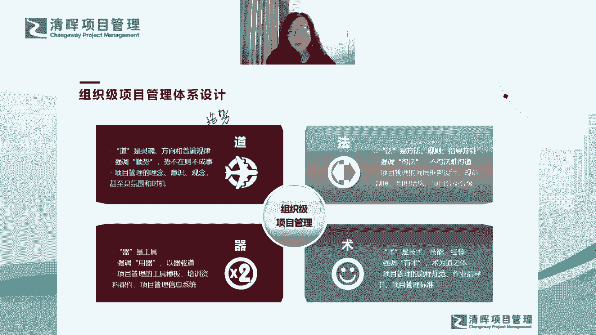
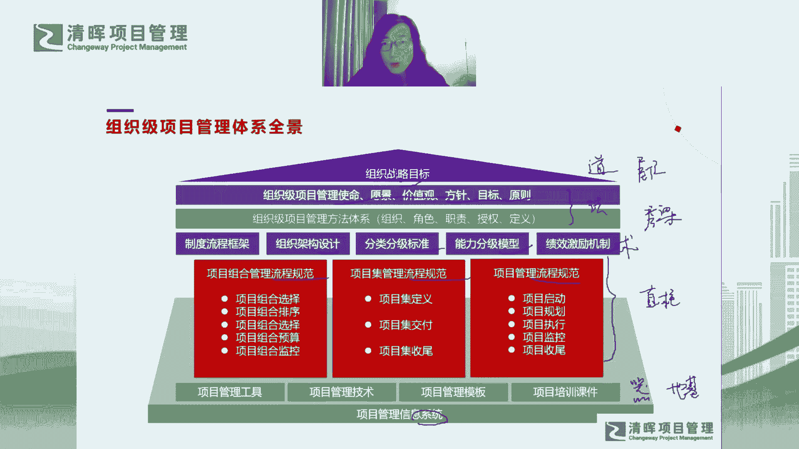

# 组织级项目管理体系建设框架 - P12：组织级项目管理体系全景图 - 清晖Amy - BV1EZ421g7nZ

嗯所以讲了这么多呢，我们就来看一下全景图哈，全景图是基于我们整个体系设计的思路哈，那我们就会有这样的一个全景图，这个全景图怎么看呢，大家会发现，我们首先OP m的最终目标，是支持组织战略目标的实现。

对不对，所以呢在最顶层，这这是个房子对吧，大家看得出来是房子对吧，那在这个房子的最顶层就是它的屋顶对吧，这个屋顶就是我们的什么呢，这屋顶包括战略目标对吧，然后目标你其实可以把目标拆解成愿景，使命。

价值观方针，目标原则，对不对啊，所以他是这样的一个拆解的过程，所以这个屋顶上是什么，更多是更多是道德层面对吧，哦然后道德层面再往下就是法的层面了，就是你会发现这些这些内容，其实其实更多的是法的层面。

就是它会有方法体系，组织角色职责授权定义对吧，它是一个大法好，然后这个就是法对吧啊，然后再往下拆解，其实就就竖了嘛对吧，竖的话就有流程框架设计标准对吧，分级模型啊，包括我的一些机制。

还有我的一些规范对吧，这就是术的层面，数的层面就到了对吧，然后最后呢就是气的层面了对吧，器的层面包括工具技术模板，课件信息系统，所以你看这个房子是这么来搭的哈，那它说明什么呢。

说明首先就是我们从下往上看哈，这个气更多的是什么呢，你发现气它就像是一个地基一样对吧，它是来去支撑整个房子，他要支撑这个房子能不能盖得更高，对不对，能能不能盖得更坚固，这个地基打得越牢。

是不是这房子就可以盖得更高对吧，所以气也是非常非常重要的，它的工具对不对，然后再往上呢就是这个这个这个树对吧，这树更多的是什么呢，就像就像是我们房子的这个支柱一样是吧，房子要有支柱对吧。

这个房子才能你真正把它撑起来对吧，然后再往上呢就是什么呢，这个这个法法更多的是什么呢，就是它是房梁对吧，它是我们那个支撑屋顶的那个大梁啊，它是横向的大梁，然后他能够把屋顶真够能够支撑起来对吧。

然后它也需要依赖于这个柱子对吧，柱子才能够彼此之间有一个很好的衔接对吧，然后他们彼此之间才能够有一个很好的协同，对吧，然后最后呢才会到屋顶对吧，最后我们才能把这个屋顶要盖起来，这个屋顶如果不盖的话。

那这房子不就漏雨了吗，对吧哈，然后我们我们就没法住人了嘛对吧，所以你看你看这个房是是是我讲了这个房子，就大家理解一下，它其实是一个这样的一个逻辑结构对吧，你其实要打地基，然后你还要建支柱。

然后你要有房梁，最后再盖屋顶，那你那你其实这个房子才会有一个，相对比较完整的一个整体，然后我们能够把所有的这些这些这些内容，这些模块去协调联动对吧，然后你这个这个这个事情，才是一个成体系的事情对吧。

所以我们就防止什么呢，防止有些企业它就什么呢，比如它只它只盖柱子对吧，然后或者他只打地基啊，上来就打地基对吧，然后呢打地基没问题啊，但是你不能只有地基对吧，你得考虑一下柱子，包括房顶。

还有你的你的这个屋顶啊，我们很多企业盖的房子是没有屋顶的房子对吧，他没有战略目标，他就光考虑这些执行对吧，他没有屋顶的话，刚才提到没有屋顶，房子就漏雨了，对不对，那你只有屋顶，然后只有房梁。

然后你你没有后面的支柱，也没有，也没有，也没有这个地基，那你这个房子怎么了，你就落不了地呀，对不对，也就是高高高高在上，悬浮在上面，对不对，对不对，我们是不是从这个全景图上你就会发现。

现在很多企业存在的问题，从这个全景图上你就可以解读出来，解读出来这个问题。

