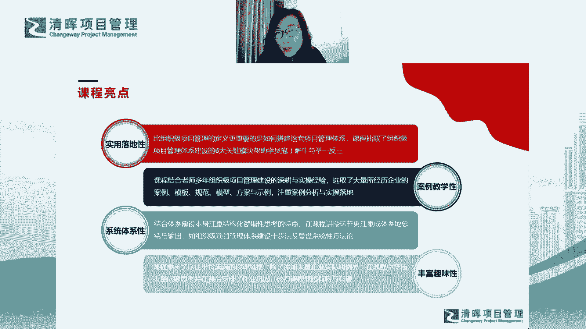

# 组织级项目管理体系建设框架 - P3：课程亮点 - 清晖Amy - BV1EZ421g7nZ

我的课程的亮点哈。

也特别想跟大家说哈，我自己总结我们的课程有四个亮点哈，这四个亮点。

首先第一个亮点叫实用落地行，为什么呢，因为嗯就是像我这句话写的哈。

我这句话叫呃，比我们的opp m的定义更重要的是怎么去做。

对不对，我们如何去做，这也是我经常跟大家去交流，项目管理的过程中。

大家经常会问到我的一个问题，就是呃老师你讲了那么多PMO啊，讲了那么多课程。

你能告诉我，你能告诉我我如何去说服企业的管理层。

去成立一个PMO，对不对啊，大家会经常会问我这个问题，就我连PO都没有。

我听你讲了半天PMO怎么做对吧，那那那首先我我我是。

如何在我的企业里成立一个PMO，这就成为我的一个难题对吧，因为我成立PMO，不是说我说成立就成立的对吧。

我需要说服管理层对吧，那一般遇到这个问题，我一般会给大家的回复是什么呢。

哦你不要你不要想着去成立PMO，你也不要想着去说服管理层。

去帮你搭建一个这样的组织，然后你就可以去发挥你的效能，发挥你的价值。

而是什么呢，而是你要考虑一下企业目前面临的哪些项目。

管理的问题对吧，你要去跟管理层说，我觉得目前企业内部面临了12345。

一共五个问题，这五大项目管理问题呢，是我们企业内部。

其实是相对比较根深蒂固的问题，那么这五大问题呢，我希望未来通过什么样的一个通路。

通过什么样的一个渠道，通过什么样的路径，然后去把它解决。

而解决这五大问题，我认为我们现在成立一个PMO这个组织。

可以帮助我们把这些问题都解决啊，如果你要用这样一个口吻去跟管理层去沟通啊。

那我觉得啊，你的八成这件事就可以做起来了对吧，所以我们并不是说为了成立PMO。

而去成立PMO，而是我们要把要去为了解决组织的问题。

我们才去做我们的OPM，做我们的呃项目管理体系的建设。

做我们的整个组织，企业宏观的项目管理对吧，所以呢我会更加注重我们的课程。

一定是使用落地的，也就是说要教给大家呃，或者带着大家一起去实践我们的所有的课程。

学到的方法，我们如何在企业中去应用和落地对吧。

关键是如何去适配，如何去真正执行和推动落地啊。

而不是说我们我们我们参加这个课程，我们仅仅是学的一套方法论。

如果去学到一套方法论的话，大家可以自己去看书啊，对不对，现在各种各样的项目管理书籍那么多对吧。

所以我会抽取啊，也刚才也提到为什么是六个核心模块。

我们有六个基本点对吧，我会带家大家一起去把这个庞然大物。

把这条大象啊慢慢的把它拆解开，然后让大家去举一反三，让大家真正能够推行到企业中去使用落地好。

所以这是第一个使用落地性啊，嗯那第二呢呃第二就是说呃大家会发现。

其实我们讲到实操，我们讲到落地这个过程中。

其实我们就不仅仅是概念啊，不仅仅是定义。

而是说我们怎么去把这种经验的东西，这种这种所谓的呃所谓的多年的所积累的东西。

能够给大家呈现出来，所以这里我一定会给到大家很多的案例啊。

包括一些模板啊，包括甚至我有一些总结的模型。

一些方案和一些事例，然后帮助大家去怎么去把它们真正用用起来啊。

所以这些东西其实大家可以拿来即用对吧，这个案例教学性的一个非常好的一个优势。

就是大家是拿来即用的，即插即用的，而不是说大家还需要再去做创新。

然后再去做，再去做自己的二次开发，对不对啊，所以案例教学性这个我觉得是第二点啊。

然后第三呢就是系统体系性哈，这个嗯我觉得大家应该能听出来。

因为刚才我在讲整个课程逻辑，所以我也希望我们的课程。

其实是注重它的结构性和逻辑性思考的特点哈，所以我希望能够给大家一些成体系的一些输出。

一些总结，比如说我在我们下次课程。

第二次课程，我会给大家讲一个体系建设。

如何去建设，那我就给大家总结了十个步骤对吧，以及未来我们去讲复盘也一样。

复盘的整个的系统性的方法论，其实它也有相应的一个步骤，我希望能够给大家一个步骤。

一个流程对吧，这个流程和步骤大家就可以套用啊。

甚至是你你可你可以裁剪，但是我给到大家一个全套的东西对吧，然后最后大家裁剪之后。

哪些是适用于自己企业的对吧，你就可以把它留保留下来啊。

不适用自己的企业的，你就可以先把它裁剪掉，那也许哪一天你换了一个企业，那么之前你被裁剪掉的东西。

你其实还可以保留出来，你可以把它再翻新出来，对不对，那给到大家全套的东西。

大家是不是就可以去适配对吧，所以这个系统体系性。

我觉得是是第三个非常重要的啊，嗯然后最后呢丰富趣味型啊。

就刚才提到嗯，这个这个刚才提到我自己说话语速特别快哈啊。

然后大家也会发现，就是就是我给大家东西一定也是干货满满啊。

这个这个这个干货呢，这个事呢其实跟语速有有点关系啊，我想说我想说明什么呢。

就是因为本身也是内容会比较含量，会比较比较干啊。

没有太多的水分，然后同时再加上我自己本身语速比较快啊。

然后你就会发现这个课程的内容含量哈，真的是有点有点多哈，然后大家也会觉得就是就是会收获满满啊。

然后会收获颇丰，然后也会相对比较丰富哈。

所以大家这个过程我希望大家一定要跟下来，就是你在跟的过程中。

你你付出了时间对吧，包括课后的回放啊，课后的复习。

课后的作业，你真正投入进来的话，我相信嗯就是一分耕耘。

一分收获，一定会有收获哦，所以呢那过程中我也会穿插大量的问题思考。

以及课后安排的一些相关的一些作业，包括点评，包括其实大家也可以私聊我。

然后跟我去互动，然后跟我去提一些具体的问题对吧啊。

然后我的课程也是啊，也是同行啊，同行会评价会呃，同行会评价有料加有趣哈。

我也希望我的课程真的能达到这样的标准哈，那我希望是有料有趣加有效啊。

有效呢就是什么呢，就有疗效，对不对啊，嗯有疗效啊。

要治治大家的这个就大家有病啊，然后我来我有药。

然后这个我的药能够治，我们的企业里面，真的呃根深蒂固的一些项目管理的问题啊。

