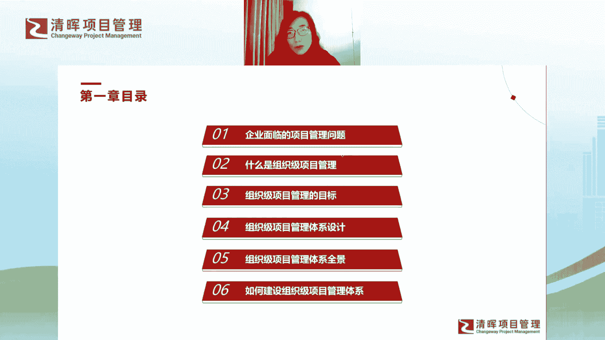
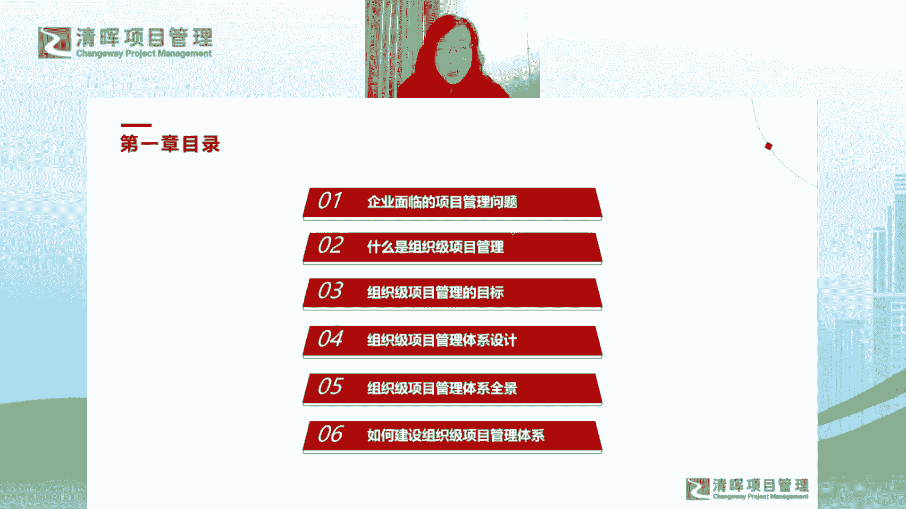
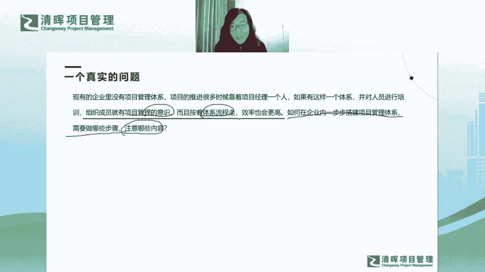
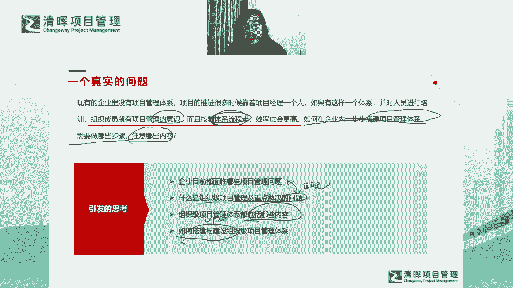

# 组织级项目管理体系建设框架 - P6：如何建立OPM框架 - 清晖Amy - BV1EZ421g7nZ

讲怎么去怎么去建建设，这个OPM的整体框架哈。

那说到整体框架呢，首先呢就会有一个真实的问题哈，我们是由问题，我们是带着问题去导入我们整体的课程的，我们带着问题去思考，我们怎么去5PM哈，那这个问题呢呃大家看看这个问题啊。

这个问题也特别特别特别跟我有缘哈，是我们清辉社区的老师啊，给我发了这么一个问题，他说有个同学给他提了个问题，说张老师你要不要，你要不要给大家讲一讲这个问题，你是怎么理解的哈，大家看到这个问题是什么呢。

他说现有的企业里面呢没有项目管理体系，那项目的推进呢，很多时候就靠着项目经理一个人好，那如果有这样一个体系呢，我们对人员去做培训对吧，然后你看组织成员就会有项目管理的意识对吧，那同时呢按着体系流程走。

我们的效率也会提升对吧，效率会更高对吧，那如何在企业内一步步去搭建这个体系呢，对不对，那需要做哪些步骤呢，注意是哪些内容呢，你看它就引出了我们今天要讲的所有的课题啊，所以我大家会发现我其实标黄的这呃。

标红的这个这句话特别好，就是他会发现我们的组织内的成员没有到，没意义对吧，那大家就会什么呢，大家就会就好像是你在你在盲打的一个状态啊，大家就是在随机的试错，对不对，而如果我们有这样的体系和流程好。

大家是不是可以提效提升整体组织的效能，甚至是大家工作的效率啊，所以这个话题我觉得他说的特别特别好啊，然后呢，呃我们的社区老师给我发了这个问题之后呢，我就在做详细的一个思考。

然后就引出了我们整个的整个的这个课程啊，这个课程我整整写了12次，12节课，我觉得都没有写完，我觉得还有好多东西都没有写进去啊，只能给大家先抛个砖哈，所以呢嗯我觉得也特别感谢这个这个同学啊。

感谢这位同学，这个这个同学今天有没有来我们的直播间啊，有没有来我们的直播间，特别感谢这个同学，我觉得这个同学才是真正的啊，就是就是就是真正的引领大家的引领，引引领我们我们一起哈，引领引领老师。

然后也引领所有今天来参加我们课程的同学，我们在探讨一个非常有意义的课题啊，所以我也特别感谢这位同学哈，嗯看来今天不在我们直播间啊，没有没有没有回复我哈好吧，我希望我希望未来能够能够结识到这位同学哈。

啊那由这个同学嗯引发的这个问题哈，其实我就在想就是我们引发的思考是什么啊，啊那我的思考逻辑是这样的，就是呃他提到了一个问题啊，他提到了一个真实的问题，但是这个真实的问题会引发我去思考。

那我们企业内部目前都会面临哪些项目，管理问题呢，肯定不止这一个问题，对不对，我们要总结一下现在都目前面临哪些问题啊，然后呢我们什么是什么，是组织性项目管理对吧，你看他要一步步的去建立搭建体系，对不对。

然后他要有什么呢，要有这种体系流程，那么组织项目管理和他重点解决的问题是什么，那这两个问题你会发现，他们有没有一个逻辑的匹配关系呢对吧，他们如果能够匹配上的，是不是就说明了OPM能够解决。

我们以上这个小伙伴提出的问题，对不对，所以要找到一个匹配关系对吧，那找到匹配关系之后呢，我们就看OPM是什么对吧，我们还要把它拆解去看OP是什么，它包括什么啊，以及如何去搭建啊。

所以呢整个第一章的整体的设计呢，也会按照这个这个逻辑思考啊，给大家去设计整个的一个逻辑的一个架构。

