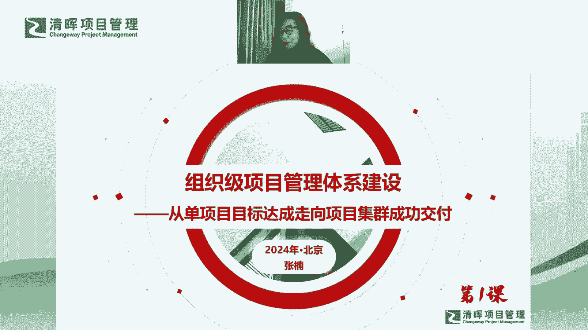
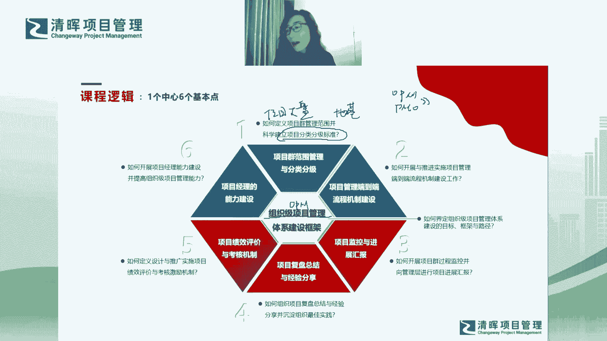

# 组织级项目管理训练营--张楠 - P7：一个中心6个基本点(1) - 清晖Amy - BV1xfYkeuENH

那首先就是我们整体的这个课程逻辑哈，那课程逻辑呢我总结是一个中心六个基本点啊，所以特别好记啊，什么叫一个中心六个基本点呢，第一个这个中心是什么呢，是指的是，我们其实整体的组织级项目管理体系建设啊。

我们叫哦我们这个专业名词啊，我们组织级项目管理体系的专业名词，其实呃它叫OP m，OPM呢整体的体系的建设，我一定会先从整个体系建设的顶层设计开始，先给大家讲啊。

也就是说我首先它会围绕着整个的建设的一个，体系的框架给大家讲，那什么叫框架呢，就好像我刚才提到，这个整个的OPM的管理体系的建设，它是一个庞然大物对吧，他有这么厚的一一本书啊，这么厚的厚度的一一摞书。

对不对，然后他领取了很多很多的知识，很多很多的领域，对不对，所以他是一个庞然大物，它就好像一头大象一样啊，那我们当我们看到一个庞然大物的时候，我们去我们我们怎么才能够去了解它，那我倾向于说。

先要给大家一个整体的一个框架性的认识，包括我要从最顶层最宏观，我要看到一个全貌的视角对吧，我看到庞然大物，我先先去看它全貌的视角对吧，然后我有了全貌之后，有了宏观的一个相对比较。

对它一个比较粗的认识之后呢，我其实就要把它拆解，我会把它拆解成好几个部分，或者说你可以说把它拆解成好几个模块啊，就像大象一样，它会有有有象牙，有有有耳朵，然后有他的头，有他的身子，然后也有它的尾巴。

有的大腿，对不对，然后我们就会去分每个模块去分别去看对吧，然后分模块去看的时候，我们一定会什么呢，我们一定会像剥洋葱一样，对不对，我们一层一层的把每个模块剥开对吧，剥开看的过程中。

我们就会把它的细节对吧，把它看的更清楚啊，这样的话呢在过程中你其实会有什么呢，会有很多的会有很多的问题对吧，然后你也会有很多的反思，你也会有很多的总结，然后当时当当然你在提问的过程中。

你在发现问题和解决问题的过程中，其实你就能够对这个东西能够看得，更加的清晰啊，所以这是不是我们任何一个学习，学习任何一门领域，学习任任何一门知识体系的一个过程，就是你一定是先去看全貌对吧。

先去看整个森林，然后我再把森林肢解开，然后去看其中的每一棵树是什么样子的，然后对最后呢我就从总到分，然后再从分到总，对一个事物就会有一个全面的了解对吧，所以我的课程基本上是这个逻辑。

所以我在讲讲到这个庞然大物的时候，我也会用这个逻辑去讲，所以第一章呢我会给大家讲这个一个中心，也就是说它会围绕整体的这个全貌的中心，然后我们来去做拆解啊，然后下面拆解呢最后我会拆解出六个基本点。

这六个基本点是什，并不是说组织级项目管理体系，它只包括六个方面，因为它包含的方面是包罗万象的，是非常多的，但是呢我会从整个这个庞然大物中，给大家抽取出六个啊，抽取出六个比较核心的模块。

我相信你能够掌握这六个模块之后，你基本上去做一个opp m体系建设的工作，应该是可以去落地的，所以我选取了六个非常重要的模块啊，那第一个模块呢，就是什么叫项目群范围管理和分类分级啊。

那更多的这个模块想说的是什么呢，想说的是当你想去做OP m的体系建设的时候，首先你要有什么呢，首先你要有一个项目大盘啊，这就是项目大盘对吧啊，这个项目大盘呢是干嘛的呢，是便于你去了解到，便于你去掌握到。

今年我要管理什么样的项目对吧，这个项目都有哪些的范围对吧，项目范围内部都有哪些的项目，然后它是一个整体的一个项目，通盘的一个管理对吧，他就建立了你对于今年你要管理项目，你的一个工作目标是什么啊。

或者说是你的工作对象是什么对吧，它是不是我们的一个工作的一个，非常必备的一个基础啊对吧，就是你要管什么对吧，所以需要先把这个项目大盘要建立起来对吧，然后有了项目大盘，我们知道要管什么之后。

我们要建立什么呢，这个项目的分类分级标准啊，是一个非常非常重要的一个顶层设计，为什么呢，因为你会发现，当你有了项目的分类分级这个顶层标准之后，你才会考虑，比如说我怎么去建流程啊对吧，怎么去建规则呀对吧。

然后怎么去监控项目呀，怎么去做阶段评审啊，对不对，怎么去给管理层做汇报啊对吧，然后包括我怎么去做项目的复盘总结，然后我的项目的绩效评价对不对，我怎么去评价项目经理啊，然后我怎么去给项目经理建立他的能力。

发展的序列和通道啊，你会发现这些都建立在分类分级标准的基础上，对不对，因为针对不同的分类和分级的项目，我一定会行使不同的项目管理的手段，项目管理的规则，项目管理的要求以及最终量落地的一些标准，对不对啊。

所以第一章是非常非常重要的，第一个基本点，它也是其他所有基本点的一个地基啊，这是地基啊，所以第一章呢要先给大家讲这个嗯，好这地基啊，六个基本点的第一个基本点啊，然后到第二个基本点啊。

那就提到了我们其实有了标准之后，我们就可以做一些相关的一些，最基础性的一些工作了啊，那你会发现端到端的流程机制的建设，这基本上是我们现在很多的PM啊，很多的PM在做的一件事情。

我们基本上所有的本土内的企业，如果你成立了PMO，你想去做这个这个项目管理的，整个的宏观的统一的管理，大家都会发现大家都要做这个流程机制的建设，那么流程机制的建设我们为什么要去做，对吧。

我们做流程机制建设，我们希望解决的是什么样的问题啊，我们希望解决的是其统一宏观的一个，项目管理的标准动作和项目管理的标准打法，那么他希望解决的问题是，我能够使我的多项目合规运营。

以及最后多项目的成功交付啊，所以流程机制需要做什么，以及它解决的问题，我会在第二个基本点里，给大家做一个通盘的讲解，那么流程呢这一章也是我认为非常重要的，我们在做OPM建设的过程中。

的一个非常核心的一个模块啊，也是一个基础模块嗯，好然后就会见呃，然后就会到我们的第三个基本点哈，我们讲了分类分级对吧，然后我们也有了流程机制，那我们下面就是怎么样呢，我们就是建了流程。

我们就要辅导整个流程机制的落地，对不对，比如说我们要去做阶段的评审对吧，我们要去做整个流程阶段的这个阶段关卡，或者叫你的阶段节点的准入准出的机制的建立，对不对，这个准入准出的机制的建立。

不仅仅是你要建立这样的一个规则，这样的一个通道，更多的是你其实是要带领团队，你要带动项目经理团队对吧，去把他辅导落地啊，所以这个过程中，其实我们要做很多关于项目的监督控制对吧，项目的指导时间啊。

整个项目管理规则的落地，然后我要去做适配，而且我要我要我要辅导团队去查阅我们的项目，有哪些是需要裁剪的部分对吧，还有就是我要反向，同时反向去驱动流程机制的更新和迭代，让它变得更完善，让它变得更适用。

让它变得更加接地气对吧，所以监控的这一章，其实我们能够去从PMO的角度来讲，其实你从团队输入很多的东西给你，那同时你也可以去反哺团队，很多的机制建设的一个落地对吧，那这是监控这一章嗯。

那监控为什么坏和汇报放在一起啊，其实监控和汇报是两个单独的模块，而且他们各自呢都会有，相对来说比较重的一个比重，那把它放在一起的原因是因为什么呢，是因都是从监控中获得，我们需要去做汇报的信息。

而监控呢又是我们整体项目进展，汇报的一个基础哦，那汇报这一章呢，我更多的希望强调的是，PMO其实有一个非常重要的功能，就是它一定是什么呢，它一定要连通我们从高层到执行层，到一线员工之间。

他要打通整个纵向信息，纵向的项目信息的一个一个一个通路啊，所以说他也是一个枢纽这个环节对吧，他对上他要给一号位有一个很好的一个交代，他要给一号位一个项目全景图，那么他对下呢他也会指导一线团队。

指导我们的项目团队去更好的去实践，去更好的落地，去更好的去把一号位的一些管理的举措，最终变为现实啊，所以这是我们第三章啊，啊其实不是第三章，是第四章了啊，我们的第三个基本点，是我们第四章要讲的内容嗯。

好，然后再往下呢是我们的复盘总结和经验分享啊，这一章呢我自己也是特别的啊，我特别的觉得这一章也是非常重要的啊，因为大家会发现呃，其实我们所谓的目前大家说一说乌卡时代哈。

后来我们我们现在其实这两年更新迭代，一个新的词叫BENI时代，我觉得anyway，不管怎么说哈，其实你会发现这个时代越来越需要什么呢，越来越需要大家大家去有这种复盘的能力，为什么呢。

因为很多的东西是需要是是是从无到有的，是完全创新的，在这种情况下，其实你可能没有更多的以往的继承的经验可学，这个时候你怎么办啊，你想去不断的更新，你想去不断的去完善，你就需要什么呢，你需要向内求啊。

而复盘总结其实是一种向内求的方式，就是你其实我自自己的亲身经历啊，不管是对于个人还是对于项目，还是对于企业来说，你是通过自己的亲身经历，然后不断的去总结对吧，然后你就不断的去找到可以改进的方向。

然后同时你有了行动计划之后，你不断的去迭代，不断的去升级，然后你自己是在做自我完善的一个过程啊，所以大家会发现这个时代越来越重视复盘，为什么，因为这个时代它变得更加的创新，它变得更加的模糊。

它变得更加的复杂，它变得更加的有不确定性的情况下，我们更加需要向内求啊，所以第四个基本点，我希望给到大家的不仅仅是我们如何去做项目，复盘总结，他应该站在更加广义的角度上，我们如何去做任何事情。

所有的事情包括个人，包括项目，包括组织，我们如何去做复盘总结，这是一种什么，这是一种我们现代的人，现代的职场人，生长在这个时代里，你必须具备的一个基本的技能，基本的生存技能啊，所以这是第四个基本点。

我希望能够给大家带来的东西嗯好了，那就说到了第五个基本点啊，大家会发现这几个基本点呢，真的是每一个比每一个经典啊，每一个比每一个必须，那项目的绩效评价和考核机制，它决定了什么。

它决定了我们如何去评价项目对吧，它还决定了我们如何去评价项目经理，同时它决定了我们如何去提炼出，组织的最佳经验实践，对不对，所以它是一个非常核心的一个环节，那也是我认为现在目前大部分的本土企业。

其实你在你在看到他们去做项目，绩效评价和考核的时候，其实都会有都会有一些缺失啊，然后也是一些呃，也是大部分企业我认为做的不够，不够完善的地方，那为什么这个这个环节，这个领域大家做的没有那么容易。

没有容易做得那么出彩，或者说大家为什么在这个领域做的会会碰壁，会有卡点啊，我觉得本身也是因为这个领域，其实它是企业内部啊，不仅仅是项目项目管理，而且是整个企业管理中的一个核心的矛盾点。

也是一个核心的利益冲突点啊，大家同不同意啊，这个观点哈，你会发现，其实触碰了绩效评价和考核的这样的部门啊，它往往是什么呢，就是往往我觉得它是一把双刃剑啊，怎么说呢，就是它既是一种权利啊。

同时呢如果你没有把它去很好的去推行落地，或者你在过程中没有没有处理好，彼此各个相关方之间的关系意义，你往往会看啊，触碰到啊，你你你你不应该去触碰的一些一些矛盾点，这个矛盾点可能会使你陷入泥潭啊。

所以他其实是一个非常敏感的地带，非常非常嗯非常不好去拿捏的一个领域啊，那当然在第五章呢，我希望给大家讲到的是什么呢，我希望大家能够掌握具体的这个实操的，这个落地推行的方法论。

那至少让大家在走到走到这条路上时，当你需要走到这条路上时，至少你知道怎么去避坑，你知道怎么去顺利的推行，你知道怎么去去防止去触碰到不该触碰的地带，然后最终呢能够让这个工作给我们的PM。

或者给推行的部门能够增加你的收益，甚至是增加你的权利，它是一个莫大的权利啊，当然这个权利取决于你要有一把，真正你可以去去挥舞的剑啊，这把剑你能够真正把他挥舞好，然后你才能够把这个权力用到用到极致啊。

然后用到一个相对比较比较，比较好的一个状况啊，这是第五章哈，所以第五章也是相对来说比较比较比较敏感，和比较好矛盾聚焦的这么一个领域啊，好了，那这是第五个基本点了啊，然后最后一个基本点呢啊。

你看这个第六个基本点也是特别重要的啊，就项目经理能力建设，因为为什么啊，因为我们提到组织机的项目管理啊，我们提到呃，我们提到这个呃OPM的整体的建设工作，你会发现呃，其实其实其实这里面呢你就会发现嗯。

就是就是我们我们怎么去提升，组织机的项目管理能力啊，这就成为了当前的一个必须的一个啊，必须的一个要做的事情，而提升组织级的项目管理能力啊，大家不觉得提升组织的项目管理，其实就等同于。

你要去提升项目经理的项目管理能力哦，因为只有项目经理的项目管理能力提升了之后，你才会发现真正组织的项目管理能力，才有实质性的提升好，所以项目经理能力建设呢，我始终认为它是一个。

它是我们OP m整体体系建设的一个核心，但目前这个领域呢，我也认为我们整个本土企业在做的过程中啊，在实践和实践实行执行的过程中，其实也是差强人意的，所以我也特别想把这个话题拿出来，我们一起来去做探讨。

我们一起去探讨它的可行的路径，他的工作步骤啊，然后以及在过程中，我们有哪些可能的避坑策略啊，这样的话呢，我们才能够给项目经理去建设他的能力，然后让他不断的晋级，不断的提升，让他找到他的职业归属，对不对。

那最终呢我们提升了项目经理的能力，其实就在提升组织级的项目管理能力，对吧，所以整体的整理的课程逻辑，会是会是这么来去安排啊，嗯然后这里呢嗯我觉得嗯讲到课程逻辑，我也有一个事情想跟大家交代一下啊。

大家会发现其实我刚才提到了两个词哈，呃我会多，我会非常非常频繁的用到这个两个词，一个是OPM啊，一个是OPM在这里啊，O p m，大家知道是组织级项目管理的一个英文缩写，对不对。

然后我刚才还频繁的提到了一个词叫PMO哈，好这个一个是OPM，一个是PM哈，其实都是这三个字母哈，只是他们的摆放顺序不一样哈，那么在我们整体的这个专栏的课程里，大家可以把他们俩啊等同啊。

虽然他们俩的含义不太一样，但是在整个专栏的课程里，大家可以把它们等同，因为当我提到PMO的时候，其实我是希望PMO啊，我我我这就意味着PMO是一个组织啊，是企业中的一个部门。

他的职责就是在推行OP m的整体的体系建设，所以你把PMO建好了啊，你把PMO做好了啊，那PMO的工作开展了，这个OPM其实它也就什么呢，它也就正常的去建设和运营和发展啊，所以这两个词我可能会混用好。

大家就整个过程中注意到就可以了啊，听到这两个词。

大家知道等同。