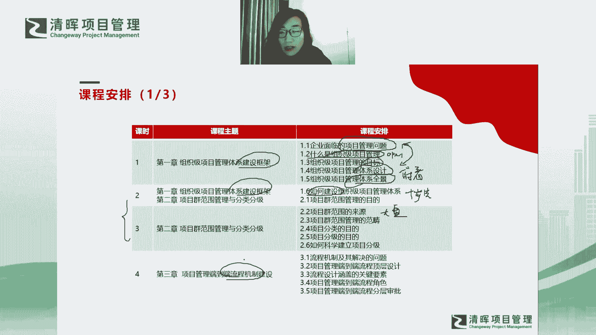
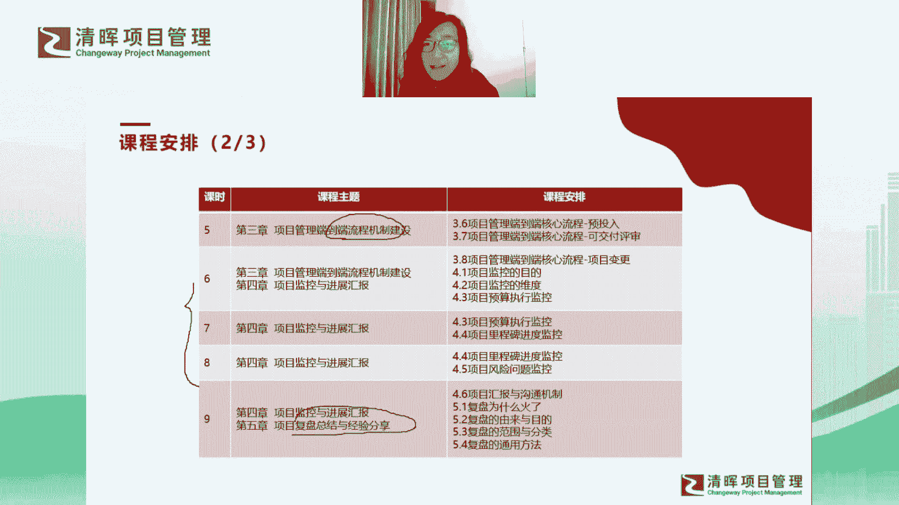
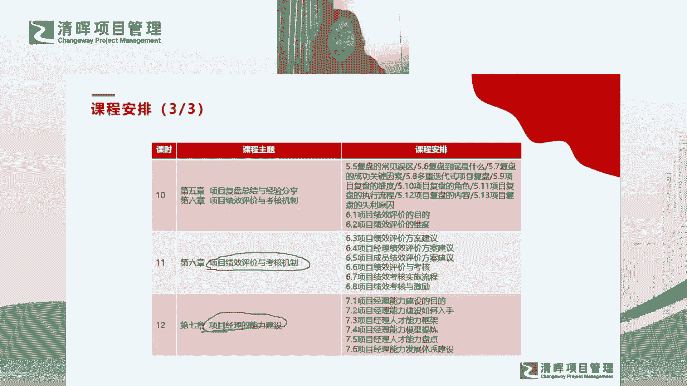
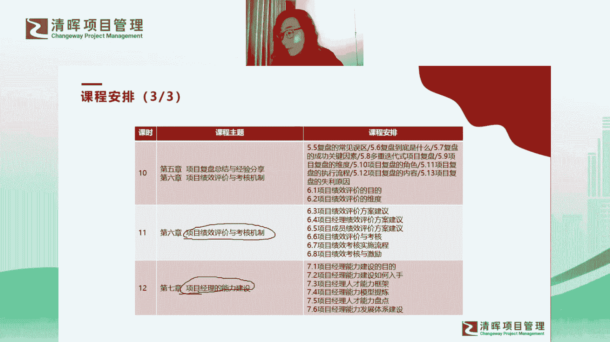

# 组织级项目管理训练营--张楠 - P1：课程安排 - 清晖Amy - BV1xfYkeuENH

顺着我们的课程逻辑呢，就会有我们整体的课程安排啊，然后大家看到课程安排呢，我先呃给大家过一下哈，我们今天呢会重点去讲第一章啊，第一章呢是我们整体的建设框架，刚才提到了哈，建设框架会在啊。

今天这个课程里会给大家交代哈，那整体交代的逻辑呢，我会先从我们企业目前所面临的项目，管理问题入手对吧，我们有了问题之后呢，我们就来看看啊，那当然我们也会有一些逻辑概念，比如说什么是OPM对吧。

什么是OPM对吧，然后OPM的目标是什么对吧，那有了这个目标呢，以及我们现在现存的问题，那这两个之间会不会有个对应关系啊，就是OPM的目标一定是要解决我们的问题，我们的问题遇到OPM之后。

一定可以得到解决之后，我们才要去推行OPM，对不对，是不是这样的一个逻辑关系啊，所以我们先看看关系是不是匹配，OPM能不能解决我们现在面临的问题啊，然后在这个基础上呢，我们就考虑。

那么我们这个组织项目管理体系，我们如何去设计对吧，就是提到我们在顶层设计上，我们出如何去从从高到低去俯瞰这个庞然大物，对不对，以及它的体系建设的全景图啊，这两个呢其实都是我所谓的俯瞰啊。

俯瞰啊是这么写的对吧，俯瞰啊俯瞰一个庞然大物的全景图啊，所以今天更多的是我们是粗看对吧，然后到了嗯下次课程呢我会给大家提出来一个，那我们就看完了这个东西，我们知道这个东西是干什么的了。

知道它解决什么问题了，那我们如何去建设它呢对吧，那所以下一次课程，我会给大家提出一个建设的十步法啊，这个呢我这里面会带大家进一步去看拆解，去看啊，去看还是去看庞然大物啊，去看如何去建设啊。

然后以及呢我们从第二次课开始呢，我们就开始进入到六个基本点啊，六个基本点，第一个基本点刚才提到，就是我们的项目群范围管理。

这是整个项目大盘对吧，有了项目大盘之后呢，还会有项目的分类分级。

所以我这个呢会在第二次课和第三次课，给大家讲整个的第一个基本点哦，然后有了第一个基本点之后呢，我们第四次课开始做流程机制的建设啊，流程这一章呢也是特别重点的一章，因为你会发现这个章呢。

这个章节就是我们现在我发现嗯，我发现所有的PMO在做的一件事情哈，就他们有个共同点，就很多PMO在做的事情其实不一样，大家会发现吗，就是有的PO还在推敏捷，甚至有的PMO去做去做效能度量。

这两这两年敏捷，还有包括我们的研发效能度量非常火，我们很多PM都转型去做这种，新兴的创新领域啊，但是你会发现，其实所有的PM都在做一件共同的事情，就是这个流程机制建设啊。

所以它是一个我觉得他是一个交集啊，他是一个合并同类项，所以这一章呢我会重点给大家放呃，至少是两次课程，甚至两次课程多的时间为大家讲流程机制建设，当然这里面也会有很多的传达的案例啊。

呃然后呢就是我们的监控和进展汇报啊，这个这个部分呢我也会放两次课啊，甚至是两次课多的时间给大家讲监控汇报，那分别会给大家拆解监控怎么去做对吧，然后还有汇报怎么去汇报啊，然后第九章呃，呃然后第九节课啊。

就基本上到了第九节课了啊，就会有复盘总结和经验分享啊。

这个复盘总结呢我说到他其实是个通用能力，所以大家会发现复盘这一章呢，我其实叫内容非常多，我希望给大家建立的是一种通用能力，是一种通用的技能，你不仅是你不仅仅要会去做项目的复盘总结，对吧。

你也不会不仅仅要做组织起的，包括pm我怎么去组织整个大项目的复盘总结，同时呢复盘也是一种通用的能力，我们要把它内化成自己的一种内功，对吧啊，所以这章也是内容比较多啊，然后最后呢。

我基本上会在第十十一和十二两次课里哈，基本上会把项目的绩效评价和考核，和项目经理能力建设，分别放在两节课里给大家讲啊，但是我觉得呢啊，其实我觉得这两个专题其实它要包容的内容，其实真的不仅仅是两节课。

大家会发现我们的所有六个基本点，其实六个基本点，每一个基本点都可以作为一个专题啊，都可以成为一个专栏啊，它都可以有很多很多的内容去做拆解啊，所以这次呢我觉得呃我先给大家抛个砖啊。

然后未来呢我们还会去做进阶，会有专项，然后再去深入细节的课程，然后再给大家有更多的内容。

给大家产生更多的价值，给大家带来更多的东西吧。

