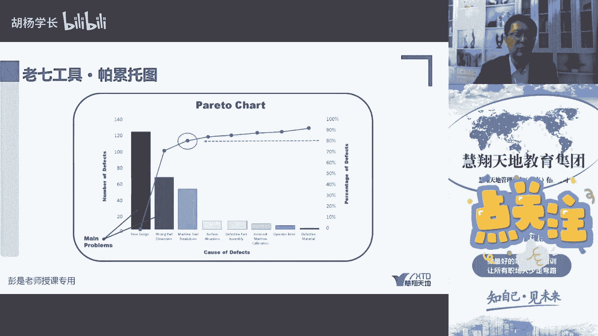

# 老七工具-核查表／计数表 - P1 - 慧翔天地软考 - BV1do4y1j7xb

然后再往下在书上的326页核查表，核查表千万不要和刚才说过的那个质量核对单，千万不要混呐，核对单是，checklist核查表也称为计数表，count，看看它的作用不一样，所以核查表基数表是写数字的对吧。

比如这个手机这地方有个划痕，今天出现了一次，第二天出现了两次，第三天出现了两次两次，以此类推，这周一共出现了七次，这是用来统计数字记录的记录数字，所以又称为技术表，收集数据，收集数据，那对标的话。

你软软件软件开发工作，a类bug，b类bug，c类bug，d类bug，然后可以优化的，可以什么影响美观的，以此类推，根据你们公司对bug的分类，对bug的分类，哪些是属于问题，哪些是属于不是问题。

但是还可以改进的来统计，每天我们的缺陷率，缺陷出现多少。

