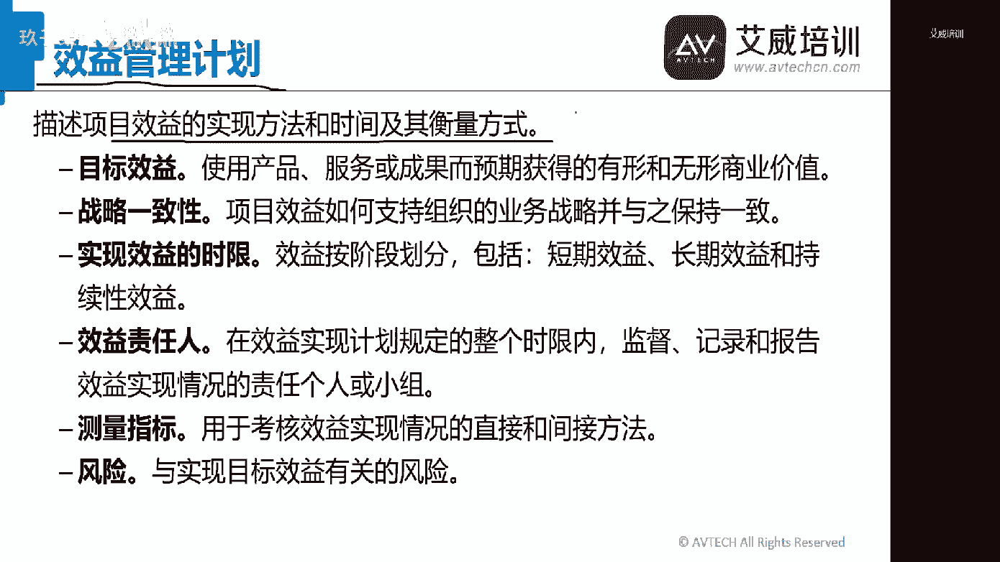
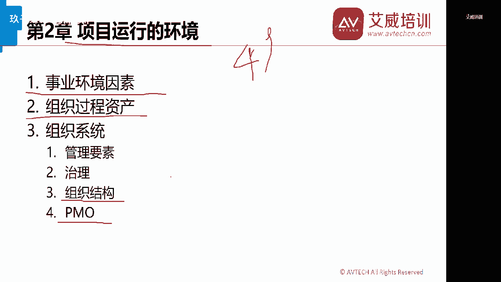
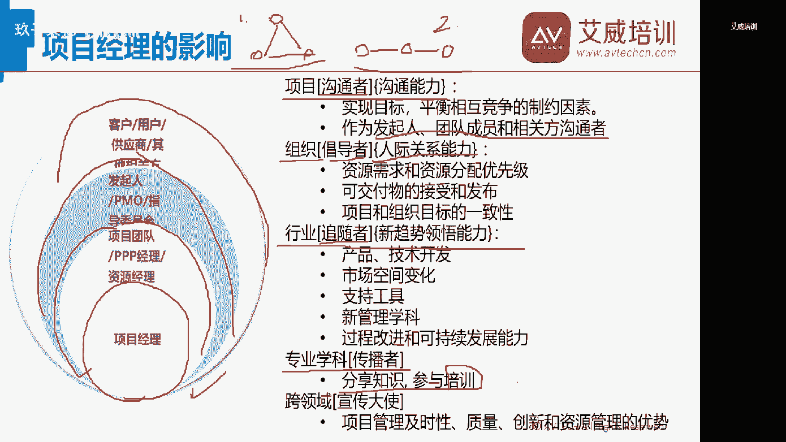

# 艾威PMP项目经理学习教程艾威张璟1-3章-下 - P1 - 玖子柒忆 - BV18m4y1b79R

来讲解一下我们1~3章的所有的内容啊，这次首先先感谢我们的黑皮老师啊，要不然没有他的话，我们基本上还是按照以往一节课，三小时给大家讲，现在一节课差不多变成四个小时，分上下段来讲，哇塞特别爽啊。

好那么我们准备来讲上回书，我们讲到了一个叫商业论证的东西。

对不对啊，之前的是什么呢，资源应该是那个项目管理的一些数据，信息和报告。

这我就不说了，好不好，裁剪和如何裁剪这个东西没有什么可以说啊，我们准备来讲解一下上一论证，那么商业论证到底是什么呢，其实我们讲的在我们考试当中，8%的题目，8%的题目是有关于跟商业环境相关的。

所以商业论证基本上是一个正确答案，大家理解了没有，一听就懂了，对不对，pp里面没有什么跟上游论证相关的东西，好不好，这个8~9道题目不是商业论证，就是效益管理计划，不是在制定商业论证。

就是在制定商业论证的路上，懂了没有，那么商业论这是什么玩意呢，给大家简单的说一下啊，商业论证这个东西呢，首先问大家，你们在中国其实有一个相对跟他差不多的东西，我们称之为叫可行性研究报告o啊。

这个叫米娅翁同学，哇塞啊，听不到声音，那么请出去一下，再出来进来可不可以稍微好一点啊，那么商业论证我们在这里边有个叫可研报告，ok来我第一个问题来大家可研报告啊，科研报告，那么请大家来说一下。

到底是商业论证大还是可研报告大o啊，大家告诉我是商业论证大还是可研报告大，商业论证请输入个一，可研报告请输个零，我来看一下啊，谁大啊，有人说了，上一轮子大啊，有些ok ok啊，很多人都说商业论证大啊。

那么好带，老张给你细细道来好不好，首先我们来讲一下可研报告，可研报告其实分为三大块，大家听懂了吗，一听就有一种不祥的预感，是吧啊，所以写写写一的同学自动教你们的年终奖导入，老张来找户，那为什么这么说呢。

因为可研报告分为三大块，一块我们称之为叫技术可言，一块叫经济科研，还有一个叫社会科研，大家理解了没有啊，对高兴说上次讲过也对的，那么可研报告啊，他其实为什么叫技术可言呢，他氛围比如说资源啊。

他到不到位啊，技术o不ok啊，客户的需求ok不ok啊，这些东西它都称之为叫技术可研报告，懂了没有，什么叫经济可研报告呢，很简单，就是成本效益比，对不对，r y r r n p d啊，l r这种东西。

所以它都是属于经济可言啊，经济科研里面还分什么，一次性消费和非一次性消费啊，这个东西叫经济可言，就是告诉你投资进去多少钱，我什么时候最快能够收回我的成本，或者说我什么时候能够最快来来来。

这个这个这个有盈利，对不对，这个东西叫什么，这叫经济可言，那么你们仔细体会一下，商业论证这个概念像不像经济可言，像不像像肯定像，所以从这个角度上来说，可研报告应该比上一轮增加大可研报告。

第三个我们称之为叫社会可言，什么叫社会可言呢，你做的这个项目虽然能赚钱，但是一定要符合我们社会的这个商业道德，懂了没有和法律要求懂吗啊，或者是我们的职业道德啊，所以这个东西希望大家一定要明白。

这个东西我们称之为叫社会道德，ok那么你不可能啊，说什么武器准备好了，我们的人也准备好了，对不对，这个东西就有问题，知道吧，所以在科研上面这是不行的，但是在商业论证当中来说，它仅仅是讲到了经济可言。

ok所以呢商业论证应该是比可言要小，所以站在商业可言的话，啊所以这点希望大家稍微知道一下，我们所说的商业论证是什么，那么这个商业论证，我们是从商业视角来描述必要的信息。

并据此决定项目的希望结果是否需要值得投资，ok这个等大家知道一下啊，知道一下好，那么很多同学都说我声音太小了，那么同学们有声音大的吗，有大的来输个一给我看一下，我倒真的不知道我的声音是小时大啊，好的。

如果是很大的话，没关系啊，那么那些小的同学自己调高一下音量，老张没有办法给给大家，所有的人全都好不好，一一对应，对不起大家啊，那么我们继续啊，我们继续，我们走商业论证，那么上一个论证来说有两种人。

首先大家要记住商业论证是谁来写的，ok是谁来写的，是项目经理写的还是项目发起人写的，来大家来告诉我，项目经理写的还是项目发起人写的，嗯啊谁写的谁写的哎，索迪斯卡发起人看到没有，这句话就说的很明白。

说发起人他是负责项目的商业论证，文件的制定和维护，大家看到没有制定和维护，但是这个东西你们一定要记住，它，不代表说我们的项目经理，没有写商业论证的权利，大家一定要明白好不好，那为什么呢，考试的时候。

大家记住，项目的发起人，是针对于我们项目的商业论证负责的，为什么他要拿着商业论证向指导委员会，大家先看一下这个东西，指导委员会什么叫指导委员会。

英语叫project steering committee，k指导委员会啊，比如说有一种组织特别牛逼啊，po有些人向po申请项目资金的，那么po从某种意义上来说，就是一种指导委员会啊，叫项目指导委员会。

发起人，怎么去向我们的指导委员会去申请资金呢，很简单，就是指我们的这个商业论证，懂了没有商业论证，所以有这么一道题，你们仔细听一下啊，说我们的项目经理发现商业论证里边有个错误。

请问项目经理下一步该怎么做，并向我们的发起人发起沟通，请问这道题目选a还是选b，来你们来告诉我这道题目选什么，这道题目一定选上报，大家首先知道发起人的概念是什么，很多人都说了，发起人是属于项目的投资人。

懂了没有，投资人很重要的一个概念啊，投资人所有的钱归他管，所以呢我们本着钱是王道的概念，所以发起了在我们这个项目当中，那真的是一个这个这个这个这个昏君，而不是那个这个国王，大家理解了没有啊。

是这么一个概念，发起人他在我们项目当中是一个最大的boss，ok啊，这是希望大家也都明白，但是我们在做题的时候，首先要明白，不要轻易的去麻烦我们的发起，但是有一些部分内容你一定要去麻烦他。

我们俗称叫拼爹，懂了吗，什么时候拼爹，首先第一个，如果你发觉这个资金有问题，一定要找拼爹，比如说我这个商业论证出现问题的话，一定要拼爹，你不找我们的发起人自私自修，那没有任何的决策，对不对。

没有任何的情况的，比如说我我们的吧，我说哎写个商业论证，主艾薇每个月给老张2万块钱，ok写的多美啊，在上路，这些多好，没有用的，我跟你说啊，对不对，贾静老师如果不签不签字的话，那绝对没有办法。

你们懂了没有啊，所以在这个问题当中，大家希望一定要明白上一论证到底干嘛，一定要用p的理解了吧，好这人p的是谁，就是指导委员会，谁负责来申请的发起人做申请啊，这个东西完成这个想的没窝了。

一下子把我伤心了是吧，ok好这个东西大家明白了没有，商业论证，这个就是发起人跟项目经理之间的一个关系，第三个你们一定要明白这个商业论证里边，它到底包含的是什么内容，你们看下面叫业务需要形式分析。

推荐和评估这四样东西稍微看一下，但是有一点你们一定要知道，商业论证，它一定属于全生命周期更新的一个过程，你们还记得我们原来在阶段关口审查的时候，说我们就要来看商业论证了，还记得吧。

说甲方要针对商业论证要做详细的商业论证，既然是详细的商业论证的话，我就一定要怎么样，我就一定要全生命周期再更新它好不好，所以这一点希望大家明白，商业论证一定是全生命周期更新，那么有些同学呢好事之徒啊。

他会来问我，他说商业论证更新的话，要不要走c c b审批呢啊有人说了，什么叫c c b叫变更控制委员会，来你们来告诉我商业论证要不要走c c b审批，来来告诉我一下，要的话请输个一，不要的话请输个零。

ok好，希望大家明白，不需要懂了没有不需要请写啊，不请写一的同学，自动将你们的年度奖导入老招人账户，我不需要我告诉你什么东西，他要走变更申请是动到我们范围，进度成本三大基准的，ok啊。

你们这个时候要走变更申请好不好，其他的东西什么商业论证啊，项目章程啊，k啊，有时候说cc b是什么很好，然后我忘记了，第四章会介绍c c b的东西，我们称之为叫变更控制委员会。

change control board，懂了没有好，所以大家知道一下，那么这就是商业论证，ok那么我们再来稍微讲一下，比如这个商业论证稍微看看啊，也不要当真这个东西。

反正徐老师写的很多同学说这里边有问题啊，ok没关系。

我们在讲一个什么叫效益管理计划啊，效益管理计划，效益管理，比如说啊，比如说我给我们艾薇出了个馊主意啊，写了个商业论证，对不对，很多人都说了，商业论证绝对是个吹水的文件啊，吹牛逼的文件。

为什么为了骗项目资金嘛，对不对啊，中国很多芯片就是很多，这个我就不说了，对不对啊，大家懂就可以了啊，不敢多说啊，现在还录着像呢，啊那么比如说我们自己有一个兄弟啊，他自己比如说要准备到武汉啊。

去开一个这个这个数据中心啊，这个是一个真实发生的事例，ok，他的老板那个时候本来是要硬接他的客户的需，求到武汉去开数据中心，然后在这个数据中心呢，他其实写了个商业论证啊。

啊ok写个商业论证之后呢是怎么说的呢，比如说主要我们大概需要花多少成本，然后呢会产生多大的效益，懂了没有啊，产生多大的效益，然后这两边都是一比的话。

他说这个效益是正的，所以因此我们是可行的，结果他自己这个flag还没立起来，就跑到他们那个项目指导委员会里面，啪啪啪就直接打脸，我跟你说他们的cfo你知道多么精的人呢，他是怎么跟他说的，他说你来告诉我。

ok我们这个项目打算要亏多少钱，要亏到什么时候，ok什么时候扭亏，什么时候为盈，ok你把这个具体的一个效益的收益计划，你给我看一下，大家理解了吧，哦所以在这个问题当中，你就明白。

商业论证其实简简单单就是两个数字的相比较，投入多少钱，产生多少钱，如果产生的钱大于我们投入的钱，他就干，对不对，但你不要小看，如果你手上有一堆项目的时候，你就不会这么来考虑，你会怎么考虑。

你会考虑诶哪个项目他自己的收益比较快，哪个项目它的收回的成本比较短，这些东西都是你综合考虑的，那这些考虑的地方在什么地方给大家指导一下，这个叫效益管理计划，懂吗，老张真的很给我们这一次206的面子。

为什么以前都是一笔带过的，但是现在是偏僻期考试，这个东西一定要有效益管理计划，懂了吗，那么效益管理计划讲什么呢，讲的就是我们刚刚所说的什么时候扭亏，什么时候会赢，什么时候赚钱等等等等，我告诉大家。

效益管理计划就是帮助我们实现效益的方法，时间以及其衡量的方式，这句话希望大家一定要滑下来，那下面里面包含什么，目标收益，战略一致性，实际效益的实现，教育责任人这个东西你们稍微知道一下啊。

知道一下就可以了啊，只要知道效益管理计划，里面包含的是我们实现效益的那种方式。

ok比如说大家看这个东西啊，为什么我说我那个老板啪啪打脸呢，他说我整体项目一共是2年半，然后的话第一个半年开始运营，到第二个半年的时候，我们开始亏，第三个半年我们开始转亏扭亏，对不对。

第四个半年我们开始收回成本，第五个半年我来那个那个叫什么，我勒个去，他要要要那个叫什么，有产生效益，大家一看这个就明白了，哇塞最后半年才产生效益，所以如果说我有其他可能，我的这个回收期更短了。

那我就不会来选你这个项目，对不对，所以因此啊我那个兄弟，他老板这个项目呢也就枪毙了，懂了没有啊，所以这个就是效益管理计划能带来的一个好处，好不好好呃。

帮我们什么，ok说的太快，记不住，帮我们来看一下，帮我们实现收益的方法来，就是这句话啊，这位同学2039看到没有，效益的实现方法和时间及衡量方式，好不好。

好理解了，没有理解我请扣个一好不好啊，good好，那么我这到现在为止啊，大家基本上已经全部讲完了，第一章，恭喜大家，ok，那么我们接下去要准备讲第二个指的是什么呢。

啊，财经部分没讲，财经部分根本不用考啊，看都不用看，裁剪的话其实什么意思呢，给你们说一句话就可以了，根据项目的属性来灵活运用，你自己手上的这些项目的子过程，我们有多少次过程，49个子过程，对不对。

这个意味着不是49个子过程，你全都打一遍就有60分，懂了吗，你要学会了解项目本身的属性，然后的话我们自己要灵活调用，其中的那些子过程，懂了没有啊，就这个意思好不好，还有其他同学们，我来看一下啊。

实现效益的负责人是项目经理吗，实现效益负责人，这是个好问题，我觉得实现效益的负责人应该是发起人，不是我们的项目经，懂了没有啊，谁负责投资，谁负责申请，谁负责把这个消息收回来。

ok当然项目经理他拥有了不可推卸的责任啊，这个希望大家一定要明白好，那么这些都讲了没有问题吧，啊第一个是顺春送春夏同学，ok理解了理解的话，请输个1k第二个是lily 6同学。

哇塞项目经理的这个教育负责人，ok这个问题我也回答了，没问题吧，啊我有问题，项目管理数据信息，哎我讲了郑粟裕同学，我讲了哈哈哈哈，我上一节课讲的ok啊好吧，最后我花了四分钟讲完的，ok好好。

大家这一次啊非常非常的这个这个认证啊，我这点挺好的嗯，材料能不能往前翻两页，哎你们自己翻吧，我我这时间来不及了，对不起啊，我们还有两张三张没有讲，ok好，那么我们来讲解一下这次第二章讲的是什么。

是我项目上是管理计划美景孙志斌，你们是出来砸场子的是吧，你们啊，明明知道章程和项目管理计划是第四章的，我好好，那么我们来讲一下啊，dc说的数据报告我讲过的啊，我哎呦喂，我这个跳到黄河都洗不清啊。

我比窦娥还冤呐，哇塞同学们，还好，我有路过，ok你们自己去说了啊，好了不说了，这个东西啊，那么我们在这里边讲一下项目的运行环境啊，讲的项目的运行环境，那么首先第一个事业环境因素，第二个组织过程资产。

第三个我们的组织结构，第四个是我们的po，这四个是我们第二章要讲的重点，那么有同学说了，管理要素治理考试考都考不到这件事情，希望大家也明白，如果你们实在是需要听的话。

那没关系，我们可以加餐啊，那么首先第一个我们来看一下哇塞这位哥们儿，他从来就开始变成了一个项目经理，看到没有，看到没变成项目经理的人呢，大多数都有点神经兮兮的，你们看到没有对吧。

那么他拿了个榔头给了自己，为什么给自己有挑战啊，something challengeable，ok为了提升项目绩效，来大家来一起来回答，我为了赶进度，我要把工程师每天加班到晚上九点，连续一个月。

大家觉得ok不ok ok的话，请输入个一不，ok请输个零，ok天天996行不行，天天996行不行，你看心中是肯定不愿意的，对不对，只有在我老张这个会议室里边，大家才能够吐露自己的心声嘛，其实是不愿意的。

是不是就这个会上有同学说福报对不对，讲福报的现在在西班牙的，对不对，好第二个我们来看我们项目团队需要集中办公，请给我们一间单独的办公室，大家说可不可以，大家说可不可以啊，把老张跟黑皮老师挂在一块。

拉上窗啊，这个不要了，ok啊，小黑屋里面呆着可不可以，ok可以，是不是啊，这个也可以，那么我们需要一套配备，非常先进的视频会议系统，可不可以来大家来告诉我可不可以啊，这个东西你做一个项目也就20万。

人家一看先进的视频会议系统，最起码要30多万，我勒个去，哇塞你这个项目效益还没出来，哇塞，我先赔本了，是不是啊，所以大家要看左右的这些设施设备，对不对啊，我们不能在那里赔本赚吆喝是吧。

ok一般来说是要看情况，第四个第四个我要解雇张三，他的工作太差了，ok来来，大家说可不可以可不可以随随便便做解雇，可不可以啊，ok比如说我要解雇小菊老师，对不对，小鞠老师讲课太差了，是不是。

当然这个不不是真的啊，你要晓得小学老师是属于横纲级的那种那种，黑道啊，黑带啊，十级这种选手，ok然后我要把他拉到小黑龙门的，跟他要去讲有关解雇的事情时，候，被打六的拉出来的时候，老张还栩栩如生的。

我跟你说对不对，像这种事情啊，举不胜举啊，我跟你说对不对，所以在这个问题当中，希望大家一定要明白，当你项目经理准备要这个这个大战啊，啊不不不是大战，我是大这个一展身手的时候，对不对，要一展身手的时候。

总是发觉有这些或那些元素能够制约你的发展，是不是是不是啊，所以在这个问题当中，我们来看一下他讲的是什么内容，他讲的叫事业环境因素，懂了没有，叫英语叫e e f s啊，e e f s对对对，叫大动干戈。

大显身手，老张一激动的时候呢，这个大脑就不受控制的，ok那么这里的ef指什么，你们首先来看一下啊，是指项目团队不能控制的，将对项目产生影响，限制或指定作用的各种条件，大家看到没有，这个东西，看到没有。

这些条件可能来自我们的组织的内部或者外部，可能会提高或限制项目管理的灵活性啊，然后呢对项目会产生积极或消极的影响，我们用通俗的一句话来解释这个事业环境素啊，就像是生活，ok你基本上不能反抗。

只能躺倒享受，大家懂了没有啊，懂了的话请输个一好不好啊，大家突然之间陷入到一种非常冷静的思索当中，是不是这个道理的的确确，事业环境数它是存在的，为什么在我们这个世界上，有人是这么说的。

说偏僻不符合中国国情。

听说过没有，大家来告诉我，听说过没有，这句话听说过没有啊。

对项目会产生积极或消极影响是吧，待会我来告诉你啊，听说过没有啊，听说过，其实我告诉你偏僻也听说过，偏僻早就在那里把锅给甩给你们了，懂了没有，不是我这个项目管理计划不符合我们国情。

市民这个国情本身就是一个事业环境因素，大家理解了没有，理解了吧啊，这个东西我偏僻是没有办法更改的，你会影响我偏僻在项目的当中的事实，你们中国的这个世界环境组，大家理解了没有啊。

好所以这里边说规划过程的输入是什么意思啊，规划过程的输入就是所有的规划子过程，他们的i t t o k啊，唐明同学先不要着急，你把这个问题搁着到第四章的时候，你就会看见了，好不好。

好到第四章记住我的意思啊，那么事业环境数啊，基本上就是这么一个玩意。

团队基本上不能够控制的，会对项目产生积极或消极的影响，好吧，那我们来看事业环境数，它到底有哪些环境因素，首先大家看一下，我们在左边的这个称之为叫内部的事业环境，外边的右边的我们称之为叫外部设有环境。

ok那么左边有什么东西呢，比如说什么组织文化呀，设施设备啊，基础设施啊，信息技术软件呢，哎软件是事业环境素，大家发现了没有，软件也是事业环境素，诶诶我问大家有一个软件叫sap，大家有没有用过啊。

大家告诉我c p有没有用过sap，用过吧，用过的话请输个一来告诉我感觉怎么样，感觉好的话请输个一，感觉差的话请输个零，感觉特别差的话，请输多个零，我来看一下，看一下，看一下好用不好用，好用不好用。

你看到没看到没有对吧，然后动辄那就真的是几千万，几个亿的这种升级费用，我勒个去，对不对，ok大家就明白了吧，像这种软件一出来的话，对你项目其实是有什么，是有一些事业环境因素，我不管它是有限制还是无限制。

懂了没有软件，它绝对是有对你项目经理有影响的，对不对，也就是说cp是什么东西啊，好的可以的啊，2039同学特别的纯洁，2039k好，在我们再来看一下有关什么资源可用性，员工的能力，大家看到没有。

员工能力是不是一种资源因素啊，员工的能力是不是资源因素，也是不是说正意思，每次老张接一个新的项目的时候，跑进去一看员工的能力，心中就凉了半截了，对不对，为什么员工的能力通常会产生巨大的问题。

你从来没有找到一个十全十美的员工，是不是这种感觉，对不对，好大家发觉事业环境数左边称之为叫内部，来看外部的外部有什么市场条件，社会和文化影响有问题，像法律限制商业数据库，学术研究，政府行业标准。

你们看这里边有什么法律限制，我去过谁啊，我跟你说对不对，法律限制，当年玩p two p的人，现在是不是都暴雷了，来告诉我一下暴雷的人有多少，来我先输入个一好不好，我先自爆为敬，我谁啊。

ok有多少同学暴雷了，那就我一个啊，我勒个球赛，ok你想想看，如果当年我们哥仨在那里玩p two p炸了，炸完了之后，差不多损失的钱，可以在二三线城市都可以买一套小户型了，我跟你说。

ok而且还是学区房的，我跟你说对不对，想到这就心痛不已，想当年要这点钱，如果没有走掉，我到今天就不可能跪在这儿给你们讲课，你说是不是对不对，有道理吧，所以法律限制绝对是一种事业环境，懂了没有啊。

好那么大家平时来看一下有关啊，呃那个给大家做一道题啊，稍微知道一下有关题目里面出现什么政府啊啊，或者是什么什么什么合规啊啊，或者说一些外围的什么环境组织什么的，反正anyway这种东西都统称为法律限制。

大家听懂了没有，都统称为法律限制啊，稍微知道一下就可以了，好不好，这个我们就称之为事业环境数，大家理解了没有理解。

把钱输个1k我们再看第二个啊，我们来看第二个，你看这个哥们儿又发神经病，为什么呢，因为他得到了一个新的任务啊，是什么呢，领导让我写一份项目计划，大家看到没有，领导让我想到nice，对不对。

我能不能跟别的同事要一个模板，能不能来了吗，可以的，是不是。

very very good，我能不能用我们的组织，已有的采购流程和供应商清单，能不能唉。

我能不能用主自由的人员招聘流程啊，我能不能查阅以往的项目资料，可以的是吧，ok所以我告诉大家这些东西是什么，这些东西我们称之为叫组织过程资产，懂了没有，组织过程资产，同学们，我在青龙同学说，同事不给。

同事不给，你可以问我们的天目药啊，绝对可以的，我告诉大家啊，那么这个组织过程资产，大家知道在我们这个社会当中，你们知道你如何成为大师，懂了没有，如何成为大师，你如果有一种方法，我可以教你们一下。

叫躺尸法，大家听懂了没有，躺尸法对你们知道的就是这两个字，躺尸法什么意思呢，到一家公司做这个项目，做完这个项目，砸一个项目，做完一个项目，砸一个项目，最后最好把这个公司给砸完了，然后再到一家公司去。

然后做一个项目再砸一个项目，做一个项目再砸一个项目，ok啊，比如说我经常在就这么干，对不对，现在我也是大师，虽然我没有很多很多项目成功的经验，但是我有许许多多项目失败的教训，你懂了没有啊，所以大家明白。

当你自己累积了足够多的经验教训，你就会成为大师，为什么都是经验教训，做懂了没有，那么这个东西我告诉大家都放在什么地方，都是称之为叫组织过程资产的地方，你们看到没有组织过程资产，地方问大家。

你们有没有组织过程资产，你们公司有没有啊，有没有啊，有个白用的同学说，哇塞这也可以啊，对我告诉大家，很多大师都这么起来的啊，很多气功大师那不都这么起来了，对不对，有的我告诉大家有的组织过程资产。

为什么呢，因为有可能你们公司没有经验教训知识股，但是你们一定是有什么有很多的过程资产，大家听懂了没，有，很多的过程资产，比如说你问公司要个流程啊，模板啊，文档啊，或者是我们的政策呀，程序啊。

这包含在什么地方，这包含的就是我们称之为叫过程资产的东西，你们仔细来看过程资产的东西，还有一样东西叫什么呢，还有这种我们称之为叫组织资产，什么叫组织资产，叫组织知识库。

所以大家首先明白组织过程资产它分为两大块，一大块我们叫组织资产，一大块我们称之为叫过程资产，大家理解了吧，理解了吧，那么我们在知识组织知识库里面，最重要的包含什么内容，你们仔细看一下。

就叫经验教训知识库，懂了没有，经验教训知识库，k经验教训绝对是个好东西，懂了没有，什么东西都架不住你，经验多对不对，比如说我老张第一次讲课没经验诶，第二次就有，对不对，第一次做项目没经验。

第二次就有了对吧，第一次开车没经验，第二次就有了对吧，黑皮老师第一次结婚没经验，第二次就有了是吧，ok大家明白经验就是个好东西啊，好所以这个东西我们称之为叫组织过程资产。

那么组织过程资产跟我们的事业环境，处在考试的过程当中，应该是怎么来分辨，ok我们来看一下啊，我们来看一下，比如说组织过程资产，来来来，我给你们做道题目，给你们做道题目。

就说比如说项目经理呢正在做一个项目，他想了解现在的这些员工啊，在这个项目当中的绩效，请问他看的是事业环境数呢，还是组织过程资产，事业环境因素，请选a，组织过程资产，请选b来告诉我这是什么，这是什么。

好了，请选b的同学，你们懂得对不对，ok自动打入老张的安全账户，我不用说了，为什么错了呀啊错了，我告诉你们，你们仔细听这个题啊，他想看这些员工现在在项目当中的绩效，大家懂了没有，懂了没有啊。

人家说的绩效代表员工能力是吧，ok你这个说的都很对啊，都很对，现在是关键懂了没有啊，呱呱呱同学和周扬同学已经明显感觉到，现在事业环境数是现在还是过去的，你们想清楚，社会环境肯定是现在的。

现在正在对你项目产生影响的那些因素，是不是这个道理，对不对，现在好，现在ok好，我们再做道题目啊，你们可以选起来了，这道题目选什么，来告诉我道题目选什么，哎嘿同学说了，你都没不对的。

这道题目在向上的同学就很懂，我在都选b的是吧，ok那么我告诉大家，这道题目就是项目经理正在做一个项目，然后呢他他去查看了以往这些员工的绩效，请问他看的是a是要黄金素还是b，组织过程资产。

这道题目大家选什么了吧，很好以往懂了没有，所以组织过程资产指的是以前的东西，而我们的社会环境数指的是现在的东西，这一件事情希望大家一定要分清楚，这个其实就是很简单的一个考试的一个区分。

我们俗称叫关键字好不好好，这个东西我们就讲完了，讲完了好，一个是现在，一个是一文对的，就像毛不易那首歌嘛啊一杯敬，明天一杯敬过往，是不是就这个道理啊，谁选石墨烯，以往的员工绩效就选组织过程资产。

前面不是讲了吗，要是看现在的员工绩效，那就选事业环境因素，k z o e同学，walk by stok，搞定了，搞定好，题目怎么看，就听雪又吐了一下，老张就口述可不可以啊，口述口述能听得见吗。

very very good，ok好好，那么我们准备来开始，讲解一下我们的组织结构啊。

组织结构里边要讲到的是四管理要素治理框架，这个东西没有什么可以讲，我们来讲一下组织结构类型，ok啊，这些东西没什么讲的，这个治理没什么可以讲啊，啊对是又是这图，又是这图，那么算了，我这个东西就不讲了啊。

这不讲了啊，在这张图代表我们公司，也代表我们公司嘛啊ok好，那么我们来讲解一下有关于组织结构啊，讲这个组织结构的时候，给大家讲个段子啊，小菊老师的段子啊，小学老师啊，年纪轻的时候特别爱跳槽，懂没有啊。

特别爱跳槽，小老师呢原来在一家什么公司呢，我告诉大家啊，小徐老师原来在这家公司啊，叫强举振兴公司，懂了吗，什么叫强举证型，你们现在一听就明白，项目经理的权力比较强，大家懂了没有，懂了没有。

ok结果呢小菊老师呢他属于皮痒都没想，那么怎么办呢，他就跳到一家公司，这家公司不巧弱取，真心想我跟你们讲，ok从此之后小余老师的噩梦就开始了啊，有一天打电话给我，他说老张我真的是再也受不了，我说干什么。

他说在那个地方钱钱不归我管，这个人人不归我管啊，这个需求需求也不归我管，k老师怎么办呢，ok那我说你们这个钱归属感，他说钱归我们的pmo管，我说有道理啊，很多po他都会管钱的啊，这很正常。

都是人人归什么管人归我们的技术人员管，ok然后呢，我说那个需求呢，他说我需需求是归我们的销售管，我这也有道理啊，销售管需求嘛，做售前的呀，对不对，人嘛归技术管理管也很正常呀，职能部门呀，对不对。

哎我说那奇怪了，你不是挺开心的，那你在那管什么，他说我在哪管背锅我才好嘛，小菊老师，你们想看他到底出什么问题，对不对，你们想清楚了吧，小菊老师到底出什么问题，ok啊，小菊老师，最主要的是。

他自己是从一个强举证跳到一个弱矩阵，懂了没有，然后小学老师他说老张我请你一定要喝酒，喝个酒，你来告诉我，我要靠什么东西，能够让这帮不汇报给我的这些人能够帮我干活，我说你别说偏僻，真的有这道题。

我帮你翻译下啊，说一个弱举证的项目经理啊，如何能够使别人帮助他来干活，你们猜答案是靠什么，来，大家来告诉我猜一下靠什么靠什么，ok这位说靠大保健的同学，我才哎呀，你这个已经超出老张的这个底线了。

我勒个去，我在我告诉大家，这道题目是靠这个鲜明的人际关系记的懂了，俗称叫靠颜值，ok所以小学老师一怒之下，这顿酒到现在还没喝上啊，我叫老师，所以呢我告诉大家一个道理。

就是你不要以为到51928中华智联啊，各种乱七八糟的地方都去听啊，表面上看起来都是项目经理四个字，实际上背后的水特别的深，而有些我们称之为叫大王级项目经理，什么意思呢，钱钱归他管，人人归他管。

ok让需求需求他也管什么他都管，有些我们称之为叫巡山级项目经理，懂了吗，什么叫巡山级项目经理，大王叫我来巡山的，大家听懂的啊，所以从这个东西我们来开始延展过去，你比如说要跟你自己的这个这个hr，对不对。

人力人力资源经理要聊一聊，比如说未来这个资金啊到底谁负责的呀，谁掌控的呀，对不对啊，或者来问一下这个人员是汇报给谁，一旦出问题是找谁来沟通，找谁来解决的，是不是，ok这些问题一定要问的，问完了。

你就知道这家组织到底是属于职能型，还是矩阵型，还是我们的项目，请大家理解了吧，好所以这个东西希望大家一定要明白，好那么有同学说了，签到码发一下啊，我们上课的时候就基本上不发了。

或者说我们的黑皮老师帮忙发一下签到码，好不好啊，谢谢啊，好那么我们来看一下啊，我们到底怎么来形容这三个不同的职能，给大家简单的介绍一下，那么技术项目经理呢，技术项目经理，哇塞。

这个当然我们首先看的是组织结构好不好啊。

然后你自己再排一下啊，好那么我们来看一下这件事情，首先这个就不用看了。

没什么好看的啊，好那么我们再来看职能型啊，职能型哇塞这个签到表搞得像春春晚思的哇塞，动不动就发一次问问发一次，哇塞啊，五周百花酿美酒对吧，不是这个东西不行啊，好我们来看一下，能够将我们的思维继续放在。

我们的这个这个这个学科里边啊，来看一下，那么我们来看一下有关于职能型项目是什么，职能型组织，首先来看这个叫职能型组织，职能型组织的好处叫一种结构，每位雇员都是有一位上级，大家看到没有啊。

每个人竟然有一个老板，这个老板掌握了你的kpi，掌握你的加薪，掌握你的年终奖，ok所以呢他提出一些什么问题，你都屁颠屁颠跟着follow就可以了，对不对，所以其实每个人的上升途径特别的清晰。

ok那么它针对于项目怎么来说的呢，啊项目怎么说，你们来看这里面有个概念叫项目协调啊，你们不要小看这四个字，项目协调有权利的人才能做协调，懂了没有啊，那么好，我们来看一下大家的一个说法啊。

大家来告诉我说法，来你们来看，比如说这个职员我们叫小白，看到没有，这个小白这个职员我们叫小黑，小白在某个项目当中对小黑说，诶小黑呀，你来帮我做些事吧，请问小黑怎么来怼死他。

来大家来集思广益的告诉我小黑怎么来怼死他，ok小黑说你好黑呀，哇塞啊，ok嘿嘿哎对了对了，这些能够说得出回答的上来的同学，基本上都是能行的啊，每天受这句话的苦恼不得了，我跟你说啊，好所以在这个问题当中。

你们来发觉小黑会怎么来跟小白说，就是说你找我领导，你找我领导，我领导让我干，我就这么干，懂了没有啊，所以这个东西，那么这个小白呢就找到他的领导，ok找他领导啊，说让你们家的小黑帮我做件事吧。

请问他的领导怎么怼死他，来告诉我来，大家告诉我来，大家告诉我，ok好好very very good，大家已经看见了啊，已经出了，唉这个其他的同学我就不说了，我们只复述跟我们课堂有营养的东西。

ok就是意思就是让你们的领导来找我，大家发觉了没有，职能型组织就是这么一回事，ok小黑在项目的fp的一些过程当中，你会明显发觉所有的沟通都是垂直性沟通，什么意思啊，就是小黑小白得找到自己的领导。

这个领导要隔空喊话，找对面的领导，领导ok了，协商ok了，然后找到对应的职员，大家觉得没有，这就是我们的沟通渠道，所有沟通渠道我们都称之为叫vertical啊，叫垂直沟通。

垂直沟通会带来我们很多很多的数据，叫衰老，ok co si l o数据，那么一旦一个组织有许许多的数据，就相当于每个部门都建立起一些坚实的壁垒，不利于我们项目的发展，因为大家都知道项目它是需要跨职能。

对不对啊，很多同学说了，国企不都这个样子了吗，哎所以说这件事情不是什么好事，所以我们说了，说职能型组织是最不利于我们项目发展的，大家理解了吗，啊项目经理有没有权利啊，你们仔细看这里边有没有项目经理啊。

来告诉我有没有项目经理啊，啊除了职能经理之外，其他的都叫职员，懂了没有，所以这个职能型组织最不利于我们项目的发展。

ok好，那么我们来看一下啊，第二个有关于我们叫矩阵型组织，什么叫矩阵型组织，如果你所在的举证啊，你所在的组织当中，同时汇报给两个或者是两个以上老板的，请输个一，你看还是有的。

那么这些书一的同学就是矩阵型，懂了没有啊，一个呢是负责你的日常生活，一个呢是负责你的这个项目管理，懂了没有，这两个就是矩阵型组织，所以矩阵数值他是这么说的，是兼具职能型组织和项目型组织的特征。

这句话我待会儿再说。

在我们这个矩阵型当中，你们首先看，不管是弱矩阵还是平衡矩阵还是强矩阵。

你会明显发觉它的项目协调，已经从我们的职能经理已经转向成下层了，换句话说，矩阵型组织帮助我们跨了一个一大步是什么呢，跨了一大步，就是我们基本上不需要我们上层人员，做这个跨职能沟通。

下面的人员自己就可以私定终生了，大家理解了没有，这就是矩阵型的一些好处，ok然而矩阵型有他自己的问题。

什么问题，你们来看这句话叫沟通更加复杂，看到没有，这句话沟通更加复杂，ok啊什么叫沟通更加复杂，我给大家举个例子，ok大家都知道有一种叫什么叫求生欲测试的吧，你们知道最老的一道求生欲测试题是什么题啊。

最老的一道求生欲测试题，就是我跟你妈都掉水里面，你心中有哪一个，是不是是不是掉水里问题，对不对啊，很好very very good了，大家看好，那么我们来用这个演示一下，只能经理找的这个小资源。

说哎我跟你们家的项目经理都掉水里，你先救哪一个，换句话说我要往左走，你项目经理要往右走，你往哪里走，有些人说了，我往左往左走，你死我往右走也死，往往当初走谁都歪着，我中立可不可以啊。

你要知道中立是一定要有实力的，懂不懂啊对吧，大家一听就懂了，对不对，最近的俄乌战争战争，对不对啊，啊这个这个俄乌战争中立是要有实力的，你要想清楚，对不对，你没这个实力乱撞你死的更快，问题对不对啊。

所以在这个问题当中，其实很多hr就喜欢问这个问题，所以如果你身处在一个矩阵组织当中，你的项目经理和你的职能经理，在某个问题当中看法有所不同，请问你该怎么办，来来来，大家来告诉我。

如果这个题目值601000年的一个职位，你该怎么回答，来大家来告诉我啊，谁来告诉我，你不能跟hr经理说，谁加钱跟谁干呢，你说对不对啊，不跟你说我装死对不对，我躺平是不是我中立，对不对，我这种佛系是不是。

我告诉大家这些话都是有问题的，你应该跟hr这么说，你说我首先得分清楚这个事儿到底是什么性质，懂了没有，这个事儿到底是个项目的事儿，还是这个事到底是一个职能的事，如果是职能的事，我以职能经理为尊。

ok如果是项目的事呢，我以项目经理为尊，ok啊，因为他们各自管的这个问题，本身他的这个这个维度有清晰的界限好吧，那最好能做成一个桥梁的工作，能够多听听对方的意见，说不定是有道理的。

尽量不要让两位老板产生巨大的冲突，你看掌声在什么地方啊，掌声在什么地方，对不对，你看老张讲话，就是你看这个有文化和没文化的流氓，就是不一样，你说是不是啊，very very good，好，谢谢大家。

谢谢大家，ok啊，我能有今天要感谢c c t v啊，要感谢黑皮老师，是不是要感谢a b k好，那么这个东西大家明白了吧，其实怎么来回答类似于这种很刁难的问题，一定要心里有个数啊。

好那么我们稍微指导一下矩阵型组织，那么就开始来讲解一下，首先第一个我们称之为叫弱矩阵啊，弱矩阵，那么哎碰到一个职能经理，特别喜欢插手项目的话，那么只能用四个字来解释，你懂了没有，我个橘子特别喜欢的。

多听听人家的说法，那肯定是没错的，对吧好，那么我们来看一下啊，弱矩阵型组织到底什么意思，弱矩阵组织，它跟我们原来职能型组织最大的区别，就是项目协调由高搬到上面去，大家看到没有。

然而呢弱矩阵组织当中你们发觉吗，有没有项目经理四个字，有没有没有的吧，我们看一下，右边说，其实弱矩阵里边的项目经理，更像是项目的协调员或者是联络员，理解了吧，什么叫协调员，什么叫联络员，联络员啊。

我跟你说啊，哇塞我们门口的那个传达室的王大爷，他也是联络员啊，没事给你发报纸，订定会议室，录入会议纪要，没有任何的权利啊，对不对，所以联络员不要当啊，如果你看到这个名字啊，叫项目的联络员，千万不要去啊。

那就是一个小跟班啊，对不对，一个马仔呀，你说对不对啊，好那么什么叫协调员，协调员协调员，那有同学说了，这个问题问的很好，路人也同学啊，他说弱取证一定没有项目经理吗，他只是表现出来没有。

但是不代表考题没有懂了没有，考题说弱举证中的项目经理没关系，你就把它想成是协调员或者是联络员，懂了没有啊，他只是没有这个抬头而已，好不好，到时候不要说了，那老张说的若举证没有想过经理啊。

所以这道题目出错了，题目是永远不会错，只有老张错了，懂了没有好，所以这件事希望大家一定要明白，那么这就是弱矩阵，它的两个有关于项目经理的抬头，一个叫协调员。

一个叫这个联络员好不好，那么第二个我们来讲解一下什么叫平衡性矩阵，你们来看平衡性矩阵跟弱矩阵最大的区别，在什么地方，是不是多出来一个东西啊，啊多出来的东西它不叫联络员，不叫协调员，项目经理出来了。

对不对，所以在这里边，他是怎么样叫承认全职项目经理的必要性，看到没有，但后面那句话说的还是令人非常的糟心的，叫什么叫并未授权其全权管理项目和项目资金，大家都知道钱是王道啊，对不对，你拿到了钱。

就是可得天下都不想干什么就干什么，是不是，但是你现在说了，你居然要跟你的老板两个人啊，分而治之，ok两者共存于天下，这种感觉多么的憋屈啊，你说是不是，所以我告诉大家什么叫平衡性矩阵。

就是项目经理的权利和用钱的权利，跟我们职能经理的权利和用钱的权利，他们其实是相平衡，互相制约的，大家懂了没有，懂了没有啊，所以这件事情希望大家一定明白。

这个我们就称之叫平衡性矩阵好吧，平衡性矩阵，那么第三个叫强矩阵，来我们来看什么叫强矩阵，强矩阵，强举证指的就是项目经理的权力比较强，懂吗，职能经理的权利了，他弱了，懂了吗，所以那个弱啊，平衡啊强啊。

这些都是指着我们项目经理的权利走的，ok不是指的职能经理好不好，所以在这个问题当中，希望大家一定要清楚，那么强举证你们来看一下，其实也是项目经理在领导一个项目，但是唯一不同的地方，你会发觉他汇报的人员。

你看到别人汇报的都是职能经理，他汇报的叫项目经理的经理，大家看到没有，项目经理，大经理为了以示区分，所以他汇报的不是职能经理这件事情啊，其实我曾经啊，有一个公司跑到我们这来听课的啊。

这家公司其实比较有名的，大家知道吧，哪叫名叫南北车合并成为中国中车，听说过吧，结果中国中车他跑到我们这地方来听项目管理，听项目管理，那时候正好来听这个项目管理的，这个这个这个这个大老板就是项目经理。

大经理懂了没有，他由他挂帅，然后呢带了一批项目金，他听完了我们这个组织的时候，他说我们其实就是强取阵型组织啊，他说为什么，他说我这一听我就懂了，哇塞，他说我们其实原来所有的项目经理。

他都是分散在其他各个部门里边，由各个部门他自己出资，由这些项目经理来担当，k现在不一样，现在我们专门要开一个项目的管理部，然后呢每年有关于这个项目的运营费用，项目的开发费用，项目的所有的前期的调研费用。

都是由这个部门来进行监督指挥和指导的，ok然后由这个项目的部门，然后来派出项目经理，如果一旦这个要挂帅的话，其他的部门必须要配合这一番话说完之后，我一下就知道了，哇塞这个老板在我心中的这个形象。

一下就高大上起来，对不对，大家也有这种感觉了，没有啊，所有的钱都是他一个人说了算，所有的这个权利都是他说了算，是要出项目，是由他来派项目经理，他来拍这个小领导，你们发觉了吧，所以这个东西叫什么。

这个东西我们称之为叫强权性组织，是不是啊，有些同学说偏不偏红是另外一种啊，希望大家先知道一下这是什么，叫强矩阵，这就叫强矩阵，塞逼格高的不得了，k34 层楼那么高，那么我们来看这里边说说什么呢。

说我们在这里拥有掌握交大职权的，全职项目经理和全职的行政人员啊，大家知道一下这个块啊，那么我们来看一下，有同学问问题啊，ok如果有独立的项目团队，没有太大权力，算强矩阵还是平衡。

这句话我很难得出强矩阵或者是平衡，ok啊，这个我只能说这不是考题好不好啊，希望大家反正平时自己仔细看一下啊，那么我们在这个问题当中啊，车企是这样啊，权力很大，我们来讲解一下啊。

等我把那个项目型组织讲完了之后。

我们来做一下做题的思路，好不好好，那么我们来看一下啊，我们来看一下最后一个啊，人家都说了，宇宙的终极在铁岭是吧，那么项目的终极在什么地方，在项目型组织，大家听懂了没，有，项目型组织，你们来仔细看一下。

项目型组织，是不是跟我们的职能型组织特别的相似，像不像像不像很像对吧，你就发觉哇塞这里面居然项目经当老板了，看到没有看到诶对了，大家如果有这个觉悟，那就发觉是的，其实一个项目就是一个部门，大家懂了没有。

项目型组织最大的区别就是一个项目，就是一个部门，项目经理就是下面这些团队成员的老板，懂了吗，当我们项目经理要掌握了这帮人的kpi，掌握了他们的加班，掌握了他们的这个这个这个加薪啊。

或者是我们的这个呃年终奖，那么这帮人肯定会在项目的事物当中，会趋之若鹜的，是不是这个道理啊啊好，所以这一块希望大家知道，这的的确确有项目型组织，那有人说了，这个世上有没有项目型组织，其实是有的。

懂了没有，其实是有的啊，怎么说呢，我给大家举个例子，比如说比如说我自己想的，我们我没有看过，我们这儿，如果有那个鹅厂出来的同学，可以给我一个说法啊，confirm，比如说鹅厂它有两个通信软件，对不对。

一个是qq，一个是微信，对不对啊，那么给大家举个例子，如果说这两个他按照职能分的话，它就应该变成电子通信，对不对，那为什么他会变成两个部门呢，对不对啊，那最主要的原因就是因为它是两个不同的项目。

对不对啊，很多说的哪种类型的公司会这样，高科技公司对不对，很多公司是以项目为尊的啊，这种公司它很容易会变成项目型组织，或者说什么呢，或者说是某个公司，它同时兼具着叫混合型的这种概念。

混合型和到后面会出现什么意思呢，就是他自己有自己的职能部门，也有专门自己的项目部门，懂了没有，所以他们是混合型的啊，好大多数公司是以混合型为主的啊。

希望大家只好明白一下，我们先讲完这个项目组的组织啊，那么在这个问题当中呢，项目型组织其实有许许多多的，有利于项目发展的那些过程，比如说什么呢，比如说所有的项目经理掌握了很多资源，对不对啊。

项目经理呢就说自己说了算，对不对啊，有利于项目发展，但不利的地方有什么呢，比如说这个项目经理，团队和团队之间很难去分享一些信息啊，或者说一些知识啊，或者一些资源，对不对啊，很难分享。

还有一个最不好的地方是什么呢，啊细思极恐，因为项目它自己本身具有临时性，一个项目做突然间就没了，对不对，没了，那你怎么办，所以在这个问题当中，大家会发觉，其实在项目如果结束的时候，其实很多员工。

他都有那种我们称之为叫无家可归的感觉，发现了没有无家可归的感觉啊，所以这件事情希望大家也能明白好不好。

这就是项目型组织它最大的一个问题，那么还有一件事情呢，大家记住我们称它为叫混合型组织啊，混合型组织，混合性组织其实是什么呢，就是在于我们项目组织和我们的职能组织，共存的这么一个现象，你们看到吗。

在我们的右边它有一个项目的管理部，同时它还包含了职能经理，看到没有，它是针对什么概念，如果说是小项目的话，你一个部门就可以自行搞定，看到没有一个大项目的话，你大项目的话，你就必须要是跨职能进行沟通。

那就需要我们的这个项目部分来进行挂帅，发现了没有，所以这种我们称之为叫hybrid，hybrid，h y b r i d b r i d hybrid，ok hybrid其实翻译成中文蛮难听的，叫杂种。

懂了没有啊，很杂种好了，那么我们来看一下啊，很多同学都问了，怎么区分呢，这怎么区分呢，那怎么区分呢，好我们来看一看啊，其实考试的时候特别方便，你们来告诉我啊，如果说这个考试的时候。

当然这种考试肯定不考啊，你们不要害怕，我真的是啊，这种考试再考的话，那这简直就是送分给你们，你们如果还还考错的话，那简直就是送命了，我说是不是，那么给你们讲解一下啊，如果说考试的时候。

你看到一个部门在跟你搞，那么我告诉大家，不是我们的职能型组织，就是我们的项目型组织，大家理解了没有啊，如果一个部门在跟你搞的话，那就是职能型组织或者是项目型组织，理解了没有。

那么如果是两个部门互相在哪里搞，ok两个部门互相搞，或者是两个职位，一个呢叫什么客户总监，一个叫项目经理，ok请问这是什么组织，来你们来告诉我这是什么组织，这就是矩阵组织，这不是混合型哦，记住啊。

混合性是很复杂的，ok这就是矩阵型组织，ok那么你怎么来判断它是弱矩阵还是平衡，矩阵还是强矩阵呢，你当然看他谁向谁汇报啊，比如说举个例子啊，说it部门经理只是项目经理，ok那这是什么。

部门来告诉我it部门经理指示项目经理，这是什么，部门来告诉我这是什么，这是弱矩阵，懂了没有，这就是弱矩阵，如果说是我们的项目经理，只是我们的i t经理，这是什么，这是什么，哎对了，书上是说不到的。

ok不要着急啊，这个肯定要做的，ok这是什么，这就是强矩阵，大家听懂了没有啊，所以在这个问题上，如果说互相两个人在那里进行协商沟通和交流，这是什么矩阵，这是什么矩阵，这就是平衡矩阵，很好啊。

那么有人说了，混合型啊，我告诉你，我教pp教到现在一道混合型的题目都没有做过，但是到现在为止，混合生命周期混合方法都考的蛮多啊，为什么，因为他要考敏捷啊好吧，所以这件事情希望大家知道一下，还有一句话。

通常来说举证啊，举这种组织顶多就考那么一分了，懂了没有，顶多就考那么一分好吧，所以这件事情希望大家一定要明白，ok好，那么这就是混合型组织，强矩阵和混合有什么区别，ok来伟伟同学，你仔细来看。

混合型组织我可能没有讲到位，或者是你没有听仔细，混合型组织可以做两种项目，你们仔细看啊啊啊，我说了30分钟，那好那就是你们没有听清楚，我前面已经讲过了，我划都划在这里，ok你们光顾着听段子。

你能不仔细看是不是，是不是，我说混合型组织有两种项目可以做，一种是小项目，可以放在我们的职能经理职能部门里面做，针对于大项目来说的话，我可以让项目经理来挂帅，我讲过这个话吧对吧，隐晦同学讲过了。

是不是，ok好，那么我在项目型组织，在强取胜型组织的时候。

有没有讲到过，小的项目是需要在我们这个小部门里面讲过，有没有讲过。

没有讲过的吧，这句话换句话说强举政治组织不管什么项目，他都必须要有这个项目的部门来进行挂帅，大家理解了没有，懂了没有理解了吧，ok所以听课啊，不能够仅仅听段子，懂了吗，还要听里面的精髓啊，同学们。

真的是你们其实应该不要来问我，这个区别是什么，你应该告诉我我的理解是什么，对不对，是不是，唉这就说明大家其实是已经有思考，好不好，好就这么回事啊，就这么回事啊，清水同学说，我护你，我护你终生了吗。

哇塞一见老张误终身，是不是哇塞我帅成这个样子。

ok好，那么讲到这些东西之后，我们继续啊，那么这张呢其实就是你们书上有的啊，可以回答daisy的这个话，ok daisy同学他说那为什么前面都没有，前面那些东西都是偏僻五版的，为了促进大家了解。

必须要把500结合600，这就是组织过程资产的好处，否则我光盯着这个跟你们讲，你们肯定没有任何的印象。

你说是不是好好，那么我们来讲下面一个东西，我们来讲p o啊，讲p o啊，那么p m是什么呢，p m o呢，它其实啊那么问大家问题啊，我先问个大家问题啊，比如说老张啊要做一个项目啊。

老张开公司找了三个项目经理，一个项目经理呢是学p m p的啊，一个项目经理呢是学敏捷的，一个项目经理呢是学prince two的，ok那请问我这个项目做得好还是做不好，来大家来告诉我。

这个项目做得好做不好啊，这项目经理做得好做好做好，ok好做好，做不好，做不好的，我告诉你铁定做不好，为什么呢，因为所有人他做项目的思路流程想法，那真的是一塌糊涂，对不对啊，比如说我给大家举个例子。

第一个术语不一样啊，比如说我们偏僻，这里叫w b s啊，然后人家那个那个敏捷那里跑过来说，我们管这个叫用户故事，ok然后呢我们这个pro我们管这个叫p p s，我勒个去，于是三个人就打在一块，对不对。

三星战吕布啊，对不对啊，或者说我们针对于这个变更的态度啊，然后学偏僻的时候，我们要严控变更，对不对啊，然后那个那个雪敏捷的说，我们要拥抱别人啊，两个人打一块，你说是不是这种感觉流程都不一样，术语都一样。

你们谈什么恋爱，谈什么恋爱，你说是不是，所以在这个问题当中啊，为了能够让他们的思维进往一处走，思维放在一块儿，就必须要有一个部门站出来，帮助他们的统一这个思想，大家听懂了没有，听懂了没有。

所以在这个问题当中，哪一个部门帮助我们来统一思想的，你们来告诉我是什么，是哪个部门哎，很好啊很好，p m p，而不是p m p p m o大家理解了p o，我们还记得，大家知不知道知不知道政委。

政委是用来干嘛的啊，一个部队当中的政委是干嘛的，是不是来帮助我们来统一思想的，对不对是吧，我来统一思想的吧，啊到现在这个职位在那个那个那个那个阿里，对不对啊，阿里还有还有还有类似于这样的这么一个职位。

ok就是来告诉你，我来帮你来统一思想，统一流程的，ok所以这个东西是干嘛的，这个东西就是来做项目管理办公室的，最主要职责，帮助你来统一思想，统一流程，所以我首先第一点，我们来看一下项目管理办公室。

他到底来干嘛的，他说是针对于我们项目相关的治理过程，进行标准化，促进资源论，方法论工具技术共享的一个组织部门，最主要的一个关键词在这标准化促进资源，看到没有啊，对我们的治理过程标准化。

项目管理的流程一定要标准化，所以我们前面学了有一个叫组织过程资产，你们知道是谁来维护的吗，来告诉我组织过程资产是谁维护的，同学们告诉我啊，组织过程资产谁维护的，p e m o维护了是吧，po懂了没有。

所以它们两者之间你看哎连起来了，对不对，好，第二个问题问大家，谢某他的工作目标和项目经理的工作目标，他们一致吗，一致的话请输个一，不一致的话请输个零来我看一下啊，一致不一致，同学们好一致吗，哇哇塞。

有的说一致，有的说不一致啊，我天哪啊，说一致的同学自动将你们的年终奖导入，老张来人上户口，谁啊，这次不是演习，这不是演习，我跟你说啊，给大家来看一下这个东西啊，那么希望大家看完这个玩意之后呢。

基本上就知道po跟我们项目经理，他都是不一致的，首先第一个项目经理，你们来仔细看他们之间到底做什么事，所以第一个叫完成项目目标，第二个控制本项目资源，第三个管理单个项目的制约因素，来大家来看这三个。

你们能够得出一个结论吗，啊能得出一个结论吗，这是在干什么啊，啊维说是管理项目组合吧，我当时跟你们在讲啊，不要着急，这是干什么的啊，这是干活的，当然大家都是干活的，对不对，pm也是干活的。

他们干的活方向不一样，如果说pm你看了这三件事，你会做总结的话，那说明你自己很了解项目经理的职责，就两个字，项目大家理解吧，项目经理是对项目负责的，项目出的任何的事情，项目的里边的人。

项目里边的流程都是由项目经理来掌控的，大家懂了没有，懂了没有，所以这个东西就是项目经理，他最大的一个工作职责，但是p o呢o不一样，po大家知不知道，在组织当中，有一种称之为叫c o e的这么一个概念。

大家知道什么叫c o e吧，call of excellence，我们称之为叫卓越中心，pmo，它就是一种卓越中心，ok什么意思啊，好的，所有东西我都要收集起来，所以呢他其实第一件事情是。

对我们的项目经理提供支持，优化所有的项目共享资源，在企业层面管理标准，整体分析和项目间的依赖关系，换句话说哇塞，换句话说，他其实所做的这些事情，他不是针对于项目的，它是针对于什么的，他是向谁负责的。

天猫向谁负责来，你们来告诉我，偏不向谁负责啊，有说像项目经理负责是吧，ok那个点蓝点点的同学请自行把它给去掉，在这里啊，在这里ok我把它标出来啊，在这里你把它点掉啊，你把它点掉，为什么呢。

这个东西大家都看得见，后面他基本上都存在啊，ok好，那么在这哎后面不存在了啊，very very good，那么其实啊我们要告诉大家，这个po啊其实是向我们的企业负责，企业负责啊，你看这个蓝点又来了。

对不对啊，这个真的是皮啊，你们这样讲啊，企业负责，什么叫企业负责，首先第一个偏摸他自己所制定的是流程啊，要统一思想，所以是帮助企业来干活的，帮企业来打工的啊，朱鹏飞，我看见你了，你把它取消掉，ok好好。

所以大家不要捣乱啊，不要捣乱，那么首先这里边第二件事情是什么呢，项目经理项目有什么项目，其实有临时性的，大家还记得吧，有临时性的，所以项目经理呢一旦这个项目做完了之后，就卸甲归田，什么都不是了，对不对。

po说的，哪怕我们公司没项目，我都是一个常设组织，大家听了吗，有个叫下载的同学来把这个点掉啊，大家听懂了没有，在这个问题当中，pm它其实是个常设组织，而我们这个项目经理项目的临时工啊，没有任何问题啊。

就是各种东西希望大家稍微明白一点啊，所以这些难点啊我再一次跟大家重申啊，虽然我平时一直在讲段子，但是我对上课还是非常认真的，希望大家不要来捣乱或者打乱我的思维，好不好，好好这两个东西希望大家知道一下。

那么我们来看一下pm它到底是什么，前面有同学就问了，怎么来做好这个这个支持型的，控制型的，指令型的这三种不一样的po，那么我给大家稍微来画一个图，你们就知道了啊，画个图画个图，那么我们来看一下。

通常来说pm会帮我们做三件事，哪三件事，第一件事情我们叫资源库啊，我给大家这么画一下，大家都明白彼此的这个关系了，资源库，ok第二个是什么呢，第二个是逼着你，一定要按我们这个项目的流程来走。

按照我们企业的规定来走，所以我称它叫合规性，ok合规性，第三个叫什么呢，第三个我们是来管理项目的，管理项目的，这个管理项目呢，大家记住不是像项目经理一样在管理项目，ok什么意思呢。

比如说发起人要申请项目资金，可能就是想po申请的，大家听懂了没有，或者说呢po他要综合了解整体项目的项目组合，项目集和项目的所有的performance，然后呢决定上报给董事会。

然后决定我们要对这些项目要进行调优工作，这个东西的管理，跟项目经理在一个一亩三分地里面犁田，对不对啊，这种概念完全是不一样的，首先大家记住，这个项目管理跟那个项目管理完全不一样，那么好我们来讲解一下。

有三种，一种我们称之为叫支持性，支持性pm，ok第二种我们称之为叫控制性pm，控制型pm，第三种我们称之为叫指令型pm，ok好，这个一出来之后，大家就明显知道怎么做了，对于支持性po。

它拥有的只有资源库的这么一个权限啊，我们来看一下什么意思啊，他说支持性pm要要死了没了，我靠来我们看一下啊，我我我我要不再写一遍吧，好惨啊啊资源库我就写个字吧，后面我写个合规好吧啊。

我这写个管吧啊快点啊快点，下面这是支持型啊，这是控制型，这是指令型，ok这是指令型啊，好彦祖同学，哇塞你这个还哇塞，请彦祖自动将你们的年终奖和明年的年终奖，这是打了老张的账户，我给你。

那我们来看有关于知识型，它是有资源库，什么意思呢，我们的项目里缺点东西啊，什么都可以找知识型的po，要资源，懂了没有，但是项目经理既可以按照你这个流程模板来做，也可以不按照你这个流程模板来做，为什么。

因为你仅仅是支持你，仅仅提供给我的是资源，大家理解了没有，理解的话，请输个一，好不好好不好，ok理解了没有，那我们来讲解一下什么叫控制性，控制型的话，它同时具有了资源和合规这两种。

大家看到这个名字控制控对不对，他不仅仅是来提供给我们任何资源的，同时他给你资源，你是有代价的，你必须要按照我们项目经理的这个流程啊，现在必须按照我们这个组织的流程来执行，否则的话呢，否则代表月亮消灭。

你懂了没有，那么一般来说，靠什么方法逼我们项目经理就范的，你们来告诉我，靠什么东西来逼我们项目经理就范的，来，大家告诉我啊，靠什么靠什么，谁能告诉我靠什么靠前啊，哇塞靠奖金啊。

哇塞你这个是哼哼哼又又之以利啊，你这又不是行之以法，你说是不是，ok你们记住啊，有一样东西叫皮鞭跟蜡烛啊，不对不对不对不对，说错了，说错了，是那个叫项目的审计审计，ok啊哇塞审计靠项目审计，你们懂了吧。

所以控制型po经常有事没事啊，给你来搞个项目审计啊，看看你这个东西，哇塞到底符不符合我们的要求啊，然后呢写一个项目的质量检测报告，然后就直接写要给你老板要求做整改，理解了吗。

所以合规性其实就是控制型pm搞出来，大家听懂了没有好，那么第三个我们来讲解一下指令型屏幕，我不用说了吧，指令型屏幕兼具什么内容，它兼具了资源，兼具了合规，也兼具了项目管理，对啊。

全部也就是说指令性篇目可以向你提供资源，同时呢有事没事给你做点审计，这个你做的够挫的话，他甚至可以直接代替你来管理项目，ok来大家看一下这个指令性屏幕，第三句话特别牛逼啊，我们来讲解一下啊。

说指令型pm可以直接管理和控制项目，这类pm对项目的控制程度very very high，看到没有什么意思啊，就是告诉你，比如说啊我有碰到一些指令性屏幕的，比如说有一次跑到哪地方去了。

让我想想那个地方应该是那个那个那个证交所，大家明白，正交所啊，上交所上交所里面的po，他曾经就告诉我一些事情，waiting，他就是指定的，他说我们所有的项目资金，是由我们这个部门来审批的。

ok要查看别人的可行性研究报告，第二件事情呢，他说我们要设计一系列的这个流程指标，能过来证明我们这个项目它是成功的，如果达不到我们这个遵循度的话，他们一定要回去做整改的，ok啊他说正事来不行的话。

我们会派出一些我们篇目的人员，常驻在项目当中，对项目进行监控和帮助协调，哇塞我说你这个就是个指令型天猫啊，他呵呵一笑啊，捋着她36d啊，36寸的那个大胡子说哪里哪里听懂了没有，所以这个东西叫什么。

这个我们就称之为叫指令性屏幕，好不好，好，这个东西希望大家稍微指导一下，所有的东西总称为叫p m o啊，不是你们所平时理解的那些东西好不好，这个就叫项目管理办公室，大家明白了没有明白的话。

请输入个一好不好，那么考试的时候我来给大家讲一下考题啊，大家来数一的时候，我来讲考题，在我们170 80道题目当中，180道题目当中不要去选p o，纳尼有人说了，诶，你前面说的花好桃好。

一会儿管项目又会怎么样，我告诉大家千万不要选pm啊，我们考试三大反面角色，如果你看到了，一定不要选，第一个就是po，为什么，因为你所有的案例题都是跟项目相关，你pm管不管项目，来。

大家告诉我pm管不管项目啊，啊让我来看一下，有同学问问题啊，说控制就是告状指令，直接来管你啊，你可以这么想吧，pm是不是可以来审计自己的项目吗，pm p o当然pm项目经理。

项目经理当然不能省自己的项目，到时候第八章呢给大家讲啊啊康同学说了，当初现分歧，p m和po谁的权力更大，这个东西要看的这个东西不是权力大，就叫的响，就是ok的，谁有道理听谁的，你说是不是啊，康同学啊。

我觉得这个事情应该是这么说啊，啊考题还可以选吗，不选啊，好后面我放到后面都是了，ok啊考题是不要选啊，不要选，为什么呢，因为po他不帮你管项目，尽管它有个指令型，但他也不是事无巨细的跟你做好沟通啊。

分析啊，做这种工作，理解了吧，他人家不干这个的，懂了没有啊，希望大家一定要明白，那么我们的po首先第一个不要选po，它其实是一个常设组织，他就是来维护组织过程资产，维护我们自己公司的流程啊。

在我们的智力这个行业当中，能够形成一定的帮助，ok这个是我们的皮毛，懂了吗，所以第一个反面角色不要选，第二个反面角色不要选，叫什么呢，叫人力资源经理通常出现在什么地方呢。

通常出现在项目经理想要找人的时候，找人大家都觉得哇塞很嗨皮啊，我找个人力资源经理帮我来招聘一下，大家记住项目经理没有招聘的权利，在偏僻六里边已经讲的很清楚，为什么p p5 的时候还有招聘这个工作啊。

这个工具技术pp 6就没了，大家告诉我谁具有招聘的权利，职能经理，所以项目经理找谁要资源职能经理，而不是人力资源经理，你如果问人力资源经理，人力资源经理要人的话，侧面反映你其实是想做招聘好不好。

所以第二个不要选，第三个不要选，现在已经不大考了，但是还是作为三大反面角色啊，我们还是要罗列出来工会代表啊，也就是说出现在什么地方，团建有很多很多国企的同学说，哇塞我们团建平时出去看个电影啊。

洗个桑拿啊，不是那个叫什么发个油啊，发个鸡啊什么的，全都是由我们的工会发的，对不对，所以我们的团建是工会代表组织，所以一看到谁来负责团建，工会代表，我勒个去，你们要明白负责团建的所有的这些事物。

只要你是属于项目当中的，那就应该是项目经理来负责的这件事情，希望大家一定要明白，好不好好，所以这个东西千千万万，三大反面角色不要选，然后我来看一下有问题啊，什么叫不要选啊。

哇塞就是你如果看到选项a b c d当中出现了，人力资源经理pm工会代表，这个答案一定是错的，千千万万不要选哇，卡里玛达，ok理解了没有啊，好了，选了就是错了，对对对对，ok好，明白了。

very very good，我们终于讲清楚了好啊，所以这个就不要选啊，答案不要选，好好rose，可以的可以的啊，好那么我们基本上第二章，恭喜大家又全部讲完了，欧耶来来来，喜欢的老铁双击六个六啊。

那么我们准备来讲第三章，大家累不累啊，有人睡着了没有，有人睡着了没有，ok没人睡着啊，没人睡着，我们继续闹啊，继续闹，ok好，这个同学这个非常快，我还没来得及说，他就缩回去了，我在好，那我们来啊。

还在趁着小毛同学啊，不要害怕不要害怕啊，ok啊还有一个小时呢，我天呐，我们第三章我估计半个小时就讲完了，我那我们来讲对对对，其实啊前三张是最可爱的，从第四章开始呢，老张就要回归到这种特别严肃的部分。

ok啊什么大保健啊，什么连花给卡什么我都不知道啊，我纯洁的很那么好，我们来看一下啊，呃那个余小峰同学上次睡着了啊，这次没睡着，是不是啊，very very good，有进步啊，小峰啊。

说明这次这个这个这个怎么说啊，经历已经过人了，嗯可以的啊，好我们来看一下，这里边要讲到项目经理的定义啊，第二个是项目经理影响的范围，第三个项目经理的能力，第四个执行整合，ok那么把这四个稍微干一下啊。

他差不多我们就可以say goodbyok，那么我们首先来讲项目经理和他们的这个兄弟，姐妹们啊，项目经理是什么呢，你们来看一下啊，我们仔细来回顾一下这句话，叫由执行组织委派领导团队，实现项目目标的个人。

大家都看到这句话吧，执行组织委派你来，你来告诉我，偏不他是甲方的书还是乙方的书，甲方还是乙方啊，甲方还是乙方啊，哇塞谢谢小峰同学啊，那小峰你上是怎么睡着了啊，这个请小芳同学。

自动将你们年终奖和明年继续打入老丈人掌控，好不好，ok是乙方的说法，非常good，是乙方的书，先看清楚啊，为什么不是甲方，因为一般来说做的项目有两个组织，一个组织我们称之为叫项目的需求组织。

还有一个组织我们称之为叫项目的执行组织，大家听懂了没有，听到没有啊，哦我是井胧同学说我们是假头发吧，ok啊叔叔我记得可以来我们来看一下啊，ok啊呃这个那那飞鸟同学，我我我他有激情，为什么还要睡着。

哇塞啊，这个这个匪夷所思啊，我们继续回到这个课堂上去，好准备开始啊，那么一般来说是有两个，一个叫需求组织，一个叫执行组织，那么为什么不叫甲方和乙方呢，因为有可能这个项目是一个组织内部的，懂了吗。

那么组织内部的话，通常来说总是有一个提需求的，总是有一个做执行的懂吗，所以他把这个做执行的都称之为叫执行组织，也是大家所说的一方，那pmbok呢其实是一本乙方的书，什么意思。

甲方最主要负责的就是dua writing，大家能听懂了吧，甲方最主要是do right thing，什么意思啊，就是告诉大家，你这个东西是不是一个正确的方向，大家懂了没有，是不是个正确的方向。

那么乙方是什么呢，乙方叫right to do i think，就是正确的做一件事，所以大家明白我们为什么在偏book当中会讲敏捷，在偏book当中会讲，我们有49个子过程，每个子过程是干嘛的。

输入输出是干嘛的，目标只有一个，希望大家要用正确的方法来做正确的事，大家懂了吧，所以我们这个偏book他真正学的是什么，希望大家一定要知道好不好，那么好，由乙方组织啊，执行组织委派。

然后后面他又加了两个概念，第一个叫领导团队，第二叫实现项目目标的个人，你们看到没有，首先第一个大家来看，我们项目经理到这个地方来做项目经理，他最主要是干嘛，最主要的是干这件事情，是不是实现项目目标。

是不是这个道理，是不是在实现项目目标，对不对，实现项目目标理解了没有对，这就是我们最主要的以目标为尊，一定要把可交付成果交出来，完完整整的把好质量关啊，能够把这个好的可交付成果，发给我们的需求组织。

是不是，但是它还有另外一个说法，在这里你们看到没有，在这里也就换句话说，你不仅仅是为了实现目标，你而且还要把这个团队给培养了，大家来告诉我，如果这个团队做的很烂，这个团队能力不强，你能不能实现向目标。

能不能能不能，答案一定是否定的，是不是，所以其实项目经理不要小看，项目经理也是经理，大家听懂了吧，项目经理也是经理，所以呢这个经理他担负的职责，就是需要来培养团队，发展团队，所以我们有第九章。

如何来应对我们这个团队的能力增加，懂了吧，所以希望大家明白，我们作为乙方的项目经理，一定要做好两件事，一个是实现向目标实现战略目标啊，把我们的可交付成果做出来，一个是领导我们的团队发展。

我们的团队做好我们的团建和培训工作，这就是我们组织对我们项目经理的一个，最清晰的定义，ok第二个来说，我们来看一下职能经理跟运营经理，这是什么概念，职能经理跟运营经理，是我们项目经理的两个好伙伴。

职能经理是向我们提供资源的人，懂了没有，在这里面他讲的不是特别的完整，对某个职能或业务单元提供监督和管理，讲的不是他对我们最大的，你不要以为啊，在我们这个这个矩阵型组织，好像都得要死要活的。

事实上在我们考题当中，能够帮助提供我们资源的，帮助我们解决问题的还真的就是职能经理，懂了没有啊，只能进ok好，那么这个职能经理做完的时候，还有一个什么呢，还有一个叫运营经理，运营经理什么意思呢。

运营经理就是传说中的接盘侠，那有人能指着说什么叫运营经理吧，啊职能经理，比如说什么市场部啊啊，产品部啊啊，我们这个销售部啊啊啊这种部门，it部对不对啊，财务部对不对啊，都叫职能经理，那什么叫运营经理呢。

运营经理就是什么生产的厂长，车间主任，他最主要的目标就是来接纳运维团队的队长，对不对啊，呃服务经理对不对，他的目标就是为了来接纳你的可交成果啊，能够有条不紊的高效的运转下去，好不好好。

所以这件事情我们称之为叫运营经理啊，运营经理好的，那我们来看一下下面这个概念啊，下面这个概念就这整一个项目啊，他自己本身开始的时候到底是怎么回事，其实这里边有两个项目经理，一个叫项目经理b。

还有一个呢就叫项目经理，a项目经理业内其实是我们甲方的项目经理，乙方的项目经理呢叫项目经理逼，大家听懂了吗，其实我们乙方的项目的视角在于这个区间，而我们的甲方的视角在于这个区间特别的大。

也就是说我们这个项目，前期有许许多多论证的工作，后期有许许多多的验收的工作，都是需要我们的这个甲方的项目经理来做，那么怎么来形容这个前期的这个论证工作呢，给大家稍微讲解一下啊。

我们中国具有特色的这种项目应该是怎么做的，ok那么我们来看一下，就包括从现在啊一直放到我们最后4。1，制定项目章程，那到底有什么样的流程呢，就是包含在包含在我们这一块啊，包含在我们这一块当中有哪些流程。

那么首先问大家，先有的立项申请还是先有的商业论证，来大家来告诉我，你们觉得哪一个先有立项申请还是商业论证，好多人说的是商业论证是吧啊，索迪斯卡请输入商业论证的同学，你们懂的好吧，我就不说了。

首先第一个是立项申请，我们写立项申请没有申请，你写个毛这个商业论证的，你说是不是是不是，对不对，所以先有的立项申请，立项申请做完之后，其实你要去做商业论证，这个商业论证我们叫可信研究。

叫什么叫初步可行性研究啊，我简直叫粗，可大家理解了吧，初步可行性研究报告，初步可行性研究报告写上去，发到有关部门去做什么呢，大家记住有关部门就要去做论证论证，他不可能听你在那里瞎白活。

哇塞这个项目一定能赚钱，我只要做好论证，论证完了之后的话，要做好评估啊评估，那么什么叫论证，什么叫评估呢，那么论证这个概念我们指的是内部做论证，那如果说你要需要做融资啊，或者说贷款啊。

那么你要拿这个论证的一些项目建议书，要到外部去做评估啊，要到银行去评估，银行要去评估你这个风险，懂了没有好，然后做完了之后，做完了之后，我们就开始拿到钱，怎么办呢，拿到钱之后我们就有批复。

批复之后就是立项成功对吧，立项成功的话，如果这是一个采购项目的话，你就应该走什么，走招标流程，对不对，招标流程，招标流程做完了之后的话，你就该走什么呢，走评标流程对吧，我们这有招投标，对不对啊。

这里写个招，只写个头就可以了，招标流程，投标流程以及我们的评标流程，评标流程做完之后，你就中标了是吧，ok乙方的人是不是来了，来了之后干什么，签合同，是不是签合同签完了之后，甲乙双方算正式建立关系。

乙方向甲方派驻项目经理，然后大家记住这里出现在4。1，有人说4。1是什么，制定项目章程k大家理解了吧，制定项目章程好了，那么有很多同学啊，他对这个流程表示了很大的意义，你们看吧。

我写的这个东西叽叽呱呱叽呱写的很大对吧，那么我告诉大家，这个东西不是我老张说的，这个东西是高校的书，高级项目经理懂了没有，他给大家做的啊，是属于软考的一个范畴，这个流程要背的懂了吗。

总之总归是有先有的立项申请，再写出初步可行性研究报告，有同学说这个论证不是在前，你搞错了，这不是商业论证，这是内部在那里做论证，懂了没有做，justify，ok验证。

你这个初步可见有究报告到底写的对还是不对，对不对，不可能我在你写个商业论证，你pm就直接把钱给我了，事业哪有这么好的事，内部不要去审批，不要去走流程，不要去看的嘛，对不对，所以这个叫内部论证。

就这个意思，有人说了，商业论证在哪，在这里懂了没，有初步可行性研究报告嘛，对不对，好评估是指外部的评估，看到没有，其实就是他们都是有评估的概念，然后走招投标，走评标，走中标，走合同。

然后乙方项目经理进驻项目，才会有了制定项目章程，然后这个东西做完了之后，代表项目的正式启动，由此我们甲方的项目下家。

乙方的项目经理，才真正开始他49个字过程的所有的工作，ok啊甲方向乙方派项目经理，这个怎么理解，我说错了吗，我说的是乙方向甲方派项目经理，懂了没有，应该是乙方向甲方派项目经理好吧，路人也有同学理解了吧。

理解我请输个一啊，乙方向甲方派啊，好那么这里边做完了，流畅度没了，我勒个去没了，你看到没有，我只是加一个白板给大家写一下啊，ok哎不要着急不要着急，我口述都可以，口述先干嘛，先做立项申请，再做商业论证。

然后我们内部做论证，外部做评估，走招投标，然后走中标啊，走评标流程，走中标流程，然后双方签合同，然后我们开始4。1，大家听懂了没有，哇塞同学们哇塞，还有一个截屏了，我的天呐。

这个版权费怎么什么时候打过来啊，我天哪，ok好，所以大家理解再理解好，那么我们再往下啊，项目经理比做完了所有的可交成果做完了，那请问这一段是什么呢，大家要明白，在江湖上混的，吃下去的都要吐出来的。

大家理解这句话的意思吧，啊在江湖上混的所有的东西，你在前期吹的牛逼，哇塞啊，在后期你不得在那里做验收吗，啊对不对啊，你不能够在前期做商业论证，是商业论证是非常吹水的文件对吧，你说的话好讨好。

那我在尾部的时候，你项目经理要帮助我们的甲方，ok来验证原来吹的牛逼是不是得到一一的验证，大家能懂了没有，懂了没有，所以在这个问题当中，我们其实还有最后一步叫项目经理参与跟进，项目产品投入运营，懂了吧。

所以我们还有一个review叫什么呢，叫项目后评审，项目后评审，项目后评审，ok啊，评审哇塞这些字写的我难受死了，哇塞啊，项目后评审大家理解了没有，英语叫什么呢，英语不叫go life review。

叫post go life review，ok我先给大家post go life review。

大家看到没有，这叫项目后评审，就是帮助你来看看这个项目的收益啊，看看我们这个项目的这个这个，重大的事件等等等啊，做一下复盘，懂了没有，其实它就是一个很好的一个复盘会，ok好给大家说指导一下。

所以甲乙双方啊，他们在这个项目的生命周期啊，它的管控方向完全是不一样的。

好不好好了，那么我们看其他的东西啊，来看到这里，那我们来看这里啊，大家看这里看这里啊，那这就是许江林老师的这一块啊，那么项目经理和项目团队啊，在这个问题问大家一个问题，项目经理要不要做交付来。

要的话请输个一，不要的话请输个零来，大家告诉我项目经理要不要做交付啊，有同学说说不要啊，不要啊不要啊，有些人说要ok好，那请要的同学你们就自觉点吧，好不好，那么我们的结论是。

项目经理其实他最主要的不是在于交付，它是管理交付的人员，真正做交付的是后面这帮家伙，你们看到没，这帮子家伙是做交付的，ok项目经理在前面做指挥，做管理，做协调，不一样的，你们懂了没有好，第二个事情啊。

第二个事情啊，第二个事情啊，5269同学情小说了，说实际工作要哇哇塞啊，那就说明cp果然是不符合中国国情啊，懂了没有，在这个偏僻的世界当中，这个项目经理他就是专门做管理的项目经理，懂了没有。

我这是拿偏僻的理论知识，不是结合你们家公司的知识好不好，希望大家稍微要明辨一下是非，ok好了，我就不多说了，好第二个问题问大家问大家问大家，项目经理要不要精通每样技术，要还是不要啊，大家都告诉我啊。

哎你以为同学做别的也做香槟，你说我做产品经理的，我也做香槟，对不对，ok好的啊，这个大家都统一口径啊，说也不要啊，也不要哇，塞这个项目经理太好当了，一不要你做开发，不要你做交付。

二不需要精通所有的项目的这个这个这个知识，对不对啊，做精通所有的项目的基础知识，对不对，哇，塞这个项目太好当了，我们大家都在当吧，你搞错了，项目经理其实虽然不不不需要了解，或者是精通这些技术知识。

但项目经理必须是个通才，业务知识，了解一些项目管理知识，了解一下跟我们这个技术岗位相关的技术知识，了解一些，懂了没有，最起码不要去拖团队后腿，ok那么你们来看我们这里边这句话是怎么说的。

希望大家来看一下啊，ok那么项目经理首先是叫无需承担，项目中每个角色看到没有，不要做教辅，每个角色不用也不需要一定懂所有的知识，不要拖团队后腿就可以，但是后面什么具备项目管理知识，技术知识。

理解能力和相关经验，这句话理解了没有，理解了吧，那么我们既然做项目经理，他到底在干什么，你们要看后面的项目经理，通过沟通向团队提供领导规划和协调的职能，原来如此，我们项目经理到底向团队在做什么。

你们来告诉我项目经理到底跟团队在做什么，ok啊，于晓峰说，为啥我们项目经理跟我们一起干活，一起干活，怎么怎么样啊，我还是那句话，不要拿你们公司的项目经理套到我们这来，你们那儿公司顶多就是个高级程序员。

带一批小朋友，就这么一个感觉，自己又当爹又当妈，懂了没有，这里边的项目经理真的是有个抬头叫project manager，ok不一样的好不好啊，他们真的工作是不一样的，好，那么我们在这里边知道项目经理。

他其实是帮助我们做领导规划和协调的职，ok最重要的是什么东西，最重要的是协调这两个字，懂了没有，协调这两个字来大家来告诉我啊，协调到底是什么概念，协调举个例子吧啊举个例子吧。

当你自己的团队成员眼巴巴的等着你，在那里做一些决策，你能不能协调出一个比较好的一个决策，是不是这个道理啊，项目经理在基层，他也是一个经理，他也需要做决策，是不是这个道理，再给大家举个例子。

如果项目经理发现在我们流程当中，出现了一些空白的地方，没有人干，他要不要协调资源去处理这些空白的地方，是不是，这也是一种协调，换句话说，如果出现了两种不一样的声音，项目经理要不要通过引导的方法。

使他们能够保持一致，协调他们之间的冲突，这个呢也叫协调，希望大家明白我们项目经理到底在干什么，我们项目经理在负责做领导规划和协调的工作，懂了吗，这是项目经理他应该有的这么一个姿态，第二个来说。

他通过什么技能来提供领导规划和协调，大家记住在这里它是提供了叫沟通的这个技能，所以项目经理们看大忽悠，一个天天在那里忽悠的东，忽悠的西，一天80%的时间都是用来做沟通的，大家理解了没有。

所以沟通是他的最大的技能，希望大家明白，所以那些默不作声的坐那里开发，写代码的所谓的项目经理，我告诉你，那顶多就是个高级程序，懂了没有，他甚至来说你怎么来管理，怎么来做协调，他都不一定知道啊，因为什么。

因为不是我不是我，不是我看不起我自己也是程序员，懂了没有，我告诉大家，程序员学科和项目经理的学科是两大学科，懂了没有啊，之间没有什么太多的交集，希望大家一定要明白，ok好了，那么那个冲同学啊。

你就去睡吧，没有问题啊，这个我这个人呢基本上我会按我的规律来，但我也不想打扰你的规律，你要睡着就睡着吧，啊就这么回事，这么简单啊，不用放在这里面，让大家都看到啊，你这你目前的这个状态好不好好。

我们来看一下项目经理的影响啊，项目经理影响力，那么我们在这里边看项目经理的影响是什么呢，我们这里称之为叫项目经理的这个，这个这个这个洋葱圈啊，什么叫洋葱圈，什么叫洋葱圈呢。

就是首先在一个小的项目的一个团队当中，ok然后呢在组织这个过程当中，ok理解了没有，然后呢在我们的行业当中理解了没有啊，然后呢在我们的这个整体的这个传播学科当中，所以这个一层一层往外拉。

我们这个就称之为叫项目经理的影响力，那么首先我们来讲啊，这个东西，项目经理他自己的这个项目是什么东西，这个项目它指的就是项目的沟通能力，在项目当中要做沟通能力，他自己本身的这个职责呢。

叫沟通者的这么一个角色，懂了没有，问大家一个问题啊。

你如果一个团队啊，有一个团队，你觉得他们的沟通渠道长这个样子。

ok还是长这个样子，来大家来告诉我长哪个样子，是一这种样子呢还是二这种样子，ok啊，二种样子还是一种样子啊，好如果你们选一选二的话，请你们自动将你们的年终奖导入老张那种，嗯那我告诉大家。

我是选一选二都错了，ok有人说的都不是错，都可以，为什么，从今天一定要明白管理学科上当中啊，他没有正确答案，大家理解了吧啊管理学科上没有正确答案，只有最优答案，只有最符合你自己自身的才是最好的答案。

比如说我们举个例子，团队如果非常的弱啊，不容易能够push back，对不对啊，我这老是受不了客户的这些诱惑，那你这个时候选择二，这个可能会好一点，你站在当中对不对，做好他们之间的桥梁的工作很好。

但如果说团队他自己比较熟练啊，比较资深，他们可以挡住一部分的需求，那么你可以把你的项目的沟通渠道变成一，对不对，所以我们就知道，不管你做什么沟通，你其实都要做好，后面那句话叫发起人。

团队成员和相关方的沟通者的角色，大家理解了吧，所以其实在项目当中沟通能力特别特别重要，那么如果我们把它再往外延展一块，它变成组织的话，这个组织叫什么呢，这个组织我们称之为叫项目的倡导者。

并且要依赖于人际关系技能，那么我们来看什么叫依赖于人际关系技能，它不仅仅是沟通的herry同学懂吗，它还有包括什么项目经理的人际关系呢，为什么你站在一个组织当中，如果要协调资源，靠什么。

大家告诉我靠什么靠颜值啊，你说对不对，对不对，你如果希望你的客户对你有一个满意度，可靠，什么靠颜值啊，你说是不是啊，你如果需要别人帮助你做验收，靠什么靠颜值啊，是不是，如果你需要供应商来支持，你。

靠什么，大家都会发觉，一系列都是依赖于你自己的个人的人际关系，对不对啊，所以起始现在发觉我噻哇塞这这这就去整容了，我想这可以的啊，这个孺子可教也我塞，所以靠的都是你的人际关系技能。

在一个组织里懂了没有好，那么我们再往外看，如果你放在一个行业当中，你是什么，你在一个行业当中的话，你自己必须要知道一个概念啊，这是我们有一个叫新趋势的领悟能力，是我们行业当中的追随者，你们看到没有。

对不对，行业当中什么意思，那么孔子云啊，世人各执一查，以自傲，什么意思，就是每个人呢每个人都抓着这个木棒的一端呢，就觉得自己很多很了不起，很骄傲，你们学理论也是这个道理，我敢相信今天所有在座的各位。

你们其实学习偏僻，可能是你们踏上项目管理岗位的第一本书，是不是这个道理，是不是是的话，请输个一好不好，可能偏僻是你们的一本入门的书，一门一门一门一门怎么算启蒙的一本书，真的是这个道理。

很多人年轻人都从偏僻来的，但是你们要知道，在这个世界当中，所谓的项目管理学科，它不仅仅只有偏僻一门，还有敏捷，还有prince two，还有i p m p，反正我可以讲出很多很多东西。

包括我们项目管理当中沟通，拿出来就可以讲两天课，我们的risk出来，外面有一门专门叫r s m的，也可以拿出来讲两天课，甚至来说范围拿出来之后，tm还有一本书叫p ba的或者n p dp的啊。

也可以拿出来讲两门课如何来做进度计划，如何做质量，哇塞质量就多了，cm也好，对不对，六西格玛也好，ok啊，包括pd c也好，各种学科，那真的叫百花齐放对吧，百家争鸣，所以希望大家明白。

你们一定要有一个对新趋势领的能力，紧跟着这个行业的，他自己的一个步骤啊，能够扩充自己的想法，所以希望大家明白，不要把pp当做你自己的终极，它恰巧是你走向管理岗位的第一步，好不好好，所以这个东西叫什么呢。

我用四个字来形容，就保持自己的空杯心态，大家理解了吧，这就是要保持自己的空杯心态啊，哎呦李慧同学这个起点蛮高的啊，他是敏捷启蒙的，哇塞啊，好的可以的可以的啊。

对stay folish and stay hungry，可以的，那么最后我们来讲解一些其他的，比如说什么专业学科啊，分享知识啊，参与培训诶，这个大家都知道了，这个讲的是谁啊，参与培训。

这讲的是谁啊啊分享知识啊，参与培训啊，ok very very good，是不是啊，老张其实剑走偏锋，虽然呢我项目管理做的还蛮好，我差不多有近20年的项目管理知识啊，就20年的项目管理经验。

然后的话呢是那个同时呢，现在也在做一些有关于项目，像pm敏捷教练一些工作，ok啊，甚至来说呢给大家有心有余而力不少，不是心有余量，有利有新的啊，给大家来做一些有关于项目的一些培训知识。

所以这一系列全都是告诉大家，其实我都可以参与到一些额外的一些工作，而且你们知道吗，现在为知识付费的时代已经到来了，ok啊一个老师在这里嘚不嘚嘚不嘚嘚不嘚，你们知道一节课要赚多少钱呢。

啊你们想不想知道老张一节课讲多少钱，老张一节课讲多少钱，来来告诉我，来告诉一刀多少钱啊，多少钱不到一个亿，我跟你说，哇塞这个东西已经形成了一个演绎了，我跟你说，对不对啊，已经不是传说过了。

我跟你说啊好了，所以这希望大家明白，未来的话，希望大家能够学好我们的管理学科，能学以致用，能够把你的学科能够传播给我们的社会，争取成为斜杠青年好不好，斜杠青年很重要哦，啊斜杠青年在第几章。

在第九章的时候，团队资源的时候会给大家来讲好，所以这个东西希望大家稍微指导一下啊。

指导一下，那么我们接下去要讲一下，项目经理的能力框架啊，能力框架到底是什么，那么我们来看一下项目经理的能力都没有，就两字罚款我才可以的啊，那个够那个气味罚十几次了，是不是啊，好了。

那么我们来看项目经理能力框架啊，那么能力框架首先它分为三大铁三大能力框架，第一个我们称之为叫技术项目管理，什么叫技术项目管理呢，技术项目管理，就是你如果学完了pbox的那些知识。

我们可以称之为项目的技术管理能力，基本上已经到位了啊，换句话说你知道范围怎么管，技术怎么管啊，风险怎么管流程啊，那个那个质量怎么管啊，或者说是你的这个人力资源该怎么管啊，或者怎么样啊，敏捷怎么做是吧。

这些东西它都是包含在技术管理能力的啊，ok好，那么第二个来说的话是什么呢，第二个来说的话是战略和商务管理，什么叫战略和商务管理呢，债务上流管理呢，这件事情解释起来有点复杂，仔细的讲讲，还是有道理的。

问大家个问题，一个大学毕业生啊，刚刚毕业的时候，你觉得他更迫切的是想学习技术呢，还是想学习管理，来你们来告诉我，你们来告诉我，你们作为刚刚毕业的大学生，有很多人全都是20几30不到，对不对。

你们更希望选什么啊，只有一位同学写管理，其他都是学技术，对不对，说明什么，说明大家对技术真的是非常渴望，那么大家如果他向工作岗位的时候，刚刚开始就是能够自律，这叫叫self discipline。

ok self disciplinary，什么意思呢，就自律性，自己把自己的东西做好，不要给别人添麻烦，自己把自己东西测试好，交到别人那手上的时候都是好的东西，大家理解了吧。

所以那个时候你只要把自己管好，你觉得特别容易啊，自律的人有多可怕，是不是这个道理啊，但是如果公司发觉你这个人特别好的话，他就不会让你去做一个简简单的一个开发人员，他会叫你干嘛去做项目经理，对不对。

希望你用你自己的这些能力，能够影响别人，能够把一个项目带起来，把一个项目做好，所以这个时候你就会发觉，你的技术能力已经用不上了，这时候你应该怎么办，应该怎么办啊，这什么啊。

这个时候你会发现你需要的是管理能力，你需要的是领导力，是不是后面会讲领导力，对不对，ok啊，你要在某种意义上来说，要按照我们公司的流程来做项目，同时让别人能够趋之若鹜，能够激励别人，是不是这个道理。

ok所以这时候你会发觉，你的技术能力可能不是变得那么的重要，你有可能会走一个技术能力和管理能力，一起协调的作用，那么如果说你自己项目做的非常的棒的话，组织可能会需要你去做更多的事情。

比如说做两个或两个以上的项目，我最近在敏捷教练，我在扣区的家伙，这个家伙现在原来是个项目经理，现在已经变成一个项目集经理了，你们知道了吧啊，他马上要接另外一些项目要去做，ok所以在政务电脑你会发觉。

如果我要去管项目的时候，我不仅仅是把项目内部搞定，我要管什么，管项目之间的接口，是不是这个道理，管项目之间的接口，这时候你所需要的这个知识就必须拥有的，就是刚刚有人说了，叫p p p经理，叫什么。

叫program k project program，项目集管理两个项目之间的接口知识，ok但是你要这个东西的话，你要分配资源，你得说服你的管理层，说服你的商务人员谁更重要，谁比较不重要。

这时候你会发觉，完全能够说服他们的，就是我们项目经理的这个框架能力，我们称为叫strategic，strategic就调了啊，strategic and business management。

叫战略和商务管理能力，大家理解了吧，所以其实商这个项目经理，他为什么提早会把这个技能这么早的告诉你，你作为项目经理，其实就是为了为将来做准备的，你同时就需要有战略和商务的管理能力，能够说服别人。

如何能够把这个项目提前，如果把项目放后，如何进行资源的分配，能够达到战略和我们的利益的最大化，大家理解了吧，哎就像我们的france小毛同学说的，提升自己的战略视角很好，那么还有一个东西我告诉大家。

就称之为叫领导能力，领导能力叫什么呢，叫leadership，ok那我问大家一个问题啊，在我们小时候小学的时候，你会发觉有些同学天生就是一个领导的样子，有没有这种感觉，有种感觉，比如说老张，我不要看。

我现在特别爱说话，小时候特别不爱说话，特别腼腆的一个人，一个小男孩，ok我那时候其实就是一个默默无闻的路人甲，路人比懂了没有啊，我不知道你们天生是一个领导，还是一个还是一个路人甲，那么告诉我。

哎哟哟清水同学就说的是你是吧啊，可以啊，让我们来膜拜一下啊，我小时候真的还是属于比较路人的那种感觉，ok好，那么在这里面对孩子王打架特别厉害，特别仗义，是不是爱说爱笑，对不对，有幽默感，有人格魅力。

我告诉你，他根本没有学过所谓的项目管理，是不是他也根本不知道自己这种东西，我们说白了具有与生俱来的天生的王者气质，就这个道理理解了吧，所以这个lead ship我们说了，领导能力，有些时候他是天生的。

那么什么叫领导能力呢，就是我刚刚说的你的沟通能力，你的人格魅力，ok啊，甚至来说你自己个人的影响力，都是一种领导能力，为什么管理跟领导完全是两种不同的学科，管理什么意思，管理它的目标，就是。

希望你能够在既定的项目的框架范围内运行，不能超出一步，懂了没有啊，该做合规就是合规啊，不能够不能够做一些洁净的动作，这个叫什么，这个就是我们所称之为叫管理，什么叫领导呢，领导的意思就是我可以不用管你。

但是你会趋之若我，给你指向方向，我可以激励你往这个方向走，我告诉你这个方向一定是对的，这种我们称之为就叫领导能力，懂了没有，那么我给大家举的举个例子啊，有些同学说我说我这个人不会沟通啊。

也没什么人格魅力啊，怎么怎么样怎么样，那么please先做一个正直的项目经理来，你对先做一个正直的项目经理，大家理解了吧，ok比如说我们举个例子，以身作则啊，你们知不知道项目经理。

如果你做了项目经理之后，有许许多多这种怎么说呢，这种乱七八糟的话，你就不能随便说了，大家说有没有道理，有道理的话，请输个一认不认这个事，你做完项目经理之后，有些话就不能说了。

比如说哎呦这个客人真的是很难搞诶啊，或者说哎呦这个项目搞不好了，哇塞哎哟这个bug这么多了，完全这个项目要失败了，这些话千千万万不要说，为什么说者无意，听者有心，你的听者就是你的团队。

如果你透露出一种这种很悲伤的，很衰的，很哀的这种气质，那你的团队该怎么办呢，你们想过没有，对不对，所以老张我告诉你，我做了那么多年的项目，在团队面前永远认为这个项目是有希望的，ok一往直前。

跟着我混一定有饭吃，大家理解吗，所以我再有苦再有难，绝对不会跟团队透露半个不字，我跟你说，所以我在我们团队当中有一个绰号，叫中华毕业金，大家懂了没有，懂了没有啊，所以这个希望大家一定要明白。

以身作则非常非常重要，ok那么我们来看看这些领导能力，领导能力，哎呦喂老逼哇塞这个对老师有没有尊重感啊，有没有尊重感，哇塞啊好，那么该编了还得憋回去啊，做一个正直的项目经理。

那我给大家来随便来讲解一下啊，大家讲解一下，那么首先你看这里边有一些很好的品德，比如说要有远见对吧，第二个呢要有乐观，第三个要合作解决冲突，沟通尊重正直，欣赏学习，你不要小看。

这真的是我们平时工作当中的一种工作的文化，或者是你对这个工作的一种认知，ok比如说什么叫有远见，你们告诉我什么叫有远见，用通俗的方法来解释有远见，有远见，怎么样，永远就怎么样。

我说遇见未来考虑长远预判诶，李应玄同学说的好啊，金融同学说的好，大家仔细来看一下啊，来看一下，会画饼，理解了吧，很多很多这个职能人员为什么会离职啊，上面写的哇塞，胃不好，消化不了，老板的大饼。

我告诉大家，绘画大饼啊，绝对是做领导的一个特质，我说的是绘画大饼，问题是这个领导不会画大饼，还要在那里死化硬化的那种，太多了，对不对，小张啊啊现在什么都不要想，跟着我干，以后等公司上市了，什么都有了啊。

呸我会相信你吗，对不对，你们不要小看画大饼，有理论支撑的，懂了没有，画大饼一定是有理论支撑的，ok这个理论支撑在第几章，我给你说一下，在第九章啊，他的一个理论叫什么。

叫费罗姆的期望理论里面讲了一个效用函数，我们简单说的话，一个画大饼一定要满足两个元素，人家才愿意跟你干，第一个是这个饼对你有没有吸引力，第二个这个饼能不能实现，大家觉得有没有道理对吧。

你如果想给别人做画饼的时候，你如果发觉两者缺席，可以说这个饼画的是完全失败的，有没有道理啊，对不对啊，所以我告诉大家，其实画饼这件事情是个褒义词啊，能够做好激励的，但是呢很多人把它给弄坏了。

反而把画饼当做了一个贬义词，ok好这我不多说了，我们再来看第二个，第二个乐观，请问我们要乐观该怎么办，来大家告诉我，你们要乐观该怎么办啊，啊乐观该怎么办，谁能告诉我乐观，那同学说笑是吧。

ok保持心态要积极的想法啊，正能量，ok好，那么我们苦中作乐啊，喝可乐啊，积极向上，正能量，正向思维，说句话，想得开，方法总比问题多，very very good，大家想的很好。

老张把这两个字给大家叫什么呢，叫皮要厚，大家听懂了没有啊，皮要厚，刚刚你们说的所有的那些内容，其实都是寄居在这两个字啊，皮厚有没有道理啊，啊不是三个字，我天呐啊对，那就两个字，皮厚嘛啊。

那么比如说在这个问题当中，我就觉得我跟我老板之间啤酒特别好，为什么呢，我们上一个会可以吵的不可开交，下一个会继续能够保持心平气和的态度，互相能够冷静地讨论另外一件事，我觉得我们两者就相对来说比较乐观。

懂了没有啊，这件事就好，没有入彼此的成见，我觉得这个事情我我还能做的，还是比较冷静的啊，这这这当然了，现在这个老板也比较比较惨，但我现在已经离职了，也不是我老板，但是呢觉得我上一次的那个老板。

可以认为是一个比较好的一个老板啊，彼此相对来说都比较乐观好了，这个东西不多说了啊，不多说了，好这个这个后面的事我就不多说了，时间关系，现在我看下时间哎呦，还有十分钟啊，十分钟等我闹完了。

那么差，大家也差不多结束了啊，那么这里面要讲到项目经理的权利和领导风格，那么简单的讲解一下吧，那么什么叫项目经理的权利和领导风格呢，我们来讲讲权利啊，权利首先我们有一个权利叫什么呢，叫专家权。

还有一个呢叫参考权，还有一个呢叫地位权奖励权处罚权，我们这有没有做hr的同学来告诉我一下，有没有做hr的同学，有吧有吧，同学们有吗，有的算好hr的同学啊，hr同学。

你们有时候收到一些培训教师的简历的时候，是不是觉得有一种假大空的感觉啊，hr的啊，比如说我给大家学一学啊，像我们这个培训行业，我真的说我要鞭笞一下所有的这些培训教师啊。

为了突出自己高大上的这种这种高逼格太短，他们这些不要脸的这些这些这些家伙，写自己的抬头可以写满一张a3 纸，我跟你说，对不对，老张写顶多写个a4 纸不得了，他们都写满一张a3 纸，不信你可以问小鞠老师。

对不对，ok一般来说怎么写的啊，某某某企业的合作者，哪一个哪一个理论的践行家，哪个哪个津贴的拥有者啊，什么什么什么东西的实现理论水平怎么怎么样，我告诉大家，这就臭不要脸的，真的能写完一个a3 。

问大家一个问题，为什么这帮人，他一定要给自己的抬头加上那么多的光环来，大家来告诉我，为什么这帮人要给自己的抬头，加上那么多的光环啊，还有什么一带一路的项目经理，对不对啊。

好多人都说自己在这个项目管理当中，说一带一路的，我偏不，我顶多说我自己是世界500强的研发部门经理，对不对啊，为什么为什么为什么对了，就是这两个字，当然老张今天是歪说专家听懂吗。

他们面向的客户都是高端客户，他自己如果不包装的话，他没有办法服众，人家不信的，懂了没有，所以专家权，专家权是，其实它是一种非常好的一种非正式权利，什么意思呢，我说的话就是专家的意见。

你们通常来说会采纳专家的意见，是不是这个道理啊，对不对啊，你比如说专家炒股票还要听李大校的李大霄涨，你们马上抛人家说第一你们马上收，对不对啊，50年以来这样操作从来没有失手过一次。

是不是专家权就是这么牛逼，好不好好，这就是专家权对吧，第二个我们称之为叫参考权啊，参考权什么叫参考权呢，参考权参考权其实有两种意图，第一种意图就是我跟我们家的领导，相对来说靠的比较近。

所以呢我可以假装我们领导的那些话啊，这个我们俗称叫抱大腿的权利，对不对，来大家来告诉我，这个抱大腿的权利，在我们古今中外啊，哪一个职业，这个抱大腿的权利是古今中外第一人，来大家来想一想啊，谁能告诉我。

哎呀那么多人哇塞一下就想到了我天哪，太监是不是啊，太对东厂太监尤为重要，是不是啊，东不对，就不是我说的呀，皇上说的呀，那个大臣心里想就是你说的，你还他妈假装黄，没办法呀，找不出你的破绽，是不是。

所以只能听你的话，所以什么叫参考权呢，参考权的意思就是我必须以你的话为主，参考权跟专家权最大的区别就是，专家权讲的是专家的意见，而参考权讲的是环二的意见，你们听懂了没有啊，他不是专家意见。

所以这是参考权，参考权其实也是一种非常重要的非正式权，ok因为什么他还有一种啊，大家可能会觉得比较正，比较能理解，就是这种人啊，虽然不是专家，但是他在我们这个村里面德高望重，懂了没有，说一言九鼎。

懂了没有啊，他所以他说的话，哪怕不是专家的意见，我们通常以他的话为参考啊，这种也称之为叫什么参考权，那么另外三个呢我们就称之为了正式权利啊，地位权，奖励权，处罚权啊，这个稍微知道一下就可以了。

通常来说就项目经理的这五种权利，给大家稍微介绍一下啊，好了，那么有人说了，老张要抱黑皮老师的大腿啊，黑皮老师的大腿，这个老张是报不上了。

哎呀想想这是属于人生的憾事，ok好，那么最后一个我们差不多讲完，我们就可以结束了啊，最后八分钟，那么给大家来讲解一下啊，讲解一下啊，对啊呃在这里其实就要抱黑皮老师的大腿，为什么呢。

这里边就有黑皮老师的这个这个段子啊，本人本人本人亲身经历啊，绝无半点虚假，ok先说一下，那么我们来看一下啊，其实项目经理最后也是为我们学第四章，首先要做一个铺垫，为什么呢，项目经理最后他要做什么。

就前面说的领导规划和整合，是不是，那么什么叫整合，什么叫协调，那么我们整合分为三方面来理解啊，三方面来理解，第一个叫过程层面整合啊，过程层面整合，过程层面整合指什么呢，叫五大过程组。

十大知识领域的流程整合，你们未来如果学我们这个十大知识领域，你会发觉他们就像各个赛道的车子一样，彼此不会越线半步，懂了没有啊，范围就开范围的车，这个这个这个进度就看进度的车，成本就开成本的车。

老张开老张的车对吧，彼此不会有任何的交集，但整合是一把捏的概念，要把范进成质量全都要统一思考，所以在流程当中经常会出现范围，出现了一个变更，你就要动用整合管理当中的流程，进行统一思考的概念。

所以这个叫什么，这个我们称之为叫过程层面整合，大家理解了没有啊，理解了没有好，第二个来说是什么呢，叫认知层面整合，什么叫认知层面整合呢，取决于项目的规模复杂度，需要使用项目经理的人际关系技能，领导力。

以及商业的管理能力，我把这个跟背景层面差不多，就结合在一块说一说就可以了，我们现在这个所处的社会啊变得越来越复杂，我们叫什么呢，叫view卡，大家听懂了没有啊，有时候说的是对的，是那个叫什么诶。

怎么没了啊，是不是叫什么叫view a view卡，会造成内卷的v u c a k，大家去看项目的不确定性啊，叫view a啊，叫什么，volatility，uncertainty。

complexity and ambiguity，ok这个比卡时代当中，决定了，我们所有的人员，必须要学会一种特别敏捷的方法，适应我们外围的社会，比如说现在客户都想白嫖，我们所有的乙方是这感觉对吧。

需求越加越多啊，我们这个开发的速度要求越来越快，但是给的钱越来越少，是不是这种感觉，所以我们认知层面必须明白，在这种当下环境，我们应该如何来做我们的项目，是不是这种感觉，对不对啊。

有时候说这是混沌的层面，ok第二个来说的话，比如说我们面向的人员，相对来说也变得不一样了，以往我们面向的是谁啊，像老张这种人，七零后八零后，对不对，现在面向的什么九零后，九零后，现在是我们的主体。

9596的都出来，马上零零后也要出来，看见没有，我告诉大家，一代比一代更难带，是不是这种感觉，你比如说我以前有个老师，这个老师姓涂，涂老师，涂老师专门来讲什么，讲九零后新生代员工的培养和发展。

这门课居然是去年老张卖的最好的一门课，我勒个去啊，那个涂老师是怎么说的，涂老师他算了个屁的，然后摔在那上面啊，然后是一个特别老的五零后啊，啊他一说哎现货都是固态的，八零后都是液态的。

九零后都是什么都什么，你们能告诉我是什么，都是气态的，告诉你为什么会这么说，因为他说所有的七零后啊，他都是固态的啊，这帮人其实思维特别的固化，也不容易发生变更，自我驱动能力也比较强。

ok啊所以也比相对来说比较好带啊，说白了就是个野孩子，到八零后的呢基本上是经过了改革开放，俗称说啊人往高处走啊，水往低处流，你跟他晓之以利，诱之以色，他绝对可以跟着你干，你就理解了没有。

所以这是八零后的特色，九零后不缺房，不缺吃，不缺钱，ok不缺女朋友，是不是什么都不缺，你跟他怎么玩都玩不下去，对不对，心里和八零后水没怎么尿也尿不到一壶去，这是我们当下最大的问题，ok啊谁说不去啊。

我谁啊，对九五后太任性，对现在我做敏捷教练，面向我的都是那些小朋友啊，各个基本上都无所谓，但是女孩后来发觉有个道理是什么呢，九零后的孩子们，他可能更渴望有一种family的感觉。

就是we are family，ok他有这种文化翻倍的感觉，他就会义无反顾的帮助你，就这种感觉，所以怎么办呢，所以后来那个老师得出一个结论，你们这帮七零后，八零后的这些老干部。

老员工们该陪他们吃鸡就要吃鸡，该陪他们打王者荣耀，叫打王者荣耀，一点都不能闲着，对不对，于是你看我就去报黑皮老师，大黑皮老师的王者荣耀牛逼到什么地步，你简直不能想象我一边打一边被他骂，一边打一边被他骂。

ok后来我痛下决心，经过一个赛季的训练之后，黑皮老师现在已经骂不过我了，我跟你说，ok啊，彼此你看融入的非常的棒o哎，所以到今天为止啊，差不多把123章就全部讲完了啊，真的全部讲完了。

very very good，很高兴跟大家有一个非常好的一个互动，大家呢也非常的踊跃，希望我们能够keep这种，永远现在不要笑着，很多第一章到第三章的同学们笑着进来，到第四章，首先就闷头一棒。

到第五章就哭了，到第六章叫死无生息啊，ok希望大家能够这一次偏僻，它融入了敏捷成分之后，先给大家打个预防针，他的这个项目的进展内容多课程难，希望大家往后得好好学习，好不好好了，那么我们差不多全都讲完了。

还有两分钟啊，两分钟，然后我看一下啊，让我看一下，哇塞啊，基本上没有什么问题啊，没有什么问题，好没问题，那是最好的问题，ok好那么那么呃让我来看一下，有同学中文了啊，这个林李泉的同学会问他说提了啊。

frank小毛说，产品经理在举证组织，是不是相当于项目经理的经理啊，错了呃，friends小猫是这样子说，产品经理其实是你的需求组织，懂了没有，不是属于你项目经理的经理，ok他跟你两个人应该是平级的。

产品经理负责提需求，项目经理负责做收集需求好不好，第二个问题，项目经理通常用的晋升路线，为了晋升需要关注的重点是哪些，那肯定是这两大方面，第一方面是你的技术能力，第二大方面是你的项目的管理能力。

ok这两个能力你首先把它做好，就像我前面说的，你在哪里做晋升，从项目管理到项目集管理，到项目组合管理，你逐渐逐渐发觉是往管理的纵深发展，ok啊首先来说的话，你要管好自己，然后呢管好一群人。

要管好两个项目的一群人，然后你要管好多个项目，你具有什么战略视角和商务能力，这个东西是我们当中要学好的，这些值得注意的地方，好不好好，那么有同学了，后面越来越来越理解吗，于晓峰同学啊。

呃根据以往的学长他们的经历来看，都是属于笑着进来哭着出去，所以给大家打好预防针，因为加上敏捷，有新的数据，新的不同的东西，我们学的内容也比欲望更多了，因为你们现在学的是偏p7 的内容。

偏p7 就相当于偏僻六加上敏捷，所以这两块东西我都要讲好不好好，所以这些东西啊这些东西好小猫，我已经回答过了，ok好，建议老张用平板直播加一支笔手写会更舒服啊，谢谢d学，有的啊，只是我今天没有带过来。

就在这里洗衣机哪里坐在库兹学堂吧，应该是这一块，ok啊，曹文艺同学好啊，南城又开馆，哇塞这个物理同学，我是偏向这个什么疏散疏散，有路你不走是吧，第五门你闯进了哦，好像讲错了啊，这算了吧。

你们懂就可以了啊，学海无涯苦作舟，是不是这个道理，现在有没有敏捷的真题啊，你叫dc还叫daisy，ok啊，呃大学同学现在应该是有敏捷真题，你可以去看一看，在我们这个这个题库里面，模拟一到模拟六都有。

然后平时的考，上课的时候也会给大家稍微刷一刷，有关于名解题啊，给大家讲讲做题的思路就可以了，好工程师怎么成为项目经理，那么首先看看内部有没有相关的这个，这个职位和需求，能不能把你变成项目经理。

否则的话只能改改你的简历了，你说是不是啊，躺平同学啊，好了好，ok，然后预习视频说的商业合伙人啊，余卓颖同学，这应该指的是sponsor，sponsor会在下一章第四章的时候会讲一下啊，这个东西说一下。

天猫大于项目发起人吗，呃这个很难说啊，很难说，你不如说是一个支持性的po，就肯定跟发起人没有任何的关系，但是指令型po，他的权利肯定应该是比较比较大的，好吧，就这个意思啊，好2022第一次考新版。

到目前为止一直有，其实从去年9月份到10月份的时候，就一直说要新版新版新版到现在一直没有考到，ok项目总就是po吗，两码事啊，这个东西是两码事，ok好好了啊，ok好周六有没有直播。

ok好e p l t p m和pm的区别，我这个太大了，这个我就不说了，好不好，ok好穿越怎么成为项目经理，需要准备什么，那么你先把偏僻学好再说，贝拉同学好不好，这个东西我我我我想跟你说。

先把偏僻的东西先得了解，项目经理平时是怎么工作的，然后你可以知道怎么去改这个方向的内容，ok呃当时说香港已经开始新版了，对对的，对的，澳澳门港澳台其实现在都已经是新版，因为你们可以自考，大陆没办法。

大陆现在来说必须要走那个这种走统考的概念，ok所以的话我们现在还没有开始考，ok啊，特别是妲己这样的，如果你是香港那里的话，那么我是这么说的，就说你一定要把我们的模拟题刷一遍，ok具体情况我就不说了。

好不好好了，那么其他东西都没有啊，呃小猫说发起人代表业务需要看行业，这种业务还是重i t啊，你说的是i t项目的发起人是吧，那他肯定是代表业务了，他肯定不会来看你i t的呀，对不对，他是要付钱。

他要获得更大的利益，为什么要看你i t呢，对不对，项目经理负责做t吗，啊没有真题可以刷吗，现在所有的机构都不能说自己有真题，ok你细品你品你细品好不好，好，我不说了啊，这个事情好，那么没有其他的东西了。

那么我们差不多到现在就全部结束了，现在10：03啊，请问同学可以做财务总监可以，但是你还要考cpa和cfa好不好，这些东西都是很必要的，好吧，ok好了，那么我们就下课了，谢谢大家。

那么今天很高兴跟大家来讲好二和三章，希望大家回去好好把书翻一翻，那么我们就此别过，好不好啊，把23123就此别过，下次参加小菊老师的刷题课，希望大家有一个对小鞠老师美好的印象，ok拜拜。

