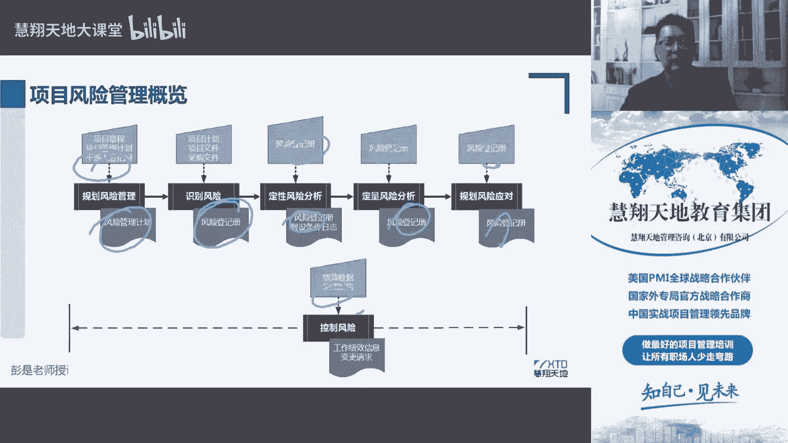
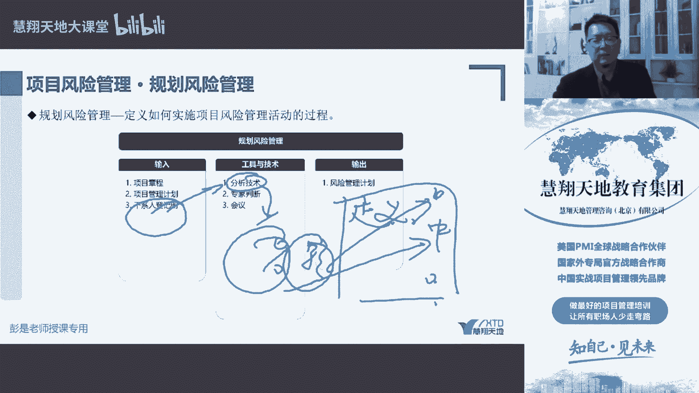
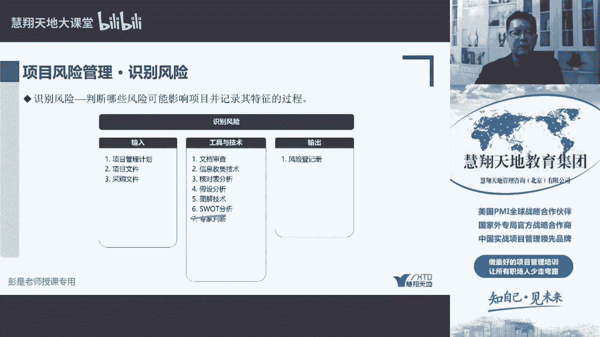

# 规划风险与识别风险的工具技术 - P1 - 慧翔天地软考 - BV1Zp4y157B4

然后最后说一下这一章的工具技术，其实也在反复讲了，咱就把它速报的未成化数规划，风险管理反复在说，我们风险管理计划最关注的是出定义，定义什么是中，什么是高，什么是低风险，这个事要说清楚，这个事要说清楚。

哎我做不了这个主第，找领导，领导说风险高才是高风险对吧，领导说中就是中，领导说低才是低啊，需要领导告诉我们概率以及影响概率是多少，影响有多大才认为是一个高，概率是多少，影响有多大才认为是一个中。

所以需要肝协登记册，另外，我们就要需要分析领导对风险的偏好啊，态度啊，承受力啊，所以分析技术主要侧重于这个分析我们的项目，我们的企业，我们的人得出概率和影响定义，这是没。

其实不大需要去刻意去背这个工具啊，然后识别风险，识别风险大概是这意思啊，文档审查审查的就是输入，通过看拿到的这些文档资料去找风险，那找风险只看资料也不行，我们还可以通过聊天啊，脑包啊。

各种形式就有了信息收集技术，纯纯的字面意思，采集信息，找风险，找专家找团队，大家脑报开线上的会议，各种各样的访谈，焦点小组通过各种各样的方法去采集采集信息，采集的信息是找风险，然后核对表分析，核对表。

核对表，打勾逐项核对，打勾逐项核对，就这么记，拿之前的资料过来看上一个项目的风险登记册，拿过来参考一下，上一个项目风险登记册里面，找到了100多个风险，我们来逐项核对，当前咱这个项目这些风险有还是没有。

就这么一句就完事儿了，然后第四个假设分析，看到假设分析啊，那先搞清楚什么是假设，这个也不大需要去死记硬背了，假设是咱每个人主观上认为他成立，成立的一些事情，成立的事件或者是条件对吧，现在我现在说啊。

我觉得我觉得还有5分钟就可以下课了，这是我现在做了一个假设，他不一定成不一定成立啊对吧，可能讲6分钟，7分钟，8分钟，它存在着不确定，存在着不确定性，就意味着风险。

所以就像那个呀我觉得会5月份考试的时候，北京啊低风险肯定能考试，那大家都积极备考，这也是我们认为的，主观上认为他成立的事情，但是谁也说不准对吧，谁也说不准，万一呢有可能吧，万一出了个什么本土病例。

又变成了中风险，哎到时候那个考试可能就取消掉了，它存在着不确定性，所以这个东西这个东西我们要去分析了，这个假设它成立，它的有效期啊，它的有效性啊，它成立的可能性大不大呀，是不是就意味着风险。

所以接到这么多可以了，然后这个图解技术啊，记和不计不重要不重要，后面去看内容，看完秒懂SWOT，需要重点记SWOT就记四个词叫优势劣势，优势可能会带来机会，劣势可能会导致威胁，这个其实也不难理解。

优势会带来机会，劣势会导致威胁对吧，我项目经验很丰富，考了一个证书啊，很简单，这是优势，经验丰富可能会带来机会，机会就是通过考试提高通过考试的概率，这好事机会，但是还有劣势劣势啊。

我这个叫什么写作能力不行对吧，什么常常年不写字，写字写个100字，200字就抽筋了，手就没力量，然后平常小从小到大就不会写作文对吧，什么总分总啊，各种结构啊，这个事我能说能说明白，写，写不清楚。

写作能力差，哎这就是一个危险，那论文可能就过不去了，所以对项目来说也如此，要评估我们的企业，我们的项目存在着哪些优势，会会不会带来一些机会，哪些劣势会不会导致一些威胁，还是找风险的一个工具。

这个需要重点记，所以这么一说。

这么说，识别风险。