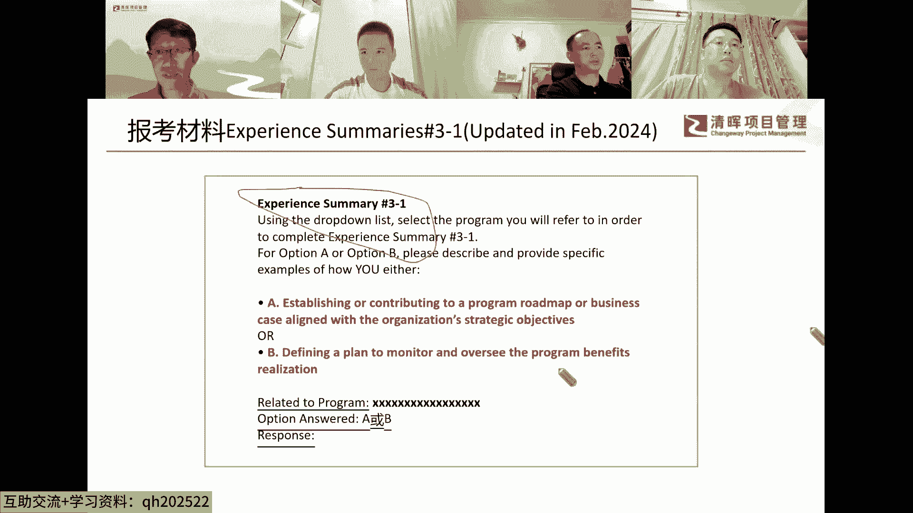
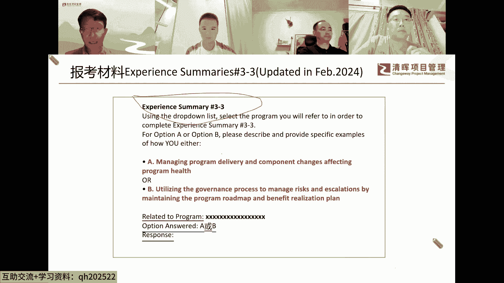
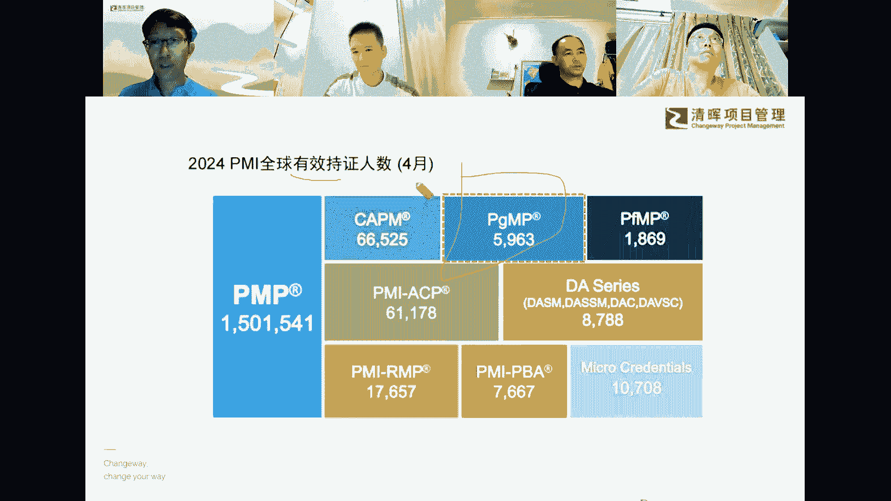
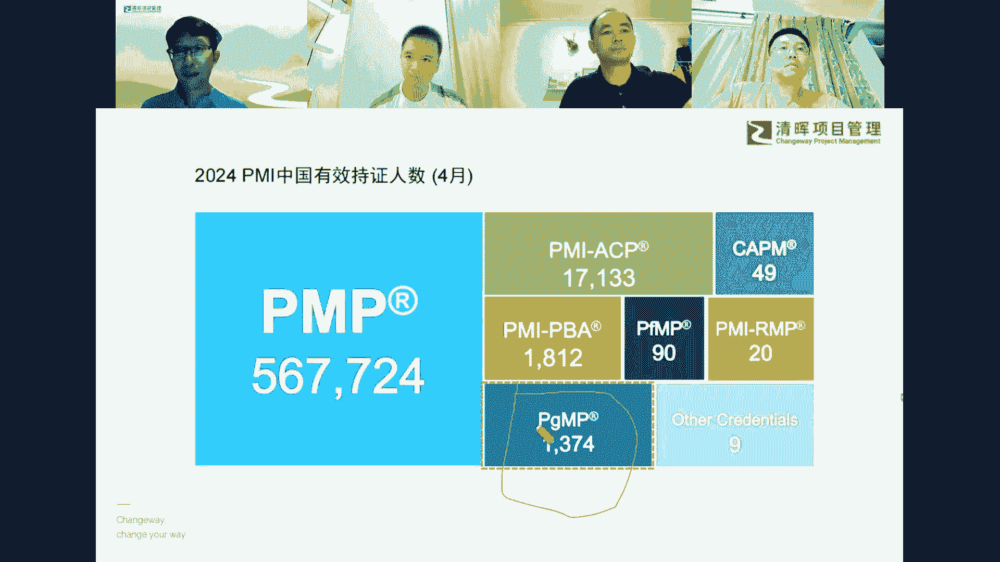
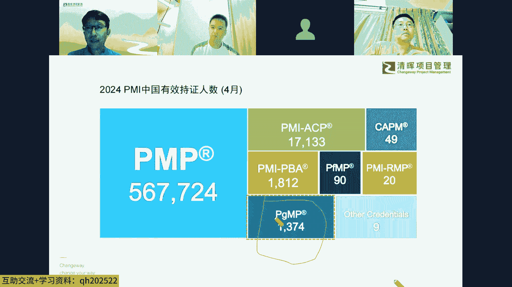
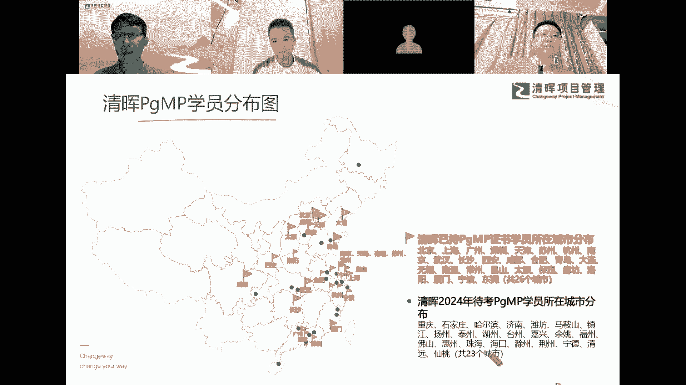

# 解锁职场晋升的密钥--从PMP到PGMP跃迁 - P3：3、PgMP考试最新报考信息传递 - 清晖Amy - BV1aeWGerECa

今天讲这个圆桌会议的主要议题啊，第一部分呢就是PGMP考试的报考信息传递。

首先讲到这个PGMP的这个报考，他的报考材料，在这个今年的2月份进行了版本的更新，本来在那个项目及管理经验总结里面，它是沿用的五个绩效域里面的五个五个材料，那新的版本呢就改成了项目及管理的经验。

总结呢改成了三个部分，这是一个最新的变化，那他这个虽然在前面啊，在去年啊或者前年PM已经随机的抽样过，就几位可能是几位同行，他们考试的时候可能抽到了这个新的，这个报考材料的那个撰写哈，撰写等等。

那都是测试不正式发布，就是在今年的2月份，那去年的时候有一个好消息，就是PGMP考试汉化了对吧，就中英双语了，跟PMP一样，这是一个好消息，那这个呢2月份呢这个新材料的变化。

这个报考材料哈已经引用了多少年，我从12年接触到这个PGMP，那时候就已经是，就已经是这个五个G效率了是吧，那时候就五个绩效率，这很多年了啊，很多年了没变，那这一次呢这个PMI呢。

把这个报考材料给他变了一下，那变了一下呢，这里面体现着PMI的，这个很多的意思在里面哦，很多的意思在里面，那这个那这一部分三个部分里面的第一部分，第一部分哈，他是，这里讲在他的宣讲材料里面哈。

就说他要变这个版本的时候，宣讲材料里面他把这一部分，他把这一部分归在归在这个战略里面哈，战略里面，战略里面下面有两个命题啊，这个好战略里面有两个命题，两个命题，两个命题就是要写两个命题里面的一个命题。

这是个命题作文哈，这是个命题作文，他的意思意意思是什么意思呢，就是这两个命题呢，我们按照我们自己写材料所擅长的这个领域，他就是个这个方向哈，这叫方向了，选取这个命题的方向，你把你的剧本写好是吧。

你就把你的剧本写好，就是你在写的时候呢，可以选A也可以选B对吧，可以选A也可以选B啊，这是这是第一部分哈，三个部分里面的第一部分，我们称它为战略，这个这个部分两个命题，两个命题，命题A呢。

命题A是要求在在了解项目级的那个战略目的，的基础上要制定，要制定这个也可以是路线图，项目及路线图，也可以是项目级的那个商业论证是吧，商业论证，你相当于要进行这样的一个一个分析哈，写出这样的一个分析材料。

这是命题A命题B呢，命题B呢是，他是跟项目级的收益实现挂钩的，要我们呢就定义一个一个项目，相当于项目及收益实现计划啊，用它用它来monitor，就是那个监视和那个相当于是你监控是吧。

你的这个收益的交付和实现的这个这个节奏啊，这个就是这两个命题啊。

第一部分的两个命题，那第二部分呢，第二部分第二部分称为什么它跟人有关系，第二部分PMI把它称为是就是领导力，就leadership，这一部分号同样是两个命题，两个方向可以选，一个方向呢，一个方向呢。

就是你可以聚焦于项目及这个干系人，干系人的识别是吧，在基于他们的这个期望，当然其中部分干星人的期望，因为写这个剧本篇幅有限，只能是500个单词以内哈，一般写到350个单词就差不多了，那这个篇幅有限。

所以选取其中的一些呃一些干系人的期望呢，你展开来以点以点带面，展开来，就这些关键的干系人，在达成验收标准的那个统一哈，INSP准统一，这是命题A那命题B呢，命题B完全是一个新的新的方向哈。

新的方向在这个旧的版本里面，等原来的五个绩效率的时候，这个方向从来就没出现过，从来就没出现过，就跟什么有关系，跟冲突跟跟这个冲突管理哈，跟沟通中的冲冲突管理，就看怎么样建这个一个比较好的。

一个团队的氛围的啊，团队的氛围的，那这个凸显出来这个软技能的这个，这个重要性啊，这是第二部分，那现在到第三部分，第三部分呢PMI版得归正治理治理啊，这本归到归到治理这个这一部分，那自理呢同样有两个命题。

两个方向哈，一个是命题A呢，命题A呢就是讲是怎么怎么管理，项目起的变更的啊，就拥抱变化之后，你把项目集让他始终保持在一个比较良性的，那个这个发展的那个这个这态势哈，这是命题A那命题B呢。

命题B是能够看出来，他是就是在治理的这个范畴，就是你对风险对对识别出来的风险有必要的话，你就要进行升级是吧，对它升级，那确保呢，项目及实现这个按路线图实现既定的收益啊，这就是这三个部分。

每个部分分别有两个命题可以选，可能六个六个命题里面选选选选，选三个命题对吧，就分别选一个，分别选一个哈，这个就是在报考材料的一个方面，那PGMP呢，PGMP呢是是这样子的，PGMP相对来说比较难。

它难是难就难在难在哪里呢，对我们中国的同行来说，它难在这个，这个英文材料的英文报考材料的那个撰写上面，撰写上面啊，那按照我们中国的那个同行写材料的话，我们喜欢我们不是喜欢我们，我们会比较严谨的。

按照我们的工作经验来写啊，就说对虚构的部分，我们对它进行这个进行添加的时候，我们心里面可能会觉得觉得，好像有有这个不真实的这个这个心理在里面哈，心理在里面，其实这里面呢只要澄清一下，我们在写这材料前。

呃或者说我们在在工作中这个做项目的时候，我们是还没有学过PGMP的是吧，那所以我们的我们原来拿过来要作，作为写这个材料的经验的这个素材呢，那肯定是不符合PMI的这个项目及管理，标准的。

就PGMP这个这个标准里面所要求的，项目及经理的这个要求的，这一点是肯定的对吧，我相信大家对这也会达成共识，而且老美老美他为什么要设这个报考材料，里面要要这么严格的要项目及管理经验总结。

他是想看我们有没有项目及管理的，那个比较好的这个实践，他才给我们发这张这个考试资格啊，这是老美的逻辑，所以这跟咱们国内的那个呃同行的逻辑不一样，原来我们去考，我们说这个为什么要考，原来要考PGMP。

因为我要提高对吧，所以我才来才来考，才来报考PGMP，所以这两个逻辑呢，跟我们我们的逻辑跟老美的逻辑，一开始可能还不是很不是很一致，那我们呢我们呢要把我们的那个思路呢，调整过来，要跟老美的思路一致。

老美的思路一致是吧，那意思这是什么意思呢，就是我们在写这个材料的时候，就按照PMI的那个项目及管理标准，所要求的这个框架来写啊，来写构建这个剧本，我们站在自己是导演，自己是呃写剧本的。

比如我们自己是主要演员，来在在在三合一的这个角色的基础上，我们来构建这个剧本，目的是什么呢，目的是让评审官他知道他他做出正确的判断，说哎作为这位这个报考者哈，这位报考者。

他是值得这位评审官给他发放这个报考资格的，呃这位这位这位报考者，他不是大项目经理是吧，他不是大项目的控制经理，他是项目及经理对吧，那这就是相当于是我们我这咱们作为报考者，没有错位。

就是至少所以这里有个技巧是吧，这里有个技巧，到时候那个到三位，三位这个学友嘉宾应该会会分享一下哈，分享一下，那他这个什么后面我们先往后讲哈，我然后讲我这个后面应该应该应该会，我先把这个这个人数先讲一下。

我们再进入这个写材料的这个交流环节，那稍微讲一下，就到今年这个4月份，就咱们PGMP的那个持证人数哈，有效持证人数，但这里面没有算上这个6月份考试的同学，因为别的国家他们都机考的哈。

那他们每个月的这个滚动的人数可能不会很多，就国内因为一年就四次考试，所以所以6月份，4月份跟6月份，中间还是有有有有人数上的一些一些，111点点差异哈，一点点差异，那你看这个现在全球有效持证人数。

他他讲的有效持证人数，这中间有的人是考了，可能考的比较早，可能都78年了，他可能这个续证的周期他他有可能放弃哈，有可能放弃，所以这个有效持证人数比原来实际持证人数，肯定原来就考过证书的人数。

肯定是稍微要小一点的，少一点的哈，那现在呢这人数也比原来好多了哈，原来好多了，现在已经到了快6000人啊，全球我12年，我是2012年接触到的PGMP的时候，那时候全球是我记得是800多人，800多人。

那时候国内我呢因为当时还不知道怎么查，我们把它，我们把它当成是还没有同没有同行考过，考过这个PGMP，其实后来发现后来发现知道能查这个，能查这个这个人数之后呢，发现在在当时，在之前。

已经有一位同行拿到了这个PGP证书哈，那时候相当于国内是一全球是800多好，相当于相当于相当于九1%哈，当时中国中国这个PGMB执政者的这个比例，那现在呢这个全球基本是将近6000人哈。

6000人，那我们来看一下国内国内多少人pg mp，经经过12年啊，将近12年的这个努力，现在人数到了将近，就就是现在是一千四三千一千四是吧，嗯那这个就按按4月份来算，按4月份来算。

那相当于是六1400‰，那还不错啊，啊已经相当不错了，这个这个比例这个比例相当不错了，而且这个比例这个还在往上增长是吧，还在往上增长啊，还在往上增长，因为咱们中国同行的，考证书的能力是是比较强的。

只要拿到这个考试资格对吧，难就难在这个考试资格上面哈，好多同学都是这么跟我说，说陈老师只要给我考试资格，考试证书就不是问题，那我说恰恰这个他这个这个项目的，这个难的地方，就是就前半部分最难哈。

拿拿拿那个考试资格最难哈，好这个是这这这个其实大家可以看出来哈，就我们当年考当年考这个证书的时候，那是前无古人啊，都是摸索的，我12年本来想考，想成为，因为那时候不知道前面已经有一位就同行拿了。

拿了证书，但是还想着考拿拿，那个就是第一个国内第一个执政者，那至少是华为第一个执政者哈，因为12年我刚好从国外调回来。

那结果结果就是报考的时候出了问题，先改两次材料就被锯掉了是吧，后来后来呢后来这个这心态摆不平，这气不过呢，后来我就先不考了，因为因为因被拘了之后得一年之后才能考呀，那我就后来就刚好找机会。

就是先读NBA去了，NBA读完之后呢，15年考的这个PGMP，那时候考试每一次考试就几个几个同行啊，特别少额特别少，每次能一年考四次嘛是吧，一年考四次，所以这个人数都是几个几个几个。

这样慢慢的前面几十个都是这样，就这样这个一年一年过个十来个，前面几年是积累是特别少的，后来慢慢的人数多起来了哈，相当于是尤其是这个去年5月份汉化了以后呢，刚好也就是这个疫情也过来了。

那这个PGMP考试呢就进入了良性循环哈，良性循环啊，他这个这里面哈，这里面大家想想啊，这个将近1400人散落在什么地方。

散落在多少个城市啊，散落在全球不是全球了啊，因为这中间这个一千四百一千四百多里面，那个像清辉也有，有有几位是德国的那个海外的学员，当然是华人华人哈，那他们也是考了这个证书啊，你看大家看那么清辉这些年哈。

这些年经过就学友们的这个共同努力哈，共同努力共同努力，这个在好多城市已经有咱们的这个就学友，顺利拿到了PGMP证书，比如说比如说成都哈，成都就是一开始的这个一位女同学，拿到pg没证书。

那现在有有有至少三位同学了哈，我所知道的只有三位同学了，就慢慢的新星之火可以燎原哈，星星之火可以燎原，南京也是这样的，南京第一位同学，就金会的第一位同学拿到这个证书，非常的非常的不容易啊。

因为各种各样的原因啊，这个就像第一次不得不放弃，因为家里的原因，那后面考过，那那现在呢现在也有也有好多位，好多位，那个同学已经顺利拿到了PGMB证书啊，北京就不用说了哈，北京本来就是这个北上广深。

北上广北上深哈广其实还不是很多，额，本来就是PGMP，这个就学员集中度啊最高的这个三个城市哈，三个城市当然不算不算宁波哈，宁波是后来有市政府有激励政策，这几年起来的人数是是是非常的多啊，非常的多啊。

这里面这个大家看这个越来越多的城市，有咱们项目管理的同行来学习PGMP哈。

