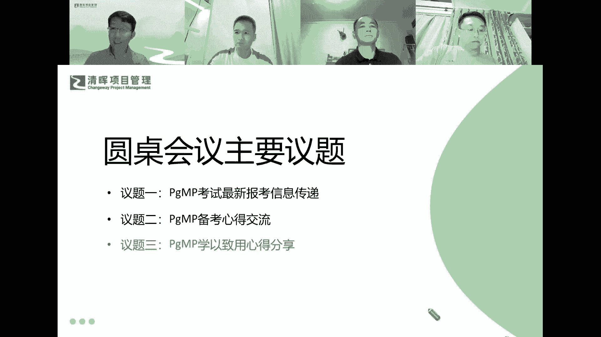
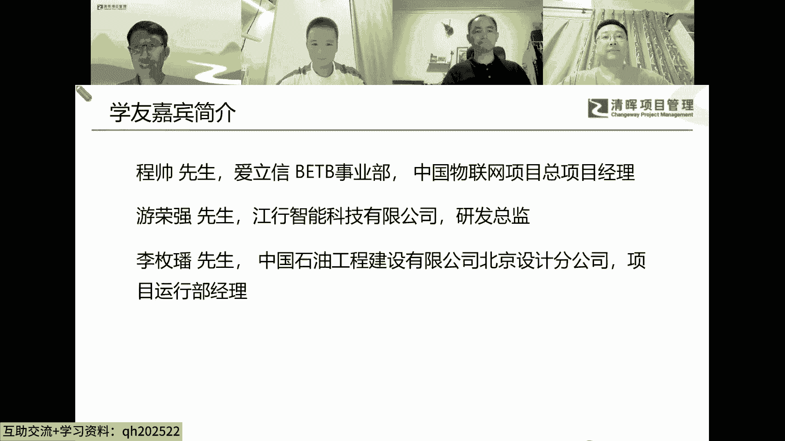
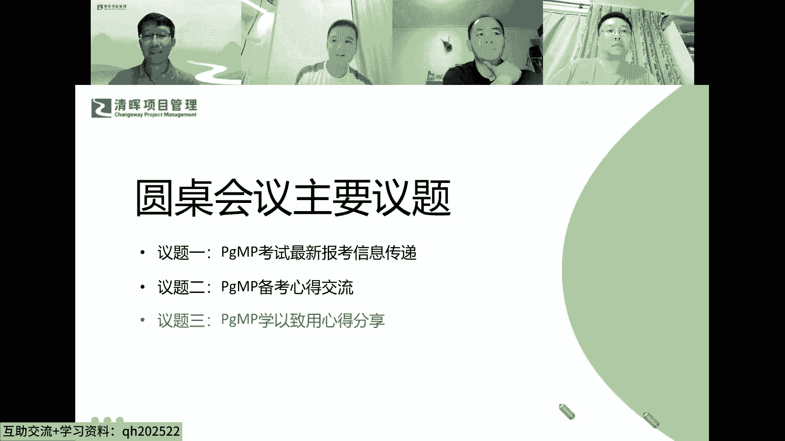

# 解锁职场晋升的密钥--从PMP到PGMP跃迁 - P1：1、PgMP学以致用心得分享(1) - 清晖Amy - BV1aeWGerECa

到最后一个环节哈就学以致用的。

有种呢，刘文祥先生呢是来自南京的，那个江行智能科技有限公司，是做什么产品的，像我们是做那个电力边缘产品叫边缘计算，还有一些电力上的一个终端产品呃，平台终端啊，嵌入式都有，哎这computing的啊。

是源计算的研发总监哈，其实我到我们现在的公司到时间不是很久啊，因为在202022年也就一年多的时间吧，然后呢呃我过来之后嘛，整个办公室里面就我一个人，然后坐那边，然后整个项目团队。

包括呃后续的那个产品的那个定义和规，划和线路图规划，包括系统架构的那个设计，都是我一个人在去做这这些事情的，嗯那其实做这些事情的这个过程中的话呢，嗯我之所以要去学，先学了这个偏僻，我就是想说呃。

我感觉到我在这个过程中我有点力力不从心，因为我原来擅长去做那个研发，擅长去做一些软件架构或者，硬件架构之类的东西，但是在团队管理和一些呃，项目定义和产品定义上，实际上还是差的蛮远的。

然后的话之后才去学那个PMPA，但学了PMPA之后，我觉得这个理念非常的好，然后呢又开始呃更深入的去了解哦，原来还有一个更高层次的就是那个PGMPI，那这个PGMP呢，我了解了这个之后的话。

我觉得嗯这个的话对我的未来的工作呃，应该是有个很大的这个助力，所以的话我当时我才呃报考的这个呃PGMP，那从这整个学习下来的这个结果来看的话呢，至少在呃思维角度方面。

给我提供了一个非常非常好的那个思维模式，就是说我不光要去做好这个项目本身，而是要我更多的去考虑，我到底什么时候要去做这个事情，还有我到底要去做一个什么样的这个项目，那这样的话。

对我去做了一个公司的那个产品规划的时候，其实也是提供了一个很好的一个帮助，我会更多的去综合的去考虑呃，就说我做这个事情，本身技术上来说它没有什么问题，但是我做了个事情，我花了人力物力上去之后。

我能不能在公司的层面，产生一个更高的这个收益，就说我做这个事情到底有没有钱赚，相当于是变得比较现实的，但是这个的话对于公司这个角度来说，也是一个非常好的一个补充吧，因为我们公司的话。

其实成立的时间也不是特别的长，我到这个公司里面成立这个业务线，将来是从零开始，从我开始去定义，在这个已经是类似红海的那个电力市场中，能够找到一点点那个缝隙，然后找到自己的一个生存的一个空间。

就要去通过非常全面的那个思考，才能够去决定我到底要去做个什么事情，才能够让我的业务线活得下来，然后能够产生相应的那个效益，这个对我来说，这个PGMPA是带给我最大的一个好处了，那我问一下。

那你的那个领导最近对你有过什么评价吗，最近没这个了，因为去年的话，去年我在其实我在管理团队的时候，其实管理的也很很糟糕嘛，然后呢，呃几乎是要造造成那个冰变一样的那个状态了，然后后来我再去学那个PMP嘛。

学了PMP之后呢，再去学了个PGMP，那我再去跟领导去沟通的时候呃，那我就会适当的去有些项目哎，我觉得没有太大的必要去做的，那我从一个更高层次的角度去跟领导，去谈论这些事情的时候呢。

