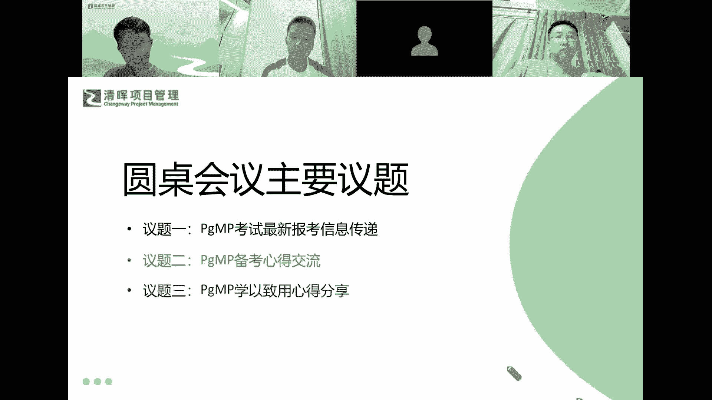
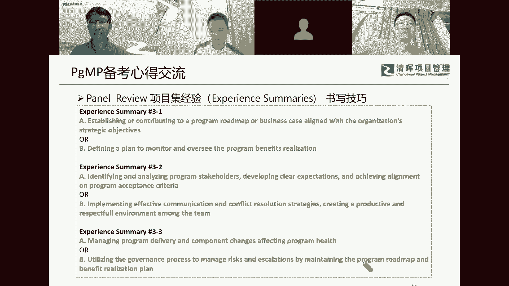
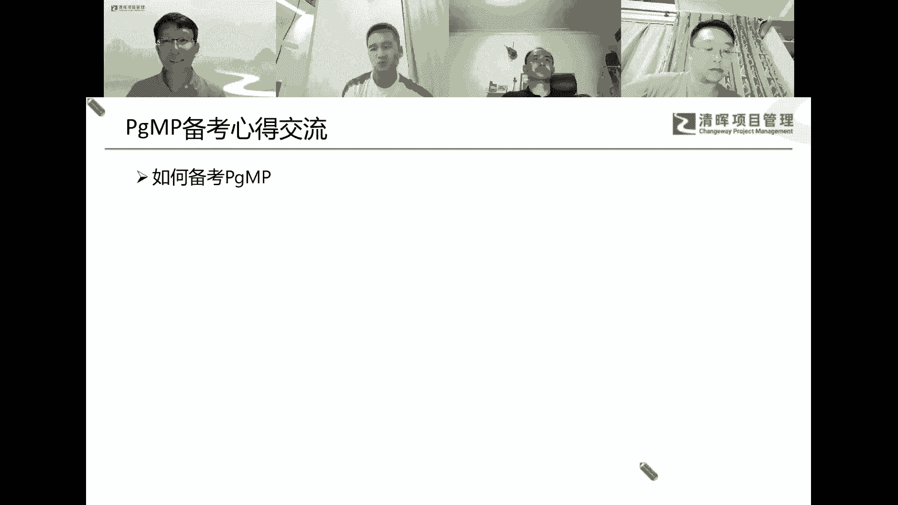

# 解锁职场晋升的密钥--从PMP到PGMP跃迁 - P2：2、PgMP备考心得交流 - 清晖Amy - BV1aeWGerECa

备考心得，我自己写的项目经经验总书写，写材料呢，刘总先来谈谈这个感想，今年我的这个目标比较多，然后我同时要去准备那个5月份的那个软考，所以的话，实际上我在真正的去做这个材料的时候，应该是在3月底。

而且我在这段时间比较忙嘛，然后那段时间在提交那个材料的时候，不知不觉的好，就是落在呃班级的的后面的，在那个陈老师帮我去批改这个材料的时候，那一段时间是真的是特别特别痛苦的，反正有那么几天，每次我一提交。

然后陈老师很很快就修改，然后又被批那一段时间，就是真的就是有个很挫败的那个心理吧，因为就是感觉是自己找不到一个合适的，这个思路来去解决这个问题，我自己也是呃思考了好长一段时间。

就是我我到底要去怎么去准备这些材料，这些材料到底是要去帮我去解决一些，什么样的问题，但后来我发现其实这个东西的话，其实是一个思维角度的问题，之前嗯，比如在摩托罗拉或者在中兴。

都是属于那种开发者的这个角度，到后来逐渐去做一些那个项目管理，但这些项目管理呢，更多的其实还是处在一个开发，一个具体的一个事情上，那么对于这个PGMP来说的话，我觉得对我最重要的一点。

就是改变了一下我的这个思维模式，或者说我思考问题的那个角度，就是让我在一个更高层面上去思考，我到底要去做一个什么样的事情，而不是说我已经有一个具体的项目，我把它做好就可以了，那么通过这个PGMP的话。

其实是要让我去就从整个层面，包括市场，还有呃用户，还有项目的那一些资源的那个情况，还有开发那个难度，从各个方面去综合的去思考，我到底要不要去做这个项目，然后这个项目它的影响。

它所带来的收益到底是一个什么样的情况，一旦发现这种思维模式之后，其实后续的那个准备sumer day的那个过程的话，可能就是一个格式上的一个转变了，但我是提交完那个summary之后的话，通过了之后。

后来我就一直这样，就没有去看这个事情哈，实在也是因为呃时间比较紧张，然后呃4月份到5月份嘛，然后我们那个公司的那个项目的进展，也是非常的嗯，反正经常是处在一个加班的状态吧。

而且我当时我是想把那个软考考过去，完了我就一件一件事情来先做嘛，那整个材料的那个准备过程，其实就是非常的坎坷，然后那个当时我提交那个材料那段时间的话，我也是在呃，刚好我去了一趟那个江西嘛。

参加一个铁人三项赛嘛，然后呢就把电脑背着，然后陈老师一旦发回来，我就立马修改，立马修改，然后就马上就发回去，然后再被训，然后再修改，反正的话我前前后后应该是呃准备的，有十几个版本，准备的那个整个材料。

我大概统计了一下，大概有2万多字的那个材料，就是对我整个项目的那个梳理的过程，是非常非常有用的，而且对于呃自身的那个思维模式的那个转变，非常的有用。

就是在那个PGMP笔试的备考这个环节嘛，当时工作这么忙，你又在考这个软考是吧，备考软考，而且你考试分数又考的那么高，做到这点的话，我可能跟那个陈帅会有点不一样，就是我这个人呢。

就是呃我在之前我是很少去参加什么培训班的，所以我要去学习一些东西的时候，是一定要完全的理解，而且找到适合我自己的方式，我才能够把这个知识点变成我自己的，所以的话在在这个学习的过程中。

其实我看书是比较慢一点，就是我大概也就看了两遍书，但是呢我会花很多的时间去呃思考，就是这每一个场景，在我的工作之中能不能找到相应的那个试用点，而且我我自己的那个时间管理的话，我可能每天都起的比较早嘛。

然后呢我也会出去跑步，那在跑步的过程中呢，我会仔细去思考啊，那书中的提到的每一个点，能不能在我工作里面用起来，它所要传达的是一个什么样的精神，和什么样的一个呃解决问题的一个思路，我实际去准备这个刷题的。

这个时间是比较少的，但是呢我把那个模拟题啊，模拟题不是有180个题吗，还是花了比较长时间，把每一个题，通过一些AI工具来帮我去做那个分析，把每一个选项都会分析的比较透彻，这个也是花了很长时间吧。

所以第一次刷题的时候，我那个成绩是比较差的呃，但是在第二次之后还是提升，那应该是比较快的，因为我把每个题其实每一个选项呃，它的适用场景，它在什么时候可以选，什么时候不可以选。

我都是做的很仔细的去那个分析，当然这个也是那个借助一些AI工具的时间的话，我对自己是比较严苛呃，我之前准备那个PMP的时候，我是经常四点多钟起来，我就开始先听课，听完课的，我先刷题。

刷完题之后我再出去跑步，跑完步回来我再洗个澡再去上班，是这样的作息习惯，因为我晚上的话一般不怎么去熬夜嘛，所以这一次时间准备是比较短的，但是实际上我在花在上面的那个精力。

和实际总的那个有效的那个时间算是比较长的，因为我觉得这个PM，他那个精神理念是非常好的，但我希望把它变成我自己的东西，所以我的目标并不仅仅是通过这个考试，而是说通过这个学习。

然后对我的工作有一个正向的那个反馈，或者说改变我自己的思维模式，这个才是我最重要的目的啊。

