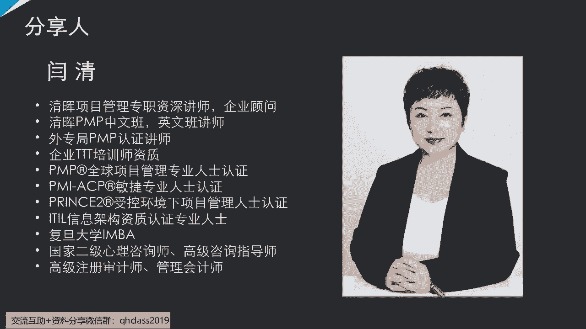
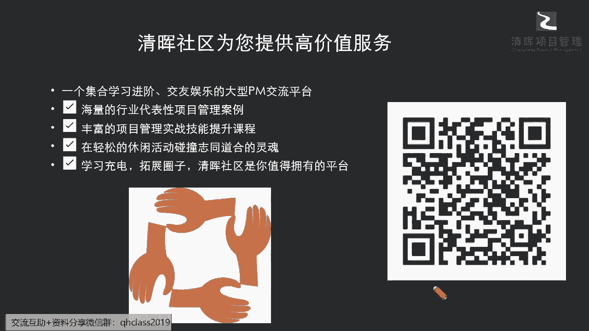
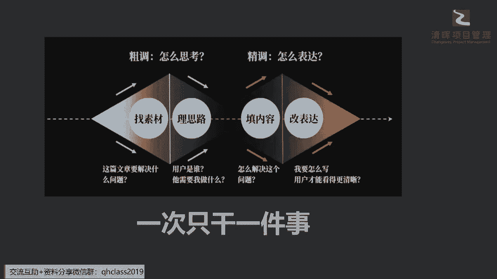

# 让你少奋斗5年的项目经理职业规划指南 - P1：1.职业规划的底层逻辑 - 清晖Amy - BV1rS411N7iZ

我们今天这个比较容易的话题啊，我们讲容易的话题是为了干什么呢，我我开篇也讲了，我想要帮大家去解除一些焦虑，什么焦虑呢，就是我们一直在不停的呃，有一些自我的迭代升级，甚至不停的在学习一些新的这种知识啊。

我们在考一些新的证呃，甚至有一些学历的提升，我们是为了干什么呢，同志们，有多少同学是为了说我对这个学习很感兴趣，而去考了这么多证而去提升自己的学历的吗，有多少同学，你们现在听这个课是完全出于感兴趣的。

有没有在评论区扣一个二吧，让严老师啊扣个三，好了啊，刚才签到扣了二了，扣个三，让我知道你们是感兴趣才来的，有没有是自己有一些问题，或者是平时可能在关注一些这种质押发展，包含自我晋升的时候出现了一些困难。

你更加更加不是为了去什么单纯的感兴趣，你只是为了去解决你的问题而来的，扣个一吧，感兴趣而来的扣个三吧，哦我看有同学扣一了，扣一是不是，刚才说你是感兴趣的是吗啊，感兴趣的来扣个三啊。

你是为了解决你的问题而来的，扣个一啊，同志们好好，我看到还在陆陆续续上线的这个同志们啊，大家是否能听得到啊，啊确保你们跟上闫老师的节奏啊，就是我分享东西我都会有自己的一些节拍。

我也确保咱们每一位参加的同学啊，只要跟上闫老师这个节奏，你一定会有所收获啊，你一定能够拿到一些，你对你自己非常有用的东西啊，好那我们看到这样的一个话题的时候，我们不仅要去想了，说我们学了那么多东西。

我怎么样学以致用是吧，我们最大的讲到知行合一，学以致用，其实说到这么多的一些所谓的这种嗯，把学习的知识转化成为你能力的这样一种说法，最终都是为了服务什么，服务你自己的什么发展嘛对吧，你的职业发展嘛。

那么今天闫老师来给大家打除这个焦虑的，这个这个话题呢，就是在于怎么样给大家有一个比较便利，和能够一下就明白的方法是吧，来去做好自己的一些职涯规划，也就是在一些关键节点，我们不是一味闷着头，大家学什么。

我也学什么，大家觉得什么重要，我也觉得什么重要，我被公司要求了，要去学什么，我就学什么，或者说可能现在最红火的是什么，我就跟着走吧，我们这样讲，大家都读过一本书，叫做什么乌合之众，是不是啊。

没有读过的同学也可以跟上啊，严老师的这个读书会啊，也是一直有每个月的一本书，都会给大家分享一些特别经典的书籍，那么其实在这个乌合之众里面，就给我们带来了一个，非常非常显而易见的一个观点啊，他不讲道理。

它带来一个观点和例证是什么呢，就是如果你没有自己的路径，如果你没有想清楚自己的方向，那么你会把别人的路径，把别人的方向当做自己的而不自知啊，同志们，大家搞清楚了吗，所以也就是说在现在这个节点上。

严老师要跟大家讲讲，你们多少要略懂一点啊，我们讲的略懂一点，就是知道自己有自己的路啊，我们360行行行还出状元呢，怎么可能每个人都有同样成功的路径呢，啊大家学历不同，背景不同，公司不同特长不同。

兴趣不同对吧，我们的很多这种内外内外因也不同对吧，你碰到的一些这种经历也不同，所以我们一定是每个人有自己的，一些想法和一些方向啊，所以今天闫老师就会给大家带来的是，你怎么样去掌握一些方法。

来去把你自己的东西找出来啊，也许你只能现在找出来那么一一点点一部分，甚至不是所有的路径也没有关系啊，只要你掌握了这样一种思维，一种方法，我相信经过时间的磨砺，和你不断的自我的提升跟学习。

你一定可以把你的这个路径补充完整啊，那么我们今天一并给大家把这个包袱卸下来，咱们不焦虑，咱们只去什么解决焦虑啊，那我们同样啊今天也是很多新的朋友，我看到这个有加入的一些新朋友啊，包含啊。

我们以前一一特别就是不管是读书会也好，还是严老师以前的一些呃线下课堂，还是线上的课程和沙龙也好，我们还有很多老朋友，那同样呢啊严老师为什么有很多的这种啊，比如说管理心理学啊，团队沟通啊。

还有一些我们领导力啊，软技能这方面的很多的分享呢，也是因为严老师本身的这个兴趣点啊，也是在这里同步呃，如果有幸参加过这个咱们线下，跟很多同学面对面沟通的这个场合，严老师也都会不吝分享出来。

我的一些这个啊个人的一些小小的一些研究啊，当然我也是在研究这些，所有的这种心理学的一些啊，这我们的一些这种就怎么样把这个理论，把它变成实际当中，大家一做就明白，甚至有些东西不要讲那些术语对吧。

我们多少人能够啊去，可能我今天我想了解这个东西，想去学这个东西，一下子就能达到这样子一个非常高度啊，就是硕士博士研究那个不可能，因为我们大多数都是存在于用的阶段是吧，所以我们要怎么样把这些高大上的理论。

把它变得更加的接地气，能够快速转化成咱们自己手上的东西，那么呃严老师也非常非常荣幸，和各位非常优秀的同学能去一起探讨，一起去分享啊，我们互相之间的一些这种啊模呃，我们的一些这种磨砺也好。

我们的一些火花也好啊，那么啊对这些话题啊，对你个人软技能提升，对你个人的一些沟通力，领导力，质押规划，管理心理，以及你个人的一些leadership的打造啊，职场的一些问题。

感兴趣的同学呢也都可以关注我们社区啊，我们在清晖社区当中有更多的一些系列课程。

包含啊，我们呃在严老师的专栏下面，有很多已经有的这样的一些小的课程，以及我们非常多的清辉优秀的各位呃，我们的专家讲师都会给大家提供一些，非常有针对性的啊，这这三个字非常关键啊，针对性啊，同志们。

如果今天你只是为了去学习一些普世的常识，那个只能算是一个什么入门级别啊，那么真正能够解决你问题的，一定是针对你个人的问题，能够去有针对性地帮你解决一些点对点的问题，就像我们今天讲的。

你要穿啊一盘这一盘的珍珠非常漂亮，你要把它穿成一个非常这个啊，昂贵的或者是珍贵的一个这个项链的话，你需要一颗一颗的去把它串起来，一样你的知识点，你的问题也是要一个一个去解决。

也就是说你没有办法说我今天不经过魁步啊，不是一步一步走，你就能一步跨到某一个层级，这是不可能的啊，所以也就是说，在我们很多有针对性的这种积累的时候，社区我们提供了一系列这种啊短平快。

甚至一些轻松活泼的内容，其实就能给大家带来很多实践性的一些反馈啊，所以今天我们的话题呢，就从这个质押规划开始说起，那么在这里呢。

严老师要跟大家先来讲一个思维的理念啊，因为为什么呢，我们不在于给大家填充那么多的什么知识点，知识点，就像我们一个人我要画一个素描，你说你画一个人的素描，你是先去画它的里面的毛细血管，去画它的肉啊。

还是去画出它的轮廓呢，我相信大家尽管没有学过素描啊，没有没有去知道它里面的一些技法，你也知道素描是要干什么的，是要先去什么，有外轮廓的，有外框架的，也就是说我们今天要去考量到，你作为一个项目经理。

你的职涯规划应该有什么样的一些，基本的逻辑方法呢，今天闫老师给大家带来一种比较新的一种，这种思维逻辑方法啊，就是确保每一次大家有不管是老朋友啊，还是新朋友，参加闫老师的沙龙也好，课程也好。

严老师都会尽可能的给大家，每一次带来一些新的而小而美的哈，这种这种新的观点让大家容易接受，也容易吸收，更容易把它理解下去啊，那么给大家现在放在这里的一个小思路，其实是借鉴了一个严老师在去年在一次啊。

咱们这个清辉的这个训练营当中，提到咱们的商务的一些这种思考，和商务的表达的时候，放了一个这样的一个模型，叫什么呢，四步法啊，四步法就是教你怎么去input，怎么去output，其实在input输入啊。

怎么去输入，怎么去输出，那么输入其实是一个，非常非常考验累积能力的过程，对吗啊，也就是说你的输入，你输入的东西的质量，你输入东西的一个品质以及它的量啊，是一定要达到啊这样的一个程度。

你才有可能会输出一些啊类似的东西，那么输出的时候也会考验你对于输入的东西，这个吸收的品质和你的一个思维逻辑的理解啊，也就是说在我们今天讨论这个话题，我要规划我的直阳。

那么我们把人生啊短短的人生几十年是吧，刚刚这个国家也公布了这个尼拟定是吧，要把我们退休的年龄全部要放到什么，这个65岁去了是吧，所以如果是这样子一种情况的话，那么问题就来了，在你啊。

我们讲退休年龄65岁以后，就变成一个什么平均线了对吧，那么你退休之后，你至少还有个10年20年的退休生活啊，如果我们的身体足够的好的话啊，我相信大家现在的整个物质水平，包含大家锻炼啊。

还有这种营养的意识啊，这个并不是一个天方夜谭，已经是一个事实了啊，所以可能现在在这样的一种情况之下，我们一定可以啊，我们一定可以特别特别去跟大家提到的，一个点啊，就是怎么样去理解这个质押规划。

如果把你的人生想象成一个你的所有的一个，人生的长度，这就是一个有起点，有终点的一个什么life project人生项目啊对吧，那么你的职涯规划其实就是规划，你在65岁以前对吧。

65岁以前你要你要所有做的这些事情，你的一个逻辑是什么对吧，这是你的职业规划，那你的退休规划就是退，就是规划你65岁之后啊，如果后续有朋友我有我们的伙伴感兴趣啊，严老师后面也会跟大家持续去讲这个东西啊。

那么在我们的这个这次的这个这个聚焦点，我们就来讲，我咱们65岁以前要干的事情是吧，所以在这个里面我们到底有什么样一个思路呢，大家可以看到这个四步法先从input来去讲啊，怎么去思考。

再从output怎么去表达，也就是说你从找素材理思路，填内容改表达来输出，最终你一个人生项目管理的计划，那么这里面的精髓是什么呢，同志们可以看到，如果你把这个想成你一个计划的话，你首先找素材。

这时候你就要想你这个人生，你要解决什么样的问题，你的方向是什么，比如说有些我们从一开始我相信很多朋友啊，你现在比如说你在二三十岁这年龄去问他，说你以后想想做什么，你的人生理想是什么，他会非常迷茫。

为什么，因为已经步入社会，已经步入这个职场的时候，你会受大环境的影响，尤其是你在没有清晰的思路的情况之下，你会很容易被这个什么外部的环境所裹挟是吧，但是实际上我们在你试想想看啊。

你在观察你的孩子在小的时候，可能在低幼龄甚至小学阶段是吧，你去问他啊，你的人生理想是什么，他会非常容易告诉你，比如说我想成为一个什么啊，我想成为一个画家，我想成为一个作家，我想成为一个科学家。

我想成为一个发明家，大家以前在听这些话的时候，就觉得是在开玩笑是吧，但是其实这就是最早期的一些什么，你的life project一个定位呀，就是一个锚定啊，金字旁一个描啊，锚定你要把它锚定在哪里。

就决定你人生要往哪个方向走啊，同志们，这并不是一个kidding啊，不是一个笑话，也就是说我们为什么现在这个学了这么多东西，也依然过不好这一生是吧，就是因为你想想看，你一个大的锚定都没有锚定清楚。

你这艘人生的小船是不是会一直颠簸飘摇，而无所什么，无所方向，无所适从啊，因为你的环境变化，你看黑天鹅事件对吗啊，我们的疫情刚刚过去对吧，那我们谁能预计得到，后续还会发生什么样的一些这种啊。

黑天鹅事件呢不清楚对吧，那么可能在这样的一个过程当中，你的职业规划还会遭遇什么样的变数，谁也不清楚，所以大家就可能很容易陷入到一种误区，就是说诶我不用去想这么多，我能有一份工作就不错了啊。

我能赚钱养家就不错了，我我没有那么多的想法啊，其实如果你没有这样的一个锚定的，一个基调的时候，你很难去走出来，你后续的方向，或者说你很难变成你想成为的人，就用我们朋友圈的一句话，就是有些人走着走着。

过着过着，活着活着就变成自己最不喜欢的那种人了，为什么，因为你没有目的啊，你没有方向啊，你没有那个自己的锚定啊对吧，所以可能这是其中的一个，我们的一个首先要解决的问题。

这就是一个大的一个粗的一个input，要解决的问题，再来就是要理思路，如果你大方向向，今天我们很多同学就会去问一个问题，我到底是走技术岗还是走管理岗是吧，这可能是一个大的方向，那么我第二步再去理思路。

那么你的技术岗和管理岗，你最终你可能最愿意去做的，服务的一些群体是什么，那么他们需要我在做什么，以及我能够是否能够发挥我的一些专长是吧，能是否能让自己来make happy是吧。

你要有自己的一些这种什么啊，精神的收获和实际实物的收获，对不对，所以你要去理这个思路，那么再接下来就需要尽量细的去细化，你怎么去填内容，你知道某一些方向，也许是以后可能的路径了。

那么可能在里面你要怎么去啊，细分你的这种行业，细分你的这个岗岗位，以及细分你的研究方向，以及细分你的这种职业的一个啊，细部的一个这个走向，所以在这样的一个呃细条哦，output输出的时候。

同样你也要不断的在对外来去修改，你自己的一个清晰的愿景，那么简而言之，我会给大家一个建议啊，一次只干一件事，同志们啊，不要什么都想做啊，因为你想胡子眉毛一把抓的，这种情况是基本上不可能会成功的啊。

这个大家可以尽可能去读更多的书，让自己能够有一些正向的好的输入，那么呃也建议大家读一些好书啊，我因为我们现在有很多标题党太多了，所以我们我强烈建议啊，严老师特别推荐给大家书，都是一些经得住时间考验的。

一些经典的书籍，你尽可能多去读，你会发现但凡是从古到今，能够把自己人生过得相对成功，而且活明白，又会豁达开朗，自己又有所成就感的人，一辈子只会做一件事情啊，也就是说他会想办法把自己的一个这个专长。

擅长把自己的兴趣发挥出来，所以可能在这个里面大家不要觉得啊，首先纠正大家一个点，很多同学说这个有些这个课后来咨询来问，严老师，说严老师我其实在在有有三家公司，这个这个有有猎头找我的，有这个自己投简历的。

也有一些新的机会，就是不知道怎么选了啊，当然可能最直接，第一步先跟我讲说闫老师，你看这家他是给我多少钱的薪资，这家给我什么薪资，第三家给我什么薪资，我首先问他的，我说这位同学。

如果你真的想想听取严老师的一些建议，你不用告诉我他给你多少薪水，薪水这个东西是个我们这样讲啊，盖棺定论就是一个什么棺材板一样的东西啊，记住这句话，薪水是死的，甚至在很多大型企业500强企业。

你想去在职级间调调级，你你去晋升一个岗位，你可能薪水就只晋升了吗，什么可怜的几趴是吧啊，因为它是有规定的对吧，它层一层一层的，它会有这样的一些这个浮动的范围，所以基本上你升了值。

你的薪水也不见得会涨涨太多是吧，因为它是有规有这样的一层一层吉普森的，所以薪水这个东西你除非是这种重大的跳槽啊，直接点讲，就是这样重大跳槽可能会让你翻几番之外啊，基本上不太会有。

你在一个稳定的企业里面给你大涨的可能性，所以不用告诉我薪水是吧啊，这绝对不是第一个应该优先考虑的东西，那么最应该优先考虑的是什么，最应该优先考虑的是什么，我觉得大家可能会有点觉得说哎呀。

杨老师我的兴趣啊，我其实觉得我对这家公司特别向往啊，但是呢我考量到这家公司又怎么样，又怎么样，晋升又慢，想好多事情对吧，但是我可能会跟大家现实一点啊，虽然杨老师很强调兴趣。

但是第一个你首先要考虑什么实际问题，解决什么问题，就像今天我们在讲这三家里面，我会问你哪一家相对钱多事少，离家近，你一定能够分得出来的，对不对啊，你如果说你有这样的一些这个基本的思路。

其实你在这个过程当中不会纠结，因为就是因为你什么都想要，是不是，所以可能在这个里面的时候，你从实际出发，你即便这家是比这家少了个500块钱，1000块钱是不是，但是他就是出门不用挤地铁了。

你可以直接走10分钟，你就可以走到公司去，对不对啊，甚至可能在职业的发展方向上，这两个并没有太大的差别，平台也相对差不多对吧，那你就知道去怎么怎么去选了对吧，这是第一个切合帮助你解决问题的。

因为我们在这讲，今年20多岁，你的选择的一些条件可能是受限于钱是吧，受限于机会，但是到了30岁，你在选择的时候，你肯定不能只仅仅看钱，你要看什么，看家庭是吧，看孩子是吧，看你的精力分配。

因为我们还要30岁也要享受生活啊，别人你看111开始，这个打开了这个这个疫情的这个风控，大家都开始天南海北到处飞啊，有时间有那么长的假期去玩是吧啊，到了我们这里天天就是这个不仅是9996。

还007了对吧，所以可能我们在有一些这种考量的时候，你一定会知道你少掉的那1000块钱，其实救了你啊，同志们啊，所以可能在这个当中，你一定要第一个是要现实一点解决你的问题啊，这个实际点。

第二点要考虑什么，考考虑薪资吗，也不是考虑薪资，第二点你就立即要去考虑你的什么兴趣了啊，千万不要去比较钱，钱这个东西是死的啊，你不要变成钱的努力，我们就在讲所有的大佬，大家都会发现所有的这些呃。

上了福布斯的大佬都会讲一句话，我们是在追求我们的什么有意义的事情，这个生意是随之而来的，赚钱是随之而来的是吧，大家以为他在什么凡尔赛是吧，他俩以为他在讲，其实不是的，这事情的本质就是这么一回事。

你真的要去找到你愿意去研究，愿意去做的方向，这比你给你现在千金还重要，这个这个怎么去选呢，今天我们就这样讲啦，今天给你一个给你一个很有挑战性的岗位，但是这个行业，但是整个的呃这个这个呃方向。

不是你自己想去这个青砖的方向，比如说我举个嗯可能不是很恰当的例子啊，比如说现在我们之前有很多同学，向往这个互联网行业，新兴行业，对吧，啊，可能还多少有点看不上这个传统的一些实业，制造业是吧。

但你真正在疫情这个当中看到一些问题的时候，你发现谁站得最稳啊，实业站得最稳，看到了没，制造业相对站得最稳，就是大家会觉得很low的啊，low n的一些事情，但是实际上你在这个当中利和弊它是一个什么。

就像我们讲这个中国人大智慧啊，讲的什么阴阳，他是阴阳协调的，所以你在看一些外企，大家知道年前这个刚刚有一家500强的，这个这个企业，然后进行了大裁员是吧啊，海外已经裁掉了至少一上万了吧啊。

然后这个都是一些敏感的岗位是吧啊，还有一些这个这个我们好多的一些这种企业，都大刀阔斧进行一些这种裁员，大家也看到了是吧，那么实际上在我们一些就像今天这样讲了，这种利和弊，它其实是什么。

可能会在某一个时间会有一些不同，和一些相互的一些交错的影响，所以你不要被一时的，一时的一些利弊去蒙蔽了双眼，就像我们刚一开始改革开放的时候，很多人你看发现在高端写字楼里做着白领是吧。

大家拿个咖啡一天就过去了，拿个电脑敲一敲，一天就过去了是吧，我天天还要在这个这个这个工厂里面，或者怎么样的，大家还觉得有一些差距，其实不完全是这样，如果你仅仅从表象上来去进行选择的话。

你其实又会忽略掉一些本质，也就是说今天不管是在高楼大厦，还是在一个呃环境条件相对一般的，这样的一个办公办公的地方，你这些是你看中的吗，我今天就是讲这样，我们要看穿我们最早就讲的开玩笑的一句话。

我们要看穿资本家的套路，是不是今天为什么要给你办公室放的什么，又是花花草草，又给你放咖啡机，要干什么，让你可以什么更长时间在这里加班啊，不会感到这里不是你的家是吧，这就是你的家啊，住在这里都可以的。

是不是，所以可能在这个里面讲的时候，他其实潜在的一个意意思是什么，要要让你什么要要付出更多是吧，所以那你自己要知道这是不是你想要的，你要想清楚，你不是说诶我看到人家那个我就很羡慕对吧。

所以我我们也在这个点上来去想清楚这四步，从input到output，那我们一次只去琢磨干一件事情，那么给大家举一个简单的例子啊，曾经有一个非常有争议的人物啊，选了一个女性的一个leader。

叫大家都非常熟悉啊，也是我们的主持人啊。

杨澜他提到过一句话，说这个一次幸运并不可能带给一个人，一辈子好运，人生还需要你自己来规划，说的很很糙，但是我觉得这个非常的朴实易懂啊，也就是说今天我们如果很羡慕某一些，比如说这个不管是呃腾讯啊。

b a at的公司啊，还有一些非常新兴的一些行业的大佬啊，大家都非常非常觉得好厉害，特别牛啊，雷军是吧啊，很牛啊，大家再去羡慕的时候，从另外一个角度，你有没有人家那样的规划和想法呢，我们自己来反思一下。

我们当然不是完全以这些标杆作为，我们成功的唯一标准，但是如果今天你还对这样的人物有一些，这种眼红的话，那你就要反思一下我们自己啊，你自己到底有没有这样的一些想法和规划，我们讲了想法，每个人可能都有啊。

就是我也想成为首富，我也想这个有有豪车是吧，我也想有大house，我也想有一个钱多事少，离家近的事情，但是今天我们再来讲你自己的人生目标里面，规划了这些东西，没有。

这个规划是指你到底是怎样一步一步去实现的，而不是只是喊个slogan啊，非常有趣的一个现象啊，大家但凡可以去到任何一个城市，或者是去到任何一个公司，你就刻意的去观察一下，观察什么呢，你到城市里。

你去看他挂在各各个地方那些条幅，到公司了，你就看他贴在墙上的那些东西，为什么我们通常来讲缺什么他才喊什么啊，比如说我们要创建文明城市啊，我们要创建这个这个卫生城市，你到那个城市一看。

哎呦这个街道好像是看的，如果有人通过的地方还还挺干净的，你到背街一看都是脏乱差是吧，那么我们到公司里面，尤其是早期的一些这种，可能一些还没有成规模的企业，你看一进去满墙贴的都是奋力拼搏啊，是吧啊。

我们还有这个各种各样的一些东西是吧，但是其实非常有趣的是，这些恰恰就是什么，他要进行一些什么规划洗脑的东西，就是让员工要不自然的去接受，让市民不自然的去接受，所以如就说我们还是那句话。

如果你自己仅仅有一些想法，你并没有落地成一些非常具体的行动方案的话，你就很容易被这些slogan带着走了是吧，所以这个可以看到这位女士啊，这个杨澜她自己的人生规划是非常非常清晰的，也可以说。

就她自己还真的是有这样的一些节点上的。

重要的一个什么目标值，所以可以大概看到啊，就仅仅是举个很简单的例子，你可以看到他从一些主持人呐，然后去又去美国留学啊，要在这个当中又进行了一些转型啊，自己又去经营这样的一些media啊，媒体啊。

还有一些这种整个的一路的路径，可以说都是他自己一步一步去规划，提前就预见，并且去践行出来的，也就是说不是被人家推着走，不是被环境裹挟着走的啊，所以可能在这里就会带给我们一定的反思啊，同志们。

今天我们在线的这个诸多朋友，大家在职场当中已经摸爬滚打了多少年了啊，我相信35年的可能也有啊，年轻的朋友也有五到10年的，也有10年以上的这个资深的职场人也有啊，那么大家在这10年里面有规划吗。

在这5年里面有规划吗，在这一年里面有没有规划呢，如果你的答案是NO的话，那么接下来了严老师讲的东西，你可要仔细听了啊，也就是说凡事预则立，不预则废，非常简单的一个道理，不需要反复去重申。

智慧就是智慧都一开始就告诉给我们了，只是我们能不能知行合一，能去做到什么意思，就这个也是在学习PMP的时候，从第一课我们就开始，为什么大家还记清楚记得那个什么实物矩阵，哪一个矩阵。

哪一个行列的那个字最多啊，规划是不是啊，为啥就是这句话只是老外他讲不了这么这么精，要是吧，直接可能我们就是九个字，就能把这个事情完全讲明白了是吧，也就是说你所有的成功不仅仅是项目的成功，你的人生的成功。

你就是要去规划的，同志们，一个小小的项目都要去规划你的人生啊，你不要去规划嘛，你以为你可以自然而然吗，我们讲所有的顺顺气，自然也需要水到渠成的，什么意思啊，你得也有个渠啊是吧，你得也有个引导啊。

你不是在胡乱的这样子可能随波逐流，因为现在太多不可控的，什么叫做事业环境因素是吧，我们之前背背考试的这个概念的时候都清楚了，凡是什么来自于外界的不可控的，可能带来消极影响的，都是事业环境因素。

那么我们都知道还可能会带来消极影响，还不可控，你怎么可能随着环境走啊，同志们，如果今天这是为什么，我们好多的岗位已经被时代淘汰，很多人还不自知，这就是被环境推着走啊对吧，你没有这样的一个提前的一个预见。

没有提前的一些这种思考和部署，你就有可能有一些岗位就是直接被取代掉的，比如说最近非常非常火爆的一个AI的，OpenAI的这个什么大家用的那个app，我们可以知道它现在的功能已经很强大。

至少能够把一些什么样的岗位取代掉，比如说翻译啊，比如说文远啊，甚至现在都可以进行一些财务的这种，相对中等复杂度的一些分析了，快速出一些财务报表，那么我们以后的accounting。

我们的财务甚至可能在高层级的finance斯，这些都会受到很大的挑战，所以同志们，那如果我们看到这些趋势了，我们能坐视不管吗，所以在这里我们一样要去反思。

那我们到底现在要做怎么样的一个career planning，怎么做一个职业规划，才是能够看到问题，并且能够去解决我们这些焦虑的。

