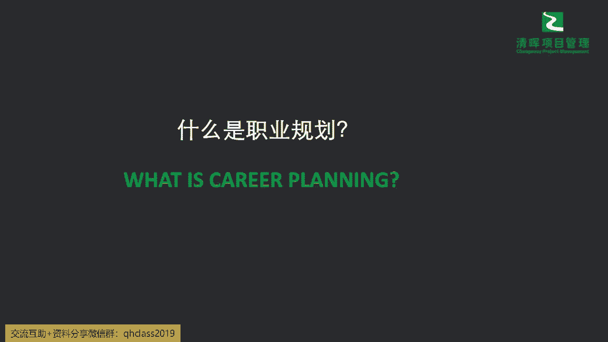
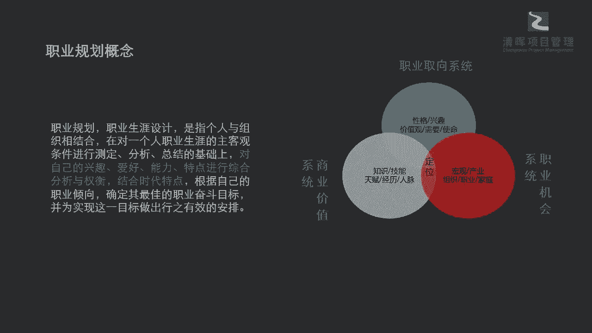

# 让你少奋斗5年的项目经理职业规划指南 - P2：2.什么是真正的职业规划 - 清晖Amy - BV1rS411N7iZ

那我们到底现在要做怎么样的一个career planning，怎么做一个职业规划，才是能够看到问题，并且能够去解决我们这些焦虑的，很多人不是看不到，不是看不到这些问题，而是你在躲避，你在回避。

你不知道怎么办，所以你可能就是说我走一步，看一步到不行再说吧，啊那就是到时候就再说了是吧，所以这是为什么我们是发展同样的几年，每个人的这个能走到的高度是有所区别的，原因之一啊。

所以今天来跟大家讲讲这个career planning，首先提到这个职业规划，那我们刚才也提到了，他就指你的一个什么职业生涯的一个设计啊，啊因为我们更刚才更加具体，我们就按照咱们国家的这个政策。

我们就来计划65岁以前的，这个整个的生活啊，刨掉你的一些这个上学之前，就是我们讲的七岁以前啊，那我们就再刨去几年，你其实现在小孩子，可能从从幼儿园小班就开始学习了是吧，也算是一种规划啊。

所以可能在这个当中我们要设计你一个人，你在职业生涯的一些这种，这种各种的这种呃测定啊，分析啊，这种环境影响之下，你怎么样根据自己的兴趣爱好能力特点，进行一些综合的分析啊，还有一些这种权衡来去啊。

结合时代的特点，根据你自己的一些倾向是吧，来去确定最佳的一个职业的奋斗目标，大家可以看到啊，有几个关键的一个概念是非常非常重要的，哪个观点就是你一定不管怎么说，职业规划这个事儿。

就必须建立在你自己的兴趣爱好，能力特点这个基础上，并且要结合时代特点啊，同志们，这就是你要看得清楚趋势啊，就是我们讲的大趋势都风向都往这方面走了，你还啊逆风向而为，这肯定是有问题的对吧。

所以我们在在这样的一个限定的之下，我们可以看到啊，我们有用三个小的这个这个圆圈啊，来代表我们需要去锚定的一些点，比如说你的职业取向系统，就是你自己个人的一个这样的一个兴趣爱好，价值观是吧。

就像有些这个啊人员啊，这个呃一开始我见到很多优秀的学员，他会说我自己天生我觉得有一些使命感，我就必须得去做好一件事情，那这件事情我要坚持到底等等啊，其实会有这样的一些啊。

你自己个人的一些这种天生的东西啊，可能也是你本身自驱特别强的部分，那同样还有一些是你非常感兴趣的，比如说有些咱们的一些这种这种技术人员，你在做着做着这种技术事务的时候，你会觉得啊。

第一个你受制于这种呃技术的一个发展的，迭代的快速，你发现你可能十几年前学的这种东西啊，大学毕业你至少肯定啊都是学的，以前你本来教材编订的就是什么，以前的这个已成文的，已成体系的一些已有的旧知识是吧。

它不是最新的前沿的一些发展知识，等你大学毕业之后，整个技术方向又变了，你会发现你可能读了个本科，甚至读了一个研究生，你都跟不上这个节奏啊，同志们是吧，所以可能很多同学就很焦虑。

说哎我这个光在技术方面我没有优势，那我怎么办，我是不是可以转管理，但有部分同学他就发现他其实对管理很感兴趣，他对研究这个团队合作什么他很感兴趣，但有一些同学他就觉得我就是其实不善言词。

我也不太愿意跟人打交道，所以这方面不是我的一个专长，我还是更愿意去研究一些东西，所以你来看这两类同学，他发展的一个职业方向能一样吗，肯定不一样是吧，所以可能在这个里面，大家一定要结合你的兴趣爱好。

职业取向系统来去制定你的一个基准点，因为同样的一件事情，你自己愿意和不愿意，就像我们讲的有钱难买，我乐意是吧，就是你愿意去做一件事情，和你被逼着啊，被五斗米折腰去做一件事情，结果是完全不同的。

所以同志们，大家不要再去，我们现在都什么时代了是吧啊，我们讲的我们不是不是那种一定必须，然后才能养活自己的是吧，我们有权利有能力去追求自己喜爱的事业啊，这句其实我们讲passion，我们在在英文里面讲。

passion就是一种职业的激情，这种passion它是能够制造power的，这个power就叫做自屈赋能，也就是说你感兴趣，你能够源源不断的能够创造这种自驱的赋能，能让你自己感受到成就感。

感受到愉悦感，那愉悦感重不重要，很多人忽略到这一点，说上个班嘛有什么开心不开心的赚钱而已是吧，如果你是这样子来想的，那么你可能就仅仅只能做到这样子了是吧，那我们在讲今天我可以去对做我喜欢的事情。

同样拿到成就感，我每天上班我又非常的愉悦开心，让我的精神，让我的身体都非常健康，这是一个非常良性的循环对吧，也就是说你不是处在被他区的，就像我们讲的非常通俗的一句话是什么，鸡蛋从外面打，外面不停的敲。

你这叫什么，这叫什么，把你敲死了是吧，鸡蛋就碎了就死了嘛对吧，那么鸡蛋从里面去破开了，破壳而出，那叫什么，孵化又有个新的生命是吧，所以四驱就是有这种强大能量的，你是可以孵化出一个新的生命的。

也就是说可能在这个这个点上，大家不要忽略掉，很多同学就是纠结，他会问我的时候就说啊，严老师，那个我现在这个工作岗位其实待遇很很不错，然后老板对我也还行，但是我就是觉得每天没有成就感。

我到办公室就感觉一脚踏进办公室的时候，就感觉这心情很沉重，然后除了这个说为了赚钱养家稳定一点点，我其他真的没有什么这种这种动力了，如果是这样的，那我劝你早早的可能去找一些具有，让你有动力的事情去做。

不要等到你快接近65岁才想这件事情是吧，那我们在讲这个部分的时候，我们希望大家啊一定要重视，就是人嘛，你说是跟谁的时间最长，我们就要跟亲人，跟家庭成员大家都可能会有一些什么啊，分离呀，会有一些这种状况。

你跟你自己的时间最长是吧，你对你自己要负责，如果今天你让所有人都开辟，你赚了一份工资是吧，但就你自己不happy，这其实是一个很大的问题是吧啊，所以可能在这个里面，我们也要对自己负责。

respect你自己，你各方面的一个定位要求，因为每个人就还是那句话啊，其实李白说的非常对，天生我材必有用啊，也就是说，我们每个人都是有自己的特长和专长点的，发光点的，不要去小瞧任何一个人。

同志们不要去小瞧任何一个人，所以可能在这个当中，你一定有你非常非常亮点的地方，也许你坚持了你自己的亮点，你就会走出一条完全不同的路径，这个路径就会让你更加的成功是吧，所以在这里。

你的商业价值系统和职业机会系统，就围绕着你的兴兴兴趣啊，你的一些需要来去不断的累积知识和技能，来去不断地发挥你的天赋啊，积攒你的精力，开拓你的人脉，来去组织好你的家庭，今天我们讲。

如果你今天上班开开心心，下班开开心心，到了家开开心心，你觉得这带给你周围的一些这种家庭的影响，也会是非常非常大的，一个这个啊正向的一个赋能啊，就像我们讲的吸引力法则一样是吧，我们所有都是俗。

就像我们这个磁吸一样，你只要越来越正能量，你会吸收来越来越多的正能量的东西是吧，所以这就是一个非常基础的一个一个点，大家道理都懂啊，那道理懂就得做是吧，所以我们一定要锚定这三个小点。

来去做自己的一个职业规划的起点，那么我们怎么样能想清楚。

