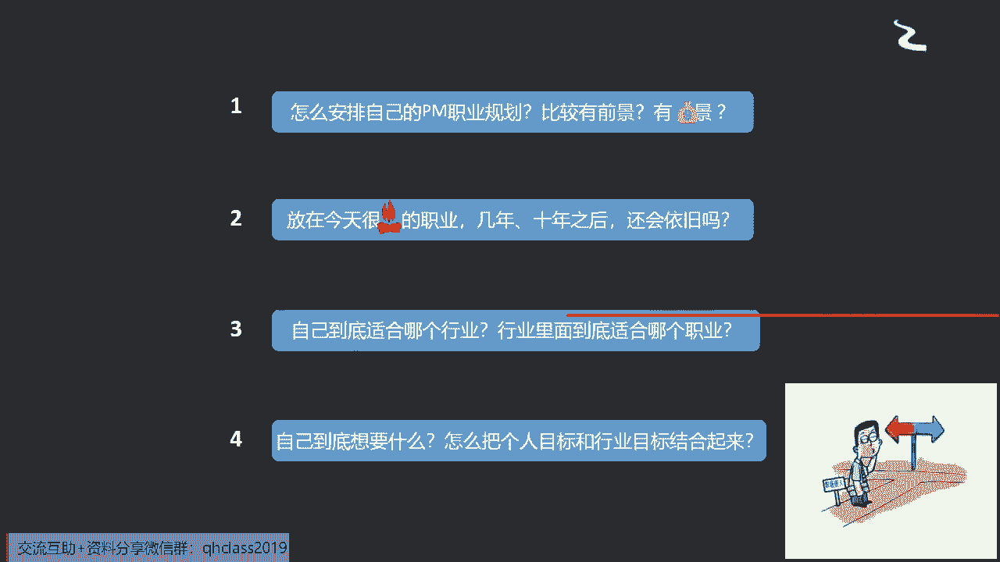
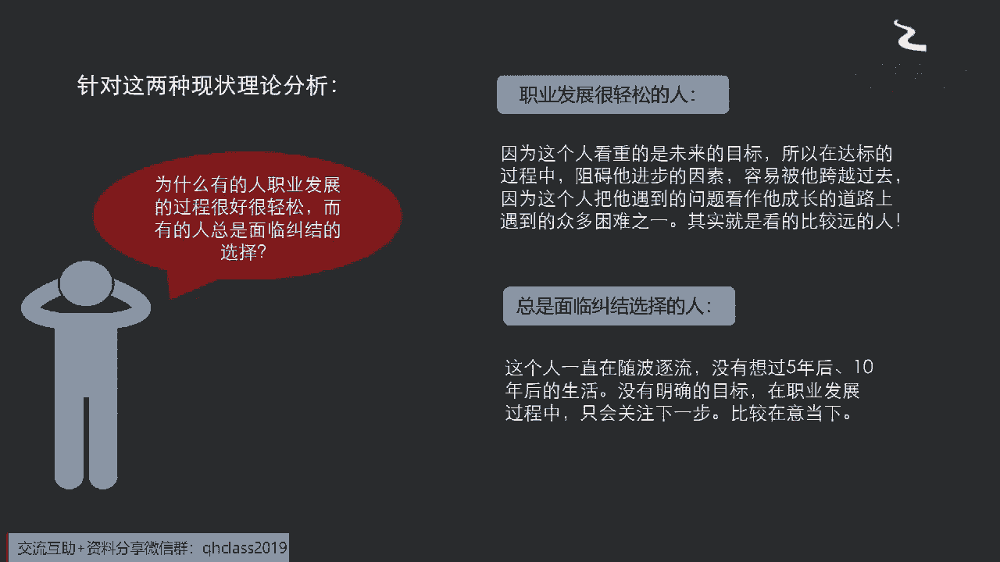
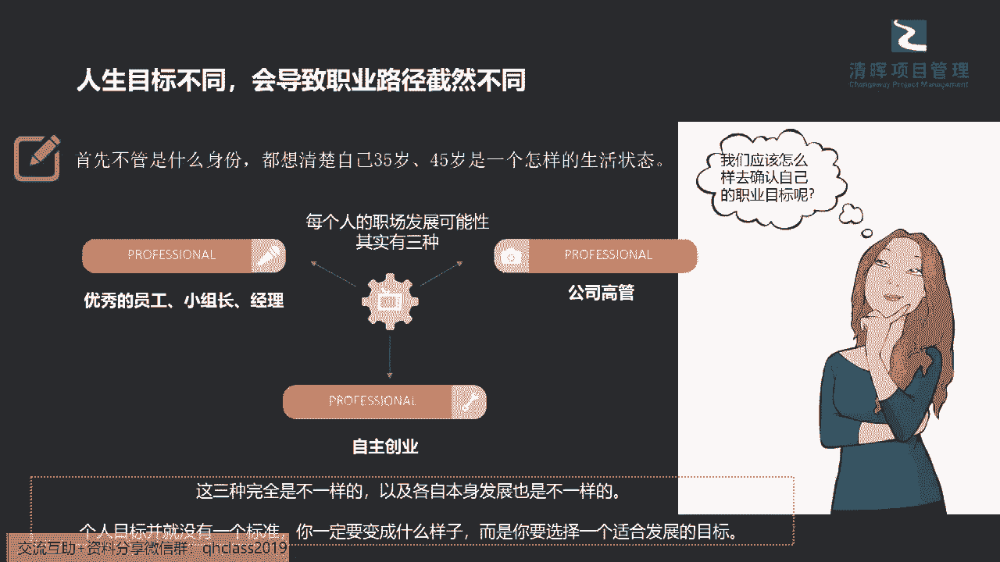
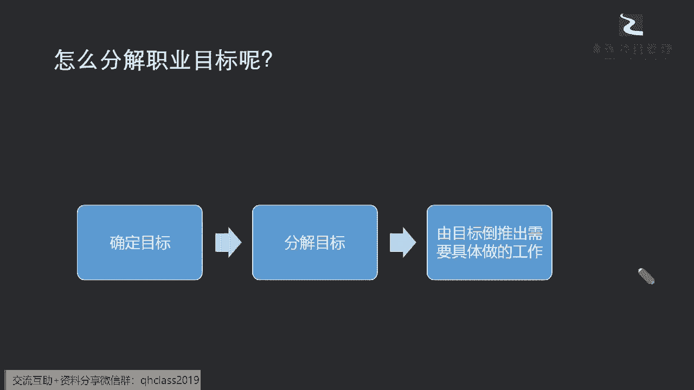
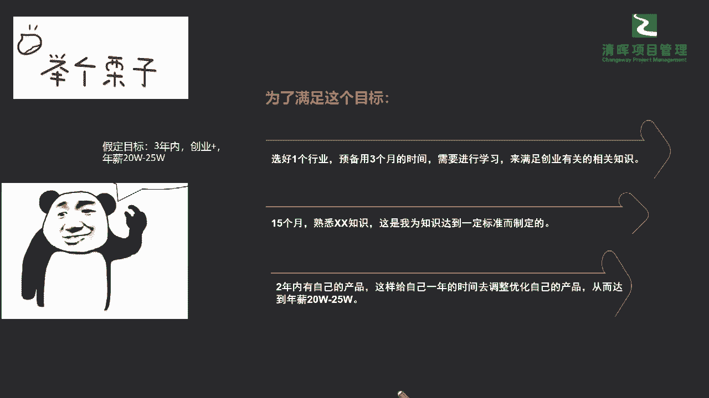
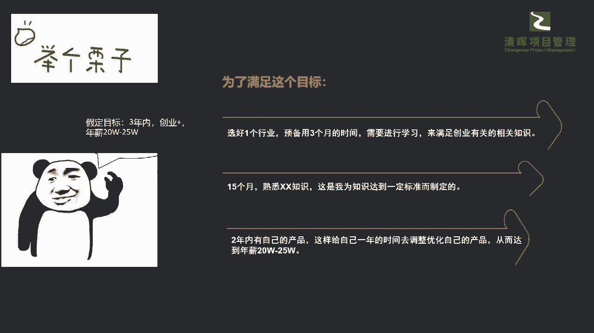

# 让你少奋斗5年的项目经理职业规划指南 - P3：3.职业规划目标分解 - 清晖Amy - BV1rS411N7iZ

那么我们怎么样能想清楚自己的一些职业，发展当中的一些问题呢。

比如说啊，很多很多的我们的一些这个伙伴就会纠结，你怎么安排自己的职业规划，比较有前景是吧，哪条路又有发展又有钱是吧，我们讲make money嘛，我们今天这个国内还是比较整个的氛围，还是比较这个讲的呃。

朝前看是吧啊哈我们还是比较实际的是吧，很多也是当然也是为了赚钱养家对吧，那我们在这个过程当中，我们怎么样又能满足自己的兴趣爱好，又能满满足赚钱养家呢，那也就是说现在社会的方向，很很火的一些职业方向。

那如果我以拉长的长度，以65岁啊，我要退休为例来去看的话，这个职业方向还是一个有竞争力的职业方向吗，那是不是值得我要投入10年，20年的方向来去做这样的一个事情呢，对吧，那么自己到底适合什么行业。

比如说有同学啊，明明是从一些生产实业出来，非要去互联网行业，你会发现那种不光光是工作时长的问题，互联网行业的人员整个都是以一种什么快，短平快，而且要年轻年轻化，这个有时候就是跟你的这个什么有没有工作的。

这种实际能力也并没有直线的关系，你到了一定年龄，比如说你超过啊35岁，某某公司大家都清楚啊，我就不点名了啊，超过35岁，你可能就会被什么从一些关键岗位被边缘化啊，这个实际上是非常现实的啊。

大家也不要不承认啊，你你你看到的周围的包含呃，发生在我们自己自身上的一些这种状况，你会发现你挤破头啊，想要去进入一些这种现在看起来很火，很很很有前景的行业，但是你会发现你的优势也并不能维持很久。

甚至有可能你会面临更大的一个危险，因为你在转型转跑道的时候，它并不能给你加分，反而会给你带来更多负面的影响，有没有一定有啊，所以在这个当中我们需要去知道，你要考虑这些问题。

而且最为难的一个问题点在哪里呢，就是我们列的第四个问题啊，你自己到底想要啥对吧，很多其实都同学根本就想不想不明白你想要啥，就是我们就讲的，就是我们其实更多的人都是半开玩笑说，我既想要这样。

又想要那样是吧，既要又要，但实际上钱多事少，离家近的这种工作有没有呢啊，有但是极为极为的什么少，而且是特别特殊的，如果放在正常的市场环境竞争之下的，基本上是没有的，为啥，因为你的老板。

他一定不会围绕着你的意愿来走的，它是围绕什么，围绕市场，比如说今天我们有一件事情，我跟我跟大家有一个这个这个最快速的分享啊，我在跟我的原来的外国的同事们在聊的时候啊，他们非常非常不能理解的一件事情。

就是我们中国的年轻人会去为了，比如说找到了一份工作，他就宁可为了这份工作，他就能从北京啊移居到上海，甚至移居到深圳广州，在他们来看，这简直是一件非常惊悚的事情啊，为什么。

因为你所有的family member，你的friends，你的朋友都在那个原来的这个地方，我们讲我们就在小城市，我们不讲一线城市啊，我们都在这个小乡村是吧，然后结果呢为了一份工作，我们就可以。

把这些所有的一些资源都抛弃掉了啊，我们认识的朋友，这些亲戚朋友全都是我们的资源啊，就可以抛弃掉去，完全为了这份工作而重新从零开始，你就在一个新城市，像一个贝贝一样重新开始了是吧。

那这样的事情其实在国外很很少会发生，因为他们首当其冲考虑到这份工作的时候，他们放在第一位考量就是family啊，当然年轻人可能适度会考量工作机会，因为他们没有这种庞大的家庭是吧。

但是他们也不会离家特别远啊，所以这是他们特别觉得，中国为什么可以做到这一点，其实我跟他们讲，这个从我个人的经验啊，或者从我看到的很多的朋友的经验上来讲，其实只有一个字，大家只考虑那个money是吧啊。

或者是那个PLPLATFORM那个平台，他并没有考虑到其他的部分，那么我们有了这些问题。

我们知道了这种现状，我们再来看看啊，为什么有的人职业发展的过程，就是你看别人都是哎呀，为什么他又顺利，然后每一次这个工作都特别好，那你为什么可能我就没他那么顺呢，啊为什么我就不能遇到这么好的平台啊。

啊这个其实在这个过程当中啊，我可以给大家稍微做一点点的小总结啊，职业相对发展你看起来比较轻松啊，同志们，我这里要加几个字，叫你看起来比较轻松的人啊，那其实我们就讲一句话，台上一分钟，台下10年功。

什么意思，我见过一个朋友啊，应该是我们原来的一个同事啊，在20多年前啊，一个同事，他从这样的一个小小的工厂里面，能去直接晋级到500强的公司，这在当时我们很多的同一批次的那种啊。

这个同学和朋友里面是非常优秀的一个代表，那他的这种轻松跨槽啊，就是这种跨界从一下子没什么经验，又能跳到500强里去的这种经验，其实在别人来看，好像是幸运之神光顾了她是吧。

好像觉得哎呦这个是不是这个长得比较漂亮，或是有这样的一些这个表达的天赋，可以让人家一下子就就给他很多，这样的好的机会，是不是啊，其实大可不必是这样子的是吧，所以在这个里面我们能够看到啊。

我们有一些发展轻松的人，这个女孩子，她其实一早她开始进入到工厂的时候，就已经能够有这样的一个规划，他的目标就是当时的那个500强的公司，当他告诉我这件事情的时候，其实已经就是他告诉我说。

我从一开始我就是啊有这样的想法和规划，我也不断的在学习，所以我在不断的去尝试投简历，尝试找这样的资源，在帮我进，进入到这样的一个这个流程和跑道的时候，我其实已经做了很多事情了。

但我从他身上就看到这个东西，其实你看重的是一个短期目标，还是长期目标对吧，也就是说你个人是不是看的比较远的一个人啊，然后你面临怎样的一些问题和方法对吧，所以可能在这个当中呃，我们要去给自己一个这个啊。

这个整个的一个这个方向性的一个，这种抉择是吧，那么同样还有啊，如果总是面临纠结的人啊，我们我严老师就直接给他四个字叫随波逐流，就是你没想法啊，没想法，这个没想法，不是说你真的一点点这种idea都没有。

想好的心都是有的啊，我们讲爱美之心人皆有之，爱才之心也人皆有之是吧，没有人不想着去赚钱，没有人不想过好生活是吧，但是我们讲的这个没想法指的是什么，不是光想一想，是你你有这个想去好的这个心。

但是你没有想好的行动，也就是说你一直是在随波逐流，并没有去具体做一些事情，来让自己怎么样能够达成这样的一个目标，没有去做过这样的一些切实的行动是吧，所以就出现这两大类。

那么今天我们各位朋友啊，你们如果对自己的职业发展存在，有一些这样的问题的话，那么你应该站在哪一个队列里面，是一个不言而喻是吧啊，但是站到这个队列里面，你要怎么做呢，你比如说啊举个例子。

你如果没有职业目标，我们现在很多同学刚一开始说唉，AA公司你的基础薪资只有3000啊，能学很多东西，上升空间很大，第一公司啊，你这个底薪给你开了8000，而且非常稳定，但是可能学习和晋升的空间也有限。

你可能做了5年，做了做了这个这个8年，你还是这么一个岗位是吧，那么如果是A和B你选哪一个，你去入职哪一个公司，我相信90%的同学，甚至95%以上的同学都会选B吧，会吗，我们的同学们来做个选择题啊。

同志们，你如果面临到A和B这两个工作机会，你会选哪一个来扣在评论区啊，让闫老师知道你们在认真听啊，啊如果是A公司薪资底薪给你3000，能学很多东西，上升空间大，但是不确保什么时间点。

当然这个取决于你自己个人啊，你什么时间点能晋升到什么样的岗位是吧，那B是薪资是8000，工作相对稳定，但是学习知识和晋升空间有限，哇啊这个我们的同学都非常优秀啊，我看到基本上全部都是选A啊。

还有前提条件，如果是刚毕业选A是吧，为什么啊，刚毕业没有什么负担是吧，就是你没有养家的负担是吗，如果如果你你已经工作了几年了，你是不是就必须为了五斗米折腰，是这个意思吗，哈哈哈哈啊。

我相信很多很多的这个这个小伙伴，现在都都有点纠结了是吧，好还有还有小伙伴有想法吗，来快速抠一下A和B啊，你选什么，求职者当时的情况嗯，我相信啊，基本上大家都会这么去讲，没有没有哪一个人会义无反顾地说。

我就是为了来学习来的，我就是为了有更大的舞台，我们都是前物质和精神兼具的来去评定的是吧，哦有同学说肯定A是吧，所以在这个里面我们就有一个矛盾点了，大家到底为要不要为了，比如说35年之后的目标而去做。

你现在的一些取舍呢，答案啊我们不去问大家哲学的问题，yes or NO的问题不去问，我们就从实际的案例当中告诉大家，这是必须要做的，这是必须要做的，比如说从一件事情上，你就能看到同志们。

大家最近听的更多一个火爆的话题是什么啊，我们讲的国家的碳中和碳达峰，要在3060年要实现这个呃，我们的一个中和跟达峰的一个目标是吧啊，那也就是说这个东西是一个口号吗，同志们不是一个口号。

它已经变成一种什么政策了，也就是说我们到了60年，到了30年必须要达峰，到60年必须要中和的话，也就是这个已经落实到每个企业，你必须要去做一些切实的一些这种能源，改善节能减排的一些行动。

来让你自己达成这个目标，如果达不成，那怎么办呢，要么搬迁，要么就彻底什么，这个就吊销你的一些这种资质认证，就是让你没有办法开了是吧，所以实际上这也是一个道理啊，同志们，如果你今天就讲了，我想去啊。

在5年之后成为我们讲一个小目标，赚他一个亿是吧，那5年之后赚一个亿，你再倒过来来去规划你自己，那你会更看重现在的一些这种这种啊，实际能给到你的东西吗，大家啊往往就会被说啊，那我要看一下我的状况。

那我就讲了，如果你要看状况的时候，你可能就会失去一些这种机会啦，也就是说我们在某些层面上取舍，它其实是平衡的，同志们，也就说你今天敢于去啊规划你未来，你在某一个时间点就是一定会要舍弃。

甚至甚至需要去牺牲来去啊，达成未来更大的一些目标，所以这个对每个人都是特别大的真理，也就是说你看所有人的这些大佬，他们的路径不可能一直都是风调雨顺的是吧，所以在这两个节节点上，我们怎么选择。

就决定了不同的人群，大家的一个走向和趋势，大家再试想想看啊，你自己拿着算盘来算一下，你的人生中可能有多少个5年，多少个10年，在你如果你你十岁以前，我们讲你十岁以前都是上上学是吧，你帝幼龄不讲了。

从上学以后上学就占掉了你将近20年的时间，对不对啊，就讲的6年九年义务教育，再加上你的这个这个可能有大学的4年，还有研究生博士是吧，你可能上学就占掉了，你接近20年的时间了对吧。

那么你在职业菜鸟刚一踏出社会的时候，你说啊我去试一试，好一试，又需要一个5年就没了是吧，那你25年又没了，加上你前面低幼龄了10年，你已经有这个什么35年就没了，你想想你65年，你剩下35年没了。

你就还剩下30年，30年里面你还面临到一个最大的挑战，就是你在前5年尝试的时候，大家在A和B选项上不一样的时候，你有可能会走很多弯路吧，你不可能一下子就跳到一条，非常非常这个这个好的路径。

如果说你在A上面选择的同学，也有可能会比较艰苦的通过捷径来去啊，这个A的这种打拼的捷径，来快速找到的自己的一些方向，但如果不是这样的同学，你可能在相对我们讲温水煮青蛙嘛是吧，你在相对一个稳定的环境里面。

你感受不到这种压力，你可能这个晃一晃5年时间很快就过去了是吧，也就是说你你剩下这个65岁里面，你可能在再有个10年就没了，你就可能真正就只剩下这个，15年到20年的这个时间，那你又在我们讲。

真正你像到了你四这个45岁以后，50岁以后，你剩下最后那个10年在退休之前啊，一般要在什么样40岁我们就讲了，开玩笑似的说啊，你40岁如果在一个企业，你连个什么啊，是一定的级别都没有做到的话是吧。

那你其实基本上也也也快那个啥了是吧哈，那我们在讲到这个东西的时候，你自己其实盘算盘算，你就发现你哪有那么多尝试试错的时间啊，不要太乐观，不不需要去看情况，你需要在第一时间，最快速的做出一些正确的选择。

才能为自己节约时间是吧，那所以在这个当中，人生的目标不同。

你一定会导致职业的这种什么路径截然不同，那不管你自己是什么身份，你你都要去想清楚，你比如说你在你在25岁大学刚毕业出来，你35岁想成为什么样的人，45岁成为什么样的一个人，那50岁之前。

你一定要达成什么样的一个状态是吧，这个是一定要想清楚的，所以在这个里面，我们需要有这样的一些这个职场发展的可能性，比如说我们举了最为通常普遍的三种类型，第一种就是我们可能希望发展成一些这种啊。

Professional，就是一些专业的这种技术工种是吧，我们成为一个非常开心的蓝领，甚至我们成为这样的一个技术，金砖领域的一些这样的一个呃职员，那我们也有我们自己的成就感和开心对吧。

我们有一些不可取代的一些技术能力，那么还有一种就是职业经理人是吧，我们就是通过这样子一个不断的职场的攀升，来来到达一个executive，就是到达一个这种高级职业经理人的，这样的一个嗯位置啊。

来就我们通常讲的就公司高管是吧，来去实现你自己人生的这么一个价值啊，而让你更加的有这样的一个competency，在不同的阶段，那么还有一种就是你要自己去自主创业是吧，就是你要自己去当boss是吧。

所以这三种是完全不一样的路径啊，各自发展也是不一样的，所以你从一开始你给自己的定位大框架是什么，如果你还没想清楚，你想干什么，但是你自己有没有想清楚，比如说有些同学特别特别嗯有趣的，就是。

他在做这个公司的一些这种嗯细部岗位的时候，他又啊不满足，说啊我自己想要去做一些事情，但是他又没有这样的一些胆量，或者是有一些这种魄力来去进行，自主的一些创业，加入一些这种创业公司等等。

他会觉得不稳定是吧，那么如如果你还出现这样的东西，你就更加需要去沉淀，去思考你的方向到底是什么，你要你要变成一个什么样子，你如果一直畏首畏尾的想不清楚的，那这个东西你就是自己都想不清楚。

那你就一定是被推着走的，想都不用想是吧啊，所以可能在这个当中，我们就一定要想清楚，自己的一些职业的发展的方向目标，那么怎么去设定一个这个目标呢，同志们，所以我们能看到的啊。

能看到的一个点，我们能够去啊，简单来说其实就是要把这些什么目标要去分解，并且需要对啊，我们的一些明确的一个方向，要有这样的一个什么定义，也就是说我们教给大家一个很简单的一个啊，小的一个目标。

嗯嗯啊职业角色加薪资是吧，是时间加职业角色加薪资，那么在这样的一个点里面，我们来看看啊，这是一个怎样的一个目标是吧，怎样的一个目标，那么从我们现在这样的一个部分，我们怎么能够比如说你正面的例子。

就是哎我3年之内我想要创业啊，年薪要达到，比如说20万是吧，他需要有时间多长时间之内，你想在什么样的角色上，然后你想要达到什么样的薪资，因为这是一个非常非常什么，关键让你要生存的是吧。

那么这是一个正面例子，但是反面例子是吗，就是我以后想当个主管诶，你在我发现很多同学啊，你在问你的这个下面的同同这个同事啊，甚至你的下属的时候，你有没有发现一个问题，就是你自己啊，你自己的个人。

你你发现大家的一些反馈和回复，是不是都充满了这种所谓的不确定性，什么叫不确定性，你如果你问他说诶，你的你的以后的职业发展的目标是什么，那有他会回答，你说啊，我以后就想成为经理是吧。

我以后想成为manager，那其实这就是一个不是非常，非常什么具体的一个目标，那么在这里至少要包含你多长时间，什么角色上啊，要拿到多少薪资，这就是一个什么自己给自己下军令状啊，同志们啊。

非常清晰的一个点就是自己给自己下军令状啊，职业目标本质就是你对未来的一个什么预判嘛，也就是说你现在已经看到你，5年之后的一个样子，而且你必须要达到那个样子，就是这样子对吧。

所以没有什么好去好去这个讨论半天的，就是我多长时间一定要打下那个山头，并且我需要用多少人打下这个山头对吗，所以这就是个军令状啊，所以我们在设立目标的时候一定要特别清啊。

清晰的把时间职业角色和薪资把他放进来啊，好啊现在声音怎么样啊，同志们，我看到有同学说声音有这个混响啊，啊，我这边提示的是这个信号都还是非常优良的啊，啊我不确定是否可以再进来一下，会好一些呢。

啊现在有好一点吗，好我们继续啊，如果你听到的声音一下子遥远了啊。

这样子有好一些吗，好好我们继续来啊，如果非常非常不清楚呢，我建议因为我这边信号显示是还不错的啊，哦我看到信信号是优良的啊，我我不确定大家是不是每个人都是这样子，声音会有些听不清啊，那我们接着来讲。

如果实在是听不见声音，请小助手也可以亲我一下啊，好，那我们接着来看怎么样来分解这个职业目标啊，怎么样来分解这个职业目标呢，首先你要确定自己的一些目标，再去逐步的分解。

然后来去由目标推导出需要具体做的工作，咋整呢，啊我看我小助手啊，有三水同学说都这样，那如果这样的话，可能部分同学请大家呃这个重新进来一下啊，因为我这里还是满格的啊，哦我不确定。

这个大家如果嗯这个信号不太稳定的话，也可以再重新进入一下，这样子可能能够更好的收听啊，好那我们来举个例子啊，比如说我们刚才讲的这个点啊。

假设我们把时间也定了，说我3年内我要我要加入创业公司，我的年薪一定要达到20万到25万是吧，等等这样的一个状况，那么在我们的这样的一个前提条件之下，我们怎么样去在这样的一个目标里面。

来去实现这个这个它的一个方向呢，那么我们就需要选好一个行业啊，用三个月的时间进行学习，满足创业有关的一些什么常识是吧，那么同样15个月啊，来去熟悉相关的一些什么领域的知识啊。

来去达到一定的标准而制定是吧，那么同样两年内，必须有自己创业公司的一些产品是吧，那这样给自己一年的时间来去调整，优化自己的一些产品，从而达到这个年薪的收益是吧，所以这是一个比较粗略的框架啊。

但是方向是没有任何问题的啊，也可能在这样的一种情况之下，需要请大家明确的来去搞清楚一个点啊，我们怎么样能够请大家把这个细化的目标，就像我们刚才所提到的这一点啊，时间加职业角色加薪资是吧。

同志们，所以在时间加职业角色加薪资，这个里面，我们就需要去看到，我们整个的一个细化的职业的锚定，你应该放在哪里是吧啊，同学在问这个能不能PPT分享啊。

因为根据我们的整个的这样的一个沙龙分享，我们都是可以在社区里面无限次的回看，是不是啊啊我们是课件是没有办法分享的啊，所以大家可以感兴趣都可以无限次的回看啊，那我们接着来看啊，来看到。

那么现在我们具体一点啊，我们就讲一些哪些热门职业，大家都很感兴趣，说我做项目经理，各各行各业的是吧。

