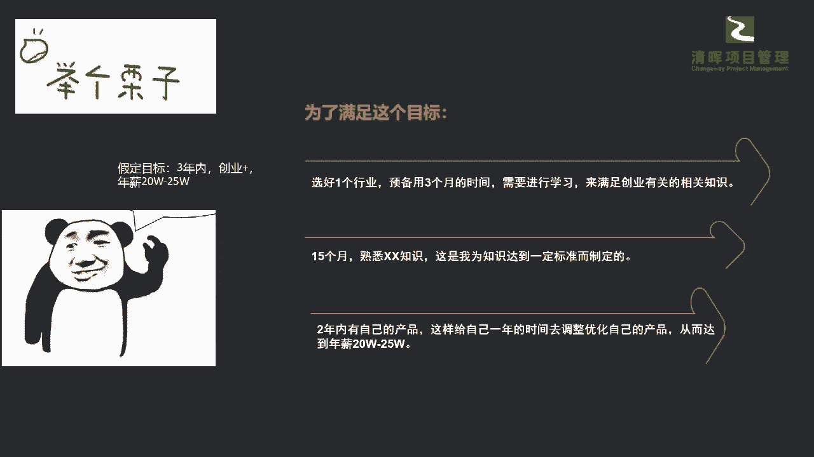
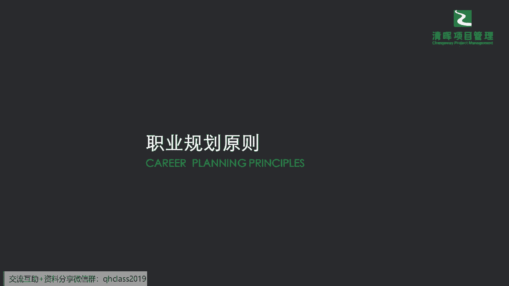
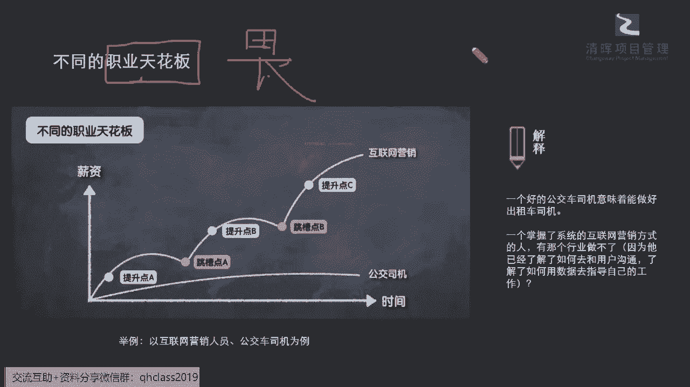
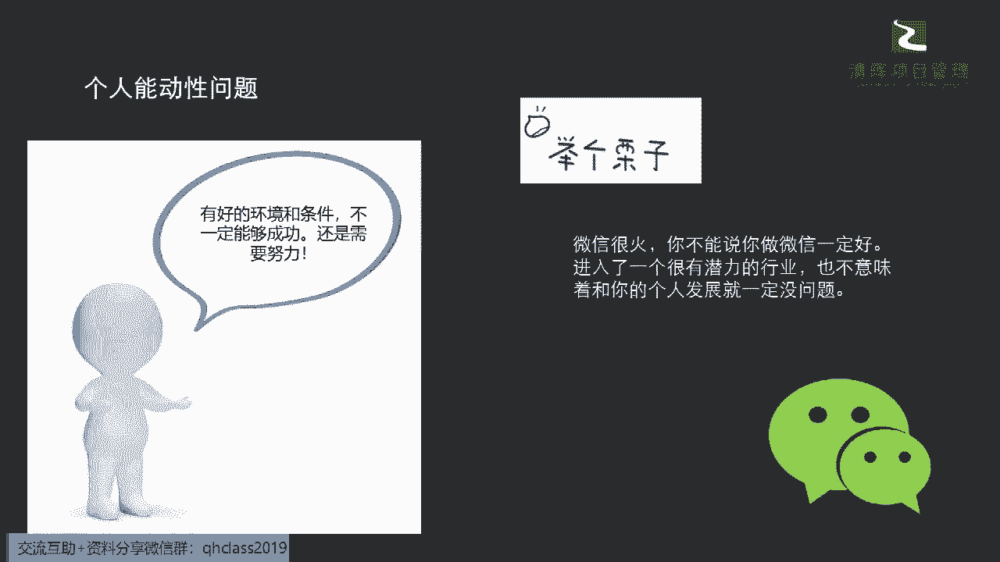
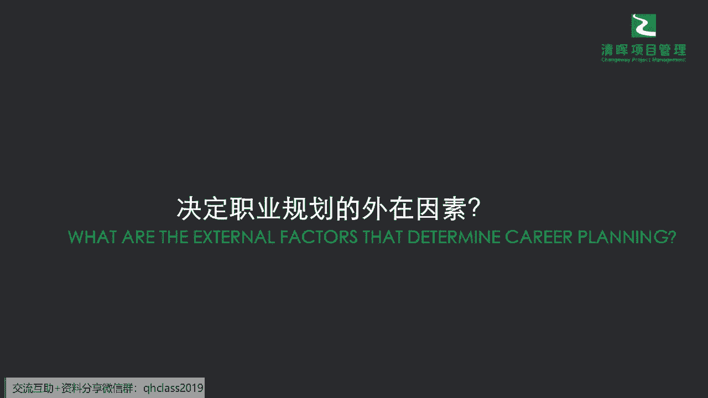
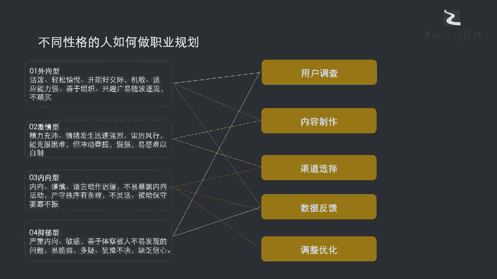
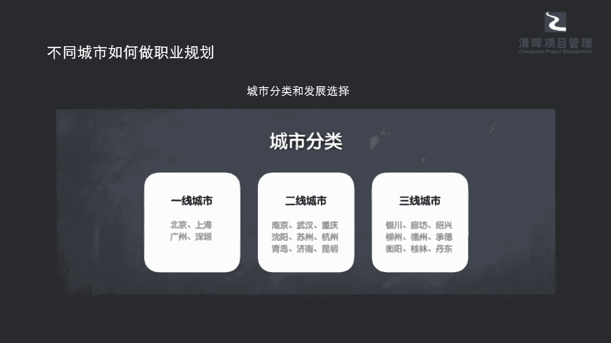

# 让你少奋斗5年的项目经理职业规划指南 - P4：4.项目经理行业选择 - 清晖Amy - BV1rS411N7iZ

看啊来看到。

那么现在我们具体一点啊，我们就讲一些哪些热门职业，大家都很感兴趣，说我做项目经理，各各行各业的是吧，我们有这个医医药的，有网络的，有能源的，有这个房地产的等等是吧，那么在这个当中。

我们这个细分领域你应该怎么样去选呢，其实在这个里面，大家多少有一些行业知识会好一点啊，所以在这里大家可以简单的分一下，比如说你分成支柱行业，分成功能类行业，分成这种催生类行业是吧。

也就是说你今天的这个领域，到底是在哪一个行业的跑道里面挺重要的，就像我们一直在强调的一点，大家的选择可能会比你的努力重要是吧，也就是说你在哪个赛道里面，你你在什么样的这样的一个行业里面，去做这个PM。

其实也会一定程度上决定你以后发展的一个，这个长期性，和你的一个什么平台的这么一个，这个给你的一些赋能，这个价值的大小是吧，所以可能在这个里面也请请大家啊，稍微补足一些这种这种常识，比如说很多这个同呃。

这个同学就会就会去讲说你的一些啊，现在就就就去转行，有做这个什么保险啊，有做这个什么啊，证券啊，其实在这种它更多属于功能类的行业，那我们在讲支柱行业，就让我们吃穿住用行是吧，你的衣食柱形是没办法撼动的。

因为这是我们的什么刚需是吧，刚需在刚需以上才是功能类行业，那功能类行业可能相对会去什么，支持到一些新兴行业，就我们讲的催生类行业是吧，所以可能大家在选择的时候，你自己要稍微搞清楚一下。

这是你想要在的一些跑道吗，或者是你认为这是一个有价值的跑道吗，那么在这个里面，支柱行业我们就会有一些基建的是吧，但什么叫支柱行业，我再跟大家扫扫个盲啊，你在体制不做出调整的时候。

工作还是非常非常稳定的啊，就是如果大政策不变的时候，肯定是稳定的，那支柱行业也是国家的命脉，所以这个一般通常这种啊，电信呐，什么房地产啊，呃呃呃一些矿产冶炼都是大型国有系企业占多。

而且这样的企业呢它会有明显的一些特点，大家也都非常非常熟知的，比如说论资排辈呀，这个可能靠一些人脉关系啊对吧，那可能收入的上升空间也非常的有限啊，当然饿不死也发不了财，所以如果你对自己的定位。

你想成为一个雷军或者马爸爸那样的一个又呃，有自己的一些技术，这个这个成功又能去呃呃财务自由的话，那肯定走这条路是不太适合的是吧，那么可能在你工作的过程当中，会有很多这样的一些身不由己。

因为我们讲了这种传统行业，它不太会有太多的这种所谓的，什么变数和差异性，什么叫变数和差异性，新兴行业，它是非常非常非常愿意去接受一，些什么新鲜的idea，这是为什么你会发现互联网公司啊。

一些呃头部的500强的，一些这种这种创新型企业，在他们的办公室里面，你就会发现诶进去没有办公位是吧，大家甚至可以带着宠物来上班，但是你见过哪一个，这种所谓的一些支柱性行业的公司。

它是可以这么随性随意的吗，啊没有，基本上不可能啊，是非常非常传统的，甚至可能大家就见到的啊，我们就是领导坐一个办公室啊，或者是这种啊，整个体制是非常非常严格，而且多层级的是吧，所以相对是比较传统的。

所以如果这样的一个跑道不是，你认为可能后续会是你的兴趣，并且能够为你增值的话，你可能就要去有所有所保留，当然父母的希望是父母的希望哈，但是我相信可能大多数这个咱们的一些。

现在的这个这个同学和这个我们的小伙伴，大家都会都会有更多自己的一些想法，那么功能类的行业呢就是指的一些需要一些系，就是一些这种技能的，就是你必须要懂得这个相对应的，这个功能行业的一些领域的知识。

他就是往这个技术行业这样走了，就是你必须懂得，比如说你的呃资管理咨询是吧，你的一些这种呃这个这个你的一个呃证券投资，你的一些呃人呃人力资源的管理，这都是往金砖的方向去走，而且酒越沉越香。

就是你这个越有更多的经验累积，越有更多的这样的一个行业赛道的一个经验，你后续可能会更加的值钱，就是你这个价值会更加更加的大，所以可能在这个点里面的话，我们会看到啊，这种多功能类行业。

通常会给我们带来这种收入的小康是吧啊，也就是说你可以变成一个领域的螺丝钉啊，但是可能现在稀缺技能的优势它会越来越小，你可能会变成一些什么啊，就变成一些服务者了，就是你没有那种所谓的壁垒了。

因为大家都可以可能通过一定的这种，尤其是现在内卷的时代，同志们啊，大家从这个这个教育上就能看出来，我们现在已经没有这样的壁垒，就是你你认为这个赛道是有有有这样的一个，好的方向。

会发现大家都往这个方向来走是吧，所以你的这些职业的技能优势会越来越小，那可能会变成一个服务者的时候，就是你的这个主动性和你的一些这种啊，个人的一个晋升的一个这种范围，可能就会随之而变得什么窄了是吧。

那么我们的催生类行业就是一些新兴行业，新兴行业，它就是因为市场的推动而进进一步产生，生发出来的一些新的岗位，它是比较开放的啊，它横向纵向都有学习的这种机会和可能，所以根据这种市场机制。

它来提升这种近晋升的依据，所以你会看到很多的这种啊互联网行业，它的leader，他的主管可能比他的下属都要年轻的很多，比如说我们通常讲的这种零零后，九零后，甚至可能在很多的这个行业里面。

都已经是非常高的一些高管了是吧，一些主力了，这在传统行业根本是不可不可想象的是吧，所以可能在这个当中我们就能够看到啊，新兴行业它还是能够给你很多的一些这种机会，同步呢给到我们很多的挑战。

就是需要知道你有一些随着时代，随着这个新兴产业不断学习的一个能力，而且你能够做更多的一些新兴行业，它所要求的事情，所以在这个点上，我们能够看到这种新兴的思维方式和技能，一种互联网的思维。

其实就要求我们要干什么，拥有更强大的自我迭代和学习能力，也就说你要不断的就像自我升级一样，要能够快速啊不断的一道一道去升级，你永远不会变得，我们讲这个职场有一有三个字啊。

大家之前有去看到过一个一个名词叫做商啊，伤啊，这个词一个火字旁在物理学里面是有看到过啊，啊这个鼠标不是很好用啊，其实就是我们的这个物理学当中啊，有一个非常非常啊，这个普遍的一个这样的一个说法啊，叫做商。

那我们在管理学里面运用到这个商，我们把它放在管理学里面，前面加了一个字，后面加了一个字叫做做反熵增对吧，反熵增，所以在反熵增的过程当中什么意思啊，商就是无序啊对啊无序啊，也就是说我们在整个无序当中。

能够去去找出规律来去反熵增，变得越来就我们用通俗的话讲，我们今天不想把人变得越来越油腻是吧，哈哈越来越的这个感觉是怠政啊，疲惫这个缺乏创造力，而且就是呃这个非常乐，想要在自己的岗位上就躺平的这种是吧。

这个就叫我们就讲熵增太多了对吧，他就无序感特别的强，就没有这样的一些创造力，那我们就需要反熵增能力特别强的人才，也就是说你需要在这种无序，在没有没有东西指导你，没有人来带你这种新兴行业里面。

你能够快速跟随着你的这样的一个这个呃，新兴行业的一些要求，不断的去提升和学习是吧，所以这是我们的一个啊新兴行业，那么在这个当中你要选择什么样的一些职位呢，啊一般通常来讲分成这三大类，一类是业务型。

一类是服务型，一类是支持型，那你自己想想看你属于哪一型的，但我们通常业务型的就是跟市场值相关的，就是你会直接去拓市场啊，一般来讲这样的这个岗位他会相对工资高，而且学习的机会大。

而且这拨人他是最容易去接触到前沿的一些，什么最新的知识，能够快速提升的人是吧，所以这是当然挑战也非常非常大啊，那么第二类就是服务型的人才，那服务型的人才，他其实是业务发展重要的一个保障部门。

它需要有一些金砖的啊，非常细致的，然后你能够比如说你的HR呀啊，你的一些这种财务啊，你需要有这样的能力，但是这样的人才他只在自己的领域有所研究，他并不能在更广泛的领域去发挥一些，他的一些常识和长处对吧。

那么第三个呢就是知识性的人才，知识性的人才就属于我们通常来讲，就是你的一些呃supporting的部门是吧，你在业务发展的这样的一个基础垂直类的职务，学习路径清晰，专业性强，比如说你公司的这种研发对吧。

你公司的研发，还有你的整个的一个这个这个有一些这种嗯，我们讲的这种业务垂直类的，一些这种发展的一些职能部门啊，大家就是在自己的这种岗位之上，可以不断的去研究，不断的去努力啊。

能够变得这样子专业性更强是吧啊，所以这是三种类型的人才，那么在这样的情况之下，我们举个例子啊，以互联网行业为举个例子，你你的职业和薪资啊，一二线城市，这个我们大概揪了一个例子可以看到啊。

你从销售市场产品设计啊，一直到这个财务行政，你会发现差异性大不大，大家一眼可以看到啊，如果你在刚入职的时候，你的你的入职薪水哪一个最低呀，哪一个最低，是不是销售最低啊，同志们看到了吗。

所以这是这是为什么，有的同学一开始会觉得，销售这个岗位好像没前途，或者说从另外一个角度，就觉得太多的这种不确定因素，所以大家不愿去选销售，然后更愿意去干什么，有技术的就去选开发了，是不是啊。

因为开发那它属于垂直的啊，它属于支持型的，那么我们再来讲，在我们来看到整个的整个的长期的这种呃，入职场之后，我们到了四到6年更长的时间点之后，我们发现哪些部门是相对最高的。

当然你的专业技能不可取代的技术是一方面，另外一部分是什么，就是你你的sales和marketing这两个最充满挑战的岗位，对不对，所以在这个里面同志们，我们一定要非常非常非常的呃，这个这个呃。

来看到我们的整体的这样的一个啊，发展的一个趋势和要求，那么也可以看到自己目前是不是还在中间，这个领域啊，在在做一些这样的一个调整跟挣扎，甚至你可能目前给自己的一些想法和规划。

是不是也可能会考虑到你的薪资发展啊，当然你的平台发展来去规划，你后续的一些这样的一个目标，那么大家可以看到传统的一些这种互联网的，一个工作的状态，大家也都非常清楚，这里也不赘述是吧。

所以你可以看到最大的一个特点就是什么，薪资落差其实非常大，有些地方可以就是赚到几10万的是吧，但是有些地方就可能这个薪资一个月只有啊，几千的或者是非常低的一个薪水，都是非常非常多的是吧。

所以可能在这个里面他会发现新兴行业，它更多倾向的是用员工的贡献度来晋升，而不是熬年资，所以你在这样的一种情况之下，你你还是要去燃烧你自己是吧啊，燃烧你自己来去啊，要到你想要的东西。

但是这个东西你也需要去权衡一下，这是不是你自己想要去做的方向，甚至你牺牲啊，我们讲这个牺牲其实不能叫牺牲啊，应该说是叫交换啊，就像我们讲今天从一出生开始，我们的每一样东西都是被贴了价签的是吧。

我们都是要通过这样的一个交换来去获得的，通过努力来交换你想要的一个工作，通过努力来交换你想要的一个这个物质是吧，那其实也一样，你来去通过你自己的这种996007，来去用你的生命来去换。

你这个整个后期的一个职业的成功，那是不是这些部分经过你自己的一些考量，是你想要去从事的方向对吗，所以可能在这个当中我们需要去啊，提到一个非常非常重要的一个点啊，好那么我们接着来看我们几个规主要的原则。

大家知道一些common的想法，common的思维，甚至一些具体的这种办法来通过时间，你的角色薪资来去制定你的目标，那么我们来看看大原则，哪有几个必须要才对啊，不能够去有任何的一些这种这种嗯。

我们的一些这种犹豫的点啊，就是不同的职业天花板必须要想清楚，比如说啊你一个好的公交车司机，你能够意味着，你能够去做一个很好的出租车司机，这个大家能理解吗，这个应该非常粗糙的一个例子吧。

也就是说今天你有个这个这个大货车，你是A照是吧，你这驾照里面是A照，你可以去开小轿车，但是小轿车的C照，它不能开B照，和和这个这个相对大车的这样的一个啊，整个的这样的一个呃这个size对不对。

所以这就是一个你是否具有职业呃拓展性对吧，你比如说你你这个好的公交车司机，你可以去开出租车，那一个掌握了系统的互联网营销方式的人，那有哪个行业做不了，因为他实际上，可能在这个最激烈的这个行业当中。

已经掌握了客户的一些方法呃，沟通的方法和你一些管理的方式，那通过这样的一些数据来去进行，这样的整体的一个呃，这个策略和营销方法的一些迭代来去，最终赢得客户，那如果你在最激烈的环境里面。

已经接受过锤炼的话，那么你一定会能够胜任，一些其他的相对稳定行业的这样的一个，营销的岗位，大家能理解吗，也就是说你一开始，你把你自己的那个职业的天花板，设得足够的高吗，也就是说我们太多同学啊。

你可能在纠结点，并不是不知道什么事情是正确的，而是畏难畏害怕的那个意思啊，畏难就是我们一开始挑了一个最容易的事情啊，挑了一个最容易的事情，相对最容易的事情啊，可能会让你自己心里舒服一点。

比如说我们刚开始A和B，你有些同学还是会可能考量之后挑了B是吧，那也就是说可能现在给我8K让我稳定一点，让我心里舒服一点，能够有更多出来的5K去养家是吧，做其他事情，但实际上你在考量A和B的时候。

你并没有站在一个长远的眼光，来看这件事情是吧，所以可能我们职业天花板，如果一开始你去接触的事情相对是比较稳定，和什么是变量少的部分，那实际上你有可能你的天花板就会非常低。

你在你一定的年龄段没有受过大风大浪，你没有去经过一部分的锤炼练的时候，你就很难走过一些更加不确定的一些点，甚至一点小小的变动，你都会觉得是天塌了是吧，就像我们今天在讲的。

我其实见到很多同学啊特别好的一点，就是在我们疫情开放之后，有些同学也会啊跟杨老师来反映，就是一些这个工作里面的变动也在问啊，其实有一个非常对我触动很大，就是我们有一位同学，他在疫情期间毅然的选择了转岗。

因为他自己本身做的岗位的话，他其实没有什么业务的啦，然后就整天可能是能拿到薪水的，但是没有什么事情做啊，可以没有什么实质做，它就原本可以相对舒服的混过，大概两年到3年的时间。

但是呢他非常这个认真的去进行了，内部的岗位的一个分析和选岗，他自己呢去啊申请到了另外一个工作部门，这个工作部门他其实就是有点类似于去嗯，在啊疫情期间，最最啊激烈地去应对这种变数的一个这个考验。

能够快速去组织一些响应等等啊，这样的一个一个工作职责，所以呢，他非常非常在这个仅仅不到两年期间之内啊，得到了非常密集度的啊高密度的一个锻炼，让他的整个的管理能力上了几个台阶，甚至可能在疫情放开之后。

然后公司把他专门派到了一个这个区域，让他去在他这个年龄段担任了这样的一个，这个区域的这样的一个主管啊，这样的一个一个角色，那他自己也感受到了这样的一个压力，但从另外一个点上，他并不害怕，他并不畏惧啊。

并不畏惧，那他也是在这两年时间里面得到了充分的锻炼，就像我们讲的，就是他从一个这个开大车，然后变成开小车的时候，他原来在总公司来接受历练，现在要被派到某一个区域去。

你觉得他会害怕吗，他不会害怕啊，他更多的可能就是想着要怎么样快展，快速开展工作，那其实在我们自己本身来讲，各位同学们，你们一开始给自己set的这个这个天花板啊，就像我们还有一句话说的非常非常到位。

叫什么由俭入奢易，由奢入俭难，啥意思，就是今天你本来不适应啊，这个什么很复杂的东西啊，你这或者是呃说过，这个非常富丽堂皇的一些东西，你今天去已经住到了别墅，非常大的一个house。

再让你搬回到一个草屋啊，一个棚子你肯定不行，但如果一直是住惯了棚子的人，你让他再去适应一个，可能一个毛坯房对于他来讲，其实根本没有什么挑战性是吧，至少从心理上他不会有一些这种情绪上的波动。

甚至可能在这样的一个这个区间里面，他认为这些都是正常的，可以去接受的一些什么考验是吧，所以这一点也非常非常关键，大家一定要正确的去设置自己的职业天花花板，那同步呢我们来看看啊，如果你的天花板高和低。

你的职业发展机会大和小，会有怎么样的一个不同，那你比如说你天花板高了，今天我们就说城墙围高了，就像我们木桶原则嘛，同志们，木桶原则什么意思，你能够装多少水，不是由最高的那块板子决定。

而是由最短的那块板子决定的，也就是说如果你的板子全部都很高，你一定能够装更多的水的，你一定能够担更多的水回去，这个毋庸置疑，那么如果你的这个板子很低，你一定存不住水，你就很少能够有这种成功的一个。

大的发展的机会是吧，这个大道理大家都明白，所以可能在这个当中，我们就有很多的这样的一个主观能动性了，比如说你有好的一些环境和条件，还不一定能够成功，你一定要有个人的self motivation。

也就是说你必须要有一个正确的赛道和跑道，比如说啊我们这样子来讲，今天举个不恰当的例子，如果我们是一个这个这个新兴行业的项目经理，和一个房地产行业的项目经理，你会发现可能在某一些行业里面。

尤其是这种传统的支柱行业的里面，我们的项目经理能够得到的锻炼的范围，也是非常相对有限的是吧啊，但是除唯一能够带给你更多的好处，比如说国企相对稳定啊，或者是有一些这样的一个啊，这个这个这个让你感觉到。

这个环境会稍微舒适一点是吧啊，但是实际上他得到的这种锻炼，如果你想在pm的赛道上能够跑得更远更快的话，那其实不一定啊，你在房地产行业做一个项目经理，会比在这种啊新兴行业做项目经理学到的更多。

反而有可能你不如这种新兴行业的人，得到的锻炼机会更多是吧，所以也就是说我们既然个人有想法有能力，你就一定也要跑对赛道，进入一个有潜力的行业，让你自己个人发展和赛道的这个赋能加持。

能够给你更多的这样的一个，这个跑道上的加速度是吧，那么有了这样的一个原则性的一个理解呢，我们再来看看，我们决定我们自己质押规划的一个外在因素，还有哪些呢。

实际上我们在讲到我们除了内因啊，我们讲刚才提到你的制定目标啊，你的一些原则啊是吧，还有你的一些思维方法，这些都是什么向内求是吧，就是你自己要想明白的对吧，你自己要掌握的方法，那么我们决定职业规划的。

一些外在的因素有哪些呢，实际上在这里面我们可以看到啊，你还有很多因素要去考虑，比如说你的salary，你的promotion是吧，你的这个现在薪水能挣多少钱。

你的晋升，你的整个的一个发展，比如说5年之后，以及你的一些这种整个公司的一个文化，你的一个领导，领导者对你的一个什么这种呃呃态度是吧，以及你的一些软性的福利是吧等等。

那以及你是否工作强度是你啊恰巧适中的，而且未来如果说要跳槽的话啊，比如说有一些呃更高层级的职业发展，是否能够给你带来一些这种增值效应的，这样的一个平台是吧，所以可能在这个里面，我们可以看到。

我们要通过一些统一的度量衡进行工作的比较，比如说我们就介绍给大家，就像我们在学PMP的时候，我们也会有这种什么啊，我们有一个叫多标准，是这个这个市场决策的，这一个决策的这样的一个工具。

它其实就把这些因素全部列下来对吧，全部列下来之后呢，我们也把价值列下来进行一些什么啊，加总来去看哪一个这样的货币价值，和它的总数是相对什么正向的，那我们肯定是要相对倾向于去选择正向。

最最大的那个工作对吧，所以可能在这个里面，大家就不妨可以尝试，先用这样的一个很简单的一个思维工具是吧啊，马上把你现在的一些工作和机会把它规划起来，来去看一看你现在挣多少钱是吧，5年之后挣多少钱。

然后你的这个工作强度把它量化一下，那以及你相应的最关注的几几个点，把它列下来是吧，同志们，只要你把这些东西能够大概量化估出来，其实对于你而言就是进行一些什么啊，我们讲的自驱的选择了，同志们能理解吗。

这些是外在的因素啊，所以你自驱你就相对在一个正向里面，你再去选择你自己兴趣爱好，最墙的那个句型了是吧，好，那么我们有了这样的一些这个idea想法之后，我们就来看看啊，那为什么我们还会有这么多的差异化呢。

其实就是因为我们有太多不同的性格的人，是吧，不不同的性格的人，但是可能在这样的一个啊，呃整个的一个大家自我的一个认知里面，我们可以简单把它分成四大类，一类是外向型的，比较活泼的是吧。

all going的是吧，那第二类是啊充满激情的啊，激情型的，第三类就是内向型的，第四类呢抑郁型的哈，就是相对我们讲的不善言辞也好，或是有一些这种敏感啊，脆弱多疑等等啊。

那么我们可以看到你在整个的这样的一些，这种啊大类的一些工作上面，你会发现有什么样的一些可能性的，不同性格的人的一些选择呢，其实你可以发现啊，我们一些整个每一个类型人。

他都可以去选择到自己独有的一些什么啊，这种特别的一些方向和发展的一些趋势，所以可能在这个里面呢，大家完全不必有任何的一些包袱说啊，我是什么什么什么样子的人，所以我只能做什么什么啊，我们只有说是适合做。

其实没有这样的一些什么limit是吧，没有这样的一个限制，所以可能在这个里面，我们需要呃来请大家来看到，如果有这样的一些发展的一个方向和趋势的话，那么也可可以看到我们整个的一个不同城市。

做职业规划的一些发展。

我们这里就跟大家捎带着来说说啊，大家现在都非常那个讲的。

我们现在好多这种一二线城市啊。