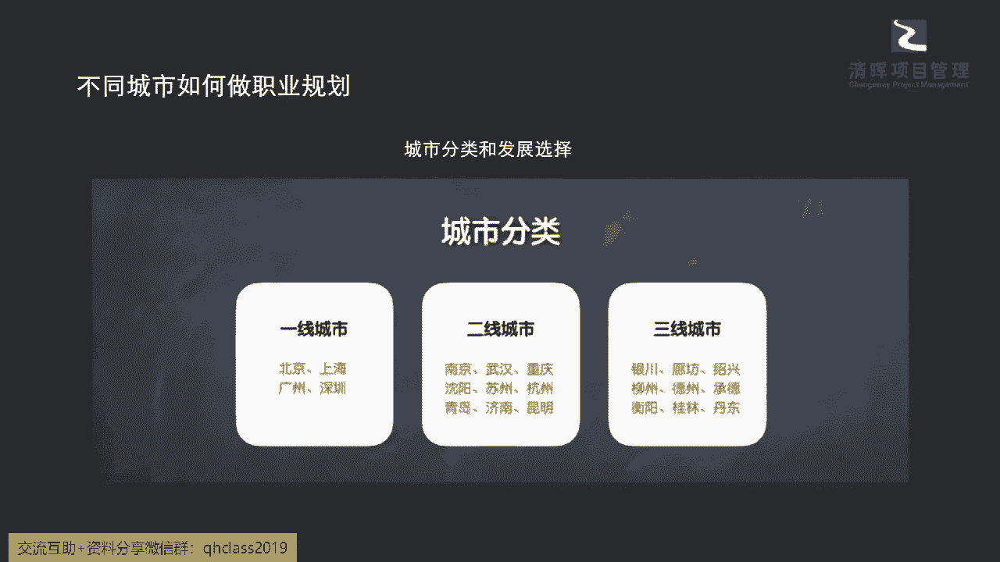
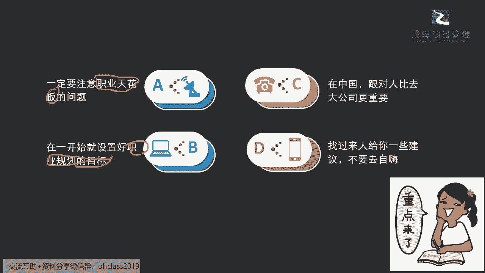

# 让你少奋斗5年的项目经理职业规划指南 - P5：5.不同城市如何做职业规划 - 清晖Amy - BV1rS411N7iZ

从城市做职业规划的一些发展，我们这里就跟大家捎带着来说说啊，大家现在都非常那个讲的，我们现在好多这种一二线城市啊，三线城市啊对吧，那大家怎么样能够更好地结合外部的环境，来去做一些选择呢，那大家可以看到。

通常意义上我们讲的北京上海，广州深圳一线城市，它的机会是最多的是吧，可能给的这个配也是最多的，但是花销也是最大的是吧，同志们啊，所以他可能在这个过程当中呢。

我们就需要去看到在一线城市，那我们在一线城市的时候，我们可以去选择什么，比如说可以去一些更加具有创新型的，前沿的创业公司去发展发展吗，啊可以去一些环境开放学术啊，这个氛围非常浓的，这样的一些。

这个可以让你有一些角色，岗位差异化的一些公司，去快速学习多元化的一些技能嘛对吧，然后还有你是否能在一开始的时候，能够去接触到这些公司的一些这种盈利模式，能够看到你自己的一些前景，而且我们通常来讲。

大家特别有经验的一些这个职场的这个，这个打拼者都会知道，我们换工作的时候，还有一个非常非常关键的因素，除了你的平台，你的薪资，你的岗位之外还有个什么因素，老板是吧，你的老板是谁。

就说我们如果有一个特别开明，特别这个好的一个重视你发展的一个老板的话，其实这也是一个非常非常重要的因素啊，来去推动你持续不断的一些进步和发展，所以可能在这个层面我们能够看到啊，我们整个的一个选择性啊。

你其实是非常非常多元的，在一线城市，你能够接触到的也是非常非常前沿的，所以你不妨可以拿这个当做一个，简单的一个清单，来去看一看你自己的一些这种选择的一个方向，那么在我们的这个二线城市和三线城市里面呢。

其实就会有一些这种更大的一些挑战，比如说你可能啊创业成本更低的话，那你是否自己直接尝试去做一些，自己想做的事情，个人创业对吧，或者是你可以靠你一些积积累的资源，如果你没有出来到一线城市的话。

你自己本身在这个城市里面，也会有自己的一些资源呢，怎么样去利用起来这些资源对吧，那么还有就是我们相对应的整个的这个呃，试错成本也会非常低，所以我们要快速在这种小城市的一些公司。

去尝试这种更多的可能性对吧，那么还有你自己呃，可能在这样的公司里面权限更大对吧，你会有更多的一些呃这个想呃平台和更宽广呢，就这样的一个舞台去展示自己，这其实都是非常非常好的一个点啊。

因为你可能在一线城市不一定啊，一下子就能让你站到那个舞台的最中间是吧，但是可能在二三线城市，你可能就会有更多这样的一些机会是吧，那么这个可以综合去考量，同同步呢我们也提醒大家几个点啊，提醒大家几个点。

那么在这个过程当中，我们的职业规划我们必须要想清楚一些内容。

那么在整体的过程当中，同志们，我需要特别提醒到大家的一点，就是大家一定不要简单地把职业规划这件事情，想成一个啊，我只要我愿意啊，有钱给就能够去啊做的一个尝试，因为大家想投入进去的第一个是时间成本对吗。

第二个还有什么很重要的一点是什么，就是你自己本身大家都讲了，我们生命是有限的对吧，我们是有限的，所以我们的整个的健康和精力，在不同的阶段也会面临着很大很大的一些挑战，也就是说我们不自然地就会面临到更多。

更多的一些挑战和问题，所以我们一定要从本源上去解决一些，这种质押规划的基本点，才不至于让我们走到某一个阶段的时候，去迷茫去，可能产生很多的焦虑，可能这个焦虑又会让我们变成这种。

随着什么整个时间的一个什么推广啊，是往前推移，又会变成一个什么无解的话题了是吧，所以啊给大家一些提醒，第一个你从职业天花板上什么意思，直接告诉大家就高不就低啥意思，如果AB和C哪一个对你挑战最大。

方向性又是基本上以前没有遇到过的一些，这样的挑战，你就选哪一个是吧，那通常来讲，这样的一个领域一定会让你学到更多的一些啊，别人不知道的东西啊，职业天花板就会set的更高一点是吧，所以这是一个基本的点。

那么再下来呢一定要有这个什么目标，职业规划的目标，职业规划的目标，刚才也跟大家提到了啊，用什么方法时间加角色加上什么啊，你的薪资是吧，也就是说你必须要最简单的一个点，你要知道自己多长时间要达到什么。

你要达到什么样的薪水，如果你就像你一直在讲这个项目进展，你要纠偏一样，是不是啊，同志们，你不能一直这个开着开着跑偏了，你都不知道要这个最终去的不是你的目的地，然后你还勉强说唉在这儿也行吧，是不可以的啊。

就是我们讲我们就是要什么样的成果，我们就一定要往那个方向去走，而且我们要在这个过程当中，不断的给自己纠偏的这样的一个机会，那这是我们的其中一个点是吧，那么第三个点啊，我们可能稍微说实在一点啊。

因为我们太多以前的伙伴们会比较想要去啊，到这个大型写字楼坐着喝喝咖啡是吧，在外企感觉大家都看到很光鲜是吧，就白领骨干精英嘛是吧，那么实际上可能现在在这种变革当中的，我们的中国啊，我们更加直接一点讲。

我们现在啊可以说在10年之内啊，我们应该会成为全球GDP最大的一个实体，也就是说在中国，我们每一个人我们都是中国人是吧，我们要去啊做好自己的职业的一些规划，你的一些发展。

那么你就不能简简单单仅仅是看一些什么brand，说大logo是吧啊，大logo当然大树底下是好乘凉，但是如果大树没了呢，对吧啊，没了我们自己也要学会做伞，也会乘凉是吧，所以可能在这个过程当中。

我们就一定要锻炼自己，我们要去比别人有更多的一些这种技能，也就是说我们不能产生这种依赖的心理，甚至现在很多的同学在已有的工作岗位上，其实都相对比较的安逸是吧，同志们啊哈我们可能就在很很不错的公司。

甚至福利很不错的公司，但是我也想请大家，刚才有位同学说的非常非常好啊，居安思危一下啊，居安思危一下，因为实际上每一位今天即便是呃这个雷军啊，即便是马爸爸，即便是这个呃顶尖的这种呃字节也好。

很多的这种科创公司也好，其实每一个这个leader啊，每一位这样的一个这个创业者，他们始终都在保持在一种什么啊，非常这个市场高竞争的这么一种状态当中啊，可以看到，他们没有一天觉得自己已经做得足够好了。

而是每天都在想办法在求新求进步，求发展是吧，所以这个对我们自己本身来讲，也是一种先天下之忧而忧，后天下之乐而乐的点，也就是说，我们不能仅仅追求物质的短暂的一个什么，这个开心我们也要去做好平衡。

同时来去给自己提出更多的一些目标和要求，是吧，我们不仅仅去选择一些大公司，我们更要去选择，对我们未来发展有利的一些机会和平台，也许这个平台在现在给我们的挑战，还非常非常的巨大，但是这种巨大的挑战。

恰恰说明了是巨大的一个机会啊，那这是一点，那还有一点呢，就是一定是不听老人言，吃亏在眼前啊，是吧啊，所以这个这是为什么，我们今天这个各位的伙伴和同学，我们在呃在线来去参加闫老师的沙龙。

颜老师都非常非常啊很呃非常荣幸，很开心跟各位来分享这些呃小的一些点啊，点点滴的一些沉淀和分享，其实就是来去互通有无啊，同志们，也就是说今天你进入一个公司，我们其实见到公司里面执行最多的一种。

制度和方式是什么，一个新人在刚进入公司的时候，需要进行什么样的培训，入职培训是吧，甚至有一些大型公司做的会更加的体系化，做的会更加的好的一点是什么，就是我们也希望有一些师徒制是吧，什么叫师徒制。

就是会有一些师傅带徒弟是吧，我们有一些呃mentoring的一些项目啊，有一些这种指导项目，然后我们会有一些资深的人员来指导，这些新入职的一些新人是吧，所以为什么要做这个事情，我们讲了。

我们不是需要创新吗，我们需要迭代吗，为什么还需要这些老人来不断跟我们讲，他们怎么做的呢，啊实际上大家有一点要理解啊，创新的本质是什么啊，我们很多同学可能之前有关注，这个严老师读书会的。

这个同学有讲过一本书啊，我们在讲项目管理创新的时候，其实就讲过一句话，其实所有的创新，都是建立在复制加发展的基础上的，什么意思，就是没有你的创新，就我们再讲糙一点的话。

你现在所有发现的新的东西都不会逃脱地球，也就是说你根本不是在创造新的东西，你只是原本新的东西就一直在那里，你只是通过原有的一些模式的改变，和你思维的转换，甚至一些重新的链接，把它们变成了一个。

看起来跟以往不同的一种方式，但是里面的因素，所有的东西都是以往都有的啊，同志们，所以也就是说我们的创新不是脱离啊，我们飞在天上的创新，而是建立在已有经验上的创新啊，所以这是我们一定要多去听取。

这也是大家非常非常好的一点，就是来来去听课啊，来去学习，来去积累这些呃，组织过程资产的一个原因，就是我们要去听取这些经验，吸取这些智慧来变成我们自己的，怎么样能够少走弯路是吧，少走弯路。

因为非常明确的一点，如果今天路标就给你指在这儿了，你偏偏说我要去试试另外一边啊，那可能存在有一定的概率，你就会什么找不到那个目的地，对吗啊，所以可能在质押规划上，这一点就非常非常的明确啊，凡事预则立。

不预则废，你一定要有明确的方向，目标跟规划，并且去听取一些这样的方式方法来去这样做，你才能逐步逐步来去一步步的落地啊，那么今天也跟大家分享了很多的思路方法，以及这种整个的一个过程当中的。

所有的一些这种啊我们的一些原则啊，甚至还介绍了一些具体的一些怎么样的一个啊，天花板一些注意事项，那么可能也送给大家一句话啊，嗯大家可能在这个职业发展的道路之上。

你会遇到很多的一些啊不同啊，很多的一些挑战，很多的一些未知，但是我们再去讲啊，就是知之者不如好之者，好之者不如乐之者，这个字念乐啊，就是你喜欢啊，简而言之，就是你一定要想办法去发掘和找到。

自己的一些兴趣点，就比如说闫老师，就非常非常愿意跟同学们来去分享，我就非常享受这个分享的过程，我也在学习，我也会啊给予大家一定的帮助，那这个就是我的一个兴趣点，但是大家自己从自己的角度出发。

你的工作给你带来一些这样的乐趣了吗，能给你带来一些新的成长了吗，这一点就非常关键啊，所以我们就讲圣人，先贤都把一些智慧早就告诉我们了，那只是我们能不能能去理解他，或者说我们现在太多的同学。

很少有时间去读书了，是吗啊，太少有时间去去看这些有智慧的东西了，所以你一下忘记了，不知道了，其实就把一些简单，因为现在整个社会很多的一些方向性，其实这个内卷是非常非常不正确的一点。

就是把大家引向了一个误区，就是不断地去填塞填压一些知识，而不去教人怎么样去提升智慧，你大家在讲这个智慧的时候，就说我不懂什么叫智慧，但是一说知识就是大学考什么试，考什么东西。

而我知道的你学这些知识而没有智慧，越多知识越坏事好，所以可能在这个当中我们一定要搞清楚啊，所以送这句话给大家好，我看到这个有有同学慕慕思雨同学在问老师，刚说的创新是什么啊，复制加发展啊，复制加发展啊。

其实我们讲这个真正有一些高高精尖的理论，他不是那种晦涩难懂的，他不是那种说讲起来非常高大上的，其实真正的道理都是非常非常朴素的真理，它可以存在我们讲一句话叫什么，道不远人啊，道理的道道啊，道不远人啊。

道不远人，也就是说我们很多真正的一些智慧和一些方，式方法，他其实一直都在那边，我们到底有没有知道有没有看见他，有没有按照他这样的方式去做是吧，所以差异在这里啊，好那么我们啊同样啊送给大家这句话。

那我们今天的分享也近接近了尾声啊，也接近两个小时的一个陪伴，那么可能刚才提到的，我们有太多同学啊，也之前也有同学在呃，这个线下在问严老师的，那么严老师也在啊，这个推荐一下。

咱们线上管理的这个社区的一个小福利。