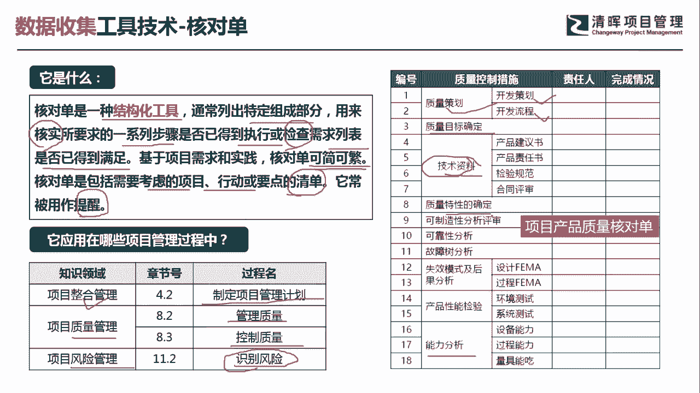
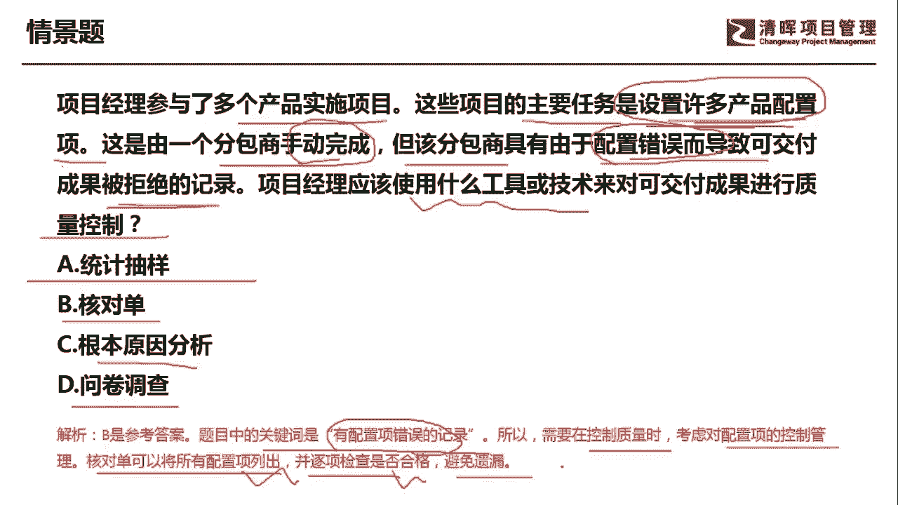

# 超全项目管理实战工具~收藏不亏，总会用得上 - P11：核对单 - 清晖Amy - BV1rG4y1k7Rb

🎼。

大家好，我是宋老师。今天我们来看一下核对单这个工具。

核对单呢它是一种结构化的工具，它的英文名字呢叫checklist。通常是列出特定的组成部分，用来核实所要求的一系列步骤，是否已经得到执行或者检查它的需求列表当中是否得到满足。

基于项目需求和实践核对单呢可以简单也可以繁琐。那核对单主要是包括需要考虑的项目行动或要点的清单，通常是用来提醒。所以我们为了避免有遗忘，那我们一定要有一个核对单来给我们去核对，你完成了。

那我们就打勾没有完成，那我们就打一个叉，它是起到提醒的作用。所以呢核对单这个工具在整个管理的制定项目管理计划过程中使用。啊为什么在这个过程中会使用呢。因为我们的项目管理计划呢，它本身是一个综合性文件。

它这个里面呢有十大子计划。三大基准，还有其他组成部分。所以当我们在制定一个项目管理计划的时候，你为了这个。不能有什么遗漏的话，要起到提醒的话，那我们最好的方式呢就是拿一个核对单完成了一个子计划。

比如说你的范围管理计划是不是完成了，那我们就打个勾，你的这个范围基准有没有完成。那我们就打个勾，它起到提醒作用。另外，在质量管理的知识领域当中呢，我们在管理质量和控制质量过程当中也会用到核对单。

它是为了这个进行过程的管控，或者对于质量的这个结果问题进行管控。会采用到这个核对单。风险管理呢。识别风险的时候也可以使用核对单。比如说我们识别是不是有商业风险，是不是有这个外部风险或者内部风险。

或者有管理上的风险。那我们都可以用核对单来起到一个提醒作用。啊，我们右边的这张图呢是一个产品的质量核对单。从哪些点进行管控呢？比如说你的质量策划是不是完成了开发的策划和开发的流程。

有相应的人进行负责和完成情况的一个这个评判。好，还有其他的这个这技术目标啊，技术资料。质量的目标确定，包括一些特性的确定等等。包括能力的分析到最后是不是有相应的这个责任人去完成。

这个呢就是我们在质量控制过程中所使用的一个核对单。

我们具体来看这样一道题，项目经理参与了多个产品实施项目，这些项目的主要责任主要任务呢是设置许多产品的配置项啊，他要设置许多的产品配置项。这是由一个分包商手动完成的，手动完成，那估计就会出现一些纰漏。

或者有一些瑕疵。但该分包商。具有由于配置错误而导致可交务成果被拒绝的记录。他是过去的有一些黑历史，他说我过去呢由于配置错误而导致了可交付服务成果被拒绝了。有这样的记录。

那项目经理应该使用什么工具或者技术来对可交付成果进行质量的控制。所以呢他考的是一个质量控制的工具。他为了防止什么，防止分包商再次发生这个配置错误的问题。因为这个分包商它是用手动完成的，手动完成。

有可能就会产生一些这个配置错误。所以呢应该怎么样去控制质量呢？A选项统计抽样。统计抽样呢，它也是一个质量控制工具，但是统计抽样它的适用情景呢是通过小小的样本来推算出。更大范围的这个母总体的一个情况啊。

你不可能对所有的库存，你都要一一的开箱进行检查。所以呢你通过一些样本抽样来进行一个这个检测。但是我们这道题目呢很显然和统计抽样是没有关联的，它主要是配置错误而导致的。核对单它主要起到一个提醒作用然。

因为我们这道题目当中所显示的是这个。项目的主要任务呢是设置许多产品的配置项，而分包商是手动完成的那过去呢他有这样个配置错误的这种历史。那我们怎么去控制质量？那最好的就是有一个核对单啊。

完成这些产品配置项之后进行打勾啊。根本原因分析主要是分析产生问题的根本原因的。我们这道题目呢。他没有说我们要进行根本原因分析。问卷调查它的适用情景。问卷调查首先它是在搜集需求当中经常用到的一个工具。

它主要是适用于这个受众群体比较广泛，那需要快速的进行调查，形成大量的这种呃信息进行反馈，适用于统计分析。啊，我们这个题目呢肯定也不是收集需求，也不是要进行这个统计分析。啊。

因此呢我们应该是选择B选项核对单。它对应的关键词关键信息呢是有配置项的错误的记录。所以我们在需要进行控制质量时候，需要对配置项的这个控制进行管理。核对单可以将所有的配置项列出。并逐项检查是否合格。

避免出现遗漏。好，今天呢主要和大家分享的是核对单这个工具，我们下次再见，谢谢大家。😊。

🎼。