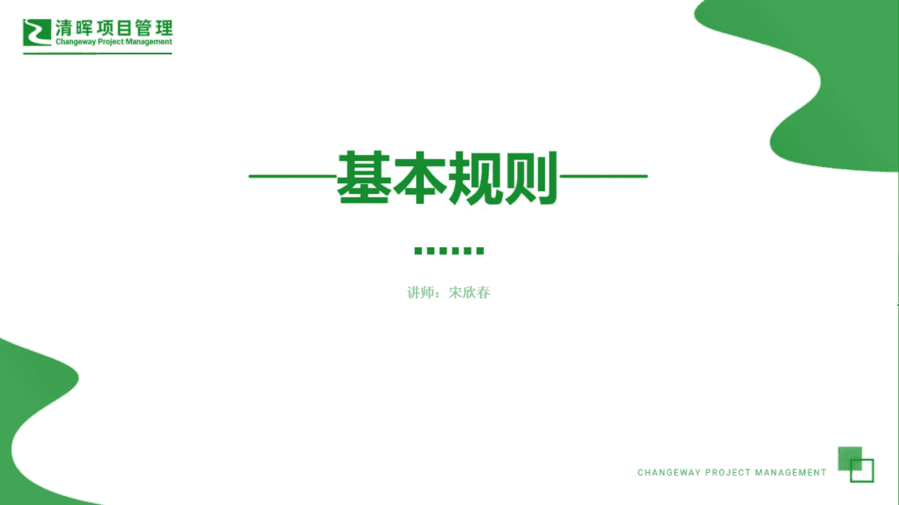
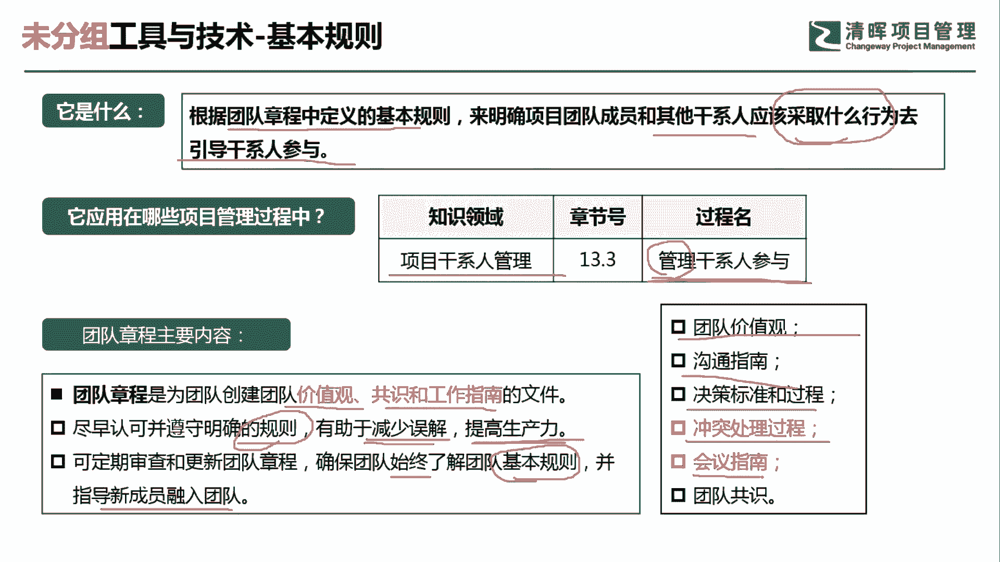
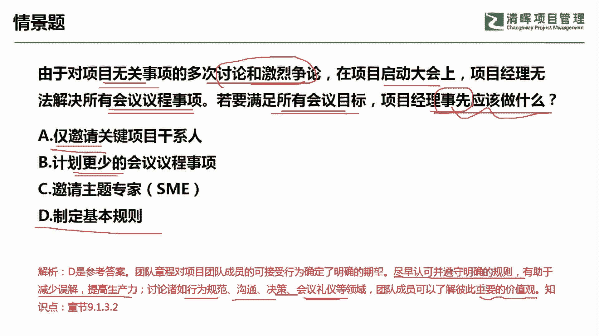
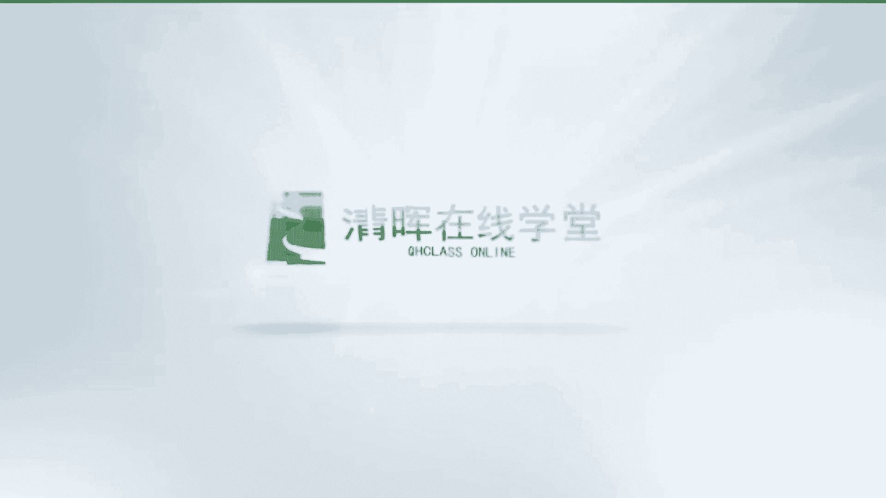

# 超全项目管理实战工具~收藏不亏，总会用得上 - P13：基本规则 - 清晖Amy - BV1rG4y1k7Rb

🎼。

各位同学大家好，我是宋老师。今天我们来看基本规则这个工具。

基本规则它是根据团队章程中定义的基本规则来明确项目团队成员和其他干事人应该采取什么行为。去引导干系人的参与。所以基本规则这个工具，它只会在项目干系人管理的管理干系人参与的过程中使用。

因为它要管理干系人所以一定要有一定的方法和规则。那这个基本规则它是在。这个团队章程中所产生的那团队章程是从哪里来着呢？团队章程是我们在这个资源管理计划中产生的规划资源管理的时候产生的。

那么团队章程的主要内容有哪些？团队章程，首先是为团队创建团队价值观共识和工作指南的一个文件。我们尽早认可，并且遵守这些明确的规则，可以有助于减少误解。提高生产力。定期的审查和更新团队章程呢。

可以确保团队始终了解团队的基本规则，并且指导新成员融入团队。那我们的基本规则主要是。规则的是哪些内容呢？第一个团队价值观，这个是一种规则，沟通的指南也是一种规则。决策的标准和过程。

比如说我们采取的是少数服从多数，然后用权重打分的方式进行决策啊，多标准决策，我们也是有规范的，这都是一些基本规则。另外呢冲突处理的流程过程也是一些基本规则。比如说大家遇到的冲突怎么去处理呢？

首先由当事方先私下，你们自己去聊，能处理好，那我们是最好的。如果当事方处理不了，那我们由这个项目经理介入去推定推进一下，项目经理推进也解决不了，怎么办？这个时候我们只能是要求他的直属上级去处理。

或者由公司的政策去处理。好，会议指南呢，我们会前会中会后都有一些指南，会前你要准备一些会议的这个这个议程，然后邀请相关干事人，还有会中呢，我们要做好空场，要围绕主题去开展会议啊，也不要去拖延时间。

会后呢我们要发送好会议的纪要，这些都是属于基本规则。那团队呢要形成共识。

我们来看这样一道题，由于对项目无关事项的多次讨论和激烈。争论在项目启动大会上，项目经理无法解决所有会议议常的事项。若要满足所有的会议目标，项目经理应该事先啊事先应该做什么？好。

这道题目呢主要是告诉我们在这个大会上产生了很多的这种讨论和争论，他往往是没有关注，跟这个事项是没有关系的。所以导致项目经理呢无法解决这个会议的议程的事项，就是项目议程呢被拖延了，被打扰了。

我们要满足这个会议的目标，我们提前应该做什么事情呢？A选项仅邀请关键干系人。这个肯定是不行的。我们是邀请相关的干线都要去参加。无论你是关键还是非关键。B选项计划更少的会议议程事项。

这仅仅是一种可能性而已。但往往呢我们不会去这个把它变少。啊，只会说我们通过其他的方式去明确。C选项邀请主题专家。事先邀请主题专家，难道就不会产生冲突吗？同样也会产生冲突。关键在于。

你一定要做好规则的制定。不能让无关的这种讨论产生啊，形成这种争论，你也要你也要有一定的处理流程。所以呢我们应该事先制定好这个基本规则。也就是说我们明确。规则之后呢，它是有助于减少误解，提高生产力的。哎。

比如说我们在行为规范上有界定沟通的方式、决策的方法，会议礼仪方面都有所界定的话，我们团队成员呢就可以了解彼此重要的一些价值观。这个时候呢我们就可以避免产生一些不必要的这种冲突了。好。

今天呢主要和大家分享的是这个基本规则这个工具，我们下次再见，谢谢大家。

🎼。

