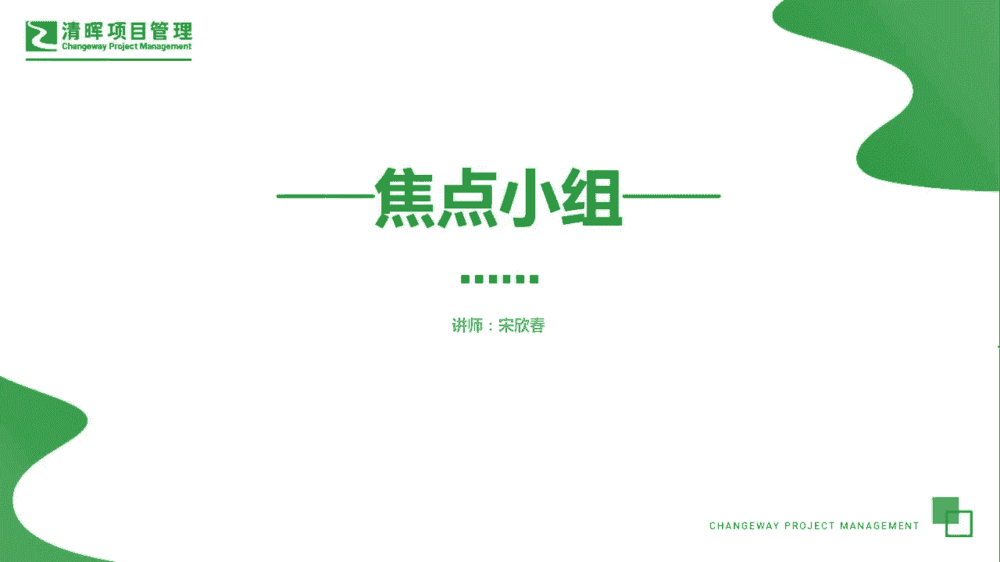
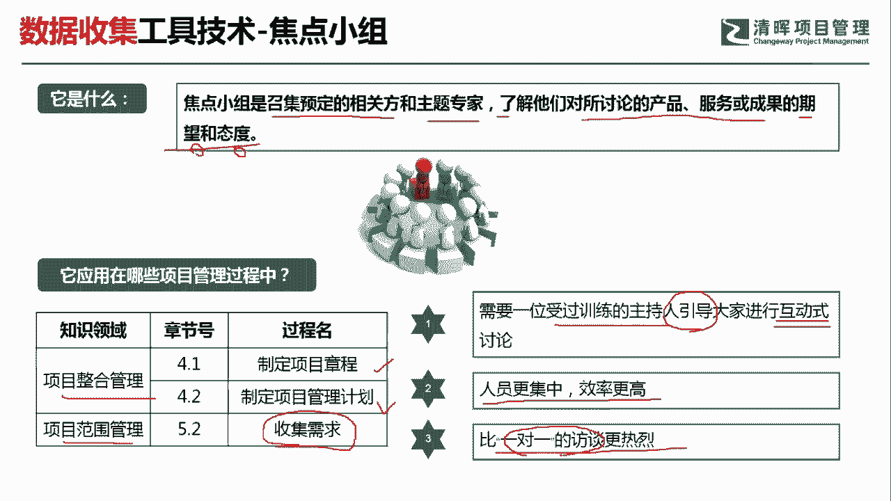
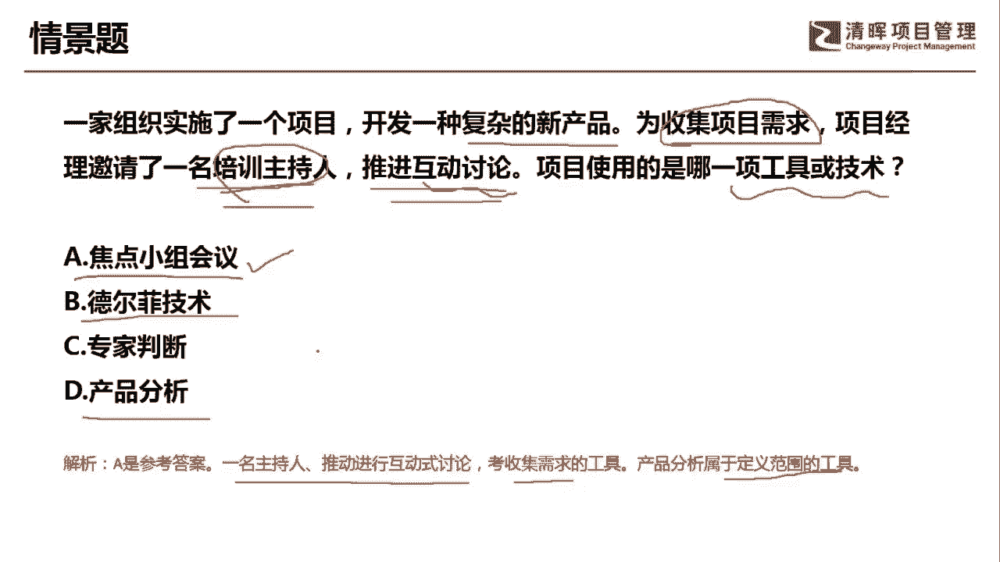

# 超全项目管理实战工具~收藏不亏，总会用得上 - P17：焦点小组 - 清晖Amy - BV1rG4y1k7Rb

🎼。

各位同学大家好，我是宋老师。今天我们来看焦点小组这个工具。焦点小组呢他是召集预定的相关方和主题专家，了解他们对所讨论的产品服务或成果的一个期望和态度。所以呢他重点的是了解这个期望和态度。

这是他们的关键词。

焦点小组这个工具，它在整个管理的制定项目管理计划，制定项目。章程这两个过程当都会经常用到在范围管理的搜集需求过程当中，也会用到这个焦点小组。那么焦点小组的它的适用前景有哪些呢？第一个。

它是需要一位受过训练的主持人来引导大家进行互动式的这种讨论。所以呢焦点小组呢，他也是一种互动式的形式。它的效率会更高，而且呢人员会更加集中。它是把大家聚集在一起。所以呢它会比一对一的这种访谈呢更加热烈。

一对一的这种访谈呢，它相对来说呢可以了解一些私密的信息。但是呢不像焦点小组，它效率比较高，就是把所有的这种干系啊都集中在一起，去针对于某个这个产品服务或成果进行讨论。

了解大家对于这个产品服务成果的期望和态度。所以呢它是了解期望和态度。它和引导不太一样。引导技术，它是不但了解你的期望和态度，而且呢它会针对于大家的这种不同的观点呃进行协调。最后呢它能达成一致。

这个呢就是引导的一个特点。所以呢大家要注意它和焦点小组的这个有区分啊，我们要了解期望和态度，一定是用的是焦点小组。

具体我们来看这样一道题，一家组织实施了一个项目，开发一种复杂的新产品，为搜集项目的需求。项目经理邀请了一名培训主持人进行这种推进互动讨论。项目使用的是哪一项工具或者技术。好，这道题目呢已经提醒我们。

它是为了搜集项目的需求。所以呢它是在搜集需求过程当中应用某些工具那我们接下来看哪一个工具适用于这个情景呢？A选项教练小组会议啊，教练小组会议呢？他是可以应用在搜集这个需求过程中，而且呢它有一个特点。

就是有一个主持人来进行这个互动式讨论的一个推进啊，所以这个是比较合适的德尔菲技术德尔菲技术呢，它是在头脑风暴的基础上，为了避免这种数据的偏引。比如说有一个这个意见领袖来参加你的头脑风暴。

那你肯定去听意见领袖的建议，所以呢他搜集的需这个数据呢，有可能会产生一些偏引。但是呢德尔菲技术就是为了避免这个数据的偏引。他把所有的专家呢进行匿名的这种投票啊，用匿名背靠背的方式。进行投票。

然后多轮次的投票，最后呢达成相对比较公正公平的一个结果。专家判断这个工具呢，它也可以在搜集需求的过程中使用。但是呢我们这道题目的情景呢，因为强调了邀请了这个培训主持人，而且推进互动室的讨论。

所以呢它更加适合于这种焦点小组的这种特点。产品分析呢。它不是一个这个搜集需求的一个工具，它是在我们定义范围的时候要考虑的这种工具啊。因此呢我们这一题呢是选择A选项，通过一名主持人。推动进行互动式的讨论。

搜集需求。那产品分析呢是属于定义范围的工具。好，今天呢主要和大家分享的是焦点小组会议。这个工具我们下次再见，谢谢大家。

🎼。