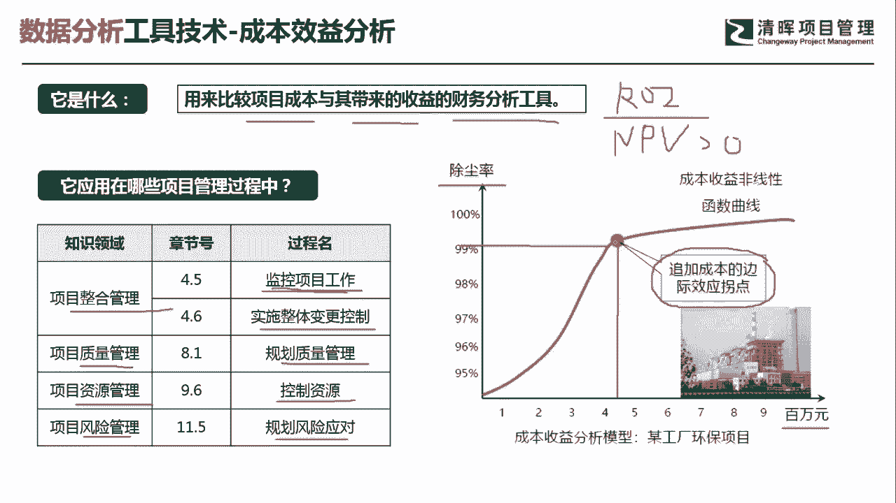
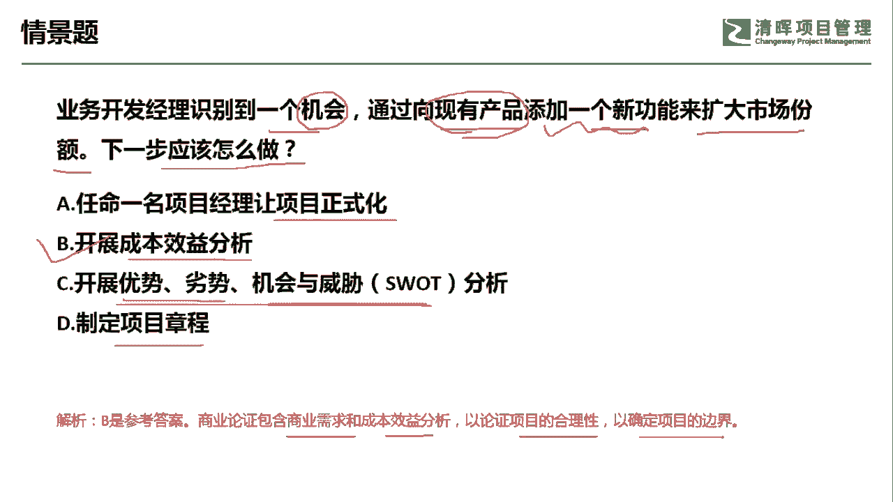

# 超全项目管理实战工具~收藏不亏，总会用得上 - P2：成本效益分析 - 清晖Amy - BV1rG4y1k7Rb

🎼。

我是宋老师。今天我们来看成本效益分析这个工具。

成本效益分析呢主要是用来比较项目成本与其带来的收益的一种财务分析工具。比如说我们之前提到的这个ROI。这个呢其实就是通过成本效益分析得出的一个指标值。ROI呢代表投资回报率。

投资回报率呢一般是大于一个百分比的情况下，我们这个项目呢才是有利可图的，才是值得去启动的。还有呢NPVNPP呢它是代表净现值。净现值呢主要是考虑到它的这个时间价值的影响。

那比如说三年之后的这个这个我们的这个收益的净现值是不是大于这个投入的净现值？如果是大于零的话，我们是也是值得去启动这个项目的。好。另外还有一些其他的指标，其他的指标，比如说回收期是不是越短越好？

他应用在哪些项目管理过程中呢？成本效益分析，它在整个管理的监控项目过程以及实施整理变更控制过程当中会采用。比如说我们在监控项目过程中发现一些新的价值增增加点，我们采用一些新的技术。

但是呢我们要考虑的一点是这个新技术它值不值得去采用。它的成本是不是过高，那这个呢也会采用到成本效益分析。另外就是在实施整体变更控制的过程当中，我们要考虑变更，你是不是要考虑这个变更带来的影响？

那如果它的影响非常大，它得不偿失，那。我们也是不会去采用这种。辩论的。在质量管理的知识领域当中，我们在规划质量管理的时候呢，要考虑到质量的一个平衡点。什么叫质量的平衡点呢？

就是比如说我们要考虑到采用一些这个。评估技术啊，或者说预防技术的时候，那是要花成本的值不值得去花。那我们要考虑一个这个成本效益分析。在资源管理的知识领域当中，我们在控制资源的时候。

你也要考虑这个资源的这个性价比啊，也就是要考虑到它的成本效益。在风险管理的过程当中，我们要规划风险应对。风险应对呢我们有这个机会的10种措施以及威险的1种措施。那么这些措施呢它。也是需要花一定的成本的。

它值不值得去规化啊，值不值得去采用这些技术，那也是要通过成本效益分析。啊，比如说我们右边的这张图，它是代表一个这个工厂的环保项目，它进行了一个成本收益的模型分析。纵向呢是代表它的出成率。

右边呢是代表我们的这个投入的一个投资啊，投资投入。在这种情况下，除成率呢，如果我们比如说。接近到500万元的时候呢，它的这个除成率呢已经达到了99%啊，甚至还超过。那要不要再去追加呢？

如果你再去追加的话，对于它的除成率的提高，其实呢。已经不是很明显了。所以呢我们一定要求到一个追加成本的一个边际效益拐点。边界效益拐点。也就是说你过了这个拐点之后，你再去投入的话，其实它并不是特别值得啊。

这个就是成本效益分析的一个核心所在。

我们来看这样一道题。业务开发经理识别到一个机会。通过向现有产品添加一个新功能来扩大市场份额。问下一步应该怎么做？好，通过这个情境呢，我们可以发现呢。他是要向现有产品添加一个新功能，说明呢他是在监控。

这个项目过程中，或者说在这个项目的过程中发现一个新的这种利润增长点。但是呢。他不知道这个值不值得去做，值不值得去添加这个新功能。因此我们应该怎么做？A选项任命一名项目经理，让项目正式化。这个呢是。

你决定要让这个项目上马的情况下，你再去任命项目经理。B选项开展成本效益分析。你要考虑一下这个新功能呢是不是忽。会扩大我们的市场份额是不是值得去做？那这个呢是要开展一个成本效益分析的。

C选项开展优势劣势机会和威胁的分析。这其实呢是在识别风险。在识别风险。啊，我们在这种情况下呢。他已经去识别到一个机会了，所以说明这是一个机会风险，已经识别到了。

所以不需要再去开展一个识别风险的这个过程了。D选项制定项目章程。制定项目章程呢是默认这个项目已经启动了。那在第一个过程，我们当然是要制定项目章程了。但是呢我们这个功能要不要去做，还没有考虑好。

所以呢先要去开展成本效益分析，然后再去考虑这个项目的上马问题。好，所以这题呢我们应该等在B的这个角度。他其实呢是在重新进行一个商业论证，包含了商业需求和成本效益分析，以论证项目的合理性。

以确定项目的边界。好，今天呢主要和大家讨论是成本效益分析这个工具，我们下次再见，谢谢大家。

🎼。