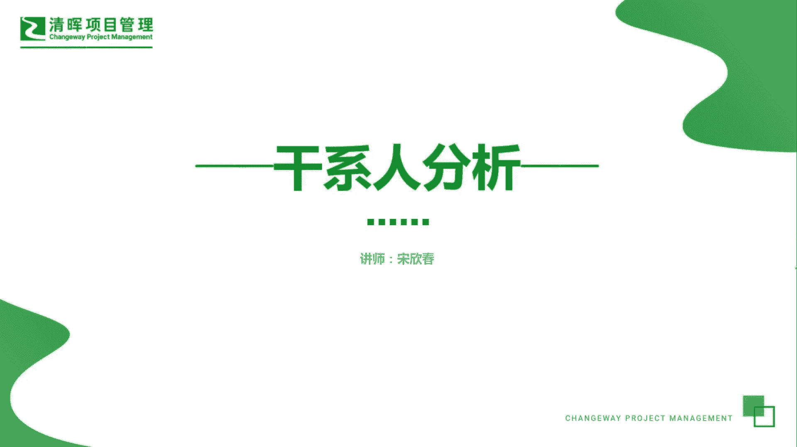
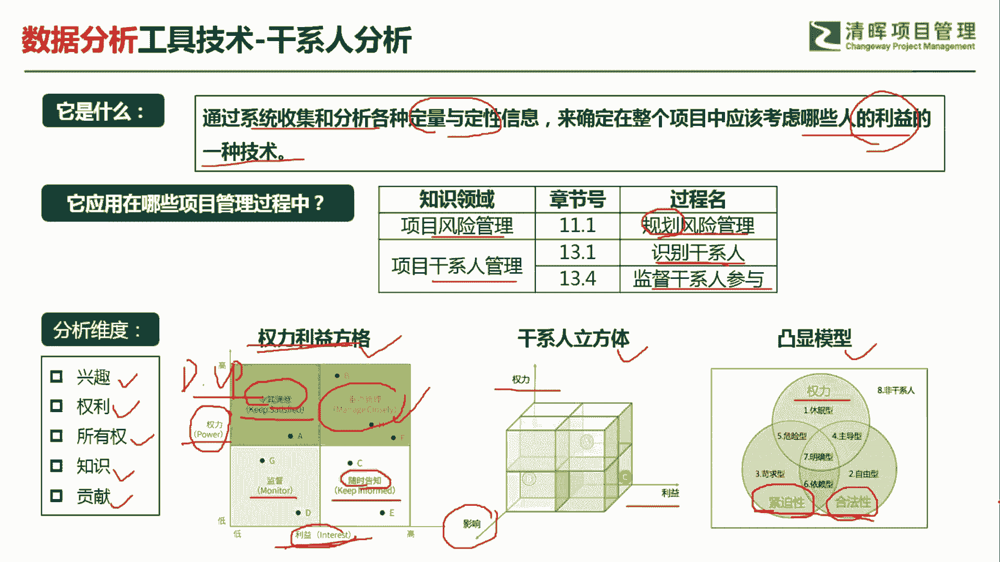
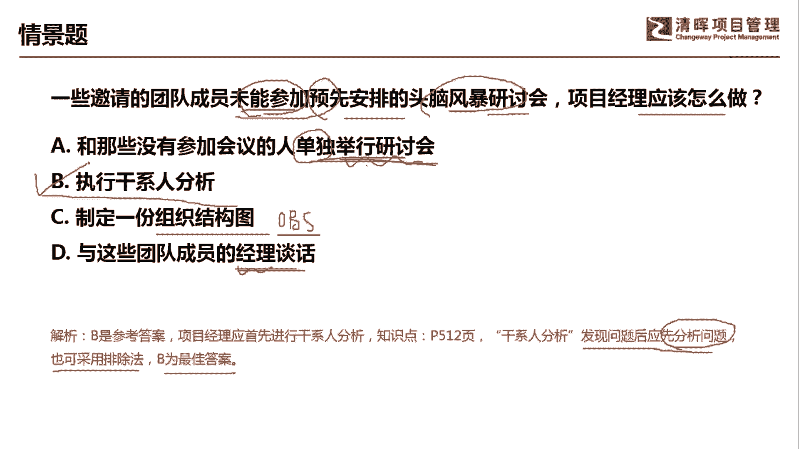

# 超全项目管理实战工具~收藏不亏，总会用得上 - P6：干系人分析 - 清晖Amy - BV1rG4y1k7Rb

🎼。

各位同学大家好，我是宋老师。今天我们来看干线分析这个工具。

干系人分析呢主要是通过系统搜集和分析各种定量和定性的信息，来确定在整个项目中应该考虑哪些人的利益的一种技术。他其实呢关注的还是利益会比较多一点。干线分析这个工具，它是在风险管理的规划风险管理过程中。

以及干线人管理的识别干系人和监督干涉人参与过程中所使用。那为什么在风险管理的危化风险过程中会考虑这个干线人分析呢？因为大家要知道，不是所有的干线，他都会支持你的项目。有时候呢它会带来一些阻碍。

所以呢它是一种风险。你要考虑到这个因素存在。另外，识别干线的时候，当然理所当然要进行干弦分析。这样的话你才知道这个干弦它是处于什么地位，它的影响力，或者说它的兴趣在哪里。监督干系人参与的时候。

为什么也要用干系人分析呢？因为我们在这个识别干系人的时候呢，会考虑一个干系人的参与度评估矩证。比如说这个干系人他原来是这个支持的。但是到最后呢，他为什么反对了。那这个时候呢。

我们就要进一步的进行干系人分析，了解原因所在？一般的干弦分析的维度呢有这样几个，一个呢就是兴趣点，还有它的权利、所有权。他的知识，他的贡献，他的影响等等。最常见的这个干弦分析的表现形式呢，有这样几个。

一个是权利利益方格，一个呢是干弦立方体，还有一个呢是凸显模型。那么最经常出现的这个情景题是考的是这个权利利义方格会比较多一点。他是从权力维度以及利益维度来把我们的干系人呢划分为四个象限。

分别是权利比较高，利益相关度也比较高的。这种群体呢我们是要重点管理它，那manage closely，重点管理这样的干系人。什么叫权利比较高呢？一般我们说这个directctor。或者呢VP。

这些级别呢我们相对来说是权利比较高的。所以我们情景题当中如果出现这样的这个人物，那默认他是权利比较高的。接下来你就看他的这个前景描述这一类的这个干弦，他对于项目呢是否比较关注。如果是非常关注。

那说明他的利益相关是比较高的。因此呢要重点管理。还有一种呢就是说他权利比较高。但是呢这个项目跟他的利益关联度不是特别高。那我们呢要keep satisfied，也就是令其满意。令其满意是什么意思呢？

就是让他觉得还是比较受到重视的啊，你还是把它放在眼里的，这个呢让他感觉到还是比较舒服的啊，虽然他对于这个项目来说没有什么利益关注点，但是呢你要令其满意，不然的话也会产生一些问题。好。还有一种是权利不高。

但是利益相关度也比较高啊，比如说我们的这个团队成员，那我们要keep informed，随时告知，随时保持这种沟通。最后一种呢是这个monit，也就是我们要监督好他，他权利不高，利益相关度也不高。

比如说呃你要去拜访你的甲方客户，那门口的保安算不算一个干系人，当然也算。因为这样的这个干系人呢，有可能会给你带来一些意想不到的这个麻烦啊，他比如说他不让你进啊，或者说告诉你一些错误信息啊。啊。

所以这个权利逆方格呢经常会。这个从权利和利益的角度来给我们出一些情景题，让你判断应该用什么样的方式来管理你的干系人。干线立方体，它是在两个维度的基础上加了一个维度啊，权利利益再加上一个影响。

这个呢考虑比较少，但是大家知道一下即可。凸显模型。也就是说我们在这个分析维度方面呢，我们重点关注哪一些这个凸显的这个维度点。比如说关注他的权利，哎，关注它的合法性，它是否跟这个项目紧密的关联。

这个项目呢是否对他来说是有一些紧迫性啊，这些呢就是特别关注的某一个维度点。那这个呢就是用凸显模型。

我们具体来看这样一道题。一些邀请的团队成员未能参加预先安排的头脑风暴研讨会，项目经理应该怎么做？未能参加。我们看到这样的题目啊，你首先头脑当中有这样一个反应，他为什么没有人参加，对吧？为什么没有人参加？

A选项和那些没有参加会议的人单独举行研讨会。单独举行研讨会。这个地方是未能预先安排的。头脑风暴研讨会。就是未能参加预先安排的头脑碰法研讨会，他是没有参加。你这个时候是单独举行研讨会。

其实呢这只是措施之一，最根本的应该是怎么样了解他的原因，也就是说我们要执行一个干事人分析，干事人分析，了解他为什么当时没有人参加这个预先安排的这种会议。D选项制定一份组织结构图。

组织结构图呢它是属于我们规划资源管理的一个工具，叫做OBS啊OBS。organizational呃break structure它主要是规划资源管理的工具，主要是代表一些这个部门的一些角色职责。啊。

这个起不到干先分析的这个效果。D选项与这些团队成员的经理谈话，其实就上升到和他的直属上级进行沟通了。我们遇到问题，首先第一步应该与当事人进行沟通，了解他的原因，对吧？我们不行的话，再去项目经理介入。

再不行，呃，找他的这个经理。因此呢我们这道题目呢首先要去找原因进行干弦的分析。干先分析它是发现问题后先分析问题啊，我们也可以用排除法。B呢是最佳的答案。好，今天呢主要和大家分享的是干弦分析这个工具。

我们下次再见，谢谢大家。😊。

🎼。

