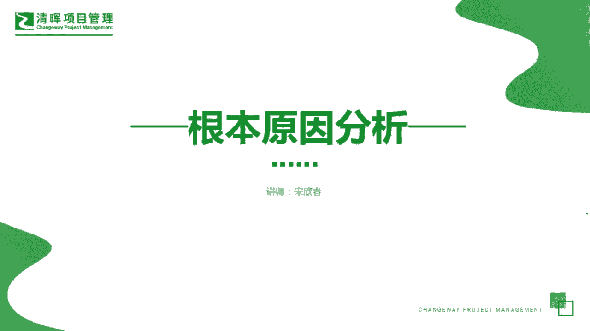
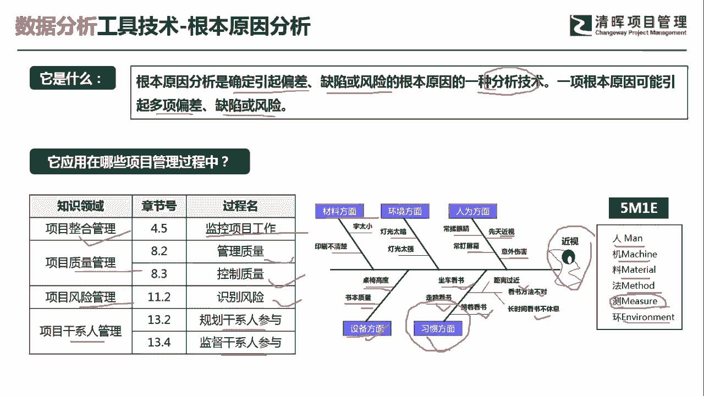
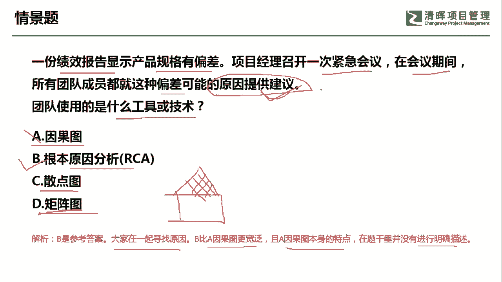

# 超全项目管理实战工具~收藏不亏，总会用得上 - P7：根本原因分析 - 清晖Amy - BV1rG4y1k7Rb

🎼。

各位同学大家好，我是宋老师。今天我们来看根本原因分析这个工具。

根本原因分析呢它是确定引起偏差、缺陷或风险的根本原因的一种分析技术。一项根本原因可能会引起多项的偏差、缺陷或者风险。根本原因分析呢一般是抓一个点，它跟这个大多数原因主要原因不太一样。

主要原因呢它主要是把很多的原因拿出来之后，抓住个别的。比如说两三个，这个叫主要原因。所以它和根本原因还是有很大的不同的。那根本原因呢，这个工具它会在整个管理的监控项目工作当中使用。

在质量管理的管理质量和控制当中使用。那风险管理的识别风险的时候，也会识别根本原因。在干线源管理的过程当中呢？比如说规划干线源的参与，监督干线的参与啊，你要发现某些偏差。它为什么这个非常不支持这些项目。

你要去找根本原因。好，我们来举个例子来了解一下这个根本原因的一些使用方法。根本原因分析呢它是一个数据的分析工具。在根本原因分析的过程当中呢，我们会用到一个鱼骨图这种形式呢来展现根本原因分析的一个过程啊。

比如说我们右边的这个图呢就是一个鱼骨图的形式。鱼骨图呢有时候也叫做因果图，或者叫做石川图，因为实川的实川，它是一个日本石川新的，它是一个日本人的名字，那他发明的这个鱼骨图啊，也叫做石川图。

还有呢就是叫做YY图。Y呢就是为什么为什么多问几个，为什么你就能发现根本原因了。鱼骨图这个地方呢，它是站在不同的维度去寻找它的这个引起近视的这个根本原因。比如说材料的方面，这个字是不是太小了。

印刷还是不清楚的问题。然后环境方面呢，有可能是灯光比较暗，或者灯光太强了，都对眼睛会有影响。在人为的方面呢，经常是不是揉眼睛或者经常盯着屏幕不眨一眨啊，或者它本身有先天的近视，或者受到意外的伤害。

这是站在人为的方面。但另外站在一些设备的方面呢，比如说这个桌椅的高度。会不会影响到他的这个看书的这个这个这个效果。还有呢书本的质量，比如说我们现在书本的这个纸都有这种防近视的啊优质的这种纸的质量。好。

还有习惯方面，比如说这个人他是不是习惯于坐车看书，坐车看书呢？有可能车厢经常抖动，眼睛呢非常容易疲劳，走路是不是容易看书？还有躺着看书啊，距离过近啊，看书的方法不对，或者长时间看书之后没有休息。

导致了近视，这些呢都可能会引起近视。那哪一个方面是引起近视的根本原因呢？你在这个当中就会去判定了啊，这个只不过呢是给大家一个参考。其实呢这个是我们在制造行业当中经常用用到的这个鱼骨图。

它主要是从人的方面，机器的方面，这个里面就是指设备的方面，材料的方面，这个是这个我们字这个是不是太小啊，印刷不清楚方法的方面，测试的方面，还有环境的方面，人机量法环。那我们这个地方呢增加了一个测试。

就是你的测试方法是不是有问题。总之呢你通过这个鱼骨图因果图的这种方式呢，你可以发现根本原因在哪里？你这样，比如说你找出啊，这个是因为他习惯的问题，这个是导致了他的近视，这是一个根本原因。

然后你再去针对这个根本原因呢去进行改善。好，这个呢就是根本原因的分析的一种方法。

我们从这道前景题来理解根本原因。一份绩效报告显示，产品规格有偏差。项目经理呢召开一次紧急会议，在会议期间，所有的团队成员都就这种偏差可能的原因提供一些建议。好，大家发现偏差之后都提出了建议。

请问团队使用的是什么工具或者技术？他现在是提供了建议，他其实是在进行分析。所以呢。因果图它是一个图形展示，也就是说我们通过根本原因分析之后。会得出因果图或者鱼果图。但是呢我们这个时候呢。

情景当中他提出的是建议他其实是在进行分析过程中。所以呢我们不能选因果图，可以选择的是根本因分析。散点图它主要强调的是两个因素之间的关联性。比如说学生的这个呃休息时间和他的这个身高之间是不是有关联性？

那这个可以用散点图。三点图呢一般是代表两个因素之间的关联。矩证图不太一样，矩证图呢是代表。引起一个因素的变化。由哪些因素所引起啊，就是引起因素变化的结果和哪些因素之间有关系。

所以呢它是一个结果和多个影响因素之间的关联性。所以呢这个叫矩证图。比如说我们经常用到的这个这个。质量当中有一个叫做。质量屋它就是把客户的一些需求呢转化成我们的这个关键质量点。

然后你去寻找这个关键质量点和哪些客户的需求之间有关联性啊，这个是矩阵图经常用到的。所以呢我们这道题目呢从前景来看，应该是选择根本原因分析。因为是大家一起在寻找原因。而且呢根本原因分析呢。

它这个比因果图呢更加宽泛。因果图它也有本身的一个特点。这个我们在题干当中是没有进行描述的。如果这道题目把它改成。我们现在呢提供建议之后，大家。展示了这个建议的一些图形啊。

或者说我们通过一些图形去发现这个引起偏差的根本原因。那这个时候呢我们就可以用作因果图了。好，今天呢主要和大家分享的是根本原因分析这个工具，我们下次再见，谢谢大家。

🎼。