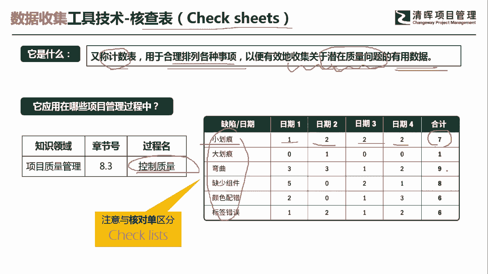
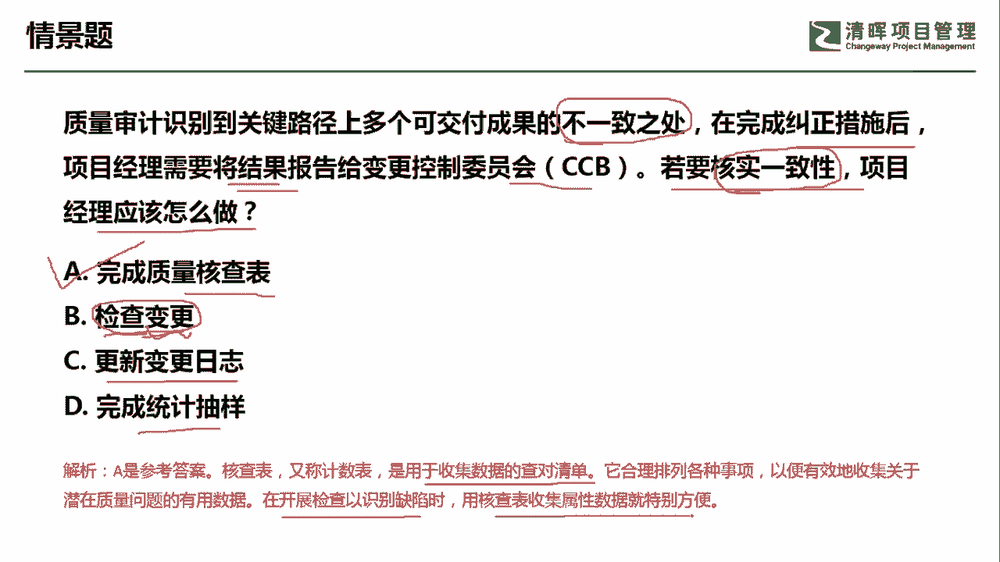

# 超全项目管理实战工具~收藏不亏，总会用得上 - P10：核查表 - 清晖Amy - BV1rG4y1k7Rb

🎼。

各位同学大家好，我是宋老师。今天我们来看核查表这个工具。核查表呢它的英文叫check sheet。

它是又称为技术表，主要是用于合理的排列各种事项，以便有效的搜集关于潜在质量问题的有用数据。它主要是搜集潜在质量问题的一个表格。所以呢这个核查表它会在质量管理的控制质量过程中使用。但是我们要注意的。

它和checklist有什么样的区别？checklist其实呢主要是。起到一个提醒作用。主要就是问你该做的事情有没有做，有没有打勾，这个叫核对单。核查表呢更多的是看你做的结果怎么样。

比如说我们右边的这张图，这就是一个核查表的概念，它可以去发现各个缺陷，出现的这个日期，比如说小划痕，我们在日期一这一天出现了几次，出现几次，出现几次。然后最后呢得到了一个汇总。这个呢就是核查表。

看你做的好不好，也有没有出现一些缺陷，会把它记录下来。

我们来看这样一道题。质量审计识别到关键路径上多个可交互成果的不一致之处。在完成纠正措施之后，项目经理需要将结果报告给变更控制委员会CCB若要核实一致性、核实一致性，项目经理应该怎么做？应该怎么做？

他要核实一致性，就是看你有没有。出现这个不一致之处，也就是说有没有出现缺陷。A选项完成质量核查表。哎，正好我们可以用上去检查一下它有没有跟我们的可加物成果有没有不一致。B选项叫做检查变更。

检查变更主要是检查变更的流程啊，以及它的这个流程的结果。但是呢我们这一题呢很显然它已经完成了这个纠正措施。它已经走完了这个变更流程，它不需要去检查变更流程本身了。因此我们不需要去检查变更。

同样一般的我们也不会有这种选项出现，就是什么意思呢？检查一般是检查了可交付成果，不会去检查变更，只会去检查什么去审查一下变更日志。好，C选项更新变更日志。这个变更日志呢。

它确实是要在这个纠正措施之后去进行更新。但是呢我们这个时候目标是要核实一致性，核实一致性。他不是要查这个变更日志表了，它不是输出的，不是变更日志表了。所以我们应该是考虑核查表去核实一致性。

完成统计抽样统计抽样的使用，它一般是我们需要通过小样本来推算出母总体的一个情况。同样我们这道题目当中也没有出现这个样本的一种描述。因此呢我们这一题呢应该选择A选项，完成质量核查表。搜集数据的核对清单。

在开展检查识别缺陷时，用核查表搜集属性数据就特别方便。好，这里面会留一道题给到大家去思考。就是我们用完这个核查表之后，接下来会用什么表格去展现这个核查表的一个结果。好。

今天呢主要和大家讲的是核查表这个工具，我们下次再见，谢谢大家。

🎼。