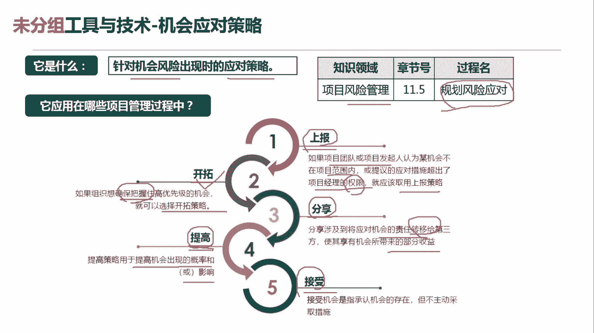
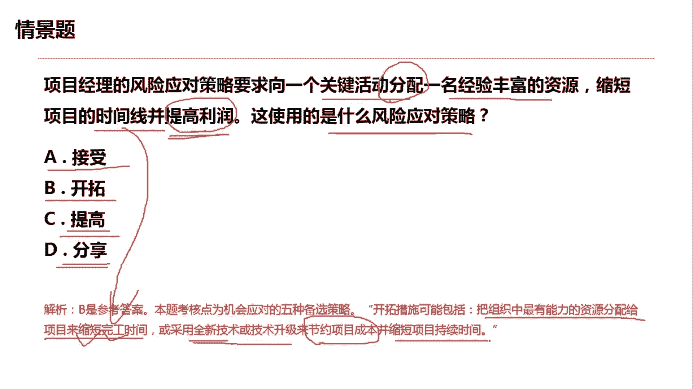

# 超全项目管理实战工具~收藏不亏，总会用得上 - P12：机会应对策略 - 清晖Amy - BV1rG4y1k7Rb

🎼。

各位同学大家好，我是宋老师。今天我们来看机会应对策略。

机会应对策略呢主要是应对机会的风险出现时的一些应对策略。它主要是在风险管理的规划风险应对过程中所使用。因为我们是要考虑有哪些机会的应对策略，所以它属于规划过程组。机会应对策略呢它有5种应对。

一种呢叫做上报。第二个呢叫开拓。第三个叫做分享。第四个叫提高。第五个叫做接受。其中上报策略和接收策略呢，它和威险的应对策略当中是一样的啊，因为危险的应对策略当中也有上报和接受。我们先来看上报。上报呢。

它是如果项目团队或者发起人认为某机会不在项目范围内或者提议的应对措施超出了项目经理的权限。那么在这种情况下，我就应该采取上报策略。但一旦上报之后呢，我项目经理其实就不用管这个机会了。

所以它和接收策略不太一样。接收策略当中有一个叫做被动接收。被动接收呢，我还是要对它进行监督的，不像上报，连监督都不用监督。那么接收策略当中呢，还有一个主动接收。主动接收呢，它是会准备一些应急储备。

准备一些备选方案来接收这个机会所带来的这种影响。好，另外呢三种呢，一个是开拓。开拓策略呢，它是如果组织想确保把握住高优先级的机会，就可以选择开拓策略。它要确保把握。所以是百分之百的去拿下这个机会。

因此呢他一般会把组织当中最有能力的资源去拿出来用，或者呢采用一些新技术新方法去抓住这样的机会。分享策略。他是。涉及到将应用机会的责任。转移给第三方。使其享有机会所带来的部分收益。

所以它和威胁应对策略当中的这种这个转移是对应的。因为转移呢他是把威胁转移给第三方的保险公司，由他们来承担。这个威胁带来的一些损失。但是分享不一样，分享是和大家一起去挣钱。

他是把这种机会呢也是转移给第三方。由第三方合作采取这个收益。所以呢他一般会采用一些联合公司啊、合伙人的这种机制形式。第四种呢叫做提高提高策略呢，它主要是用于提高机会出现的概率或者影响。

提高他一般是增加资源，用增加资源的方式呢去提升机会发生的概率。因此呢，它和这个威胁应对策略当中的这个减轻措施也是对应的。因为减轻措施呢，它往往是减轻威胁所带来的一些损失。比如说它会用这个呃原形法呀。

或者说多次的测试啊来去发现一些风险，减轻一些影响。好，所以这个是提高的特点，提高特点，增加资源。

我们来看这样一道题，项目经理的风险应对策略是要求像一个关键活动分配移民经验丰富的资源，缩短项目的时间线，并提高利润。这使用的是什么风险应对策略呢？首先我们看到它呢是提高利润的，所以它一定是一个机会。

它不会是一个威胁。因为威胁呢往往是带来一些损失。接收策略。刚才我们说了接收策略呢，它分主动接收和被动接收。如果是主动接收，它往往是准备一些应急储备，或者呢一些这个延长呃这种这个进入时间啊等等这种方式。

但是我们这道题目很显用不到这个接收策略。开拓开拓它是可以去这个分配关键的这个资源。然后呢这个缩短我们的这个时间线，提高利润，采取一些新的技术。

这个开拓是可以对应我们的这个行径提高提高呢它主要是增加资源啊，我们这个里面是分配资源。它增加资源呢，它是需要。提升这个机会，抓住它的概率啊，这个题目呢他没有提到提高的一些应用场景。

分享呢它主要是把机会带来的收益呢分享给第三方啊，建立合伙人的这种机制形式。因此呢也不符合我们的情景描述。因此呢这道题目呢我们是应该选择开拓。开拓。

它主要是把组织当中最有能力的资源分配给项目来缩短完工时间。啊，缩短完工时间，缩短时间线。或采取一些全新的技术或者技术升级来节约项目的成本，并且缩短项目的持续时间。因此呢我们这一题呢是选择开拓这个工具。

好，今天呢主要是和大家分享的是机会的应对策略，我们下次再见，谢谢大家。

🎼。

