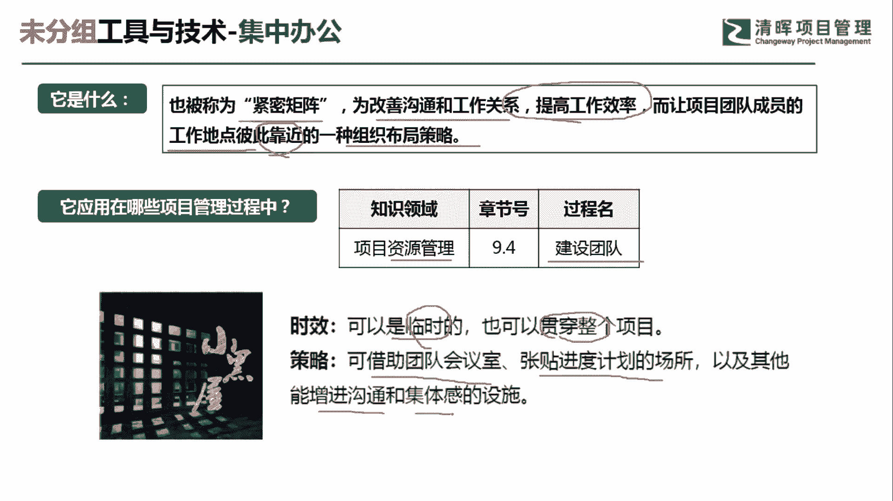
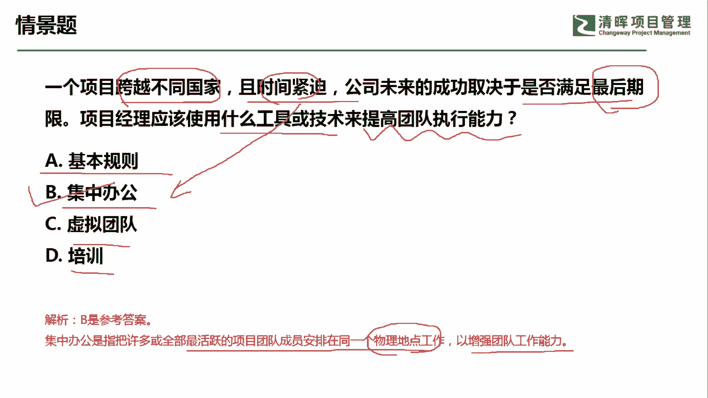

# 超全项目管理实战工具~收藏不亏，总会用得上 - P14：集中办公 - 清晖Amy - BV1rG4y1k7Rb

🎼。

各位同学大家好，我是宋老师。今天我们来看集中办公这个工具，集中办公也被称为警密矩阵。它是为改善沟通和工作关系，提高工作效率，而让项目团队成员工作地点彼此靠近的一种组织布局策略。

这个集中办公呢，它往往是在资源管理的建设团队过程中使用。为什么在建设团队过程中使用呢？因为我们建设团队主要的目的就是要打造一支高绩效的团队。让我们提高一些工作效率。像这种集中办公呢就是一个不错的工具。

集中办公呢，它从时效性上来讲呢，可以是临时的，也可以是贯穿整个项目生命周期。像我们有时候呢邀请外部的一些这个开发团队进入到公司中来。那么他们呢就属于一种外包团队。

有时候呢我们就会用集中办公的方式把他们组织在一起。所以呢我们可以借助团队的会议室张贴进度计划的一些场所，以及其他能增进沟通和集体感的一些设施。我们可以看到在集中办公的场地呢，往往。首先。

成员基本上是同一个团队。另外呢我们在他的这个墙壁上啊，这些可看的这些地方呢，都可以看到一些标语啊，或者是这个进度甘特图的这种表现。那这种呢其实就是一个集中办公的这个场所。他可以去增进沟通。

可以去满足一些集体感。所以他相对于这个虚拟团队来说呢，他从这个团队的凝聚力上来讲更加这个优胜。另外呢，集中办公往往是在这个我们遇到一些里程碑快要接近的时候，遇到一些紧急情况的时候。

这个时候呢往往用集中办公效果会更好。

我们来看这样一道题，一个项目跨越不同的国家，且时间紧迫。公司未来的成功取决于是否满足最后的期限。项目经理应该使用什么工具和技术来提高团队的执行能力。一个项目快于不同的国家，那有可能他是一个虚拟团队。

但是呢它时间紧迫，公司未来呢成功就取决于你是否能满足最后的这个交付期限。那这这这种情况下属于紧急的。这种情况，那我们宁可呢。让大家买飞机票都集中在一起，提高工作效率啊。A选项。

基本规则基本规则它是在我们管理团队的时候遇到冲突的时候，有时候呢会有一些基本规则来制约这种大家的这种处理方式处理问题的方式。比如说会考虑到冲突管理它的一些流程啊，这些大家都会默认的一些规则。

但是呢我们这道题目主要是讲虚拟团队遇到时间紧迫，要在最后期限交付，那应该怎么办啊，这个情景怎么办？那肯定不能用基本规则，基本规则往往是遇到冲突的时候再去使用，集中办公可不可以集中办公可以，为什么呢？

因为它遇到。时间紧迫。日期即将来临的这种情况，我们可以用集中办公提高工作效率。虚拟团队呢虽然我们这道题目他讲到跨越不同的国家，它其实本身就是一个虚拟团队做的一个项目。但是呢因为时间紧迫。

所以呢你不可能再用虚拟团队的这种方式。所以你要改变工具。培训。培训往往是在我们情景当中说明你缺乏某一类技能的时候，我们可以用培训的方式。好，这道题目呢我们应该是选B选项。

集中办公是指把许多或者全部最活跃的团队成员安排在同一个地点，物理地点工作，以增强团队的工作能力，还可以提高沟通的效率。这一题呢我们是选。B选项。好，今天呢主要和大家分享的是集中办公这个工具。

我们下次再见，谢谢大家。

🎼。

