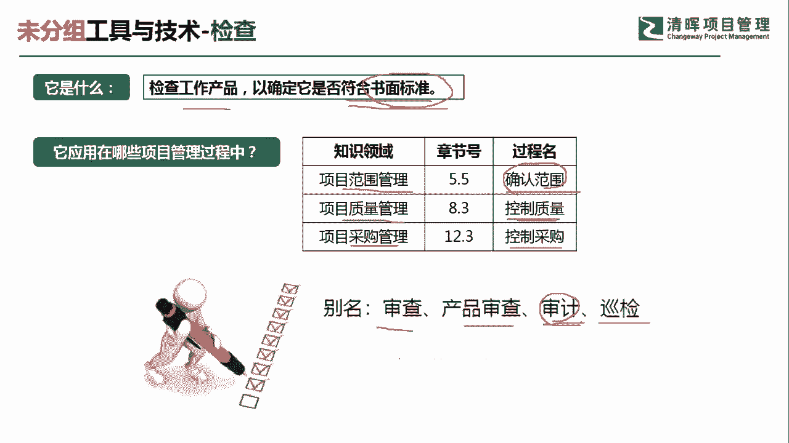
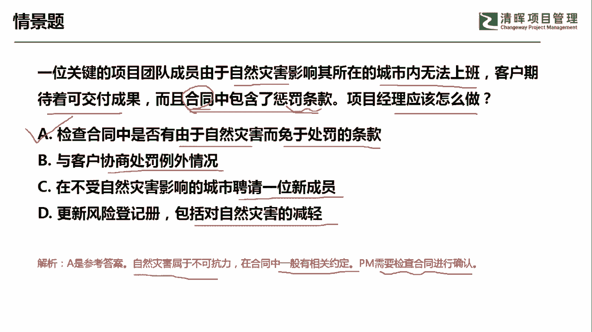
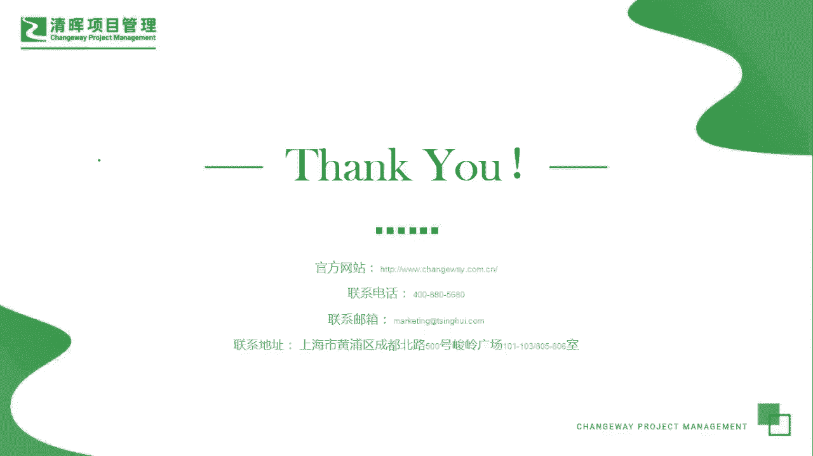

# 超全项目管理实战工具~收藏不亏，总会用得上 - P16：检查 - 清晖Amy - BV1rG4y1k7Rb

🎼。

哎，大家好，我是宋老师。今天我们来看检查这个工具。

检查的英文单词呢叫inspection，它主要是检查工作产品，以确定它是否符合书面的标准。其实它就是对照书面的标准来检查你是否符合他的这个需求。检查这个工具，在范围管理的确认范围过程中会使用。

在质量管理的控制质量过程中也会使用。但是呢它所产生的效果是不一样的。这个确认范围当中使用检查呢主要是看你的该做的事项有没有做完，有没有漏像。它主要是从范围的角度去看你该做的事情有没有做完。

但是在控制质量过程中，我们用检查呢主要是检查你的产品有没有缺陷，有没有达到它的质量标准。所以在控制质量过程中也会用检查。另外在采购管理知识领域当中呢，我们在控制采购过程中也会用到检查这个时候呢。

我们就是检查的这个供应商的，它的这些可教服务是否符合我们的书面标准，是否符合我们合同当中的一些规定。有时候检查也翻译成。审查产品巡查、审计和巡检。当然了，我们主要的还是要看它的英文描述。

它的英文呢叫inspection。因为什么呢？像审计，我们有专门的英文叫做audit。那audit其实和inspection有很大的区别。audit呢主要是看你的过程政策流程是否遵守。

但是呢inspection不一样。inspection检查主要是看你的质量结果，看你该做的事情有没有做完啊，这是两个不同的这个概念。

我们具体来看这样一道题。一位关键的项目团队成员由于自然灾害影响其所在城市内无法上班，客户期待着可交付成果，而且合同中包含了惩罚条款，项目经理应该怎么做应该怎么做。这个题目呢从情境当中我们发现呢。

他现在呢是有这个合同，有这个合同呢，说明这道题目呢肯定是采购题。肯定是采购体。现在由于自然灾害而导致你没法上班。现在呢客户又期待着这个可交务成果。

这个合同当中是规定了惩罚条款的意思就是你没有达到他的要求，他会给予你的惩罚。那我们该怎么办？如果遇到采购题，遇到这种。这种客观的情况不能导致上班。那我们首先应该去看合同当中有没有这种这个规避条款啊。

也就是说，检查合同当中是否有由于自然灾害而免于处罚的条款。其实这个就是免责条款。如果他有，那就说明呢我们不需要去承担这样的自然灾害的后果。B选项与客户协商处罚的例外情况。你与客户协商处罚的例外情况呢。

也是需要先看一下合同当中是否有这种自然灾害情况下免于处罚的情这个条款情况。C选项在不受自然灾害影响的城市，聘请一位新成员，这个是相当于一种应对措施了。他只是可能性而已。不是必然性。D选项更新风险的预测。

包括对自然灾害的减轻，这个呢也是具体的一个应对措施了。他是先要看合同当中的条款，然后呢再去讨论我们是不是有相应的替代方案去解决。因此呢我们这道题目呢应该是选择A选项。因为自然灾害呢它属于不可抗力。

在合同当中一般是有相关的规定的。我们项目经理呢需要先检查合同进行确认。再去和客户进行协商，从而呢选择一定的补救措施。好，我们这题呢选A选项。今天呢主要和大家分享的是检查这个工具，我们下次再见，谢谢大家。

🎼。