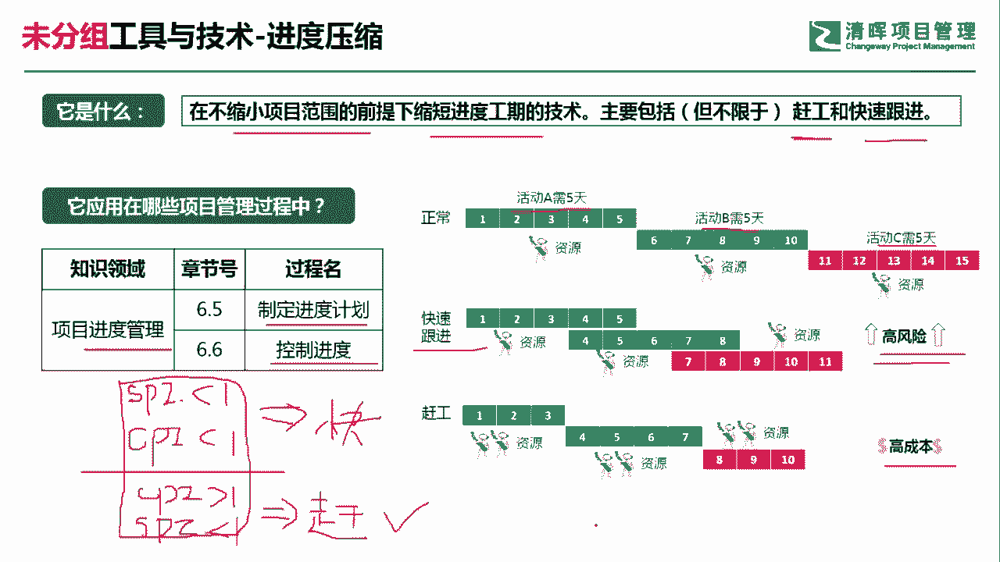
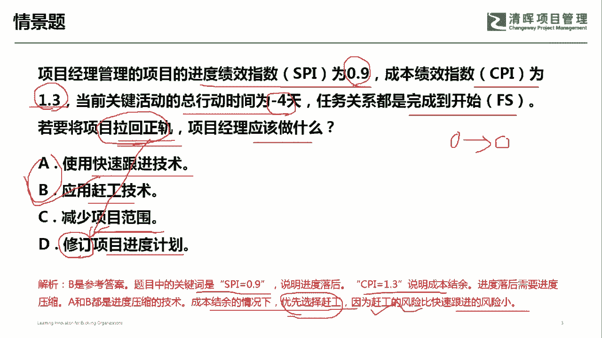

# 超全项目管理实战工具~收藏不亏，总会用得上 - P18：进度压缩 - 清晖Amy - BV1rG4y1k7Rb

🎼。

各位同学大家好，我是宋老师。今天我们来看进度压缩这个工具。

什么是进度压缩呢？它是指在不缩小项目范围的前提下，缩短进度工期的一个技术。主要包括但不限于赶工和快速跟进。当然了，主要还是赶工和快速跟进。

进度压缩技术呢主要也是在进度管理知识领域当中的制定进度计划和控制进度过程中所使用。那什么是赶工？什么是快速跟进呢？赶工主要就是增加这个资源，增加这个成本。它其实呢就是拿资源和成本去换时间。

比如说我们经常所说的这种加班，就是属于赶工的一种形式。那他要付加班费啊，或者说这个要进行一些激励啊，这个拿成本换时间，他有没有风险，当然也有。快速跟进是什么意思呢？快速跟进它是。不去增加资源的前提下。

他呢把多个活动呢由原来的这种串行改成并行开展。那比如说我们正常的活动，我们可能是需要这个A活动需要5天。B活动呢需要5天，C活动需要5天。那如果是这个快速跟进的话。

那其实呢就是把这个A活动和B活动呢把它叠加起来，包括C活动一起叠加起来。这个是并行开展。那并行开展呢，同样也可以去对于进度呢进行这个压缩。但是呢它产生了一个后遗症，就是。会产生一些高风险啊。

刚才我们所说的这个赶工它有没有风险，也会有风险。但是赶工的风险呢相对于快速跟进会小一点，那它也是会产生成本的。那这种这个快速跟进和赶工呢经常会怎么样去考呢？它一般会结合政治管理当中的两个指数。

一个是CSPI。一个呢是CPI结合起来。如果这道题目告诉你。SPI小于。CPI也小于，这说明什么？进度落后，成本超支。所以在这种情况下呢，我没有资源，没有钱，那你只能用什么，只能用快速跟进。

如果呢这个时候他告诉你这个CPI这个时候呢是大于一的。当然了，它SPI还是小于呀，SPI还是小于一，说明呢进度还是落后的。但是呢它好歹这个成本还是有结余的。所以呢它可以怎么样可以拿这个成本去换时间。

拿成本去换时间。这个时候呢我们建议呢就是选赶工了。如果这道题目呢没有SPI和CPI。他只是问你这个进度现在落后，我怎么样去赶进度，那你呢优先选择赶工，因为赶工相对于快速跟进来讲，他的这个风险会小一点啊。

这也是一个经常会用的一些措施。

好，我们具体来看这样一道题。项目经理。管理的项目进度绩效指数啊，这个你们看见了SBI是0。9，说明进度落后。成本绩效指数CPI呢是1。3，说明呢这个成本有这种结余。当前关键活动的总行动的时间是-4天。

任务关系都是完成到开始的关系，就前面一个活动完成了，后面一个活动紧接着开始。若要。将这个项目拉回正轨，问项目经理应该做什么？拉回正轨。其实呢就是说拉回你的这个基准啊，比如说我们的进入基准。

你要拉回这个基准。A选项使用快速跟进技术行不行？快速跟进技术呢，它其实风险是比较大的。风险是比较大的。在这种情况下呢。我们呢是不建议用这个方式啊。B选项应用赶工技术。赶工。我们这个时候呢。

因为CPI是1。3，说明我们还是有成本的，有资源的那我们可以去购买这个新的资源，或者呢采用加班附加班配的方式，这个可以优先考虑。C选项减少项目的范围，这是不建议的啊，这是属于一种风险的规避策略。

减少范围风险，减少风险。啊，减少范围。这是不建议的啊。D选项修订项目进度计划，因为他现在要拉回正轨，所以呢根本就不存在修订进入计划这一说啊，它只是要维护原来的进度基准。因此呢我们这道题目呢是选赶工赶工。

因为你发现进度落后，成本有结余。这个进度落后需要进度压缩，那A和B呢都是属于进度压缩技术。在成本有结余的情况下，我们优先选赶工，因为赶工的风险呢相对于快速跟进，风险会小一点。好，我们这一期呢选B选项。

今天呢主要和大家分享的是这个进度压缩技术，我们下次再见，谢谢大家。

🎼。