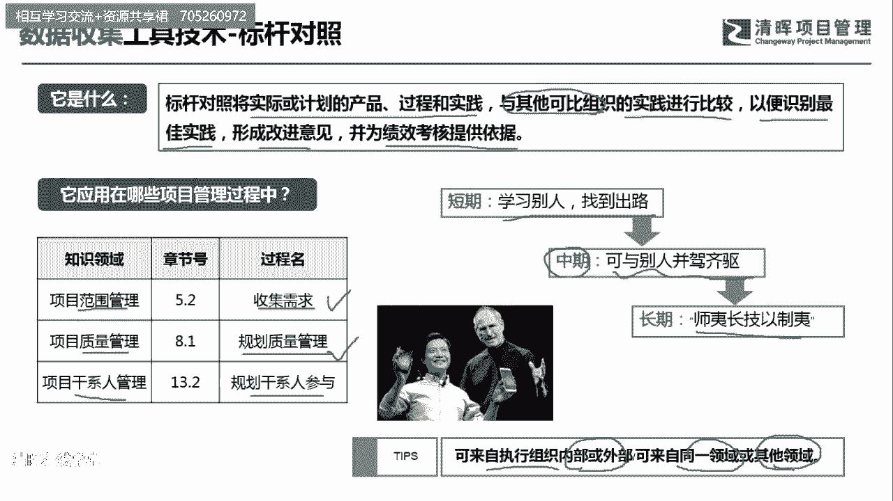
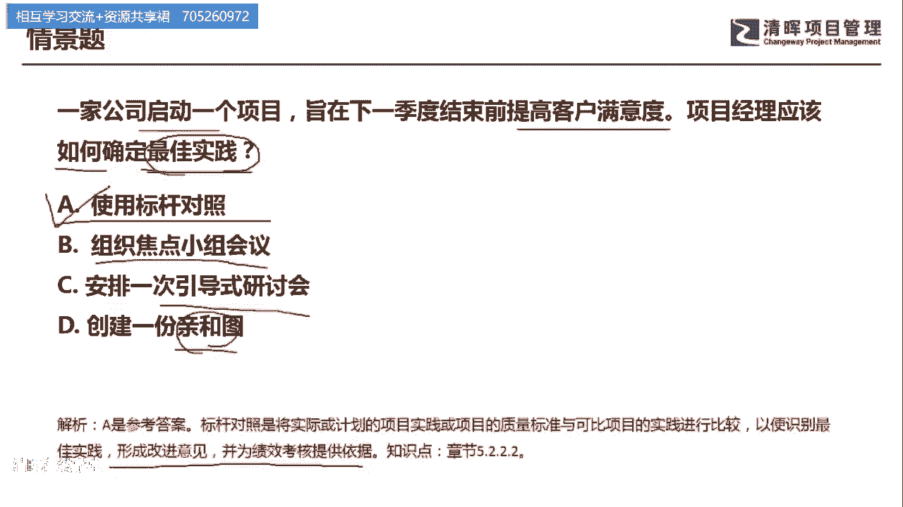

# 超全项目管理实战工具~收藏不亏，总会用得上 - P1：1.标杆对照 - 清晖Amy - BV1rG4y1k7Rb

🎼。

大家好，我是宋老师。今天我们来看标杆对照这个工具。

标杆对照，它是将实际或者计划的产品过程和实践与其他可比组织的实践进行比较。它是学别人啊，或者是从这个内部都可以去学习学习什么呢？以便识别最佳的实践，形成改建的意见，并为绩效考核提供一个依据。

所以呢它是学习的是内外部的一种最佳实践。标杆对照它在范围管理的搜集需求过程中会经常会用到，这也是PNP考试的一个重点。另外呢，在质量管理的规划质量管理过程中，我们要考虑到质量的一个标杆。

那也会用到标杆对照。另外，在干系人管理的规划，干系人参与的过程中，你要去学习优秀的干系人参与管理的一些这个策略。那也是可以去用标杆对照。我们在生活当中有经常遇到标杆对照这样的例子。

就是经常看到的这个小米手机呢，它一开始其实它的研发，包括它的营销策略都是学习的是乔布斯的这个苹果手机。短期内呢它是用互联网营销的这种方式学习别人找到出路。那一开始出现的这这个手机型号是S1。

那现在呢他的这个手机呢已经达到了可以与苹果并驾齐驱的这样一个高度。他的长期发展呢就是适宜长技以质宜，能够。超越别人，并且呢能够这个不断的去完善自我。这个呢标杆对照，第一个就是执行组织内部或者外部的。

这种标杆都可以去学习，也可以是来自同一领域或者其他领域的标杆。那其他领域呢这个有时候就是跨行业的学习啊，比如说大家都在学习稻盛和夫，那他的经营理念，他的个人哲学，这都是可以形成一种标杆。

我们来看具体的一道题。一家公司启动一个项目，只在下一季度结束前能提高客户的满意度。项目经理应该如何确定最佳实践？这道题目呢比较明显，你看到最佳实践，基本上就要知道我们可以用什么工具呢？

应该如何确定大部分考的也是工具啊，A选项使用标杆对照，它是可以对照这个对最佳实践的。B选项呢组织焦点小组会议。焦点小组会议的主要特点呢，它是了解这个干系人的一些期望和态度。啊。

有一个主持人去引导这样的这个会议。安排一次引导师演讨会，引老师演讨会呢和教练小组同样也需要一个主持人。但是呢引导师演讨会更多的是引导大家达成目标的一致。所以呢他有他专门的适用情景。D选项创建一份亲和图。

亲和图呢是在我们头脑风暴之后，对于头脑风暴的结果进行归纳总结，进行分组。那它是归纳总结分组的。因此呢我们这道题目呢应该是站在标杆对照的角度那学习最佳实践。形成改进意见，并为绩效考核提供一个依据啊。

这题选A选项。今天呢主要和大家分享的是标杆对照这个工具，我们下次再见，谢谢大家。

🎼。